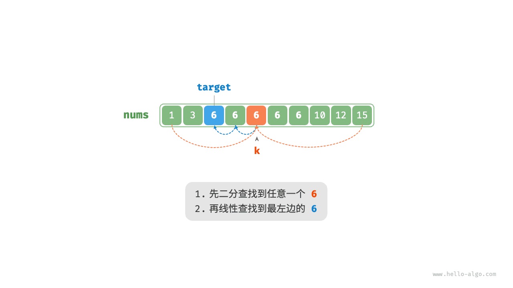
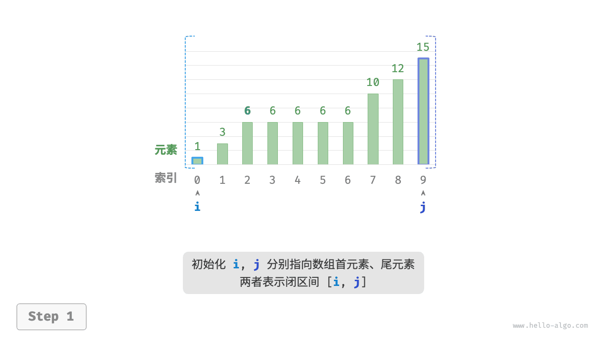
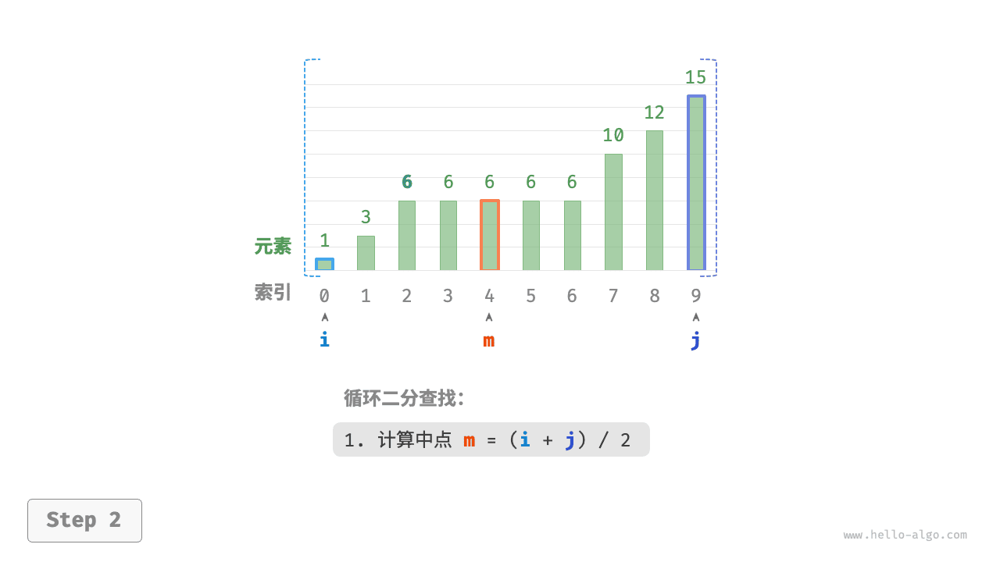
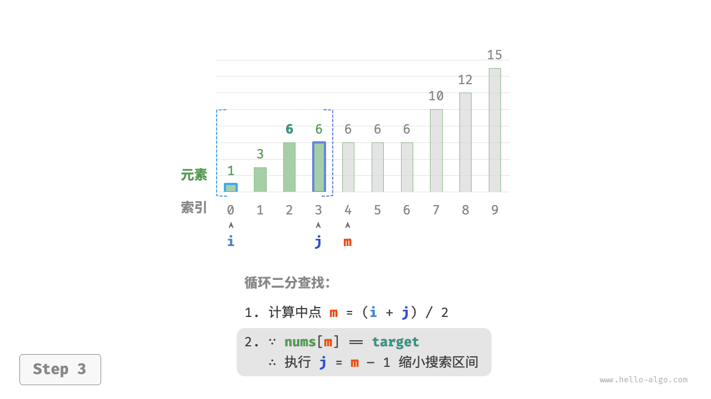
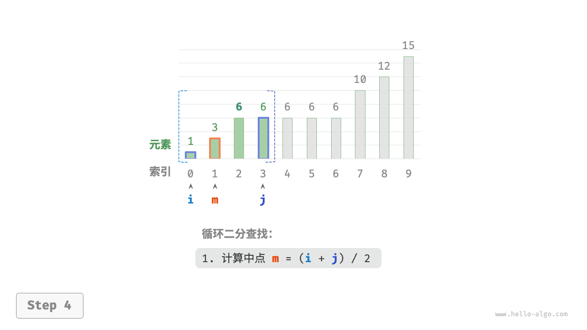
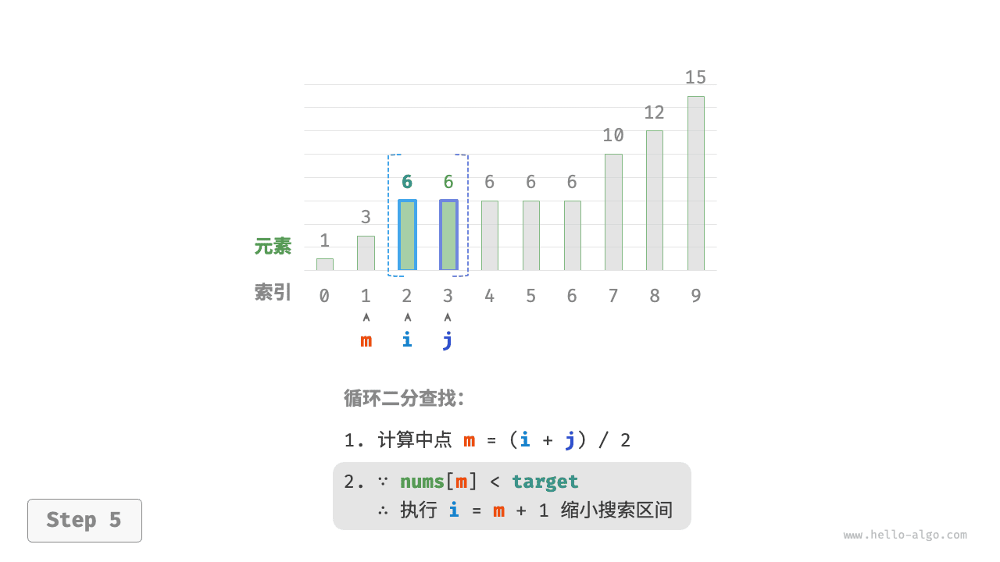
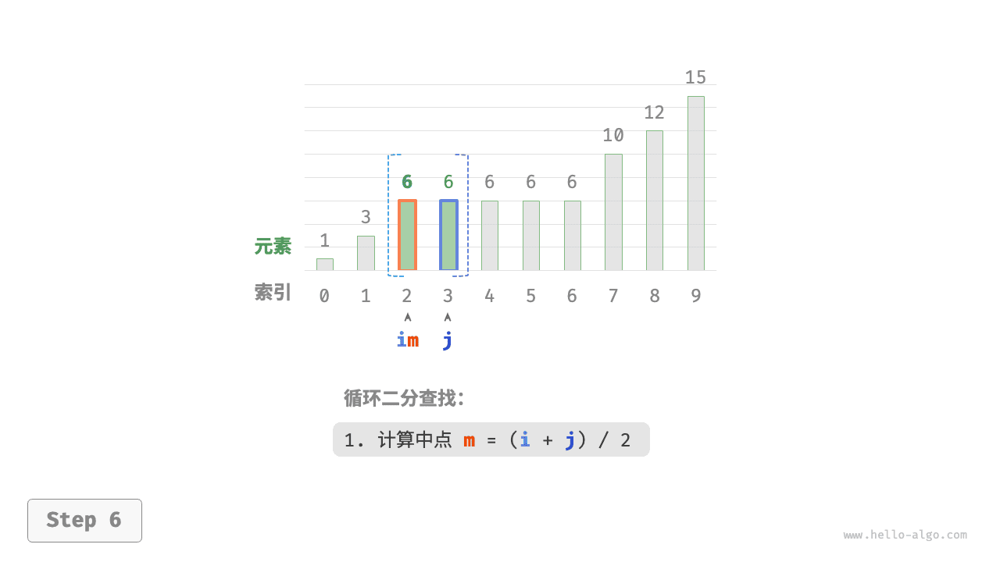
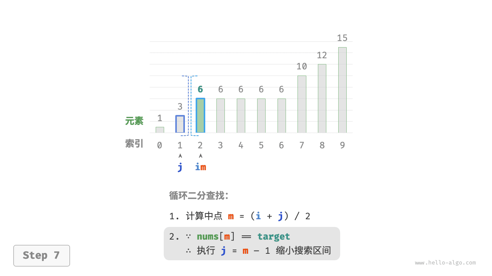
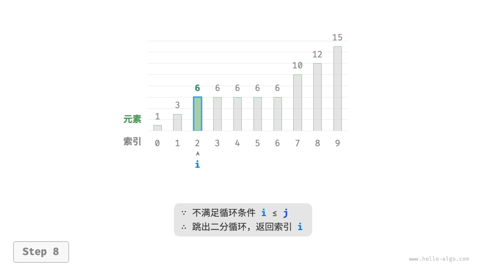

# 二分查找插入点｜存在重复元素的情况

> 来源：[krahets 与《Hello 算法》开源贡献者](https://www.hello-algo.com/chapter_searching/binary_search_insertion/)  
> 许可：[CC BY-NC-SA 4.0](https://creativecommons.org/licenses/by-nc-sa/4.0/)  
> 语言：原生简体中文  
> 版本：69932aed1891a7b7f6a0de88cd116d3fe13e7032  
> 署名：原作《Hello 算法》，作者 krahets 及开源贡献者。  
> 使用限制：仅限实验室内部、个人学习与其他非商业用途；改编内容须保持相同许可。

## 存在重复元素的情况

!!! question

    在上一题的基础上，规定数组可能包含重复元素，其余不变。

假设数组中存在多个 `target` ，则普通二分查找只能返回其中一个 `target` 的索引，**而无法确定该元素的左边和右边还有多少 `target`**。

题目要求将目标元素插入到最左边，**所以我们需要查找数组中最左一个 `target` 的索引**。初步考虑通过下图所示的步骤实现。

1. 执行二分查找，得到任意一个 `target` 的索引，记为 $k$ 。
2. 从索引 $k$ 开始，向左进行线性遍历，当找到最左边的 `target` 时返回。



此方法虽然可用，但其包含线性查找，因此时间复杂度为 $O(n)$ 。当数组中存在很多重复的 `target` 时，该方法效率很低。

现考虑拓展二分查找代码。如下图所示，整体流程保持不变，每轮先计算中点索引 $m$ ，再判断 `target` 和 `nums[m]` 的大小关系，分为以下几种情况。

- 当 `nums[m] < target` 或 `nums[m] > target` 时，说明还没有找到 `target` ，因此采用普通二分查找的缩小区间操作，**从而使指针 $i$ 和 $j$ 向 `target` 靠近**。
- 当 `nums[m] == target` 时，说明小于 `target` 的元素在区间 $[i, m - 1]$ 中，因此采用 $j = m - 1$ 来缩小区间，**从而使指针 $j$ 向小于 `target` 的元素靠近**。

循环完成后，$i$ 指向最左边的 `target` ，$j$ 指向首个小于 `target` 的元素，**因此索引 $i$ 就是插入点**。

=== "<1>"
    

=== "<2>"
    

=== "<3>"
    

=== "<4>"
    

=== "<5>"
    

=== "<6>"
    

=== "<7>"
    

=== "<8>"
    

观察以下代码，判断分支 `nums[m] > target` 和 `nums[m] == target` 的操作相同，因此两者可以合并。

即便如此，我们仍然可以将判断条件保持展开，因为其逻辑更加清晰、可读性更好。

```src
[file]{binary_search_insertion}-[class]{}-[func]{binary_search_insertion}
```

!!! tip

    本节的代码都是“双闭区间”写法。有兴趣的读者可以自行实现“左闭右开”写法。

总的来看，二分查找无非就是给指针 $i$ 和 $j$ 分别设定搜索目标，目标可能是一个具体的元素（例如 `target` ），也可能是一个元素范围（例如小于 `target` 的元素）。

在不断的循环二分中，指针 $i$ 和 $j$ 都逐渐逼近预先设定的目标。最终，它们或是成功找到答案，或是越过边界后停止。
