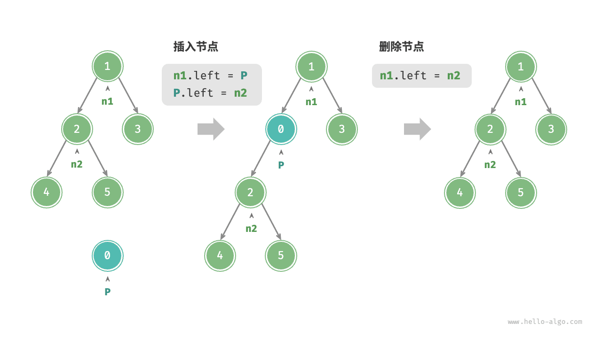

# 二叉树｜二叉树基本操作

> 来源：[krahets 与《Hello 算法》开源贡献者](https://www.hello-algo.com/chapter_tree/binary_tree/)  
> 许可：[CC BY-NC-SA 4.0](https://creativecommons.org/licenses/by-nc-sa/4.0/)  
> 语言：原生简体中文  
> 版本：69932aed1891a7b7f6a0de88cd116d3fe13e7032  
> 署名：原作《Hello 算法》，作者 krahets 及开源贡献者。  
> 使用限制：仅限实验室内部、个人学习与其他非商业用途；改编内容须保持相同许可。

## 二叉树基本操作

### 初始化二叉树

与链表类似，首先初始化节点，然后构建引用（指针）。

=== "Python"

    ```python title="binary_tree.py"
    # 初始化二叉树
    # 初始化节点
    n1 = TreeNode(val=1)
    n2 = TreeNode(val=2)
    n3 = TreeNode(val=3)
    n4 = TreeNode(val=4)
    n5 = TreeNode(val=5)
    # 构建节点之间的引用（指针）
    n1.left = n2
    n1.right = n3
    n2.left = n4
    n2.right = n5
    ```

=== "C++"

    ```cpp title="binary_tree.cpp"
    /* 初始化二叉树 */
    // 初始化节点
    TreeNode* n1 = new TreeNode(1);
    TreeNode* n2 = new TreeNode(2);
    TreeNode* n3 = new TreeNode(3);
    TreeNode* n4 = new TreeNode(4);
    TreeNode* n5 = new TreeNode(5);
    // 构建节点之间的引用（指针）
    n1->left = n2;
    n1->right = n3;
    n2->left = n4;
    n2->right = n5;
    ```

=== "Java"

    ```java title="binary_tree.java"
    // 初始化节点
    TreeNode n1 = new TreeNode(1);
    TreeNode n2 = new TreeNode(2);
    TreeNode n3 = new TreeNode(3);
    TreeNode n4 = new TreeNode(4);
    TreeNode n5 = new TreeNode(5);
    // 构建节点之间的引用（指针）
    n1.left = n2;
    n1.right = n3;
    n2.left = n4;
    n2.right = n5;
    ```

=== "C#"

    ```csharp title="binary_tree.cs"
    /* 初始化二叉树 */
    // 初始化节点
    TreeNode n1 = new(1);
    TreeNode n2 = new(2);
    TreeNode n3 = new(3);
    TreeNode n4 = new(4);
    TreeNode n5 = new(5);
    // 构建节点之间的引用（指针）
    n1.left = n2;
    n1.right = n3;
    n2.left = n4;
    n2.right = n5;
    ```

=== "Go"

    ```go title="binary_tree.go"
    /* 初始化二叉树 */
    // 初始化节点
    n1 := NewTreeNode(1)
    n2 := NewTreeNode(2)
    n3 := NewTreeNode(3)
    n4 := NewTreeNode(4)
    n5 := NewTreeNode(5)
    // 构建节点之间的引用（指针）
    n1.Left = n2
    n1.Right = n3
    n2.Left = n4
    n2.Right = n5
    ```

=== "Swift"

    ```swift title="binary_tree.swift"
    // 初始化节点
    let n1 = TreeNode(x: 1)
    let n2 = TreeNode(x: 2)
    let n3 = TreeNode(x: 3)
    let n4 = TreeNode(x: 4)
    let n5 = TreeNode(x: 5)
    // 构建节点之间的引用（指针）
    n1.left = n2
    n1.right = n3
    n2.left = n4
    n2.right = n5
    ```

=== "JS"

    ```javascript title="binary_tree.js"
    /* 初始化二叉树 */
    // 初始化节点
    let n1 = new TreeNode(1),
        n2 = new TreeNode(2),
        n3 = new TreeNode(3),
        n4 = new TreeNode(4),
        n5 = new TreeNode(5);
    // 构建节点之间的引用（指针）
    n1.left = n2;
    n1.right = n3;
    n2.left = n4;
    n2.right = n5;
    ```

=== "TS"

    ```typescript title="binary_tree.ts"
    /* 初始化二叉树 */
    // 初始化节点
    let n1 = new TreeNode(1),
        n2 = new TreeNode(2),
        n3 = new TreeNode(3),
        n4 = new TreeNode(4),
        n5 = new TreeNode(5);
    // 构建节点之间的引用（指针）
    n1.left = n2;
    n1.right = n3;
    n2.left = n4;
    n2.right = n5;
    ```

=== "Dart"

    ```dart title="binary_tree.dart"
    /* 初始化二叉树 */
    // 初始化节点
    TreeNode n1 = new TreeNode(1);
    TreeNode n2 = new TreeNode(2);
    TreeNode n3 = new TreeNode(3);
    TreeNode n4 = new TreeNode(4);
    TreeNode n5 = new TreeNode(5);
    // 构建节点之间的引用（指针）
    n1.left = n2;
    n1.right = n3;
    n2.left = n4;
    n2.right = n5;
    ```

=== "Rust"

    ```rust title="binary_tree.rs"
    // 初始化节点
    let n1 = TreeNode::new(1);
    let n2 = TreeNode::new(2);
    let n3 = TreeNode::new(3);
    let n4 = TreeNode::new(4);
    let n5 = TreeNode::new(5);
    // 构建节点之间的引用（指针）
    n1.borrow_mut().left = Some(n2.clone());
    n1.borrow_mut().right = Some(n3);
    n2.borrow_mut().left = Some(n4);
    n2.borrow_mut().right = Some(n5);
    ```

=== "C"

    ```c title="binary_tree.c"
    /* 初始化二叉树 */
    // 初始化节点
    TreeNode *n1 = newTreeNode(1);
    TreeNode *n2 = newTreeNode(2);
    TreeNode *n3 = newTreeNode(3);
    TreeNode *n4 = newTreeNode(4);
    TreeNode *n5 = newTreeNode(5);
    // 构建节点之间的引用（指针）
    n1->left = n2;
    n1->right = n3;
    n2->left = n4;
    n2->right = n5;
    ```

=== "Kotlin"

    ```kotlin title="binary_tree.kt"
    // 初始化节点
    val n1 = TreeNode(1)
    val n2 = TreeNode(2)
    val n3 = TreeNode(3)
    val n4 = TreeNode(4)
    val n5 = TreeNode(5)
    // 构建节点之间的引用（指针）
    n1.left = n2
    n1.right = n3
    n2.left = n4
    n2.right = n5
    ```

=== "Ruby"

    ```ruby title="binary_tree.rb"
    # 初始化二叉树
    # 初始化节点
    n1 = TreeNode.new(1)
    n2 = TreeNode.new(2)
    n3 = TreeNode.new(3)
    n4 = TreeNode.new(4)
    n5 = TreeNode.new(5)
    # 构建节点之间的引用（指针）
    n1.left = n2
    n1.right = n3
    n2.left = n4
    n2.right = n5
    ```

??? pythontutor "可视化运行"

    https://pythontutor.com/render.html#code=class%20TreeNode%3A%0A%20%20%20%20%22%22%22%E4%BA%8C%E5%8F%89%E6%A0%91%E8%8A%82%E7%82%B9%E7%B1%BB%22%22%22%0A%20%20%20%20def%20__init__%28self,%20val%3A%20int%29%3A%0A%20%20%20%20%20%20%20%20self.val%3A%20int%20%3D%20val%20%20%20%20%20%20%20%20%20%20%20%20%20%20%20%20%23%20%E8%8A%82%E7%82%B9%E5%80%BC%0A%20%20%20%20%20%20%20%20self.left%3A%20TreeNode%20%7C%20None%20%3D%20None%20%20%23%20%E5%B7%A6%E5%AD%90%E8%8A%82%E7%82%B9%E5%BC%95%E7%94%A8%0A%20%20%20%20%20%20%20%20self.right%3A%20TreeNode%20%7C%20None%20%3D%20None%20%23%20%E5%8F%B3%E5%AD%90%E8%8A%82%E7%82%B9%E5%BC%95%E7%94%A8%0A%0A%22%22%22Driver%20Code%22%22%22%0Aif%20__name__%20%3D%3D%20%22__main__%22%3A%0A%20%20%20%20%23%20%E5%88%9D%E5%A7%8B%E5%8C%96%E4%BA%8C%E5%8F%89%E6%A0%91%0A%20%20%20%20%23%20%E5%88%9D%E5%A7%8B%E5%8C%96%E8%8A%82%E7%82%B9%0A%20%20%20%20n1%20%3D%20TreeNode%28val%3D1%29%0A%20%20%20%20n2%20%3D%20TreeNode%28val%3D2%29%0A%20%20%20%20n3%20%3D%20TreeNode%28val%3D3%29%0A%20%20%20%20n4%20%3D%20TreeNode%28val%3D4%29%0A%20%20%20%20n5%20%3D%20TreeNode%28val%3D5%29%0A%20%20%20%20%23%20%E6%9E%84%E5%BB%BA%E8%8A%82%E7%82%B9%E4%B9%8B%E9%97%B4%E7%9A%84%E5%BC%95%E7%94%A8%EF%BC%88%E6%8C%87%E9%92%88%EF%BC%89%0A%20%20%20%20n1.left%20%3D%20n2%0A%20%20%20%20n1.right%20%3D%20n3%0A%20%20%20%20n2.left%20%3D%20n4%0A%20%20%20%20n2.right%20%3D%20n5&cumulative=false&curInstr=3&heapPrimitives=nevernest&mode=display&origin=opt-frontend.js&py=311&rawInputLstJSON=%5B%5D&textReferences=false

### 插入与删除节点

与链表类似，在二叉树中插入与删除节点可以通过修改指针来实现。下图给出了一个示例。



=== "Python"

    ```python title="binary_tree.py"
    # 插入与删除节点
    p = TreeNode(0)
    # 在 n1 -> n2 中间插入节点 P
    n1.left = p
    p.left = n2
    # 删除节点 P
    n1.left = n2
    ```

=== "C++"

    ```cpp title="binary_tree.cpp"
    /* 插入与删除节点 */
    TreeNode* P = new TreeNode(0);
    // 在 n1 -> n2 中间插入节点 P
    n1->left = P;
    P->left = n2;
    // 删除节点 P
    n1->left = n2;
    // 释放内存
    delete P;
    ```

=== "Java"

    ```java title="binary_tree.java"
    TreeNode P = new TreeNode(0);
    // 在 n1 -> n2 中间插入节点 P
    n1.left = P;
    P.left = n2;
    // 删除节点 P
    n1.left = n2;
    ```

=== "C#"

    ```csharp title="binary_tree.cs"
    /* 插入与删除节点 */
    TreeNode P = new(0);
    // 在 n1 -> n2 中间插入节点 P
    n1.left = P;
    P.left = n2;
    // 删除节点 P
    n1.left = n2;
    ```

=== "Go"

    ```go title="binary_tree.go"
    /* 插入与删除节点 */
    // 在 n1 -> n2 中间插入节点 P
    p := NewTreeNode(0)
    n1.Left = p
    p.Left = n2
    // 删除节点 P
    n1.Left = n2
    ```

=== "Swift"

    ```swift title="binary_tree.swift"
    let P = TreeNode(x: 0)
    // 在 n1 -> n2 中间插入节点 P
    n1.left = P
    P.left = n2
    // 删除节点 P
    n1.left = n2
    ```

=== "JS"

    ```javascript title="binary_tree.js"
    /* 插入与删除节点 */
    let P = new TreeNode(0);
    // 在 n1 -> n2 中间插入节点 P
    n1.left = P;
    P.left = n2;
    // 删除节点 P
    n1.left = n2;
    ```

=== "TS"

    ```typescript title="binary_tree.ts"
    /* 插入与删除节点 */
    const P = new TreeNode(0);
    // 在 n1 -> n2 中间插入节点 P
    n1.left = P;
    P.left = n2;
    // 删除节点 P
    n1.left = n2;
    ```

=== "Dart"

    ```dart title="binary_tree.dart"
    /* 插入与删除节点 */
    TreeNode P = new TreeNode(0);
    // 在 n1 -> n2 中间插入节点 P
    n1.left = P;
    P.left = n2;
    // 删除节点 P
    n1.left = n2;
    ```

=== "Rust"

    ```rust title="binary_tree.rs"
    let p = TreeNode::new(0);
    // 在 n1 -> n2 中间插入节点 P
    n1.borrow_mut().left = Some(p.clone());
    p.borrow_mut().left = Some(n2.clone());
    // 删除节点 p
    n1.borrow_mut().left = Some(n2);
    ```

=== "C"

    ```c title="binary_tree.c"
    /* 插入与删除节点 */
    TreeNode *P = newTreeNode(0);
    // 在 n1 -> n2 中间插入节点 P
    n1->left = P;
    P->left = n2;
    // 删除节点 P
    n1->left = n2;
    // 释放内存
    free(P);
    ```

=== "Kotlin"

    ```kotlin title="binary_tree.kt"
    val P = TreeNode(0)
    // 在 n1 -> n2 中间插入节点 P
    n1.left = P
    P.left = n2
    // 删除节点 P
    n1.left = n2
    ```

=== "Ruby"

    ```ruby title="binary_tree.rb"
    # 插入与删除节点
    _p = TreeNode.new(0)
    # 在 n1 -> n2 中间插入节点 _p
    n1.left = _p
    _p.left = n2
    # 删除节点
    n1.left = n2
    ```

??? pythontutor "可视化运行"

    https://pythontutor.com/render.html#code=class%20TreeNode%3A%0A%20%20%20%20%22%22%22%E4%BA%8C%E5%8F%89%E6%A0%91%E8%8A%82%E7%82%B9%E7%B1%BB%22%22%22%0A%20%20%20%20def%20__init__%28self,%20val%3A%20int%29%3A%0A%20%20%20%20%20%20%20%20self.val%3A%20int%20%3D%20val%20%20%20%20%20%20%20%20%20%20%20%20%20%20%20%20%23%20%E8%8A%82%E7%82%B9%E5%80%BC%0A%20%20%20%20%20%20%20%20self.left%3A%20TreeNode%20%7C%20None%20%3D%20None%20%20%23%20%E5%B7%A6%E5%AD%90%E8%8A%82%E7%82%B9%E5%BC%95%E7%94%A8%0A%20%20%20%20%20%20%20%20self.right%3A%20TreeNode%20%7C%20None%20%3D%20None%20%23%20%E5%8F%B3%E5%AD%90%E8%8A%82%E7%82%B9%E5%BC%95%E7%94%A8%0A%0A%22%22%22Driver%20Code%22%22%22%0Aif%20__name__%20%3D%3D%20%22__main__%22%3A%0A%20%20%20%20%23%20%E5%88%9D%E5%A7%8B%E5%8C%96%E4%BA%8C%E5%8F%89%E6%A0%91%0A%20%20%20%20%23%20%E5%88%9D%E5%A7%8B%E5%8C%96%E8%8A%82%E7%82%B9%0A%20%20%20%20n1%20%3D%20TreeNode%28val%3D1%29%0A%20%20%20%20n2%20%3D%20TreeNode%28val%3D2%29%0A%20%20%20%20n3%20%3D%20TreeNode%28val%3D3%29%0A%20%20%20%20n4%20%3D%20TreeNode%28val%3D4%29%0A%20%20%20%20n5%20%3D%20TreeNode%28val%3D5%29%0A%20%20%20%20%23%20%E6%9E%84%E5%BB%BA%E8%8A%82%E7%82%B9%E4%B9%8B%E9%97%B4%E7%9A%84%E5%BC%95%E7%94%A8%EF%BC%88%E6%8C%87%E9%92%88%EF%BC%89%0A%20%20%20%20n1.left%20%3D%20n2%0A%20%20%20%20n1.right%20%3D%20n3%0A%20%20%20%20n2.left%20%3D%20n4%0A%20%20%20%20n2.right%20%3D%20n5%0A%0A%20%20%20%20%23%20%E6%8F%92%E5%85%A5%E4%B8%8E%E5%88%A0%E9%99%A4%E8%8A%82%E7%82%B9%0A%20%20%20%20p%20%3D%20TreeNode%280%29%0A%20%20%20%20%23%20%E5%9C%A8%20n1%20-%3E%20n2%20%E4%B8%AD%E9%97%B4%E6%8F%92%E5%85%A5%E8%8A%82%E7%82%B9%20P%0A%20%20%20%20n1.left%20%3D%20p%0A%20%20%20%20p.left%20%3D%20n2%0A%20%20%20%20%23%20%E5%88%A0%E9%99%A4%E8%8A%82%E7%82%B9%20P%0A%20%20%20%20n1.left%20%3D%20n2&cumulative=false&curInstr=37&heapPrimitives=nevernest&mode=display&origin=opt-frontend.js&py=311&rawInputLstJSON=%5B%5D&textReferences=false

!!! tip

    需要注意的是，插入节点可能会改变二叉树的原有逻辑结构，而删除节点通常意味着删除该节点及其所有子树。因此，在二叉树中，插入与删除通常是由一套操作配合完成的，以实现有实际意义的操作。
