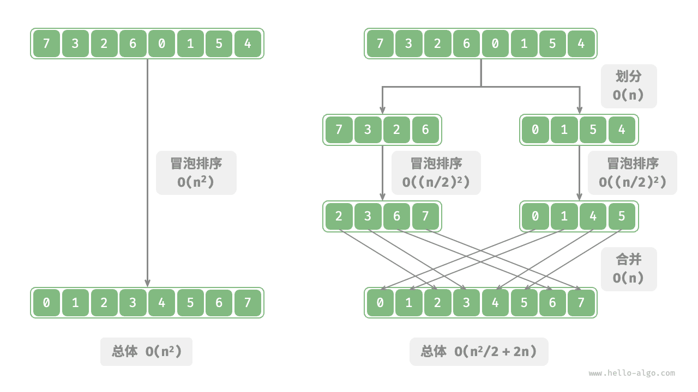
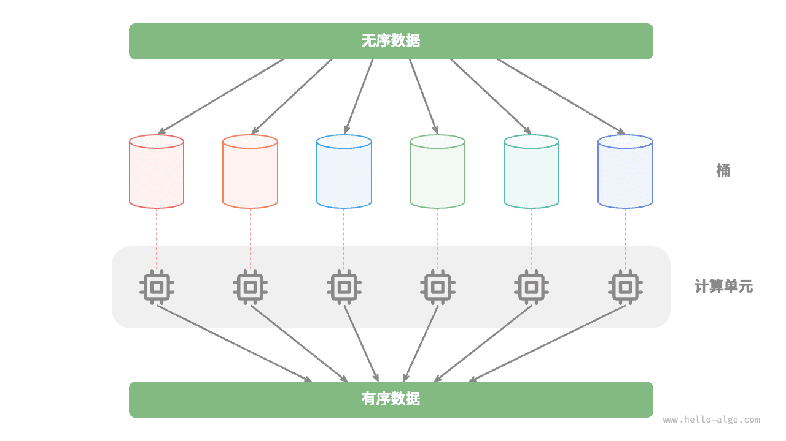

# 分治算法｜通过分治提升效率

> 来源：[krahets 与《Hello 算法》开源贡献者](https://www.hello-algo.com/chapter_divide_and_conquer/divide_and_conquer/)  
> 许可：[CC BY-NC-SA 4.0](https://creativecommons.org/licenses/by-nc-sa/4.0/)  
> 语言：原生简体中文  
> 版本：69932aed1891a7b7f6a0de88cd116d3fe13e7032  
> 署名：原作《Hello 算法》，作者 krahets 及开源贡献者。  
> 使用限制：仅限实验室内部、个人学习与其他非商业用途；改编内容须保持相同许可。

## 通过分治提升效率

**分治不仅可以有效地解决算法问题，往往还可以提升算法效率**。在排序算法中，快速排序、归并排序、堆排序相较于选择、冒泡、插入排序更快，就是因为它们应用了分治策略。

那么，我们不禁发问：**为什么分治可以提升算法效率，其底层逻辑是什么**？换句话说，将大问题分解为多个子问题、解决子问题、将子问题的解合并为原问题的解，这几步的效率为什么比直接解决原问题的效率更高？这个问题可以从操作数量和并行计算两方面来讨论。

### 操作数量优化

以“冒泡排序”为例，其处理一个长度为 $n$ 的数组需要 $O(n^2)$ 时间。假设我们按照下图所示的方式，将数组从中点处分为两个子数组，则划分需要 $O(n)$ 时间，排序每个子数组需要 $O((n / 2)^2)$ 时间，合并两个子数组需要 $O(n)$ 时间，总体时间复杂度为：

$$
O(n + (\frac{n}{2})^2 \times 2 + n) = O(\frac{n^2}{2} + 2n)
$$

接下来，我们计算以下不等式，其左边和右边分别为划分前和划分后的操作总数：

$$
\begin{aligned}
n^2 & > \frac{n^2}{2} + 2n \newline
n^2 - \frac{n^2}{2} - 2n & > 0 \newline
n(n - 4) & > 0
\end{aligned}
$$

**这意味着当 $n > 4$ 时，划分后的操作数量更少，排序效率应该更高**。请注意，划分后的时间复杂度仍然是平方阶 $O(n^2)$ ，只是复杂度中的常数项变小了。

进一步想，**如果我们把子数组不断地再从中点处划分为两个子数组**，直至子数组只剩一个元素时停止划分呢？这种思路实际上就是“归并排序”，时间复杂度为 $O(n \log n)$ 。

再思考，**如果我们多设置几个划分点**，将原数组平均划分为 $k$ 个子数组呢？这种情况与“桶排序”非常类似，它非常适合排序海量数据，理论上时间复杂度可以达到 $O(n + k)$ 。

### 并行计算优化

我们知道，分治生成的子问题是相互独立的，**因此通常可以并行解决**。也就是说，分治不仅可以降低算法的时间复杂度，**还有利于操作系统的并行优化**。

并行优化在多核或多处理器的环境中尤其有效，因为系统可以同时处理多个子问题，更加充分地利用计算资源，从而显著减少总体的运行时间。

比如在下图所示的“桶排序”中，我们将海量的数据平均分配到各个桶中，则可将所有桶的排序任务分散到各个计算单元，完成后再合并结果。

