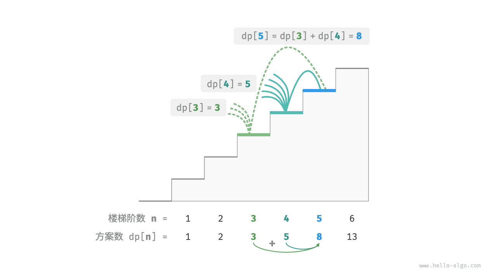

# 初探动态规划｜方法一：暴力搜索

> 来源：[krahets 与《Hello 算法》开源贡献者](https://www.hello-algo.com/chapter_dynamic_programming/intro_to_dynamic_programming/)  
> 许可：[CC BY-NC-SA 4.0](https://creativecommons.org/licenses/by-nc-sa/4.0/)  
> 语言：原生简体中文  
> 版本：69932aed1891a7b7f6a0de88cd116d3fe13e7032  
> 署名：原作《Hello 算法》，作者 krahets 及开源贡献者。  
> 使用限制：仅限实验室内部、个人学习与其他非商业用途；改编内容须保持相同许可。

## 方法一：暴力搜索

回溯算法通常并不显式地对问题进行拆解，而是将求解问题看作一系列决策步骤，通过试探和剪枝，搜索所有可能的解。

我们可以尝试从问题分解的角度分析这道题。设爬到第 $i$ 阶共有 $dp[i]$ 种方案，那么 $dp[i]$ 就是原问题，其子问题包括：

$$
dp[i-1], dp[i-2], \dots, dp[2], dp[1]
$$

由于每轮只能上 $1$ 阶或 $2$ 阶，因此当我们站在第 $i$ 阶楼梯上时，上一轮只可能站在第 $i - 1$ 阶或第 $i - 2$ 阶上。换句话说，我们只能从第 $i -1$ 阶或第 $i - 2$ 阶迈向第 $i$ 阶。

由此便可得出一个重要推论：**爬到第 $i - 1$ 阶的方案数加上爬到第 $i - 2$ 阶的方案数就等于爬到第 $i$ 阶的方案数**。公式如下：

$$
dp[i] = dp[i-1] + dp[i-2]
$$

这意味着在爬楼梯问题中，各个子问题之间存在递推关系，**原问题的解可以由子问题的解构建得来**。下图展示了该递推关系。



我们可以根据递推公式得到暴力搜索解法。以 $dp[n]$ 为起始点，**递归地将一个较大问题拆解为两个较小问题的和**，直至到达最小子问题 $dp[1]$ 和 $dp[2]$ 时返回。其中，最小子问题的解是已知的，即 $dp[1] = 1$、$dp[2] = 2$ ，表示爬到第 $1$、$2$ 阶分别有 $1$、$2$ 种方案。

观察以下代码，它和标准回溯代码都属于深度优先搜索，但更加简洁：

```src
[file]{climbing_stairs_dfs}-[class]{}-[func]{climbing_stairs_dfs}
```

下图展示了暴力搜索形成的递归树。对于问题 $dp[n]$ ，其递归树的深度为 $n$ ，时间复杂度为 $O(2^n)$ 。指数阶属于爆炸式增长，如果我们输入一个比较大的 $n$ ，则会陷入漫长的等待之中。


观察上图，**指数阶的时间复杂度是“重叠子问题”导致的**。例如 $dp[9]$ 被分解为 $dp[8]$ 和 $dp[7]$ ，$dp[8]$ 被分解为 $dp[7]$ 和 $dp[6]$ ，两者都包含子问题 $dp[7]$ 。

以此类推，子问题中包含更小的重叠子问题，子子孙孙无穷尽也。绝大部分计算资源都浪费在这些重叠的子问题上。
