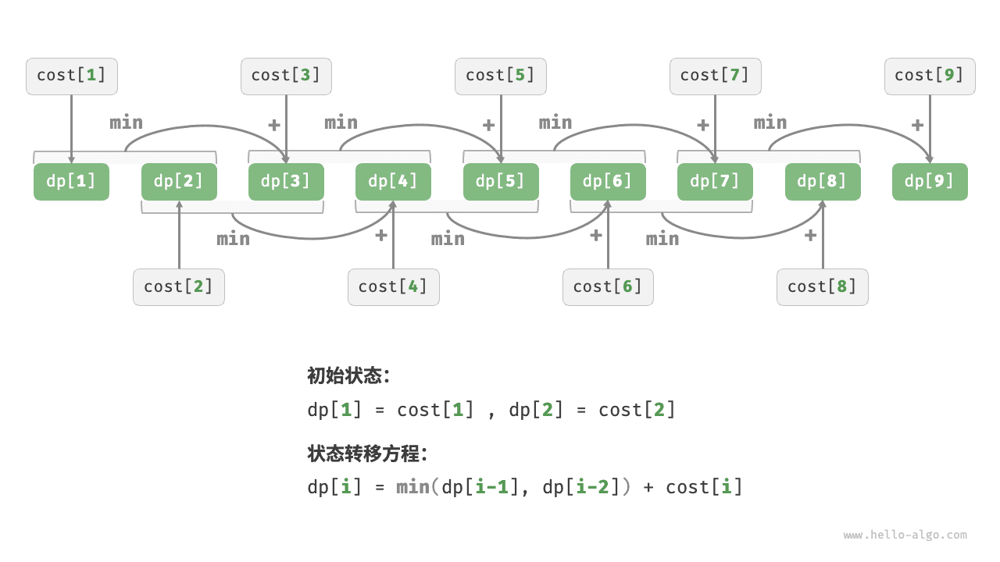

# 动态规划问题特性｜最优子结构

> 来源：[krahets 与《Hello 算法》开源贡献者](https://www.hello-algo.com/chapter_dynamic_programming/dp_problem_features/)  
> 许可：[CC BY-NC-SA 4.0](https://creativecommons.org/licenses/by-nc-sa/4.0/)  
> 语言：原生简体中文  
> 版本：69932aed1891a7b7f6a0de88cd116d3fe13e7032  
> 署名：原作《Hello 算法》，作者 krahets 及开源贡献者。  
> 使用限制：仅限实验室内部、个人学习与其他非商业用途；改编内容须保持相同许可。

## 最优子结构

我们对爬楼梯问题稍作改动，使之更加适合展示最优子结构概念。

!!! question "爬楼梯最小代价"

    给定一个楼梯，你每步可以上 $1$ 阶或者 $2$ 阶，每一阶楼梯上都贴有一个非负整数，表示你在该台阶所需要付出的代价。给定一个非负整数数组 $cost$ ，其中 $cost[i]$ 表示在第 $i$ 个台阶需要付出的代价，$cost[0]$ 为地面（起始点）。请计算最少需要付出多少代价才能到达顶部？

如下图所示，若第 $1$、$2$、$3$ 阶的代价分别为 $1$、$10$、$1$ ，则从地面爬到第 $3$ 阶的最小代价为 $2$ 。


设 $dp[i]$ 为爬到第 $i$ 阶累计付出的代价，由于第 $i$ 阶只可能从 $i - 1$ 阶或 $i - 2$ 阶走来，因此 $dp[i]$ 只可能等于 $dp[i - 1] + cost[i]$ 或 $dp[i - 2] + cost[i]$ 。为了尽可能减少代价，我们应该选择两者中较小的那一个：

$$
dp[i] = \min(dp[i-1], dp[i-2]) + cost[i]
$$

这便可以引出最优子结构的含义：**原问题的最优解是从子问题的最优解构建得来的**。

本题显然具有最优子结构：我们从两个子问题最优解 $dp[i-1]$ 和 $dp[i-2]$ 中挑选出较优的那一个，并用它构建出原问题 $dp[i]$ 的最优解。

那么，上一节的爬楼梯题目有没有最优子结构呢？它的目标是求解方案数量，看似是一个计数问题，但如果换一种问法：“求解最大方案数量”。我们意外地发现，**虽然题目修改前后是等价的，但最优子结构浮现出来了**：第 $n$ 阶最大方案数量等于第 $n-1$ 阶和第 $n-2$ 阶最大方案数量之和。所以说，最优子结构的解释方式比较灵活，在不同问题中会有不同的含义。

根据状态转移方程，以及初始状态 $dp[1] = cost[1]$ 和 $dp[2] = cost[2]$ ，我们就可以得到动态规划代码：

```src
[file]{min_cost_climbing_stairs_dp}-[class]{}-[func]{min_cost_climbing_stairs_dp}
```

下图展示了以上代码的动态规划过程。



本题也可以进行空间优化，将一维压缩至零维，使得空间复杂度从 $O(n)$ 降至 $O(1)$ ：

```src
[file]{min_cost_climbing_stairs_dp}-[class]{}-[func]{min_cost_climbing_stairs_dp_comp}
```
