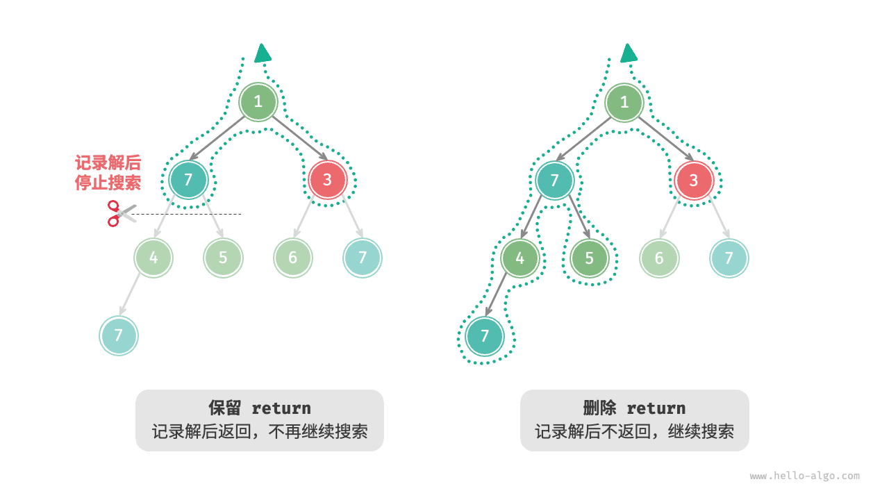

# 回溯算法｜框架代码

> 来源：[krahets 与《Hello 算法》开源贡献者](https://www.hello-algo.com/chapter_backtracking/backtracking_algorithm/)  
> 许可：[CC BY-NC-SA 4.0](https://creativecommons.org/licenses/by-nc-sa/4.0/)  
> 语言：原生简体中文  
> 版本：69932aed1891a7b7f6a0de88cd116d3fe13e7032  
> 署名：原作《Hello 算法》，作者 krahets 及开源贡献者。  
> 使用限制：仅限实验室内部、个人学习与其他非商业用途；改编内容须保持相同许可。

## 框架代码

接下来，我们尝试将回溯的“尝试、回退、剪枝”的主体框架提炼出来，提升代码的通用性。

在以下框架代码中，`state` 表示问题的当前状态，`choices` 表示当前状态下可以做出的选择：

=== "Python"

    ```python title=""
    def backtrack(state: State, choices: list[choice], res: list[state]):
        """回溯算法框架"""
        # 判断是否为解
        if is_solution(state):
            # 记录解
            record_solution(state, res)
            # 不再继续搜索
            return
        # 遍历所有选择
        for choice in choices:
            # 剪枝：判断选择是否合法
            if is_valid(state, choice):
                # 尝试：做出选择，更新状态
                make_choice(state, choice)
                backtrack(state, choices, res)
                # 回退：撤销选择，恢复到之前的状态
                undo_choice(state, choice)
    ```

=== "C++"

    ```cpp title=""
    /* 回溯算法框架 */
    void backtrack(State *state, vector<Choice *> &choices, vector<State *> &res) {
        // 判断是否为解
        if (isSolution(state)) {
            // 记录解
            recordSolution(state, res);
            // 不再继续搜索
            return;
        }
        // 遍历所有选择
        for (Choice choice : choices) {
            // 剪枝：判断选择是否合法
            if (isValid(state, choice)) {
                // 尝试：做出选择，更新状态
                makeChoice(state, choice);
                backtrack(state, choices, res);
                // 回退：撤销选择，恢复到之前的状态
                undoChoice(state, choice);
            }
        }
    }
    ```

=== "Java"

    ```java title=""
    /* 回溯算法框架 */
    void backtrack(State state, List<Choice> choices, List<State> res) {
        // 判断是否为解
        if (isSolution(state)) {
            // 记录解
            recordSolution(state, res);
            // 不再继续搜索
            return;
        }
        // 遍历所有选择
        for (Choice choice : choices) {
            // 剪枝：判断选择是否合法
            if (isValid(state, choice)) {
                // 尝试：做出选择，更新状态
                makeChoice(state, choice);
                backtrack(state, choices, res);
                // 回退：撤销选择，恢复到之前的状态
                undoChoice(state, choice);
            }
        }
    }
    ```

=== "C#"

    ```csharp title=""
    /* 回溯算法框架 */
    void Backtrack(State state, List<Choice> choices, List<State> res) {
        // 判断是否为解
        if (IsSolution(state)) {
            // 记录解
            RecordSolution(state, res);
            // 不再继续搜索
            return;
        }
        // 遍历所有选择
        foreach (Choice choice in choices) {
            // 剪枝：判断选择是否合法
            if (IsValid(state, choice)) {
                // 尝试：做出选择，更新状态
                MakeChoice(state, choice);
                Backtrack(state, choices, res);
                // 回退：撤销选择，恢复到之前的状态
                UndoChoice(state, choice);
            }
        }
    }
    ```

=== "Go"

    ```go title=""
    /* 回溯算法框架 */
    func backtrack(state *State, choices []Choice, res *[]State) {
        // 判断是否为解
        if isSolution(state) {
            // 记录解
            recordSolution(state, res)
            // 不再继续搜索
            return
        }
        // 遍历所有选择
        for _, choice := range choices {
            // 剪枝：判断选择是否合法
            if isValid(state, choice) {
                // 尝试：做出选择，更新状态
                makeChoice(state, choice)
                backtrack(state, choices, res)
                // 回退：撤销选择，恢复到之前的状态
                undoChoice(state, choice)
            }
        }
    }
    ```

=== "Swift"

    ```swift title=""
    /* 回溯算法框架 */
    func backtrack(state: inout State, choices: [Choice], res: inout [State]) {
        // 判断是否为解
        if isSolution(state: state) {
            // 记录解
            recordSolution(state: state, res: &res)
            // 不再继续搜索
            return
        }
        // 遍历所有选择
        for choice in choices {
            // 剪枝：判断选择是否合法
            if isValid(state: state, choice: choice) {
                // 尝试：做出选择，更新状态
                makeChoice(state: &state, choice: choice)
                backtrack(state: &state, choices: choices, res: &res)
                // 回退：撤销选择，恢复到之前的状态
                undoChoice(state: &state, choice: choice)
            }
        }
    }
    ```

=== "JS"

    ```javascript title=""
    /* 回溯算法框架 */
    function backtrack(state, choices, res) {
        // 判断是否为解
        if (isSolution(state)) {
            // 记录解
            recordSolution(state, res);
            // 不再继续搜索
            return;
        }
        // 遍历所有选择
        for (let choice of choices) {
            // 剪枝：判断选择是否合法
            if (isValid(state, choice)) {
                // 尝试：做出选择，更新状态
                makeChoice(state, choice);
                backtrack(state, choices, res);
                // 回退：撤销选择，恢复到之前的状态
                undoChoice(state, choice);
            }
        }
    }
    ```

=== "TS"

    ```typescript title=""
    /* 回溯算法框架 */
    function backtrack(state: State, choices: Choice[], res: State[]): void {
        // 判断是否为解
        if (isSolution(state)) {
            // 记录解
            recordSolution(state, res);
            // 不再继续搜索
            return;
        }
        // 遍历所有选择
        for (let choice of choices) {
            // 剪枝：判断选择是否合法
            if (isValid(state, choice)) {
                // 尝试：做出选择，更新状态
                makeChoice(state, choice);
                backtrack(state, choices, res);
                // 回退：撤销选择，恢复到之前的状态
                undoChoice(state, choice);
            }
        }
    }
    ```

=== "Dart"

    ```dart title=""
    /* 回溯算法框架 */
    void backtrack(State state, List<Choice>, List<State> res) {
      // 判断是否为解
      if (isSolution(state)) {
        // 记录解
        recordSolution(state, res);
        // 不再继续搜索
        return;
      }
      // 遍历所有选择
      for (Choice choice in choices) {
        // 剪枝：判断选择是否合法
        if (isValid(state, choice)) {
          // 尝试：做出选择，更新状态
          makeChoice(state, choice);
          backtrack(state, choices, res);
          // 回退：撤销选择，恢复到之前的状态
          undoChoice(state, choice);
        }
      }
    }
    ```

=== "Rust"

    ```rust title=""
    /* 回溯算法框架 */
    fn backtrack(state: &mut State, choices: &Vec<Choice>, res: &mut Vec<State>) {
        // 判断是否为解
        if is_solution(state) {
            // 记录解
            record_solution(state, res);
            // 不再继续搜索
            return;
        }
        // 遍历所有选择
        for choice in choices {
            // 剪枝：判断选择是否合法
            if is_valid(state, choice) {
                // 尝试：做出选择，更新状态
                make_choice(state, choice);
                backtrack(state, choices, res);
                // 回退：撤销选择，恢复到之前的状态
                undo_choice(state, choice);
            }
        }
    }
    ```

=== "C"

    ```c title=""
    /* 回溯算法框架 */
    void backtrack(State *state, Choice *choices, int numChoices, State *res, int numRes) {
        // 判断是否为解
        if (isSolution(state)) {
            // 记录解
            recordSolution(state, res, numRes);
            // 不再继续搜索
            return;
        }
        // 遍历所有选择
        for (int i = 0; i < numChoices; i++) {
            // 剪枝：判断选择是否合法
            if (isValid(state, &choices[i])) {
                // 尝试：做出选择，更新状态
                makeChoice(state, &choices[i]);
                backtrack(state, choices, numChoices, res, numRes);
                // 回退：撤销选择，恢复到之前的状态
                undoChoice(state, &choices[i]);
            }
        }
    }
    ```

=== "Kotlin"

    ```kotlin title=""
    /* 回溯算法框架 */
    fun backtrack(state: State?, choices: List<Choice?>, res: List<State?>?) {
        // 判断是否为解
        if (isSolution(state)) {
            // 记录解
            recordSolution(state, res)
            // 不再继续搜索
            return
        }
        // 遍历所有选择
        for (choice in choices) {
            // 剪枝：判断选择是否合法
            if (isValid(state, choice)) {
                // 尝试：做出选择，更新状态
                makeChoice(state, choice)
                backtrack(state, choices, res)
                // 回退：撤销选择，恢复到之前的状态
                undoChoice(state, choice)
            }
        }
    }
    ```

=== "Ruby"

    ```ruby title=""
    ### 回溯算法框架 ###
    def backtrack(state, choices, res)
        # 判断是否为解
        if is_solution?(state)
            # 记录解
            record_solution(state, res)
            return
        end

        # 遍历所有选择
        for choice in choices
            # 剪枝：判断选择是否合法
            if is_valid?(state, choice)
                # 尝试：做出选择，更新状态
                make_choice(state, choice)
                backtrack(state, choices, res)
                # 回退：撤销选择，恢复到之前的状态
                undo_choice(state, choice)
            end
        end
    end
    ```

接下来，我们基于框架代码来解决例题三。状态 `state` 为节点遍历路径，选择 `choices` 为当前节点的左子节点和右子节点，结果 `res` 是路径列表：

```src
[file]{preorder_traversal_iii_template}-[class]{}-[func]{backtrack}
```

根据题意，我们在找到值为 $7$ 的节点后应该继续搜索，**因此需要将记录解之后的 `return` 语句删除**。下图对比了保留或删除 `return` 语句的搜索过程。



相比基于前序遍历的代码实现，基于回溯算法框架的代码实现虽然显得啰唆，但通用性更好。实际上，**许多回溯问题可以在该框架下解决**。我们只需根据具体问题来定义 `state` 和 `choices` ，并实现框架中的各个方法即可。
