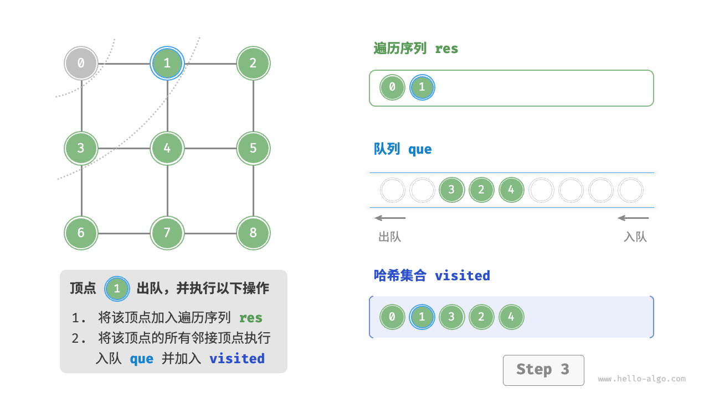
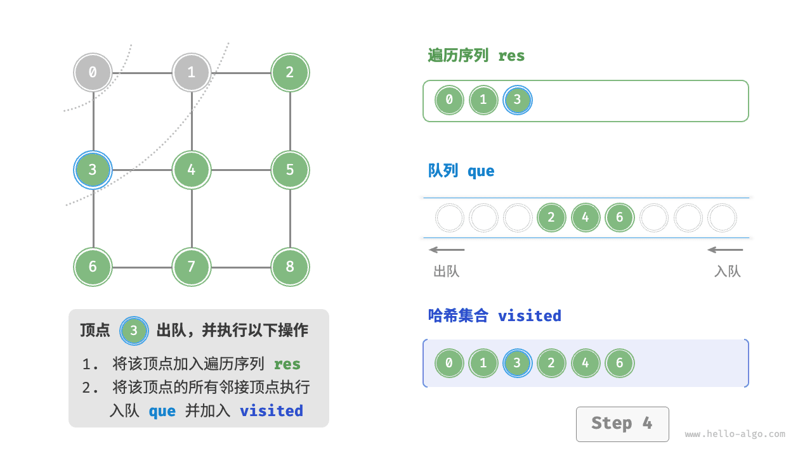
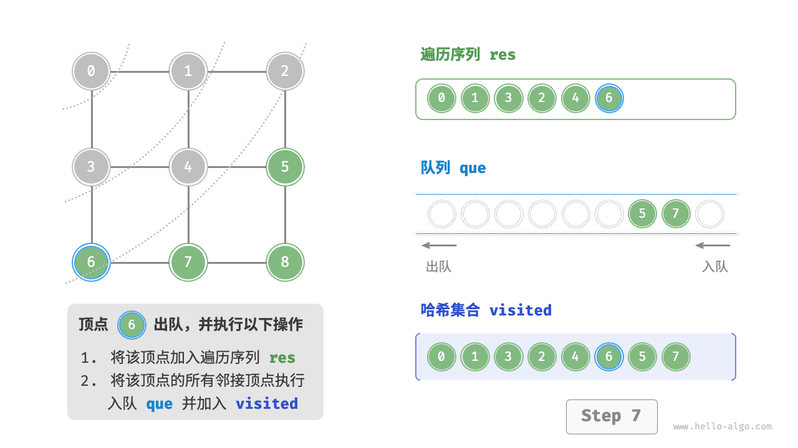
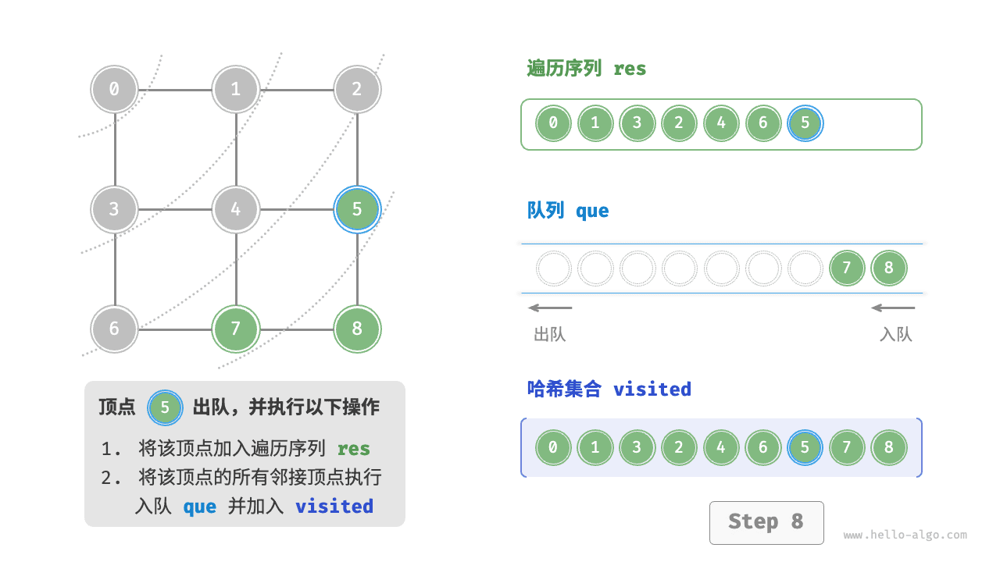
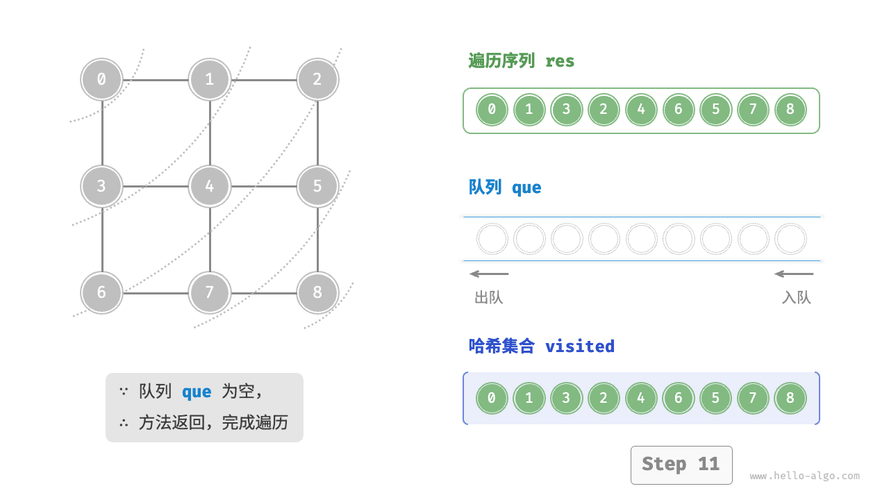

# 图的遍历｜广度优先遍历

> 来源：[krahets 与《Hello 算法》开源贡献者](https://www.hello-algo.com/chapter_graph/graph_traversal/)  
> 许可：[CC BY-NC-SA 4.0](https://creativecommons.org/licenses/by-nc-sa/4.0/)  
> 语言：原生简体中文  
> 版本：69932aed1891a7b7f6a0de88cd116d3fe13e7032  
> 署名：原作《Hello 算法》，作者 krahets 及开源贡献者。  
> 使用限制：仅限实验室内部、个人学习与其他非商业用途；改编内容须保持相同许可。

## 广度优先遍历

**广度优先遍历是一种由近及远的遍历方式，从某个节点出发，始终优先访问距离最近的顶点，并一层层向外扩张**。如下图所示，从左上角顶点出发，首先遍历该顶点的所有邻接顶点，然后遍历下一个顶点的所有邻接顶点，以此类推，直至所有顶点访问完毕。


### 算法实现

BFS 通常借助队列来实现，代码如下所示。队列具有“先入先出”的性质，这与 BFS 的“由近及远”的思想异曲同工。

1. 将遍历起始顶点 `startVet` 加入队列，并开启循环。
2. 在循环的每轮迭代中，弹出队首顶点并记录访问，然后将该顶点的所有邻接顶点加入到队列尾部。
3. 循环步骤 `2.` ，直到所有顶点被访问完毕后结束。

为了防止重复遍历顶点，我们需要借助一个哈希集合 `visited` 来记录哪些节点已被访问。

!!! tip

    哈希集合可以看作一个只存储 `key` 而不存储 `value` 的哈希表，它可以在 $O(1)$ 时间复杂度下进行 `key` 的增删查改操作。根据 `key` 的唯一性，哈希集合通常用于数据去重等场景。

```src
[file]{graph_bfs}-[class]{}-[func]{graph_bfs}
```

代码相对抽象，建议对照下图来加深理解。

=== "<1>"
    

=== "<2>"
    

=== "<3>"
    

=== "<4>"
    

=== "<5>"
    

=== "<6>"
    

=== "<7>"
    

=== "<8>"
    

=== "<9>"
    

=== "<10>"
    

=== "<11>"
    

!!! question "广度优先遍历的序列是否唯一？"

    不唯一。广度优先遍历只要求按“由近及远”的顺序遍历，**而多个相同距离的顶点的遍历顺序允许被任意打乱**。以上图为例，顶点 $1$、$3$ 的访问顺序可以交换，顶点 $2$、$4$、$6$ 的访问顺序也可以任意交换。

### 复杂度分析

**时间复杂度**：所有顶点都会入队并出队一次，使用 $O(|V|)$ 时间；在遍历邻接顶点的过程中，由于是无向图，因此所有边都会被访问 $2$ 次，使用 $O(2|E|)$ 时间；总体使用 $O(|V| + |E|)$ 时间。

**空间复杂度**：列表 `res` ，哈希集合 `visited` ，队列 `que` 中的顶点数量最多为 $|V|$ ，使用 $O(|V|)$ 空间。
