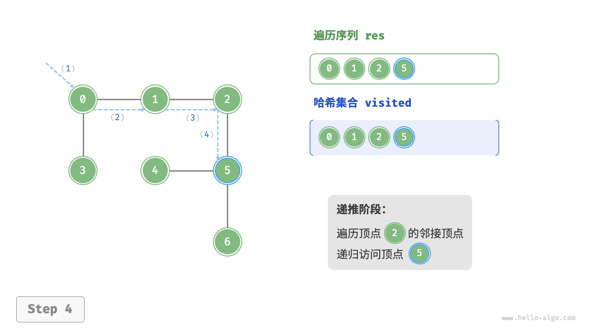
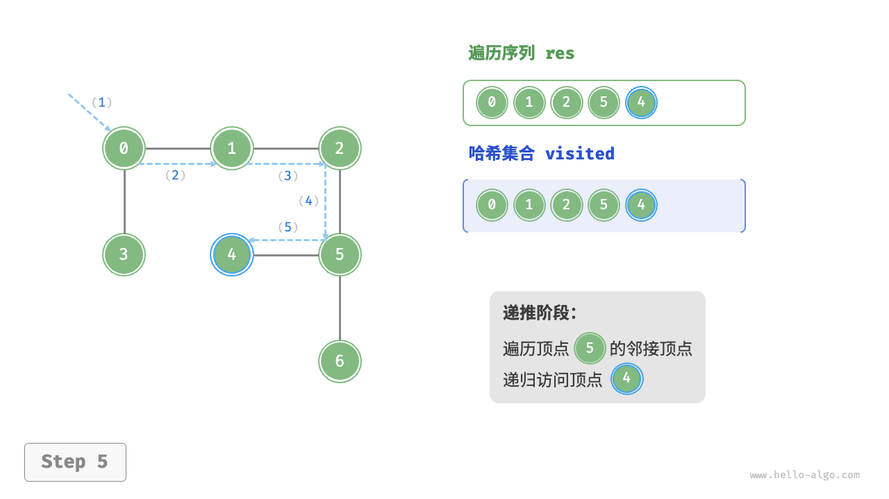
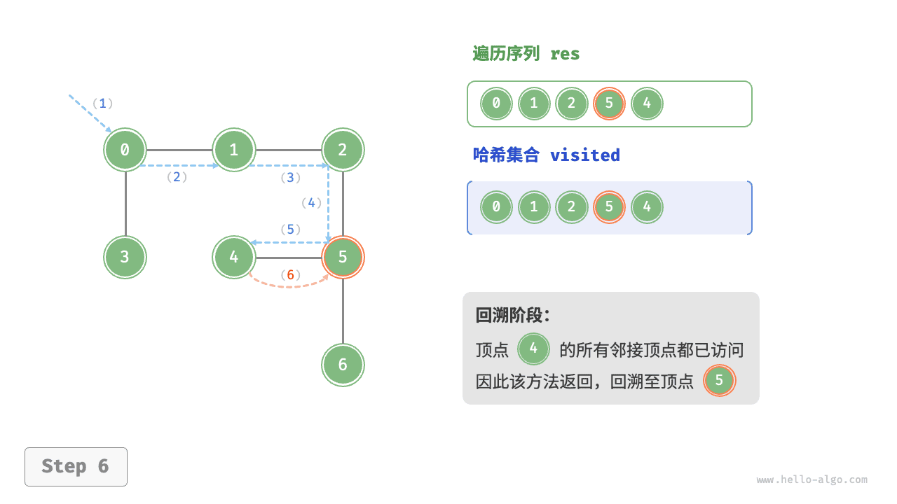
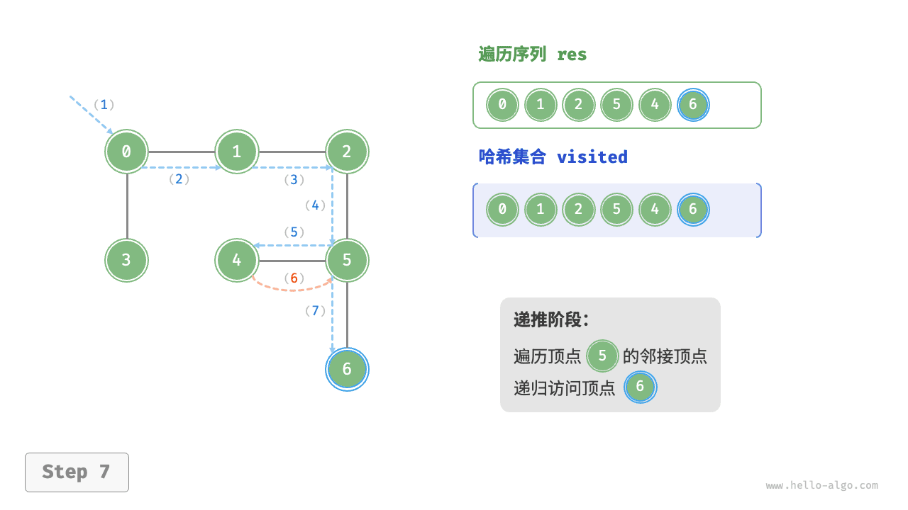
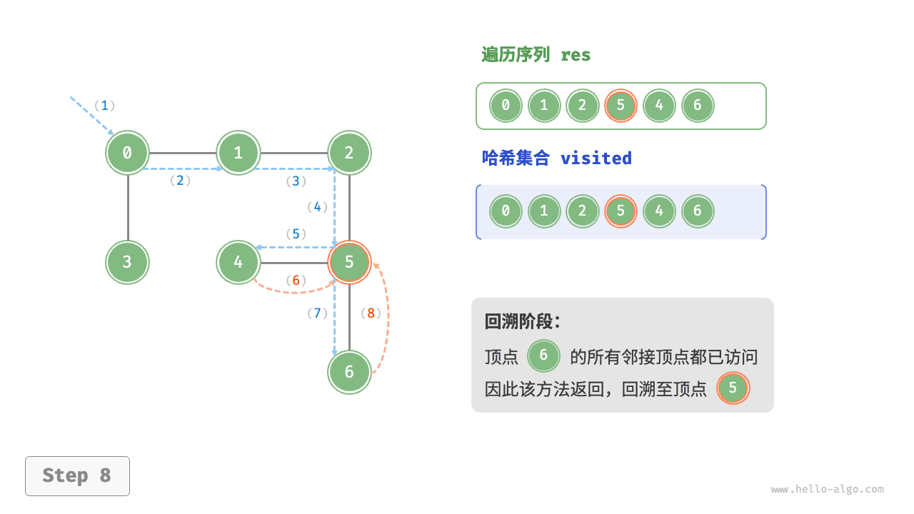
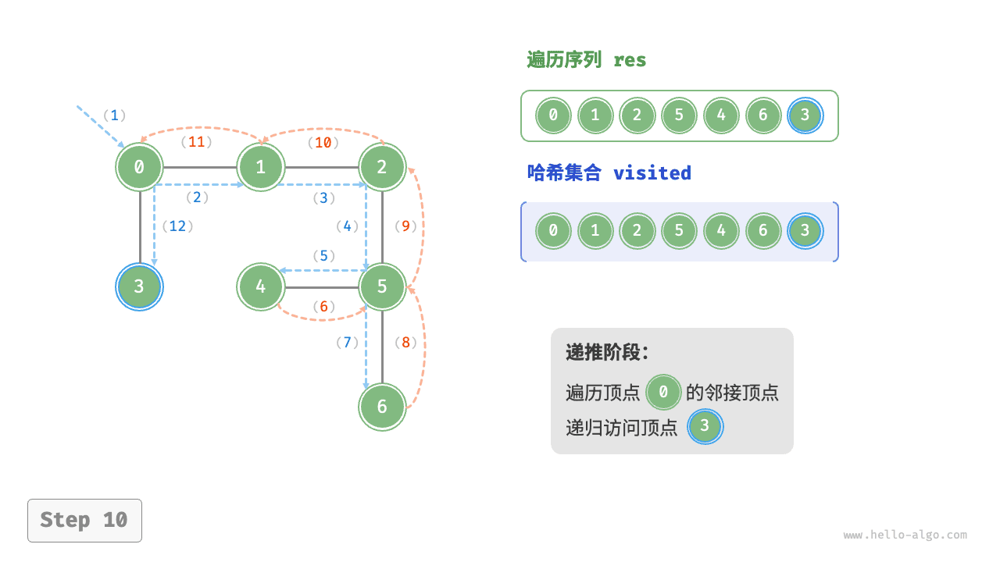

# 图的遍历｜深度优先遍历

> 来源：[krahets 与《Hello 算法》开源贡献者](https://www.hello-algo.com/chapter_graph/graph_traversal/)  
> 许可：[CC BY-NC-SA 4.0](https://creativecommons.org/licenses/by-nc-sa/4.0/)  
> 语言：原生简体中文  
> 版本：69932aed1891a7b7f6a0de88cd116d3fe13e7032  
> 署名：原作《Hello 算法》，作者 krahets 及开源贡献者。  
> 使用限制：仅限实验室内部、个人学习与其他非商业用途；改编内容须保持相同许可。

## 深度优先遍历

**深度优先遍历是一种优先走到底、无路可走再回头的遍历方式**。如下图所示，从左上角顶点出发，访问当前顶点的某个邻接顶点，直到走到尽头时返回，再继续走到尽头并返回，以此类推，直至所有顶点遍历完成。


### 算法实现

这种“走到尽头再返回”的算法范式通常基于递归来实现。与广度优先遍历类似，在深度优先遍历中，我们也需要借助一个哈希集合 `visited` 来记录已被访问的顶点，以避免重复访问顶点。

```src
[file]{graph_dfs}-[class]{}-[func]{graph_dfs}
```

深度优先遍历的算法流程如下图所示。

- **直虚线代表向下递推**，表示开启了一个新的递归方法来访问新顶点。
- **曲虚线代表向上回溯**，表示此递归方法已经返回，回溯到了开启此方法的位置。

为了加深理解，建议将下图与代码结合起来，在脑中模拟（或者用笔画下来）整个 DFS 过程，包括每个递归方法何时开启、何时返回。

=== "<1>"
    

=== "<2>"
    

=== "<3>"
    

=== "<4>"
    

=== "<5>"
    

=== "<6>"
    

=== "<7>"
    

=== "<8>"
    

=== "<9>"
    

=== "<10>"
    

=== "<11>"
    

!!! question "深度优先遍历的序列是否唯一？"

    与广度优先遍历类似，深度优先遍历序列的顺序也不是唯一的。给定某顶点，先往哪个方向探索都可以，即邻接顶点的顺序可以任意打乱，都是深度优先遍历。
    
    以树的遍历为例，“根 $\rightarrow$ 左 $\rightarrow$ 右”“左 $\rightarrow$ 根 $\rightarrow$ 右”“左 $\rightarrow$ 右 $\rightarrow$ 根”分别对应前序、中序、后序遍历，它们展示了三种遍历优先级，然而这三者都属于深度优先遍历。

### 复杂度分析

**时间复杂度**：所有顶点都会被访问 $1$ 次，使用 $O(|V|)$ 时间；所有边都会被访问 $2$ 次，使用 $O(2|E|)$ 时间；总体使用 $O(|V| + |E|)$ 时间。

**空间复杂度**：列表 `res` ，哈希集合 `visited` 顶点数量最多为 $|V|$ ，递归深度最大为 $|V|$ ，因此使用 $O(|V|)$ 空间。
