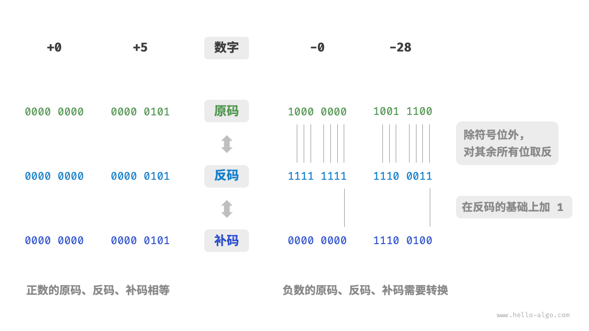

# 数字编码｜原码、反码和补码

> 来源：[krahets 与《Hello 算法》开源贡献者](https://www.hello-algo.com/chapter_data_structure/number_encoding/)  
> 许可：[CC BY-NC-SA 4.0](https://creativecommons.org/licenses/by-nc-sa/4.0/)  
> 语言：原生简体中文  
> 版本：69932aed1891a7b7f6a0de88cd116d3fe13e7032  
> 署名：原作《Hello 算法》，作者 krahets 及开源贡献者。  
> 使用限制：仅限实验室内部、个人学习与其他非商业用途；改编内容须保持相同许可。

## 原码、反码和补码

在上一节的表格中我们发现，所有整数类型能够表示的负数都比正数多一个，例如 `byte` 的取值范围是 $[-128, 127]$ 。这个现象比较反直觉，它的内在原因涉及原码、反码、补码的相关知识。

首先需要指出，**数字是以“补码”的形式存储在计算机中的**。在分析这样做的原因之前，首先给出三者的定义。

- **原码**：我们将数字的二进制表示的最高位视为符号位，其中 $0$ 表示正数，$1$ 表示负数，其余位表示数字的值。
- **反码**：正数的反码与其原码相同，负数的反码是对其原码除符号位外的所有位取反。
- **补码**：正数的补码与其原码相同，负数的补码是在其反码的基础上加 $1$ 。

下图展示了原码、反码和补码之间的转换方法。

<u>原码（sign-magnitude）</u>虽然最直观，但存在一些局限性。一方面，**负数的原码不能直接用于运算**。例如在原码下计算 $1 + (-2)$ ，得到的结果是 $-3$ ，这显然是不对的。

$$
\begin{aligned}
& 1 + (-2) \newline
& \rightarrow 0000 \; 0001 + 1000 \; 0010 \newline
& = 1000 \; 0011 \newline
& \rightarrow -3
\end{aligned}
$$

为了解决此问题，计算机引入了<u>反码（1's complement）</u>。如果我们先将原码转换为反码，并在反码下计算 $1 + (-2)$ ，最后将结果从反码转换回原码，则可得到正确结果 $-1$ 。

$$
\begin{aligned}
& 1 + (-2) \newline
& \rightarrow 0000 \; 0001 \; \text{(原码)} + 1000 \; 0010 \; \text{(原码)} \newline
& = 0000 \; 0001 \; \text{(反码)} + 1111  \; 1101 \; \text{(反码)} \newline
& = 1111 \; 1110 \; \text{(反码)} \newline
& = 1000 \; 0001 \; \text{(原码)} \newline
& \rightarrow -1
\end{aligned}
$$

另一方面，**数字零的原码有 $+0$ 和 $-0$ 两种表示方式**。这意味着数字零对应两个不同的二进制编码，这可能会带来歧义。比如在条件判断中，如果没有区分正零和负零，则可能会导致判断结果出错。而如果我们想处理正零和负零歧义，则需要引入额外的判断操作，这可能会降低计算机的运算效率。

$$
\begin{aligned}
+0 & \rightarrow 0000 \; 0000 \newline
-0 & \rightarrow 1000 \; 0000
\end{aligned}
$$

与原码一样，反码也存在正负零歧义问题，因此计算机进一步引入了<u>补码（2's complement）</u>。我们先来观察一下负零的原码、反码、补码的转换过程：

$$
\begin{aligned}
-0 \rightarrow \; & 1000 \; 0000 \; \text{(原码)} \newline
= \; & 1111 \; 1111 \; \text{(反码)} \newline
= 1 \; & 0000 \; 0000 \; \text{(补码)} \newline
\end{aligned}
$$

在负零的反码基础上加 $1$ 会产生进位，但 `byte` 类型的长度只有 8 位，因此溢出到第 9 位的 $1$ 会被舍弃。也就是说，**负零的补码为 $0000 \; 0000$ ，与正零的补码相同**。这意味着在补码表示中只存在一个零，正负零歧义从而得到解决。

还剩最后一个疑惑：`byte` 类型的取值范围是 $[-128, 127]$ ，多出来的一个负数 $-128$ 是如何得到的呢？我们注意到，区间 $[-127, +127]$ 内的所有整数都有对应的原码、反码和补码，并且原码和补码之间可以互相转换。

然而，**补码 $1000 \; 0000$ 是一个例外，它并没有对应的原码**。根据转换方法，我们得到该补码的原码为 $0000 \; 0000$ 。这显然是矛盾的，因为该原码表示数字 $0$ ，它的补码应该是自身。计算机规定这个特殊的补码 $1000 \; 0000$ 代表 $-128$ 。实际上，$(-1) + (-127)$ 在补码下的计算结果就是 $-128$ 。

$$
\begin{aligned}
& (-127) + (-1) \newline
& \rightarrow 1111 \; 1111 \; \text{(原码)} + 1000 \; 0001 \; \text{(原码)} \newline
& = 1000 \; 0000 \; \text{(反码)} + 1111  \; 1110 \; \text{(反码)} \newline
& = 1000 \; 0001 \; \text{(补码)} + 1111  \; 1111 \; \text{(补码)} \newline
& = 1000 \; 0000 \; \text{(补码)} \newline
& \rightarrow -128
\end{aligned}
$$

你可能已经发现了，上述所有计算都是加法运算。这暗示着一个重要事实：**计算机内部的硬件电路主要是基于加法运算设计的**。这是因为加法运算相对于其他运算（比如乘法、除法和减法）来说，硬件实现起来更简单，更容易进行并行化处理，运算速度更快。

请注意，这并不意味着计算机只能做加法。**通过将加法与一些基本逻辑运算结合，计算机能够实现各种其他的数学运算**。例如，计算减法 $a - b$ 可以转换为计算加法 $a + (-b)$ ；计算乘法和除法可以转换为计算多次加法或减法。

现在我们可以总结出计算机使用补码的原因：基于补码表示，计算机可以用同样的电路和操作来处理正数和负数的加法，不需要设计特殊的硬件电路来处理减法，并且无须特别处理正负零的歧义问题。这大大简化了硬件设计，提高了运算效率。

补码的设计非常精妙，因篇幅关系我们就先介绍到这里，建议有兴趣的读者进一步深入了解。
