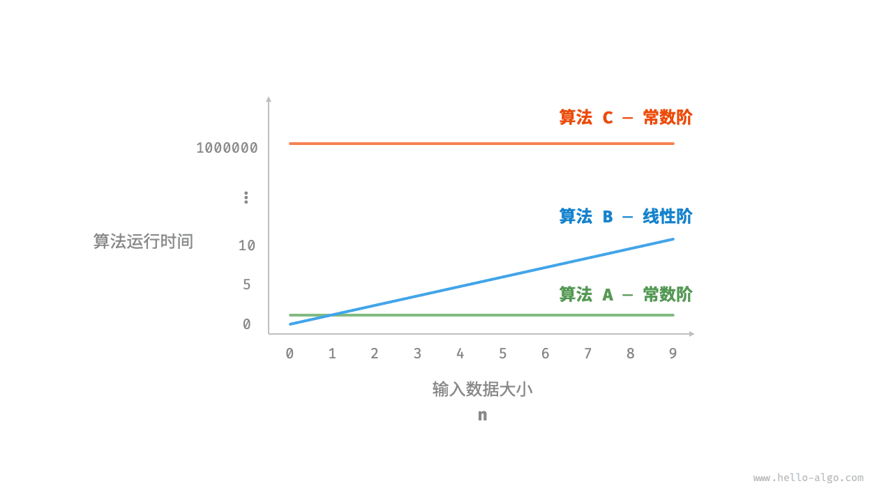

# 时间复杂度｜统计时间增长趋势

> 来源：[krahets 与《Hello 算法》开源贡献者](https://www.hello-algo.com/chapter_computational_complexity/time_complexity/)  
> 许可：[CC BY-NC-SA 4.0](https://creativecommons.org/licenses/by-nc-sa/4.0/)  
> 语言：原生简体中文  
> 版本：69932aed1891a7b7f6a0de88cd116d3fe13e7032  
> 署名：原作《Hello 算法》，作者 krahets 及开源贡献者。  
> 使用限制：仅限实验室内部、个人学习与其他非商业用途；改编内容须保持相同许可。

## 统计时间增长趋势

时间复杂度分析统计的不是算法运行时间，**而是算法运行时间随着数据量变大时的增长趋势**。

“时间增长趋势”这个概念比较抽象，我们通过一个例子来加以理解。假设输入数据大小为 $n$ ，给定三个算法 `A`、`B` 和 `C` ：

=== "Python"

    ```python title=""
    # 算法 A 的时间复杂度：常数阶
    def algorithm_A(n: int):
        print(0)
    # 算法 B 的时间复杂度：线性阶
    def algorithm_B(n: int):
        for _ in range(n):
            print(0)
    # 算法 C 的时间复杂度：常数阶
    def algorithm_C(n: int):
        for _ in range(1000000):
            print(0)
    ```

=== "C++"

    ```cpp title=""
    // 算法 A 的时间复杂度：常数阶
    void algorithm_A(int n) {
        cout << 0 << endl;
    }
    // 算法 B 的时间复杂度：线性阶
    void algorithm_B(int n) {
        for (int i = 0; i < n; i++) {
            cout << 0 << endl;
        }
    }
    // 算法 C 的时间复杂度：常数阶
    void algorithm_C(int n) {
        for (int i = 0; i < 1000000; i++) {
            cout << 0 << endl;
        }
    }
    ```

=== "Java"

    ```java title=""
    // 算法 A 的时间复杂度：常数阶
    void algorithm_A(int n) {
        System.out.println(0);
    }
    // 算法 B 的时间复杂度：线性阶
    void algorithm_B(int n) {
        for (int i = 0; i < n; i++) {
            System.out.println(0);
        }
    }
    // 算法 C 的时间复杂度：常数阶
    void algorithm_C(int n) {
        for (int i = 0; i < 1000000; i++) {
            System.out.println(0);
        }
    }
    ```

=== "C#"

    ```csharp title=""
    // 算法 A 的时间复杂度：常数阶
    void AlgorithmA(int n) {
        Console.WriteLine(0);
    }
    // 算法 B 的时间复杂度：线性阶
    void AlgorithmB(int n) {
        for (int i = 0; i < n; i++) {
            Console.WriteLine(0);
        }
    }
    // 算法 C 的时间复杂度：常数阶
    void AlgorithmC(int n) {
        for (int i = 0; i < 1000000; i++) {
            Console.WriteLine(0);
        }
    }
    ```

=== "Go"

    ```go title=""
    // 算法 A 的时间复杂度：常数阶
    func algorithm_A(n int) {
        fmt.Println(0)
    }
    // 算法 B 的时间复杂度：线性阶
    func algorithm_B(n int) {
        for i := 0; i < n; i++ {
            fmt.Println(0)
        }
    }
    // 算法 C 的时间复杂度：常数阶
    func algorithm_C(n int) {
        for i := 0; i < 1000000; i++ {
            fmt.Println(0)
        }
    }
    ```

=== "Swift"

    ```swift title=""
    // 算法 A 的时间复杂度：常数阶
    func algorithmA(n: Int) {
        print(0)
    }

    // 算法 B 的时间复杂度：线性阶
    func algorithmB(n: Int) {
        for _ in 0 ..< n {
            print(0)
        }
    }

    // 算法 C 的时间复杂度：常数阶
    func algorithmC(n: Int) {
        for _ in 0 ..< 1_000_000 {
            print(0)
        }
    }
    ```

=== "JS"

    ```javascript title=""
    // 算法 A 的时间复杂度：常数阶
    function algorithm_A(n) {
        console.log(0);
    }
    // 算法 B 的时间复杂度：线性阶
    function algorithm_B(n) {
        for (let i = 0; i < n; i++) {
            console.log(0);
        }
    }
    // 算法 C 的时间复杂度：常数阶
    function algorithm_C(n) {
        for (let i = 0; i < 1000000; i++) {
            console.log(0);
        }
    }

    ```

=== "TS"

    ```typescript title=""
    // 算法 A 的时间复杂度：常数阶
    function algorithm_A(n: number): void {
        console.log(0);
    }
    // 算法 B 的时间复杂度：线性阶
    function algorithm_B(n: number): void {
        for (let i = 0; i < n; i++) {
            console.log(0);
        }
    }
    // 算法 C 的时间复杂度：常数阶
    function algorithm_C(n: number): void {
        for (let i = 0; i < 1000000; i++) {
            console.log(0);
        }
    }
    ```

=== "Dart"

    ```dart title=""
    // 算法 A 的时间复杂度：常数阶
    void algorithmA(int n) {
      print(0);
    }
    // 算法 B 的时间复杂度：线性阶
    void algorithmB(int n) {
      for (int i = 0; i < n; i++) {
        print(0);
      }
    }
    // 算法 C 的时间复杂度：常数阶
    void algorithmC(int n) {
      for (int i = 0; i < 1000000; i++) {
        print(0);
      }
    }
    ```

=== "Rust"

    ```rust title=""
    // 算法 A 的时间复杂度：常数阶
    fn algorithm_A(n: i32) {
        println!("{}", 0);
    }
    // 算法 B 的时间复杂度：线性阶
    fn algorithm_B(n: i32) {
        for _ in 0..n {
            println!("{}", 0);
        }
    }
    // 算法 C 的时间复杂度：常数阶
    fn algorithm_C(n: i32) {
        for _ in 0..1000000 {
            println!("{}", 0);
        }
    }
    ```

=== "C"

    ```c title=""
    // 算法 A 的时间复杂度：常数阶
    void algorithm_A(int n) {
        printf("%d", 0);
    }
    // 算法 B 的时间复杂度：线性阶
    void algorithm_B(int n) {
        for (int i = 0; i < n; i++) {
            printf("%d", 0);
        }
    }
    // 算法 C 的时间复杂度：常数阶
    void algorithm_C(int n) {
        for (int i = 0; i < 1000000; i++) {
            printf("%d", 0);
        }
    }
    ```

=== "Kotlin"

    ```kotlin title=""
    // 算法 A 的时间复杂度：常数阶
    fun algoritm_A(n: Int) {
        println(0)
    }
    // 算法 B 的时间复杂度：线性阶
    fun algorithm_B(n: Int) {
        for (i in 0..<n){
            println(0)
        }
    }
    // 算法 C 的时间复杂度：常数阶
    fun algorithm_C(n: Int) {
        for (i in 0..<1000000) {
            println(0)
        }
    }
    ```

=== "Ruby"

    ```ruby title=""
    # 算法 A 的时间复杂度：常数阶
    def algorithm_A(n)
        puts 0
    end

    # 算法 B 的时间复杂度：线性阶
    def algorithm_B(n)
        (0...n).each { puts 0 }
    end

    # 算法 C 的时间复杂度：常数阶
    def algorithm_C(n)
        (0...1_000_000).each { puts 0 }
    end
    ```

下图展示了以上三个算法函数的时间复杂度。

- 算法 `A` 只有 $1$ 个打印操作，算法运行时间不随着 $n$ 增大而增长。我们称此算法的时间复杂度为“常数阶”。
- 算法 `B` 中的打印操作需要循环 $n$ 次，算法运行时间随着 $n$ 增大呈线性增长。此算法的时间复杂度被称为“线性阶”。
- 算法 `C` 中的打印操作需要循环 $1000000$ 次，虽然运行时间很长，但它与输入数据大小 $n$ 无关。因此 `C` 的时间复杂度和 `A` 相同，仍为“常数阶”。



相较于直接统计算法的运行时间，时间复杂度分析有哪些特点呢？

- **时间复杂度能够有效评估算法效率**。例如，算法 `B` 的运行时间呈线性增长，在 $n > 1$ 时比算法 `A` 更慢，在 $n > 1000000$ 时比算法 `C` 更慢。事实上，只要输入数据大小 $n$ 足够大，复杂度为“常数阶”的算法一定优于“线性阶”的算法，这正是时间增长趋势的含义。
- **时间复杂度的推算方法更简便**。显然，运行平台和计算操作类型都与算法运行时间的增长趋势无关。因此在时间复杂度分析中，我们可以简单地将所有计算操作的执行时间视为相同的“单位时间”，从而将“计算操作运行时间统计”简化为“计算操作数量统计”，这样一来估算难度就大大降低了。
- **时间复杂度也存在一定的局限性**。例如，尽管算法 `A` 和 `C` 的时间复杂度相同，但实际运行时间差别很大。同样，尽管算法 `B` 的时间复杂度比 `C` 高，但在输入数据大小 $n$ 较小时，算法 `B` 明显优于算法 `C` 。对于此类情况，我们时常难以仅凭时间复杂度判断算法效率的高低。当然，尽管存在上述问题，复杂度分析仍然是评判算法效率最有效且常用的方法。
