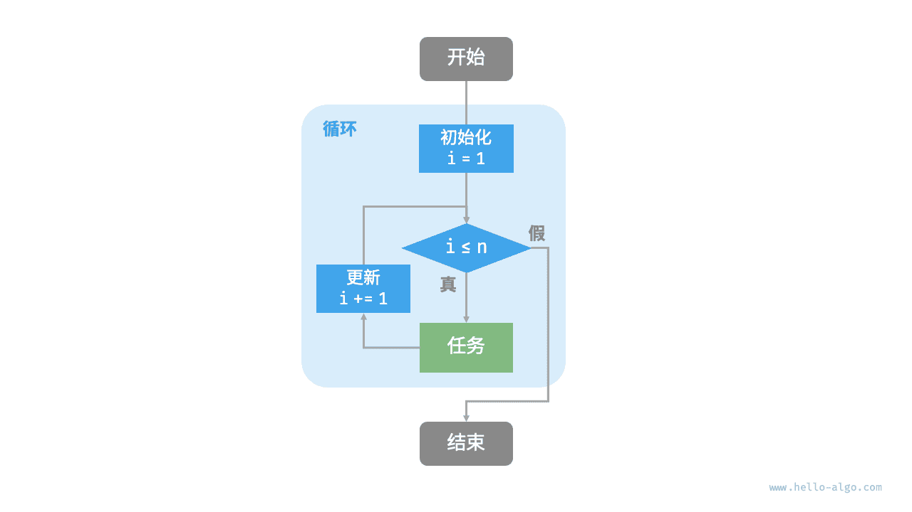
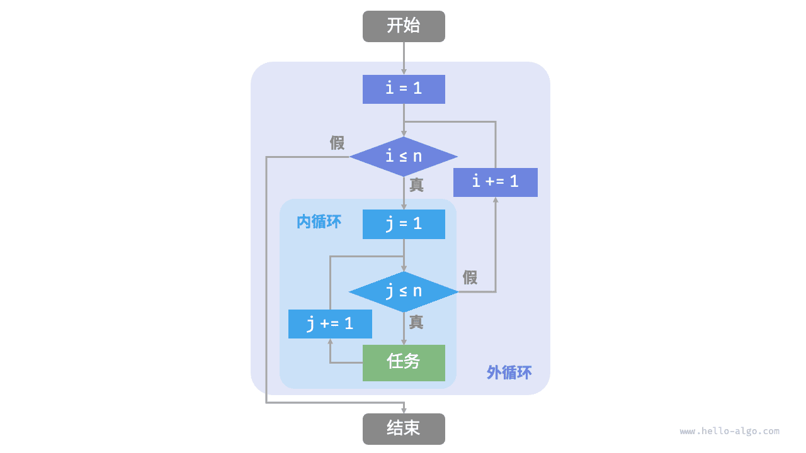

# 迭代与递归｜迭代

> 来源：[krahets 与《Hello 算法》开源贡献者](https://www.hello-algo.com/chapter_computational_complexity/iteration_and_recursion/)  
> 许可：[CC BY-NC-SA 4.0](https://creativecommons.org/licenses/by-nc-sa/4.0/)  
> 语言：原生简体中文  
> 版本：69932aed1891a7b7f6a0de88cd116d3fe13e7032  
> 署名：原作《Hello 算法》，作者 krahets 及开源贡献者。  
> 使用限制：仅限实验室内部、个人学习与其他非商业用途；改编内容须保持相同许可。

## 迭代

<u>迭代（iteration）</u>是一种重复执行某个任务的控制结构。在迭代中，程序会在满足一定的条件下重复执行某段代码，直到这个条件不再满足。

### for 循环

`for` 循环是最常见的迭代形式之一，**适合在预先知道迭代次数时使用**。

以下函数基于 `for` 循环实现了求和 $1 + 2 + \dots + n$ ，求和结果使用变量 `res` 记录。需要注意的是，Python 中 `range(a, b)` 对应的区间是“左闭右开”的，对应的遍历范围为 $a, a + 1, \dots, b-1$ ：

```src
[file]{iteration}-[class]{}-[func]{for_loop}
```

下图是该求和函数的流程框图。



此求和函数的操作数量与输入数据大小 $n$ 成正比，或者说成“线性关系”。实际上，**时间复杂度描述的就是这个“线性关系”**。相关内容将会在下一节中详细介绍。

### while 循环

与 `for` 循环类似，`while` 循环也是一种实现迭代的方法。在 `while` 循环中，程序每轮都会先检查条件，如果条件为真，则继续执行，否则就结束循环。

下面我们用 `while` 循环来实现求和 $1 + 2 + \dots + n$ ：

```src
[file]{iteration}-[class]{}-[func]{while_loop}
```

**`while` 循环比 `for` 循环的自由度更高**。在 `while` 循环中，我们可以自由地设计条件变量的初始化和更新步骤。

例如在以下代码中，条件变量 $i$ 每轮进行两次更新，这种情况就不太方便用 `for` 循环实现：

```src
[file]{iteration}-[class]{}-[func]{while_loop_ii}
```

总的来说，**`for` 循环的代码更加紧凑，`while` 循环更加灵活**，两者都可以实现迭代结构。选择使用哪一个应该根据特定问题的需求来决定。

### 嵌套循环

我们可以在一个循环结构内嵌套另一个循环结构，下面以 `for` 循环为例：

```src
[file]{iteration}-[class]{}-[func]{nested_for_loop}
```

下图是该嵌套循环的流程框图。



在这种情况下，函数的操作数量与 $n^2$ 成正比，或者说算法运行时间和输入数据大小 $n$ 成“平方关系”。

我们可以继续添加嵌套循环，每一次嵌套都是一次“升维”，将会使时间复杂度提高至“立方关系”“四次方关系”，以此类推。
