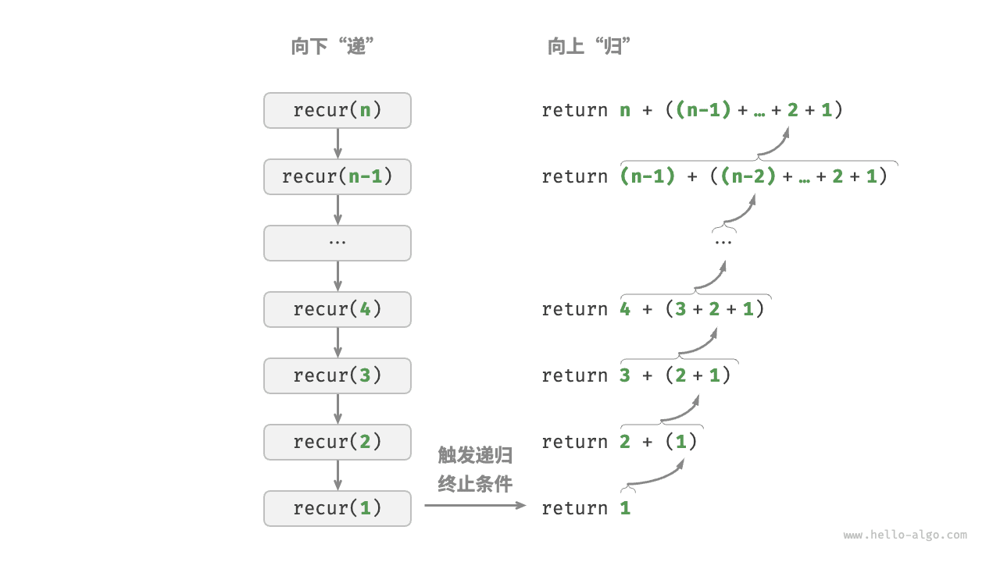
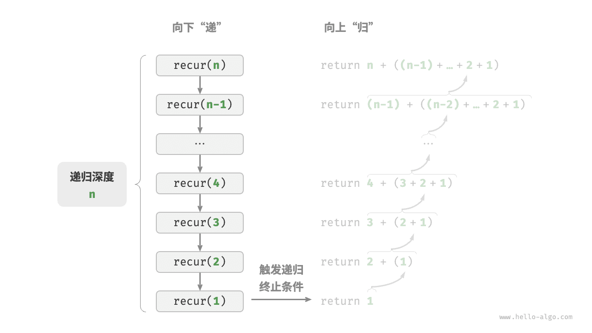
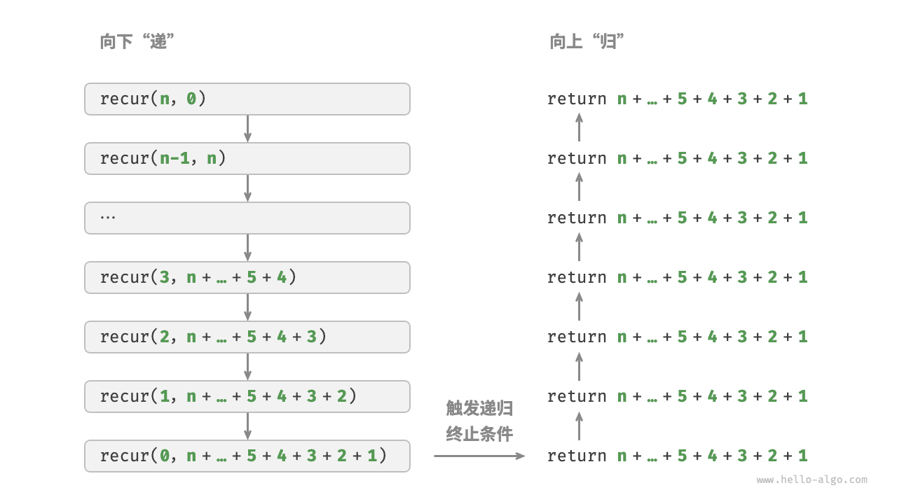
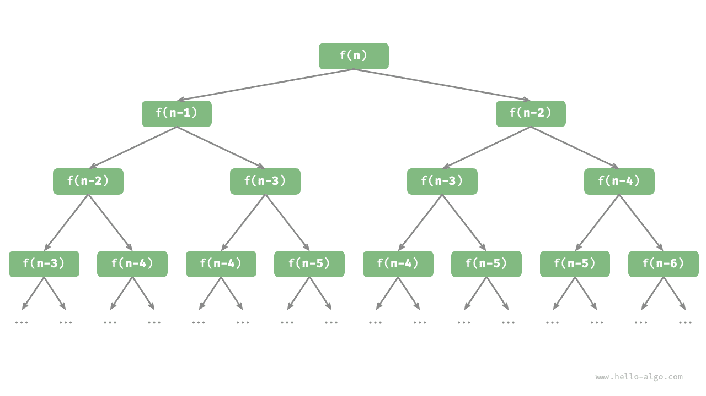

# 迭代与递归｜递归

> 来源：[krahets 与《Hello 算法》开源贡献者](https://www.hello-algo.com/chapter_computational_complexity/iteration_and_recursion/)  
> 许可：[CC BY-NC-SA 4.0](https://creativecommons.org/licenses/by-nc-sa/4.0/)  
> 语言：原生简体中文  
> 版本：69932aed1891a7b7f6a0de88cd116d3fe13e7032  
> 署名：原作《Hello 算法》，作者 krahets 及开源贡献者。  
> 使用限制：仅限实验室内部、个人学习与其他非商业用途；改编内容须保持相同许可。

## 递归

 <u>递归（recursion）</u>是一种算法策略，通过函数调用自身来解决问题。它主要包含两个阶段。

1. **递**：程序不断深入地调用自身，通常传入更小或更简化的参数，直到达到“终止条件”。
2. **归**：触发“终止条件”后，程序从最深层的递归函数开始逐层返回，汇聚每一层的结果。

而从实现的角度看，递归代码主要包含三个要素。

1. **终止条件**：用于决定什么时候由“递”转“归”。
2. **递归调用**：对应“递”，函数调用自身，通常输入更小或更简化的参数。
3. **返回结果**：对应“归”，将当前递归层级的结果返回至上一层。

观察以下代码，我们只需调用函数 `recur(n)`  ，就可以完成 $1 + 2 + \dots + n$ 的计算：

```src
[file]{recursion}-[class]{}-[func]{recur}
```

下图展示了该函数的递归过程。



虽然从计算角度看，迭代与递归可以得到相同的结果，**但它们代表了两种完全不同的思考和解决问题的范式**。

- **迭代**：“自下而上”地解决问题。从最基础的步骤开始，然后不断重复或累加这些步骤，直到任务完成。
- **递归**：“自上而下”地解决问题。将原问题分解为更小的子问题，这些子问题和原问题具有相同的形式。接下来将子问题继续分解为更小的子问题，直到基本情况时停止（基本情况的解是已知的）。

以上述求和函数为例，设问题 $f(n) = 1 + 2 + \dots + n$ 。

- **迭代**：在循环中模拟求和过程，从 $1$ 遍历到 $n$ ，每轮执行求和操作，即可求得 $f(n)$ 。
- **递归**：将问题分解为子问题 $f(n) = n + f(n-1)$ ，不断（递归地）分解下去，直至基本情况 $f(1) = 1$ 时终止。

### 调用栈

递归函数每次调用自身时，系统都会为新开启的函数分配内存，以存储局部变量、调用地址和其他信息等。这将导致两方面的结果。

- 函数的上下文数据都存储在称为“栈帧空间”的内存区域中，直至函数返回后才会被释放。因此，**递归通常比迭代更加耗费内存空间**。
- 递归调用函数会产生额外的开销。**因此递归通常比循环的时间效率更低**。

如下图所示，在触发终止条件前，同时存在 $n$ 个未返回的递归函数，**递归深度为 $n$** 。



在实际中，编程语言允许的递归深度通常是有限的，过深的递归可能导致栈溢出错误。

### 尾递归

有趣的是，**如果函数在返回前的最后一步才进行递归调用**，则该函数可以被编译器或解释器优化，使其在空间效率上与迭代相当。这种情况被称为<u>尾递归（tail recursion）</u>。

- **普通递归**：当函数返回到上一层级的函数后，需要继续执行代码，因此系统需要保存上一层调用的上下文。
- **尾递归**：递归调用是函数返回前的最后一个操作，这意味着函数返回到上一层级后，无须继续执行其他操作，因此系统无须保存上一层函数的上下文。

以计算 $1 + 2 + \dots + n$ 为例，我们可以将结果变量 `res` 设为函数参数，从而实现尾递归：

```src
[file]{recursion}-[class]{}-[func]{tail_recur}
```

尾递归的执行过程如下图所示。对比普通递归和尾递归，两者的求和操作的执行点是不同的。

- **普通递归**：求和操作是在“归”的过程中执行的，每层返回后都要再执行一次求和操作。
- **尾递归**：求和操作是在“递”的过程中执行的，“归”的过程只需层层返回。



!!! tip

    请注意，许多编译器或解释器并不支持尾递归优化。例如，Python 默认不支持尾递归优化，因此即使函数是尾递归形式，仍然可能会遇到栈溢出问题。

### 递归树

当处理与“分治”相关的算法问题时，递归往往比迭代的思路更加直观、代码更加易读。以“斐波那契数列”为例。

!!! question

    给定一个斐波那契数列 $0, 1, 1, 2, 3, 5, 8, 13, \dots$ ，求该数列的第 $n$ 个数字。

设斐波那契数列的第 $n$ 个数字为 $f(n)$ ，易得两个结论。

- 数列的前两个数字为 $f(1) = 0$ 和 $f(2) = 1$ 。
- 数列中的每个数字是前两个数字的和，即 $f(n) = f(n - 1) + f(n - 2)$ 。

按照递推关系进行递归调用，将前两个数字作为终止条件，便可写出递归代码。调用 `fib(n)` 即可得到斐波那契数列的第 $n$ 个数字：

```src
[file]{recursion}-[class]{}-[func]{fib}
```

观察以上代码，我们在函数内递归调用了两个函数，**这意味着从一个调用产生了两个调用分支**。如下图所示，这样不断递归调用下去，最终将产生一棵层数为 $n$ 的<u>递归树（recursion tree）</u>。



从本质上看，递归体现了“将问题分解为更小子问题”的思维范式，这种分治策略至关重要。

- 从算法角度看，搜索、排序、回溯、分治、动态规划等许多重要算法策略直接或间接地应用了这种思维方式。
- 从数据结构角度看，递归天然适合处理链表、树和图的相关问题，因为它们非常适合用分治思想进行分析。
