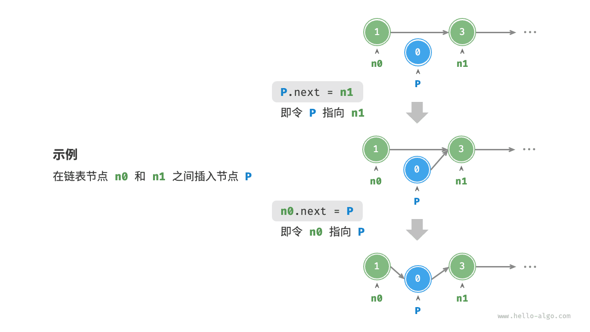
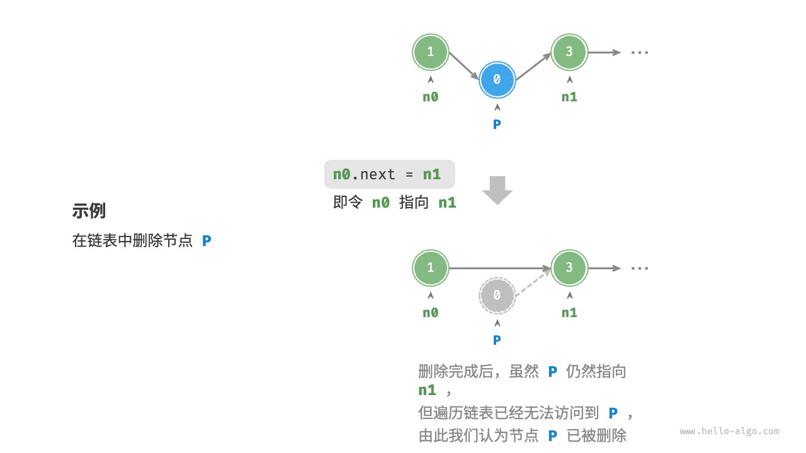

# 链表｜链表常用操作

> 来源：[krahets 与《Hello 算法》开源贡献者](https://www.hello-algo.com/chapter_array_and_linkedlist/linked_list/)  
> 许可：[CC BY-NC-SA 4.0](https://creativecommons.org/licenses/by-nc-sa/4.0/)  
> 语言：原生简体中文  
> 版本：69932aed1891a7b7f6a0de88cd116d3fe13e7032  
> 署名：原作《Hello 算法》，作者 krahets 及开源贡献者。  
> 使用限制：仅限实验室内部、个人学习与其他非商业用途；改编内容须保持相同许可。

## 链表常用操作

### 初始化链表

建立链表分为两步，第一步是初始化各个节点对象，第二步是构建节点之间的引用关系。初始化完成后，我们就可以从链表的头节点出发，通过引用指向 `next` 依次访问所有节点。

=== "Python"

    ```python title="linked_list.py"
    # 初始化链表 1 -> 3 -> 2 -> 5 -> 4
    # 初始化各个节点
    n0 = ListNode(1)
    n1 = ListNode(3)
    n2 = ListNode(2)
    n3 = ListNode(5)
    n4 = ListNode(4)
    # 构建节点之间的引用
    n0.next = n1
    n1.next = n2
    n2.next = n3
    n3.next = n4
    ```

=== "C++"

    ```cpp title="linked_list.cpp"
    /* 初始化链表 1 -> 3 -> 2 -> 5 -> 4 */
    // 初始化各个节点
    ListNode* n0 = new ListNode(1);
    ListNode* n1 = new ListNode(3);
    ListNode* n2 = new ListNode(2);
    ListNode* n3 = new ListNode(5);
    ListNode* n4 = new ListNode(4);
    // 构建节点之间的引用
    n0->next = n1;
    n1->next = n2;
    n2->next = n3;
    n3->next = n4;
    ```

=== "Java"

    ```java title="linked_list.java"
    /* 初始化链表 1 -> 3 -> 2 -> 5 -> 4 */
    // 初始化各个节点
    ListNode n0 = new ListNode(1);
    ListNode n1 = new ListNode(3);
    ListNode n2 = new ListNode(2);
    ListNode n3 = new ListNode(5);
    ListNode n4 = new ListNode(4);
    // 构建节点之间的引用
    n0.next = n1;
    n1.next = n2;
    n2.next = n3;
    n3.next = n4;
    ```

=== "C#"

    ```csharp title="linked_list.cs"
    /* 初始化链表 1 -> 3 -> 2 -> 5 -> 4 */
    // 初始化各个节点
    ListNode n0 = new(1);
    ListNode n1 = new(3);
    ListNode n2 = new(2);
    ListNode n3 = new(5);
    ListNode n4 = new(4);
    // 构建节点之间的引用
    n0.next = n1;
    n1.next = n2;
    n2.next = n3;
    n3.next = n4;
    ```

=== "Go"

    ```go title="linked_list.go"
    /* 初始化链表 1 -> 3 -> 2 -> 5 -> 4 */
    // 初始化各个节点
    n0 := NewListNode(1)
    n1 := NewListNode(3)
    n2 := NewListNode(2)
    n3 := NewListNode(5)
    n4 := NewListNode(4)
    // 构建节点之间的引用
    n0.Next = n1
    n1.Next = n2
    n2.Next = n3
    n3.Next = n4
    ```

=== "Swift"

    ```swift title="linked_list.swift"
    /* 初始化链表 1 -> 3 -> 2 -> 5 -> 4 */
    // 初始化各个节点
    let n0 = ListNode(x: 1)
    let n1 = ListNode(x: 3)
    let n2 = ListNode(x: 2)
    let n3 = ListNode(x: 5)
    let n4 = ListNode(x: 4)
    // 构建节点之间的引用
    n0.next = n1
    n1.next = n2
    n2.next = n3
    n3.next = n4
    ```

=== "JS"

    ```javascript title="linked_list.js"
    /* 初始化链表 1 -> 3 -> 2 -> 5 -> 4 */
    // 初始化各个节点
    const n0 = new ListNode(1);
    const n1 = new ListNode(3);
    const n2 = new ListNode(2);
    const n3 = new ListNode(5);
    const n4 = new ListNode(4);
    // 构建节点之间的引用
    n0.next = n1;
    n1.next = n2;
    n2.next = n3;
    n3.next = n4;
    ```

=== "TS"

    ```typescript title="linked_list.ts"
    /* 初始化链表 1 -> 3 -> 2 -> 5 -> 4 */
    // 初始化各个节点
    const n0 = new ListNode(1);
    const n1 = new ListNode(3);
    const n2 = new ListNode(2);
    const n3 = new ListNode(5);
    const n4 = new ListNode(4);
    // 构建节点之间的引用
    n0.next = n1;
    n1.next = n2;
    n2.next = n3;
    n3.next = n4;
    ```

=== "Dart"

    ```dart title="linked_list.dart"
    /* 初始化链表 1 -> 3 -> 2 -> 5 -> 4 */\
    // 初始化各个节点
    ListNode n0 = ListNode(1);
    ListNode n1 = ListNode(3);
    ListNode n2 = ListNode(2);
    ListNode n3 = ListNode(5);
    ListNode n4 = ListNode(4);
    // 构建节点之间的引用
    n0.next = n1;
    n1.next = n2;
    n2.next = n3;
    n3.next = n4;
    ```

=== "Rust"

    ```rust title="linked_list.rs"
    /* 初始化链表 1 -> 3 -> 2 -> 5 -> 4 */
    // 初始化各个节点
    let n0 = Rc::new(RefCell::new(ListNode { val: 1, next: None }));
    let n1 = Rc::new(RefCell::new(ListNode { val: 3, next: None }));
    let n2 = Rc::new(RefCell::new(ListNode { val: 2, next: None }));
    let n3 = Rc::new(RefCell::new(ListNode { val: 5, next: None }));
    let n4 = Rc::new(RefCell::new(ListNode { val: 4, next: None }));

    // 构建节点之间的引用
    n0.borrow_mut().next = Some(n1.clone());
    n1.borrow_mut().next = Some(n2.clone());
    n2.borrow_mut().next = Some(n3.clone());
    n3.borrow_mut().next = Some(n4.clone());
    ```

=== "C"

    ```c title="linked_list.c"
    /* 初始化链表 1 -> 3 -> 2 -> 5 -> 4 */
    // 初始化各个节点
    ListNode* n0 = newListNode(1);
    ListNode* n1 = newListNode(3);
    ListNode* n2 = newListNode(2);
    ListNode* n3 = newListNode(5);
    ListNode* n4 = newListNode(4);
    // 构建节点之间的引用
    n0->next = n1;
    n1->next = n2;
    n2->next = n3;
    n3->next = n4;
    ```

=== "Kotlin"

    ```kotlin title="linked_list.kt"
    /* 初始化链表 1 -> 3 -> 2 -> 5 -> 4 */
    // 初始化各个节点
    val n0 = ListNode(1)
    val n1 = ListNode(3)
    val n2 = ListNode(2)
    val n3 = ListNode(5)
    val n4 = ListNode(4)
    // 构建节点之间的引用
    n0.next = n1;
    n1.next = n2;
    n2.next = n3;
    n3.next = n4;
    ```

=== "Ruby"

    ```ruby title="linked_list.rb"
    # 初始化链表 1 -> 3 -> 2 -> 5 -> 4
    # 初始化各个节点
    n0 = ListNode.new(1)
    n1 = ListNode.new(3)
    n2 = ListNode.new(2)
    n3 = ListNode.new(5)
    n4 = ListNode.new(4)
    # 构建节点之间的引用
    n0.next = n1
    n1.next = n2
    n2.next = n3
    n3.next = n4
    ```

??? pythontutor "可视化运行"

    https://pythontutor.com/render.html#code=class%20ListNode%3A%0A%20%20%20%20%22%22%22%E9%93%BE%E8%A1%A8%E8%8A%82%E7%82%B9%E7%B1%BB%22%22%22%0A%20%20%20%20def%20__init__%28self,%20val%3A%20int%29%3A%0A%20%20%20%20%20%20%20%20self.val%3A%20int%20%3D%20val%20%20%23%20%E8%8A%82%E7%82%B9%E5%80%BC%0A%20%20%20%20%20%20%20%20self.next%3A%20ListNode%20%7C%20None%20%3D%20None%20%20%23%20%E5%90%8E%E7%BB%A7%E8%8A%82%E7%82%B9%E5%BC%95%E7%94%A8%0A%0A%22%22%22Driver%20Code%22%22%22%0Aif%20__name__%20%3D%3D%20%22__main__%22%3A%0A%20%20%20%20%23%20%E5%88%9D%E5%A7%8B%E5%8C%96%E9%93%BE%E8%A1%A8%201%20-%3E%203%20-%3E%202%20-%3E%205%20-%3E%204%0A%20%20%20%20%23%20%E5%88%9D%E5%A7%8B%E5%8C%96%E5%90%84%E4%B8%AA%E8%8A%82%E7%82%B9%0A%20%20%20%20n0%20%3D%20ListNode%281%29%0A%20%20%20%20n1%20%3D%20ListNode%283%29%0A%20%20%20%20n2%20%3D%20ListNode%282%29%0A%20%20%20%20n3%20%3D%20ListNode%285%29%0A%20%20%20%20n4%20%3D%20ListNode%284%29%0A%20%20%20%20%23%20%E6%9E%84%E5%BB%BA%E8%8A%82%E7%82%B9%E4%B9%8B%E9%97%B4%E7%9A%84%E5%BC%95%E7%94%A8%0A%20%20%20%20n0.next%20%3D%20n1%0A%20%20%20%20n1.next%20%3D%20n2%0A%20%20%20%20n2.next%20%3D%20n3%0A%20%20%20%20n3.next%20%3D%20n4&cumulative=false&curInstr=3&heapPrimitives=nevernest&mode=display&origin=opt-frontend.js&py=311&rawInputLstJSON=%5B%5D&textReferences=false

数组整体是一个变量，比如数组 `nums` 包含元素 `nums[0]` 和 `nums[1]` 等，而链表是由多个独立的节点对象组成的。**我们通常将头节点当作链表的代称**，比如以上代码中的链表可记作链表 `n0` 。

### 插入节点

在链表中插入节点非常容易。如下图所示，假设我们想在相邻的两个节点 `n0` 和 `n1` 之间插入一个新节点 `P` ，**则只需改变两个节点引用（指针）即可**，时间复杂度为 $O(1)$ 。

相比之下，在数组中插入元素的时间复杂度为 $O(n)$ ，在大数据量下的效率较低。



```src
[file]{linked_list}-[class]{}-[func]{insert}
```

### 删除节点

如下图所示，在链表中删除节点也非常方便，**只需改变一个节点的引用（指针）即可**。

请注意，尽管在删除操作完成后节点 `P` 仍然指向 `n1` ，但实际上遍历此链表已经无法访问到 `P` ，这意味着 `P` 已经不再属于该链表了。



```src
[file]{linked_list}-[class]{}-[func]{remove}
```

### 访问节点

**在链表中访问节点的效率较低**。如上一节所述，我们可以在 $O(1)$ 时间下访问数组中的任意元素。链表则不然，程序需要从头节点出发，逐个向后遍历，直至找到目标节点。也就是说，访问链表的第 $i$ 个节点需要循环 $i - 1$ 轮，时间复杂度为 $O(n)$ 。

```src
[file]{linked_list}-[class]{}-[func]{access}
```

### 查找节点

遍历链表，查找其中值为 `target` 的节点，输出该节点在链表中的索引。此过程也属于线性查找。代码如下所示：

```src
[file]{linked_list}-[class]{}-[func]{find}
```
