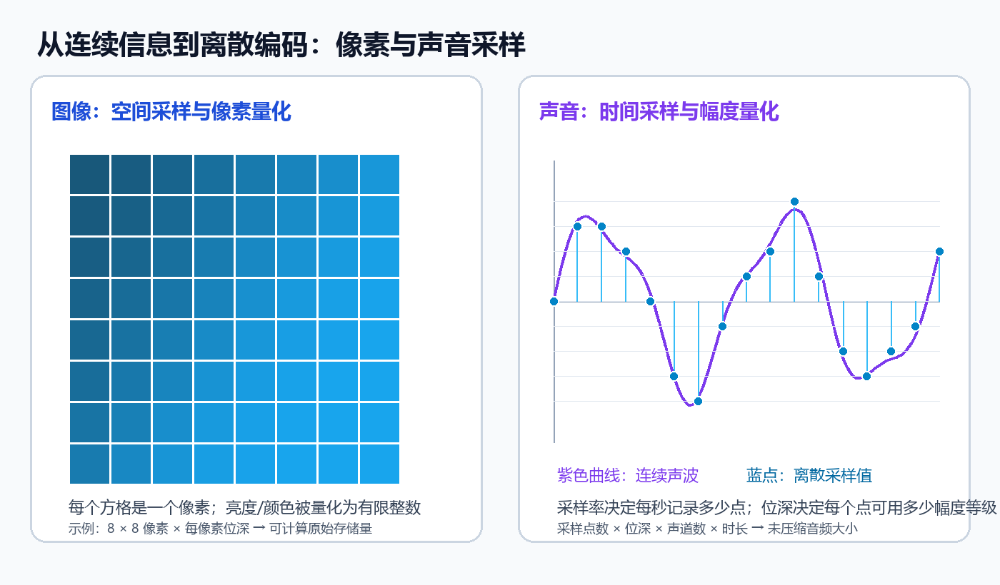

# 文本、图像与声音编码｜案例与实践

> 编写：Edu AI 计算思维课程知识库  
> 类型：原创教学资料  
> 语言：简体中文  
> 许可：CC BY-NC-SA 4.0  
> 编写依据：课程图谱 v2 与所列课程标准/开放教材，仅作知识体系参照

## 学习目标
1. 能够根据实际需求情境，计算多媒体数据的存储预算。
2. 通过编程验证理论计算值与实际文件头的差异。
3. 评估不同编码参数对系统资源的影响，形成工程权衡意识。

## 真实问题情境
某数字博物馆计划建立“口述历史”档案库。项目需存储采访视频对应的独立音频文件、扫描文档文本及文物高清图片。IT 部门要求你作为技术助理，评估存储服务器的容量需求，并制定数据采集标准。你需要确保数据不失真的前提下，避免过度浪费存储空间。

## 输入输出与材料
**输入材料**：
1. **音频规范**：单声道语音，最高频率 4kHz，量化位深 16 位，每条录音平均 30 分钟。
2. **图像规范**：文物照片分辨率 $4000 \times 3000$，真彩色（24 位），共 500 张。
3. **文本规范**：采访转录稿，平均每篇 5000 汉字，采用 UTF-8 编码，共 100 篇。

**输出要求**：
1. 各类数据的理论原始大小计算表。
2. 总存储需求估算（单位：GB）。
3. Python 验证脚本及运行结果。

### 图示：像素与声音如何离散编码



左侧把连续画面划分为有限像素格，并把每格颜色或亮度量化为整数；右侧在连续声波上按固定时间间隔取样，再把每个样本的幅度映射到有限等级。这两种过程都体现了“采样决定记录位置，量化决定每个位置可表示的精度”。

## 分步任务
### 任务一：理论计算
根据编码原理，手动计算三类媒体的未压缩大小。注意单位换算（$1 \text{ GB} = 1024^3 \text{ Bytes}$）。对于音频，需先确定满足奈奎斯特定理的最低采样率。
### 任务二：编程验证
编写 Python 脚本，定义计算函数，输入参数为分辨率、位深、时长等，输出理论字节数。模拟生成一个小型测试文件（如少量像素的图像数据），验证计算逻辑是否正确。
### 任务三：差异分析
查阅常见文件格式（如 WAV、BMP）的文件头结构，说明理论计算值为何通常小于实际文件大小。记录文件头带来的额外开销比例。

## 参考实现
以下脚本用于计算原始数据大小：
```python
def calc_audio_size(duration_min, freq_hz, bit_depth, channels):
    bytes_per_sample = bit_depth / 8
    samples_per_sec = freq_hz
    total_bytes = duration_min * 60 * samples_per_sec * bytes_per_sample * channels
    return total_bytes

def calc_image_size(width, height, bit_depth):
    return width * height * (bit_depth / 8)

def calc_text_size(char_count, bytes_per_char=3):
    return char_count * bytes_per_char

# 示例计算：音频最低采样率设为 8000Hz (4kHz * 2)
audio_bytes = calc_audio_size(30, 8000, 16, 1)
image_bytes = calc_image_size(4000, 3000, 24)
text_bytes = calc_text_size(5000, 3)

total_gb = (audio_bytes * 100 + image_bytes * 500 + text_bytes * 100) / (1024**3)
print(f"总需求估算：{total_gb:.2f} GB")
```

## 测试与边界情况
1. **边界测试**：当文本内容为纯 ASCII 字符时，UTF-8 字节数应减半。脚本应能处理不同字符集假设。
2. **异常情况**：若图像包含 Alpha 通道（透明度），位深应从 24 变为 32 位。需在计算中考虑此参数变化。
3. **精度问题**：计算结果涉及浮点数运算，最终存储分配应向上取整，避免空间不足。

## 评价量规
| 维度 | 优秀 (A) | 合格 (B) | 待改进 (C) |
| :--- | :--- | :--- | :--- |
| **计算准确性** | 所有公式正确，单位换算无误，考虑了采样定理 | 公式基本正确，单位换算有个别错误 | 核心公式错误，未考虑声道或位深 |
| **代码质量** | 函数封装良好，变量命名清晰，有注释 | 代码可运行，但结构松散 | 代码无法运行或逻辑混乱 |
| **工程意识** | 主动分析文件头开销，提出冗余备份建议 | 仅完成理论计算，未考虑实际格式开销 | 完全忽略实际存储与理论的差异 |

## 拓展问题
1. 若存储预算减半，你建议调整哪个参数？（提示：比较降低图像分辨率与降低音频采样率对信息损失的影响）。
2. 实际项目中常使用 MP3 或 JPEG 格式，这些有损压缩格式如何改变上述计算模型？请调研压缩比典型值并修正估算。
3. 文本编码若混入 Emoji 表情，UTF-8 字节长度会发生什么变化？这对定长数据库字段设计有何挑战？
