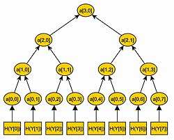

# 算法｜精选补充资料

> 来源：[维基百科（中文）](https://zh.wikipedia.org/wiki/%E7%AE%97%E6%B3%95)  
> 许可：[CC BY-SA 4.0](https://creativecommons.org/licenses/by-sa/4.0/)  
> 语言：简体中文  
> 获取时间：2026-08-08T09:43:43.262216+00:00

维基百科，自由的百科全书

[](/wiki/File:LampFlowchart_ZhS.svg)

应对灯泡不亮的简单算法[流程图](/wiki/%E6%B5%81%E7%A8%8B%E5%9B%BE "流程图")

**算法**（英語：algorithm），在[数学](/wiki/%E6%95%B0%E5%AD%A6 "数学")（[算学](/wiki/%E7%AE%97%E5%AD%B8 "算學")）和[计算机科学](/wiki/%E8%AE%A1%E7%AE%97%E6%9C%BA%E7%A7%91%E5%AD%A6 "计算机科学")中指一个被定义好的、计算机可施行其指示的有限步骤或次序，常用于[计算](/wiki/%E8%AE%A1%E7%AE%97 "计算")、[数据处理](/wiki/%E6%95%B0%E6%8D%AE%E5%A4%84%E7%90%86 "数据处理")和[自动推理](/wiki/%E8%87%AA%E5%8A%A8%E6%8E%A8%E7%90%86 "自动推理")。算法可以使用条件语句通过各种途径转移代码执行（称为自动决策），并推导出有效的推论（称为自动推理），最终实现自动化。

相反，[启发式](/wiki/%E5%90%AF%E5%8F%91%E5%BC%8F "启发式")是一种解决问题的方法，可能没有完全指定，也可能不能保证正确或最优的结果，尤其是在没有明确定义的正确或最优结果的问题领域。例如，社交媒体[推荐系统](/wiki/%E6%8E%A8%E8%96%A6%E7%B3%BB%E7%B5%B1 "推薦系統")依赖于启发式，尽管在21世纪的流行媒体中被广泛称为*算法*，但由于问题的性质，它无法提供正确的结果。

早在尝试解决[希尔伯特](/wiki/%E5%A4%A7%E5%8D%AB%C2%B7%E5%B8%8C%E5%B0%94%E4%BC%AF%E7%89%B9 "大卫·希尔伯特")提出的[判定问题](/wiki/%E5%8F%AF%E5%88%A4%E5%AE%9A%E6%80%A7 "可判定性")时，算法的不完整概念已经初步定型；在其后的正式化阶段中人們尝试去定义“[有效可计算性](/w/index.php?title=%E6%9C%89%E6%95%88%E5%8F%AF%E8%AE%A1%E7%AE%97%E6%80%A7&action=edit&redlink=1 "有效可计算性（页面不存在）")（英语：[Effective calculability](https://en.wikipedia.org/wiki/Effective_calculability "en:Effective calculability")）”或者“[有效方法](/w/index.php?title=%E6%9C%89%E6%95%88%E6%96%B9%E6%B3%95&action=edit&redlink=1 "有效方法（页面不存在）")（英语：[Effective method](https://en.wikipedia.org/wiki/Effective_method "en:Effective method")）”。这些尝试包括[库尔特·哥德尔](/wiki/%E5%BA%93%E5%B0%94%E7%89%B9%C2%B7%E5%93%A5%E5%BE%B7%E5%B0%94 "库尔特·哥德尔")、[雅克·埃尔布朗](/wiki/%E9%9B%85%E5%85%8B%C2%B7%E5%9F%83%E5%B0%94%E5%B8%83%E6%9C%97 "雅克·埃尔布朗")和[斯蒂芬·科尔·克莱尼](/wiki/%E6%96%AF%E8%92%82%E8%8A%AC%C2%B7%E7%A7%91%E5%B0%94%C2%B7%E5%85%8B%E8%8E%B1%E5%B0%BC "斯蒂芬·科尔·克莱尼")分别于1930年、1934年和1935年提出的[递归函数](/wiki/%E9%80%92%E5%BD%92%E5%87%BD%E6%95%B0 "递归函数")，[阿隆佐·邱奇](/wiki/%E9%98%BF%E9%9A%86%E4%BD%90%C2%B7%E9%82%B1%E5%A5%87 "阿隆佐·邱奇")于1936年提出的[λ演算](/wiki/%CE%9B%E6%BC%94%E7%AE%97 "Λ演算")，1936年[埃米尔·莱昂·珀斯特](/w/index.php?title=%E5%9F%83%E7%B1%B3%E5%B0%94%C2%B7%E8%8E%B1%E6%98%82%C2%B7%E7%8F%80%E6%96%AF%E7%89%B9&action=edit&redlink=1 "埃米尔·莱昂·珀斯特（页面不存在）")（英语：[Emil Leon Post](https://en.wikipedia.org/wiki/Emil_Leon_Post "en:Emil Leon Post")）的[波斯特-图灵机](/wiki/%E6%B3%A2%E6%96%AF%E7%89%B9-%E5%9B%BE%E7%81%B5%E6%9C%BA "波斯特-图灵机")和[艾伦·图灵](/wiki/%E8%89%BE%E4%BC%A6%C2%B7%E5%9B%BE%E7%81%B5 "艾伦·图灵")1937年提出的[图灵机](/wiki/%E5%9B%BE%E7%81%B5%E6%9C%BA "图灵机")。即使在当下，依然常有符合直觉的想法难以定义为形式化算法的情况。

算法是[有效方法](/w/index.php?title=%E6%9C%89%E6%95%88%E6%96%B9%E6%B3%95&action=edit&redlink=1 "有效方法（页面不存在）")（英语：[Effective method](https://en.wikipedia.org/wiki/Effective_method "en:Effective method")），包含一系列定义清晰的指令，并可于[有限的](https://zh.wiktionary.org/wiki/Special:Search/%E6%9C%89%E9%99%90%E7%9A%84 "wikt:Special:Search/有限的")时间及空间内清楚的表述出来。算法中的指令描述的是一个[计算](/wiki/%E8%AE%A1%E7%AE%97 "计算")，它[执行](/w/index.php?title=%E6%89%A7%E8%A1%8C&action=edit&redlink=1 "执行（页面不存在）")（英语：[Execution （computing）](https://en.wikipedia.org/wiki/Execution_%EF%BC%88computing%EF%BC%89 "en:Execution （computing）")）時从一个初始状态和初始输入（可能为[空](/wiki/%E7%A9%BA%E5%AD%97%E7%AC%A6%E4%B8%B2 "空字符串")）开始，经过一系列**有限**而清晰定义的状态最终产生**输出**并**停止**于一个终态。 一个状态到另一个状态的转移不一定是[确定的](/wiki/%E7%A1%AE%E5%AE%9A%E6%80%A7%E7%AE%97%E6%B3%95 "确定性算法")。 包括[随机化算法](/wiki/%E9%9A%8F%E6%9C%BA%E5%8C%96%E7%AE%97%E6%B3%95 "随机化算法")在内的一些算法，都包含了一些随机输入。

## 历史

算法在中国古代文献中称为“术”，最早出现在《[周髀算經](/wiki/%E5%91%A8%E9%AB%80%E7%AE%97%E7%B6%93 "周髀算經")》、《[九章算术](/wiki/%E4%B9%9D%E7%AB%A0%E7%AE%97%E6%9C%AF "九章算术")》。特别是《九章算术》，给出[四则运算](/wiki/%E5%9B%9B%E5%88%99%E8%BF%90%E7%AE%97 "四则运算")、[最大公约数](/wiki/%E6%9C%80%E5%A4%A7%E5%85%AC%E7%BA%A6%E6%95%B0 "最大公约数")、最小公倍数、开[平方根](/wiki/%E5%B9%B3%E6%96%B9%E6%A0%B9 "平方根")、开[立方根](/wiki/%E7%AB%8B%E6%96%B9%E6%A0%B9 "立方根")、求[素数](/wiki/%E7%B4%A0%E6%95%B0 "素数")的[埃氏篩](/wiki/%E5%9F%83%E6%B0%8F%E7%AF%A9 "埃氏篩")，线性方程组求解的[高斯消元法](/wiki/%E9%AB%98%E6%96%AF%E6%B6%88%E5%85%83%E6%B3%95 "高斯消元法")。三国時代的[刘徽](/wiki/%E5%88%98%E5%BE%BD "刘徽")给出求圆周率的算法：[刘徽割圆术](/wiki/%E5%88%98%E5%BE%BD%E5%89%B2%E5%9C%86%E6%9C%AF "刘徽割圆术")。

自唐代以来，历代更有许多专门论述“算法”的专著：

* 唐代：《一位算法》 一卷，《算法》 一卷；
* 宋代：《算法绪论》 一卷、《算法秘诀》 一卷；最著名的是[杨辉](/wiki/%E6%9D%A8%E8%BE%89 "杨辉")的《[杨辉算法](/wiki/%E6%9D%A8%E8%BE%89%E7%AE%97%E6%B3%95 "杨辉算法")》；
* 元代：《[丁巨算法](/wiki/%E4%B8%81%E5%B7%A8%E7%AE%97%E6%B3%95 "丁巨算法")》；
* 明代：[程大位](/wiki/%E7%A8%8B%E5%A4%A7%E4%BD%8D "程大位") 《[算法统宗](/wiki/%E7%AE%97%E6%B3%95%E7%B5%B1%E5%AE%97 "算法統宗")》
* 清代：《开平算法》、《算法一得》、《[算法全书](/w/index.php?title=%E7%AE%97%E6%B3%95%E5%85%A8%E4%B9%A6&action=edit&redlink=1 "算法全书（页面不存在）")》。

而英文名稱「algorithm」来自于9世纪[波斯](/wiki/%E6%B3%A2%E6%96%AF "波斯")数学家[花拉子米](/wiki/%E8%8A%B1%E6%8B%89%E5%AD%90%E7%B1%B3 "花拉子米")（比阿勒·霍瓦里松，波斯語：خوارزمی，拉丁轉寫：al-Khwarizmi），因為比阿勒·霍瓦里松在[数学](/wiki/%E6%95%B0%E5%AD%A6 "数学")上提出了算法这个概念。「算法」原为「algorism」，即“al-Khwarizmi”的音转，意思是“[花剌子模](/wiki/%E8%8A%B1%E5%89%8C%E5%AD%90%E6%A8%A1 "花剌子模")的”运算法则，在18世纪演变为「algorithm」。

[欧几里得算法](/wiki/%E6%AC%A7%E5%87%A0%E9%87%8C%E5%BE%97%E7%AE%97%E6%B3%95 "欧几里得算法")被人们认为是史上第一个算法。

第一次编写程序是[愛達·勒芙蕾絲](/wiki/%E6%84%9B%E9%81%94%C2%B7%E5%8B%92%E8%8A%99%E8%95%BE%E7%B5%B2 "愛達·勒芙蕾絲")（Ada Byron）于1842年为[巴贝奇分析机](/wiki/%E5%B7%B4%E8%B4%9D%E5%A5%87%E5%88%86%E6%9E%90%E6%9C%BA "巴贝奇分析机")编写求解解[伯努利微分方程](/wiki/%E4%BC%AF%E5%8A%AA%E5%88%A9%E5%BE%AE%E5%88%86%E6%96%B9%E7%A8%8B "伯努利微分方程")的[程序](/wiki/%E7%A8%8B%E5%BA%8F "程序")，因此愛達·勒芙蕾絲被大多数人认为是世界上第一位[程序员](/wiki/%E7%A8%8B%E5%BA%8F%E5%91%98 "程序员")。因为[查尔斯·巴贝奇](/wiki/%E6%9F%A5%E5%B0%94%E6%96%AF%C2%B7%E5%B7%B4%E8%B4%9D%E5%A5%87 "查尔斯·巴贝奇")（Charles Babbage）未能完成他的巴贝奇分析机，这个算法未能在巴贝奇分析机上执行。
因为「well-defined procedure」缺少数学上精确的定义，19世纪和20世纪早期的数学家、[逻辑学家](/wiki/%E9%80%BB%E8%BE%91%E5%AD%A6%E5%AE%B6 "逻辑学家")在定义算法上出现了困难。20世纪的[英国](/wiki/%E8%8B%B1%E5%9B%BD "英国")数学家[图灵](/wiki/%E5%9B%BE%E7%81%B5 "图灵")提出了著名的[图灵论题](/wiki/%E9%82%B1%E5%A5%87%EF%BC%8D%E5%9B%BE%E7%81%B5%E8%AE%BA%E9%A2%98 "邱奇－图灵论题")，并提出一种假想的[电脑](/w/index.php?title=%E7%94%B5%E5%AD%90%E7%94%B5%E8%84%91&action=edit&redlink=1 "电子电脑（页面不存在）")的抽象模型，这个模型被称为[图灵机](/wiki/%E5%9B%BE%E7%81%B5%E6%9C%BA "图灵机")。图灵机的出现解决了算法定义的难题，图灵的思想对算法的发展起到了重要的作用。

## 特征

以下是[高德纳](/wiki/%E9%AB%98%E5%BE%B7%E7%BA%B3 "高德纳")在他的著作《[计算机程序设计艺术](/wiki/%E8%AE%A1%E7%AE%97%E6%9C%BA%E7%A8%8B%E5%BA%8F%E8%AE%BE%E8%AE%A1%E8%89%BA%E6%9C%AF "计算机程序设计艺术")》里对演算法的特征归纳：

[](/wiki/File:MerkleTree1.JPG)

1. 输入：一个算法必须有零个或以上输入量。
2. 输出：一个算法应有一个或以上输出量，输出量是算法计算的结果。
3. 明确性：算法的描述必须无歧义，以保证算法的实际执行结果是精确地符合要求或期望，通常要求实际执行结果是确定的。
4. 有限性：依据图灵的定义，一个演算法是能够被任何[图灵完备](/wiki/%E5%9B%BE%E7%81%B5%E5%AE%8C%E5%85%A8 "图灵完全")系统模拟的一串运算，而[图灵机](/wiki/%E5%9B%BE%E7%81%B5%E6%9C%BA "图灵机")只有有限个状态、有限个输入符号和有限个转移函数（指令）。而一些定义更规定演算法必须在有限个步骤内完成任务。
5. 有效性：又称可行性。能够实现，算法中描述的操作都是可以通过已经实现的基本运算执行有限次来实现。

## 基本要素

算法的核心是建立问题抽象的模型和明确求解目标，之后可以根据具体的问题选择不同的模式和方法完成算法的设计。

### 常用设计模式

完全[遍历法](/w/index.php?title=%E9%81%8D%E5%8E%86%E6%B3%95&action=edit&redlink=1 "遍历法（页面不存在）")和不完全遍历法：在问题的解是有限离散解空间，且可以验证正确性和最优性时，最简单的算法就是把解空间的所有元素完全遍历一遍，逐个检测元素是否是我们要的解。这是最直接的算法，实现往往最简单。但是当解空间特别庞大时，这种算法很可能导致工程上无法承受的计算量。这时候可以利用不完全遍历方法——例如各种搜索法和规划法——来减少计算量。
[分治法](/wiki/%E5%88%86%E6%B2%BB%E6%B3%95 "分治法")：把一个问题分割成互相独立的多个部分分别求解的思路。这种求解思路带来的好处之一是便于进行并行计算。
[动态规划](/wiki/%E5%8A%A8%E6%80%81%E8%A7%84%E5%88%92 "动态规划")法：当问题的整体最优解就是由局部最优解组成的时候，经常采用的一种方法。[贪婪算法](/wiki/%E8%B4%AA%E5%BF%83%E6%B3%95 "贪心法")：常见的近似求解思路。当问题的整体最优解不是（或无法证明是）由局部最优解组成，且对解的最优性没有要求的时候，可以采用的一种方法。
[线性规划](/wiki/%E7%BA%BF%E6%80%A7%E8%A7%84%E5%88%92 "线性规划")法：见条目。
简并法：把一个问题通过逻辑或数学推理，简化成与之等价或者近似的、相对简单的模型，进而求解的方法。

### 常用实现方法

[递归方法](/wiki/%E9%80%92%E5%BD%92 "递归")与[迭代方法](/wiki/%E8%BF%AD%E4%BB%A3 "迭代")
顺序计算、[并行计算](/wiki/%E5%B9%B6%E8%A1%8C%E8%AE%A1%E7%AE%97 "并行计算")和[分布式运算](/w/index.php?title=%E5%88%86%E5%B8%83%E5%BC%8F%E8%BF%90%E7%AE%97&action=edit&redlink=1 "分布式运算（页面不存在）")：顺序计算就是把形式化算法用程序设计语言进行单线程序列化后执行。
确定性算法和非确定性算法
精确求解和近似求解

## 形式化算法

算法是电脑处理信息的本质，這是因为计算机程序本质上是一个用以告诉电脑确切的步骤並從中执行一个指定的任务的算法，如计算职工的薪水或打印学生的成绩单。一般而言，当算法在处理信息时，会从[输入装置](/wiki/%E8%BC%B8%E5%85%A5%E8%A3%9D%E7%BD%AE "輸入裝置")或数据的存储地址读取数据，將结果写入[输出设备](/wiki/%E8%BE%93%E5%87%BA%E8%AE%BE%E5%A4%87 "输出设备")或某个存储地址供以后再调用。

## 复杂度

### 时间复杂度

主条目：[时间复杂度](/wiki/%E6%97%B6%E9%97%B4%E5%A4%8D%E6%9D%82%E5%BA%A6 "时间复杂度")

参见：[P (複雜度)](/wiki/P_(%E8%A4%87%E9%9B%9C%E5%BA%A6) "P (複雜度)")和[NP (複雜度)](/wiki/NP_(%E8%A4%87%E9%9B%9C%E5%BA%A6) "NP (複雜度)")

算法的[时间复杂度](/wiki/%E6%97%B6%E9%97%B4%E5%A4%8D%E6%9D%82%E5%BA%A6 "时间复杂度")是指算法需要消耗的时间资源。一般来说，电脑算法是问题规模


n
{\displaystyle n}
${\displaystyle n}$的函数


f
(
n
)
{\displaystyle f(n)}
${\displaystyle f(n)}$，算法的时间复杂度也因此记做
：


T
(
n
)
=


O
(
f
(
n
)
)
{\displaystyle T(n)={\mathcal {O}}(f(n))}
${\displaystyle T(n)={\mathcal {O}}(f(n))}$
算法执行时间的增长率与


f
(
n
)
{\displaystyle f(n)}
${\displaystyle f(n)}$的增长率正相关，称作[渐近时间复杂度](/w/index.php?title=%E6%B8%90%E8%BF%91%E6%97%B6%E9%97%B4%E5%A4%8D%E6%9D%82%E5%BA%A6&action=edit&redlink=1 "渐近时间复杂度（页面不存在）")（英语：[Asymptotic computational complexity](https://en.wikipedia.org/wiki/Asymptotic_computational_complexity "en:Asymptotic computational complexity")），简称时间复杂度。
常见的时间复杂度有：常数阶


O
(
1
)
{\displaystyle O(1)}
${\displaystyle O(1)}$，对数阶


O
(
log
⁡
n
)
{\displaystyle O(\log n)}
${\displaystyle O(\log n)}$，线性阶


O
(
n
)
{\displaystyle O(n)}
${\displaystyle O(n)}$，线性对数阶


O
(
n
log
⁡
n
)
{\displaystyle O(n\log n)}
${\displaystyle O(n\log n)}$，平方阶


O
(

n

2
)
{\displaystyle O(n^{2})}
${\displaystyle O(n^{2})}$，立方阶


O
(

n

3
)
{\displaystyle O(n^{3})}
${\displaystyle O(n^{3})}$，...，


k
{\displaystyle k}
${\displaystyle k}$次方阶


O
(

n

k
)
{\displaystyle O(n^{k})}
${\displaystyle O(n^{k})}$，指数阶


O
(

2

n
)
{\displaystyle O(2^{n})}
${\displaystyle O(2^{n})}$。随着问题规模


n
{\displaystyle n}
${\displaystyle n}$的不断增大，上述时间复杂度不断增大，算法的执行效率越低。

### 空间复杂度

主条目：[空间复杂度](/wiki/%E7%A9%BA%E9%97%B4%E5%A4%8D%E6%9D%82%E5%BA%A6 "空间复杂度")

算法的[空间复杂度](/wiki/%E7%A9%BA%E9%97%B4%E5%A4%8D%E6%9D%82%E5%BA%A6 "空间复杂度")是指算法需要消耗的空间资源，其计算及表示方法与时间复杂度类似，一般會使用复杂度的[渐近性](/w/index.php?title=%E6%B8%90%E8%BF%91%E6%80%A7&action=edit&redlink=1 "渐近性（页面不存在）")表示。不過，與时间复杂度相比，空间复杂度的分析是简单許多的。

## 实现

算法不单可以依靠计算机程序的使用所实现，也可以在[人工神经网络](/wiki/%E4%BA%BA%E5%B7%A5%E7%A5%9E%E7%BB%8F%E7%BD%91%E7%BB%9C "人工神经网络")、[电路](/wiki/%E7%94%B5%E8%B7%AF "电路")或者[机械](/wiki/%E6%9C%BA%E6%A2%B0 "机械")设备上实现。

## 示例

### 求最大值演算法

这是算法的一个简单的例子。
例如，若有一串随机[数列](/wiki/%E6%95%B0%E5%88%97 "数列")，目标是找出其中最大的数。如果把数列中的每个数值比作一颗豆子的大小，可以把下面的算法形象地称为“捡豆子”：

1. 首先将第一颗豆子放入口袋中。
2. 从第二颗豆子开始逐一检查；如果当前豆子比口袋中的豆子更大，就把它放入口袋，并丢掉原来的豆子，否则继续检查下一颗。
3. 检查完最后一颗豆子后，口袋中的豆子就是所有豆子中最大的一颗。以上算法在中国大陆的教科书中通常被称为“打擂法”或者“循环打擂”：在一个for循环中，每轮循环都有新的挑战者。若挑战者胜的话，挑战者做新擂主，否则擂主卫冕。for循环结束后输出最后的擂主。

下面是一个形式算法，用[ANSI C](/wiki/C%E8%AF%AD%E8%A8%80 "C语言")代码表示

```
int max（int *array, int size）
{
  int mval = *array;
  int i;
  for （i = 1; i < size; i++）
    if （array[i] > mval）
      mval = array[i];
  return mval;
}
```

### 求最大公約數演算法

求两个自然数的[最大公约数](/wiki/%E6%9C%80%E5%A4%A7%E5%85%AC%E7%BA%A6%E6%95%B0 "最大公约数")
设两个变量


M
{\displaystyle M}
${\displaystyle M}$和


N
{\displaystyle N}
${\displaystyle N}$

1. 如果


   M
   <
   N
   {\displaystyle M<N}
   ${\displaystyle M<N}$，则交换


   M
   {\displaystyle M}
   ${\displaystyle M}$和


   N
   {\displaystyle N}
   ${\displaystyle N}$
2. M
   {\displaystyle M}
   ${\displaystyle M}$除以


   N
   {\displaystyle N}
   ${\displaystyle N}$，得到余数


   R
   {\displaystyle R}
   ${\displaystyle R}$
3. 判断


   R
   =
   0
   {\displaystyle R=0}
   ${\displaystyle R=0}$，正确则


   N
   {\displaystyle N}
   ${\displaystyle N}$即为“最大公约数”，否则下一步
4. 将


   N
   {\displaystyle N}
   ${\displaystyle N}$赋值给


   M
   {\displaystyle M}
   ${\displaystyle M}$，将


   R
   {\displaystyle R}
   ${\displaystyle R}$赋值给


   N
   {\displaystyle N}
   ${\displaystyle N}$，重做第一步。

用[ANSI C](/wiki/C%E8%AF%AD%E8%A8%80 "C语言")代码表示

```
//交換2數
void swapi（int *x, int *y）
{
  int tmp = *x;
  *x = *y;
  *y = tmp;
}

int gcd（int m, int n）
{
  int r;
  do
  {
    if （m < n）
      swapi（&m, &n）;
    r = m % n;
    m = n;
    n = r;
  } while （r）;
  return m;
}
```

利用if函式以及遞迴則能做出更為精簡的程式碼，更可省去交換的麻煩。（但是也因為遞迴呼叫，其空間複雜度提高）

```
int gcd（int a,int b）
{
    if（a%b）
        return gcd（b,a%b）;
    return b;
}
```

## 分类

分类算法有多种方法，每种方法都有自己的优点。

### 通过实施

分类算法的一种方法是通过实现手段。

|  |
| --- |
| ``` int gcd（int A, int B） {     if （B == 0）         return A;     else if （A > B）         return gcd（A-B,B）;     else         return gcd（A,B-A）; } ``` |
| 从上面的流程图递归 C 实现欧几里得算法 |

递归
:   递归算法是一种重复调用（引用）自身的算法，直到某个条件（也称为终止条件）匹配，这是函数式编程常用的方法。迭代算法使用循环之类的重复构造，有时使用堆栈之类的附加数据结构来解决给定的问题。有些问题自然适合于这种或那种实现。例如，使用递归实现可以很好地理解河内的塔。每个递归版本都有一个等价的（但可能或多或少复杂）迭代版本，反之亦然。

串联的、平行的或分布的
:   算法通常是在假设计算机一次执行一条算法指令的情况下讨论的。那些计算机有时被称为串行计算机。针对这种环境设计的算法称为串行算法，而不是并行算法或分布式算法。并行算法是利用计算机体系结构的算法，其中多个处理器可以同时处理一个问题。分布式算法是使用与计算机网络连接的多台机器的算法。并行和分布式算法将问题划分为更加对称或不对称的子问题，并将结果收集在一起。例如，CPU 就是并行算法的一个例子。这种算法的资源消耗不仅是每个处理器上的处理器周期，而且是处理器之间的通信开销。有些排序算法可以有效地并行化，但是它们的通信开销很大。迭代算法通常是可并行的，但有些问题没有并行算法，称为固有的串行问题。

确定的或不确定的
:   确定性算法在算法的每一步都用精确的决策来解决问题，而非确定性算法通过猜测来解决问题，虽然通过启发式使典型的猜测更加精确。

精确的或近似的
:   虽然许多算法达到一个精确的解决方案，近似算法寻求一个近似，更接近真正的解决方案。这种近似可以通过使用确定性策略或随机策略来实现。这些算法对许多难题都有实用价值。近似算法的一个例子是背包问题，其中有一组给定的项目。它的目标是包装背包，以获得最大的总价值。每个物品都有一定的重量和价值。可携带的总重量不超过某个固定数字 X，因此，解决方案必须考虑物品的重量及其价值。

量子算法
:   量子算法运行在一个现实的量子计算模型上。这个术语通常用于那些本质上似乎是量子的算法，或者使用量子计算的一些基本特性，如态叠加原理或量子纠缠。

### 通过设计范例

对算法进行分类的另一种方法是通过它们的设计方法或范例。有一定数量的范例，每一个不同于其他。此外，这些类别中的每一个都包括许多不同类型的算法。一些常见的范例是:

暴力搜查或彻底搜查
:   蛮力是一种解决问题的方法，包括系统地尝试每一种可能的选择，直到找到最佳解决方案。这种方法可能非常耗时，因为它需要遍历所有可能的变量组合。但是，当其他方法不可用或过于复杂时，常常使用这种方法。蛮力可以用来解决各种问题，包括寻找两点之间的最短路径和破解密码。

各个击破
:   分而治之的算法重复地将一个问题的实例减少为同一个问题的一个或多个更小的实例（通常是递归的） ，直到这些实例足够小以便于解决。分而治之的一个例子是合并排序。在将数据分割成片段后，可以对每个片段进行排序，在征服阶段通过合并片段可以对整个数据进行排序。一种更简单的分而治之的算法称为减而治算法，它解决一个相同的子问题，并使用这个子问题的解决方案来解决更大的问题。分治算法将问题划分为多个子问题，因此分治阶段比减少分治算法复杂。递减和征服算法的一个例子是二进制搜索算法。

搜索和枚举
:   许多问题（比如下棋）可以建模为图形上的问题。图探索算法规定了在图中移动的规则，对于这类问题非常有用。这一类别还包括搜索算法、分支和界枚举以及回溯。

[随机算法](/wiki/%E9%9A%8F%E6%9C%BA%E7%AE%97%E6%B3%95 "随机算法")
:   这样的算法随机（或伪随机）做出一些选择。它们可以非常有用地找到近似解决方案的问题，找到精确的解决方案可能是不切实际的（见下面的启发式方法）。对于其中的一些问题，我们知道最快的近似必须包含一些随机性。对于某些问题，具有多项式时间复杂度的随机算法能否成为最快的算法，是一个被称为“ P/NP问题”的悬而未决的问题。这种算法有两大类:

1. 蒙特卡罗算法以高概率返回正确答案。例如 RP 是这些运行在多项式时间的子类。
2. 拉斯维加斯算法总是返回正确的答案，但他们的运行时间只是概率约束，例如 ZPP。

[降低复杂性](/w/index.php?title=Reduction_%EF%BC%88complexity%EF%BC%89&action=edit&redlink=1 "Reduction （complexity）（页面不存在）")
:   这种技术涉及到通过将一个困难问题转化为一个更广为人知的问题来解决它，我们（希望）已经有了渐近最优算法。目标是找到一种复杂度不受所得到的简化算法控制的简化算法。例如，一种用于在未排序列表中查找中值的选择算法首先对列表进行排序（代价较高的部分） ，然后取出排序列表中的中间元素（代价较低的部分）。这种技术也被称为转换和征服。

[反向追踪](/w/index.php?title=Back_tracking&action=edit&redlink=1 "Back tracking（页面不存在）")
:   在这种方法中，多个解决方案是逐步构建的，当确定它们不能生成有效的完整解决方案时，就会放弃这些解决方案。

### 优化问题

对于最优化问题，有一个更具体的算法分类; 这类问题的算法可能属于上述一个或多个一般类别，也可能属于以下类别之一:

[线性规划](/wiki/%E7%BA%BF%E6%80%A7%E8%A7%84%E5%88%92 "线性规划")
:   当搜索受线性等式和不等式约束的线性函数的最优解时，该问题的约束可以直接用于产生最优解。有一些算法可以解决这类问题，比如流行的单纯形法。线性规划可以解决的问题包括有向图的最大流问题。如果一个问题额外要求一个或多个未知数必须是一个整数，那么它被分类为整数规划。一个线性规划算法可以解决这样的问题，如果它可以证明所有的限制整数值是表面的，即，解决方案满足这些限制。在一般情况下，根据问题的难度，使用专门的算法或找到近似解的算法。

[动态编程](/w/index.php?title=%E5%8A%A8%E6%80%81%E7%BC%96%E7%A8%8B&action=edit&redlink=1 "动态编程（页面不存在）")
:   当一个问题显示出最优子结构ーー意味着一个问题的最优解可以从子问题的最优解构造出来ーー和重叠子问题，意味着同一个子问题可以用来解决许多不同的问题实例时，一种叫做动态规划的快速方法可以避免重新计算已经计算出来的解。例如，Floyd-Warshall 算法，在一个加权图中，通过使用从所有相邻顶点到达目标的最短路径，可以找到从一个顶点到达目标的最短路径。动态编程和制表一起使用。动态规划与分治的主要区别在于子问题在分治中或多或少是独立的，而子问题在动态规划中是重叠的。动态编程和简单递归的区别在于递归调用的缓存或制表。当子问题是独立的并且没有重复时，制表不起作用; 因此动态编程不是所有复杂问题的解决方案。通过使用制表法或维护已经解决的子问题表，动态规划将许多问题的指数性质降低到多项式复杂度。

贪婪算法
:   贪婪算法类似于动态规划算法，它通过检查子结构来工作，在这种情况下，不是检查问题，而是检查给定的解。这种算法从某种解开始，这种解可能已经给出或已经以某种方式构造出来，然后通过小的修改对其进行改进。对于一些问题，他们可以找到最优解，而对于其他问题，他们停留在局部最优，也就是说，在解决方案，不能改进的算法，但不是最优的。贪婪算法最常用的用途是寻找最小生成树，在这种方法中可以找到最优解。霍夫曼树，克鲁斯卡尔，普里姆，Sollin 是贪婪的算法，可以解决这个最佳化问题。

启发式方法
:   在优化问题中，如果不能找到最优解，可以使用启发式算法来寻找接近最优解的解。这些算法的工作原理是随着它们的进展越来越接近最优解。原则上，如果运行无限长的时间，他们会找到最优解。它们的优点是能够在相对较短的时间内找到一个非常接近最优解的解。这些算法包括本地搜索、禁忌搜索、模拟退火搜索和遗传算法。其中一些算法，如模拟退火，是非确定性算法，而其他的，如禁忌搜索，是确定性的。当非最优解的误差界限已知时，该算法进一步被归类为近似演算法。

### 通过研究领域

每个科学领域都有自己的问题，需要高效的算法。一个领域中的相关问题经常被一起研究。一些示例类是搜索算法、排序算法、合并算法、数值算法、图形算法、字符串算法、计算几何算法、组合算法、医学算法、机器学习、密码学、数据压缩算法和解析技术。

字段之间往往相互重叠，一个字段的算法进步可能会改进其他字段的算法，有时候这些字段完全不相关。例如，动态规划是为了优化工业中的资源消耗而发明的，但是现在被用于解决许多领域中的广泛问题。

### 通过复杂性

算法可以根据它们需要完成的时间和它们的输入大小进行分类:

* 常数时间: 如果算法所需的时间相同，则不管输入大小如何。例如，对数组元素的访问。
* 对数时间: 如果时间是输入大小的对数函数。二进制搜索算法。
* 线性时间: 如果时间与输入大小成正比。列表的遍历。
* 多项式时间: 如果时间是输入大小的幂次。例如，气泡排序算法具有二次时间复杂度。
* EXPTIME: 如果时间是输入大小的指数函数。例如暴力搜索法。

一些问题可能有多个不同复杂度的算法，而另一些问题可能没有算法或者没有已知的有效算法。还有从一些问题到其他问题的映射。由于这个原因，我们发现根据问题的最佳可能算法的复杂性，将问题本身分类比将算法分为等价类更为合适。

### 连续算法

形容词“连续”用于“算法”一词时，可以表示:

* 对表示连续数量的数据进行操作的算法，即使这些数据是由离散近似表示的ーー这种算法是在数值分析中研究的; 或
* 一种微分方程形式的算法，在模拟计算机上运行，不断地对数据进行操作。

### 基本算法

* [枚举](/wiki/%E6%9E%9A%E4%B8%BE "枚举")
* [搜索](/wiki/%E6%90%9C%E7%B4%A2%E7%AE%97%E6%B3%95 "搜索算法")
  + [深度优先搜索](/wiki/%E6%B7%B1%E5%BA%A6%E4%BC%98%E5%85%88%E6%90%9C%E7%B4%A2 "深度优先搜索")
  + [广度优先搜索](/wiki/%E5%B9%BF%E5%BA%A6%E4%BC%98%E5%85%88%E6%90%9C%E7%B4%A2 "广度优先搜索")
  + [启发式搜索](/w/index.php?title=%E5%90%AF%E5%8F%91%E5%BC%8F%E6%90%9C%E7%B4%A2&action=edit&redlink=1 "启发式搜索（页面不存在）")
  + [遗传算法](/wiki/%E9%81%97%E4%BC%A0%E7%AE%97%E6%B3%95 "遗传算法")
* [数据结构](/wiki/%E6%95%B0%E6%8D%AE%E7%BB%93%E6%9E%84 "数据结构")的算法
* [数论与代数算法](/w/index.php?title=%E6%95%B0%E8%AE%BA%E4%B8%8E%E4%BB%A3%E6%95%B0%E7%AE%97%E6%B3%95&action=edit&redlink=1 "数论与代数算法（页面不存在）")
* [计算几何](/wiki/%E8%AE%A1%E7%AE%97%E5%87%A0%E4%BD%95 "计算几何")的算法
  + [凸包](/wiki/%E5%87%B8%E5%8C%85 "凸包")算法
* [图论](/wiki/%E5%9B%BE%E8%AE%BA "图论")的算法
  + [哈夫曼编码](/wiki/%E5%93%88%E5%A4%AB%E6%9B%BC%E7%BC%96%E7%A0%81 "哈夫曼编码")
  + [树的遍历](/wiki/%E6%A0%91%E7%9A%84%E9%81%8D%E5%8E%86 "树的遍历")
  + [最短路径](/wiki/%E6%9C%80%E7%9F%AD%E8%B7%AF%E5%BE%84 "最短路径")算法
  + [最小生成树](/wiki/%E6%9C%80%E5%B0%8F%E7%94%9F%E6%88%90%E6%A0%91 "最小生成树")算法
  + [最小树形图](/w/index.php?title=%E6%9C%80%E5%B0%8F%E6%A0%91%E5%BD%A2%E5%9B%BE&action=edit&redlink=1 "最小树形图（页面不存在）")
  + [网络流](/wiki/%E7%BD%91%E7%BB%9C%E6%B5%81 "网络流")算法
  + [匹配算法](/w/index.php?title=%E5%8C%B9%E9%85%8D%E7%AE%97%E6%B3%95&action=edit&redlink=1 "匹配算法（页面不存在）")
  + [分團問題](/wiki/%E5%88%86%E5%9C%98%E5%95%8F%E9%A1%8C "分團問題")
* [动态规划](/wiki/%E5%8A%A8%E6%80%81%E8%A7%84%E5%88%92 "动态规划")
* 其他
  + [数值分析](/wiki/%E6%95%B0%E5%80%BC%E5%88%86%E6%9E%90 "数值分析")
  + [加密算法](/wiki/%E5%8A%A0%E5%AF%86%E7%AE%97%E6%B3%95 "加密算法")
  + [排序算法](/wiki/%E6%8E%92%E5%BA%8F%E7%AE%97%E6%B3%95 "排序算法")
  + [检索](/wiki/%E6%AA%A2%E7%B4%A2 "檢索")算法
  + [随机化算法](/wiki/%E9%9A%8F%E6%9C%BA%E5%8C%96%E7%AE%97%E6%B3%95 "随机化算法")
  + 关于并行算法，请参阅[并行计算](/wiki/%E5%B9%B6%E8%A1%8C%E8%AE%A1%E7%AE%97 "并行计算")一文。

1. **[^](#cite_ref-1)** [Thomas H. Cormen](/wiki/%E7%BD%97%E7%BA%B3%E5%BE%B7%C2%B7%E6%9D%8E%E7%BB%B4%E6%96%AF%E7%89%B9 "罗纳德·李维斯特"); Charles E. Leiserson; Ronald L. Rivest; Clifford Stein; 殷建平等译. 第1章 算法在计算机中的作用. [算法导论](https://archive.org/details/suanfadaolun0000unse) 原书第3版. 北京: 机械工业出版社. 2013年1月: 3[5]  [2017-11-14]. [ISBN 978-7-111-40701-0](/wiki/Special:BookSources/978-7-111-40701-0 "Special:BookSources/978-7-111-40701-0") （中文）.  引文使用过时参数`coauthors` ([帮助](/wiki/Help:%E5%BC%95%E6%96%87%E6%A0%BC%E5%BC%8F1%E9%94%99%E8%AF%AF#deprecated_params "Help:引文格式1错误"))
2. **[^](#cite_ref-2)** David A.Grossman，Ophir Frieder，“信息检索：算法和启发式”，2004年第2版，[ISBN](/wiki/%E5%9B%BD%E9%99%85%E6%A0%87%E5%87%86%E4%B9%A6%E5%8F%B7 "国际标准书号") [1402030045](/wiki/Special:BookSources/1402030045 "Special:BookSources/1402030045")
3. **[^](#cite_ref-3)** Kleene（斯蒂芬·科尔·克莱尼）1943 in Davis 1965:274
4. **[^](#cite_ref-4)** Rosser（巴克利·羅瑟）1939 in Davis 1965:225
5. **[^](#cite_ref-5)** Moschovakis, Yiannis N. What is an algorithm?. Engquist, B.; Schmid, W. (编). [Mathematics Unlimited—2001 and beyond](http://citeseer.ist.psu.edu/viewdoc/summary?doi=10.1.1.32.8093). Springer. 2001: 919–936 （Part II）  [2012-09-27]. （原始内容[存档](https://web.archive.org/web/20210424004030/http://citeseer.ist.psu.edu/viewdoc/summary?doi=10.1.1.32.8093)于2021-04-24）.
6. **[^](#cite_ref-6)** Well defined with respect to the agent that executes the algorithm: "There is a computing agent, usually human, which can react to the instructions and carry out the computations"（Rogers 1987:2）.
7. **[^](#cite_ref-7)** "Any classical mathematical algorithm, for example, can be described in a finite number of English words"（Rogers 1987:2）.
8. **[^](#cite_ref-8)** "An algorithm has zero or more inputs, i.e., quantities which are given to it initially before the algorithm begins"（Knuth 1973:5）
9. **[^](#cite_ref-9)** "A procedure which has all the characteristics of an algorithm except that it possibly lacks finiteness may be called a 'computational method'"（Knuth 1973:5）
10. **[^](#cite_ref-10)** "An algorithm has one or more outputs, i.e. quantities which have a specified relation to the inputs"（Knuth 1973:5）
11. **[^](#cite_ref-11)** Whether or not a process with random interior processes （not including the input） is an algorithm is debatable. Rogers opines that: "a computation is carried out in a discrete stepwise fashion, without use of continuous methods or analogue devices... carried forward deterministically, without resort to random methods or devices, e.g., dice" Rogers 1987:2）.
12. **[^](#cite_ref-12)** Whether or not a process with random interior processes （not including the input） is an algorithm is debatable. Rogers opines that: "a computation is carried out in a discrete stepwise fashion, without use of continuous methods or analogue devices ... carried forward deterministically, without resort to random methods or devices, e.g., dice" Rogers 1987:2）.
13. **[^](#cite_ref-Lovelace_Google_13-0)** [Ada Lovelace honoured by Google doodle](http://www.guardian.co.uk/technology/2012/dec/10/ada-lovelace-honoured-google-doodle). The Guardian. 10 December 2012  [10 December 2012]. （原始内容[存档](https://web.archive.org/web/20181225024306/https://www.theguardian.com/technology/2012/dec/10/ada-lovelace-honoured-google-doodle)于2018-12-25）.
14. **[^](#cite_ref-14)** [2.4 赛场统分](https://web.archive.org/web/20170324044038/http://book.51cto.com/art/201303/383482.htm). 读书频道-IT技术图书-51CTO.COM.  [2017-06-07]. （[原始内容](http://book.51cto.com/art/201303/383482.htm)存档于2017-03-24）.
15. **[^](#cite_ref-15)** [实验3-9：循环打擂](http://acm.hnust.edu.cn/JudgeOnline/problem.php?cid=1312&pid=18). 湖南科技大学程序设计在线评测（Online Judge）. [[永久失效連結](/wiki/Wikipedia:%E5%A4%B1%E6%95%88%E9%93%BE%E6%8E%A5 "Wikipedia:失效链接")]
16. **[^](#cite_ref-16)** [高中,算法与程序设计,教案](https://web.archive.org/web/20190603115323/http://www.zaidian.com/gaozhongjiaoan/648112.html). 在点网.  [2017-06-07]. （[原始内容](http://www.zaidian.com/gaozhongjiaoan/648112.html)存档于2019-06-03）.
17. **[^](#cite_ref-17)** Kellerer, Hans; Pferschy, Ulrich; Pisinger, David. [Knapsack Problems | Hans Kellerer | Springer](https://web.archive.org/web/20171018181055/https://www.springer.com/us/book/9783540402862). Springer. 2004  [September 19, 2017]. [ISBN 978-3-540-40286-2](/wiki/Special:BookSources/978-3-540-40286-2 "Special:BookSources/978-3-540-40286-2"). [doi:10.1007/978-3-540-24777-7](https://doi.org/10.1007%2F978-3-540-24777-7). （[原始内容](https://www.springer.com/us/book/9783540402862)存档于October 18, 2017） （英语）.
18. **[^](#cite_ref-18)** For instance, the [volume](/wiki/%E4%BD%93%E7%A7%AF "体积") of a [convex polytope](/wiki/%E5%87%B8%E5%A4%9A%E8%83%9E%E5%BD%A2 "凸多胞形") （described using a membership oracle） can be approximated to high accuracy by a randomized polynomial time algorithm, but not by a deterministic one: see Dyer, Martin; Frieze, Alan; Kannan, Ravi. [A Random Polynomial-time Algorithm for Approximating the Volume of Convex Bodies](https://archive.org/details/sim_association-for-computing-machinery-journal_1991-01_38_1/page/1). J. ACM. January 1991, **38** (1): 1–17. [CiteSeerX 10.1.1.145.4600](//citeseerx.ist.psu.edu/viewdoc/summary?doi=10.1.1.145.4600) . [S2CID 13268711](https://api.semanticscholar.org/CorpusID:13268711). [doi:10.1145/102782.102783](https://doi.org/10.1145%2F102782.102783).
19. **[^](#cite_ref-19)** 
    [George B. Dantzig](/w/index.php?title=George_B._Dantzig&action=edit&redlink=1 "George B. Dantzig（页面不存在）") and Mukund N. Thapa. 2003. *Linear Programming 2: Theory and Extensions*. Springer-Verlag.
20. **[^](#cite_ref-20)** Tsypkin. [Adaptation and learning in automatic systems](https://books.google.com/books?id=sgDHJlafMskC&pg=PA54). Academic Press. 1971: 54. [ISBN 978-0-08-095582-7](/wiki/Special:BookSources/978-0-08-095582-7 "Special:BookSources/978-0-08-095582-7").

### 参考书目

* Rogers, Jr, Hartley. [Theory of Recursive Functions and Effective Computability](https://archive.org/details/isbn_026268051). The MIT Press. 1987. [ISBN 0-262-68052-1](/wiki/Special:BookSources/0-262-68052-1 "Special:BookSources/0-262-68052-1").
* Davis, Martin. [The Undecidable: Basic Papers On Undecidable Propositions, Unsolvable Problems and Computable Functions](https://archive.org/details/undecidablebasic0000davi). New York: Raven Press. 1965. [ISBN 0-486-43228-9](/wiki/Special:BookSources/0-486-43228-9 "Special:BookSources/0-486-43228-9").  Davis此書中有列出許多相關的論文，包括[哥德尔](/wiki/%E5%BA%93%E5%B0%94%E7%89%B9%C2%B7%E5%93%A5%E5%BE%B7%E5%B0%94 "库尔特·哥德尔")、[邱奇](/wiki/%E9%98%BF%E9%9A%86%E4%BD%90%C2%B7%E9%82%B1%E5%A5%87 "阿隆佐·邱奇")、[图灵](/wiki/%E8%89%BE%E4%BC%A6%C2%B7%E5%9B%BE%E7%81%B5 "艾伦·图灵")、[巴克利·羅瑟](/w/index.php?title=%E5%B7%B4%E5%85%8B%E5%88%A9%C2%B7%E7%BE%85%E7%91%9F&action=edit&redlink=1 "巴克利·羅瑟（页面不存在）")（英语：[Rosser](https://en.wikipedia.org/wiki/Rosser "en:Rosser")）、[斯蒂芬·科尔·克莱尼](/wiki/%E6%96%AF%E8%92%82%E8%8A%AC%C2%B7%E7%A7%91%E5%B0%94%C2%B7%E5%85%8B%E8%8E%B1%E5%B0%BC "斯蒂芬·科尔·克莱尼")及[埃米爾·波斯特](/w/index.php?title=%E5%9F%83%E7%B1%B3%E7%88%BE%C2%B7%E6%B3%A2%E6%96%AF%E7%89%B9&action=edit&redlink=1 "埃米爾·波斯特（页面不存在）")（英语：[Emil Post](https://en.wikipedia.org/wiki/Emil_Post "en:Emil Post")）的論文。在參考文獻中也會列出原作者的姓名。

## 参閱

* [计算机科学主题](/wiki/Portal:%E8%AE%A1%E7%AE%97%E6%9C%BA%E7%A7%91%E5%AD%A6 "Portal:计算机科学")
* [计算机程序设计主题](/wiki/Portal:%E8%AE%A1%E7%AE%97%E6%9C%BA%E7%A8%8B%E5%BA%8F%E8%AE%BE%E8%AE%A1 "Portal:计算机程序设计")

* [抽象机器](/wiki/%E6%8A%BD%E8%B1%A1%E6%9C%BA%E5%99%A8 "抽象机器")
* [算法作曲](/wiki/%E7%AE%97%E6%B3%95%E4%BD%9C%E6%9B%B2 "算法作曲")
* [高级综合](/wiki/%E9%AB%98%E7%BA%A7%E7%BB%BC%E5%90%88 "高级综合")
* [垃圾进，垃圾出](/wiki/%E5%9E%83%E5%9C%BE%E8%BF%9B%EF%BC%8C%E5%9E%83%E5%9C%BE%E5%87%BA "垃圾进，垃圾出")
* 《[算法导论](/wiki/%E7%AE%97%E6%B3%95%E5%AF%BC%E8%AE%BA "算法导论")》
* [计算理论](/wiki/%E8%AE%A1%E7%AE%97%E7%90%86%E8%AE%BA "计算理论")
  + [可计算性理论](/wiki/%E5%8F%AF%E8%AE%A1%E7%AE%97%E6%80%A7%E7%90%86%E8%AE%BA "可计算性理论")
  + [计算复杂性理论](/wiki/%E8%AE%A1%E7%AE%97%E5%A4%8D%E6%9D%82%E6%80%A7%E7%90%86%E8%AE%BA "计算复杂性理论")
* [数据结构与算法术语列表](/wiki/%E6%95%B0%E6%8D%AE%E7%BB%93%E6%9E%84%E4%B8%8E%E7%AE%97%E6%B3%95%E6%9C%AF%E8%AF%AD%E5%88%97%E8%A1%A8 "数据结构与算法术语列表")

[[在维基数据编辑](https://www.wikidata.org/wiki/Q8366 "wikidata:Q8366")]

:   《[欽定古今圖書集成·曆象彙編·曆法典·算法部](https://zh.wikisource.org/wiki/%E6%AC%BD%E5%AE%9A%E5%8F%A4%E4%BB%8A%E5%9C%96%E6%9B%B8%E9%9B%86%E6%88%90/%E6%9B%86%E8%B1%A1%E5%BD%99%E7%B7%A8/%E6%9B%86%E6%B3%95%E5%85%B8/%E7%AE%97%E6%B3%95%E9%83%A8#算法 "s:欽定古今圖書集成/曆象彙編/曆法典/算法部")》，出自[陈梦雷](/wiki/%E9%99%88%E6%A2%A6%E9%9B%B7 "陈梦雷")《[古今圖書集成](/wiki/%E5%8F%A4%E4%BB%8A%E5%9B%BE%E4%B9%A6%E9%9B%86%E6%88%90 "古今图书集成")》

查看[维基词典](/wiki/%E7%BB%B4%E5%9F%BA%E8%AF%8D%E5%85%B8 "维基词典")中的词条「**[算法](https://zh.wiktionary.org/wiki/Special:Search/%E7%AE%97%E6%B3%95 "wikt:Special:Search/算法")**」。

* [20世纪十大算法](http://www.uta.edu/faculty/rcli/TopTen/topten.pdf) （[页面存档备份](//web.archive.org/web/20210424004030/http://www.uta.edu/faculty/rcli/TopTen/topten.pdf)，存于[互联网档案馆](/wiki/%E4%BA%92%E8%81%94%E7%BD%91%E6%A1%A3%E6%A1%88%E9%A6%86 "互联网档案馆")）
* [演算法笔记](http://www.csie.ntnu.edu.tw/~u91029/) （[页面存档备份](//web.archive.org/web/20200812120953/http://www.csie.ntnu.edu.tw/~u91029/)，存于[互联网档案馆](/wiki/%E4%BA%92%E8%81%94%E7%BD%91%E6%A1%A3%E6%A1%88%E9%A6%86 "互联网档案馆")）
* [计算几何算法概览](http://dev.gameres.com/Program/Abstract/Geometry.htm) （[页面存档备份](//web.archive.org/web/20210402023529/http://dev.gameres.com/Program/Abstract/Geometry.htm)，存于[互联网档案馆](/wiki/%E4%BA%92%E8%81%94%E7%BD%91%E6%A1%A3%E6%A1%88%E9%A6%86 "互联网档案馆")）
* [石溪算法库](http://www.cs.sunysb.edu/~algorith/) （[页面存档备份](//web.archive.org/web/20091128205537/http://www.cs.sunysb.edu/~algorith/)，存于[互联网档案馆](/wiki/%E4%BA%92%E8%81%94%E7%BD%91%E6%A1%A3%E6%A1%88%E9%A6%86 "互联网档案馆")） – [石溪大学](/wiki/%E7%9F%B3%E6%BA%AA%E5%A4%A7%E5%AD%A6 "石溪大学")
* [收集的ACM算法](http://calgo.acm.org/) （[页面存档备份](//web.archive.org/web/20111021023937/http://calgo.acm.org/)，存于[互联网档案馆](/wiki/%E4%BA%92%E8%81%94%E7%BD%91%E6%A1%A3%E6%A1%88%E9%A6%86 "互联网档案馆")） – [计算机协会](/wiki/%E8%AE%A1%E7%AE%97%E6%9C%BA%E5%8D%8F%E4%BC%9A "计算机协会")
* [斯坦福图形库](http://www-cs-staff.stanford.edu/~knuth/sgb.html) [互联网档案馆](/wiki/Wayback_Machine "Wayback Machine")的[存檔](https://web.archive.org/web/20151206222112/http://www-cs-staff.stanford.edu/%7Eknuth/sgb.html)，存档日期December 6, 2015，. – [史丹佛大學](/wiki/%E5%8F%B2%E4%B8%B9%E4%BD%9B%E5%A4%A7%E5%AD%B8 "史丹佛大學")

[分类](/wiki/Special:Categories "Special:Categories")：​

* [算法](/wiki/Category:%E7%AE%97%E6%B3%95 "Category:算法")
* [代数](/wiki/Category:%E4%BB%A3%E6%95%B0 "Category:代数")
* [计算机科学](/wiki/Category:%E8%AE%A1%E7%AE%97%E6%9C%BA%E7%A7%91%E5%AD%A6 "Category:计算机科学")
* [理论计算机科学](/wiki/Category:%E7%90%86%E8%AE%BA%E8%AE%A1%E7%AE%97%E6%9C%BA%E7%A7%91%E5%AD%A6 "Category:理论计算机科学")
* [问题解决](/wiki/Category:%E9%97%AE%E9%A2%98%E8%A7%A3%E5%86%B3 "Category:问题解决")

隐藏分类：​

* [含有过时参数的引用的页面](/wiki/Category:%E5%90%AB%E6%9C%89%E8%BF%87%E6%97%B6%E5%8F%82%E6%95%B0%E7%9A%84%E5%BC%95%E7%94%A8%E7%9A%84%E9%A1%B5%E9%9D%A2 "Category:含有过时参数的引用的页面")
* [自2018年11月带有失效链接的条目](/wiki/Category:%E8%87%AA2018%E5%B9%B411%E6%9C%88%E5%B8%A6%E6%9C%89%E5%A4%B1%E6%95%88%E9%93%BE%E6%8E%A5%E7%9A%84%E6%9D%A1%E7%9B%AE "Category:自2018年11月带有失效链接的条目")
* [条目有永久失效的外部链接](/wiki/Category:%E6%9D%A1%E7%9B%AE%E6%9C%89%E6%B0%B8%E4%B9%85%E5%A4%B1%E6%95%88%E7%9A%84%E5%A4%96%E9%83%A8%E9%93%BE%E6%8E%A5 "Category:条目有永久失效的外部链接")
* [CS1英语来源 (en)](/wiki/Category:CS1%E8%8B%B1%E8%AF%AD%E6%9D%A5%E6%BA%90_(en) "Category:CS1英语来源 (en)")
* [需要校對的頁面](/wiki/Category:%E9%9C%80%E8%A6%81%E6%A0%A1%E5%B0%8D%E7%9A%84%E9%A0%81%E9%9D%A2 "Category:需要校對的頁面")
* [含有英語的條目](/wiki/Category:%E5%90%AB%E6%9C%89%E8%8B%B1%E8%AA%9E%E7%9A%84%E6%A2%9D%E7%9B%AE "Category:含有英語的條目")
* [含有波斯語的條目](/wiki/Category:%E5%90%AB%E6%9C%89%E6%B3%A2%E6%96%AF%E8%AA%9E%E7%9A%84%E6%A2%9D%E7%9B%AE "Category:含有波斯語的條目")
* [自2023年6月需补充来源的条目](/wiki/Category:%E8%87%AA2023%E5%B9%B46%E6%9C%88%E9%9C%80%E8%A1%A5%E5%85%85%E6%9D%A5%E6%BA%90%E7%9A%84%E6%9D%A1%E7%9B%AE "Category:自2023年6月需补充来源的条目")
* [拒绝当选首页新条目推荐栏目的条目](/wiki/Category:%E6%8B%92%E7%BB%9D%E5%BD%93%E9%80%89%E9%A6%96%E9%A1%B5%E6%96%B0%E6%9D%A1%E7%9B%AE%E6%8E%A8%E8%8D%90%E6%A0%8F%E7%9B%AE%E7%9A%84%E6%9D%A1%E7%9B%AE "Category:拒绝当选首页新条目推荐栏目的条目")
* [使用小型訊息框的頁面](/wiki/Category:%E4%BD%BF%E7%94%A8%E5%B0%8F%E5%9E%8B%E8%A8%8A%E6%81%AF%E6%A1%86%E7%9A%84%E9%A0%81%E9%9D%A2 "Category:使用小型訊息框的頁面")
* [Webarchive模板wayback链接](/wiki/Category:Webarchive%E6%A8%A1%E6%9D%BFwayback%E9%93%BE%E6%8E%A5 "Category:Webarchive模板wayback链接")
* [包含FAST标识符的维基百科条目](/wiki/Category:%E5%8C%85%E5%90%ABFAST%E6%A0%87%E8%AF%86%E7%AC%A6%E7%9A%84%E7%BB%B4%E5%9F%BA%E7%99%BE%E7%A7%91%E6%9D%A1%E7%9B%AE "Category:包含FAST标识符的维基百科条目")
* [包含BNE标识符的维基百科条目](/wiki/Category:%E5%8C%85%E5%90%ABBNE%E6%A0%87%E8%AF%86%E7%AC%A6%E7%9A%84%E7%BB%B4%E5%9F%BA%E7%99%BE%E7%A7%91%E6%9D%A1%E7%9B%AE "Category:包含BNE标识符的维基百科条目")
* [包含BNF标识符的维基百科条目](/wiki/Category:%E5%8C%85%E5%90%ABBNF%E6%A0%87%E8%AF%86%E7%AC%A6%E7%9A%84%E7%BB%B4%E5%9F%BA%E7%99%BE%E7%A7%91%E6%9D%A1%E7%9B%AE "Category:包含BNF标识符的维基百科条目")
* [包含BNFdata标识符的维基百科条目](/wiki/Category:%E5%8C%85%E5%90%ABBNFdata%E6%A0%87%E8%AF%86%E7%AC%A6%E7%9A%84%E7%BB%B4%E5%9F%BA%E7%99%BE%E7%A7%91%E6%9D%A1%E7%9B%AE "Category:包含BNFdata标识符的维基百科条目")
* [包含GND标识符的维基百科条目](/wiki/Category:%E5%8C%85%E5%90%ABGND%E6%A0%87%E8%AF%86%E7%AC%A6%E7%9A%84%E7%BB%B4%E5%9F%BA%E7%99%BE%E7%A7%91%E6%9D%A1%E7%9B%AE "Category:包含GND标识符的维基百科条目")
* [包含J9U标识符的维基百科条目](/wiki/Category:%E5%8C%85%E5%90%ABJ9U%E6%A0%87%E8%AF%86%E7%AC%A6%E7%9A%84%E7%BB%B4%E5%9F%BA%E7%99%BE%E7%A7%91%E6%9D%A1%E7%9B%AE "Category:包含J9U标识符的维基百科条目")
* [包含LCCN标识符的维基百科条目](/wiki/Category:%E5%8C%85%E5%90%ABLCCN%E6%A0%87%E8%AF%86%E7%AC%A6%E7%9A%84%E7%BB%B4%E5%9F%BA%E7%99%BE%E7%A7%91%E6%9D%A1%E7%9B%AE "Category:包含LCCN标识符的维基百科条目")
* [包含LNB标识符的维基百科条目](/wiki/Category:%E5%8C%85%E5%90%ABLNB%E6%A0%87%E8%AF%86%E7%AC%A6%E7%9A%84%E7%BB%B4%E5%9F%BA%E7%99%BE%E7%A7%91%E6%9D%A1%E7%9B%AE "Category:包含LNB标识符的维基百科条目")
* [包含NDL标识符的维基百科条目](/wiki/Category:%E5%8C%85%E5%90%ABNDL%E6%A0%87%E8%AF%86%E7%AC%A6%E7%9A%84%E7%BB%B4%E5%9F%BA%E7%99%BE%E7%A7%91%E6%9D%A1%E7%9B%AE "Category:包含NDL标识符的维基百科条目")
* [包含NKC标识符的维基百科条目](/wiki/Category:%E5%8C%85%E5%90%ABNKC%E6%A0%87%E8%AF%86%E7%AC%A6%E7%9A%84%E7%BB%B4%E5%9F%BA%E7%99%BE%E7%A7%91%E6%9D%A1%E7%9B%AE "Category:包含NKC标识符的维基百科条目")
* [包含AAT标识符的维基百科条目](/wiki/Category:%E5%8C%85%E5%90%ABAAT%E6%A0%87%E8%AF%86%E7%AC%A6%E7%9A%84%E7%BB%B4%E5%9F%BA%E7%99%BE%E7%A7%91%E6%9D%A1%E7%9B%AE "Category:包含AAT标识符的维基百科条目")
* [包含EMU标识符的维基百科条目](/wiki/Category:%E5%8C%85%E5%90%ABEMU%E6%A0%87%E8%AF%86%E7%AC%A6%E7%9A%84%E7%BB%B4%E5%9F%BA%E7%99%BE%E7%A7%91%E6%9D%A1%E7%9B%AE "Category:包含EMU标识符的维基百科条目")
* [带有代码示例的条目](/wiki/Category:%E5%B8%A6%E6%9C%89%E4%BB%A3%E7%A0%81%E7%A4%BA%E4%BE%8B%E7%9A%84%E6%9D%A1%E7%9B%AE "Category:带有代码示例的条目")
