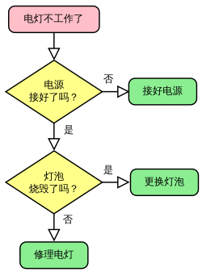
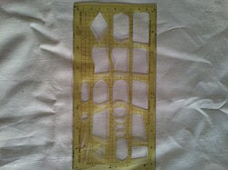
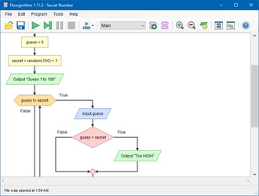

# 流程图｜精选补充资料

> 来源：[维基百科（中文）](https://zh.wikipedia.org/wiki/%E6%B5%81%E7%A8%8B%E5%9B%BE)  
> 许可：[CC BY-SA 4.0](https://creativecommons.org/licenses/by-sa/4.0/)  
> 语言：简体中文  
> 获取时间：2026-08-08T09:43:46.307074+00:00

维基百科，自由的百科全书

应对灯泡不亮的简单流程图

**流程图**，又称**程序框图**是表示[算法](/wiki/%E7%AE%97%E6%B3%95 "算法")、[工作流](/wiki/%E5%B7%A5%E4%BD%9C%E6%B5%81%E6%8A%80%E6%9C%AF "工作流技术")或流程的一种框图表示，它以不同类型的框代表不同种类的步骤，每两个步骤之间则以箭头连接。这种表示方法便于说明解决已知[问题](/wiki/%E8%A7%A3%E5%86%B3%E9%97%AE%E9%A2%98 "解决问题")的方法。流程图在分析、设计、记录及操控许多领域的流程或程序都有广泛应用。

## 概覽

流程圖背後可以概括了各節點類型、其內容及其他補充用的資訊。在設計或者記錄一些簡單的步驟或程序都會用得上流程圖。與其他圖表一樣，這種圖表可以幫助視覺化發生了甚麼事情，從而更易去理解中間的工序。雖然有很多𧗠生出來的版本，各目有各目的標示方式，它們大都都有以下2種的符號：

* **步驟**：通常稱作「活動」，常以長方形來表示
* **決定**：常以棱形來表示

流程圖若以水平或垂直區塊區分不同控制單元，通常稱為「跨功能流程圖」。這類流程圖能讓繪圖者按「執行步驟」或「做出決定」區分職責，並顯示流程中各組成單元的責任分工。

流程圖可將特定過程圖像化，通常也會配合其他圖表使用。例如，20世紀以[品質管理](/wiki/%E5%93%81%E8%B3%AA%E7%AE%A1%E7%90%86 "品質管理")研究著稱的日本學者[石川馨](/wiki/%E7%9F%B3%E5%B7%9D%E9%A6%A8 "石川馨")，將流程圖列為七個品質控制工具之一。流程圖與[直方圖](/wiki/%E7%9B%B4%E6%96%B9%E5%9B%BE "直方图")、[柏拉圖](/wiki/%E5%B8%95%E7%B4%AF%E6%89%98%E5%9B%BE "帕累托图")、[查檢表](/wiki/%E6%9F%A5%E6%AA%A2%E8%A1%A8 "查檢表")、[管制圖](/wiki/%E7%AE%A1%E5%88%B6%E5%9C%96 "管制圖")、[石川圖](/wiki/%E7%9F%B3%E5%B7%9D%E5%9B%BE "石川图")（魚骨圖）及[散佈圖](/wiki/%E6%95%A3%E5%B8%83%E5%9C%96 "散布圖")同等重要。[統一塑模語言](/wiki/%E7%BB%9F%E4%B8%80%E5%BB%BA%E6%A8%A1%E8%AF%AD%E8%A8%80 "统一建模语言")中的[活動圖](/wiki/%E6%B4%BB%E5%8A%A8%E5%9B%BE "活动图")，也可以與眾多其他圖表搭配使用。

另外，[盒圖](/wiki/Nassi-Shneiderman%E5%9C%96 "Nassi-Shneiderman圖")與[Drakon圖](/w/index.php?title=DRAKON&action=edit&redlink=1 "DRAKON（页面不存在）")（英语：[DRAKON](https://en.wikipedia.org/wiki/DRAKON "en:DRAKON")）也可以用來表示流程。

.jpg)

在紙張上用標準尺來輔助繪圖

## 类型

Sterneckert (2003) 认为流程图可以分为以下四种类型：

* [文件流程图](/w/index.php?title=%E6%96%87%E4%BB%B6%E6%B5%81%E7%A8%8B%E5%9B%BE&action=edit&redlink=1 "文件流程图（页面不存在）")
* [資料流程圖](/wiki/%E8%B3%87%E6%96%99%E6%B5%81%E7%A8%8B%E5%9C%96 "資料流程圖")
* [系统流程图](/w/index.php?title=%E7%B3%BB%E7%BB%9F%E6%B5%81%E7%A8%8B%E5%9B%BE&action=edit&redlink=1 "系统流程图（页面不存在）")
* [程序流程图](/w/index.php?title=%E7%A8%8B%E5%BA%8F%E6%B5%81%E7%A8%8B%E5%9B%BE&action=edit&redlink=1 "程序流程图（页面不存在）")

## 繪制流程圖

### 常用符號

[美國國家標準協會](/wiki/%E7%BE%8E%E5%9C%8B%E5%9C%8B%E5%AE%B6%E6%A8%99%E6%BA%96%E5%8D%94%E6%9C%83 "美國國家標準協會")是1960年代就開始制定流程圖及一些標準符號。而在1970年，[國際標準化組織](/wiki/%E5%9C%8B%E9%9A%9B%E6%A8%99%E6%BA%96%E5%8C%96%E7%B5%84%E7%B9%94 "國際標準化組織")採用其方案。現時通用的版本ISO 5807是在1985年修訂。以下圖例列出一些ISO常用符號。

| 形狀 | 名稱 | 描述 |
| --- | --- | --- |
|  | **流程符號** Flowline (Arrowhead) | 用來表達過程的次序，用一條線由一個符號連接去到另一個符號。如果不是標準的上至下、左至右圖就會加上箭頭。 |
|  | **起止符號** Terminal | 用來表示程式或子程式的開始與完結。常以一個圓角長方形表示。通常裏面會標上「開始」或「結束」或其他相關字眼，如「提交查詢」或「接受產品」。 |
|  | **程序** Process | 以長方形來代表一系列程序去改變數值、形式、數據的位置。 |
|  | **決策判斷** Decision | 以一個菱形去顯示一個條件進程，用來按情況去決定下一步走向。通常以「是/否」或「真/假」值去決定。 |
|  | **輸入/輸出** Input/Output | 以平行四邊形來標示數據輸入或輸出的過程，即填入數據或顯示工作結果的步驟。 |
|  | **註解** Annotation (Comment) | 用來補充某步驟的額外資訊，可用一個虛線來連接一個半閉合的長方型至想註釋的符號中。 |
|  | **已定義流程** Predefined Process | 用一個有2條左右垂直線長方型，來表示一個已在其他地方定義了的過程。 |
|  | **同頁參考** On-page Connector | 用一個含有字母的小圓圈來連接目標流程畫於同一頁上。 |
|  | **換頁參考** Off-page Connector | 用一個倒畫的屋型來表示目標流程畫於另一頁上。 |

### 其他符號

除了上述的基本符號，舉例以下：

| 形狀 | 名稱 | 描述 |
| --- | --- | --- |
|  | **數據檔或資料庫** Data File or Database | 用一個圓柱來表示數據庫。 |
|  | **文件** Document | 用一個附有波浪形底的長方形來標示文件。 |
|  | 用多個附有波浪形底的長方形來標示多份文件。 |
|  | **顯示** Display | 用一個左三角正方右圓角形狀來標示結果顯示的過程。 |
|  | **人工操作** Manual operation | 用一個直角半梯形來標示需要人手錄入、修正或操作的過程。 |
|  | **初始化** Preparation or Initialization | 用一個拉長了的六角形來代表初始化或預備的過程。 |

## 繪製工具

Flowgorithm

任何繪圖軟件都可以創造流程圖，有些軟件可以將流程圖背後的數據模型記錄下來，方便與數據庫、[專案管理](/wiki/%E9%A1%B9%E7%9B%AE%E7%AE%A1%E7%90%86 "项目管理")或[電子試算表](/wiki/%E9%9B%BB%E5%AD%90%E8%A9%A6%E7%AE%97%E8%A1%A8 "電子試算表")等軟件協作。不同的軟件如[yEd](/w/index.php?title=YEd&action=edit&redlink=1 "YEd（页面不存在）")（英语：[yEd](https://en.wikipedia.org/wiki/yEd "en:yEd")）、[Inkscape](/wiki/Inkscape "Inkscape")及[Microsoft Office Visio](/wiki/Microsoft_Office_Visio "Microsoft Office Visio")都可以製作流程圖。也有一些軟件可以將編程原始碼或指定的流程圖描述碼來轉換出來。

有些[視覺化程式設計語言](/wiki/%E8%A6%96%E8%A6%BA%E5%8C%96%E7%A8%8B%E5%BC%8F%E8%A8%AD%E8%A8%88%E8%AA%9E%E8%A8%80 "視覺化程式設計語言")採用流程圖來顯示程式的運作。這些工具都可以用來教導初學者去編程，例子有[Draw.io](/wiki/Draw.io "Draw.io")、[Flowgorithm](/w/index.php?title=Flowgorithm&action=edit&redlink=1 "Flowgorithm（页面不存在）")（英语：[Flowgorithm](https://en.wikipedia.org/wiki/Flowgorithm "en:Flowgorithm")）、[GitMind](/w/index.php?title=GitMind&action=edit&redlink=1 "GitMind（页面不存在）")（英语：[GitMind](https://en.wikipedia.org/wiki/GitMind "en:GitMind")）、[Lucidchart](/w/index.php?title=Lucidchart&action=edit&redlink=1 "Lucidchart（页面不存在）")（英语：[Lucidchart](https://en.wikipedia.org/wiki/Lucidchart "en:Lucidchart")）、LARP、[Raptor](/w/index.php?title=Raptor&action=edit&redlink=1 "Raptor（页面不存在）")（英语：[Raptor](https://en.wikipedia.org/wiki/Raptor "en:Raptor")）、[Visual Logic](/w/index.php?title=Visual_Logic&action=edit&redlink=1 "Visual Logic（页面不存在）")（英语：[Visual Logic](https://en.wikipedia.org/wiki/Visual_Logic "en:Visual Logic")）及VisiRule。

* [算法状态机](/wiki/%E7%AE%97%E6%B3%95%E7%8A%B6%E6%80%81%E6%9C%BA "算法状态机")
* [Microsoft PowerPoint](/wiki/Microsoft_PowerPoint "Microsoft PowerPoint")
* [工作流技术](/wiki/%E5%B7%A5%E4%BD%9C%E6%B5%81%E6%8A%80%E6%9C%AF "工作流技术")
* [符号](/wiki/%E7%AC%A6%E5%8F%B7 "符号")
* [过程流程图](/wiki/%E8%BF%87%E7%A8%8B%E6%B5%81%E7%A8%8B%E5%9B%BE "过程流程图")
* [控制流程圖](/wiki/%E6%8E%A7%E5%88%B6%E6%B5%81%E7%A8%8B%E5%9C%96 "控制流程圖")

## 参考来源

1. **[^](#cite_ref-SSEV_1-0)** [SEVOCAB: Software Systems Engineering Vocabulary](http://pascal.computer.org/sev_display/index.action) （[页面存档备份](//web.archive.org/web/20170813184132/http://pascal.computer.org/sev_display/index.action)，存于[互联网档案馆](/wiki/%E4%BA%92%E8%81%94%E7%BD%91%E6%A1%A3%E6%A1%88%E9%A6%86 "互联网档案馆")）. Term: *Flow chart*. Retrieved 31 July 2008.
2. **[^](#cite_ref-Ster03_2-0)** Alan B. Sterneckert (2003) *Critical Incident Management*. [p. 126](https://books.google.com/books?id=8z93xStbEpAC&lpg=PP126&pg=PA126#v=onepage&q=&f=false) （[页面存档备份](//web.archive.org/web/20210417174149/https://books.google.com/books?id=8z93xStbEpAC&lpg=PP126&pg=PA126#v=onepage&q=&f=false)，存于[互联网档案馆](/wiki/%E4%BA%92%E8%81%94%E7%BD%91%E6%A1%A3%E6%A1%88%E9%A6%86 "互联网档案馆")）
3. **[^](#cite_ref-ShellyVermaat20112_3-0)** Gary B. Shelly; Misty E. Vermaat. Discovering Computers, Complete: Your Interactive Guide to the Digital World. Cengage Learning. 2011: 691–693. [ISBN 1-111-53032-7](/wiki/Special:BookSources/1-111-53032-7 "Special:BookSources/1-111-53032-7").
4. **[^](#cite_ref-Myler19982_4-0)** Harley R. Myler. [2.3 Flowcharts](https://books.google.com/books?id=IisfMsdBe2IC&pg=PA32). Fundamentals of Engineering Programming with C and Fortran. Cambridge University Press. 1998: 32–36  [2019-04-10]. [ISBN 978-0-521-62950-8](/wiki/Special:BookSources/978-0-521-62950-8 "Special:BookSources/978-0-521-62950-8"). （原始内容[存档](https://web.archive.org/web/20210417160820/https://books.google.com/books?id=IisfMsdBe2IC&pg=PA32)于2021-04-17）.
5. **[^](#cite_ref-5)** [ISO 5807:1985](https://www.iso.org/standard/11955.html). International Organization for Standardization. February 1985  [23 July 2017]. （原始内容[存档](https://web.archive.org/web/20210417172400/https://www.iso.org/standard/11955.html)于2021-04-17）.
6. **[^](#cite_ref-6)** [建立基本流程圖](https://support.office.com/zh-tw/article/%e5%bb%ba%e7%ab%8b%e5%9f%ba%e6%9c%ac%e6%b5%81%e7%a8%8b%e5%9c%96-e207d975-4a51-4bfa-a356-eeec314bd276). support.office.com.  [2019-04-09]. （原始内容[存档](https://web.archive.org/web/20190904124758/https://support.office.com/zh-tw/article/%e5%bb%ba%e7%ab%8b%e5%9f%ba%e6%9c%ac%e6%b5%81%e7%a8%8b%e5%9c%96-e207d975-4a51-4bfa-a356-eeec314bd276)于2019-09-04） （中文（臺灣））.
7. **[^](#cite_ref-7)** LAZYweb. [做事是雜亂無章？還是井然有序？ —流程圖 迅速掌握任務全貌 - 今周刊](https://www.businesstoday.com.tw/article/category/80407/post/201805040053). www.businesstoday.com.tw. 2018-05-04  [2019-04-09]. （原始内容[存档](https://web.archive.org/web/20190905133218/https://www.businesstoday.com.tw/article/category/80407/post/201805040053)于2019-09-05） （中文（臺灣））.
8. ^ [**8.00**](#cite_ref-Myler1998_8-0) [**8.01**](#cite_ref-Myler1998_8-1) [**8.02**](#cite_ref-Myler1998_8-2) [**8.03**](#cite_ref-Myler1998_8-3) [**8.04**](#cite_ref-Myler1998_8-4) [**8.05**](#cite_ref-Myler1998_8-5) [**8.06**](#cite_ref-Myler1998_8-6) [**8.07**](#cite_ref-Myler1998_8-7) [**8.08**](#cite_ref-Myler1998_8-8) [**8.09**](#cite_ref-Myler1998_8-9) Harley R. Myler. [2.3 Flowcharts](https://books.google.com/books?id=IisfMsdBe2IC&pg=PA32). Fundamentals of Engineering Programming with C and Fortran. Cambridge University Press. 1998: 32–36  [2019-04-10]. [ISBN 978-0-521-62950-8](/wiki/Special:BookSources/978-0-521-62950-8 "Special:BookSources/978-0-521-62950-8"). （原始内容[存档](https://web.archive.org/web/20210417160820/https://books.google.com/books?id=IisfMsdBe2IC&pg=PA32)于2021-04-17）.
9. ^ [**9.00**](#cite_ref-ShellyVermaat2011_9-0) [**9.01**](#cite_ref-ShellyVermaat2011_9-1) [**9.02**](#cite_ref-ShellyVermaat2011_9-2) [**9.03**](#cite_ref-ShellyVermaat2011_9-3) [**9.04**](#cite_ref-ShellyVermaat2011_9-4) [**9.05**](#cite_ref-ShellyVermaat2011_9-5) [**9.06**](#cite_ref-ShellyVermaat2011_9-6) [**9.07**](#cite_ref-ShellyVermaat2011_9-7) [**9.08**](#cite_ref-ShellyVermaat2011_9-8) [**9.09**](#cite_ref-ShellyVermaat2011_9-9) [**9.10**](#cite_ref-ShellyVermaat2011_9-10) [**9.11**](#cite_ref-ShellyVermaat2011_9-11) Gary B. Shelly; Misty E. Vermaat. Discovering Computers, Complete: Your Interactive Guide to the Digital World. Cengage Learning. 2011: 691–693. [ISBN 1-111-53032-7](/wiki/Special:BookSources/1-111-53032-7 "Special:BookSources/1-111-53032-7").
10. ^ [**10.0**](#cite_ref-RFF_10-0) [**10.1**](#cite_ref-RFF_10-1) [What do the different flowchart shapes mean?](https://www.rff.com/flowchart_shapes.php). RFF Electronics.  [23 July 2017]. （原始内容[存档](https://web.archive.org/web/20210417172405/https://www.rff.com/flowchart_shapes.php)于2021-04-17）.
11. **[^](#cite_ref-IBM1970_11-0)** Flowcharting Techniques GC20-8152-1. IBM. March 1970: 10.
12. **[^](#cite_ref-RFF2_12-0)** [What do the different flowchart shapes mean?](https://www.rff.com/flowchart_shapes.php). RFF Electronics.  [23 July 2017]. （原始内容[存档](https://web.archive.org/web/20210417172405/https://www.rff.com/flowchart_shapes.php)于2021-04-17）.
13. **[^](#cite_ref-13)** Myers, Brad A. "[Visual programming, programming by example, and program visualization: a taxonomy.](http://www.cs.cmu.edu/~bam/papers/chi86vltax.pdf) （[页面存档备份](//web.archive.org/web/20201128234252/http://www.cs.cmu.edu/~bam/papers/chi86vltax.pdf)，存于[互联网档案馆](/wiki/%E4%BA%92%E8%81%94%E7%BD%91%E6%A1%A3%E6%A1%88%E9%A6%86 "互联网档案馆")）" ACM SIGCHI Bulletin. Vol. 17. No. 4. ACM, 1986.

[维基共享资源](/wiki/%E7%BB%B4%E5%9F%BA%E5%85%B1%E4%BA%AB%E8%B5%84%E6%BA%90 "维基共享资源")中相关的多媒体资源：**[流程图](https://commons.wikimedia.org/wiki/Flow_chart?uselang=zh)**

* [Flowcharting Techniques](http://www.fh-jena.de/~kleine/history/software/IBM-FlowchartingTechniques-GC20-8152-1.pdf) （[页面存档备份](//web.archive.org/web/20110515065926/http://www.fh-jena.de/~kleine/history/software/IBM-FlowchartingTechniques-GC20-8152-1.pdf)，存于[互联网档案馆](/wiki/%E4%BA%92%E8%81%94%E7%BD%91%E6%A1%A3%E6%A1%88%E9%A6%86 "互联网档案馆")） An IBM manual from 1969 (5MB PDF format)
* [FlowChart Symbols List](http://www.breezetree.com/images/flow-chart-symbols.png) （[页面存档备份](//web.archive.org/web/20210410194425/http://www.breezetree.com/images/flow-chart-symbols.png)，存于[互联网档案馆](/wiki/%E4%BA%92%E8%81%94%E7%BD%91%E6%A1%A3%E6%A1%88%E9%A6%86 "互联网档案馆")）

[分类](/wiki/Special:Categories "Special:Categories")：​

* [建模语言](/wiki/Category:%E5%BB%BA%E6%A8%A1%E8%AF%AD%E8%A8%80 "Category:建模语言")
* [图表](/wiki/Category:%E5%9B%BE%E8%A1%A8 "Category:图表")
* [技術通信](/wiki/Category:%E6%8A%80%E8%A1%93%E9%80%9A%E4%BF%A1 "Category:技術通信")
* [计算机编程](/wiki/Category:%E8%AE%A1%E7%AE%97%E6%9C%BA%E7%BC%96%E7%A8%8B "Category:计算机编程")
* [美国发明](/wiki/Category:%E7%BE%8E%E5%9B%BD%E5%8F%91%E6%98%8E "Category:美国发明")

隐藏分类：​

* [包含BNF标识符的维基百科条目](/wiki/Category:%E5%8C%85%E5%90%ABBNF%E6%A0%87%E8%AF%86%E7%AC%A6%E7%9A%84%E7%BB%B4%E5%9F%BA%E7%99%BE%E7%A7%91%E6%9D%A1%E7%9B%AE "Category:包含BNF标识符的维基百科条目")
* [包含BNFdata标识符的维基百科条目](/wiki/Category:%E5%8C%85%E5%90%ABBNFdata%E6%A0%87%E8%AF%86%E7%AC%A6%E7%9A%84%E7%BB%B4%E5%9F%BA%E7%99%BE%E7%A7%91%E6%9D%A1%E7%9B%AE "Category:包含BNFdata标识符的维基百科条目")
* [包含GND标识符的维基百科条目](/wiki/Category:%E5%8C%85%E5%90%ABGND%E6%A0%87%E8%AF%86%E7%AC%A6%E7%9A%84%E7%BB%B4%E5%9F%BA%E7%99%BE%E7%A7%91%E6%9D%A1%E7%9B%AE "Category:包含GND标识符的维基百科条目")
* [包含J9U标识符的维基百科条目](/wiki/Category:%E5%8C%85%E5%90%ABJ9U%E6%A0%87%E8%AF%86%E7%AC%A6%E7%9A%84%E7%BB%B4%E5%9F%BA%E7%99%BE%E7%A7%91%E6%9D%A1%E7%9B%AE "Category:包含J9U标识符的维基百科条目")
* [包含LCCN标识符的维基百科条目](/wiki/Category:%E5%8C%85%E5%90%ABLCCN%E6%A0%87%E8%AF%86%E7%AC%A6%E7%9A%84%E7%BB%B4%E5%9F%BA%E7%99%BE%E7%A7%91%E6%9D%A1%E7%9B%AE "Category:包含LCCN标识符的维基百科条目")
* [包含NKC标识符的维基百科条目](/wiki/Category:%E5%8C%85%E5%90%ABNKC%E6%A0%87%E8%AF%86%E7%AC%A6%E7%9A%84%E7%BB%B4%E5%9F%BA%E7%99%BE%E7%A7%91%E6%9D%A1%E7%9B%AE "Category:包含NKC标识符的维基百科条目")
* [包含AAT标识符的维基百科条目](/wiki/Category:%E5%8C%85%E5%90%ABAAT%E6%A0%87%E8%AF%86%E7%AC%A6%E7%9A%84%E7%BB%B4%E5%9F%BA%E7%99%BE%E7%A7%91%E6%9D%A1%E7%9B%AE "Category:包含AAT标识符的维基百科条目")
* [包含NARA标识符的维基百科条目](/wiki/Category:%E5%8C%85%E5%90%ABNARA%E6%A0%87%E8%AF%86%E7%AC%A6%E7%9A%84%E7%BB%B4%E5%9F%BA%E7%99%BE%E7%A7%91%E6%9D%A1%E7%9B%AE "Category:包含NARA标识符的维基百科条目")
* [带有代码示例的条目](/wiki/Category:%E5%B8%A6%E6%9C%89%E4%BB%A3%E7%A0%81%E7%A4%BA%E4%BE%8B%E7%9A%84%E6%9D%A1%E7%9B%AE "Category:带有代码示例的条目")
