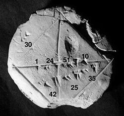

# 数值分析与误差｜精选补充资料

> 来源：[维基百科（中文）](https://zh.wikipedia.org/wiki/%E6%95%B0%E5%80%BC%E5%88%86%E6%9E%90)  
> 许可：[CC BY-SA 4.0](https://creativecommons.org/licenses/by-sa/4.0/)  
> 语言：简体中文  
> 获取时间：2026-08-08T09:44:03.608566+00:00

维基百科，自由的百科全书

**提示**：此条目的主题不是**[数据分析](/wiki/%E6%95%B0%E6%8D%AE%E5%88%86%E6%9E%90 "数据分析")**。

巴比伦泥板 YBC 7289（公元前约1800–1600年），泥板上有[根號2](/wiki/2%E7%9A%84%E7%AE%97%E8%A1%93%E5%B9%B3%E6%96%B9%E6%A0%B9 "2的算術平方根")的[六十進制](/wiki/%E5%85%AD%E5%8D%81%E9%80%B2%E5%88%B6 "六十進制")近似值，

1
+

24
60
+

51

60

2
+

10

60

3
=
1.41421296
…
{\displaystyle 1+{\frac {24}{60}}+{\frac {51}{60^{2}}}+{\frac {10}{60^{3}}}=1.41421296\ldots }
${\displaystyle 1+{\frac {24}{60}}+{\frac {51}{60^{2}}}+{\frac {10}{60^{3}}}=1.41421296\ldots }$，接近[十進制](/wiki/%E5%8D%81%E8%BF%9B%E5%88%B6 "十进制")根號2的小數下第6位

**数值分析**（英語：Numerical analysis），是指在[数学分析](/wiki/%E6%95%B0%E5%AD%A6%E5%88%86%E6%9E%90 "数学分析")问题中，对使用数值[近似](/wiki/%E8%BF%91%E4%BC%BC "近似")[算法](/wiki/%E7%AE%97%E6%B3%95 "算法")的研究。

巴比伦泥板YBC 7289是关于数值分析的最早数学作品之一，它给出了 

2
{\displaystyle {\sqrt {2}}}
${\displaystyle {\sqrt {2}}}$ 在[六十进制](/wiki/%E5%85%AD%E5%8D%81%E9%80%B2%E5%88%B6 "六十進制")下的一个数值逼近，

2
{\displaystyle {\sqrt {2}}}
${\displaystyle {\sqrt {2}}}$是一個邊長為1的正方形的對角線，在西元前1800年巴比倫人也已在巴比倫泥板上計算[勾股數](/wiki/%E5%8B%BE%E8%82%A1%E6%95%B0 "勾股数")

(
3
,
4
,
5
)
{\displaystyle (3,4,5)}
${\displaystyle (3,4,5)}$，即[直角三角形](/wiki/%E7%9B%B4%E8%A7%92%E4%B8%89%E8%A7%92%E5%BD%A2 "直角三角形")的三邊長比。

数值分析延續了實務上數學[計算](/wiki/%E8%A8%88%E7%AE%97 "計算")的傳統。巴比倫人利用巴比伦泥板計算

2
{\displaystyle {\sqrt {2}}}
${\displaystyle {\sqrt {2}}}$的近似值，而不是精確值。在許多實務的問題中，精確值往往無法求得，或是無法用[有理數](/wiki/%E6%9C%89%E7%90%86%E6%95%B8 "有理數")表示（如

2
{\displaystyle {\sqrt {2}}}
${\displaystyle {\sqrt {2}}}$）。数值分析的目的不在求出正確的答案，而是在其誤差在一合理範圍的條件下找到近似解。

在所有工程及科學的領域中都會用到数值分析。像[天體力學](/wiki/%E5%A4%A9%E9%AB%94%E5%8A%9B%E5%AD%B8 "天體力學")研究中會用到[常微分方程](/wiki/%E5%B8%B8%E5%BE%AE%E5%88%86%E6%96%B9%E7%A8%8B "常微分方程")，[最優化](/wiki/%E6%9C%80%E5%84%AA%E5%8C%96 "最優化")會用在[投資組合](/wiki/%E6%8A%95%E8%B3%87%E7%B5%84%E5%90%88 "投資組合")管理中，[數值線性代數](/wiki/%E6%95%B0%E5%80%BC%E7%BA%BF%E6%80%A7%E4%BB%A3%E6%95%B0 "数值线性代数")是資料分析中重要的一部份，而[隨機微分方程](/wiki/%E9%9A%A8%E6%A9%9F%E5%BE%AE%E5%88%86%E6%96%B9%E7%A8%8B "隨機微分方程")及[馬可夫鏈](/wiki/%E9%A6%AC%E5%8F%AF%E5%A4%AB%E9%8F%88 "馬可夫鏈")是在[醫學](/wiki/%E9%86%AB%E5%AD%B8 "醫學")或[生物學](/wiki/%E7%94%9F%E7%89%A9%E5%AD%B8 "生物學")中生物[細胞](/wiki/%E7%B4%B0%E8%83%9E "細胞")模擬的基礎。

在電腦發明之前，数值分析主要是依靠大型的函數表及人工的[內插法](/wiki/%E5%85%A7%E6%8F%92%E6%B3%95 "內插法")，但在二十世紀中被電腦的計算所取代。不過電腦的內插[演算法](/wiki/%E6%BC%94%E7%AE%97%E6%B3%95 "演算法")仍然是数值分析軟體中重要的一部份。

## 簡介

数值分析的目的是設計及分析一些計算的方式，可針對一些問題得到近似但夠精確的結果。以下是一些會用利用数值分析處理的問題：

* [數值天氣預報](/wiki/%E6%95%B8%E5%80%BC%E5%A4%A9%E6%B0%A3%E9%A0%90%E5%A0%B1 "數值天氣預報")中會用到許多先進的数值分析方法。
* 計算太空船的軌跡需要求出[常微分方程](/wiki/%E5%B8%B8%E5%BE%AE%E5%88%86%E6%96%B9%E7%A8%8B "常微分方程")的數值解。
* 汽車公司會利用電腦模擬汽車撞擊來提昇汽車受到撞擊時的安全性。電腦的模擬會需要求出[偏微分方程](/wiki/%E5%81%8F%E5%BE%AE%E5%88%86%E6%96%B9%E7%A8%8B "偏微分方程")的數值解。
* [对冲基金](/wiki/%E5%AF%B9%E5%86%B2%E5%9F%BA%E9%87%91 "对冲基金")會利用各種数值分析的工具來計算股票的市值及其變異程度。
* 航空公司會利用複雜的最佳化演算法決定票價、飛機、人員分配及用油量。此領域也稱為[作業研究](/wiki/%E4%BD%9C%E6%A5%AD%E7%A0%94%E7%A9%B6 "作業研究")。
* 保險公司會利用数值軟體進行[精算](/wiki/%E7%B2%BE%E7%AE%97 "精算")分析。

### 直接法和迭代法

|  |  |  |  |  |  |  |  |  |  |  |  |  |  |  |  |  |  |  |  |  |  |  |  |  |  |  |  |  |
| --- | --- | --- | --- | --- | --- | --- | --- | --- | --- | --- | --- | --- | --- | --- | --- | --- | --- | --- | --- | --- | --- | --- | --- | --- | --- | --- | --- | --- |
| **直接法和[迭代](/wiki/%E8%BF%AD%E4%BB%A3 "迭代")法**  考慮以下問題  3  x  3 + 4 = 28 {\displaystyle 3x^{3}+4=28} ${\displaystyle 3x^{3}+4=28}$  要求解未知數    x {\displaystyle x} ${\displaystyle x}$   直接法  |  |  | | --- | --- | |  | 3  x  3 + 4 = 28 {\displaystyle 3x^{3}+4=28} ${\displaystyle 3x^{3}+4=28}$ | | *減 4* | 3  x  3 = 24 {\displaystyle 3x^{3}=24} ${\displaystyle 3x^{3}=24}$ | | *除 3* | x  3 = 8 {\displaystyle x^{3}=8} ${\displaystyle x^{3}=8}$ | | *開立方* | x = 2 {\displaystyle x=2} ${\displaystyle x=2}$ |   若是用迭代法，可用[迭代法](/wiki/%E8%BF%AD%E4%BB%A3%E6%B3%95 "迭代法")求解    f ( x ) = 3  x  3 − 24 = 0 {\displaystyle f(x)=3x^{3}-24=0} ${\displaystyle f(x)=3x^{3}-24=0}$，初值為    a = 0 {\displaystyle a=0} ${\displaystyle a=0}$,     b = 3 {\displaystyle b=3} ${\displaystyle b=3}$,     f ( a ) = − 24 {\displaystyle f(a)=-24} ${\displaystyle f(a)=-24}$,     f ( b ) = 57 {\displaystyle f(b)=57} ${\displaystyle f(b)=57}$。   迭代法  | *a* | *b* | 中點 | *f*(中點) | | --- | --- | --- | --- | | 0 | 3 | 1.5 | −13.875 | | 1.5 | 3 | 2.25 | 10.17... | | 1.5 | 2.25 | 1.875 | −4.22... | | 1.875 | 2.25 | 2.0625 | 2.32... |   計算到目前為止，問題的解是界於1.875及2.0625之間，若繼續往下算，可以得到更精確的答案。 |

直接法利用固定次數的步驟求出問題的解。這些方式包括求解[线性方程组](/wiki/%E7%BA%BF%E6%80%A7%E6%96%B9%E7%A8%8B%E7%BB%84 "线性方程组")的[高斯消去法](/wiki/%E9%AB%98%E6%96%AF%E6%B6%88%E5%8E%BB%E6%B3%95 "高斯消去法")及解矩陣特徵值的[QR演算法](/w/index.php?title=QR%E6%BC%94%E7%AE%97%E6%B3%95&action=edit&redlink=1 "QR演算法（页面不存在）")（英语：[QR algorithm](https://en.wikipedia.org/wiki/QR_algorithm "en:QR algorithm")），求解[線性規劃](/wiki/%E7%B7%9A%E6%80%A7%E8%A6%8F%E5%8A%83 "線性規劃")的[单纯形法](/wiki/%E5%8D%95%E7%BA%AF%E5%BD%A2%E6%B3%95 "单纯形法")等。若利用[無限精度算術](/wiki/%E9%AB%98%E7%B2%BE%E5%BA%A6%E8%AE%A1%E7%AE%97 "高精度计算")的計算方式，有些問題可以得到其精確的解。不過有些問題不存在[解析解](/wiki/%E8%A7%A3%E6%9E%90%E8%A7%A3 "解析解")（如[五次方程](/wiki/%E4%BA%94%E6%AC%A1%E6%96%B9%E7%A8%8B "五次方程")），也就無法用直接法求解。在電腦中會使用[浮點數](/wiki/%E6%B5%AE%E9%BB%9E%E6%95%B8 "浮點數")進行運算，在假設運算方式[稳定](/wiki/%E6%95%B0%E5%80%BC%E7%A8%B3%E5%AE%9A%E6%80%A7 "数值稳定性")的前提下，所求得的結果可以視為是精確解的近似值。

[迭代法](/wiki/%E8%BF%AD%E4%BB%A3%E6%B3%95 "迭代法")是通過從一個初始估計出發尋找一系列近似解來解決問題的數學過程。和直接法不同，用迭代法求解問題時，其步驟沒有固定的次數，而且只能求得問題的近似解，所找到的一系列近似解會[收敛](/wiki/%E6%94%B6%E6%95%9B%E6%95%B0%E5%88%97 "收敛数列")到問題的精確解。會利用[審斂法](/wiki/%E5%AE%A1%E6%95%9B%E6%B3%95 "审敛法")來判別所得到的近似解是否會收斂。一般而言，即使使用無限精度算術的計算方式，迭代法也無法在有限次數內得到問題的精確解。

在數值分析中用到迭代法的情形會比直接法要多。例如像[牛頓法](/wiki/%E7%89%9B%E9%A1%BF%E6%B3%95 "牛顿法")、[二分法](/wiki/%E4%BA%8C%E5%88%86%E6%B3%95 "二分法")、[雅可比法](/wiki/%E9%9B%85%E5%8F%AF%E6%AF%94%E6%B3%95 "雅可比法")、[廣義最小殘量方法](/wiki/%E5%B9%BF%E4%B9%89%E6%9C%80%E5%B0%8F%E6%AE%8B%E9%87%8F%E6%96%B9%E6%B3%95 "广义最小残量方法")（GMRES）及[共軛梯度法](/wiki/%E5%85%B1%E8%BD%AD%E6%A2%AF%E5%BA%A6%E6%B3%95 "共轭梯度法")等。在計算矩陣代數中，大型的問題一般會需要用迭代法來求解。

### 離散化

許多時候需要將連續模型的問題轉換為一個離散形式的問題，而離散形式的解可以近似原來的連續模型的解，此轉換過程稱為[離散化](/wiki/%E7%A6%BB%E6%95%A3%E5%8C%96 "离散化")。例如求一個函數的積分是一個連續模型的問題，也就是求一曲線以下的面積若將其離散化變成[數值積分](/wiki/%E6%95%B8%E5%80%BC%E7%A9%8D%E5%88%86 "數值積分")，就變成將上述面積用許多較簡單的形狀（如長方形、梯形）近似，因此只要求出這些形狀的面積再相加即可。

例如在二小時的賽車比賽中，記錄了三個不同時間點的賽車速度，如下表

|  |  |  |  |
| --- | --- | --- | --- |
| 時間 | 0:20 | 1:00 | 1:40 |
| km/h | 140 | 150 | 180 |

利用離散化的方式，可以假設賽車在0:00到0:40之間的速度、0:40到1:20之間的速度及1:20到2:00之間的速度分別為三個定值，因此前40分鐘的總位移可近似為(

2
3
{\displaystyle {\frac {2}{3}}}
${\displaystyle {\frac {2}{3}}}$h × 140 km/h) = 93.3 公里。可依此方式近似二小時內的總位移為93.3 公里 + 100 公里 + 120 公里 = 313.3 公里。位移是速度的[積分](/wiki/%E7%A9%8D%E5%88%86 "積分")，而上述的作法是用[黎曼和](/wiki/%E9%BB%8E%E6%9B%BC%E5%92%8C "黎曼和")進行數值積分的一個例子。

## 誤差的產生及傳播

誤差是数值分析的重要主題之一。誤差的形成可分為幾種不同的原因。

### 捨入誤差

當進行數值分析的設備只能用有限位數來表示一個[實數](/wiki/%E5%AF%A6%E6%95%B8 "實數")時，就會出現[捨入誤差](/wiki/%E6%8D%A8%E5%85%A5%E8%AA%A4%E5%B7%AE "捨入誤差")（Round-off error），例如用可顯示十位數字的[計算器](/wiki/%E8%A8%88%E7%AE%97%E5%99%A8 "計算器")計算

1
3
{\displaystyle {\frac {1}{3}}}
${\displaystyle {\frac {1}{3}}}$，所得到的結果0.333333333，和實際數值的誤差就是捨入誤差。即使進行數值分析的設備用浮點數來表示實數，仍無法完全避免捨入誤差的問題。

### 截尾及離散化誤差

若迭代法的数值分析算到某一程度就中止計算，或是使用一些近似的數學程序，程序所得結果和精準解不同，就會出現[截尾誤差](/wiki/%E6%88%AA%E5%B0%BE%E8%AA%A4%E5%B7%AE "截尾誤差")。將問題[離散化](/wiki/%E7%A6%BB%E6%95%A3%E5%8C%96 "离散化")後，由於離散化問題的解不會和原問題的解完全一様，因此會出現[離散化誤差](/w/index.php?title=%E9%9B%A2%E6%95%A3%E5%8C%96%E8%AA%A4%E5%B7%AE&action=edit&redlink=1 "離散化誤差（页面不存在）")（英语：[discretization error](https://en.wikipedia.org/wiki/discretization_error "en:discretization error")）。例如用迭代法計算

3

x

3
+
4
=
28
{\displaystyle 3x^{3}+4=28}
${\displaystyle 3x^{3}+4=28}$的解，在計算幾次後認為其解為1.99，就會有0.01的截尾誤差。

一旦有了誤差，誤差就會藉著計算繼續的擴散。例如一個計算機中的加法是不準的，則

a
+
b
+
c
+
d
+
e
{\displaystyle a+b+c+d+e}
${\displaystyle a+b+c+d+e}$的計算也一定不準。例如剛剛計算

3

x

3
+
4
=
28
{\displaystyle 3x^{3}+4=28}
${\displaystyle 3x^{3}+4=28}$的解為1.99，若後續的運算需要用到

3

x

3
+
4
=
28
{\displaystyle 3x^{3}+4=28}
${\displaystyle 3x^{3}+4=28}$的解，用1.99代入所得的結果也會不準。

當用近似的方式處理數學式時就會出現截尾誤差。以積分為例，完全精準的積分需要求出曲線下方無限個梯形的面積和，但用在數值分析中會用有限個梯形的面積和來近似無限個梯形的面積和，此時就會出現截尾誤差。若要對一個函數進行微分，其微分量需要趨近於0，但實務上只能選擇很小的微分量。

### 數值穩定性及良置問題

|  |
| --- |
| **非良置問題**：考慮一函數    f ( x ) =   1  ( x − 1 ) {\displaystyle f(x)={\frac {1}{(x-1)}}} ${\displaystyle f(x)={\frac {1}{(x-1)}}}$，    f ( 1.1 ) = 10 {\displaystyle f(1.1)=10} ${\displaystyle f(1.1)=10}$，    f ( 1.001 ) = 1000 {\displaystyle f(1.001)=1000} ${\displaystyle f(1.001)=1000}$。當    x {\displaystyle x} ${\displaystyle x}$只改變小於0.1的數值，    f ( x ) {\displaystyle f(x)} ${\displaystyle f(x)}$的變化將近1000。因此在    x = 1 {\displaystyle x=1} ${\displaystyle x=1}$的附近計算    f ( x ) {\displaystyle f(x)} ${\displaystyle f(x)}$是一個非良置的問題。  **良置問題**：相反的，函數    f ( x ) =   x {\displaystyle f(x)={\sqrt {x}}} ${\displaystyle f(x)={\sqrt {x}}}$在*x {\displaystyle x} ${\displaystyle x}$*不接近0時，其值的計算就是一個良置的問題。 |

[數值穩定性](/wiki/%E6%95%B0%E5%80%BC%E7%A8%B3%E5%AE%9A%E6%80%A7 "数值稳定性")是數值分析中一個重要的主題。若一演算法中不論什麼原因產生了誤差，此誤差不會在運算中明顯增加，此演算法為數值穩定的演算法。若問題為[良置](/wiki/%E8%89%AF%E7%BD%AE "良置")（well-conditioned）的，就會符合上述的特性，也就是問題數據微小的變化只會造成其解的微小變化。相反的，若問題數據微小的變化會造成其解的巨大變化，會稱問題為非良置或病態（ill-conditioned）。

原始問題及求解問題演算法都可以分為良置及非良置，任何的組合都是允許的。

一個求解良置問題的演算法可能是數值穩定的，也可能是數值不穩定的。數值分析的重點就是找到[適定性問題](/wiki/%E9%81%A9%E5%AE%9A%E6%80%A7%E5%95%8F%E9%A1%8C "適定性問題")的數值穩定演算法。例如，計算2的平方根（大約是1.41421）本身是一個適定性問題。許多求解的演算法都是從一個初始的近似值

x

1
{\displaystyle x\_{1}}
${\displaystyle x\_{1}}$開始去求解，例如

x

1
=
1.4
{\displaystyle x\_{1}=1.4}
${\displaystyle x\_{1}=1.4}$，再繼續計算

x

2
{\displaystyle x\_{2}}
${\displaystyle x\_{2}}$、

x

3
{\displaystyle x\_{3}}
${\displaystyle x\_{3}}$等。巴比倫法就是一個具有此特性的演算法。另一個方法，先稱之為X方法，演算法為

x

k
+
1
=
(

x

k

2
−
2

)

2
+

x

k
{\displaystyle x\_{k+1}=({x\_{k}}^{2}-2)^{2}+x\_{k}}
${\displaystyle x\_{k+1}=({x\_{k}}^{2}-2)^{2}+x\_{k}}$。以下分別用初始值 

x

1
=
1.4
{\displaystyle x\_{1}=1.4}
${\displaystyle x\_{1}=1.4}$及

x

1
=
1.42
{\displaystyle x\_{1}=1.42}
${\displaystyle x\_{1}=1.42}$，用二種方式進行幾次迭代。

| 巴比倫法 | 巴比倫法 | X方法 | X方法 |
| --- | --- | --- | --- |
| x  1 = 1.4 {\displaystyle x\_{1}=1.4} ${\displaystyle x\_{1}=1.4}$ | x  1 = 1.42 {\displaystyle x\_{1}=1.42} ${\displaystyle x\_{1}=1.42}$ | x  1 = 1.4 {\displaystyle x\_{1}=1.4} ${\displaystyle x\_{1}=1.4}$ | x  1 = 1.42 {\displaystyle x\_{1}=1.42} ${\displaystyle x\_{1}=1.42}$ |
| x  2 = 1.4142857 … {\displaystyle x\_{2}=1.4142857\ldots } ${\displaystyle x\_{2}=1.4142857\ldots }$ | x  2 = 1.41422535 … {\displaystyle x\_{2}=1.41422535\ldots } ${\displaystyle x\_{2}=1.41422535\ldots }$ | x  2 = 1.4016 {\displaystyle x\_{2}=1.4016} ${\displaystyle x\_{2}=1.4016}$ | x  2 = 1.42026896 {\displaystyle x\_{2}=1.42026896} ${\displaystyle x\_{2}=1.42026896}$ |
| x  3 = 1.414213564 … {\displaystyle x\_{3}=1.414213564\ldots } ${\displaystyle x\_{3}=1.414213564\ldots }$ | x  3 = 1.41421356242 … {\displaystyle x\_{3}=1.41421356242\ldots } ${\displaystyle x\_{3}=1.41421356242\ldots }$ | x  3 = 1.4028614 … {\displaystyle x\_{3}=1.4028614\ldots } ${\displaystyle x\_{3}=1.4028614\ldots }$ | x  3 = 1.42056 … {\displaystyle x\_{3}=1.42056\ldots } ${\displaystyle x\_{3}=1.42056\ldots }$ |
|  |  | ... | ... |
|  |  | x  1000000 = 1.41421 … {\displaystyle x\_{1000000}=1.41421\ldots } ${\displaystyle x\_{1000000}=1.41421\ldots }$ | x  28 = 7280.2284 … {\displaystyle x\_{28}=7280.2284\ldots } ${\displaystyle x\_{28}=7280.2284\ldots }$ |

可觀察到不論初始值多少，巴比倫法都可以快速的收斂，但X方法在初始值為1.4時收斂的很慢，在初始值為1.42時X方法會發散。因此巴比倫法是數值穩定的方法，而X方法是數值不穩定的方法。

## 领域研究

數值分析依其待求解的問題不同，分為不同的領域。

|  |
| --- |
| **內插法**：假設一點鐘的氣溫為20度，三點鐘時為14度，可以用線性內插法推測一點半及二點鐘時的氣溫分別是18.5度及17度。  **外推法**：假設某國家國內生產總值平均每年成長百分之五，去年國內生產總值為一百萬元，可推測今年的國內生產總值為一百零五萬元。 [A line through 20 points](/wiki/File:Linear-regression.svg "A line through 20 points")  A line through 20 points   **回歸分析**：給定幾個二維座標上的點，回歸分析就是設法找到一條最接近這些點的直線。 [每杯飲料要多少錢呢？](/wiki/File:LemonadeJuly2006.JPG "每杯飲料要多少錢呢？")  每杯飲料要多少錢呢？   **最佳化**：有一個賣飲料的小販，若每杯飲料100元，每天可以賣197杯飲料，若飲料單價增加1元，每天就會少賣1杯飲料。飲料定價為148.5元時，其每天的收入為最大值。不過由於飲料單價需為正整數，因此飲料定價可定為149元，對應每天的收入為22,052元。 [圖中藍色的是風的方向，黑色的是實際軌跡，紅色的是欧拉方法所得的結果](/wiki/File:Wind-particle.png "圖中藍色的是風的方向，黑色的是實際軌跡，紅色的是欧拉方法所得的結果")  圖中藍色的是風的方向，黑色的是實際軌跡，紅色的是欧拉方法所得的結果   **微分方程**：假設在一房間中的不同位置放置一百個風扇，然後在房間中放置一根羽毛，羽毛會依房間中氣流而移動，而房間中的氣流可能相當複雜。不過每一秒量測一次羽毛附近空氣的速度，假設羽毛下一秒是等速的直線運動，即可求得下一秒時羽毛的位置，再量測當時羽毛附近空氣的速度，......。這種方法稱為[欧拉方法](/wiki/%E6%AC%A7%E6%8B%89%E6%96%B9%E6%B3%95 "欧拉方法")，常使用在常微分方程的數值分析。 |

### 函數求值

数值分析中最簡單的問題就是求出函數在某一特定數值下的值。最直覺的方法是將數值代入函數中計算，不過有時此方式的效率不佳。像針對多項式函數的求值，較有效率的方式是[秦九韶算法](/wiki/%E7%A7%A6%E4%B9%9D%E9%9F%B6%E7%AE%97%E6%B3%95 "秦九韶算法")，可以減少乘法及加法的次數。若是使用[浮点数](/wiki/%E6%B5%AE%E7%82%B9%E6%95%B0 "浮点数")，很重要的是是估計及控制捨入誤差。

### 內插法、外推法、曲線擬合及回歸

[內插法](/wiki/%E5%85%A7%E6%8F%92%E6%B3%95 "內插法")求解以下的問題：有一未知函數在一些特定位置下的值，求未知函數在已知數值的點之間某一點的值。

[外推法](/wiki/%E5%A4%96%E6%8E%A8%E6%B3%95 "外推法")類似內插法，但需要知道數值的點是在其他已知數值點的範圍以外。一般而言外推法的誤差會大於內插法。

[曲線擬合](/wiki/%E6%9B%B2%E7%B7%9A%E6%93%AC%E5%90%88 "曲線擬合")是在已知一些數據的條件下，找到一條曲線完全符合現有的數據，數據可能是一些特定位置及其對應的值，也可能是其他資料，例如角度或曲率等。

[回歸分析](/wiki/%E5%9B%9E%E5%BD%92%E5%88%86%E6%9E%90 "回归分析")類似曲線擬合，也是根據一些特定位置及其對應的值，要找到對應曲線。但回歸分析考慮到數據可能有誤差，因此所得的曲線不需要和數據完全符合。一般會使用[最小方差法](/wiki/%E6%9C%80%E5%B0%8F%E4%BA%8C%E4%B9%98%E6%B3%95 "最小二乘法")來進行回歸分析。

### 求解方程及方程組

另一种常見的問題是求特定方程式的解。首先會依方程式是否線性來區分，例如方程式 

2
x
+
5
=
3
{\displaystyle 2x+5=3}
${\displaystyle 2x+5=3}$是線性方程式，而

2

x

2
+
5
=
3
{\displaystyle 2x^{2}+5=3}
${\displaystyle 2x^{2}+5=3}$是非線性方程式。

此領域許多的研究都和求解[線性方程組](/wiki/%E7%B7%9A%E6%80%A7%E6%96%B9%E7%A8%8B%E7%B5%84 "線性方程組")有關。直接法是線性方程組的係數以[矩陣](/wiki/%E7%9F%A9%E9%99%A3 "矩陣")來表示，再利用[矩陣分解](/wiki/%E7%9F%A9%E9%99%A3%E5%88%86%E8%A7%A3 "矩陣分解")的方式求解，這些方法包括[高斯消去法](/wiki/%E9%AB%98%E6%96%AF%E6%B6%88%E5%8E%BB%E6%B3%95 "高斯消去法")、[LU分解](/wiki/LU%E5%88%86%E8%A7%A3 "LU分解")，對於[對稱矩陣](/wiki/%E5%B0%8D%E7%A8%B1%E7%9F%A9%E9%99%A3 "對稱矩陣")（或[埃爾米特矩陣](/wiki/%E5%9F%83%E5%B0%94%E7%B1%B3%E7%89%B9%E7%9F%A9%E9%98%B5 "埃尔米特矩阵")）及[正定矩陣](/wiki/%E6%AD%A3%E5%AE%9A%E7%9F%A9%E9%99%A3 "正定矩陣")可以用[喬萊斯基分解](/w/index.php?title=%E5%96%AC%E8%90%8A%E6%96%AF%E5%9F%BA%E5%88%86%E8%A7%A3&action=edit&redlink=1 "喬萊斯基分解（页面不存在）")（英语：[Cholesky decomposition](https://en.wikipedia.org/wiki/Cholesky_decomposition "en:Cholesky decomposition")），非方陣的矩陣則可以用[QR分解](/wiki/QR%E5%88%86%E8%A7%A3 "QR分解")。[迭代法](/wiki/%E8%BF%AD%E4%BB%A3%E6%B3%95 "迭代法")包括有[雅可比法](/wiki/%E9%9B%85%E5%8F%AF%E6%AF%94%E6%B3%95 "雅可比法")、[高斯–塞德迭代法](/wiki/%E9%AB%98%E6%96%AF%E2%80%93%E5%A1%9E%E5%BE%B7%E8%BF%AD%E4%BB%A3%E6%B3%95 "高斯–塞德迭代法")、[逐次超鬆馳法](/wiki/%E9%80%90%E6%AC%A1%E8%B6%85%E9%AC%86%E9%A6%B3%E6%B3%95 "逐次超鬆馳法")（SOR）及[共轭梯度法](/wiki/%E5%85%B1%E8%BD%AD%E6%A2%AF%E5%BA%A6%E6%B3%95 "共轭梯度法")，一般會用在大型的線性方程組中。

[求根演算法](/wiki/%E6%B1%82%E6%A0%B9%E6%BC%94%E7%AE%97%E6%B3%95 "求根演算法")是要解一非線性方程，其名稱是因為函數的根就是使其值為零的點。若函數本身[可微](/wiki/%E5%8F%AF%E5%BE%AE "可微")且其導數是已知的，可以用[牛頓法](/wiki/%E7%89%9B%E9%A1%BF%E6%B3%95 "牛顿法")求解，其他的方法包括[二分法](/wiki/%E4%BA%8C%E5%88%86%E6%B3%95 "二分法")、[割線法](/wiki/%E5%89%B2%E7%BA%BF%E6%B3%95 "割线法")等。[線性化](/wiki/%E7%B7%9A%E6%80%A7%E5%8C%96 "線性化")則是另一種求解非線性方程的方法。

### 求解特徵值或奇異值問題

許多重要的問題可以用[奇異值分解](/wiki/%E5%A5%87%E5%BC%82%E5%80%BC%E5%88%86%E8%A7%A3 "奇异值分解")或[特徵分解](/wiki/%E7%89%B9%E5%BE%81%E5%88%86%E8%A7%A3 "特征分解")來表示。例如有些[图像压缩](/wiki/%E5%9B%BE%E5%83%8F%E5%8E%8B%E7%BC%A9 "图像压缩")[演算法](/wiki/%E6%BC%94%E7%AE%97%E6%B3%95 "演算法")就是以奇異值分解為基礎。[統計學](/wiki/%E7%B5%B1%E8%A8%88%E5%AD%B8 "統計學")中對應的工具稱為[主成分分析](/wiki/%E4%B8%BB%E6%88%90%E5%88%86%E5%88%86%E6%9E%90 "主成分分析")。

### 最优化

主条目：[最优化](/wiki/%E6%9C%80%E4%BC%98%E5%8C%96 "最优化")

最优化問題的目的是要找到使特定目標函數有最大值（或最小值）的點，一般而言這個點需符合一些[約束](/wiki/%E7%B4%84%E6%9D%9F_(%E6%95%B8%E5%AD%B8) "約束 (數學)")。

依目標函數及約束條件的不同，最佳化又可以再細分：例如[線性規劃](/wiki/%E7%B7%9A%E6%80%A7%E8%A6%8F%E5%8A%83 "線性規劃")處理目標函數及約束條件均為線性的情形，常用[單純形法](/wiki/%E5%96%AE%E7%B4%94%E5%BD%A2%E6%B3%95 "單純形法")來求解。若目標函數及約束條件其中有一項為非線性，就是[非線性規劃](/wiki/%E9%9D%9E%E7%B7%9A%E6%80%A7%E8%A6%8F%E5%8A%83 "非線性規劃")的範圍。

有約束條件的問題可以利用[拉格朗日乘数](/wiki/%E6%8B%89%E6%A0%BC%E6%9C%97%E6%97%A5%E4%B9%98%E6%95%B0 "拉格朗日乘数")轉換為沒有約束條件的問題。

### 積分計算

主条目：[數值積分](/wiki/%E6%95%B8%E5%80%BC%E7%A9%8D%E5%88%86 "數值積分")

[數值積分](/wiki/%E6%95%B8%E5%80%BC%E7%A9%8D%E5%88%86 "數值積分")的目的是在求一[定積分](/wiki/%E5%AE%9A%E7%A7%AF%E5%88%86 "定积分")的值。一般常用[牛頓－寇次公式](/wiki/%E7%89%9B%E9%A0%93%EF%BC%8D%E5%AF%87%E6%AC%A1%E5%85%AC%E5%BC%8F "牛頓－寇次公式")，包括[辛普森積分法](/wiki/%E8%BE%9B%E6%99%AE%E6%A3%AE%E7%A9%8D%E5%88%86%E6%B3%95 "辛普森積分法")、[高斯求積](/wiki/%E9%AB%98%E6%96%AF%E6%B1%82%E7%A7%AF "高斯求积")等。上述方式是利用[分治法](/wiki/%E5%88%86%E6%B2%BB%E6%B3%95 "分治法")來處理積分問題，也就是將大範圍的積分切割成許多小範圍的積分，再進行計算。不過在高維度時，上述作法可能會因為要作許多的計算而變得不實用（也就是[維數之咒](/wiki/%E7%BB%B4%E6%95%B0%E4%B9%8B%E5%92%92 "维数之咒")所描述的情形），此時可以採用[蒙地卡羅方法](/wiki/%E8%92%99%E5%9C%B0%E5%8D%A1%E7%BE%85%E6%96%B9%E6%B3%95 "蒙地卡羅方法")或[半蒙地卡羅方法](/wiki/%E5%8D%8A%E8%92%99%E5%9C%B0%E5%8D%A1%E7%BE%85%E6%96%B9%E6%B3%95 "半蒙地卡羅方法")。（可參照[蒙地卡羅積分](/wiki/%E8%92%99%E5%9C%B0%E5%8D%A1%E7%BE%85%E7%A9%8D%E5%88%86 "蒙地卡羅積分")，或是適用於高維度的[稀疏网格](/wiki/%E7%A8%80%E7%96%8F%E7%BD%91%E6%A0%BC "稀疏网格")法。）

### 微分方程

数值分析也會用近似的方式計算微分方程的解，包括[常微分方程](/wiki/%E5%B8%B8%E5%BE%AE%E5%88%86%E6%96%B9%E7%A8%8B "常微分方程")及[偏微分方程](/wiki/%E5%81%8F%E5%BE%AE%E5%88%86%E6%96%B9%E7%A8%8B "偏微分方程")。

[常微分方程的數值方法](/wiki/%E5%B8%B8%E5%BE%AE%E5%88%86%E6%96%B9%E7%A8%8B%E7%9A%84%E6%95%B8%E5%80%BC%E6%96%B9%E6%B3%95 "常微分方程的數值方法")往往會使用迭代法，已知曲線的一點，設法算出其斜率，找到下一點，再推出下一點的資料。[歐拉方法](/wiki/%E6%AC%A7%E6%8B%89%E6%96%B9%E6%B3%95 "欧拉方法")是其中最簡單的方式，較常使用的是[龍格－庫塔法](/wiki/%E9%BE%8D%E6%A0%BC%EF%BC%8D%E5%BA%AB%E5%A1%94%E6%B3%95 "龍格－庫塔法")。

[偏微分方程數值方法](/wiki/%E5%81%8F%E5%BE%AE%E5%88%86%E6%96%B9%E7%A8%8B%E6%95%B8%E5%80%BC%E6%96%B9%E6%B3%95 "偏微分方程數值方法")一般都會先將問題[離散化](/wiki/%E7%A6%BB%E6%95%A3%E5%8C%96 "离散化")，轉換成有限元素的次空間。可以透過[有限元素法](/wiki/%E6%9C%89%E9%99%90%E5%85%83%E7%B4%A0%E6%B3%95 "有限元素法")、[有限差分法](/wiki/%E6%9C%89%E9%99%90%E5%B7%AE%E5%88%86%E6%B3%95 "有限差分法")及[有限體積法](/wiki/%E6%9C%89%E9%99%90%E9%AB%94%E7%A9%8D%E6%B3%95 "有限體積法")，這些方法可將偏微分方程轉換為代數方程，但其理論論證往往和[泛函分析](/wiki/%E6%B3%9B%E5%87%BD%E5%88%86%E6%9E%90 "泛函分析")的定理有關。另一種偏微分方程的数值分析解法則是利用[離散傅立葉變換](/wiki/%E7%A6%BB%E6%95%A3%E5%82%85%E7%AB%8B%E5%8F%B6%E5%8F%98%E6%8D%A2 "离散傅立叶变换")或[快速傅立葉變換](/wiki/%E5%BF%AB%E9%80%9F%E5%82%85%E7%AB%8B%E5%8F%B6%E5%8F%98%E6%8D%A2 "快速傅立叶变换")。

## 軟體

20世紀末，大部份数值分析的演算法都已用許多不同的程式語言實現。[Netlib](/w/index.php?title=Netlib&action=edit&redlink=1 "Netlib（页面不存在）")（英语：[Netlib](https://en.wikipedia.org/wiki/Netlib "en:Netlib")）软件库包含了許多数值分析演算法的程式，大部份是[Fortran](/wiki/Fortran "Fortran")及[C語言](/wiki/C%E8%AA%9E%E8%A8%80 "C語言")的程式。商業產品也實現了許多不同的数值分析演算法，包括[國際數學及統計程序庫數字型檔](/w/index.php?title=%E5%9C%8B%E9%9A%9B%E6%95%B8%E5%AD%B8%E5%8F%8A%E7%B5%B1%E8%A8%88%E7%A8%8B%E5%BA%8F%E5%BA%AB%E6%95%B8%E5%AD%97%E5%9E%8B%E6%AA%94&action=edit&redlink=1 "國際數學及統計程序庫數字型檔（页面不存在）")及[英商纳格资讯](/w/index.php?title=%E8%8B%B1%E5%95%86%E7%BA%B3%E6%A0%BC%E8%B5%84%E8%AE%AF&action=edit&redlink=1 "英商纳格资讯（页面不存在）")（英语：[Numerical Algorithms Group](https://en.wikipedia.org/wiki/Numerical_Algorithms_Group "en:Numerical Algorithms Group")）软件库，[GNU科学数值库](/wiki/GNU%E7%A7%91%E5%AD%A6%E6%95%B0%E5%80%BC%E5%BA%93 "GNU科学数值库")則是[自由軟體](/wiki/%E8%87%AA%E7%94%B1%E8%BB%9F%E9%AB%94 "自由軟體")的数值分析演算法软件库。

数值分析的商用應用程式包括[MATLAB](/wiki/MATLAB "MATLAB")、[S-PLUS](/w/index.php?title=S-PLUS&action=edit&redlink=1 "S-PLUS（页面不存在）")（英语：[S-PLUS](https://en.wikipedia.org/wiki/S-PLUS "en:S-PLUS")）、[LabVIEW](/wiki/LabVIEW "LabVIEW")及[IDL](/wiki/IDL_(%E7%BC%96%E7%A8%8B%E8%AF%AD%E8%A8%80) "IDL (编程语言)")等，[自由軟體](/wiki/%E8%87%AA%E7%94%B1%E8%BB%9F%E9%AB%94 "自由軟體")或[開源軟體](/wiki/%E9%96%8B%E6%BA%90%E8%BB%9F%E9%AB%94 "開源軟體")的数值分析應用程式則包括[FreeMat](/wiki/FreeMat "FreeMat")、[Scilab](/wiki/Scilab "Scilab")、[GNU Octave](/wiki/GNU_Octave "GNU Octave") （類似Matlab）、IT++（C++函式庫連 library）、[R語言](/wiki/R%E8%AA%9E%E8%A8%80 "R語言") （類似S-PLUS）及一些[Python](/wiki/Python "Python")的衍生版本。各應用程式的性能有很大的差異：一般而言向量及矩陣的運算都很快，而各應用程式純量運算的速度差異則可能會超過10倍以上。

許多[計算機代數系統](/wiki/%E8%A8%88%E7%AE%97%E6%A9%9F%E4%BB%A3%E6%95%B8%E7%B3%BB%E7%B5%B1 "計算機代數系統")的軟體（像[Mathematica](/wiki/Mathematica "Mathematica")及[Maple](/wiki/Maple "Maple")）由於使用無限精度算術的計算方式，可以得到比一般軟體更準確的結果。

[電子試算表](/wiki/%E9%9B%BB%E5%AD%90%E8%A9%A6%E7%AE%97%E8%A1%A8 "電子試算表")的軟體也可以處理一部份簡單的數值分析問題。

## 註解

1. **[^](#cite_ref-2)** 区别于[离散数学](/wiki/%E7%A6%BB%E6%95%A3%E6%95%B0%E5%AD%A6 "离散数学")
2. **[^](#cite_ref-3)** 相对于一般化的符号运算
3. **[^](#cite_ref-4)** 這是一個針對方程式

   x
   =
   (

   x

   2
   −
   2

   )

   2
   +
   x
   =
   f
   (
   x
   )
   {\displaystyle x=(x^{2}-2)^{2}+x=f(x)}
   ${\displaystyle x=(x^{2}-2)^{2}+x=f(x)}$的[定点迭代法](/w/index.php?title=%E5%AE%9A%E7%82%B9%E8%BF%AD%E4%BB%A3%E6%B3%95&action=edit&redlink=1 "定点迭代法（页面不存在）")（英语：[fixed point iteration](https://en.wikipedia.org/wiki/fixed_point_iteration "en:fixed point iteration")），其解包括

   2
   {\displaystyle {\sqrt {2}}}
   ${\displaystyle {\sqrt {2}}}$。由於

   f
   (
   x
   )
   ≥
   x
   {\displaystyle f(x)\geq x}
   ${\displaystyle f(x)\geq x}$，每次迭代會使數值增加，因此

   x

   1
   =
   1.4
   <

   2
   {\displaystyle x\_{1}=1.4<{\sqrt {2}}}
   ${\displaystyle x\_{1}=1.4<{\sqrt {2}}}$會收斂，而

   x

   1
   =
   1.42
   >

   2
   {\displaystyle x\_{1}=1.42>{\sqrt {2}}}
   ${\displaystyle x\_{1}=1.42>{\sqrt {2}}}$會發散。

1. **[^](#cite_ref-1)** [Photograph, illustration, and description of the *root(2)* tablet from the Yale Babylonian Collection](https://web.archive.org/web/20120813054036/http://it.stlawu.edu/%7Edmelvill/mesomath/tablets/YBC7289.html).  [2011-12-13]. （[原始内容](http://it.stlawu.edu/%7Edmelvill/mesomath/tablets/YBC7289.html)存档于2012-08-13）.
2. **[^](#cite_ref-5)** [The Singular Value Decomposition and Its Applications in Image Compression](http://online.redwoods.cc.ca.us/instruct/darnold/maw/single.htm) [互联网档案馆](/wiki/Wayback_Machine "Wayback Machine")的[存檔](https://web.archive.org/web/20061004041704/http://online.redwoods.cc.ca.us/instruct/darnold/maw/single.htm)，存档日期2006-10-04.
3. **[^](#cite_ref-6)** [Speed comparison of various number crunching packages](http://www.sciviews.org/benchmark/) [互联网档案馆](/wiki/Wayback_Machine "Wayback Machine")的[存檔](https://web.archive.org/web/20061005024002/http://www.sciviews.org/benchmark/)，存档日期2006-10-05.
4. **[^](#cite_ref-7)** [Comparison of mathematical programs for data analysis](http://www.scientificweb.com/ncrunch/ncrunch5.pdf) Portuguese Web Archive的[存檔](http://arquivo.pt/wayback/20160518062220/http://www.scientificweb.com/ncrunch/ncrunch5.pdf)，存档日期2016-05-18 Stefan Steinhaus, ScientificWeb.com

## 参阅

* [数学主题](/wiki/Portal:%E6%95%B0%E5%AD%A6 "Portal:数学")
* [信息技术主题](/wiki/Portal:%E4%BF%A1%E6%81%AF%E6%8A%80%E6%9C%AF "Portal:信息技术")

[维基共享资源](/wiki/%E7%BB%B4%E5%9F%BA%E5%85%B1%E4%BA%AB%E8%B5%84%E6%BA%90 "维基共享资源")上的相关多媒体资源：[数值分析](https://commons.wikimedia.org/wiki/Category:Numerical_analysis "commons:Category:Numerical analysis")

* [算法](/wiki/%E7%AE%97%E6%B3%95 "算法")
* [計算科學](/wiki/%E8%A8%88%E7%AE%97%E7%A7%91%E5%AD%B8 "計算科學")
* [数值分析主題列表](/w/index.php?title=%E6%95%B0%E5%80%BC%E5%88%86%E6%9E%90%E4%B8%BB%E9%A1%8C%E5%88%97%E8%A1%A8&action=edit&redlink=1 "数值分析主題列表（页面不存在）")（英语：[List of numerical analysis topics](https://en.wikipedia.org/wiki/List_of_numerical_analysis_topics "en:List of numerical analysis topics")）
* [格拉姆－施密特正交化](/wiki/%E6%A0%BC%E6%8B%89%E5%A7%86%EF%BC%8D%E6%96%BD%E5%AF%86%E7%89%B9%E6%AD%A3%E4%BA%A4%E5%8C%96 "格拉姆－施密特正交化")
* [數值微分](/wiki/%E6%95%B8%E5%80%BC%E5%BE%AE%E5%88%86 "數值微分")
* [符号数值计算](/w/index.php?title=%E7%AC%A6%E5%8F%B7%E6%95%B0%E5%80%BC%E8%AE%A1%E7%AE%97&action=edit&redlink=1 "符号数值计算（页面不存在）")（英语：[Symbolic-numeric computation](https://en.wikipedia.org/wiki/Symbolic-numeric_computation "en:Symbolic-numeric computation")）
* [算法分析](/wiki/%E7%AE%97%E6%B3%95%E5%88%86%E6%9E%90 "算法分析")
* 《[Numerical Recipes](/w/index.php?title=Numerical_Recipes&action=edit&redlink=1 "Numerical Recipes（页面不存在）")（英语：[Numerical Recipes](https://en.wikipedia.org/wiki/Numerical_Recipes "en:Numerical Recipes")）》

[分类](/wiki/Special:Categories "Special:Categories")：​

* [数值分析软件](/wiki/Category:%E6%95%B0%E5%80%BC%E5%88%86%E6%9E%90%E8%BD%AF%E4%BB%B6 "Category:数值分析软件")
* [数值分析](/wiki/Category:%E6%95%B0%E5%80%BC%E5%88%86%E6%9E%90 "Category:数值分析")

隐藏分类：​

* [Webarchive模板wayback链接](/wiki/Category:Webarchive%E6%A8%A1%E6%9D%BFwayback%E9%93%BE%E6%8E%A5 "Category:Webarchive模板wayback链接")
* [Webarchive模板其他存档站点](/wiki/Category:Webarchive%E6%A8%A1%E6%9D%BF%E5%85%B6%E4%BB%96%E5%AD%98%E6%A1%A3%E7%AB%99%E7%82%B9 "Category:Webarchive模板其他存档站点")
* [含有英語的條目](/wiki/Category:%E5%90%AB%E6%9C%89%E8%8B%B1%E8%AA%9E%E7%9A%84%E6%A2%9D%E7%9B%AE "Category:含有英語的條目")
* [维基共享资源分类链接由维基数据提供](/wiki/Category:%E7%BB%B4%E5%9F%BA%E5%85%B1%E4%BA%AB%E8%B5%84%E6%BA%90%E5%88%86%E7%B1%BB%E9%93%BE%E6%8E%A5%E7%94%B1%E7%BB%B4%E5%9F%BA%E6%95%B0%E6%8D%AE%E6%8F%90%E4%BE%9B "Category:维基共享资源分类链接由维基数据提供")
* [包含BNF标识符的维基百科条目](/wiki/Category:%E5%8C%85%E5%90%ABBNF%E6%A0%87%E8%AF%86%E7%AC%A6%E7%9A%84%E7%BB%B4%E5%9F%BA%E7%99%BE%E7%A7%91%E6%9D%A1%E7%9B%AE "Category:包含BNF标识符的维基百科条目")
* [包含BNFdata标识符的维基百科条目](/wiki/Category:%E5%8C%85%E5%90%ABBNFdata%E6%A0%87%E8%AF%86%E7%AC%A6%E7%9A%84%E7%BB%B4%E5%9F%BA%E7%99%BE%E7%A7%91%E6%9D%A1%E7%9B%AE "Category:包含BNFdata标识符的维基百科条目")
* [包含GND标识符的维基百科条目](/wiki/Category:%E5%8C%85%E5%90%ABGND%E6%A0%87%E8%AF%86%E7%AC%A6%E7%9A%84%E7%BB%B4%E5%9F%BA%E7%99%BE%E7%A7%91%E6%9D%A1%E7%9B%AE "Category:包含GND标识符的维基百科条目")
* [包含J9U标识符的维基百科条目](/wiki/Category:%E5%8C%85%E5%90%ABJ9U%E6%A0%87%E8%AF%86%E7%AC%A6%E7%9A%84%E7%BB%B4%E5%9F%BA%E7%99%BE%E7%A7%91%E6%9D%A1%E7%9B%AE "Category:包含J9U标识符的维基百科条目")
* [包含LCCN标识符的维基百科条目](/wiki/Category:%E5%8C%85%E5%90%ABLCCN%E6%A0%87%E8%AF%86%E7%AC%A6%E7%9A%84%E7%BB%B4%E5%9F%BA%E7%99%BE%E7%A7%91%E6%9D%A1%E7%9B%AE "Category:包含LCCN标识符的维基百科条目")
* [包含NKC标识符的维基百科条目](/wiki/Category:%E5%8C%85%E5%90%ABNKC%E6%A0%87%E8%AF%86%E7%AC%A6%E7%9A%84%E7%BB%B4%E5%9F%BA%E7%99%BE%E7%A7%91%E6%9D%A1%E7%9B%AE "Category:包含NKC标识符的维基百科条目")
