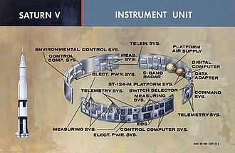
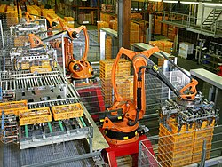
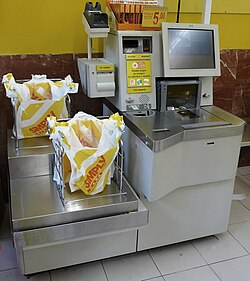
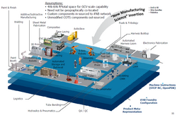
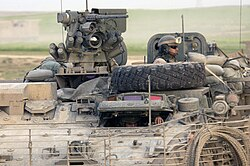

# 自动化｜精选补充资料

> 来源：[维基百科（中文）](https://zh.wikipedia.org/wiki/%E8%87%AA%E5%8A%A8%E5%8C%96)  
> 许可：[CC BY-SA 4.0](https://creativecommons.org/licenses/by-sa/4.0/)  
> 语言：简体中文  
> 获取时间：2026-08-08T09:43:31.138404+00:00

维基百科，自由的百科全书

自動化技术对太空探索而言最重要的，因為人類很難到達外太空和其他星球進行現場操作

工廠自動化

超市的自動包裝機是簡單的[PAC](/wiki/%E5%8F%AF%E7%A8%8B%E5%BC%8F%E8%87%AA%E5%8B%95%E5%8C%96%E6%8E%A7%E5%88%B6%E5%99%A8 "可程式自動化控制器")

全電腦自動化工廠概念

[史崔克](/wiki/%E5%8F%B2%E5%B4%94%E5%85%8B "史崔克")裝甲車的車外自動化槍塔取代人力，減低暴露車外危險性

**自动化技术**是一门综合性技术，它和[控制论](/wiki/%E6%8E%A7%E5%88%B6%E8%AE%BA "控制论")、[信息论](/wiki/%E4%BF%A1%E6%81%AF%E8%AE%BA "信息论")、[系统工程](/wiki/%E7%B3%BB%E7%BB%9F%E5%B7%A5%E7%A8%8B "系统工程")、[计算机](/wiki/%E7%94%B5%E5%AD%90%E8%AE%A1%E7%AE%97%E6%9C%BA "电子计算机")技术、[电子学](/wiki/%E7%94%B5%E5%AD%90%E5%AD%A6 "电子学")、[液压](/wiki/%E6%B6%B2%E5%A3%93 "液壓")及[气压](/wiki/%E6%B0%94%E5%8E%8B "气压")技术、自動控制等都有着十分密切的关系，而其中又以“控制理论”和“计算机技术”对自动化技术的影响最大。一些过程已经被完全自动化。狭义上指最高程度的机械化和电气化，即机器由依靠人力直接操作，转变为按人给出的既定要求和程序规定进行生产。广义上指原本由人工直接参与的操作，改换为由生产或服务中的对象或过程自发地按预定规律运行的一种转变过程。

自动控制是实现自动化的手段，指无人直接参与的情况下，利用外加的设备（控制器），使机器或生产过程（被控对象）的某个工作状态或参数（被控量）自动按照预定规律运行。

自动化是相对人工概念而言的。指的是在没人参与的情况下，利用控制装置使被控对象或过程自动地按预定规律运行。自动控制技术的研究有利于将人类从复杂、危险、繁琐的劳动环境中解放出来并大大提高控制效率。自动化的最大好处是可以节省[劳动力](/wiki/%E5%8A%B3%E5%8A%A8%E5%8A%9B "劳动力")，同时，它也可用于节约能源和材料，并改善品質，[准确度和精度](/wiki/%E6%BA%96%E7%A2%BA%E8%88%87%E7%B2%BE%E5%AF%86 "準確與精密")。

室内温度的调节是一个简明易懂的例子。目的是把室内温度保持在一个定值θ，尽管开窗等因素使得室内热量散发出室外（干扰d）。为了达到这个目的，加热必须被适当的影响。通过阀门的调节，[温度](/wiki/%E6%B8%A9%E5%BA%A6 "温度")就会保持恒定。除此之外，在人们有感觉之前，暖器热水的温度也会受外界温度的干扰。

自动化技术已被通过各种方式通常在组合来实现的，包括机械，液压，气动，电气，电子和计算机。复杂系统，例如现代化工厂，飞机和船只，通常使用所有这些组合的技术。

自动化涵盖各种设备与[控制系统](/wiki/%E6%8E%A7%E5%88%B6%E7%B3%BB%E7%B5%B1 "控制系統")的使用，如[机械](/wiki/%E6%9C%BA%E6%A2%B0 "机械")、[工业](/wiki/%E5%B7%A5%E4%B8%9A "工业")过程、[锅炉](/wiki/%E9%94%85%E7%82%89 "锅炉")、电话网络开关、船舶与飞机的转向与稳定等等。

在最简单的自动[控制回路](/wiki/%E6%8E%A7%E5%88%B6%E8%BF%B4%E8%B7%AF "控制迴路")中，控制器将过程的测量值与设定好的期望值进行比较，并处理产生的误差信号以改变过程的某些输入，从而使过程在受到干扰时也能维持在设定点。这种闭环控制是负反馈在系统中的应用。[控制论](/wiki/%E6%8E%A7%E5%88%B6%E8%AE%BA "控制论")的数学基础始于18世纪，并在20世纪迅猛发展。直到1947年[福特汽车](/wiki/%E7%A6%8F%E7%89%B9%E6%B1%BD%E8%BD%A6 "福特汽车")建立自动化部，“自动化”一词才开始广为流传。正是这一时期，该行业迅速采用了1930年代发明的反馈控制器。

[世界银行](/wiki/%E4%B8%96%E7%95%8C%E9%93%B6%E8%A1%8C "世界银行")《2019年世界发展报告》显示，有证据表明，技术类新产业创造的正面影响已经胜过了工人被自动化取代带来的负面影响。

## 概述

通过自动化实现只需数人即可实现对大型电力设施的控制、管理

### 概念

20世纪30年代，工业界开始广泛引入[反馈](/wiki/%E5%8F%8D%E9%A6%88 "反馈")[控制器](/wiki/%E6%8E%A7%E5%88%B6%E5%99%A8 "控制器")，但此时尚无“自动化”的表述。“Automation”一词最早出现于1947年，由[福特汽车](/wiki/%E7%A6%8F%E7%89%B9%E6%B1%BD%E8%BD%A6 "福特汽车")的工程经理哈德尔（英語：D. S. Harder）借用已有的两个词：automatic和operation缩合而成，用以描述不需人去搬动就能实现的机器间零件转移，即“自动操作（英語：automatic operation）”。其中，“automatic”一词源自希腊语automatos，表示“自己会动（英語：self-acting）”。“Automation”一词自创造出来后，便被普遍使用。中文的“自动化“是一个合成词，表示由非自动向自动的转变过程。

### 范例

利用[空调](/wiki/%E7%A9%BA%E8%B0%83 "空调")进行室内[温度](/wiki/%E6%B8%A9%E5%BA%A6 "温度")调节是一个典型的自动化范例。原本需要使用者不断调整风力大小实现对室内温度的调节。自动化后，使用者只需设定好预期温度，空调就能够自行实现对室内温度的调节。尽管由于室内不密封、人员呼吸等因素对室内温度造成干扰，但空调通过[温度传感器](/wiki/%E6%B8%A9%E5%BA%A6%E4%BC%A0%E6%84%9F%E5%99%A8 "温度传感器")实现对室内温度的感知，再通过[控制器](/wiki/%E6%8E%A7%E5%88%B6%E5%99%A8 "控制器")实现当前室温和预期温度的比较后，依据比较结果调整[压缩机](/wiki/%E5%8E%8B%E7%BC%A9%E6%9C%BA "压缩机")的运行状态，实现对室内温度的自发调节，将室内温度维持在预期温度。从上面的示例可以看出，自动化的实现需要通过信息获取、信息处理、分析判断、操纵控制等过程协作达成。

## 历史

在[控制理论](/wiki/%E6%8E%A7%E5%88%B6%E7%90%86%E8%AE%BA "控制理论")出现之前，由于没有理论进行统一指导，各类控制器的设计基本秉持着“即用即设计”的原则，彼此之间的设计相互独立。饶是如此，许多新发明也在不断推动着自动化前进。随着对控制精度要求的提升，自动控制领域自身的完整理论呼之欲出。1868年，[麦克斯韦](/wiki/%E8%A9%B9%E5%A7%86%E6%96%AF%C2%B7%E5%85%8B%E6%8B%89%E5%85%8B%C2%B7%E9%BA%A6%E5%85%8B%E6%96%AF%E9%9F%A6 "詹姆斯·克拉克·麦克斯韦")在論文《论调速器（英語：*On Governors*）》中应用[微分方程](/wiki/%E5%BE%AE%E5%88%86%E6%96%B9%E7%A8%8B "微分方程")为[離心式調速器](/wiki/%E9%9B%A2%E5%BF%83%E5%BC%8F%E8%AA%BF%E9%80%9F%E5%99%A8 "離心式調速器")建立了一个数学模型，用以研究反馈系统的稳定性问题，提出了控制领域最早的数学理论。此后，自动控制系统的理论便不断发展，形成了以传递函数为基础，研究单输入单输出的[线性](/wiki/%E7%BA%BF%E6%80%A7%E6%98%A0%E5%B0%84 "线性映射")[定常系統](/wiki/%E5%AE%9A%E5%B8%B8%E7%B3%BB%E7%B5%B1 "定常系統")的经典控制理论，并在[二战](/wiki/%E4%BA%8C%E6%88%98 "二战")期间得到了重大突破与广泛应用。随着1957年太空时代的来临，随着复杂的工业生产过程、[航空](/wiki/%E8%88%AA%E7%A9%BA "航空")及航天技术、社会经济系统等领域的进步使自动控制理论得以迅速发展，伴随着数字计算机的广泛应用，主要研究高性能、高精度、高耦合回路的多变量系统的[现代控制理论](/wiki/%E7%8E%B0%E4%BB%A3%E6%8E%A7%E5%88%B6%E7%90%86%E8%AE%BA "现代控制理论")走上历史舞台。

### 早期历史

[克特西比乌斯](/wiki/%E5%85%8B%E7%89%B9%E8%A5%BF%E6%AF%94%E4%B9%8C%E6%96%AF "克特西比乌斯")发明的[水钟](/wiki/%E6%B0%B4%E9%92%9F "水钟")（公元前3世纪）

[托勒密王国](/wiki/%E6%89%98%E5%8B%92%E5%AF%86%E7%8E%8B%E5%9B%BD "托勒密王国")的[克特西比乌斯](/wiki/%E5%85%8B%E7%89%B9%E8%A5%BF%E6%AF%94%E4%B9%8C%E6%96%AF "克特西比乌斯")于约公元前270年记录了一种用于[水钟](/wiki/%E6%B0%B4%E9%92%9F "水钟")的浮子调节器，其原理与现代抽水马桶中的浮子水阀相同。这是有记载最早的反馈控制机制。公元前250年，[比赞兹](/w/index.php?title=%E6%AF%94%E8%B5%9E%E5%85%B9&action=edit&redlink=1 "比赞兹（页面不存在）")发明了通过浮子来控制油面高度的油灯。14世纪机械钟的出现使水钟及其浮子反馈系统变得过时。

波斯的巴努·穆萨兄弟在《[奇器之书](/w/index.php?title=%E5%A5%87%E5%99%A8%E4%B9%8B%E4%B9%A6&action=edit&redlink=1 "奇器之书（页面不存在）")》（Book of Ingenious Devices）（850）中描述了一些可以实现自动控制的机器。巴努·穆萨兄弟发明了用于液体的两步液位控制，是一种不联系的[变结构控制](/wiki/%E5%8F%98%E7%BB%93%E6%9E%84%E6%8E%A7%E5%88%B6 "变结构控制")。他们还描述了一种反馈控制器。在工业革命之前，反馈控制系统是通过试错与工程直觉设计出来的，因此更像一门艺术而非科学。直到19世纪中叶，反馈控制系统的稳定性猜得到数学——自动控制理论的正式语言——进行分析。[[來源請求]](/wiki/Wikipedia:%E5%88%97%E6%98%8E%E6%9D%A5%E6%BA%90 "Wikipedia:列明来源")

17世纪，[克里斯蒂安·惠更斯](/wiki/%E5%85%8B%E9%87%8C%E6%96%AF%E8%92%82%E5%AE%89%C2%B7%E6%83%A0%E6%9B%B4%E6%96%AF "克里斯蒂安·惠更斯")发明了[离心式调速器](/wiki/%E9%9B%A2%E5%BF%83%E5%BC%8F%E8%AA%BF%E9%80%9F%E5%99%A8 "離心式調速器")，最初是为了调节[石磨](/wiki/%E7%9F%B3%E7%A3%A8 "石磨")磨盘的间隙。

### 西欧的工业革命

[蒸汽机](/wiki/%E8%92%B8%E6%B1%BD%E6%9C%BA "蒸汽机")有调节发动机转速和功率的需要，由此促进了自动化。

[发动机](/wiki/%E5%8F%91%E5%8A%A8%E6%9C%BA "发动机")，或称自驱动机的发明使得磨坊、锅炉及[蒸汽机](/wiki/%E8%92%B8%E6%B1%BD%E6%9C%BA "蒸汽机")对自动控制系统产生了新要求。1624年，荷兰人[科尼利斯·德雷贝尔](/w/index.php?title=%E7%A7%91%E5%B0%BC%E5%88%A9%E6%96%AF%C2%B7%E5%BE%B7%E9%9B%B7%E8%B4%9D%E5%B0%94&action=edit&redlink=1 "科尼利斯·德雷贝尔（页面不存在）")（英语：[Cornelis\_Drebbel](https://en.wikipedia.org/wiki/Cornelis_Drebbel "en:Cornelis Drebbel")）发明了第一个带有反馈的温度控制器。1681年，法国人[帕潘](/wiki/%E4%B8%B9%E5%B0%BC%E6%96%AF%C2%B7%E5%B8%95%E6%BD%98 "丹尼斯·帕潘")发明了第一个蒸汽锅炉的压力调节装置。最早的反馈控制机制被用于搭风车的风帆，它在1745年已经被埃德蒙·李(Edmund Lee)申请了专利。同样是在1745年，[雅克·德·沃康松](/wiki/%E9%9B%85%E5%85%8B%C2%B7%E5%BE%B7%C2%B7%E6%B2%83%E5%BA%B7%E6%9D%BE "雅克·德·沃康松")发明了第一台自动织机。1800年前后，[雅克·德·沃康松](/wiki/%E9%9B%85%E5%85%8B%C2%B7%E5%BE%B7%C2%B7%E6%B2%83%E5%BA%B7%E6%9D%BE "雅克·德·沃康松")发明了[雅卡尔织布机](/wiki/%E9%9B%85%E5%8D%A1%E5%B0%94%E7%BB%87%E5%B8%83%E6%9C%BA "雅卡尔织布机")。

1771年，[理查·阿克莱特](/wiki/%E7%90%86%E6%9F%A5%C2%B7%E9%98%BF%E5%85%8B%E8%8E%B1%E7%89%B9 "理查·阿克莱特")发明了第一台全自动[水力纺纱机](/wiki/%E6%B0%B4%E5%8A%9B%E7%BA%BA%E7%BA%B1%E6%9C%BA "水力纺纱机")。1785年，[奥利弗·埃文斯](/wiki/%E5%A5%A7%E5%88%A9%E5%BC%97%C2%B7%E5%9F%83%E6%96%87%E6%96%AF "奧利弗·埃文斯")建立了一座自动面粉厂，使其成为第一个完全自动化的工业流程。

[离心式调速器](/wiki/%E9%9B%A2%E5%BF%83%E5%BC%8F%E8%AA%BF%E9%80%9F%E5%99%A8 "離心式調速器")是一种早期的反馈控制系统。速度增加会使配重向外移动，使连杆滑动，于是闭合蒸汽阀，从而使发动机减速。

1784年，英国Bunce使用离心式调速器作为蒸汽起重机模型的一部分。1788年，[瓦特](/wiki/%E7%93%A6%E7%89%B9 "瓦特")为改良[紐科門蒸汽机](/wiki/%E7%B4%90%E7%A7%91%E9%96%80%E8%92%B8%E6%B1%BD%E6%A9%9F "紐科門蒸汽機")发明的[离心调速装置](/wiki/%E9%9B%A2%E5%BF%83%E5%BC%8F%E8%AA%BF%E9%80%9F%E5%99%A8 "離心式調速器")是第一个在[工业](/wiki/%E5%B7%A5%E4%B8%9A "工业")领域使用的带有反馈的调节装置，是世界上最早的自动化机器。与此同时，俄罗斯人[波尔祖诺夫](/w/index.php?title=%E6%B3%A2%E5%B0%94%E7%A5%96%E8%AF%BA%E5%A4%AB&action=edit&redlink=1 "波尔祖诺夫（页面不存在）")（英语：[Ivan Polzunov](https://en.wikipedia.org/wiki/Ivan_Polzunov "en:Ivan Polzunov")）发明了带有反馈的水面高度控制器，将水面高度的信息传递到浮子上，然后再反作用于蒸汽阀门上。

调速器实际上不能一直保持恒定的转速，如果负载变化，发动机会变换到新的恒定速度。调速器只能处理较小的变化，如由锅炉的热负载波动引发的变化。另外，速度一旦变化，就有可能发生震荡。因此，配备此种调速器的发动机不适合棉纺等需要恒定速度的操作。对蒸汽机上气阀关闭时间的改进之类优化，使得蒸汽机在19世纪末之前逐渐适应了大多数工业用途。蒸汽机的进步远远领先于热力学和控制论的发展，因此调速器很少受到关注，直到[麦克斯韦](/wiki/%E9%BA%A6%E5%85%8B%E6%96%AF%E9%9F%A6 "麦克斯韦")于1868年发表的论文，为近现代控制论奠定了理论基础。

在闭环控制中，来自控制器的控制动作取决于过程输出。在锅炉类比的情况下，这将包括一个温度传感器以监视建筑物的温度，从而将信号反馈给控制器，以确保其将建筑物保持在恒温器设定的温度下。因此，闭环控制器具有反馈回路，该反馈回路可确保控制器施加控制作用以提供等于“参考输入”或“设定点”的过程输出。因此，闭环控制器也称为反馈控制器。

### 经典控制理论阶段

主条目：[控制论](/wiki/%E6%8E%A7%E5%88%B6%E8%AE%BA "控制论")

在提出控制论后，此阶段以机械装置为主，主要使用气动、液压装置，并逐渐为电子管、晶体管等器件构成的模拟电路搭建电子装置所取代。从1868年起直到二战，自动控制系统的理论和实践在美国与西欧、俄国与东欧分别沿着不同的方向发展。在美国与西欧，系统一般都在[频域](/wiki/%E9%A2%91%E5%9F%9F "频域")描述，问题都用来自[贝尔实验室](/wiki/%E8%B4%9D%E5%B0%94%E5%AE%9E%E9%AA%8C%E5%AE%A4 "贝尔实验室")的[波德](/wiki/%E4%BA%A8%E5%BE%B7%E9%87%8C%E5%85%8B%C2%B7%E9%9F%8B%E5%BE%B7%C2%B7%E6%B3%A2%E5%BE%B7 "亨德里克·韋德·波德")，[奈奎斯特](/wiki/%E5%93%88%E9%87%8C%C2%B7%E5%A5%88%E5%A5%8E%E6%96%AF%E7%89%B9 "哈里·奈奎斯特")和[布莱克](/wiki/%E5%93%88%E7%BD%97%E5%BE%B7%C2%B7%E5%8F%B2%E8%92%82%E8%8A%AC%C2%B7%E5%B8%83%E8%8E%B1%E5%85%8B "哈罗德·史蒂芬·布莱克")的方法解决，而俄国与东欧的数学家和工程师们一般在时域用[微分方程](/wiki/%E5%BE%AE%E5%88%86%E6%96%B9%E7%A8%8B "微分方程")解决问题。

1868年，[麦克斯韦](/wiki/%E8%A9%B9%E5%A7%86%E6%96%AF%C2%B7%E5%85%8B%E6%8B%89%E5%85%8B%C2%B7%E9%BA%A6%E5%85%8B%E6%96%AF%E9%9F%A6 "詹姆斯·克拉克·麦克斯韦")在論文《论调速器（英語：*On Governors*）》中应用[微分方程](/wiki/%E5%BE%AE%E5%88%86%E6%96%B9%E7%A8%8B "微分方程")为[離心式調速器](/wiki/%E9%9B%A2%E5%BF%83%E5%BC%8F%E8%AA%BF%E9%80%9F%E5%99%A8 "離心式調速器")建立了一个数学模型，研究反馈系统的稳定性问题，提出了控制领域最早的数学理论。

1892年，[李雅普诺夫](/wiki/%E6%9D%8E%E9%9B%85%E6%99%AE%E8%AF%BA%E5%A4%AB "李雅普诺夫")发表了博士论文《论运动稳定性的一般问题（俄語：Общая задача об устойчивости движения）》，提出了[李雅普诺夫稳定性](/wiki/%E6%9D%8E%E9%9B%85%E6%99%AE%E8%AF%BA%E5%A4%AB%E7%A8%B3%E5%AE%9A%E6%80%A7 "李雅普诺夫稳定性")理论。

继电器逻辑随着工业[电气化](/wiki/%E7%94%B5%E6%B0%94%E5%8C%96 "电气化")诞生，从1900年前后到1920年代快速演进。中央供电站也在快速发展，新的高压锅炉、蒸汽轮机和变电站对仪器与控制水平提出了更高要求。中央控制室在1920年代逐渐普及开来，但直到30年代初，大多数过程控制还由各种开关完成。操作员通常负责监测记录仪绘制的仪器数据图表，进行修正时要开关阀门或开关。控制室使用彩色编码灯向工厂工人发送信号，以手动作出改变。

电子放大器要传递清晰的信号，需要更高信噪比，这在1920年代通过负反馈去噪得到解决。这与电话领域其他经验及理论，对控制论发展做出了贡献。1940到50年代，德国数学家Irmgard Flügge-Lotz发展了不连续自动控制理论，其在二战中被用于[火控系统](/wiki/%E7%81%AB%E6%8E%A7%E7%B3%BB%E7%BB%9F "火控系统")与飞行器[导航系统](/wiki/%E5%AF%BC%E8%88%AA%E7%B3%BB%E7%BB%9F "导航系统")。

1930年代，开始引入控制器，能对偏离设定点的情况通过计算进行调整，而不再需要按钮和开关。控制器使制造业生产力进一步提高，抵消了工厂电气化下降的影响。

1920年代，工厂生产力因电气化而大大增加，美国制造业生产力增量从10年代的5.2%/年下降到20、30年代的2.76%/年。Alexander Field指出，1929到1933年间，非医疗仪器的支出大幅增加，之后保持强劲。

一二战之间，[大众传播](/wiki/%E5%A4%A7%E4%BC%97%E4%BC%A0%E6%92%AD "大众传播")和[信号处理](/wiki/%E4%BF%A1%E5%8F%B7%E5%A4%84%E7%90%86 "信号处理")领域取得了重大进展。自动控制的其他方面包括[微分方程](/wiki/%E5%BE%AE%E5%88%86%E6%96%B9%E7%A8%8B "微分方程")求解、[稳定性理论](/wiki/%E7%A8%B3%E5%AE%9A%E6%80%A7%E7%90%86%E8%AE%BA "稳定性理论")和[一般系统理论](/wiki/%E4%B8%80%E8%88%AC%E7%B3%BB%E7%B5%B1%E7%90%86%E8%AB%96 "一般系統理論")（1938）、[频率响应](/wiki/%E9%A2%91%E7%8E%87%E5%93%8D%E5%BA%94 "频率响应")（1940）、船舶[运动控制](/wiki/%E8%BF%90%E5%8A%A8%E6%8E%A7%E5%88%B6 "运动控制")（1950）及[随机分析](/wiki/%E9%9A%8F%E6%9C%BA%E5%88%86%E6%9E%90 "随机分析")（1941）。

自动控制技术的重大突破发生在[二战](/wiki/%E4%BA%8C%E6%88%98 "二战")时期，因为制造武器装备，必须处理复杂的系统。雷达，无人驾驶和自动瞄准系统只是几个带有反馈系统的例子。对新的控制系统的需求导致了新的数学方法的改善，从而控制技术有了自己的一套准则。

在自动调节、计算机、[通信](/wiki/%E9%80%9A%E4%BF%A1 "通信")技术、[仿生学](/wiki/%E4%BB%BF%E7%94%9F%E5%AD%A6 "仿生学")以及其他学科互相渗透的基础上，1950年，[贝塔朗菲](/wiki/%E8%B4%9D%E5%A1%94%E6%9C%97%E8%8F%B2%EF%BC%8CL.von "贝塔朗菲，L.von")发表了《一般系统论（英語：An outline of general system theory）》，1948年，[维纳](/wiki/%E8%AF%BA%E4%BC%AF%E7%89%B9%C2%B7%E7%BB%B4%E7%BA%B3 "诺伯特·维纳")发表了《[控制论：或关于在动物和机器中控制和通信的科学](/wiki/%E6%8E%A7%E5%88%B6%E8%AE%BA%EF%BC%9A%E6%88%96%E5%85%B3%E4%BA%8E%E5%9C%A8%E5%8A%A8%E7%89%A9%E5%92%8C%E6%9C%BA%E5%99%A8%E4%B8%AD%E6%8E%A7%E5%88%B6%E5%92%8C%E9%80%9A%E4%BF%A1%E7%9A%84%E7%A7%91%E5%AD%A6 "控制论：或关于在动物和机器中控制和通信的科学")（英語：Cybernetics: Or Control and Communication in the Animal and the Machine）》。至此形成了以传递函数为基础，研究单输入单输出的[线性](/wiki/%E7%BA%BF%E6%80%A7%E6%98%A0%E5%B0%84 "线性映射")[定常系統](/wiki/%E5%AE%9A%E5%B8%B8%E7%B3%BB%E7%B5%B1 "定常系統")的经典控制理论。这一理论对自动化技术有着深远影响。维纳提出的反馈控制原理，至今仍然是控制理论中的一条重要规律。

### 现代控制理论阶段

主条目：[现代控制理论](/wiki/%E7%8E%B0%E4%BB%A3%E6%8E%A7%E5%88%B6%E7%90%86%E8%AE%BA "现代控制理论")

随着1957年太空时代的来临，控制设计（尤其是在美国）从古典控制理论的频域技术转向了19世纪后期的微分方程技术域。20世纪60年代，随着复杂的工业生产过程、[航空](/wiki/%E8%88%AA%E7%A9%BA "航空")及航天技术、社会经济系统等领域的进步使自动控制理论得以迅速发展，自动化技术水平大大提高。两个显著进展是数字计算机得到广泛应用以及[现代控制理论](/wiki/%E7%8E%B0%E4%BB%A3%E6%8E%A7%E5%88%B6%E7%90%86%E8%AE%BA "现代控制理论")的诞生。现代控制理论主要研究高性能、高精度、高耦合回路的多变量系统。

1958年开始，出现了各种基于[固态](/wiki/%E5%9B%BA%E6%80%81%E7%94%B5%E5%AD%90%E5%99%A8%E4%BB%B6 "固态电子器件")[数字电路](/wiki/%E6%95%B0%E5%AD%97%E7%94%B5%E8%B7%AF "数字电路")模块的硬接可编程逻辑控制器（[可编程逻辑控制器](/wiki/%E5%8F%AF%E7%BC%96%E7%A8%8B%E9%80%BB%E8%BE%91%E6%8E%A7%E5%88%B6%E5%99%A8 "可编程逻辑控制器")，PLC的前身）系统，以取代用于[过程控制](/wiki/%E8%BF%87%E7%A8%8B%E6%8E%A7%E5%88%B6 "过程控制")和自动化的[工业控制](/wiki/%E5%B7%A5%E4%B8%9A%E6%8E%A7%E5%88%B6 "工业控制")系统中的电动机械继电器逻辑。

1959年，[德士古](/wiki/%E5%BE%B7%E5%A3%AB%E5%8F%A4 "德士古")的Arthur Refinery港出现了第一个使用[数位控制](/wiki/%E6%95%B8%E4%BD%8D%E6%8E%A7%E5%88%B6 "數位控制")的化工厂。随着[计算机硬件](/wiki/%E8%AE%A1%E7%AE%97%E6%9C%BA%E7%A1%AC%E4%BB%B6 "计算机硬件")价格下降，工厂向数字控制的转变在1970年代迅速进行。

现代控制论主要包括以状态为基础的状态空间法、[贝尔曼](/wiki/%E8%B4%9D%E5%B0%94%E6%9B%BC%EF%BC%8CR. "贝尔曼，R.")的动态规划法和[庞特里亚金](/wiki/%E5%BA%9E%E7%89%B9%E9%87%8C%E4%BA%9A%E9%87%91 "庞特里亚金")的[最大化原理](/wiki/%E5%BA%9E%E7%89%B9%E9%87%8C%E4%BA%9A%E9%87%91%E6%9C%80%E5%A4%A7%E5%8C%96%E5%8E%9F%E7%90%86 "庞特里亚金最大化原理")。

理论基础转变为线性代数。多变量线性系统理论、最优控制理论以及最优估计与系统辨识理论。

1980年代，由于电子技术的出现，控制技术有了新的动因。工程师们可以更快更好地进行计算，高度复杂和精准的控制系统成为可能。

到了21世纪，自动化技术进入了[计算机自动设计](/wiki/%E8%AE%A1%E7%AE%97%E6%9C%BA%E8%87%AA%E5%8A%A8%E8%AE%BE%E8%AE%A1 "计算机自动设计")（CAutoD）的年代。

### 智能控制理论

主条目：[智能控制](/wiki/%E6%99%BA%E8%83%BD%E6%8E%A7%E5%88%B6 "智能控制")和[人工智能](/wiki/%E4%BA%BA%E5%B7%A5%E6%99%BA%E8%83%BD "人工智能")

* [模糊控制](/wiki/%E6%A8%A1%E7%B3%8A%E6%8E%A7%E5%88%B6 "模糊控制")
* [强化学习](/wiki/%E5%BC%BA%E5%8C%96%E5%AD%A6%E4%B9%A0 "强化学习")
* ANN - [人工神经网络](/wiki/%E4%BA%BA%E5%B7%A5%E7%A5%9E%E7%BB%8F%E7%BD%91%E7%BB%9C "人工神经网络")
  + DCS - [分布式控制系统](/wiki/%E5%88%86%E5%B8%83%E5%BC%8F%E6%8E%A7%E5%88%B6%E7%B3%BB%E7%BB%9F "分布式控制系统")
* HMI - 人-机[用户界面](/wiki/%E7%94%A8%E6%88%B7%E7%95%8C%E9%9D%A2 "用户界面")
* SCADA - [数据采集与监控系统](/wiki/%E6%95%B0%E6%8D%AE%E9%87%87%E9%9B%86%E4%B8%8E%E7%9B%91%E6%8E%A7%E7%B3%BB%E7%BB%9F "数据采集与监控系统")
* PLC - [可编程逻辑控制器](/wiki/%E5%8F%AF%E7%BC%96%E7%A8%8B%E9%80%BB%E8%BE%91%E6%8E%A7%E5%88%B6%E5%99%A8 "可编程逻辑控制器")

### 重要应用

自动[电话交换台](/w/index.php?title=%E7%94%B5%E8%AF%9D%E4%BA%A4%E6%8D%A2%E5%8F%B0&action=edit&redlink=1 "电话交换台（页面不存在）")与拨号电话一同问世于1892年。到1929年，贝尔系统的31.9%都是自动的。自动电话交换最初用的是真空管放大器和电动机械开关，需要消耗大量电力。通话量增长得太快，促使[贝尔实验室](/wiki/%E8%B4%9D%E5%B0%94%E5%AE%9E%E9%AA%8C%E5%AE%A4 "贝尔实验室")开始对[晶体管](/wiki/%E6%99%B6%E4%BD%93%E7%AE%A1 "晶体管")的研究。

电话交换继电器的执行逻辑启发了数字计算机的研发。1905年，出现了第一台商业上成功的玻璃瓶吹制机。需要两名操作人员，每班工作12小时，一天可生产17280个瓶子，成本10至12分每个；而由6名男子和男孩组成的小组用传统方式只能生产2880个瓶子，成本1.8美元每个。

分段驱动器是利用控制论开发的。分段电传动用于机器的不同部分，其间须保持精确的差值。在轧钢时，材料通过轧筒时，轧筒必须以相同的速度匀速运行。在造纸中，纸张通过成组排列的蒸汽干燥口，必须以较慢的速度匀速传动。1919年，分段电传动首次出现于造纸机。20世纪钢铁工业最重要的发展之一便是连续宽钢带轧制，由Armco公司发明于1928年。

自动药物生产

在自动化之前，许多化学品都是成批生产的。1930年，随着仪器的广泛使用和控制器的兴起，陶氏化学公司创始人开始提倡[连续生产](/w/index.php?title=%E8%BF%9E%E7%BB%AD%E7%94%9F%E4%BA%A7&action=edit&redlink=1 "连续生产（页面不存在）")。

1840年代，[詹姆斯·内史密斯](/wiki/%E8%A9%B9%E5%A7%86%E6%96%AF%C2%B7%E5%86%85%E5%8F%B2%E5%AF%86%E6%96%AF "詹姆斯·内史密斯")开发了能实现手部灵活性的自动[机床](/wiki/%E6%9C%BA%E5%BA%8A "机床")，这样原先需要熟练工人的工作可由男孩和非熟练工人操作。1950年代，[机床](/wiki/%E6%9C%BA%E5%BA%8A "机床")通过打孔纸带实现了[数值控制](/wiki/%E6%95%B0%E5%80%BC%E6%8E%A7%E5%88%B6 "数值控制")（NC），很快演变为计算机化数值控制（CNC）。

今天，几乎所有类型的制造和装配过程都实行了广泛的自动化。较大多过程包括发电、炼油、化工、钢厂、塑料、水泥厂、化肥厂、纸浆和造纸厂、汽车和卡车组装、飞机生产、玻璃制造、天然气分离厂、食品和饮料加工、罐头和装瓶以及各种零件的制造。机器人在汽车喷漆等危险应用中特别有用。机器人也被用来组装电子线路板。汽车焊接是用机器人完成的，自动焊接机被用于管道等应用。

### 航天/计算机时代

随着1957年太空时代的到来，控制设计从经典控制理论的频域技术转回19世纪末的微分方程时域技术。40到50年代，德国数学家Irmgard Flugge-Lotz发展了不连续自动控制理论，后被广泛应用于[启停式控制](/w/index.php?title=%E5%90%AF%E5%81%9C%E5%BC%8F%E6%8E%A7%E5%88%B6&action=edit&redlink=1 "启停式控制（页面不存在）")，如[导航系统](/wiki/%E5%AF%BC%E8%88%AA%E7%B3%BB%E7%BB%9F "导航系统")、[火控系统](/wiki/%E7%81%AB%E6%8E%A7%E7%B3%BB%E7%BB%9F "火控系统")和[电子学](/wiki/%E7%94%B5%E5%AD%90%E5%AD%A6 "电子学")。Flugge-Lotz等人的理论后来衍生出[非线性系统](/wiki/%E9%9D%9E%E7%B7%9A%E6%80%A7%E7%B3%BB%E7%B5%B1 "非線性系統")时域设计（1961）、[导航](/wiki/%E5%AF%BC%E8%88%AA "导航")（1960）、[最优控制](/wiki/%E6%9C%80%E4%BC%98%E6%8E%A7%E5%88%B6 "最优控制")与[估计理论](/wiki/%E4%BC%B0%E8%AE%A1%E7%90%86%E8%AE%BA "估计理论")（1962）、[非线性控制](/wiki/%E9%9D%9E%E7%B7%9A%E6%80%A7%E6%8E%A7%E5%88%B6 "非線性控制")（1969）、[数位控制](/wiki/%E6%95%B8%E4%BD%8D%E6%8E%A7%E5%88%B6 "數位控制")和[过滤理论](/wiki/%E9%81%8E%E6%BF%BE_(%E6%95%B8%E5%AD%B8) "過濾 (數學)")（1974）和[个人电脑](/wiki/%E4%B8%AA%E4%BA%BA%E7%94%B5%E8%84%91 "个人电脑")（1983）。

## 优缺点与限制

自动化在工业中最常见的优势也许是其可以造成生产速度的提升与劳动力成本的下降。另外，在[危险环境](/wiki/%E8%81%B7%E6%A5%AD%E5%8D%B1%E5%AE%B3 "職業危害")中进行，或超出人类能力的任务，也可以由泛用性更广又方便维护的机器完成。但就目前而言，并非所有任务都能实现自动化，有些任务的自动化成本反而高于人工。工厂环境中完全自动化的初始成本很高，可能还会导致产品本身的损失。

此外，似乎有研究表明，工业自动化可能会带来操作问题之外的不良影响，比如系统性失业，以及环境破坏；然而这些研究结果本质上存在争议，且存在缓解的手段。

自动化的**优点**主要有：

* 较高的产率/产量
* 较高的产品质量
* 较高的[可预测性](/w/index.php?title=%E5%8F%AF%E9%A2%84%E6%B5%8B%E6%80%A7&action=edit&redlink=1 "可预测性（页面不存在）")
* 较高的工艺/产品[鲁棒性](/wiki/%E9%B2%81%E6%A3%92%E6%80%A7 "鲁棒性")
* 较高的产出一致性
* 较低的直接人力成本
* 较低的周期时间
* 较高的准确性
* 使人从单调重复性工作中解脱出来
* 创造开发、部署、维护与操作自动化系统方面的人工工作
* 使人拥有做其他事的自由

自动化主要描述的是机器代替人行动。机械化在尺寸、力量、速度、耐力、视觉范围、敏锐度、听觉频率与精确度、电磁感应及影响等方面扩展了人类能力，主要优势包括：

* 减轻人类的[职业伤害](/wiki/%E8%81%B7%E6%A5%AD%E5%82%B7%E5%AE%B3 "職業傷害")（如，减少因搬运重物导致的腰部拉伤）
* 减少恶劣环境中的人工作业（如，火灾、太空、火山、核设施、水下等）

自动化的**缺点**主要有：

* 初始成本较高
* 无人干预时，生产变快可能意味着缺陷也更快出现
* 系统发生故障时，更大的能力可能意味着更大的问题——以更大的速度释放出危险的毒素、能量等。
* 人类的适应性往往不能被自动化的发起者理解。通常很难预测每个突发事件，并为每种情况都做好计划。自动化过程中固有的发现可能需要预想之外的迭代来解决，这也意味着预想之外的成本。

### 自动化悖论

自动化悖论认为，自动化系统的效率越高，虽然人类参与程度变少了，但操作者的人力贡献反而越关键。认知心理学家Lisanne Bainbridge在拥有大量引用的《自动化的反讽》中指出了这个问题。自动化系统一旦出现错误，它就会成倍放大这个错误，直到得到修复或被关停，这也就是人类操作者的作用。这方面的一个例子是[法国航空447号班机空难](/wiki/%E6%B3%95%E5%9B%BD%E8%88%AA%E7%A9%BA447%E5%8F%B7%E7%8F%AD%E6%9C%BA%E7%A9%BA%E9%9A%BE "法国航空447号班机空难")，自动化系统的错误使飞行员陷入没有事先准备的手动操作中。

## 使用工具

工程师现在可以数字控制自动化设备。其结果是迅速扩大了应用范围和人类活动。

不同类型的自动化工具存在：

* ANN - [人工神经网络](/wiki/%E4%BA%BA%E5%B7%A5%E7%A5%9E%E7%BB%8F%E7%BD%91%E7%BB%9C "人工神经网络")
* DCS - [分布式控制系统](/wiki/%E5%88%86%E5%B8%83%E5%BC%8F%E6%8E%A7%E5%88%B6%E7%B3%BB%E7%BB%9F "分布式控制系统")
* HMI - 人-机[用户界面](/wiki/%E7%94%A8%E6%88%B7%E7%95%8C%E9%9D%A2 "用户界面")
* SCADA - [数据采集与监控系统](/wiki/%E6%95%B0%E6%8D%AE%E9%87%87%E9%9B%86%E4%B8%8E%E7%9B%91%E6%8E%A7%E7%B3%BB%E7%BB%9F "数据采集与监控系统")
* PLC - [可编程逻辑控制器](/wiki/%E5%8F%AF%E7%BC%96%E7%A8%8B%E9%80%BB%E8%BE%91%E6%8E%A7%E5%88%B6%E5%99%A8 "可编程逻辑控制器")
* [机器人学](/wiki/%E6%9C%BA%E5%99%A8%E4%BA%BA%E5%AD%A6 "机器人学")

## 应用

工业自动化是自动化技术应用的一个最为重要的方向。其具体运用的方面有：

* [计算机辅助设计](/wiki/%E8%AE%A1%E7%AE%97%E6%9C%BA%E8%BE%85%E5%8A%A9%E8%AE%BE%E8%AE%A1 "计算机辅助设计")（CAD）和[计算机辅助制造](/wiki/%E8%AE%A1%E7%AE%97%E6%9C%BA%E8%BE%85%E5%8A%A9%E5%88%B6%E9%80%A0 "计算机辅助制造")（CAM）
* 综合[办公自动化](/wiki/%E5%8A%9E%E5%85%AC%E8%87%AA%E5%8A%A8%E5%8C%96 "办公自动化")（OA）([門禁系統](/wiki/%E9%96%80%E7%A6%81%E7%B3%BB%E7%B5%B1 "門禁系統")、[資訊科技稽核](/wiki/%E8%B3%87%E8%A8%8A%E7%A7%91%E6%8A%80%E7%A8%BD%E6%A0%B8 "資訊科技稽核")等)
* [过程控制](/wiki/%E8%BF%87%E7%A8%8B%E6%8E%A7%E5%88%B6 "过程控制")与自动化仪器仪表
* [人工智能](/wiki/%E4%BA%BA%E5%B7%A5%E6%99%BA%E8%83%BD "人工智能")技术

## 在工業上帶來的影響

工業自動化多以自動設備取代高危險、單調性、高頻率的人力行為，如取熱[鑄件](/wiki/%E9%93%B8%E4%BB%B6 "铸件")、每隔幾分鐘取料、組裝線。透過自動化的設備導入，協助解決人資調漲、技術斷層、品質穩定的狀況。自動化為固定模式的概念，在導入前需要準備的工作如下：

* [標準化](/wiki/%E6%A8%99%E6%BA%96%E5%8C%96 "標準化")作業：自動化為一切由計算、規劃、輸入電腦設定，控制重複作業所構成的功能，將每一項生產步驟統一制度化才能接著由人去規劃、計算。
* 風險性評估：對於生產過程中間可能會有的風險，如：[金屬加工](/wiki/%E9%87%91%E5%B1%AC%E5%8A%A0%E5%B7%A5 "金屬加工")所生鐵屑、[壓鑄](/wiki/%E5%A3%93%E9%91%84 "壓鑄")、成型要夾取未去毛編的鋁塊‥考驗的是規劃商的技術與經驗，風險評估將大大影響這套產品最後所生成效益，最好讓規劃自動化設備廠商與機械製造廠商間多評估，以避免生產狀況影響自動化運作。
* 效能評估：一般來說，規劃商會以人力與時間作為依據，預估可節省之效益，因自動化設備如[機械手臂](/wiki/%E6%A9%9F%E6%A2%B0%E6%89%8B%E8%87%82 "機械手臂")Robot一組高至百萬，或[門型機械手](/wiki/%E9%96%80%E5%9E%8B%E6%A9%9F%E6%A2%B0%E6%89%8B "門型機械手")價格平近但仍不斐，若效益未達，則不建議導入。

機械人展

簡易三要點評斷是否適合自動化導入：

* 年產量大。
* 加工時間短。
* 產品形狀單純。

同時自动化也可能造成[失業](/wiki/%E5%A4%B1%E6%A5%AD "失業")問題的增加成為政治議題，傳統自動化機械隨著[電腦](/wiki/%E9%9B%BB%E8%85%A6 "電腦")發展逐漸智能化，有可能導致滲透進更下端的產業和更小型的公司，取代更多的職缺，這種取代有可能是一種等比級數的擴張，日經新聞曾研究2030年後日本可能被機器人搶走735萬工作機會，而被搶工作的人會湧向其他工作機會，讓其他工作的勞工在資方面前更弱勢而遭到薪資和福利的不利影響，所以自動化技術有可能加劇貧富差距而成為未可知的巨大問題。

## 与其他学科的关系

自動化控制系統的研究，幾乎涵蓋所有應用科學知識與技術的結合，領域範圍及牽涉的科學知識與應用工具相當廣泛，作为交叉学科，自动控制与其他很多学科有关联，尤其是[数学](/wiki/%E6%95%B0%E5%AD%A6 "数学")和[信息学](/wiki/%E4%BF%A1%E6%81%AF%E5%AD%A6 "信息学")，在[制造](/wiki/%E8%A3%BD%E9%80%A0 "製造")，[医药](/wiki/%E5%8C%BB%E8%8D%AF "医药")，[交通](/wiki/%E4%BA%A4%E9%80%9A "交通")，[机器人](/wiki/%E6%9C%BA%E5%99%A8%E4%BA%BA "机器人")，以及[经济学](/wiki/%E7%BB%8F%E6%B5%8E%E5%AD%A6 "经济学")，[社会学](/wiki/%E7%A4%BE%E4%BC%9A%E5%AD%A6 "社会学")中的应用也都非常广泛。[飞机](/wiki/%E9%A3%9E%E6%9C%BA "飞机")和[船舶](/wiki/%E8%88%B9%E8%88%B6 "船舶")中的自动驾驶，[汽车](/wiki/%E6%B1%BD%E8%BD%A6 "汽车")中的防抱死和速度控制器也都是典型的应用。

自动化和数学有非常紧密的关系。数学提供了自动化领域里[控制理论](/wiki/%E6%8E%A7%E5%88%B6%E7%90%86%E8%AE%BA "控制理论")、[系统论](/wiki/%E7%B3%BB%E7%BB%9F%E8%AE%BA "系统论")、[信号处理](/wiki/%E4%BF%A1%E5%8F%B7%E5%A4%84%E7%90%86 "信号处理")等分支学科的数学基础。自动化设计的系统通常基于[数学模型](/wiki/%E6%95%B0%E5%AD%A6%E6%A8%A1%E5%9E%8B "数学模型")进行描述、分析和设计，而控制器的建模、分析和优化也需要使用[微积分](/wiki/%E5%BE%AE%E7%A7%AF%E5%88%86 "微积分")、[差分方程](/wiki/%E5%B7%AE%E5%88%86%E6%96%B9%E7%A8%8B "差分方程")、[线性代数](/wiki/%E7%BA%BF%E6%80%A7%E4%BB%A3%E6%95%B0 "线性代数")、[概率论](/wiki/%E6%A6%82%E7%8E%87%E8%AE%BA "概率论")等数学工具。[数值计算](/wiki/%E6%95%B0%E5%80%BC%E8%AE%A1%E7%AE%97 "数值计算")、优化和模拟等数学技术在自动化中大量使用，以帮助工程师优化生产过程、减少成本、提高效率。

## 應用範圍

自动化应用领域可分为：办公自动化，机械自动化，信息自动化，工业自动化，污水处理自动化等等，应用十分广泛。

### 工廠自動化

工廠自動化

生產自動化控制，即是利用自動化的生產設備，一貫作業的生產方式，從事有效率的產品生產，我們稱之為工廠自動化控制。例如：

* [汽車工業](/wiki/%E6%B1%BD%E8%BD%A6%E5%B7%A5%E4%B8%9A "汽车工业")：藉著整條生產線的分工裝配，每幾分鐘即可生產一部汽車。
* [紡織工業](/wiki/%E7%B4%A1%E7%B9%94%E5%B7%A5%E6%A5%AD "紡織工業")：每幾分鐘即可高速生產一批布料。
* [塑膠工業](/w/index.php?title=%E5%A1%91%E8%86%A0%E5%B7%A5%E6%A5%AD&action=edit&redlink=1 "塑膠工業（页面不存在）")（英语：[Plastics\_industry](https://en.wikipedia.org/wiki/Plastics_industry "en:Plastics industry")）：產出塑膠原料後，在經過射出成型機器，產出各種塑膠模型。
* [電子工業](/wiki/%E7%94%B5%E5%AD%90%E5%B7%A5%E4%B8%9A "电子工业")：產出各式各樣的消費電子產品，如[電視機](/wiki/%E9%9B%BB%E8%A6%96%E6%A9%9F "電視機")、[伴唱機](/w/index.php?title=%E4%BC%B4%E5%94%B1%E6%A9%9F&action=edit&redlink=1 "伴唱機（页面不存在）")、[照相機](/wiki/%E7%85%A7%E7%9B%B8%E6%A9%9F "照相機")等。
* 半導體業：經過[研磨](/wiki/%E7%A0%94%E7%A3%A8 "研磨")、[曝光](/wiki/%E6%9B%9D%E5%85%89 "曝光")、[顯影](/w/index.php?title=%E9%A1%AF%E5%BD%B1&action=edit&redlink=1 "顯影（页面不存在）")、[蝕刻](/wiki/%E8%9D%95%E5%88%BB "蝕刻")、[切割](/wiki/%E5%88%87%E5%89%B2 "切割")、[封裝](/wiki/%E5%B0%81%E8%A3%85 "封装")等技術，產出一顆顆的功能式晶片，以供應電子工業。
* 電機工業：產出各式各樣的電機設備產品，如[變壓器](/wiki/%E8%AE%8A%E5%A3%93%E5%99%A8 "變壓器")、[馬達](/wiki/%E9%A6%AC%E9%81%94 "馬達")、[不斷電設備](/wiki/%E4%B8%8D%E6%96%B7%E9%9B%BB%E8%A8%AD%E5%82%99 "不斷電設備")、[發電機](/wiki/%E7%99%BC%E9%9B%BB%E6%A9%9F "發電機")組等。
* [機械工業](/wiki/%E6%A9%9F%E6%A2%B0%E5%B7%A5%E6%A5%AD "機械工業")：產出各式各樣的機器設備產品，如[車床](/wiki/%E8%BB%8A%E5%BA%8A "車床")、[銑床](/wiki/%E9%93%A3%E5%BA%8A "铣床")、[堆土機](/wiki/%E5%A0%86%E5%9C%9F%E6%A9%9F "堆土機")等。
* [製藥工業](/wiki/%E5%88%B6%E8%8D%AF%E5%B7%A5%E4%B8%9A "制药工业")：產出各式各樣的藥品，提供治療所需等。
* [農業工程](/wiki/%E8%BE%B2%E6%A5%AD%E5%B7%A5%E7%A8%8B "農業工程")：產出各式各樣的[花卉](/wiki/%E8%8A%B1%E5%8D%89 "花卉")或[盆栽](/wiki/%E7%9B%86%E6%A0%BD "盆栽")，如[蝴蝶蘭](/wiki/%E8%9D%B4%E8%9D%B6%E8%98%AD "蝴蝶蘭")的育種栽培等。

目前，随着自动化控制的逐渐完善，已出现“无人工厂”。

### 設計自動化

設計自動化控制，即利用電腦軟體技術及應用，將所需設計的資料，轉成控制程序或生產流程，而且以簡單的圖或語言，來表示或執行製造過程的自動化控制的運作。

### 實驗室自動化

實驗室自動化控制，即利用自動化設備與電腦軟體技術及應用，或可程式控制器等設備，結合溫度、濕度、壓力、流量等感測器，將實驗室的控制程序或生產流程，及所需實驗結果的資料，轉成簡單的圖或語言，來表示或執行實驗室的自動化控制作。

### 檢測自動化

檢測自動化控制，即利用自動化的檢測設備與電腦軟體技術及程式應用，結合[溫度](/wiki/%E6%BA%AB%E5%BA%A6 "溫度")、[濕度](/wiki/%E6%BF%95%E5%BA%A6 "濕度")、[壓力](/wiki/%E5%A3%93%E5%8A%9B "壓力")、[流量](/wiki/%E6%B5%81%E9%87%8F "流量")等[感測器](/wiki/%E6%84%9F%E6%B8%AC%E5%99%A8 "感測器")設備，能自動地檢測樣品，並將檢測的物理量的資料，轉成簡單的圖或語言，來表示檢測結果。

### 辦公室自動化

主条目：[無紙化](/wiki/%E7%84%A1%E7%B4%99%E5%8C%96 "無紙化")

辦公室自動化

[辦公室](/wiki/%E8%BE%A6%E5%85%AC%E5%AE%A4 "辦公室")自動化控制，即利用軟體程式技術及應用，將辦公室的文書資料或文書檔案，做有效率的管理，並結合[傳真機](/wiki/%E5%82%B3%E7%9C%9F%E6%A9%9F "傳真機")、[電話機](/wiki/%E7%94%B5%E8%AF%9D%E6%9C%BA "电话机")、[影印機](/wiki/%E5%BD%B1%E5%8D%B0%E6%A9%9F "影印機")、[電腦](/wiki/%E9%9B%BB%E8%85%A6 "電腦")等迅速地處理文書資料或文書檔案，以提供承辦人或決策主管參考。

### 家庭自動化

家庭自動化控制，即利用自動化的設備與電腦軟體技術及程式應用，藉由共同的通訊協定，結合有線網路、無線網路系統將家庭用設備，如電視機、電鍋、冷氣機、電冰箱、洗衣機、瓦斯開關、與警報系統、保全系統、遠端監視系統結合，讓用戶可以透過網際網路在遠端監控住家的安全，是否有人侵入，是否有任何異常狀況，可以在遠端控制電器的操作以提高家庭舒適度與居家安全。

### 服務自動化

服務自動化控制，即利用自動化的設備與電腦軟體技術及程式應用，結合各式各樣的自動化設備或感測器，監測、紀錄、轉接、通知、執行運作等，以供顧客或使用者，能快速處理相關作業或快速處理所遭遇的問題。諸如銀行轉帳自動化服務、旅館訂房自動化服務、飛機、客運、火車訂票自動化服務等。

## 未来趋势

自动化技术的总体發展趋势是：更广泛地与各地现代化技术相结合、特别是与计算机技术及控制论结合，从物理活动的自动化向着信息活动的自动化发展，比如利用计算机来[自动设计](/wiki/%E8%AE%A1%E7%AE%97%E6%9C%BA%E8%87%AA%E5%8A%A8%E8%AE%BE%E8%AE%A1 "计算机自动设计")，而不只是辅助设计。

* 機械功能多元化：工商業產品已趨向精緻化及多元化，在大環境變化下，多元化、彈性化且具有多種切換功能的包裝機種方能適應市場需求。
* 控制智能化：包裝機械廠家普遍使用PLC動力負載控制器，雖然PLC彈性很大，但仍未具有電腦（含軟件）所擁有的強大功能。未來包裝機械必須具備多功能化、調整操作簡單等條件，基於電腦的智能型儀器將成為食品包裝控制器的新趨勢。
* 結構設計標準化、模組化：充分利用原有機型模組化設計，可在短時間內轉換新機型。

* [电子学主题](/wiki/Portal:%E7%94%B5%E5%AD%90%E5%AD%A6 "Portal:电子学")
* [机器人学主题](/wiki/Portal:%E6%9C%BA%E5%99%A8%E4%BA%BA%E5%AD%A6 "Portal:机器人学")

* [量產](/wiki/%E9%87%8F%E7%94%A2 "量產")
* [辦公室自動化](/wiki/%E8%BE%A6%E5%85%AC%E5%AE%A4%E8%87%AA%E5%8B%95%E5%8C%96 "辦公室自動化")
* [機器人](/wiki/%E6%A9%9F%E5%99%A8%E4%BA%BA "機器人")
* [標準化](/wiki/%E6%A8%99%E6%BA%96%E5%8C%96 "標準化")
* [工業設計](/wiki/%E5%B7%A5%E6%A5%AD%E8%A8%AD%E8%A8%88 "工業設計")
* [門型機械手](/wiki/%E9%96%80%E5%9E%8B%E6%A9%9F%E6%A2%B0%E6%89%8B "門型機械手")
* [無條件基本收入](/wiki/%E7%84%A1%E6%A2%9D%E4%BB%B6%E5%9F%BA%E6%9C%AC%E6%94%B6%E5%85%A5 "無條件基本收入")
* [自動化驚訝](/wiki/%E8%87%AA%E5%8B%95%E5%8C%96%E9%A9%9A%E8%A8%9D "自動化驚訝")

## 參考書籍

**自动化**在维基百科的[姊妹项目](/wiki/Wikipedia:%E7%BB%B4%E5%9F%BA%E5%AA%92%E4%BD%93%E5%A7%8A%E5%A6%B9%E9%A1%B9%E7%9B%AE "Wikipedia:维基媒体姊妹项目")

* 维基词典上的[字词解释](https://zh.wiktionary.org/wiki/automation "wikt:automation")
* 维基共享资源上的[多媒体资源](https://commons.wikimedia.org/wiki/Category:Automation "c:Category:Automation")
* 维基语录上的[名言](https://zh.wikiquote.org/wiki/Special:Search/%E8%87%AA%E5%8A%A8%E5%8C%96 "q:Special:Search/自动化")
* 维基学院上的[学习资源](https://zh.wikiversity.org/wiki/Special:Search/%E8%87%AA%E5%8A%A8%E5%8C%96 "v:Special:Search/自动化")

* 王台有，江榮傑等編譯。1999。自動控制。全威圖書有限公司。
* 汪永文編著。2002。自動控制。全華科技圖書股份有限公司。
* 張充鑫，賴連康等編著。2003。自動化概論。全華科技圖書股份有限公司。
* 廖國清，蕭志清，陳曦照等編譯。1999。機電整合。全華科技圖書股份有限公司。
* Gene F. Franklin, J. D. Powell, and AbbasEmani-Naeini, Feedback Control of DynamicSystems, 4th ed., 2002.
* （英文）[IEEE Transactions on Automation Science and Engineering](http://goldberg.berkeley.edu/t-ase/) （[页面存档备份](//web.archive.org/web/20210505052831/http://goldberg.berkeley.edu/t-ase/)，存于[互联网档案馆](/wiki/%E4%BA%92%E8%81%94%E7%BD%91%E6%A1%A3%E6%A1%88%E9%A6%86 "互联网档案馆")）
* （英文）[Jobs in Automation, Robotics and Process Control](https://web.archive.org/web/20150427111331/http://automationjob.com/)
* （英文）[ISA (International Society of Automation)](http://www.isa.org) （[页面存档备份](//web.archive.org/web/20210505231821/http://www.isa.org/)，存于[互联网档案馆](/wiki/%E4%BA%92%E8%81%94%E7%BD%91%E6%A1%A3%E6%A1%88%E9%A6%86 "互联网档案馆")）
* （英文）[Need for Automation Training as part of the Recruitment Process in Industries](https://web.archive.org/web/20180913120421/http://www.wirewords.in/)
* （英文）[Intel's Automation Process and Its Role in Process Development and High Volume Manufacturing](http://ieeexplore.ieee.org/xpl/freeabs_all.jsp?arnumber=1309588) （[页面存档备份](//web.archive.org/web/20151016235852/http://ieeexplore.ieee.org/xpl/freeabs_all.jsp?arnumber=1309588)，存于[互联网档案馆](/wiki/%E4%BA%92%E8%81%94%E7%BD%91%E6%A1%A3%E6%A1%88%E9%A6%86 "互联网档案馆")）

## 參考資料

1. **[^](#cite_ref-1)** 中国社会科学院. 语言硏究所. 词典编辑室. [现代汉语词典](https://www.worldcat.org/oclc/967310841) 第7版. 北京. 2016. [ISBN 978-7-100-12450-8](/wiki/Special:BookSources/978-7-100-12450-8 "Special:BookSources/978-7-100-12450-8"). [OCLC 967310841](//www.worldcat.org/oclc/967310841).
2. ^ [**2.0**](#cite_ref-:0_2-0) [**2.1**](#cite_ref-:0_2-1) 赵曜. [自动化概论](https://www.worldcat.org/oclc/489360077). 北京: 机械工业出版社. 2009. [ISBN 978-7-111-26550-4](/wiki/Special:BookSources/978-7-111-26550-4 "Special:BookSources/978-7-111-26550-4"). [OCLC 489360077](//www.worldcat.org/oclc/489360077).
3. ^ [**3.0**](#cite_ref-農業自動化_3-0) [**3.1**](#cite_ref-農業自動化_3-1) [**3.2**](#cite_ref-農業自動化_3-2) [**3.3**](#cite_ref-農業自動化_3-3) [**3.4**](#cite_ref-農業自動化_3-4) [**3.5**](#cite_ref-農業自動化_3-5) [**3.6**](#cite_ref-農業自動化_3-6) [**3.7**](#cite_ref-農業自動化_3-7) [江昭皚，〈第六章 ——自動控制原理〉，《農業自動化叢書12機電整合》](http://agriauto.bime.ntu.edu.tw/printed/agrijournal/no.12/12-06.PDF) (PDF).  [2020-08-03]. （原始内容[存档](https://web.archive.org/web/20201028113845/http://agriauto.bime.ntu.edu.tw/printed/agrijournal/no.12/12-06.PDF) (PDF)于2020-10-28）.
4. **[^](#cite_ref-4)** 胡寿松. [自动控制原理](https://www.worldcat.org/oclc/1265970833) 7. 北京: 科学出版社. 2019: 1. [ISBN 978-7-03-057291-2](/wiki/Special:BookSources/978-7-03-057291-2 "Special:BookSources/978-7-03-057291-2"). [OCLC 1265970833](//www.worldcat.org/oclc/1265970833).
5. **[^](#cite_ref-5)** Lyshevski, S.E. Electromechanical Systems and Devices 1st Edition. CRC Press, 2008. [ISBN 1420069721](/wiki/Special:BookSources/1420069721).
6. **[^](#cite_ref-6)** Lamb, Frank. Industrial Automation: Hands On (English Edition). NC, McGraw-Hill Education, 2013. [ISBN 978-0071816458](/wiki/Special:BookSources/9780071816458)
7. ^ [**7.0**](#cite_ref-Rifkin_1995_7-0) [**7.1**](#cite_ref-Rifkin_1995_7-1) Rifkin, Jeremy. [The End of Work: The Decline of the Global Labor Force and the Dawn of the Post-Market Era](https://archive.org/details/endofwork00jere). Putnam Publishing Group. 1995: [66](https://archive.org/details/endofwork00jere/page/66), 75. [ISBN 978-0-87477-779-6](/wiki/Special:BookSources/978-0-87477-779-6 "Special:BookSources/978-0-87477-779-6").  含有內容需登入查看的頁面 ([link](/wiki/Category:%E5%90%AB%E6%9C%89%E5%85%A7%E5%AE%B9%E9%9C%80%E7%99%BB%E5%85%A5%E6%9F%A5%E7%9C%8B%E7%9A%84%E9%A0%81%E9%9D%A2 "Category:含有內容需登入查看的頁面"))
8. ^ [**8.0**](#cite_ref-FOOTNOTEBennett1993_8-0) [**8.1**](#cite_ref-FOOTNOTEBennett1993_8-1) [Bennett 1993](#CITEREFBennett1993).
9. **[^](#cite_ref-9)** [The Changing Nature of Work](http://www.worldbank.org/en/publication/wdr2019) (报告). The World Bank. 2019. （原始内容[存档](https://web.archive.org/web/20180930193143/http://www.worldbank.org/en/publication/wdr2019)于2018-09-30）.
10. **[^](#cite_ref-10)** 周献中. [自动化导论](https://www.worldcat.org/oclc/466238442). 北京: 科学出版社. 2009. [ISBN 978-7-03-025179-4](/wiki/Special:BookSources/978-7-03-025179-4 "Special:BookSources/978-7-03-025179-4"). [OCLC 466238442](//www.worldcat.org/oclc/466238442).
11. **[^](#cite_ref-11)** Bennett, S. [A history of control engineering, 1930-1955](https://www.worldcat.org/oclc/30817754). Stevenage, Herts., U.K.: P. Peregrinus on behalf of the Institution of Electrical Engineers, London. 1993. [ISBN 0-86341-280-7](/wiki/Special:BookSources/0-86341-280-7 "Special:BookSources/0-86341-280-7"). [OCLC 30817754](//www.worldcat.org/oclc/30817754).
12. ^ [**12.0**](#cite_ref-:1_12-0) [**12.1**](#cite_ref-:1_12-1) [I. On governors](https://royalsocietypublishing.org/doi/10.1098/rspl.1867.0055). Proceedings of the Royal Society of London. 1868-12-31, **16**: 270–283  [2020-12-20]. [ISSN 0370-1662](//www.worldcat.org/issn/0370-1662). [doi:10.1098/rspl.1867.0055](https://doi.org/10.1098%2Frspl.1867.0055). （原始内容[存档](https://web.archive.org/web/20221205120351/https://royalsocietypublishing.org/doi/10.1098/rspl.1867.0055)于2022-12-05） （英语）.
13. **[^](#cite_ref-13)** Guarnieri, M. The Roots of Automation Before Mechatronics. IEEE Ind. Electron. M. 2010, **4** (2): 42–43. [S2CID 24885437](https://api.semanticscholar.org/CorpusID:24885437). [doi:10.1109/MIE.2010.936772](https://doi.org/10.1109%2FMIE.2010.936772). [hdl:11577/2424833](//hdl.handle.net/11577%2F2424833) .
14. **[^](#cite_ref-Hassan_14-0)** [Ahmad Y Hassan](/w/index.php?title=Ahmad_Y_Hassan&action=edit&redlink=1 "Ahmad Y Hassan（页面不存在）"), [Transfer Of Islamic Technology To The West, Part II: Transmission Of Islamic Engineering](http://www.history-science-technology.com/Articles/articles%2071.htm) [互联网档案馆](/wiki/Wayback_Machine "Wayback Machine")的[存檔](https://web.archive.org/web/20080218171021/http://www.history-science-technology.com/Articles/articles%2071.htm)，存档日期2008-02-18.
15. **[^](#cite_ref-15)** J. Adamy & A. Flemming, [Soft variable-structure controls: a survey](https://web.archive.org/web/20210308124345/https://www1.rmr.tu-darmstadt.de/pdf/flemming2004.pdf) (PDF), Automatica, 2004-11, **40** (11): 1821–1844  [2023-06-04], [doi:10.1016/j.automatica.2004.05.017](https://doi.org/10.1016%2Fj.automatica.2004.05.017), （[原始内容](https://www1.rmr.tu-darmstadt.de/pdf/flemming2004.pdf) (PDF)存档于2021-03-08）
16. **[^](#cite_ref-Mayr_16-0)** [Otto Mayr](/w/index.php?title=Otto_Mayr&action=edit&redlink=1 "Otto Mayr（页面不存在）") (1970). *The Origins of Feedback Control*, [MIT Press](/wiki/MIT_Press "MIT Press").
17. **[^](#cite_ref-Hill_17-0)** [Donald Routledge Hill](/w/index.php?title=Donald_Routledge_Hill&action=edit&redlink=1 "Donald Routledge Hill（页面不存在）"), "Mechanical Engineering in the Medieval Near East", *Scientific American*, May 1991, p. 64-69.
18. **[^](#cite_ref-18)** [Charting the Globe and Tracking the Heavens](http://www.princeton.edu/~hos/Mahoney/clarklec.html). Princeton.edu.  [2023-06-04]. （原始内容[存档](https://web.archive.org/web/20230406233758/http://www.princeton.edu/~hos/Mahoney/clarklec.html)于2023-04-06）.
19. **[^](#cite_ref-19)** Bellman, Richard E. [Adaptive Control Processes: A Guided Tour](https://books.google.com/books?id=iwbWCgAAQBAJ&pg=PA36). Princeton University Press. 2015-12-08. [ISBN 9781400874668](/wiki/Special:BookSources/9781400874668 "Special:BookSources/9781400874668").
20. **[^](#cite_ref-20)** Bennett, S. A History of Control Engineering 1800–1930. London: Peter Peregrinus Ltd. 1979: 47, 266. [ISBN 978-0-86341-047-5](/wiki/Special:BookSources/978-0-86341-047-5 "Special:BookSources/978-0-86341-047-5").
21. ^ [**21.0**](#cite_ref-Bennett_1979_pp_21-0) [**21.1**](#cite_ref-Bennett_1979_pp_21-1) [**21.2**](#cite_ref-Bennett_1979_pp_21-2) [Bennett 1979](#CITEREFBennett1979)
22. **[^](#cite_ref-22)** [Bronowski, Jacob](/w/index.php?title=Jacob_Bronowski&action=edit&redlink=1 "Jacob Bronowski（页面不存在）"). [The Ascent of Man](http://archive.org/details/ascentofman0000bron_y1z2). London: BBC Books. 1990: 265 [1973]. [ISBN 978-0-563-20900-3](/wiki/Special:BookSources/978-0-563-20900-3 "Special:BookSources/978-0-563-20900-3").
23. **[^](#cite_ref-23)** Liu, Tessie P. [The Weaver's Knot: The Contradictions of Class Struggle and Family Solidarity in Western France, 1750–1914](https://archive.org/details/weaversknotcontr00liut). Cornell University Press. 1994: [91](https://archive.org/details/weaversknotcontr00liut/page/91). [ISBN 978-0-8014-8019-5](/wiki/Special:BookSources/978-0-8014-8019-5 "Special:BookSources/978-0-8014-8019-5").  含有內容需登入查看的頁面 ([link](/wiki/Category:%E5%90%AB%E6%9C%89%E5%85%A7%E5%AE%B9%E9%9C%80%E7%99%BB%E5%85%A5%E6%9F%A5%E7%9C%8B%E7%9A%84%E9%A0%81%E9%9D%A2 "Category:含有內容需登入查看的頁面"))
24. **[^](#cite_ref-24)** Jacobson, Howard B.; Joseph S. Roueek. [Automation and Society](https://archive.org/details/automationsociet00jaco). New York, NY: Philosophical Library. 1959: [8](https://archive.org/details/automationsociet00jaco/page/8).
25. **[^](#cite_ref-25)** [Template:Hounshell1984](/w/index.php?title=Template:Hounshell1984&action=edit&redlink=1 "Template:Hounshell1984（页面不存在）")
26. **[^](#cite_ref-26)** Partington, Charles Frederick. [A course of lectures on the Steam Engine, delivered before the Members of the London Mechanics' Institution ... To which is subjoined, a copy of the rare ... work on Steam Navigation, originally published by J. Hulls in 1737. Illustrated by ... engravings](https://books.google.com/books?id=1DNWAAAAcAAJ&pg=PA29-IA1). 1826-01-01.
27. **[^](#cite_ref-27)** Britain), Society for the Encouragement of Arts, Manufactures, and Commerce (Great. [Transactions of the Society Instituted at London for the Encouragement of Arts, Manufactures, and Commerce](https://books.google.com/books?id=-xJFAQAAMAAJ&pg=PA296). 1814-01-01.
28. **[^](#cite_ref-28)** Bennett, Stuart. [A history of control engineering, 1800-1930](https://www.worldcat.org/oclc/59913962). London: Peregrinus on behalf of the Institution of Electrical Engineers. 1986, ©1979. [ISBN 0-86341-047-2](/wiki/Special:BookSources/0-86341-047-2 "Special:BookSources/0-86341-047-2"). [OCLC 59913962](//www.worldcat.org/oclc/59913962).  请检查`|date=`中的日期值 ([帮助](/wiki/Help:%E5%BC%95%E6%96%87%E6%A0%BC%E5%BC%8F1%E9%94%99%E8%AF%AF#bad_date "Help:引文格式1错误"))
29. **[^](#cite_ref-29)** 郑, 延慧. [中国科普佳作精选·工业革命的主角](https://www.worldcat.org/oclc/703196724) 第一版. 长沙市: 湖南教育出版社. 1999. [ISBN 7-5355-2932-1](/wiki/Special:BookSources/7-5355-2932-1 "Special:BookSources/7-5355-2932-1"). [OCLC 703196724](//www.worldcat.org/oclc/703196724).
30. **[^](#cite_ref-30)** DiStefano, Joseph J., III; Stubberud, Allen R.; Williams, Ivan J. [Schaum's outline of theory and problems of feedback and control systems](http://people.disim.univaq.it/~costanzo.manes/EDU_stuff/Feedback%20and%20Control%20System_DiStefano_Schaum_Ch01-09.pdf) (PDF) 2nd ed. New York: McGraw-Hill. 1990  [2021-04-02]. [ISBN 0-07-017047-9](/wiki/Special:BookSources/0-07-017047-9 "Special:BookSources/0-07-017047-9"). [OCLC 20391971](//www.worldcat.org/oclc/20391971). （原始内容[存档](https://web.archive.org/web/20241006211250/http://people.disim.univaq.it/~costanzo.manes/EDU_stuff/Feedback%20and%20Control%20System_DiStefano_Schaum_Ch01-09.pdf) (PDF)于2024-10-06） （英语）.  引文格式1维护：冗余文本 ([link](/wiki/Category:%E5%BC%95%E6%96%87%E6%A0%BC%E5%BC%8F1%E7%BB%B4%E6%8A%A4%EF%BC%9A%E5%86%97%E4%BD%99%E6%96%87%E6%9C%AC "Category:引文格式1维护：冗余文本"))
31. **[^](#cite_ref-31)** Ляпунов А М. [К вопросу об устойчивости движения](http://escriptorium.univer.kharkov.ua/bitstream/1237075002/762/2/Lyapunov.%20K%20voprosu.pdf) (PDF). 1893  [2023-07-05]. （原始内容[存档](https://web.archive.org/web/20220416134423/http://escriptorium.univer.kharkov.ua/bitstream/1237075002/762/2/Lyapunov.%20K%20voprosu.pdf) (PDF)于2022-04-16）.
32. **[^](#cite_ref-32)** [Bennett 1993](#CITEREFBennett1993)，第31頁
33. ^ [**33.0**](#cite_ref-Field_2011_33-0) [**33.1**](#cite_ref-Field_2011_33-1) Field, Alexander J. [A Great Leap Forward: 1930s Depression and U.S. Economic Growth](https://archive.org/details/greatleapforward0000fiel). New Haven, London: Yale University Press. 2011. [ISBN 978-0-300-15109-1](/wiki/Special:BookSources/978-0-300-15109-1 "Special:BookSources/978-0-300-15109-1").
34. **[^](#cite_ref-34)** Bertalanffy, Ludwig Von. [An outline of general system theory](https://www.journals.uchicago.edu/doi/10.1093/bjps/I.2.134). The British Journal for the Philosophy of Science. 1950-08-01, **1** (2)  [2023-07-05]. [ISSN 0007-0882](//www.worldcat.org/issn/0007-0882). [doi:10.1093/bjps/I.2.134](https://doi.org/10.1093%2Fbjps%2FI.2.134). （原始内容[存档](https://web.archive.org/web/20221102090450/https://www.journals.uchicago.edu/doi/10.1093/bjps/I.2.134)于2022-11-02）.
35. ^ [**35.0**](#cite_ref-Wireless-World_1960_35-0) [**35.1**](#cite_ref-Wireless-World_1960_35-1)  引用错误：没有为名为`Wireless-World_1960`的参考文献提供内容
36. **[^](#cite_ref-MBLE_1962_Norbit_36-0)**  引用错误：没有为名为`MBLE_1962_Norbit`的参考文献提供内容
37. **[^](#cite_ref-Akkord_Estacord_37-0)**  引用错误：没有为名为`Akkord_Estacord`的参考文献提供内容
38. **[^](#cite_ref-Klingelnberg_1967_38-0)**  引用错误：没有为名为`Klingelnberg_1967`的参考文献提供内容
39. **[^](#cite_ref-Parr_1993_39-0)**  引用错误：没有为名为`Parr_1993`的参考文献提供内容
40. **[^](#cite_ref-Weissel_1995_40-0)**  引用错误：没有为名为`Weissel_1995`的参考文献提供内容
41. **[^](#cite_ref-Walker_2012_41-0)**  引用错误：没有为名为`Walker_2012`的参考文献提供内容
42. **[^](#cite_ref-42)** [Rifkin 1995](#CITEREFRifkin1995)
43. **[^](#cite_ref-Jerome_1934_43-0)** Jerome, Harry. [Mechanization in Industry, National Bureau of Economic Research](https://www.nber.org/chapters/c5238.pdf) (PDF). 1934  [2023-06-04]. （原始内容[存档](https://web.archive.org/web/20171018180623/http://www.nber.org/chapters/c5238.pdf) (PDF)于2017-10-18）.
44. **[^](#cite_ref-44)** Constable, George; Somerville, Bob. A Century of Innovation: Twenty Engineering Achievements That Transformed Our Lives. Joseph Henry Press. 1964. [ISBN 978-0309089081](/wiki/Special:BookSources/978-0309089081 "Special:BookSources/978-0309089081").
45. **[^](#cite_ref-45)** [The American Society of Mechanical Engineers Designates the Owens "AR" Bottle Machine as an International Historic Engineering Landmark](https://web.archive.org/web/20171018180627/https://www.asme.org/getmedia/a9e54878-05b1-4a91-a027-fe3b7e08699e/86-Owens-AR-Bottle-Machine.aspx). 1983. （[原始内容](https://www.asme.org/getmedia/a9e54878-05b1-4a91-a027-fe3b7e08699e/86-Owens-AR-Bottle-Machine.aspx)存档于2017-10-18）.
46. **[^](#cite_ref-46)** [Bennett 1993](#CITEREFBennett1993)，第7頁
47. **[^](#cite_ref-47)** 
    Landes, David. S. The Unbound Prometheus: Technological Change and Industrial Development in Western Europe from 1750 to the Present. Cambridge, New York: Press Syndicate of the University of Cambridge. 1969: 475. [ISBN 978-0-521-09418-4](/wiki/Special:BookSources/978-0-521-09418-4 "Special:BookSources/978-0-521-09418-4").
48. **[^](#cite_ref-48)** [Bennett 1993](#CITEREFBennett1993)，第65頁Note 1
49. **[^](#cite_ref-49)** 
    Musson; Robinson. [Science and Technology in the Industrial Revolution](https://archive.org/details/sciencetechnolog00aemu). University of Toronto Press. 1969. [ISBN 9780802016379](/wiki/Special:BookSources/9780802016379 "Special:BookSources/9780802016379").  含有內容需登入查看的頁面 ([link](/wiki/Category:%E5%90%AB%E6%9C%89%E5%85%A7%E5%AE%B9%E9%9C%80%E7%99%BB%E5%85%A5%E6%9F%A5%E7%9C%8B%E7%9A%84%E9%A0%81%E9%9D%A2 "Category:含有內容需登入查看的頁面"))
50. **[^](#cite_ref-50)** Lamb, Frank. [Industrial Automation: Hands on](https://archive.org/details/industrialautoma0000lamb). 2013: [1](https://archive.org/details/industrialautoma0000lamb/page/1)–4.
51. **[^](#cite_ref-51)** Arnzt, Melanie. The Risk of Automation for Jobs in OECD Countries: A COMPARATIVE ANALYSIS. 2016-05-14. [ProQuest](/wiki/ProQuest "ProQuest") [1790436902](https://search.proquest.com/docview/1790436902).
52. **[^](#cite_ref-52)** [Process automation, retrieved on 20.02.2010](https://web.archive.org/web/20130517174600/http://www.bma-automation.com/Prozessautomatisierung.2102.0.html?id=2102&L=1). （[原始内容](http://www.bma-automation.com/Prozessautomatisierung.2102.0.html?id=2102&L=1)存档于2013-05-17）.
53. **[^](#cite_ref-53)** Bartelt, Terry. Industrial Automated Systems: Instrumentation and Motion Control. Cengage Learning, 2010.
54. **[^](#cite_ref-54)** Bainbridge, Lisanne. Ironies of automation. Automatica. November 1983, **19** (6): 775–779. [doi:10.1016/0005-1098(83)90046-8](https://doi.org/10.1016%2F0005-1098%2883%2990046-8).
55. **[^](#cite_ref-55)** Kaufman, Josh. [Paradox of Automation – The Personal MBA](http://personalmba.com/paradox-of-automation/). Personalmba.com.  [2023-06-07]. （原始内容[存档](https://web.archive.org/web/20230322210443/https://personalmba.com/paradox-of-automation/)于2023-03-22）.
56. **[^](#cite_ref-56)** [Children of the Magenta (Automation Paradox, pt. 1) – 99% Invisible](http://99percentinvisible.org/episode/children-of-the-magenta-automation-paradox-pt-1/). 99percentinvisible.org.  [2023-06-07]. （原始内容[存档](https://web.archive.org/web/20150812035013/http://99percentinvisible.org/episode/children-of-the-magenta-automation-paradox-pt-1/)于2015-08-12）.
57. **[^](#cite_ref-57)** [日本未來可能被機器人搶735萬工作機會](http://www.chinanews.com/gj/2016/04-28/7851662.shtml).  [2016-05-05]. （原始内容[存档](https://web.archive.org/web/20201026134817/http://www.chinanews.com/gj/2016/04-28/7851662.shtml)于2020-10-26）.
58. **[^](#cite_ref-58)** [[聚焦三农]“无人工厂”来了 你准备好了吗](http://sannong.cntv.cn/2015/06/01/VIDE1433088479700134.shtml). sannong.cntv.cn. 2015-06-01  [2020-07-30]. （原始内容[存档](https://web.archive.org/web/20200820183830/http://sannong.cntv.cn/2015/06/01/VIDE1433088479700134.shtml)于2020-08-20）.

[分类](/wiki/Special:Categories "Special:Categories")：​

* [自動化](/wiki/Category:%E8%87%AA%E5%8B%95%E5%8C%96 "Category:自動化")
* [工程學科](/wiki/Category:%E5%B7%A5%E7%A8%8B%E5%AD%B8%E7%A7%91 "Category:工程學科")

隐藏分类：​

* [有参考文献错误的页面](/wiki/Category:%E6%9C%89%E5%8F%82%E8%80%83%E6%96%87%E7%8C%AE%E9%94%99%E8%AF%AF%E7%9A%84%E9%A1%B5%E9%9D%A2 "Category:有参考文献错误的页面")
* [含有內容需登入查看的頁面](/wiki/Category:%E5%90%AB%E6%9C%89%E5%85%A7%E5%AE%B9%E9%9C%80%E7%99%BB%E5%85%A5%E6%9F%A5%E7%9C%8B%E7%9A%84%E9%A0%81%E9%9D%A2 "Category:含有內容需登入查看的頁面")
* [CS1英语来源 (en)](/wiki/Category:CS1%E8%8B%B1%E8%AF%AD%E6%9D%A5%E6%BA%90_(en) "Category:CS1英语来源 (en)")
* [Webarchive模板wayback链接](/wiki/Category:Webarchive%E6%A8%A1%E6%9D%BFwayback%E9%93%BE%E6%8E%A5 "Category:Webarchive模板wayback链接")
* [引文格式1错误：日期](/wiki/Category:%E5%BC%95%E6%96%87%E6%A0%BC%E5%BC%8F1%E9%94%99%E8%AF%AF%EF%BC%9A%E6%97%A5%E6%9C%9F "Category:引文格式1错误：日期")
* [引文格式1维护：冗余文本](/wiki/Category:%E5%BC%95%E6%96%87%E6%A0%BC%E5%BC%8F1%E7%BB%B4%E6%8A%A4%EF%BC%9A%E5%86%97%E4%BD%99%E6%96%87%E6%9C%AC "Category:引文格式1维护：冗余文本")
* [使用ISBN魔术链接的页面](/wiki/Category:%E4%BD%BF%E7%94%A8ISBN%E9%AD%94%E6%9C%AF%E9%93%BE%E6%8E%A5%E7%9A%84%E9%A1%B5%E9%9D%A2 "Category:使用ISBN魔术链接的页面")
* [需要從英語維基百科翻譯的條目](/wiki/Category:%E9%9C%80%E8%A6%81%E5%BE%9E%E8%8B%B1%E8%AA%9E%E7%B6%AD%E5%9F%BA%E7%99%BE%E7%A7%91%E7%BF%BB%E8%AD%AF%E7%9A%84%E6%A2%9D%E7%9B%AE "Category:需要從英語維基百科翻譯的條目")
* [含有英語的條目](/wiki/Category:%E5%90%AB%E6%9C%89%E8%8B%B1%E8%AA%9E%E7%9A%84%E6%A2%9D%E7%9B%AE "Category:含有英語的條目")
* [含有古希臘語的條目](/wiki/Category:%E5%90%AB%E6%9C%89%E5%8F%A4%E5%B8%8C%E8%87%98%E8%AA%9E%E7%9A%84%E6%A2%9D%E7%9B%AE "Category:含有古希臘語的條目")
* [有未列明来源语句的条目](/wiki/Category:%E6%9C%89%E6%9C%AA%E5%88%97%E6%98%8E%E6%9D%A5%E6%BA%90%E8%AF%AD%E5%8F%A5%E7%9A%84%E6%9D%A1%E7%9B%AE "Category:有未列明来源语句的条目")
* [含有俄語的條目](/wiki/Category:%E5%90%AB%E6%9C%89%E4%BF%84%E8%AA%9E%E7%9A%84%E6%A2%9D%E7%9B%AE "Category:含有俄語的條目")
* [使用的姊妹项目链接与维基数据命名空间不匹配的页面](/wiki/Category:%E4%BD%BF%E7%94%A8%E7%9A%84%E5%A7%8A%E5%A6%B9%E9%A1%B9%E7%9B%AE%E9%93%BE%E6%8E%A5%E4%B8%8E%E7%BB%B4%E5%9F%BA%E6%95%B0%E6%8D%AE%E5%91%BD%E5%90%8D%E7%A9%BA%E9%97%B4%E4%B8%8D%E5%8C%B9%E9%85%8D%E7%9A%84%E9%A1%B5%E9%9D%A2 "Category:使用的姊妹项目链接与维基数据命名空间不匹配的页面")
* [使用的姊妹项目链接带有默认搜索的页面](/wiki/Category:%E4%BD%BF%E7%94%A8%E7%9A%84%E5%A7%8A%E5%A6%B9%E9%A1%B9%E7%9B%AE%E9%93%BE%E6%8E%A5%E5%B8%A6%E6%9C%89%E9%BB%98%E8%AE%A4%E6%90%9C%E7%B4%A2%E7%9A%84%E9%A1%B5%E9%9D%A2 "Category:使用的姊妹项目链接带有默认搜索的页面")
* [包含BNE标识符的维基百科条目](/wiki/Category:%E5%8C%85%E5%90%ABBNE%E6%A0%87%E8%AF%86%E7%AC%A6%E7%9A%84%E7%BB%B4%E5%9F%BA%E7%99%BE%E7%A7%91%E6%9D%A1%E7%9B%AE "Category:包含BNE标识符的维基百科条目")
* [包含BNF标识符的维基百科条目](/wiki/Category:%E5%8C%85%E5%90%ABBNF%E6%A0%87%E8%AF%86%E7%AC%A6%E7%9A%84%E7%BB%B4%E5%9F%BA%E7%99%BE%E7%A7%91%E6%9D%A1%E7%9B%AE "Category:包含BNF标识符的维基百科条目")
* [包含BNFdata标识符的维基百科条目](/wiki/Category:%E5%8C%85%E5%90%ABBNFdata%E6%A0%87%E8%AF%86%E7%AC%A6%E7%9A%84%E7%BB%B4%E5%9F%BA%E7%99%BE%E7%A7%91%E6%9D%A1%E7%9B%AE "Category:包含BNFdata标识符的维基百科条目")
* [包含GND标识符的维基百科条目](/wiki/Category:%E5%8C%85%E5%90%ABGND%E6%A0%87%E8%AF%86%E7%AC%A6%E7%9A%84%E7%BB%B4%E5%9F%BA%E7%99%BE%E7%A7%91%E6%9D%A1%E7%9B%AE "Category:包含GND标识符的维基百科条目")
* [包含J9U标识符的维基百科条目](/wiki/Category:%E5%8C%85%E5%90%ABJ9U%E6%A0%87%E8%AF%86%E7%AC%A6%E7%9A%84%E7%BB%B4%E5%9F%BA%E7%99%BE%E7%A7%91%E6%9D%A1%E7%9B%AE "Category:包含J9U标识符的维基百科条目")
* [包含LCCN标识符的维基百科条目](/wiki/Category:%E5%8C%85%E5%90%ABLCCN%E6%A0%87%E8%AF%86%E7%AC%A6%E7%9A%84%E7%BB%B4%E5%9F%BA%E7%99%BE%E7%A7%91%E6%9D%A1%E7%9B%AE "Category:包含LCCN标识符的维基百科条目")
* [包含NDL标识符的维基百科条目](/wiki/Category:%E5%8C%85%E5%90%ABNDL%E6%A0%87%E8%AF%86%E7%AC%A6%E7%9A%84%E7%BB%B4%E5%9F%BA%E7%99%BE%E7%A7%91%E6%9D%A1%E7%9B%AE "Category:包含NDL标识符的维基百科条目")
* [包含NKC标识符的维基百科条目](/wiki/Category:%E5%8C%85%E5%90%ABNKC%E6%A0%87%E8%AF%86%E7%AC%A6%E7%9A%84%E7%BB%B4%E5%9F%BA%E7%99%BE%E7%A7%91%E6%9D%A1%E7%9B%AE "Category:包含NKC标识符的维基百科条目")
* [包含AAT标识符的维基百科条目](/wiki/Category:%E5%8C%85%E5%90%ABAAT%E6%A0%87%E8%AF%86%E7%AC%A6%E7%9A%84%E7%BB%B4%E5%9F%BA%E7%99%BE%E7%A7%91%E6%9D%A1%E7%9B%AE "Category:包含AAT标识符的维基百科条目")
