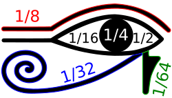
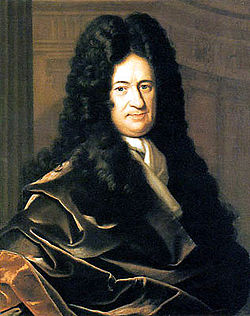
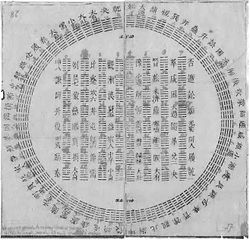
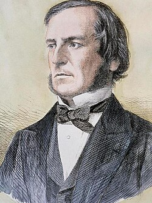

# 二进制｜精选补充资料

> 来源：[维基百科（中文）](https://zh.wikipedia.org/wiki/%E4%BA%8C%E8%BF%9B%E5%88%B6)  
> 许可：[CC BY-SA 4.0](https://creativecommons.org/licenses/by-sa/4.0/)  
> 语言：简体中文  
> 获取时间：2026-08-08T09:43:33.349427+00:00

维基百科，自由的百科全书

**二進制**（英語：binary）在[數學](/wiki/%E6%95%B8%E5%AD%B8 "數學")和[數位電路](/wiki/%E6%95%B8%E4%BD%8D%E9%9B%BB%E8%B7%AF "數位電路")中指以2為[底数](/wiki/%E5%BA%95%E6%95%B0_(%E8%BF%9B%E5%88%B6) "底数 (进制)")的記數系統，以2為基數代表系統是二進位制的。這一系統中，通常用兩個不同的數字0和1來表示。數字[電子電路](/wiki/%E9%9B%BB%E5%AD%90%E9%9B%BB%E8%B7%AF "電子電路")中，[邏輯門](/wiki/%E9%82%8F%E8%BC%AF%E9%96%80 "邏輯門")直接採用了二進制，因此現代的計算機和依赖[計算機](/wiki/%E7%94%B5%E5%AD%90%E8%AE%A1%E7%AE%97%E6%9C%BA "电子计算机")的設備裡都用到二進制。每個數字稱為一個[位元](/wiki/%E4%BD%8D%E5%85%83 "位元")（二進制位）或[比特](/wiki/%E4%BD%8D%E5%85%83 "位元")（Bit，Binary digit 的縮寫）。

## 历史

现代的二进制记数系统由[戈特弗里德·莱布尼茨](/wiki/%E6%88%88%E7%89%B9%E5%BC%97%E9%87%8C%E5%BE%B7%C2%B7%E8%8E%B1%E5%B8%83%E5%B0%BC%E8%8C%A8 "戈特弗里德·莱布尼茨")于1679年设计，在他1703年发表的文章《[论只使用符号0和1的二进制算术](/wiki/%E8%AE%BA%E5%8F%AA%E4%BD%BF%E7%94%A8%E7%AC%A6%E5%8F%B70%E5%92%8C1%E7%9A%84%E4%BA%8C%E8%BF%9B%E5%88%B6%E7%AE%97%E6%9C%AF "论只使用符号0和1的二进制算术")，兼论其用途及它赋予伏羲所使用的古老图形的意义》出现。与二进制数相关的系统在一些更早的文化中也有出现，包括古代的[埃及](/wiki/%E5%8F%A4%E5%9F%83%E5%8F%8A "古埃及")、[中國](/wiki/%E4%B8%AD%E5%9B%BD%E5%8E%86%E5%8F%B2 "中国历史")、[印度](/wiki/%E5%8D%B0%E5%BA%A6%E6%B2%B3%E6%B5%81%E5%9F%9F%E6%96%87%E6%98%8E "印度河流域文明")以及[太平洋島原住民](/wiki/%E5%A4%AA%E5%B9%B3%E6%B4%8B%E5%B3%B6%E5%8E%9F%E4%BD%8F%E6%B0%91 "太平洋島原住民")文明。其中，古代中国的《[易经](/wiki/%E6%98%93%E7%BB%8F "易经")》尤其引起了莱布尼茨的联想。

[](/wiki/File:Eye_of_Ra_(fractions).svg)

荷鲁斯之眼各部分所代表的算术值

### 埃及

[古埃及](/wiki/%E5%8F%A4%E5%9F%83%E5%8F%8A "古埃及")的计数员使用两种不同的系统表示分数，一是埃及分数（与二进制记数系统无关），二是[荷鲁斯之眼](/wiki/%E8%8D%B7%E9%B2%81%E6%96%AF%E4%B9%8B%E7%9C%BC "荷鲁斯之眼")分数（叫这个名字是因为很多数学史家相信这个系统所采用的符号可以排列成荷鲁斯之眼，但这一点有争议）。荷鲁斯之眼分数是用来表示分数数量的谷物、液体等的二进制记数系统，在这一系统下，以赫卡特为单位的分数值表示成1/2、1/4、1/8、1/16、1/32和1/64等二进制分数的和。 这一系统的早期形式可以在埃及第五王朝（约公元前2400年）的档案中找到，而发展完备的象形文字形式可追溯到埃及第十九王朝（约公元前1200年）。
古埃及做乘法的方式也与二进制数密切相关，约公元前1650年的[莱因德数学纸草书](/wiki/%E8%8E%B1%E5%9B%A0%E5%BE%B7%E6%95%B0%E5%AD%A6%E7%BA%B8%E8%8D%89%E4%B9%A6 "莱因德数学纸草书")中就能看到。这一计算方法中，要把1和乘数不断翻倍，按被乘数的二进制表示从左列选出相应的2的幂次，并将右列的数相加。

### 印度

印度学者平甲拉（公元前两世纪左右）通过二进制方法来研究韵律诗。他的二进制中用到的是长短音节（一个长音节相当于两个短音节），有些像[摩尔斯电码](/wiki/%E6%91%A9%E5%B0%94%E6%96%AF%E7%94%B5%E7%A0%81 "摩尔斯电码")。与西方的位置表示法不同，平甲拉的系统中，二进制是从右往左书写的。

### 太平洋島原住民文明

在[法屬玻里尼西亞](/wiki/%E6%B3%95%E5%B1%AC%E7%8E%BB%E9%87%8C%E5%B0%BC%E8%A5%BF%E4%BA%9E "法屬玻里尼西亞")的曼格雷哇島，挪威卑爾根大學的人類學家Andrea Bender和Sieghard Beller發現，在曼格雷哇人的語言上，存在著一個似乎混合了十進位和二進位的數學系統。它先於西方幾個世紀，為首個在歐亞大陸之外發展出的二進位算法。

### 莱布尼茨前的西方先驱

1605年，[弗朗西斯·培根](/wiki/%E5%BC%97%E6%9C%97%E8%A5%BF%E6%96%AF%C2%B7%E5%9F%B9%E6%A0%B9 "弗朗西斯·培根")提出了一套系统，可以把26个字母化为二进制数。此外他补充道，这个思路可以用于任何事物：“只要这些事物的差异是简单对立的，比如铃铛和喇叭，灯光和手电筒，以及火枪和类似武器的射击声”。这对二进制编码的一般理论有重要意义。（参见[培根密码](/wiki/%E5%9F%B9%E6%A0%B9%E5%AF%86%E7%A2%BC "培根密碼")）

1617年，蘇格蘭數學家[約翰納皮爾](/wiki/%E7%B4%84%E7%BF%B0%E7%B4%8D%E7%9A%AE%E7%88%BE "約翰納皮爾")在其著作《Rabdologiae》（意為「籌算學」）描述了三類計算系統。其中，第六章描述了一種可以在方格棋盤上操作的二進制籌算方法。後世有學者評價此為「使用二進制算術作為計算輔助工具的開創性示例」、「在納皮爾乏人問津的棋盤計算器中，埋藏著二進制數字系統最早期的應用之一」。

### 莱布尼茨和中国的《易经》

[](/wiki/File:Gottfried_Wilhelm_von_Leibniz.jpg)

戈特弗里德·莱布尼兹

莱布尼茨关于二进制的论文全名是《[论只使用符号0和1的二进制算术，兼论其用途及它赋予伏羲所使用的古老图形的意义](/wiki/%E8%AE%BA%E5%8F%AA%E4%BD%BF%E7%94%A8%E7%AC%A6%E5%8F%B70%E5%92%8C1%E7%9A%84%E4%BA%8C%E8%BF%9B%E5%88%B6%E7%AE%97%E6%9C%AF "论只使用符号0和1的二进制算术")》（1703年）。类似于现代二进制计数系统，莱布尼兹的系统使用0和1。下面是莱布尼兹的二进制记数系统的一个例子：

* 0 0 0 1 数值为


  2

  0
  {\displaystyle 2^{0}}
  ${\displaystyle 2^{0}}$
* 0 0 1 0 数值为


  2

  1
  {\displaystyle 2^{1}}
  ${\displaystyle 2^{1}}$
* 0 1 0 0 数值为


  2

  2
  {\displaystyle 2^{2}}
  ${\displaystyle 2^{2}}$
* 1 0 0 0 数值为


  2

  3
  {\displaystyle 2^{3}}
  ${\displaystyle 2^{3}}$

[](/wiki/File:Diagram_of_I_Ching_hexagrams_owned_by_Gottfried_Wilhelm_Leibniz,_1701.jpg)

伏羲先天六十四卦〈方圓四分四層圖〉（1701年[莱布尼茨](/wiki/%E6%88%88%E7%89%B9%E5%BC%97%E9%87%8C%E5%BE%B7%C2%B7%E8%8E%B1%E5%B8%83%E5%B0%BC%E8%8C%A8 "戈特弗里德·莱布尼茨")得自[白晋](/wiki/%E7%99%BD%E6%99%8B "白晋")的圖文，時為清康熙四十年）

莱布尼兹认为易经中的卦象与二进制算术密不可分。莱布尼兹解读了易经中的卦象，并认为这是其作为二进制算术的证据。作为[亲华派](/wiki/%E8%A6%AA%E8%8F%AF%E6%B4%BE "親華派")，莱布尼兹关注易经，并饶有兴致地注意到它的卦象与从0到111111的二进制数字有某种对应，并认为这种对应反映了中国的重大成就中展现的他所崇尚的数学哲学。莱布尼兹首次接触到易经是在与法国耶稣会传教士白晋的联系中。白晋1685年作为传教士前往中国。

长期以来，人们对莱布尼茨发明二进制是否受到了伏羲八卦的影响争议颇多。认为莱布尼茨未受伏羲八卦影响独立发明二进制的理由主要是莱布尼茨在1679年（与白晋首次通信的二十多年）就撰写了“二的级数”（De Progressione Dyadica）一文，郭书春在《古代世界数学泰斗刘徽》一书461页指出：“中国有所谓《周易》创造了二进制的说法，至于[莱布尼茨](/wiki/%E6%88%88%E7%89%B9%E5%BC%97%E9%87%8C%E5%BE%B7%C2%B7%E5%A8%81%E5%BB%89%C2%B7%E8%8E%B1%E5%B8%83%E5%B0%BC%E8%8C%A8 "戈特弗里德·威廉·莱布尼茨")受《周易》八卦的影响创造二进制并用于计算机的传说，更是广为流传。事实是，莱布尼兹先发明了二进制，后来才看到传教士带回的宋代学者重新编排的《周易》八卦，并发现八卦可以用他的二进制来解释。”因此，并不是[莱布尼茨](/wiki/%E8%8E%B1%E5%B8%83%E5%B0%BC%E8%8C%A8 "莱布尼茨")看到阴阳八卦才发明二进制。[梁宗](/w/index.php?title=%E6%A2%81%E5%AE%97&action=edit&redlink=1 "梁宗（页面不存在）")巨著《数学历史典故》一书14～18页对这一历史公案有更加详尽考察。；而目前有学者倾向于认为莱布尼茨二进制的体系确源于伏羲八卦图，莱布尼茨还阅读过1660年斯比赛尔出版的《中国文史评析》，其中亦有对《易经》和八卦的介绍。
莱布尼兹认为易经的卦象肯定了他所信仰的基督教的[共相](/wiki/%E5%85%B1%E7%9B%B8 "共相")。一切数都可以用0和1创造出来，在莱布尼兹看来，这正象征了基督教《圣经》所说的上帝从“无”创造“有”（creatio ex nihilo）。

> （有一个概念）不容易传授给异教徒：全能的上帝从无创造有。现在我们可以说，数字的起源是世上能最好展示和说明这种力量的事物，它以“一”和“零”或者说“无”的形式呈现，既朴素又简练。
>
> ——莱布尼茨写给鲁道夫·奥古斯都公爵的信

### 后来的发展

[](/wiki/File:George_Boole_color.jpg)

乔治·布尔

1854年，英国数学家[乔治·布尔](/wiki/%E4%B9%94%E6%B2%BB%C2%B7%E5%B8%83%E5%B0%94 "乔治·布尔")发表了一篇里程碑式的论文，其中详细介绍了一种[代数](/wiki/%E4%BB%A3%E6%95%B0 "代数")化的逻辑系统，后人称之为[布尔代数](/wiki/%E9%80%BB%E8%BE%91%E4%BB%A3%E6%95%B0 "逻辑代数")。他提出的逻辑演算在后来的电子电路设计中起基础性作用。

1937年，[克劳德·香农](/wiki/%E5%85%8B%E5%8A%B3%E5%BE%B7%C2%B7%E9%A6%99%E5%86%9C "克劳德·香农")在[麻省理工大学](/wiki/%E9%BA%BB%E7%9C%81%E7%90%86%E5%B7%A5%E5%A4%A7%E5%AD%A6 "麻省理工大学")完成了其电气工程硕士学位论文，用继电器和开关实现了布尔代数和二进制算术运算。论文题为《继电器与开关电路的符号分析》（A Symbolic Analysis of Relay and Switching Circuits），其中香农的理论奠定了数字电路的理论基础。香农凭这篇论文于1940年被授予美国阿尔弗雷德·诺贝尔协会美国工程师奖。哈佛大学的哈沃德·加德纳称，香农的硕士论文“可能是本世纪最重要、最著名的硕士学位论文”。

1937年11月，任职于[贝尔实验室](/wiki/%E8%B4%9D%E5%B0%94%E5%AE%9E%E9%AA%8C%E5%AE%A4 "贝尔实验室")的乔治·斯蒂比兹发明了用继电器表示二进制的装置。它是第一台二进制电子计算机。

## 运算规则

### 四则运算

* [加法](/wiki/%E5%8A%A0%E6%B3%95 "加法")：0+0＝0，0+1＝1，1+0＝1，1+1＝10
* [减法](/wiki/%E5%87%8F%E6%B3%95 "减法")：0－0＝0，1－0＝1，1－1＝0，10－1＝1
* [乘法](/wiki/%E4%B9%98%E6%B3%95 "乘法")：0×0＝0，0×1＝0，1×0＝0，1×1＝1
* [除法](/wiki/%E9%99%A4%E6%B3%95 "除法")：0÷1＝0，1÷1＝1

### 拈加法

主条目：[逻辑异或](/wiki/%E9%80%BB%E8%BE%91%E5%BC%82%E6%88%96 "逻辑异或")和[拈](/wiki/%E6%8B%88 "拈")

二進制的一種特殊的算法，稱為拈加法。進行拈加法時，與進行加法無異，只是不需進行進位，即是逐位[XOR](/wiki/XOR "XOR")。與博弈论的關係，見[尼姆游戏 § 數學理論](/wiki/%E5%B0%BC%E5%A7%86%E6%B8%B8%E6%88%8F#數學理論 "尼姆游戏")。

## 不同進位數转换

### 十进制化为二进制

整数部分，把十进制转成二进制一直分解至[商數](/wiki/%E5%95%86%E6%95%B8 "商數")為0。讀餘數從下讀到上，即是二進位的整數部分數字。

小数部分，则用其乘2，取其整数部分的结果，再用计算后的小数部分依此重复计算，算到小数部分全为0为止，之后读所有计算后整数部分的数字，从上讀到下。

將59.25(10) 轉成二進制：

1. 整数部分：

   ```
   59 ÷ 2 = 29 ... 1
   29 ÷ 2 = 14 ... 1
   14 ÷ 2 =  7 ... 0
    7 ÷ 2 =  3 ... 1
    3 ÷ 2 =  1 ... 1
    1 ÷ 2 =  0 ... 1
   ```
2. 小数部分：

   ```
   0.25 × 2 = 0.5 ... 0
   0.50 × 2 = 1.0 ... 1
   ```

所以：


59.25

(
10
)
=

111011.01

(
2
)
{\displaystyle 59.25\_{(10)}=111011.01\_{(2)}}
${\displaystyle 59.25\_{(10)}=111011.01\_{(2)}}$

也可以公式来计算：

```
           59.2510 = 101*10101+1001*10100+10*1010−1+101*1010−2
                   = 101*1010+1001+10/1010+101/1010/1010
                   = 110010+1001+(10+0.1)/1010
                   = 111011+0.01
                   = 111011.01
```

### 二进制化为十进制

将1001012转换为十进制形式如下：

:   1001012 = [ ( **1** ) × 25 ] + [ ( **0** ) × 24 ] + [ ( **0** ) × 23 ] + [ ( **1** ) × 22 ] + [ ( **0** ) × 2 ] + [ ( **1** ) × 1 ]
:   1001012 = [ **1** × 32 ] + [ **0** × 16 ] + [ **0** × 8 ] + [ **1** × 4 ] + [ **0** × 2 ] + [ **1** × 1 ]
:   **1001012 = 3710**

| 十進制 | 0 | 1 | 2 | 3 | 4 | 5 | 6 | 7 | 8 | 9 | 10 |
| --- | --- | --- | --- | --- | --- | --- | --- | --- | --- | --- | --- |
| 二進制 | 0 | 1 | 10 | 11 | 100 | 101 | 110 | 111 | 1000 | 1001 | 1010 |
| 十進制 | 11 | 12 | 13 | 14 | 15 | 16 | 17 | 18 | 19 | 20 | 21 |
| 二進制 | 1011 | 1100 | 1101 | 1110 | 1111 | 10000 | 10001 | 10010 | 10011 | 10100 | 10101 |
| 十進制 | 22 | 23 | 24 | 25 | 26 | 27 | 28 | 29 | 30 | 31 | 32 |
| 二進制 | 10110 | 10111 | 11000 | 11001 | 11010 | 11011 | 11100 | 11101 | 11110 | 11111 | 100000 |
| 十進制 | 33 | 34 | 35 | 36 | 37 | 38 | 39 | 40 | 41 | 42 | 43 |
| 二進制 | 100001 | 100010 | 100011 | 100100 | 100101 | 100110 | 100111 | 101000 | 101001 | 101010 | 101011 |

### 二进制化为八进制

把二进制化为八进制也不是很难，因为八进制以8为基数，8是2的幂（8=23），因此八进制的一位恰好需要三个二进制位来表示。八进制与二进制数之间的对应就是上面表格中十六进制的前八个数。二进制数000就是八进制数0，二进制数111就是八进制数7，以此类推。

| 八进制 | 二进制 |
| --- | --- |
| 0 | 000 |
| 1 | 001 |
| 2 | 010 |
| 3 | 011 |
| 4 | 100 |
| 5 | 101 |
| 6 | 110 |
| 7 | 111 |

八进制转为二进制：

* 658 = 110 1012
* 178 = 001 1112

二进制转八进制：

* 1011002 = 101 1002 （三位一组） = 548
* 100112 = 010 0112 （用零[填充 (密码学)](/wiki/%E5%A1%AB%E5%85%85_(%E5%AF%86%E7%A0%81%E5%AD%A6) "填充 (密码学)")，三位一组） = 238

### 八进制化为十进制

遵循二进制化为十进制的方法即可。所不同的是每一位乘上一个底数为8的[幂](/wiki/%E5%B9%82 "幂")。

* 658 = (6 × 81) + (5 × 80) = (6 × 8) + (5 × 1) = 5310
* 1278 = (1 × 82) + (2 × 81) + (7 × 80) = (1 × 64) + (2 × 8) + (7 × 1) = 8710

## 表示实数

非整数可以借负指数幂表示；只要用基数点（十进制中，就是小数点）把负指数幂表示的部分隔开即可。例如，二进制数11.012：

:   |  |  |  |
    | --- | --- | --- |
    | **1** × 21 | (1 × 2 = **2**) | 加 |
    | **1** × 20 | (1 × 1 = **1**) | 加 |
    | **0** × 2−1 | (0 × 1⁄2 = **0**) | 加 |
    | **1** × 2−2 | (1 × 1⁄4 = **0.25**) |

就是十进制数字3.25。

所有[二进分数](/wiki/%E4%BA%8C%E8%BF%9B%E5%88%86%E6%95%B0 "二进分数")


p

2

a
{\displaystyle {\frac {p}{2^{a}}}}
${\displaystyle {\frac {p}{2^{a}}}}$都对应一个“有穷”二进制数字——这一二进制表示的小数部分位数有限。其他有理数也有二进制表示，但不是有穷的，而是出现循环，即某个有限序列出现无数次。例如

:   1

    10

    3

    10
    {\displaystyle {\frac {1\_{10}}{3\_{10}}}}
    ${\displaystyle {\frac {1\_{10}}{3\_{10}}}}$ = 


    1

    2

    11

    2
    {\displaystyle {\frac {1\_{2}}{11\_{2}}}}
    ${\displaystyle {\frac {1\_{2}}{11\_{2}}}}$ = 0.0101010101…2

:   12

    10

    17

    10
    {\displaystyle {\frac {12\_{10}}{17\_{10}}}}
    ${\displaystyle {\frac {12\_{10}}{17\_{10}}}}$ = 


    1100

    2

    10001

    2
    {\displaystyle {\frac {1100\_{2}}{10001\_{2}}}}
    ${\displaystyle {\frac {1100\_{2}}{10001\_{2}}}}$ = 0.10110100 10110100 10110100...2

在其他基数的计数系统中，有理数的表示也是有穷或循环的。另一相似之处在于，如果我们有一个有穷表示，那么它还会有其他的表示方式，例如几何级数2−1 + 2−2 + 2−3 + ...的和既是1，也是0.111111...。

无限不循环二进制小数表示的是[无理数](/wiki/%E6%97%A0%E7%90%86%E6%95%B0 "无理数")。例如，

* 0.101001000100001000001000000...有某种模式，但循环节长度不固定，所以是无理数。這個數的數值為


  2

  −


  7
  8

  θ

  2

  (

  0
  ;


  2
  2
  )
  −
  1
  ≈
  0.64163256...
  {\displaystyle 2^{-{\tfrac {7}{8}}}\theta \_{2}\left(0;{\tfrac {\sqrt {2}}{2}}\right)-1\approx 0.64163256...}
  ${\displaystyle 2^{-{\tfrac {7}{8}}}\theta \_{2}\left(0;{\tfrac {\sqrt {2}}{2}}\right)-1\approx 0.64163256...}$，其中


  θ

  2
  {\displaystyle \theta \_{2}}
  ${\displaystyle \theta \_{2}}$為[Θ函數](/wiki/%CE%98%E5%87%BD%E6%95%B8 "Θ函數")。
* 1.0110101000001001111001100110011111110...是2的平方根


  2
  {\displaystyle {\sqrt {2}}}
  ${\displaystyle {\sqrt {2}}}$的二进制表示，也是一个无理数。它没有可以看出的模式。参见[无理数](/wiki/%E6%97%A0%E7%90%86%E6%95%B0 "无理数")。

1. **[^](#cite_ref-1)** [binary](https://terms.naer.edu.tw/detail/79a86f13bf0d47aa1de46b168524d83d/?startswith=zh&seq=1). 樂詞網. [國家教育研究院](/wiki/%E5%9C%8B%E5%AE%B6%E6%95%99%E8%82%B2%E7%A0%94%E7%A9%B6%E9%99%A2 "國家教育研究院") （中文（臺灣））.
2. **[^](#cite_ref-2)** [binary](https://www.termonline.cn/wordDetail?subject=4fd1a1b626b111ee8685b068e6519520&base=1). [术语在线](/wiki/%E6%9C%AF%E8%AF%AD%E5%9C%A8%E7%BA%BF "术语在线"). [全国科学技术名词审定委员会](/wiki/%E5%85%A8%E5%9B%BD%E7%A7%91%E5%AD%A6%E6%8A%80%E6%9C%AF%E5%90%8D%E8%AF%8D%E5%AE%A1%E5%AE%9A%E5%A7%94%E5%91%98%E4%BC%9A "全国科学技术名词审定委员会").  （简体中文）
3. **[^](#cite_ref-3)** 法语：Explication de l'arithmétique binaire, qui se sert des seuls caractères 0 et 1 avec des remarques sur son utilité et sur ce qu'elle donne le sens des anciennes figures chinoises de Fohy
4. **[^](#cite_ref-4)** [没有乘法口诀表将会怎样：古巴比伦乘法和古埃及乘法. Matrix67的博客](http://www.matrix67.com/blog/archives/360).  [2016-07-08]. （原始内容[存档](https://web.archive.org/web/20200815080555/http://www.matrix67.com/blog/archives/360)于2020-08-15）.
5. **[^](#cite_ref-5)** Sanchez, Julio; Canton, Maria P. Microcontroller programming: the microchip PIC. Boca Raton, Florida: CRC Press. 2007: 37. [ISBN 978-0-8493-7189-9](/wiki/Special:BookSources/978-0-8493-7189-9 "Special:BookSources/978-0-8493-7189-9").
6. **[^](#cite_ref-6)** [Stakhov, Alexey](/w/index.php?title=Alexey_Stakhov&action=edit&redlink=1 "Alexey Stakhov（页面不存在）"); Olsen, Scott Anthony. [The mathematics of harmony: from Euclid to contemporary mathematics and computer science](https://books.google.com/books?id=K6fac9RxXREC). 2009. [ISBN 978-981-277-582-5](/wiki/Special:BookSources/978-981-277-582-5 "Special:BookSources/978-981-277-582-5").
7. **[^](#cite_ref-7)** Bender, Andrea; Beller, Sieghard. [Mangarevan invention of binary steps for easier calculation](//www.ncbi.nlm.nih.gov/pmc/articles/PMC3910603). Proceedings of the National Academy of Sciences. 16 December 2013, **111** (4): 1322–1327. [PMC 3910603](//www.ncbi.nlm.nih.gov/pmc/articles/PMC3910603) . [PMID 24344278](//www.ncbi.nlm.nih.gov/pubmed/24344278). [doi:10.1073/pnas.1309160110](https://doi.org/10.1073%2Fpnas.1309160110) .
8. **[^](#cite_ref-8)** [Bacon, Francis](/wiki/Francis_Bacon "Francis Bacon"). [The Advancement of Learning](http://home.hiwaay.net/~paul/bacon/advancement/book6ch1.html). London: Chapter 1. 1605  [2022-12-07]. （原始内容[存档](https://web.archive.org/web/20170318232428/http://home.hiwaay.net/~paul/bacon/advancement/book6ch1.html)于2017-03-18）.
9. **[^](#cite_ref-9)** [Napier, John](/wiki/%E7%B4%84%E7%BF%B0%C2%B7%E7%B4%8D%E7%9A%AE%E7%88%BE "約翰·納皮爾"). [Rabdologiæ [籌算學]](https://archive.org/details/rabdologiaseunu00napi). Edinburgi: A. Hart. 1617  [2026-02-09] –通过Internet Archive （拉丁语）.
10. **[^](#cite_ref-kolpas2018_10-0)** Kolpas, Sidney J.; Tomash, Erwin (December 2018). "John Napier's Binary Chessboard Calculator - Napier's 'Rabdologiae'". *Convergence*. Mathematical Association of America. <https://old.maa.org/press/periodicals/convergence/john-napiers-binary-chessboard-calculator-napiers-rabdologiae>
11. **[^](#cite_ref-rider1990_11-0)** Napier, John (1990) [1617]. *Rabdology*. Translated by William Frank Richardson. Introduction by Robin E. Rider. MIT Press. p. xxiii. [ISBN 0-262-14046-2](/wiki/Special:BookSources/0262140462)
12. **[^](#cite_ref-12)** [数学科普：常识性谬误令人忧](http://my.hoopchina.com/book/blog/2460513.html).  [2011-05-10]. （原始内容[存档](https://web.archive.org/web/20111219141903/http://my.hoopchina.com/book/blog/2460513.html)于2011-12-19）.
13. **[^](#cite_ref-13)** 参见：莱布尼茨二进制与伏羲八卦图考.胡阳，李长铎.上海：上海人民出版社.2006.[google book](https://books.google.com/books/about/%E8%8E%B1%E5%B8%83%E5%B0%BC%E8%8C%A8%E4%BA%8C%E8%BF%9B%E5%88%B6%E4%B8%8E%E4%BC%8F%E7%BE%B2%E5%85%AB%E5%8D%A6%E5%9B%BE.html?id=Ae2AAAAAIAAJ) （[页面存档备份](//web.archive.org/web/20201116041043/https://books.google.com/books/about/%E8%8E%B1%E5%B8%83%E5%B0%BC%E8%8C%A8%E4%BA%8C%E8%BF%9B%E5%88%B6%E4%B8%8E%E4%BC%8F%E7%BE%B2%E5%85%AB%E5%8D%A6%E5%9B%BE.html?id=Ae2AAAAAIAAJ)，存于[互联网档案馆](/wiki/%E4%BA%92%E8%81%94%E7%BD%91%E6%A1%A3%E6%A1%88%E9%A6%86 "互联网档案馆")）
14. ^ [**14.0**](#cite_ref-smith_14-0) [**14.1**](#cite_ref-smith_14-1) J.E.H. Smith. [Leibniz: What Kind of Rationalist?](https://books.google.com/books?id=Da_oP3sJs1oC&pg=PA4153). Springer. 2008: 415  [2016-07-14]. [ISBN 978-1-4020-8668-7](/wiki/Special:BookSources/978-1-4020-8668-7 "Special:BookSources/978-1-4020-8668-7"). （原始内容[存档](https://web.archive.org/web/20200727112201/https://books.google.com/books?id=Da_oP3sJs1oC&pg=PA4153)于2020-07-27）.
15. **[^](#cite_ref-15)** Boole, George. [An Investigation of the Laws of Thought on Which are Founded the Mathematical Theories of Logic and Probabilities](http://www.gutenberg.org/etext/15114) Macmillan, Dover Publications, reprinted with corrections [1958]. New York: Cambridge University Press. 2009 [1854]  [2016-07-14]. [ISBN 978-1-108-00153-3](/wiki/Special:BookSources/978-1-108-00153-3 "Special:BookSources/978-1-108-00153-3"). （原始内容[存档](https://web.archive.org/web/20100528151044/http://www.gutenberg.org/etext/15114)于2010-05-28）.
16. **[^](#cite_ref-16)** Shannon, Claude Elwood. [A symbolic analysis of relay and switching circuits](http://hdl.handle.net/1721.1/11173). Cambridge: Massachusetts Institute of Technology. 1940  [2016-07-14]. （原始内容[存档](https://web.archive.org/web/20080704154717/http://hdl.handle.net/1721.1/11173)于2008-07-04）.
17. **[^](#cite_ref-17)** 乔治·斯蒂比兹（George Stibitz ，1904-1995），美国，“数字计算机之父”。参见维基英文条目：[George\_Stibitz](/w/index.php?title=George_Stibitz&action=edit&redlink=1 "George Stibitz（页面不存在）")（英语：[George Stibitz](https://en.wikipedia.org/wiki/George_Stibitz "en:George Stibitz")） （[页面存档备份](//web.archive.org/web/20201204065529/https://en.wikipedia.org/wiki/George_Stibitz)，存于[互联网档案馆](/wiki/%E4%BA%92%E8%81%94%E7%BD%91%E6%A1%A3%E6%A1%88%E9%A6%86 "互联网档案馆")）
18. **[^](#cite_ref-18)** M Morris Mano; Michael D Ciletti. *Digital design : with an introduction to the verilog hdl*. [培生教育](/wiki/%E5%9F%B9%E7%94%9F%E6%95%99%E8%82%B2 "培生教育"). 2013: 第22頁. [ISBN 9780273764526](/wiki/Special:BookSources/9780273764526 "Special:BookSources/9780273764526").
19. **[^](#cite_ref-19)** [Sloane, N.J.A.](/wiki/Neil_Sloane "Neil Sloane") (编). [Sequence A190404 (Decimal expansion of 


    ∑

    k
    >=
    1
    (
    1

    /
    2

    )

    T
    (
    k
    )
    ,

    {\textstyle \sum \_{k>=1}(1/2)^{T(k)},\,}
    ${\textstyle \sum \_{k>=1}(1/2)^{T(k)},\,}$ where T=A000217 (triangular numbers))](https://oeis.org/A190404). The [On-Line Encyclopedia of Integer Sequences](/wiki/On-Line_Encyclopedia_of_Integer_Sequences "On-Line Encyclopedia of Integer Sequences"). OEIS Foundation.

[分类](/wiki/Special:Categories "Special:Categories")：​

* [进位制](/wiki/Category:%E8%BF%9B%E4%BD%8D%E5%88%B6 "Category:进位制")
* [計算機算術](/wiki/Category:%E8%A8%88%E7%AE%97%E6%A9%9F%E7%AE%97%E8%A1%93 "Category:計算機算術")
* [算术](/wiki/Category:%E7%AE%97%E6%9C%AF "Category:算术")
* [戈特弗里德·萊布尼茨](/wiki/Category:%E6%88%88%E7%89%B9%E5%BC%97%E9%87%8C%E5%BE%B7%C2%B7%E8%90%8A%E5%B8%83%E5%B0%BC%E8%8C%A8 "Category:戈特弗里德·萊布尼茨")
* [二进制算术](/wiki/Category:%E4%BA%8C%E8%BF%9B%E5%88%B6%E7%AE%97%E6%9C%AF "Category:二进制算术")
* [二分法](/wiki/Category:%E4%BA%8C%E5%88%86%E6%B3%95 "Category:二分法")

隐藏分类：​

* [CS1拉丁语来源 (la)](/wiki/Category:CS1%E6%8B%89%E4%B8%81%E8%AF%AD%E6%9D%A5%E6%BA%90_(la) "Category:CS1拉丁语来源 (la)")
* [使用ISBN魔术链接的页面](/wiki/Category:%E4%BD%BF%E7%94%A8ISBN%E9%AD%94%E6%9C%AF%E9%93%BE%E6%8E%A5%E7%9A%84%E9%A1%B5%E9%9D%A2 "Category:使用ISBN魔术链接的页面")
* [需要從英語維基百科翻譯的條目](/wiki/Category:%E9%9C%80%E8%A6%81%E5%BE%9E%E8%8B%B1%E8%AA%9E%E7%B6%AD%E5%9F%BA%E7%99%BE%E7%A7%91%E7%BF%BB%E8%AD%AF%E7%9A%84%E6%A2%9D%E7%9B%AE "Category:需要從英語維基百科翻譯的條目")
* [含有英語的條目](/wiki/Category:%E5%90%AB%E6%9C%89%E8%8B%B1%E8%AA%9E%E7%9A%84%E6%A2%9D%E7%9B%AE "Category:含有英語的條目")
* [包含GND标识符的维基百科条目](/wiki/Category:%E5%8C%85%E5%90%ABGND%E6%A0%87%E8%AF%86%E7%AC%A6%E7%9A%84%E7%BB%B4%E5%9F%BA%E7%99%BE%E7%A7%91%E6%9D%A1%E7%9B%AE "Category:包含GND标识符的维基百科条目")
* [包含NDL标识符的维基百科条目](/wiki/Category:%E5%8C%85%E5%90%ABNDL%E6%A0%87%E8%AF%86%E7%AC%A6%E7%9A%84%E7%BB%B4%E5%9F%BA%E7%99%BE%E7%A7%91%E6%9D%A1%E7%9B%AE "Category:包含NDL标识符的维基百科条目")
