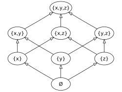

# 布尔代数｜精选补充资料

> 来源：[维基百科（中文）](https://zh.wikipedia.org/wiki/%E5%B8%83%E5%B0%94%E4%BB%A3%E6%95%B0)  
> 许可：[CC BY-SA 4.0](https://creativecommons.org/licenses/by-sa/4.0/)  
> 语言：简体中文  
> 获取时间：2026-08-08T09:43:36.586042+00:00

维基百科，自由的百科全书

此條目介紹的是一種代数结构。关于相关的數學分支，请见「**[邏輯代數](/wiki/%E9%82%8F%E8%BC%AF%E4%BB%A3%E6%95%B8 "邏輯代數")**」。

**布尔代数**（英語：Boolean algebra）在[抽象代数](/wiki/%E6%8A%BD%E8%B1%A1%E4%BB%A3%E6%95%B0 "抽象代数")中是指捕获了[集合](/wiki/%E9%9B%86%E5%90%88_(%E6%95%B0%E5%AD%A6) "集合 (数学)")运算和[逻辑](/wiki/%E9%80%BB%E8%BE%91 "逻辑")运算二者的根本性质的一个[代数结构](/wiki/%E4%BB%A3%E6%95%B0%E7%BB%93%E6%9E%84 "代数结构")（就是说一组元素和服从定义的[公理](/wiki/%E5%85%AC%E7%90%86 "公理")的在这些元素上运算）。特别是，它处理[集合](/wiki/%E9%9B%86%E5%90%88_(%E6%95%B0%E5%AD%A6) "集合 (数学)")运算[交集](/wiki/%E4%BA%A4%E9%9B%86 "交集")、[并集](/wiki/%E5%B9%B6%E9%9B%86 "并集")、[补集](/wiki/%E8%A1%A5%E9%9B%86 "补集")；和[逻辑](/wiki/%E9%80%BB%E8%BE%91 "逻辑")运算[与](/wiki/%E9%80%BB%E8%BE%91%E5%90%88%E5%8F%96 "逻辑合取")、[或](/wiki/%E9%80%BB%E8%BE%91%E6%9E%90%E5%8F%96 "逻辑析取")、[非](/wiki/%E9%80%BB%E8%BE%91%E5%90%A6%E5%AE%9A "逻辑否定")。

子集的布尔格的[哈斯圖](/wiki/%E5%93%88%E6%96%AF%E5%9C%96 "哈斯圖")

例如，逻辑断言[陈述](/wiki/%E5%91%BD%E9%A2%98 "命题") 

a
{\displaystyle a}
${\displaystyle a}$ 和它的否定 

¬
a
{\displaystyle \neg a}
${\displaystyle \neg a}$ 不能都同时为真，

:   a
    ∧
    (
    ¬
    a
    )
    =

    FALSE
    {\displaystyle a\land (\lnot a)={\mbox{FALSE}}}
    ${\displaystyle a\land (\lnot a)={\mbox{FALSE}}}$，

相似于集合论断言子集*A*和它的补集 

A

C
{\displaystyle A^{C}}
${\displaystyle A^{C}}$ 有空交集，

:   A
    ∩
    (

    A

    C
    )
    =
    ∅
    {\displaystyle A\cap (A^{C})=\varnothing }
    ${\displaystyle A\cap (A^{C})=\varnothing }$。

因为真值可以在[逻辑电路](/wiki/%E9%80%BB%E8%BE%91%E7%94%B5%E8%B7%AF "逻辑电路")中表示为[二进制](/wiki/%E4%BA%8C%E8%BF%9B%E5%88%B6 "二进制")数或电平，这种相似性同样扩展到它们，所以布尔代数在[电子工程](/wiki/%E7%94%B5%E5%AD%90%E5%B7%A5%E7%A8%8B "电子工程")和[计算机科学](/wiki/%E8%AE%A1%E7%AE%97%E6%9C%BA%E7%A7%91%E5%AD%A6 "计算机科学")中同在[数理逻辑](/wiki/%E6%95%B0%E7%90%86%E9%80%BB%E8%BE%91 "数理逻辑")中一样有很多实践应用。在电子工程领域专门化了的布尔代数也叫做[逻辑代数](/wiki/%E9%80%BB%E8%BE%91%E4%BB%A3%E6%95%B0 "逻辑代数")，在计算机科学领域专门化了布尔代数也叫做[布尔逻辑](/wiki/%E5%B8%83%E5%B0%94%E9%80%BB%E8%BE%91 "布尔逻辑")。

布尔代数也叫做**布尔格**。关联于[格](/wiki/%E6%A0%BC_(%E6%95%B0%E5%AD%A6) "格 (数学)")（特殊的[偏序集合](/wiki/%E5%81%8F%E5%BA%8F%E9%9B%86%E5%90%88 "偏序集合")）是在集合[包含](/wiki/%E5%AD%90%E9%9B%86 "子集") 

A
⊆
B
{\displaystyle A\subseteq B}
${\displaystyle A\subseteq B}$ 和[次序](/wiki/%E6%A0%BC_(%E6%95%B0%E5%AD%A6) "格 (数学)") 

a
≤
b
{\displaystyle a\leq b}
${\displaystyle a\leq b}$ 之间的相似所预示的。考虑 

{
x
,
y
,
z
}
{\displaystyle \{x,y,z\}}
${\displaystyle \{x,y,z\}}$ 的所有子集按照包含排序的格。这个布尔格是偏序集合，在其中 

{
x
}
≤
{
x
,
y
}
{\displaystyle \{x\}\leq \{x,y\}}
${\displaystyle \{x\}\leq \{x,y\}}$。任何两个格的元素，比如 

p
=
{
x
,
y
}
{\displaystyle p=\{x,y\}}
${\displaystyle p=\{x,y\}}$ 和 

q
=
{
y
,
z
}
{\displaystyle q=\{y,z\}}
${\displaystyle q=\{y,z\}}$，都有一个最小上界，这里是 

{
x
,
y
,
z
}
{\displaystyle \{x,y,z\}}
${\displaystyle \{x,y,z\}}$，和一个最大下界，这里是 

{
y
}
{\displaystyle \{y\}}
${\displaystyle \{y\}}$。这预示了最小上界（并或上确界）被表示为同逻辑OR一样的符号 

p
∨
q
{\displaystyle p\lor q}
${\displaystyle p\lor q}$；而最大下界（交或下确界）被表示为同逻辑AND一样的符号 

p
∧
q
{\displaystyle p\land q}
${\displaystyle p\land q}$。

这种格释义有助于一般化为[海廷代数](/wiki/%E6%B5%B7%E5%BB%B7%E4%BB%A3%E6%95%B0 "海廷代数")，它是免除要么一个陈述要么它的否定必须为真的限制的布尔代数。海廷代数对应于[直觉逻辑](/wiki/%E7%9B%B4%E8%A7%89%E9%80%BB%E8%BE%91 "直觉逻辑")，而布尔代数对应于[经典逻辑](/wiki/%E7%BB%8F%E5%85%B8%E9%80%BB%E8%BE%91 "经典逻辑")。

布尔代数又譯為**布林代数**。布尔代数得名于[乔治·布尔](/wiki/%E4%B9%94%E6%B2%BB%C2%B7%E5%B8%83%E5%B0%94 "乔治·布尔")，他是[爱尔兰](/wiki/%E7%88%B1%E5%B0%94%E5%85%B0 "爱尔兰")[科克](/wiki/%E7%A7%91%E5%85%8B_(%E7%88%B1%E5%B0%94%E5%85%B0) "科克 (爱尔兰)")的皇后学院的英国数学家。布林（boolean）在英文中的意思是「布尔的」，這是為了表彰布尔的貢獻，而「布林」只是一種音譯。

## 历史

术语“布尔代数”得名于[乔治·布尔](/wiki/%E4%B9%94%E6%B2%BB%C2%B7%E5%B8%83%E5%B0%94 "乔治·布尔")（1815–1864），他是自学成材的英国数学家。他最初在1847年出版的一个小册子《逻辑的数学分析》中介入了[代数逻辑](/wiki/%E4%BB%A3%E6%95%B0%E9%80%BB%E8%BE%91 "代数逻辑")系统，用来响应在[奥古斯都·德·摩根](/wiki/%E5%A5%A7%E5%8F%A4%E6%96%AF%E9%83%BD%C2%B7%E5%BE%B7%C2%B7%E6%91%A9%E6%A0%B9 "奧古斯都·德·摩根")和[William Hamilton](/w/index.php?title=Sir_William_Hamilton,_9th_Baronet&action=edit&redlink=1 "Sir William Hamilton, 9th Baronet（页面不存在）")之间的公开论战，后来又出现在1854年出版的更充实的书《思维规律》中。布尔的公式化在一些重要方面不同于上述描述。例如，布尔的合取和析取不是一对对偶的运算。布尔代数出现在1860年代[威廉姆·斯坦利·杰文斯](/wiki/%E5%A8%81%E5%BB%89%E5%A7%86%C2%B7%E6%96%AF%E5%9D%A6%E5%88%A9%C2%B7%E6%9D%B0%E6%96%87%E6%96%AF "威廉姆·斯坦利·杰文斯")和[查尔斯·皮尔士](/wiki/%E6%9F%A5%E5%B0%94%E6%96%AF%C2%B7%E7%9A%AE%E5%B0%94%E5%A3%AB "查尔斯·皮尔士")的论文中。到了1890年[Ernst Schröder](/w/index.php?title=Ernst_Schr%C3%B6der&action=edit&redlink=1 "Ernst Schröder（页面不存在）")写的《Vorlesungen》，我们才有了布尔代数和[分配格](/wiki/%E5%88%86%E9%85%8D%E6%A0%BC "分配格")的首次系统表述。首次用英语写的对布尔代数的广泛处置是[阿弗烈·诺夫·怀海德](/wiki/%E9%98%BF%E5%BC%97%E7%83%88%C2%B7%E8%AF%BA%E5%A4%AB%C2%B7%E6%80%80%E6%B5%B7%E5%BE%B7 "阿弗烈·诺夫·怀海德")在1898年的《泛代数》。在现代公理化意义上的作为公理化代数结构的布尔代数开始于[Edward Vermilye Huntington](/w/index.php?title=Edward_Vermilye_Huntington&action=edit&redlink=1 "Edward Vermilye Huntington（页面不存在）") 1904年的论文。布尔代数随着[Marshall Stone](/w/index.php?title=Marshall_Stone&action=edit&redlink=1 "Marshall Stone（页面不存在）")在1930年代的工作和[Garrett Birkhoff](/w/index.php?title=Garrett_Birkhoff&action=edit&redlink=1 "Garrett Birkhoff（页面不存在）")在1940年的《格理论》而进入了严肃数学时期。在1960年代，[Paul Cohen](/wiki/Paul_Cohen "Paul Cohen")、[Dana Scott](/wiki/Dana_Scott "Dana Scott")和其他人使用布尔代数的分支也就是[力迫](/wiki/%E5%8A%9B%E8%BF%AB_(%E6%95%B0%E5%AD%A6) "力迫 (数学)")和[布尔值模型](/wiki/%E5%B8%83%E5%B0%94%E5%80%BC%E6%A8%A1%E5%9E%8B "布尔值模型")，深入发现了[数理逻辑](/wiki/%E6%95%B0%E7%90%86%E9%80%BB%E8%BE%91 "数理逻辑")和[公理化集合论](/wiki/%E5%85%AC%E7%90%86%E5%8C%96%E9%9B%86%E5%90%88%E8%AE%BA "公理化集合论")中的新成果。

## 形式定义

**布尔代数**是一个[集合](/wiki/%E9%9B%86%E5%90%88_(%E6%95%B0%E5%AD%A6) "集合 (数学)") 

A
{\displaystyle A}
${\displaystyle A}$，其上定义了以下结构：

* 二元运算

  ∧
  {\displaystyle \land }
  ${\displaystyle \land }$：

  A
  ×
  A
  →
  A
  {\displaystyle A\times A\rightarrow A}
  ${\displaystyle A\times A\rightarrow A}$。
* 二元运算

  ∨
  {\displaystyle \lor }
  ${\displaystyle \lor }$：

  A
  ×
  A
  →
  A
  {\displaystyle A\times A\rightarrow A}
  ${\displaystyle A\times A\rightarrow A}$。
* 一元运算

  ¬
  {\displaystyle \lnot }
  ${\displaystyle \lnot }$：

  A
  →
  A
  {\displaystyle A\rightarrow A}
  ${\displaystyle A\rightarrow A}$。
* 零元运算（常数）0和1。

这些运算满足以下条件：

∀
a
,
b
,
c
∈
A
{\displaystyle \forall a,b,c\in A}
${\displaystyle \forall a,b,c\in A}$，

|  |  |  |
| --- | --- | --- |
| a ∨ ( b ∨ c ) = ( a ∨ b ) ∨ c {\displaystyle a\lor (b\lor c)=(a\lor b)\lor c} ${\displaystyle a\lor (b\lor c)=(a\lor b)\lor c}$ | a ∧ ( b ∧ c ) = ( a ∧ b ) ∧ c {\displaystyle a\land (b\land c)=(a\land b)\land c} ${\displaystyle a\land (b\land c)=(a\land b)\land c}$ | [结合律](/wiki/%E7%BB%93%E5%90%88%E5%BE%8B "结合律") |
| a ∨ b = b ∨ a {\displaystyle a\lor b=b\lor a} ${\displaystyle a\lor b=b\lor a}$ | a ∧ b = b ∧ a {\displaystyle a\land b=b\land a} ${\displaystyle a\land b=b\land a}$ | [交换律](/wiki/%E4%BA%A4%E6%8D%A2%E5%BE%8B "交换律") |
| a ∨ ( a ∧ b ) = a {\displaystyle a\lor (a\land b)=a} ${\displaystyle a\lor (a\land b)=a}$ | a ∧ ( a ∨ b ) = a {\displaystyle a\land (a\lor b)=a} ${\displaystyle a\land (a\lor b)=a}$ | [吸收律](/wiki/%E5%90%B8%E6%94%B6%E5%BE%8B "吸收律") |
| a ∨ ( b ∧ c ) = ( a ∨ b ) ∧ ( a ∨ c ) {\displaystyle a\lor (b\land c)=(a\lor b)\land (a\lor c)} ${\displaystyle a\lor (b\land c)=(a\lor b)\land (a\lor c)}$ | a ∧ ( b ∨ c ) = ( a ∧ b ) ∨ ( a ∧ c ) {\displaystyle a\land (b\lor c)=(a\land b)\lor (a\land c)} ${\displaystyle a\land (b\lor c)=(a\land b)\lor (a\land c)}$ | [分配律](/wiki/%E5%88%86%E9%85%8D%E5%BE%8B "分配律") |
| a ∨ ¬ a = 1 {\displaystyle a\lor \lnot a=1} ${\displaystyle a\lor \lnot a=1}$ | a ∧ ¬ a = 0 {\displaystyle a\land \lnot a=0} ${\displaystyle a\land \lnot a=0}$ | [互补律](/wiki/%E4%BA%92%E8%A1%A5%E5%BE%8B "互补律") |

上面的前三对公理：结合律、交换律和吸收律，意味着 

(
A
,
∧
,
∨
)
{\displaystyle (A,\land ,\lor )}
${\displaystyle (A,\land ,\lor )}$ 是一个[格](/wiki/%E6%A0%BC_(%E6%95%B0%E5%AD%A6) "格 (数学)")。所以布尔代数也可以定义为一个[有补](/wiki/%E8%A1%A5%E8%BF%90%E7%AE%97 "补运算")[分配格](/wiki/%E5%88%86%E9%85%8D%E6%A0%BC "分配格")。

从这些[公理](/wiki/%E5%85%AC%E7%90%86 "公理")可以推出元素0、元素1和任何元素 

a
{\displaystyle a}
${\displaystyle a}$ 的补 

¬
a
{\displaystyle \lnot a}
${\displaystyle \lnot a}$ 都能被唯一确定。

另外，

∀
a
,
b
∈
A
{\displaystyle \forall a,b\in A}
${\displaystyle \forall a,b\in A}$，下列[恒等式](/wiki/%E6%81%92%E7%AD%89%E5%BC%8F "恒等式")也成立：

|  |  |  |
| --- | --- | --- |
| a ∨ a = a {\displaystyle a\lor a=a} ${\displaystyle a\lor a=a}$ | a ∧ a = a {\displaystyle a\land a=a} ${\displaystyle a\land a=a}$ | [幂等律](/wiki/%E5%B9%82%E7%AD%89%E5%BE%8B "幂等律") |
| a ∨ 0 = a {\displaystyle a\lor 0=a} ${\displaystyle a\lor 0=a}$ | a ∧ 1 = a {\displaystyle a\land 1=a} ${\displaystyle a\land 1=a}$ | [有界律](/wiki/%E6%9C%89%E7%95%8C%E5%BE%8B "有界律") |
| a ∨ 1 = 1 {\displaystyle a\lor 1=1} ${\displaystyle a\lor 1=1}$ | a ∧ 0 = 0 {\displaystyle a\land 0=0} ${\displaystyle a\land 0=0}$ |
| ¬ 0 = 1 {\displaystyle \lnot 0=1} ${\displaystyle \lnot 0=1}$ | ¬ 1 = 0 {\displaystyle \lnot 1=0} ${\displaystyle \lnot 1=0}$ | 0和1是互补的 |
| ¬ ( a ∨ b ) = ¬ a ∧ ¬ b {\displaystyle \lnot (a\lor b)=\lnot a\land \lnot b} ${\displaystyle \lnot (a\lor b)=\lnot a\land \lnot b}$ | ¬ ( a ∧ b ) = ¬ a ∨ ¬ b {\displaystyle \lnot (a\land b)=\lnot a\lor \lnot b} ${\displaystyle \lnot (a\land b)=\lnot a\lor \lnot b}$ | [德·摩根定律](/wiki/%E5%BE%B7%C2%B7%E6%91%A9%E6%A0%B9%E5%AE%9A%E5%BE%8B "德·摩根定律") |
| ¬ ¬ a = a {\displaystyle \lnot \lnot a=a} ${\displaystyle \lnot \lnot a=a}$ |  | [对合律](/wiki/%E5%AF%B9%E5%90%88%E5%BE%8B "对合律") |

值得注意的是，如果 

A
{\displaystyle A}
${\displaystyle A}$ 滿足互補律、交換律、分配律、和第一組有界律這四條公理，那麼所有其他的公理都能從這四條公理中推出 。

### 其它运算

在上述基本定义基础上，布尔代数中常见的还有以下的运算：

* 二元运算 

  −
  {\displaystyle -}
  ${\displaystyle -}$ ：

  A
  ×
  A
  →
  A
  {\displaystyle A\times A\rightarrow A}
  ${\displaystyle A\times A\rightarrow A}$，定义为：

  a
  −
  b
  =
  a
  ∧

  b
  ′
  {\displaystyle a-b=a\land b'}
  ${\displaystyle a-b=a\land b'}$；
* 二元运算 

  +
  {\displaystyle +}
  ${\displaystyle +}$ 或 

  Δ
  {\displaystyle \Delta }
  ${\displaystyle \Delta }$ ：

  A
  ×
  A
  →
  A
  {\displaystyle A\times A\rightarrow A}
  ${\displaystyle A\times A\rightarrow A}$，定义为：

  a
  +
  b
  =
  (
  a
  −
  b
  )
  ∨
  (
  b
  −
  a
  )
  {\displaystyle a+b=(a-b)\lor (b-a)}
  ${\displaystyle a+b=(a-b)\lor (b-a)}$；
* 二元运算→：

  A
  ×
  A
  →
  A
  {\displaystyle A\times A\rightarrow A}
  ${\displaystyle A\times A\rightarrow A}$，定义为：

  a
  →
  b
  =
  (
  a
  −
  b

  )
  ′
  {\displaystyle a\rightarrow b=(a-b)'}
  ${\displaystyle a\rightarrow b=(a-b)'}$；
* 二元运算↔：

  A
  ×
  A
  →
  A
  {\displaystyle A\times A\rightarrow A}
  ${\displaystyle A\times A\rightarrow A}$，定义为：

  a
  ↔
  b
  =
  (
  a
  →
  b
  )
  ∧
  (
  b
  →
  a
  )
  {\displaystyle a\leftrightarrow b=(a\rightarrow b)\land (b\rightarrow a)}
  ${\displaystyle a\leftrightarrow b=(a\rightarrow b)\land (b\rightarrow a)}$；
* 二元运算|或↑:

  A
  ×
  A
  →
  A
  {\displaystyle A\times A\rightarrow A}
  ${\displaystyle A\times A\rightarrow A}$，定义为：

  a

  |
  b
  =
  (
  a
  ∧
  b

  )
  ′
  {\displaystyle a|b=(a\land b)'}
  ${\displaystyle a|b=(a\land b)'}$。
* 二元运算⊕或↓: 

  A
  ×
  A
  →
  A
  {\displaystyle A\times A\rightarrow A}
  ${\displaystyle A\times A\rightarrow A}$，定义为：

  a
  ⊕
  b
  =

  a
  ′
  ∧

  b
  ′
  {\displaystyle a\oplus b=a'\land b'}
  ${\displaystyle a\oplus b=a'\land b'}$

注意：-和→，+和↔是对偶的。即

a
→
b
=
(
a
−
b

)
′
{\displaystyle a\rightarrow b=(a-b)'}
${\displaystyle a\rightarrow b=(a-b)'}$，

a
↔
b
=
(
a
+
b

)
′
{\displaystyle a\leftrightarrow b=(a+b)'}
${\displaystyle a\leftrightarrow b=(a+b)'}$。

### 总结

布尔代数的各种运算同时也被应用于[集合论](/wiki/%E9%9B%86%E5%90%88%E8%AE%BA "集合论")和[逻辑学](/wiki/%E9%80%BB%E8%BE%91%E5%AD%A6 "逻辑学")，在不同的上下文有不同的名称。具体的符号和名称如下：

| [运算符号](/wiki/%E9%80%BB%E8%BE%91%E8%BF%90%E7%AE%97%E7%AC%A6 "逻辑运算符") | 布尔代数 | [集合论](/wiki/%E9%9B%86%E5%90%88%E8%AE%BA "集合论") | [逻辑学](/wiki/%E9%80%BB%E8%BE%91%E5%AD%A6 "逻辑学") | [邏輯閘](/wiki/%E9%82%8F%E8%BC%AF%E9%96%98 "邏輯閘") | [文氏圖](/wiki/%E6%96%87%E6%B0%8F%E5%9B%BE "文氏图") |
| --- | --- | --- | --- | --- | --- |
| 0或    ⊥ {\displaystyle \bot } ${\displaystyle \bot }$ | 底 | [空集](/wiki/%E7%A9%BA%E9%9B%86 "空集") | [偽](/wiki/%E6%81%86%E7%9C%9F%E5%BC%8F "恆真式") | [低電位](/wiki/%E6%95%B0%E5%AD%97%E4%BF%A1%E5%8F%B7 "数字信号") |  |
| 1或    ⊤ {\displaystyle \top } ${\displaystyle \top }$ | 顶 | [全集](/wiki/%E5%85%A8%E9%9B%86 "全集") | [真](/wiki/%E6%81%86%E7%9C%9F%E5%BC%8F "恆真式") | [高電位](/wiki/%E6%95%B0%E5%AD%97%E4%BF%A1%E5%8F%B7 "数字信号") |  |
| ¬或~或'或c |  | [补集](/wiki/%E8%A1%A5%E9%9B%86#绝对补集 "补集") | [非](/wiki/%E9%80%BB%E8%BE%91%E9%9D%9E "逻辑非") | [反相器](/wiki/%E5%8F%8D%E7%9B%B8%E5%99%A8 "反相器") |  |
| ∧或∩ | 下确界 | [交集](/wiki/%E4%BA%A4%E9%9B%86 "交集") | [与](/wiki/%E9%80%BB%E8%BE%91%E4%B8%8E "逻辑与") | [及閘](/wiki/%E5%8F%8A%E9%96%98 "及閘") |  |
| ∨或∪ | 上确界 | [聯集](/wiki/%E8%81%AF%E9%9B%86 "聯集") | [或](/wiki/%E9%80%BB%E8%BE%91%E6%88%96 "逻辑或") | [或閘](/wiki/%E6%88%96%E9%96%98 "或閘") |  |
| ↚ {\displaystyle \not \leftarrow } ${\displaystyle \not \leftarrow }$或    ⊄ {\displaystyle \not \subset } ${\displaystyle \not \subset }$ | 补 | [相对补集](/wiki/%E8%A1%A5%E9%9B%86#相对补集 "补集") |  |  |  |
| -或    ↛ {\displaystyle \not \rightarrow } ${\displaystyle \not \rightarrow }$ | 减 | [差集](/wiki/%E5%B7%AE%E9%9B%86 "差集") | [实质非蕴涵](/wiki/%E5%AE%9E%E8%B4%A8%E9%9D%9E%E8%95%B4%E6%B6%B5 "实质非蕴涵") | [蘊含非閘](/wiki/%E8%98%8A%E5%90%AB%E9%96%98#蘊含非閘 "蘊含閘") |  |
| ⊕或Δ | [对称差](/wiki/%E5%AF%B9%E7%A7%B0%E5%B7%AE "对称差") | [对称差](/wiki/%E5%AF%B9%E7%A7%B0%E5%B7%AE "对称差") | [异或](/wiki/%E9%80%BB%E8%BE%91%E5%BC%82%E6%88%96 "逻辑异或") | [異或閘](/wiki/%E4%BA%92%E6%96%A5%E6%88%96%E9%96%98 "互斥或閘") |  |
| → | 条件 |  | [条件](/wiki/%E5%AE%9E%E8%B4%A8%E6%9D%A1%E4%BB%B6 "实质条件") | [蘊含閘](/wiki/%E8%98%8A%E5%90%AB%E9%96%98 "蘊含閘") |  |
| ↔ | 双向条件 |  | [双条件](/wiki/%E5%BD%93%E4%B8%94%E4%BB%85%E5%BD%93 "当且仅当") | [同或閘](/wiki/%E5%8F%8D%E4%BA%92%E6%96%A5%E6%88%96%E9%96%98 "反互斥或閘") |  |
| |或↑ | [谢费尔竖线](/wiki/%E8%B0%A2%E8%B4%B9%E5%B0%94%E7%AB%96%E7%BA%BF "谢费尔竖线") |  | [与非](/wiki/%E9%80%BB%E8%BE%91%E4%B8%8E%E9%9D%9E "逻辑与非") | [反及閘](/wiki/%E5%8F%8D%E5%8F%8A%E9%96%98 "反及閘") |  |
| ↓ | 皮尔斯箭头 |  | [或非](/wiki/%E9%80%BB%E8%BE%91%E6%88%96%E9%9D%9E "逻辑或非") | [反或閘](/wiki/%E5%8F%8D%E6%88%96%E9%96%98 "反或閘") |  |

## 例子

* 最简单的布尔代数只有两个元素0和1，并通过如下规则定义:

|  |  |  |  |  |  |  |  |  |  |  |  |  |  |  |  |  |  |  |  |  |  |  |  |  |  |  |  |  |  |  |  |  |
| --- | --- | --- | --- | --- | --- | --- | --- | --- | --- | --- | --- | --- | --- | --- | --- | --- | --- | --- | --- | --- | --- | --- | --- | --- | --- | --- | --- | --- | --- | --- | --- | --- |
|  | | ∧ | 0 | 1 | | --- | --- | --- | | 0 | 0 | 0 | | 1 | 0 | 1 | |  |  |  | | ∨ | 0 | 1 | | --- | --- | --- | | 0 | 0 | 1 | | 1 | 1 | 1 | |  |  | | a | 0 | 1 | | --- | --- | --- | | ¬a | 1 | 0 | |

:   * 它应用于[逻辑](/wiki/%E9%80%BB%E8%BE%91 "逻辑")中，解释0为“偽”，1为“真”，∧为“与”，∨为“或”，¬为“非”。涉及变量和布尔运算的表达式代表了陈述形式，两个这样的表达式可以使用上面的公理证实为等价的，当且仅当对应的陈述形式是[逻辑等价](/wiki/%E9%80%BB%E8%BE%91%E7%AD%89%E4%BB%B7 "逻辑等价")的。

:   * 两元素的布尔代数也是在[电子工程](/wiki/%E7%94%B5%E5%AD%90%E5%B7%A5%E7%A8%8B "电子工程")中用于电路设计；这裡的0和1代表[数字电路](/wiki/%E6%95%B0%E5%AD%97%E7%94%B5%E8%B7%AF "数字电路")中一个[位](/wiki/%E4%BD%8D "位")的两种不同状态，典型的是高和低[电压](/wiki/%E7%94%B5%E5%8E%8B "电压")。电路通过包含变量的表达式来描述，两个这种表达式对这些变量的所有的值是等价的，当且仅当对应的电路有相同的输入-输出行为。此外，所有可能的输入-输出行为都可以使用合适的布尔表达式来建摸。

:   * [两元素布尔代数](/wiki/%E4%B8%A4%E5%85%83%E7%B4%A0%E5%B8%83%E5%B0%94%E4%BB%A3%E6%95%B0 "两元素布尔代数")在布尔代数的一般理论中也是重要的，因为涉及多个变量的等式是在所有布尔代数中普遍为真，当且仅当它在两个元素的布尔代数中为真（这总是可以通过平凡的[穷举法](/wiki/%E7%A9%B7%E4%B8%BE%E6%B3%95 "穷举法")算法证实）。比如证实下列定律（“合意定理”）在所有布尔代数中是普遍有效的:
      + (
        a
        ∨
        b
        )
        ∧
        (
        ¬
        a
        ∨
        c
        )
        ∧
        (
        b
        ∨
        c
        )
        ≡
        (
        a
        ∨
        b
        )
        ∧
        (
        ¬
        a
        ∨
        c
        )
        {\displaystyle (a\lor b)\land (\neg a\lor c)\land (b\lor c)\equiv (a\lor b)\land (\neg a\lor c)}
        ${\displaystyle (a\lor b)\land (\neg a\lor c)\land (b\lor c)\equiv (a\lor b)\land (\neg a\lor c)}$
      + (
        a
        ∧
        b
        )
        ∨
        (
        ¬
        a
        ∧
        c
        )
        ∨
        (
        b
        ∧
        c
        )
        ≡
        (
        a
        ∧
        b
        )
        ∨
        (
        ¬
        a
        ∧
        c
        )
        {\displaystyle (a\land b)\lor (\neg a\land c)\lor (b\land c)\equiv (a\land b)\lor (\neg a\land c)}
        ${\displaystyle (a\land b)\lor (\neg a\land c)\lor (b\land c)\equiv (a\land b)\lor (\neg a\land c)}$

* 任何给定集合 

  S
  {\displaystyle S}
  ${\displaystyle S}$ 的[幂集](/wiki/%E5%86%AA%E9%9B%86 "冪集")（子集的集合）形成有两个运算 

  ∨
  :=
  ∪
  {\displaystyle \lor :=\cup }
  ${\displaystyle \lor :=\cup }$（并）和 

  ∧
  :=
  ∩
  {\displaystyle \land :=\cap }
  ${\displaystyle \land :=\cap }$（交）的布尔代数。最小的元素0是[空集](/wiki/%E7%A9%BA%E9%9B%86 "空集")而最大元素1是集合 

  S
  {\displaystyle S}
  ${\displaystyle S}$ 自身。
* 有限的或[余有限](/wiki/%E4%BD%99%E6%9C%89%E9%99%90 "余有限")的集合 

  S
  {\displaystyle S}
  ${\displaystyle S}$ 的所有子集的集合是布尔代数。
* 对于任何[自然数](/wiki/%E8%87%AA%E7%84%B6%E6%95%B0 "自然数") 

  n
  {\displaystyle n}
  ${\displaystyle n}$，*n
  {\displaystyle n}
  ${\displaystyle n}$* 的所有正[约数](/wiki/%E7%BA%A6%E6%95%B0 "约数")的集合形成一个[分配格](/wiki/%E5%88%86%E9%85%8D%E6%A0%BC "分配格")，如果我们对 

  a

  |
  b
  {\displaystyle a|b}
  ${\displaystyle a|b}$ 写 

  a
  ≤
  b
  {\displaystyle a\leq b}
  ${\displaystyle a\leq b}$。这个格是布尔代数当且仅当 *n
  {\displaystyle n}
  ${\displaystyle n}$* 是[无平方数因数的数](/wiki/%E6%97%A0%E5%B9%B3%E6%96%B9%E6%95%B0%E5%9B%A0%E6%95%B0%E7%9A%84%E6%95%B0 "无平方数因数的数")。这个布尔代数的最小的元素0是自然数1；这个布尔代数的最大元素1是自然数*n*。
* 布尔代数的另一个例子来自[拓扑空间](/wiki/%E6%8B%93%E6%89%91%E7%A9%BA%E9%97%B4 "拓扑空间")：如果 

  X
  {\displaystyle X}
  ${\displaystyle X}$ 是一个拓扑空间，它既是开放的又是闭合的，*X
  {\displaystyle X}
  ${\displaystyle X}$* 的所有子集的搜集形成有两个运算

  ∨
  :=
  ∪
  {\displaystyle \lor :=\cup }
  ${\displaystyle \lor :=\cup }$（并）和

  ∧
  :=
  ∩
  {\displaystyle \land :=\cap }
  ${\displaystyle \land :=\cap }$（交）的布尔代数。
* 如果 

  R
  {\displaystyle R}
  ${\displaystyle R}$ 是一个任意的环，并且我们定义“中心幂等元”（central idempotent）的集合为

  A
  =
  {
  e
  ∈
  R
  :

  e

  2
  =
  e
  ,
  e
  x
  =
  x
  e
  ,
  ∀
  x
  ∈
  R
  }
  {\displaystyle A=\{e\in R:e^{2}=e,ex=xe,\forall x\in R\}}
  ${\displaystyle A=\{e\in R:e^{2}=e,ex=xe,\forall x\in R\}}$，则集合*A*成为有两个运算 

  e
  ∨
  f
  :=
  e
  +
  f
  +
  e
  f
  {\displaystyle e\lor f:=e+f+ef}
  ${\displaystyle e\lor f:=e+f+ef}$ 和 

  e
  ∧
  f
  :=
  e
  f
  {\displaystyle e\land f:=ef}
  ${\displaystyle e\land f:=ef}$的布尔代数。

## 原型布尔代数

在 

k
{\displaystyle k}
${\displaystyle k}$ 元素集合 

X
{\displaystyle X}
${\displaystyle X}$ 上有 

k

k

n
{\displaystyle k^{k^{n}}}
${\displaystyle k^{k^{n}}}$个 

n
{\displaystyle n}
${\displaystyle n}$ 元运算 

f
:

X

n
→
X
{\displaystyle f:X^{n}\rightarrow X}
${\displaystyle f:X^{n}\rightarrow X}$，因此在 

{
0
,
1
}
{\displaystyle \{0,1\}}
${\displaystyle \{0,1\}}$ 上有 

2

2

n
{\displaystyle 2^{2^{n}}}
${\displaystyle 2^{2^{n}}}$个 

n
{\displaystyle n}
${\displaystyle n}$ 元运算。所以得出所有布尔代数，不论大小都两个常量或“零元”运算，四个一元运算，16个二元运算，256个三元运算，以此类推，它们叫做给定布尔代数的**[布尔运算](/wiki/%E5%B8%83%E5%B0%94%E8%BF%90%E7%AE%97 "布尔运算")**。只有一个例外就是一个元素的布尔代数，它叫做退化的或平凡的（被一些早期作者禁用），布尔代数的所有运算可以被证明是独特的。（在退化情况下，给定元数的所有运算都是同样的运算因为对所有输入都返回同样结果。）

在 

{
0
,
1
}
{\displaystyle \{0,1\}}
${\displaystyle \{0,1\}}$ 上的运算可以用[真值表](/wiki/%E7%9C%9F%E5%80%BC%E8%A1%A8 "真值表")展出，选取0和1为真值**假**和**真**。它们可以按统一和不依赖应用的方式列出，允许我们命名或至少单独列出它们。这些名字对布尔运算提供方便的简写。*n
{\displaystyle n}
${\displaystyle n}$* 元运算的名字是 

2

n
{\displaystyle 2^{n}}
${\displaystyle 2^{n}}$ 位的二进制数。有 

2

2

n
{\displaystyle 2^{2^{n}}}
${\displaystyle 2^{2^{n}}}$ 个这种运算，你不能得到更简明的命名法了!

下面展示元数从0到2的所有运算的这种格局和关联的名字。

**直到2元的布尔运算的真值表**

|  |  |  |  |  |  |  |  |  |  |  |  |  |  |  |  |  |  |  |  |  |  |  |  |
| --- | --- | --- | --- | --- | --- | --- | --- | --- | --- | --- | --- | --- | --- | --- | --- | --- | --- | --- | --- | --- | --- | --- | --- |
| 常量  |  |  | | --- | --- | | 0*f*0 | 0*f*1 | | 0 | 1 | | 一元运算  |  |  |  |  |  |  | | --- | --- | --- | --- | --- | --- | | *x*0 |  | 1*f*0 | 1*f*1 | 1*f*2 | 1*f*3 | | 0 |  | 0 | 1 | 0 | 1 | | 1 |  | 0 | 0 | 1 | 1 | |
| 二元运算  |  |  |  |  |  |  |  |  |  |  |  |  |  |  |  |  |  |  |  | | --- | --- | --- | --- | --- | --- | --- | --- | --- | --- | --- | --- | --- | --- | --- | --- | --- | --- | --- | | *x*0 | *x*1 |  | 2*f*0 | 2*f*1 | 2*f*2 | 2*f*3 | 2*f*4 | 2*f*5 | 2*f*6 | 2*f*7 | 2*f*8 | 2*f*9 | 2*f*10 | 2*f*11 | 2*f*12 | 2*f*13 | 2*f*14 | 2*f*15 | | 0 | 0 |  | 0 | 1 | 0 | 1 | 0 | 1 | 0 | 1 | 0 | 1 | 0 | 1 | 0 | 1 | 0 | 1 | | 1 | 0 |  | 0 | 0 | 1 | 1 | 0 | 0 | 1 | 1 | 0 | 0 | 1 | 1 | 0 | 0 | 1 | 1 | | 0 | 1 |  | 0 | 0 | 0 | 0 | 1 | 1 | 1 | 1 | 0 | 0 | 0 | 0 | 1 | 1 | 1 | 1 | | 1 | 1 |  | 0 | 0 | 0 | 0 | 0 | 0 | 0 | 0 | 1 | 1 | 1 | 1 | 1 | 1 | 1 | 1 | | | | | |

这些表格继续到更高元数上，对 

n
{\displaystyle n}
${\displaystyle n}$ 元有 

2

n
{\displaystyle 2^{n}}
${\displaystyle 2^{n}}$ 行，每个行给出 

n
{\displaystyle n}
${\displaystyle n}$ 个变量

x

0
,
⋯
,

x

n
−
1
{\displaystyle x\_{0},\cdots ,x\_{n-1}}
${\displaystyle x\_{0},\cdots ,x\_{n-1}}$的一个求值或绑定，而每列都有表头 

n

f

i
{\displaystyle ^{n}\!f\_{i}}
${\displaystyle ^{n}\!f\_{i}}$，它们给出第 

i
{\displaystyle i}
${\displaystyle i}$ 个 

n
{\displaystyle n}
${\displaystyle n}$ 元运算 

n

f

i
(

x

0
,
⋯
,

x

n
−
1
)
{\displaystyle ^{n}\!f\_{i}(x\_{0},\cdots ,x\_{n-1})}
${\displaystyle ^{n}\!f\_{i}(x\_{0},\cdots ,x\_{n-1})}$ 在这个求值下的值。运算包括变量本身，例如 

1

f

2
{\displaystyle ^{1}\!f\_{2}}
${\displaystyle ^{1}\!f\_{2}}$ 是 

x

0
{\displaystyle x\_{0}}
${\displaystyle x\_{0}}$ 而 

2

f

10
{\displaystyle ^{2}\!f\_{10}}
${\displaystyle ^{2}\!f\_{10}}$ 是

x

0
{\displaystyle x\_{0}}
${\displaystyle x\_{0}}$（作为它的一元对应者的两个复件）而 

2

f

12
{\displaystyle ^{2}\!f\_{12}}
${\displaystyle ^{2}\!f\_{12}}$ 是

x

1
{\displaystyle x\_{1}}
${\displaystyle x\_{1}}$（没有一元对应者）。否定或补 

¬

x

0
{\displaystyle \neg x\_{0}}
${\displaystyle \neg x\_{0}}$出现为 

1

f

1
{\displaystyle ^{1}\!f\_{1}}
${\displaystyle ^{1}\!f\_{1}}$ 再次出现为 

2

f

5
{\displaystyle ^{2}\!f\_{5}}
${\displaystyle ^{2}\!f\_{5}}$，连同 

2

f

3
{\displaystyle ^{2}\!f\_{3}}
${\displaystyle ^{2}\!f\_{3}}$ （

¬

x

1
{\displaystyle \neg x\_{1}}
${\displaystyle \neg x\_{1}}$在1元时没有出现），析取或并 

x

0
∨

x

1
{\displaystyle x\_{0}\lor x\_{1}}
${\displaystyle x\_{0}\lor x\_{1}}$出现为 

2

f

14
{\displaystyle ^{2}\!f\_{14}}
${\displaystyle ^{2}\!f\_{14}}$，合取或交 

x

0
∧

x

1
{\displaystyle x\_{0}\land x\_{1}}
${\displaystyle x\_{0}\land x\_{1}}$出现为 

2

f

8
{\displaystyle ^{2}\!f\_{8}}
${\displaystyle ^{2}\!f\_{8}}$，蕴涵 

x

0
→

x

1
{\displaystyle x\_{0}\rightarrow x\_{1}}
${\displaystyle x\_{0}\rightarrow x\_{1}}$出现为 

2

f

13
{\displaystyle ^{2}\!f\_{13}}
${\displaystyle ^{2}\!f\_{13}}$，异或或对称差 

x

0
⊕

x

1
{\displaystyle x\_{0}\oplus x\_{1}}
${\displaystyle x\_{0}\oplus x\_{1}}$ 出现为 

2

f

6
{\displaystyle ^{2}\!f\_{6}}
${\displaystyle ^{2}\!f\_{6}}$，差集 

x

0
−

x

1
{\displaystyle x\_{0}-x\_{1}}
${\displaystyle x\_{0}-x\_{1}}$ 出现为 

2

f

2
{\displaystyle ^{2}\!f\_{2}}
${\displaystyle ^{2}\!f\_{2}}$ 等等。对布尔函数的其他命名或表示可参见[零阶逻辑](/wiki/%E9%9B%B6%E9%98%B6%E9%80%BB%E8%BE%91 "零阶逻辑")。

作为关于它的形式而非内容的次要详情，一个代数的运算传统上组织为一个列表。我们这里通过在 

{
0
,
1
}
{\displaystyle \{0,1\}}
${\displaystyle \{0,1\}}$ 上有限运算索引了布尔代数的运算，上述真值表表示的排序首先按元数，其次为每个元数运算的列出表格。给定元数的列表次序是如下两个规则确定的。

:   (i)表格左半部分的第 

    i
    {\displaystyle i}
    ${\displaystyle i}$ 行是 

    i
    {\displaystyle i}
    ${\displaystyle i}$ 的二进制表示，最低有效位或第0位在最左（“小端”次序，最初由[艾伦·图灵](/wiki/%E8%89%BE%E4%BC%A6%C2%B7%E5%9B%BE%E7%81%B5 "艾伦·图灵")提议，所以可不无合理的叫做图灵序）。

:   (ii)表格的右半部分的第 

    j
    {\displaystyle j}
    ${\displaystyle j}$ 列是 

    j
    {\displaystyle j}
    ${\displaystyle j}$ 的二进制表示，还是按小端次序。在效果上运算的下标就是这个运算的真值表。

## 序理论的性质

同任何格一样，布尔代数

(
A
,
∧
,
∨
)
{\displaystyle (A,\land ,\lor )}
${\displaystyle (A,\land ,\lor )}$可以引出[偏序集](/wiki/%E5%81%8F%E5%BA%8F%E9%9B%86 "偏序集")

(
A
,
≤
)
{\displaystyle (A,\leq )}
${\displaystyle (A,\leq )}$，通过定义

:   a
    ≤
    b
    {\displaystyle a\leq b}
    ${\displaystyle a\leq b}$ [当且仅当](/wiki/%E5%BD%93%E4%B8%94%E4%BB%85%E5%BD%93 "当且仅当")

    a
    =
    a
    ∧
    b
    {\displaystyle a=a\land b}
    ${\displaystyle a=a\land b}$（它也等价于

    b
    =
    a
    ∨
    b
    {\displaystyle b=a\lor b}
    ${\displaystyle b=a\lor b}$ ）。

事实上你还可以把布尔代数定义为有最小元素0和最大元素1的分配格

(
A
,
≤
)
{\displaystyle (A,\leq )}
${\displaystyle (A,\leq )}$（考虑为偏序集合），在其中所有的元素 

x
{\displaystyle x}
${\displaystyle x}$ 都有补 

¬
x
{\displaystyle \neg x}
${\displaystyle \neg x}$满足

:   x
    ∧
    ¬
    x
    =
    0
    {\displaystyle x\land \neg x=0}
    ${\displaystyle x\land \neg x=0}$ 并且 

    x
    ∨
    ¬
    x
    =
    1
    {\displaystyle x\lor \neg x=1}
    ${\displaystyle x\lor \neg x=1}$

这裡的

∧
{\displaystyle \land }
${\displaystyle \land }$和

∨
{\displaystyle \lor }
${\displaystyle \lor }$用来指示两个元素的[下确界](/wiki/%E4%B8%8B%E7%A1%AE%E7%95%8C "下确界")（交）和[上确界](/wiki/%E4%B8%8A%E7%A1%AE%E7%95%8C "上确界")（并）。还有，如果上述意义上的补存在，则它们是可唯一确定的。

代数的和序理论的观点通常可以交替的使用，并且二者都是有重要用处的，可从[泛代数](/wiki/%E6%B3%9B%E4%BB%A3%E6%95%B0 "泛代数")和[序理论](/wiki/%E5%BA%8F%E7%90%86%E8%AE%BA "序理论")引入结果和概念。在很多实际例子中次序关系、合取（逻辑与）、析取（逻辑或）和否定（逻辑非）都是自然的可获得的，所以可直接利用这种联系。

### 对偶原理

你还可以把来自[序理论的对偶性](/w/index.php?title=%E5%AF%B9%E5%81%B6%E6%80%A7_(%E5%BA%8F%E7%90%86%E8%AE%BA)&action=edit&redlink=1 "对偶性 (序理论)（页面不存在）")的普遍认识应用于布尔代数。特别是，所有的布尔代数的次序对偶，或者等价的说通过对换

∧
{\displaystyle \land }
${\displaystyle \land }$与

∨
{\displaystyle \lor }
${\displaystyle \lor }$所获得的代数，也是布尔代数。一般的说，布尔代数的任何有效的规律都可以变换成另一个有效的对偶规律，通过对换0与1，

∧
{\displaystyle \land }
${\displaystyle \land }$与

∨
{\displaystyle \lor }
${\displaystyle \lor }$，和≤与≥。

## 同态和同构

在布尔代数 

A
{\displaystyle A}
${\displaystyle A}$ 和 

B
{\displaystyle B}
${\displaystyle B}$ 之间的**同态**是一个[函数](/wiki/%E5%87%BD%E6%95%B0 "函数") 

f
:
A
→
B
{\displaystyle f:A\rightarrow B}
${\displaystyle f:A\rightarrow B}$，对于在 

A
{\displaystyle A}
${\displaystyle A}$ 中所有的 

a
{\displaystyle a}
${\displaystyle a}$, 

b
{\displaystyle b}
${\displaystyle b}$ 都有:

:   f
    (
    a
    ∨
    b
    )
    =
    f
    (
    a
    )
    ∨
    f
    (
    b
    )
    {\displaystyle f(a\lor b)=f(a)\lor f(b)}
    ${\displaystyle f(a\lor b)=f(a)\lor f(b)}$
:   f
    (
    a
    ∧
    b
    )
    =
    f
    (
    a
    )
    ∧
    f
    (
    b
    )
    {\displaystyle f(a\land b)=f(a)\land f(b)}
    ${\displaystyle f(a\land b)=f(a)\land f(b)}$
:   f
    (
    0
    )
    =
    0
    {\displaystyle f(0)=0}
    ${\displaystyle f(0)=0}$
:   f
    (
    1
    )
    =
    1
    {\displaystyle f(1)=1}
    ${\displaystyle f(1)=1}$

接着对于在 

A
{\displaystyle A}
${\displaystyle A}$ 中所有的 

a
{\displaystyle a}
${\displaystyle a}$，

f
(
¬
a
)
=
¬
f
(
a
)
{\displaystyle f(\neg a)=\neg f(a)}
${\displaystyle f(\neg a)=\neg f(a)}$ 同样成立。所有布尔代数的[类](/wiki/%E7%B1%BB_(%E6%95%B0%E5%AD%A6) "类 (数学)")，和与之在一起的[态射](/wiki/%E6%80%81%E5%B0%84 "态射")的概念，形成了一个[范畴](/wiki/%E8%8C%83%E7%95%B4%E8%AE%BA "范畴论")。从 

A
{\displaystyle A}
${\displaystyle A}$ 到 

B
{\displaystyle B}
${\displaystyle B}$ 的**同构**是[双射](/wiki/%E5%8F%8C%E5%B0%84 "双射")的从 

A
{\displaystyle A}
${\displaystyle A}$ 到 

B
{\displaystyle B}
${\displaystyle B}$ 的同态。同构的逆也是同构，我们称两个布尔代数 

A
{\displaystyle A}
${\displaystyle A}$ 和 

B
{\displaystyle B}
${\displaystyle B}$ 为“同构”的。从布尔代数理论的立场上，它们是不能区分的；它们只在它们的元素的符号上有所不同。

### 布尔同态

布尔[同态](/wiki/%E5%90%8C%E6%80%81 "同态")是在布尔代数 

A
{\displaystyle A}
${\displaystyle A}$ 和 

B
{\displaystyle B}
${\displaystyle B}$ 之间的函数 

h
:
A
→
B
{\displaystyle h:A\rightarrow B}
${\displaystyle h:A\rightarrow B}$ 使得对于所有[布尔运算](/wiki/%E5%B8%83%E5%B0%94%E8%BF%90%E7%AE%97 "布尔运算") 

m

f

i
{\displaystyle ^{m}\!f\_{i}}
${\displaystyle ^{m}\!f\_{i}}$ 有

:   h

    (

    m

    f

    i
    (

    x

    0
    ,
    ⋯
    ,

    x

    m
    −
    1
    )
    )

    =

    m

    f

    i
    (
    h
    (

    x

    0
    )
    ,
    ⋯
    ,
    h
    (

    x

    m
    −
    1
    )
    )
    {\displaystyle h(^{m}\!f\_{i}(x\_{0},\cdots ,x\_{m-1}))=^{m}\!f\_{i}(h(x\_{0}),\cdots ,h(x\_{m-1}))}
    ${\displaystyle h(^{m}\!f\_{i}(x\_{0},\cdots ,x\_{m-1}))=^{m}\!f\_{i}(h(x\_{0}),\cdots ,h(x\_{m-1}))}$.

布尔代数的[范畴](/wiki/%E8%8C%83%E7%95%B4%E8%AE%BA "范畴论")**Bool**有所有布尔代数作为对象和在它们之间的布尔同态作为态射。

从两元素布尔代数**2**到所有布尔代数存在唯一的同态，因为所有态射必须保持两个常量而它们是**2**的仅有元素。有这种性质的布尔代数叫做**初始**布尔代数。可以证明任何两个初始布尔代数都是同构的，所以在同构的意義下**2**就是初始布尔代数。

在其他方向上，从布尔代数*B*到**2**存在很多同态。任何这种同态都把*B* [划分](/wiki/%E9%9B%86%E5%90%88%E5%88%92%E5%88%86 "集合划分")成映射到1的元素和映射到0的元素。由前者组成的*B*的子集叫做*B*的[超滤子](/wiki/%E8%B6%85%E6%BB%A4%E5%AD%90 "超滤子")。在*B*是有限的时候，它的超滤子配对于它的[原子](/wiki/%E5%8E%9F%E5%AD%90_(%E5%BA%8F%E7%90%86%E8%AE%BA) "原子 (序理论)")；一个原子被映射到1而其他被映射到0。*B*的每个超滤子因此由*B*的一个原子和所有其上的元素组成；所以精确的有*B*的一半元素在这个超滤子中，并且有和原子一样的多的超滤子。

对于无限布尔代数，超滤子的概念变得相当微妙。大于等于原子的那些元素总是形成超滤子，但是很多其他集合也能形成；例如在整数的有限和[余有限](/wiki/%E4%BD%99%E6%9C%89%E9%99%90 "余有限")集合的布尔代数中，余有限集合形成了超滤子即使它们中没有原子。类似的整数的幂集有包含给定整数的所有子集的集合作为超滤子之一；有可数多个这种“标准”超滤子，它们可以用整数自身来识别，但是还有不可数多个“非标准”超滤子。这些形成了[非标准分析](/wiki/%E9%9D%9E%E6%A0%87%E5%87%86%E5%88%86%E6%9E%90 "非标准分析")的基础，它提供了对这种经典不相容对象作为无穷小和delta函数的表述。

## 布尔环、理想和滤子

每个布尔代数

(
A
,
∧
,
∨
)
{\displaystyle (A,\land ,\lor )}
${\displaystyle (A,\land ,\lor )}$都引出一个环（*A
{\displaystyle A}
${\displaystyle A}$*, +, \*），通过定义 

a
+
b
=
(
a
∧
¬
b
)
∨
(
b
∧
¬
a
)
{\displaystyle a+b=(a\land \neg b)\lor (b\land \neg a)}
${\displaystyle a+b=(a\land \neg b)\lor (b\land \neg a)}$（这个运算在集合论中叫做“[对称差](/wiki/%E5%AF%B9%E7%A7%B0%E5%B7%AE "对称差")”在逻辑中叫做[XOR](/wiki/%E9%80%BB%E8%BE%91%E5%BC%82%E6%88%96 "逻辑异或")（异或））和 

a
∗
b
=
a
∧
b
{\displaystyle a\*b=a\land b}
${\displaystyle a\*b=a\land b}$。这个环的零元素符合布尔代数的0；环的乘法单位元素是布尔代数的1。这个环有对于 *A
{\displaystyle A}
${\displaystyle A}$* 中的所有的 

a
{\displaystyle a}
${\displaystyle a}$ 保持 

a
∗
a
=
a
{\displaystyle a\*a=a}
${\displaystyle a\*a=a}$的性质；有这种性质的环叫做[布尔环](/wiki/%E5%B8%83%E5%B0%94%E7%8E%AF "布尔环")。

反过来，如果给出布尔环 *A
{\displaystyle A}
${\displaystyle A}$*，我们可以把它转换成布尔代数，通过定义 

x
∨
y
=
x
+
y
+
x
y
{\displaystyle x\lor y=x+y+xy}
${\displaystyle x\lor y=x+y+xy}$ 和 

x
∧
y
=
x
y
{\displaystyle x\land y=xy}
${\displaystyle x\land y=xy}$。因为这两个运算是互逆的，我们可以说每个布尔环引发一个布尔代数，或反之。此外，映射 

f
:
A
→
B
{\displaystyle f:A\rightarrow B}
${\displaystyle f:A\rightarrow B}$ 是布尔代数的同态，当且仅当它是布尔环的同态。布尔环和代数的[范畴](/wiki/%E8%8C%83%E7%95%B4%E8%AE%BA "范畴论")是等价的。

布尔代数 *A
{\displaystyle A}
${\displaystyle A}$* 的[理想](/wiki/%E7%90%86%E6%83%B3_(%E6%95%B0%E5%AD%A6) "理想 (数学)")是一个子集 

I
{\displaystyle I}
${\displaystyle I}$，对于在 

I
{\displaystyle I}
${\displaystyle I}$ 中的所有 

x
{\displaystyle x}
${\displaystyle x}$, 

y
{\displaystyle y}
${\displaystyle y}$ 我们有 

x
∨
y
{\displaystyle x\lor y}
${\displaystyle x\lor y}$ 在 *I
{\displaystyle I}
${\displaystyle I}$* 中，并且对于在 

A
{\displaystyle A}
${\displaystyle A}$ 中的所有 

a
{\displaystyle a}
${\displaystyle a}$ 我们有

a
∧
x
{\displaystyle a\land x}
${\displaystyle a\land x}$ 在 *I
{\displaystyle I}
${\displaystyle I}$* 中。理想的概念符合在布尔环 

A
{\displaystyle A}
${\displaystyle A}$ 中[环理想](/wiki/%E7%8E%AF%E7%90%86%E6%83%B3 "环理想")的概念。*A
{\displaystyle A}
${\displaystyle A}$* 的理想 

I
{\displaystyle I}
${\displaystyle I}$ 叫做“素理想”，如果 

I
≠
A
{\displaystyle I\neq A}
${\displaystyle I\neq A}$；并且如果 

a
∧
b
{\displaystyle a\land b}
${\displaystyle a\land b}$ 在 *I
{\displaystyle I}
${\displaystyle I}$* 中总是蕴涵 

a
{\displaystyle a}
${\displaystyle a}$ 在 *I
{\displaystyle I}
${\displaystyle I}$* 中或 

b
{\displaystyle b}
${\displaystyle b}$ 在 *I
{\displaystyle I}
${\displaystyle I}$* 中。*A
{\displaystyle A}
${\displaystyle A}$* 的理想 *I
{\displaystyle I}
${\displaystyle I}$* 叫做“极大理想”，如果 *I
≠
A
{\displaystyle I\neq A}
${\displaystyle I\neq A}$* 并且真正包含 *I
{\displaystyle I}
${\displaystyle I}$* 的唯一的理想是 *A
{\displaystyle A}
${\displaystyle A}$* 自身。这些概念符合布尔环 *A
{\displaystyle A}
${\displaystyle A}$* 中的[素理想](/wiki/%E7%B4%A0%E7%90%86%E6%83%B3 "素理想")和[极大理想](/w/index.php?title=%E6%9E%81%E5%A4%A7%E7%90%86%E6%83%B3&action=edit&redlink=1 "极大理想（页面不存在）")的环理论概念。

“理想”的对偶是[滤子](/wiki/%E6%BB%A4%E5%AD%90_(%E6%95%B0%E5%AD%A6) "滤子 (数学)")。布尔代数 *A
{\displaystyle A}
${\displaystyle A}$* 的“滤子”是子集 

p
{\displaystyle p}
${\displaystyle p}$，对于在 

p
{\displaystyle p}
${\displaystyle p}$ 中的所有 *x
{\displaystyle x}
${\displaystyle x}$, 

y
{\displaystyle y}
${\displaystyle y}$* 我们有 

x
∧
y
{\displaystyle x\land y}
${\displaystyle x\land y}$ 在 

p
{\displaystyle p}
${\displaystyle p}$ 中，并且对于在 *A
{\displaystyle A}
${\displaystyle A}$* 中的所有 

a
{\displaystyle a}
${\displaystyle a}$，如果 

a
∨
x
=
a
{\displaystyle a\lor x=a}
${\displaystyle a\lor x=a}$ 则 

a
{\displaystyle a}
${\displaystyle a}$ 在 

p
{\displaystyle p}
${\displaystyle p}$ 中。

## 表示布尔代数

可以证实所有的“有限”的布尔代数都同构于一个有限集合的所有子集的布尔代数。此外，所有的有限的布尔代数的元素数目都是[二的幂](/wiki/%E4%BA%8C%E7%9A%84%E5%B9%82 "二的幂")。[Stone](/w/index.php?title=Marshall_H._Stone&action=edit&redlink=1 "Marshall H. Stone（页面不存在）")的著名的[布尔代数表示定理](/wiki/Stone%E5%B8%83%E5%B0%94%E4%BB%A3%E6%95%B0%E8%A1%A8%E7%A4%BA%E5%AE%9A%E7%90%86 "Stone布尔代数表示定理")陈述了“所有的”布尔代数 *A
{\displaystyle A}
${\displaystyle A}$* 都同构于在某个（[完全不连通](/wiki/%E5%AE%8C%E5%85%A8%E4%B8%8D%E8%BF%9E%E9%80%9A%E7%A9%BA%E9%97%B4 "完全不连通空间")[紧致](/wiki/%E7%B4%A7%E8%87%B4%E7%A9%BA%E9%97%B4 "紧致空间")[豪斯多夫空间](/wiki/%E8%B1%AA%E6%96%AF%E5%A4%9A%E5%A4%AB%E7%A9%BA%E9%97%B4 "豪斯多夫空间")）拓扑空间中所有[闭开](/wiki/%E9%97%AD%E5%BC%80%E9%9B%86 "闭开集")集合的布尔代数。

## 广义布尔代数

从布尔代数的公理中去掉存在最大元1的要求产生了“广义布尔代数”。形式的说，[分配格](/wiki/%E5%88%86%E9%85%8D%E6%A0%BC "分配格") 

B
{\displaystyle B}
${\displaystyle B}$ 是广义布尔代数，如果它有最小元0并且对于任何 

B
{\displaystyle B}
${\displaystyle B}$ 中的元素 

a
{\displaystyle a}
${\displaystyle a}$ 和 

b
{\displaystyle b}
${\displaystyle b}$ 使得 

a
≤
b
{\displaystyle a\leq b}
${\displaystyle a\leq b}$，存在一个元素 

x
{\displaystyle x}
${\displaystyle x}$ 使得

a
∧
x
=
0
{\displaystyle a\land x=0}
${\displaystyle a\land x=0}$并且

a
∨
x
=
b
{\displaystyle a\lor x=b}
${\displaystyle a\lor x=b}$。定义

a
−
b

{\displaystyle a-b\,}
${\displaystyle a-b\,}$为唯一的 

x
{\displaystyle x}
${\displaystyle x}$ 使得

(
a
∧
b
)
∨
x
=
a
{\displaystyle (a\land b)\lor x=a}
${\displaystyle (a\land b)\lor x=a}$并且

(
a
∧
b
)
∧
x
=
0
{\displaystyle (a\land b)\land x=0}
${\displaystyle (a\land b)\land x=0}$，我们可以称结构

(
B
,
∧
,
∨
,
−
,
0
)
{\displaystyle (B,\land ,\lor ,-,0)}
${\displaystyle (B,\land ,\lor ,-,0)}$是“广义布尔代数”，而

(
B
,
∨
,
0
)
{\displaystyle (B,\lor ,0)}
${\displaystyle (B,\lor ,0)}$是“广义布尔半格”。

广义布尔格完全就是布尔格的[理想](/wiki/%E7%90%86%E6%83%B3_(%E6%95%B0%E5%AD%A6) "理想 (数学)")。

## 公理化布尔代数

在1933年，美国数学家[Edward Vermilye Huntington](/w/index.php?title=Edward_Vermilye_Huntington&action=edit&redlink=1 "Edward Vermilye Huntington（页面不存在）")（1874-1952）展示了对布尔代数的如下公理化：

1. **交换律**：

   x
   +
   y
   =
   y
   +
   x
   {\displaystyle x+y=y+x}
   ${\displaystyle x+y=y+x}$。
2. **结合律：**

   (
   x
   +
   y
   )
   +
   z
   =
   x
   +
   (
   y
   +
   z
   )
   {\displaystyle (x+y)+z=x+(y+z)}
   ${\displaystyle (x+y)+z=x+(y+z)}$。
3. **Huntington等式：**

   x
   ¯
   +
   y
   ¯
   +

   x
   ¯
   +

   y
   ¯
   ¯
   =
   x
   {\displaystyle {\overline {{\overline {x}}+y}}+{\overline {{\overline {x}}+{\overline {y}}}}=x}
   ${\displaystyle {\overline {{\overline {x}}+y}}+{\overline {{\overline {x}}+{\overline {y}}}}=x}$。

[Herbert Robbins](/w/index.php?title=Herbert_Robbins&action=edit&redlink=1 "Herbert Robbins（页面不存在）")接着摆出下列问题: Huntington等式能否替代为它的对偶等式，并且这个新等式与结合律和交换律一起成为布尔代数的基础?通过一组叫做“Robbins代数”的公理，问题就变成了：是否所有的Robbins代数都是布尔代数?

Robbins代数的公理化：

1. **交换律：

   x
   +
   y
   =
   y
   +
   x
   {\displaystyle x+y=y+x}
   ${\displaystyle x+y=y+x}$**。
2. **结合律：

   (
   x
   +
   y
   )
   +
   z
   =
   x
   +
   (
   y
   +
   z
   )
   {\displaystyle (x+y)+z=x+(y+z)}
   ${\displaystyle (x+y)+z=x+(y+z)}$**。
3. **Robbins等式：**

   x
   +
   y
   ¯
   +

   x
   +

   y
   ¯
   ¯
   ¯
   =
   x
   {\displaystyle {\overline {{\overline {x+y}}+{\overline {x+{\overline {y}}}}}}=x}
   ${\displaystyle {\overline {{\overline {x+y}}+{\overline {x+{\overline {y}}}}}}=x}$。

这个问题自从1930年代一直是公开的，并成为[阿尔弗雷德·塔斯基](/wiki/%E9%98%BF%E5%B0%94%E5%BC%97%E9%9B%B7%E5%BE%B7%C2%B7%E5%A1%94%E6%96%AF%E5%9F%BA "阿尔弗雷德·塔斯基")和他的学生最喜好的问题。

在1996年，[William McCune](/w/index.php?title=William_McCune&action=edit&redlink=1 "William McCune（页面不存在）")在[阿贡国家实验室](/wiki/%E9%98%BF%E8%B4%A1%E5%9B%BD%E5%AE%B6%E5%AE%9E%E9%AA%8C%E5%AE%A4 "阿贡国家实验室")，建造在Larry Wos、Steve Winker和Bob Veroff的工作之上，肯定的回答了这个长期存在的问题：所有的Robbins代数都是布尔代数。这项工作是使用McCune的[自动推理程序](/w/index.php?title=%E8%87%AA%E5%8A%A8%E6%8E%A8%E7%90%86%E7%A8%8B%E5%BA%8F&action=edit&redlink=1 "自动推理程序（页面不存在）")[EQP](/w/index.php?title=EQP&action=edit&redlink=1 "EQP（页面不存在）")完成的。

## 其它记号

布林代數的運算包含下列幾種，基本包含“與”(AND)、“或”(OR)、“非”(NOT)，其中由這三種又可組合成NAND（[與非](/wiki/%E4%B8%8E%E9%9D%9E "与非")）、NOR（[或非](/wiki/%E6%88%96%E9%9D%9E "或非")）、XOR（[異或](/wiki/%E7%95%B0%E6%88%96 "異或")）與XNOR（[異或非](/w/index.php?title=%E7%95%B0%E6%88%96%E9%9D%9E&action=edit&redlink=1 "異或非（页面不存在）")）。

常見使用記號：“

⋅
{\displaystyle \cdot }
${\displaystyle \cdot }$”表示AND，“＋”表示OR（如[CNF](/wiki/%E5%90%88%E5%8F%96%E8%8C%83%E5%BC%8F "合取范式")和[DNF](/wiki/%E6%9E%90%E5%8F%96%E8%8C%83%E5%BC%8F "析取范式")中）或者XOR（如[ANF](/wiki/%E4%BB%A3%E6%95%B0%E8%8C%83%E5%BC%8F "代数范式")中）；A中A上面的一橫表示NOT；⊕表示XOR；⊙表示XNOR。

* [布尔代数主题列表](/wiki/%E5%B8%83%E5%B0%94%E4%BB%A3%E6%95%B0%E4%B8%BB%E9%A2%98%E5%88%97%E8%A1%A8 "布尔代数主题列表")
* [布尔逻辑](/wiki/%E5%B8%83%E5%B0%94%E9%80%BB%E8%BE%91 "布尔逻辑")
* [逻辑代数](/wiki/%E9%80%BB%E8%BE%91%E4%BB%A3%E6%95%B0 "逻辑代数")
* [代数逻辑](/wiki/%E4%BB%A3%E6%95%B0%E9%80%BB%E8%BE%91 "代数逻辑")

1. **[^](#cite_ref-1)** Givant, p.10.

* Brown, Stephen; Vranesic, Zvonko, Fundamentals of Digital Logic with VHDL Design 2nd, [McGraw–Hill](/wiki/McGraw-Hill "McGraw-Hill"), 2002, [ISBN 978-0-07-249938-4](/wiki/Special:BookSources/978-0-07-249938-4 "Special:BookSources/978-0-07-249938-4") . See Section 2.5.

* Cori, Rene; Lascar, Daniel, Mathematical Logic: A Course with Exercises, [Oxford University Press](/wiki/Oxford_University_Press "Oxford University Press"), 2000, [ISBN 978-0-19-850048-3](/wiki/Special:BookSources/978-0-19-850048-3 "Special:BookSources/978-0-19-850048-3") . See Chapter 2.

* Dahn, B. I., Robbins Algebras are Boolean: A Revision of McCune's Computer-Generated Solution of the Robbins Problem, Journal of Algebra, 1998, **208**: 526–532, [ISSN 0021-8693](//www.worldcat.org/issn/0021-8693) .

* [Halmos, Paul](/wiki/Paul_Halmos "Paul Halmos"), Lectures on Boolean Algebras, Van Nostrand, 1963, [ISBN 978-0-387-90094-0](/wiki/Special:BookSources/978-0-387-90094-0 "Special:BookSources/978-0-387-90094-0") .

* [Halmos, Paul](/wiki/Paul_Halmos "Paul Halmos"); Givant, Steven, Logic as Algebra, Dolciani Mathematical Expositions, no. 21, [Mathematical Association of America](/wiki/Mathematical_Association_of_America "Mathematical Association of America"), 1998, [ISBN 978-0-88385-327-6](/wiki/Special:BookSources/978-0-88385-327-6 "Special:BookSources/978-0-88385-327-6") .

* Steven Givant; Paul Halmos, Introduction to Boolean Algebras, United States of America: Springer: 574, 2009, [ISBN 978-0-387-40293-2](/wiki/Special:BookSources/978-0-387-40293-2 "Special:BookSources/978-0-387-40293-2") （英语）

* [Huntington, E. V.](/w/index.php?title=Edward_Vermilye_Huntington&action=edit&redlink=1 "Edward Vermilye Huntington（页面不存在）"), New sets of independent postulates for the algebra of logic, [Transactions of the American Mathematical Society](/w/index.php?title=Transactions_of_the_American_Mathematical_Society&action=edit&redlink=1 "Transactions of the American Mathematical Society（页面不存在）"), 1933, **35**: 274–304, [ISSN 0002-9947](//www.worldcat.org/issn/0002-9947) .

* [Huntington, E. V.](/w/index.php?title=Edward_Vermilye_Huntington&action=edit&redlink=1 "Edward Vermilye Huntington（页面不存在）"), Boolean algebra: A correction, [Transactions of the American Mathematical Society](/w/index.php?title=Transactions_of_the_American_Mathematical_Society&action=edit&redlink=1 "Transactions of the American Mathematical Society（页面不存在）"), 1933, **35**: 557–558, [ISSN 0002-9947](//www.worldcat.org/issn/0002-9947) .

* Mendelson, Elliott, Boolean Algebra and Switching Circuits, Schaum's Outline Series in Mathematics, [McGraw–Hill](/wiki/McGraw-Hill "McGraw-Hill"), 1970, [ISBN 978-0-07-041460-0](/wiki/Special:BookSources/978-0-07-041460-0 "Special:BookSources/978-0-07-041460-0") .

* Monk, J. Donald; Bonnet, R. (编), Handbook of Boolean Algebras, [North-Holland](/wiki/Elsevier "Elsevier"), 1989, [ISBN 978-0-444-87291-3](/wiki/Special:BookSources/978-0-444-87291-3 "Special:BookSources/978-0-444-87291-3") . In 3 volumes. (Vol.1:[ISBN 978-0-444-70261-6](/wiki/Special:BookSources/9780444702616), Vol.2:[ISBN 978-0-444-87152-7](/wiki/Special:BookSources/9780444871527), Vol.3:[ISBN 978-0-444-87153-4](/wiki/Special:BookSources/9780444871534))

* Stoll, R. R., Set Theory and Logic, W. H. Freeman, 1963, [ISBN 978-0-486-63829-4](/wiki/Special:BookSources/978-0-486-63829-4 "Special:BookSources/978-0-486-63829-4") . Reprinted by [Dover Publications](/w/index.php?title=Dover_Publications&action=edit&redlink=1 "Dover Publications（页面不存在）"), 1979.
* [Birkhoff, Garrett](/w/index.php?title=Garrett_Birkhoff&action=edit&redlink=1 "Garrett Birkhoff（页面不存在）"). On the structure of abstract algebras. Proc. Camb. Phil. Soc. 1935, **31**: 433–454. [ISSN](/wiki/%E5%9C%8B%E9%9A%9B%E6%A8%99%E6%BA%96%E6%9C%9F%E5%88%8A%E8%99%9F "國際標準期刊號") [0008-1981](https://www.worldcat.org/search?fq=x0:jrnl&q=n2:0008-1981).
* [Boole, George](/wiki/George_Boole "George Boole"). An Investigation of the Laws of Thought. Prometheus Books. 2003 [1854]. [ISBN 978-1-59102-089-9](/wiki/Special:BookSources/9781591020899).
* Dwinger, Philip. Introduction to Boolean algebras. Würzburg: Physica Verlag. 1971.
* Gaifman, Haim. Infinite Boolean Polynomials, I. Fundamenta Mathematicae. 1964, **54**: 229–250. [ISSN](/wiki/%E5%9C%8B%E9%9A%9B%E6%A8%99%E6%BA%96%E6%9C%9F%E5%88%8A%E8%99%9F "國際標準期刊號") [0016-2736](https://www.worldcat.org/search?fq=x0:jrnl&q=n2:0016-2736).
* Grau, A.A. Ternary Boolean algebra. Bull: Am. Math. Soc. 1947, **33**: 567–572.
* Hales, Alfred W. On the Non-Existence of Free Complete Boolean Algebras. Fundamenta Mathematicae. 1964, **54**: 45–66. [ISSN](/wiki/%E5%9C%8B%E9%9A%9B%E6%A8%99%E6%BA%96%E6%9C%9F%E5%88%8A%E8%99%9F "國際標準期刊號") [0016-2736](https://www.worldcat.org/search?fq=x0:jrnl&q=n2:0016-2736).
* --------, and Givant, Steven (1998) *Logic as Algebra*. Dolciani Mathematical Exposition, No. 21. [Mathematical Association of America](/wiki/Mathematical_Association_of_America "Mathematical Association of America").
* Johnstone, Peter T. [Stone Spaces](https://archive.org/details/stonespaces0000john). Cambridge, UK: Cambridge University Press. 1982. [ISBN 978-0-521-33779-3](/wiki/Special:BookSources/9780521337793).
* Ketonen, Jussi. [The structure of countable Boolean algebras](https://archive.org/details/sim_annals-of-mathematics_1978-07_108_4/page/41). Annals of Mathematics. 1978, **108**: 41–89.
* Koppelberg, Sabine (1989) "General Theory of Boolean Algebras" in Monk, J. Donald, and Bonnet, Robert, eds., *Handbook of Boolean Algebras, Vol. 1*. North Holland. [ISBN 978-0-444-70261-6](/wiki/Special:BookSources/9780444702616).
* [Peirce, C. S.](/wiki/Charles_Peirce "Charles Peirce")（1989）*Writings of Charles S. Peirce: A Chronological Edition: 1879–1884*. Kloesel, C. J. W., ed. Indianapolis: Indiana University Press. [ISBN 978-0-253-37204-8](/wiki/Special:BookSources/9780253372048).
* [Lawvere, F. William](/w/index.php?title=William_Lawvere&action=edit&redlink=1 "William Lawvere（页面不存在）"). [Functorial semantics of algebraic theories](http://www.tac.mta.ca/tac/reprints/articles/5/tr5abs.html). Proceedings of the National Academy of Sciences. 1963, **50** (5): 869–873.
* [Schröder, Ernst](/w/index.php?title=Ernst_Schr%C3%B6der&action=edit&redlink=1 "Ernst Schröder（页面不存在）"). Vorlesungen über die Algebra der Logik (exakte Logik), I–III. Leipzig: B.G. Teubner. 1890–1910.
* [Sikorski, Roman](/w/index.php?title=Roman_Sikorski&action=edit&redlink=1 "Roman Sikorski（页面不存在）"). Boolean Algebras 3rd. ed. Berlin: Springer-Verlag. 1969. [ISBN 978-0-387-04469-9](/wiki/Special:BookSources/9780387044699).  引文格式1维护：冗余文本 ([link](/wiki/Category:%E5%BC%95%E6%96%87%E6%A0%BC%E5%BC%8F1%E7%BB%B4%E6%8A%A4%EF%BC%9A%E5%86%97%E4%BD%99%E6%96%87%E6%9C%AC "Category:引文格式1维护：冗余文本"))
* [Stone, Marshall](/w/index.php?title=Marshall_Harvey_Stone&action=edit&redlink=1 "Marshall Harvey Stone（页面不存在）"). The Theory of Representations for Boolean Algebras. Transactions of the American Mathematical Society. 1936, **40**: 37–111. [ISSN](/wiki/%E5%9C%8B%E9%9A%9B%E6%A8%99%E6%BA%96%E6%9C%9F%E5%88%8A%E8%99%9F "國際標準期刊號") [0002-9947](https://www.worldcat.org/search?fq=x0:jrnl&q=n2:0002-9947).
* [Tarski, Alfred](/wiki/Alfred_Tarski "Alfred Tarski")（1983）. *Logic, Semantics, Metamathematics*, Corcoran, J., ed. Hackett. 1956 1st edition edited and translated by J. H. Woodger, Oxford Uni. Press. Includes English translations of the following two articles:
  + [Tarski, Alfred](/wiki/Alfred_Tarski "Alfred Tarski"). Sur les classes closes par rapport à certaines opérations élémentaires. Fundamenta Mathematicae. 1929, **16**: 195–97. [ISSN](/wiki/%E5%9C%8B%E9%9A%9B%E6%A8%99%E6%BA%96%E6%9C%9F%E5%88%8A%E8%99%9F "國際標準期刊號") [0016-2736](https://www.worldcat.org/search?fq=x0:jrnl&q=n2:0016-2736).
  + [Tarski, Alfred](/wiki/Alfred_Tarski "Alfred Tarski"). Zur Grundlegung der Booleschen Algebra, I. Fundamenta Mathematicae. 1935, **24**: 177–98. [ISSN](/wiki/%E5%9C%8B%E9%9A%9B%E6%A8%99%E6%BA%96%E6%9C%9F%E5%88%8A%E8%99%9F "國際標準期刊號") [0016-2736](https://www.worldcat.org/search?fq=x0:jrnl&q=n2:0016-2736).
* Vladimirov, D.A. булевы алгебры (Boolean algebras, in Russian, German translation Boolesche Algebren 1974). Nauka (German translation Akademie-Verlag). 1969.

* [Boolean Algebra](http://www.allaboutcircuits.com/vol_4/chpt_7/1.html) （[页面存档备份](//web.archive.org/web/20150423100549/http://www.allaboutcircuits.com/vol_4/chpt_7/1.html)，存于[互联网档案馆](/wiki/%E4%BA%92%E8%81%94%E7%BD%91%E6%A1%A3%E6%A1%88%E9%A6%86 "互联网档案馆")） from AllAboutCircuits
* [Stanford Encyclopedia of Philosophy](/wiki/Stanford_Encyclopedia_of_Philosophy "Stanford Encyclopedia of Philosophy"): "[The Mathematics of Boolean Algebra,](http://plato.stanford.edu/entries/boolalg-math/) （[页面存档备份](//web.archive.org/web/20201106235633/http://plato.stanford.edu/entries/boolalg-math/)，存于[互联网档案馆](/wiki/%E4%BA%92%E8%81%94%E7%BD%91%E6%A1%A3%E6%A1%88%E9%A6%86 "互联网档案馆")）" by J. Donald Monk.
* McCune W., 1997. *[Robbins Algebras Are Boolean](http://www.cs.unm.edu/~mccune/papers/robbins/) （[页面存档备份](//web.archive.org/web/20200918094223/http://www.cs.unm.edu/~mccune/papers/robbins/)，存于[互联网档案馆](/wiki/%E4%BA%92%E8%81%94%E7%BD%91%E6%A1%A3%E6%A1%88%E9%A6%86 "互联网档案馆")）* JAR 19(3), 263–276
* ["Boolean Algebra"](http://demonstrations.wolfram.com/BooleanAlgebra/) （[页面存档备份](//web.archive.org/web/20201125002238/http://demonstrations.wolfram.com/BooleanAlgebra/)，存于[互联网档案馆](/wiki/%E4%BA%92%E8%81%94%E7%BD%91%E6%A1%A3%E6%A1%88%E9%A6%86 "互联网档案馆")） by [Eric W. Weisstein](/wiki/Eric_W._Weisstein "Eric W. Weisstein")、[The Wolfram Demonstrations Project](/w/index.php?title=The_Wolfram_Demonstrations_Project&action=edit&redlink=1 "The Wolfram Demonstrations Project（页面不存在）"), 2007.

A monograph available free online:

* Burris, Stanley N.; Sankappanavar, H. P., 1981. *[A Course in Universal Algebra.](http://www.thoralf.uwaterloo.ca/htdocs/ualg.html) （[页面存档备份](//web.archive.org/web/20050123031934/http://www.thoralf.uwaterloo.ca/htdocs/ualg.html)，存于[互联网档案馆](/wiki/%E4%BA%92%E8%81%94%E7%BD%91%E6%A1%A3%E6%A1%88%E9%A6%86 "互联网档案馆")）* Springer-Verlag. [ISBN 978-3-540-90578-3](/wiki/Special:BookSources/9783540905783).

[分类](/wiki/Special:Categories "Special:Categories")：​

* [布尔代数](/wiki/Category:%E5%B8%83%E5%B0%94%E4%BB%A3%E6%95%B0 "Category:布尔代数")
* [序理论](/wiki/Category:%E5%BA%8F%E7%90%86%E8%AE%BA "Category:序理论")
* [格理论](/wiki/Category:%E6%A0%BC%E7%90%86%E8%AE%BA "Category:格理论")
* [代数逻辑](/wiki/Category:%E4%BB%A3%E6%95%B0%E9%80%BB%E8%BE%91 "Category:代数逻辑")
* [代数结构](/wiki/Category:%E4%BB%A3%E6%95%B0%E7%BB%93%E6%9E%84 "Category:代数结构")

隐藏分类：​

* [自2020年6月需要合併的條目](/wiki/Category:%E8%87%AA2020%E5%B9%B46%E6%9C%88%E9%9C%80%E8%A6%81%E5%90%88%E4%BD%B5%E7%9A%84%E6%A2%9D%E7%9B%AE "Category:自2020年6月需要合併的條目")
* [全部需要合併的條目頁面](/wiki/Category:%E5%85%A8%E9%83%A8%E9%9C%80%E8%A6%81%E5%90%88%E4%BD%B5%E7%9A%84%E6%A2%9D%E7%9B%AE%E9%A0%81%E9%9D%A2 "Category:全部需要合併的條目頁面")
* [自2019年11月缺少注脚的条目](/wiki/Category:%E8%87%AA2019%E5%B9%B411%E6%9C%88%E7%BC%BA%E5%B0%91%E6%B3%A8%E8%84%9A%E7%9A%84%E6%9D%A1%E7%9B%AE "Category:自2019年11月缺少注脚的条目")
* [含有英語的條目](/wiki/Category:%E5%90%AB%E6%9C%89%E8%8B%B1%E8%AA%9E%E7%9A%84%E6%A2%9D%E7%9B%AE "Category:含有英語的條目")
* [自2015年11月需要专业人士关注的页面](/wiki/Category:%E8%87%AA2015%E5%B9%B411%E6%9C%88%E9%9C%80%E8%A6%81%E4%B8%93%E4%B8%9A%E4%BA%BA%E5%A3%AB%E5%85%B3%E6%B3%A8%E7%9A%84%E9%A1%B5%E9%9D%A2 "Category:自2015年11月需要专业人士关注的页面")
* [所有需要專家關注的頁面](/wiki/Category:%E6%89%80%E6%9C%89%E9%9C%80%E8%A6%81%E5%B0%88%E5%AE%B6%E9%97%9C%E6%B3%A8%E7%9A%84%E9%A0%81%E9%9D%A2 "Category:所有需要專家關注的頁面")
* [其他需要專家關注的頁面](/wiki/Category:%E5%85%B6%E4%BB%96%E9%9C%80%E8%A6%81%E5%B0%88%E5%AE%B6%E9%97%9C%E6%B3%A8%E7%9A%84%E9%A0%81%E9%9D%A2 "Category:其他需要專家關注的頁面")
* [CS1英语来源 (en)](/wiki/Category:CS1%E8%8B%B1%E8%AF%AD%E6%9D%A5%E6%BA%90_(en) "Category:CS1英语来源 (en)")
* [引文格式1维护：冗余文本](/wiki/Category:%E5%BC%95%E6%96%87%E6%A0%BC%E5%BC%8F1%E7%BB%B4%E6%8A%A4%EF%BC%9A%E5%86%97%E4%BD%99%E6%96%87%E6%9C%AC "Category:引文格式1维护：冗余文本")
* [使用ISBN魔术链接的页面](/wiki/Category:%E4%BD%BF%E7%94%A8ISBN%E9%AD%94%E6%9C%AF%E9%93%BE%E6%8E%A5%E7%9A%84%E9%A1%B5%E9%9D%A2 "Category:使用ISBN魔术链接的页面")
* [使用过时的math标签格式的页面](/wiki/Category:%E4%BD%BF%E7%94%A8%E8%BF%87%E6%97%B6%E7%9A%84math%E6%A0%87%E7%AD%BE%E6%A0%BC%E5%BC%8F%E7%9A%84%E9%A1%B5%E9%9D%A2 "Category:使用过时的math标签格式的页面")
