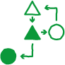
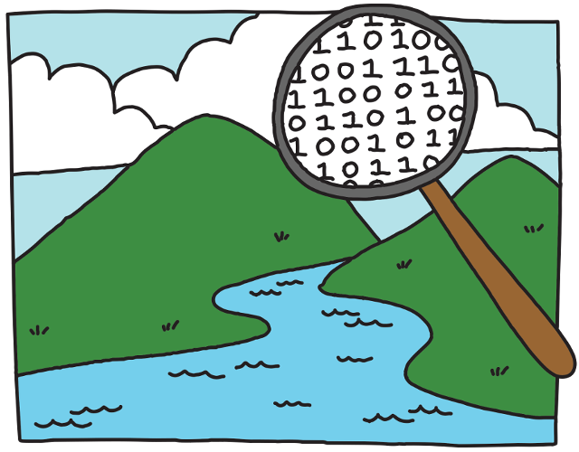

# 计算思维及 CS Unplugged｜精选补充资料

> 来源：[CS Unplugged 中文开放课程](https://www.csunplugged.org/zh-hans/computational-thinking/)  
> 许可：[CC BY-SA 4.0](https://creativecommons.org/licenses/by-sa/4.0/)  
> 语言：简体中文  
> 获取时间：2026-08-08T09:44:31.940384+00:00

# 计算思维及 CS Unplugged

#### 关于页面

## 什么是计算思维？

我们所生活的世界已成为数字化世界，充斥着各种技术，在计算机科学的推动下不断成长。 软件和技术已改变每个学科和工作领域，从科学和医学，直到艺术史和心理学，不一而足。 数字技术无处不在。 如欲成为知情和享有权利的公民，下一代学生将需了解其所居住的这个数字世界。

This is why Computational Thinking has been called the '21st Century Skill Set', and is important for everyone to learn. It is critical to understanding how the digital world works, for harnessing the power of computers to solve tough problems, and making great things happen! It also enables us to think critically about not just the benefits of certain technologies, but also the potential harm, ethical implications, or unintended consequences of these.

But what exactly is Computational Thinking? Let's have a look at a technical definition...

> “计算思维是制定问题及其解决方案所涉及的思维过程，促使以可由信息处理代理有效执行的形式，表示解决方案。”

Phew, it's quite a mouthful isn't it? But, as we like to say at CS Unplugged, it's just big words for simple ideas! 'Information-processing agent' means anything that follows a set of instructions to complete a task (we call this 'computing'). Most of the time this 'agent' means a computer or other type of digital device - but it could also be a human! We'll refer to it as a computer to make things a bit simpler. To represent solutions in a way that a computer can carry them out, we have to represent them as a step by step process - an **algorithm**. To create these algorithmic solutions we apply some special problem solving skills to. These skill are what make up Computational Thinking! And they are skills that are transferrable to any field.

Computational Thinking could be described as 'thinking like a Computer Scientist', but it is now an important skill for everyone to learn, whether they want to be a Computer Scientist or not! It's interesting, and important, to note that Computational Thinking, and Computer Science, aren't entirely about computers, they are more about **people**. You might think that we write programs for computers, but really we write programs for people - to help them communicate, find information, and solve problems.

例如，您可使用智能手机上的应用程序获取前往朋友家的路线；此应用程序是计算机程序的一个示例，而智能手机则是为我们运行程序的'信息处理代理'。无论是谁设计出算法，以制定最佳路线以及全部细节，例如界面和存储地图的方法等，他们均应用计算思维来设计系统。 但是，他们并非因智能手机而设计；其设计旨在为使用智能手机的个人提供服务。

## CS Unplugged 中的计算思维

在 CS Unplugged 的整个课程和单元中，设有许多关于计算思维的链接。通过 CS Unplugged 活动教授计算思维，将教会学生如何：

* 描述问题、
* 确定解决问题所需的重要细节、
* 将问题分解为更小的逻辑步骤、
* 使用这些步骤创建解决问题的过程（算法），
* 随后评估这一过程。

这些技能可转移至任何其他课程领域，但与开发数字系统和使用计算机功能解决问题尤为相关。

这些计算思维概念全部均相互联系、相互支持，但重点在于注意到，并非计算思维的每个方面都会在每个单元或课程中发生。 在每一个单元和课程中，我们均强调您应在学生行为中观察到的重要联系。

计算思维具有多种定义，但大多数均有计算思维所体现的一套 5 或 6 种解决问题的技能。 对于 Unplugged 项目，我们经确定文献中经常提到的以下六种 CT 技能；其描述如下所示，并且，在每个 Unplugged 课程结束时，我们都将确定这些技能在课程中的出现方式，从而助您查看与课程的 CT 关联。

## 计算思维技能

**算法思维**

Algorithms are at the heart of Computational Thinking and Computer Science, because in Computer Science the solutions to problems are not simply an answer (e.g. '42', or a fact), they are algorithms. An algorithm is a step-by-step process that solves a problem or completes a task. If you follow the algorithm's steps correctly, you will arrive at a correct solution, even for different inputs. For example, we can use an algorithm to find the shortest route between two locations on a map; the same algorithm can be used for any pair of starting and finishing points, so the solution depends on the input to the algorithm. If we know the algorithm for solving a problem then we can solve that problem easily, whenever we want, without having to think! We can just follow the steps. Computers can't think for themselves, so they need to be given algorithms to do things.

算法思维是创建算法的过程。当要创建算法来解决问题时，我们称之为算法解决方案。

计算算法（可在数字装置上运行的类型）具有相对较少的成分，毕竟数字装置只有几种类型的指令可供遵循；它们可完成的事情主要是接收输入、提供输出、存储值、按照顺序执行指令、在选项之间进行选择，以及循环重复指令。尽管这一系列指令有限，但我们已描述数字装置可计算的所有内容，这也可解说为何仅限这些元素来描述算法。

**抽象**

Abstraction is all about simplifying things to help us manage complexity. It requires identifying what the most important aspects of a problem are and hiding the other specific details that we don't need to focus on. The important aspects can be used to create a model, or simplified representation, of the original thing we were dealing with. We can then work with this model to solve the problem, rather than having to deal with all the nitty gritty details at once. Computer Scientists often work with multiple levels of abstraction.

我们经常在日常生活（例如使用地图时）中使用抽象。地图展示出世界的简化版本，为我们省略了不必要的细节，例如公园中每棵树的位置，并且仅保留地图阅读器所需的最相关信息，例如道路和街道名称。

数字装置始终应用抽象；它们试图尽可能多地隐藏用户不需要的信息。例如，假设您在上次露营活动中拍摄了一张漂亮的风景照片，而现在要在笔记本电脑上进行编辑并调整颜色。通常，可通过打开图片编辑程序并调整一些颜色滑块或选择滤镜来实现此目的。执行此操作时，计算机隐藏了这个操作背后的许多复杂操作。

The picture you took is stored on the computer as a big list of pixels, which are each a different colour, and each colour is represented by a set of numbers, and each of these numbers are stored as binary digits! That's a lot of information. Imagine if when you adjusted the colours you had to go through and look at all the colour values of every pixel and change each and every one of those! That's what the computer is doing for you, but since you don't need to know this to accomplish your goal the computer hides this information away.

**分解**

分解即将问题分解为更小、更易管理的部分，然后专注于解决每个小问题。 我们可以将复杂的问题分解为各个小部分，直至这些小部分变得简单而易于解决。这些可解决每个更小、更简单问题的解决方案，形成用于解决一开始面对的大问题之解决方案。分解有助于让大问题变得不那么吓人！

创建可在计算装置上实现的算法和过程时，分解是一项重要技能，因为计算机需要非常具体的指令。它们需要得知完成任务所需的每一个小步骤。

例如，制作蛋糕的整体任务可分解为多个小任务，而每个小任务均可轻松完成。

**制作蛋糕**

1. 烘焙蛋糕
   1. 在碗中放入原料（黄油、糖、鸡蛋、面粉）
   2. 搅拌
   3. 倒入蛋糕模具
   4. 放入烤箱，烤 30 分钟
   5. 取出蛋糕模具
2. 制作糖衣
3. 放上蛋糕

**泛化和模式**

泛化也称为'模式识别和泛化'。泛化采用问题的解决方案（或解决方案的一部分）并对其进行泛化，以便将其应用于其他类似的问题和任务中。由于计算机科学中的解决方案是算法，这意味着我们采用算法并将算法变得足够通用，以便将算法用于一系列问题。这个过程涉及抽象，毕竟为了让结果变得更加通用，必须删除与特定问题或情况相关但对于算法的工作原理并不重要的非必要细节。

Spotting patterns is an important part of this process, when we think about problems we might recognise similarities between them and that they can be solved in similar ways. This is called pattern matching, and it's something we do naturally all the time in our daily life.

泛化的算法可以针对整组类似问题反复使用，这意味着我们可以快速有效地想出解决方案。

**评估**

评估就是确定问题的潜在解决方案，并判断出可用的最佳方案、判断该等方案是否可在某些情况下有用而在其他情况下无用，以及应如何改进。判断解决方案时，需要考虑一系列因素。例如，这些过程（算法）需要多长时间才能解决问题，是否能够可靠地解决问题，或者，是否会在某些情况下以非常不同的方式进行。评估是日常生活中的常做之事。

There are different ways we can evaluate our algorithmic solutions. We can test their speed by implementing them on a computer; or we can analyse them by counting or calculating how many steps they are likely to take. We can test that our algorithmic solutions work correctly by giving them lots of different inputs, and checking they work as expected. When we do this we need to think about the different inputs we test, because we don't want to check every possible input (often there's an infinite number of possible inputs!), but we still need to know if our algorithmic solutions will work for all inputs. Testing is something Computer Scientists and programmers do all the time. But because we can't usually test every possible input, we also try to evaluate a system using logical reasoning.

**逻辑**

尝试解决问题时，需要进行逻辑思考。逻辑推理是试图通过观察、收集数据、思考已知事实的方式理解事物，然后根据已知信息理清事情。这有助利用现有知识，建立规则并检查事实。

例如，假设当前编写的软件能算出从家中到达某个地点的最短路径。在下面的地图中，如果从家中向北走，那么距离图书馆只有 2 分钟路程；但是如果向南走，那么距离下一个十字路口 有 3 分钟路程。您可能想要知道，如果一开始向南走，是否存在到达图书馆的更好路径，但逻辑上并不存在这个可能，因为您已步行 3 分钟抵达十字路口。

从更深的层面上来说，计算机完全建立于逻辑之上。它们使用‘真’值和‘假’值以及‘布尔表达式’（例如，“年龄 > 5”），在计算机程序中进行决策。

追踪程序中的错误，也需通过逻辑思维来算出程序出错的位置和原因。
