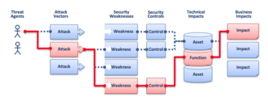
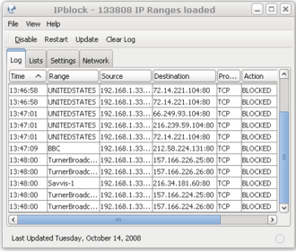
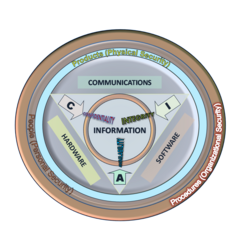

# 信息安全｜精选补充资料

> 来源：[维基百科（中文）](https://zh.wikipedia.org/wiki/%E4%BF%A1%E6%81%AF%E5%AE%89%E5%85%A8)  
> 许可：[CC BY-SA 4.0](https://creativecommons.org/licenses/by-sa/4.0/)  
> 语言：简体中文  
> 获取时间：2026-08-08T09:44:15.627636+00:00

维基百科，自由的百科全书

電腦網路入侵

[防火牆](/wiki/%E9%98%B2%E7%81%AB%E7%89%86 "防火牆")的視察軟體介面範例，記錄[IP](/wiki/IP%E5%9C%B0%E5%9D%80 "IP地址")進出情況與對應事件

| 「信息安全」的各地常用名稱 | |
| --- | --- |
| 中國大陸 | 信息安全 |
| 臺灣 | 資訊安全 |
| 港澳 | 資訊保安 |

**信息安全**，意为保护[信息](/wiki/%E4%BF%A1%E6%81%AF "信息")及[信息系统](/wiki/%E4%BF%A1%E6%81%AF%E7%B3%BB%E7%BB%9F "信息系统")免受未经授权的进入、使用、披露、破坏、修改、检视、记录及销毁。政府、军队、公司、金融机构、医院、私人企业积累大量與雇员、顾客、产品、研究、金融数据有关的机密信息，而绝大部分的信息现在被收集、产生、存储在[电子计算机](/wiki/%E7%94%B5%E5%AD%90%E8%AE%A1%E7%AE%97%E6%9C%BA "电子计算机")内，并通过[网络](/wiki/%E4%BA%92%E8%81%AF%E7%B6%B2 "互聯網")传送到别的计算机。如果企业的顾客、财政状况、新产品线的机密信息落入竞争对手的掌握，这种安全性的丧失可能会导致经济上的损失、法律诉讼甚至该企业的破产。保护机密的信息是商业上的需求，而在许多情况中也是道德和法律上的需求。

对于个人来说，信息安全对于[个人隐私](/wiki/%E5%80%8B%E4%BA%BA%E7%A7%81%E9%9A%B1 "個人私隱")具有重大的影响，但这在不同的文化中的看法差异很大。信息安全在最近这些年经历巨大變化。有很多方式进入这一领域，并将之作为一项事业。它提供了许多专门的研究领域，包括：安全的网络和公共基础设施、安全的应用[软件](/wiki/%E8%BD%AF%E4%BB%B6 "软件")和[数据库](/wiki/%E6%95%B0%E6%8D%AE%E5%BA%93 "数据库")、安全测试、信息系统评估、企业安全规划以及数字取证技术等等。为保障信息安全，要求有信息源认证、访问控制，不能有非法软件驻留，不能有未授权的操作等行为。

## 名詞區分

資安概念

信息安全这一术语，与[计算机安全](/wiki/%E8%AE%A1%E7%AE%97%E6%9C%BA%E5%AE%89%E5%85%A8 "计算机安全")和[信息保障](/wiki/%E4%BF%A1%E6%81%AF%E4%BF%9D%E9%9A%9C "信息保障")（information assurance）等术语经常被不正确地互相替换使用。这些领域经常相互关联，并且拥有一些共同的目标：保护信息的机密性、完整性、可用性；然而，它们之间仍然有一些微妙的区别。

区别主要存在于达到这些目标所使用的方法及策略，以及所关心的领域。信息安全主要涉及数据的机密性、完整性、可用性，而不管数据的存在形式是电子的、印刷的还是其它的形式；计算机安全可以指：关注计算机系统的可用性及正确的操作，而并不关心计算机内存储或产生的信息。为保障信息安全，要求有信息源认证、访问控制，不能有非法软件驻留，不能有未授权的操作等行为。

## 历史

自从人类有了书写[文字](/wiki/%E6%96%87%E5%AD%97 "文字")之后，[国家](/wiki/%E5%9B%BD%E5%AE%B6 "国家")首脑和[军队](/wiki/%E5%86%9B%E9%98%9F "军队")指挥官就已经明白，使用一些技巧来保证[通信](/wiki/%E9%80%9A%E4%BF%A1 "通信")的机密以及获知其是否被篡改是非常有必要的。[凯撒](/wiki/%E5%87%AF%E6%92%92 "凯撒")被认为在公元前50年发明了[凯撒密码](/wiki/%E5%87%AF%E6%92%92%E5%AF%86%E7%A0%81 "凯撒密码")，它被用来防止秘密的消息落入错误的人手中时被读取。[第二次世界大战](/wiki/%E7%AC%AC%E4%BA%8C%E6%AC%A1%E4%B8%96%E7%95%8C%E5%A4%A7%E6%88%98 "第二次世界大战")使得信息安全研究取得许多进展，并且标志着其开始成为一门专业的学问。

20世纪末以及21世纪初见证通信、计算机硬件和软件以及数据加密领域的巨大发展。小巧、功能强大、价格低廉的计算设备使得对电子数据的加工处理能为小公司和家庭用户所负担和掌握。这些计算机很快被通常称为[因特网](/wiki/%E5%9B%A0%E7%89%B9%E7%BD%91 "因特网")或者[万维网](/wiki/%E4%B8%87%E7%BB%B4%E7%BD%91 "万维网")的网络连接起来。在因特网上快速增长的电子数据处理和[电子商务](/wiki/%E7%94%B5%E5%AD%90%E5%95%86%E5%8A%A1 "电子商务")应用，以及不断出现的国际[恐怖主义](/wiki/%E6%81%90%E6%80%96%E4%B8%BB%E4%B9%89 "恐怖主义")事件，增加了对更好地保护计算机及其存储、加工和传输的信息的需求。计算机安全、信息安全、以及信息保障等学科，是和许多专业的组织一起出现的。他们都持有共同的目标，即确保信息系统的安全和可靠。

## 基本原理

### 關鍵概念

信息安全的內容可以簡化為下列三個基本點，称为**CIA三要素**，此觀點似乎最早在[NIST](/wiki/NIST "NIST")於1977年所發行的出版品中提到。

#### 机密性

[机密性](/wiki/%E4%BF%9D%E5%AF%86%E6%80%A7 "保密性")（Confidentiality）確保資料傳遞與儲存的隱密性，避免未經授權的使用者有意或無意的揭露資料內容。

#### 完整性

[数据完整性](/wiki/%E6%95%B0%E6%8D%AE%E5%AE%8C%E6%95%B4%E6%80%A7 "数据完整性")（Integrity）代表確保資料無論是在傳輸或儲存的生命週期中，保有其正確性與一致性。

#### 可用性

在信息安全領域，[可用性](/wiki/%E5%8F%AF%E7%94%A8%E6%80%A7 "可用性")（Availability）是成功的資訊安全計畫應具備的需求，意及當使用者需透過資訊系統進行操作時，資料與服務須保持可用狀況(能用)，並能滿足使用需求(夠用)。

#### 其他特性

* 可鑑別性（Authenticity）：能證明主體或資源之識別就是所聲明者的特性。
* 可歸責性（Accountability）：確保實體之行為可唯一追溯到該實體的性質。
* [不可否認性](/wiki/%E4%B8%8D%E5%8F%AF%E5%90%A6%E8%AA%8D "不可否認")（Non-repudiation）：對已發生的動作或事件的證明，使發起該動作或事件的實體，往後無法否認其行為。實務上做法採用數位簽章技術。

### 3A

#### 認證（Authentication）

識別資訊使用者的身份，可記錄資訊被誰所存取使用，例如：透過密碼或憑證方式驗證使用者身份。

實務做法：

* 你所知道的（Something you know）：帳號／密碼
* 你所擁有的（Something you have）：IC卡、數位設備、數位簽章、一次性密碼(OTP)
* 你所具備的（Something you are）：指紋、虹膜、聲紋、臉部特徵、靜脈脈紋、DNA

#### 授權（Authorization）

依照實際需求給予實體適當的權限，一般建議採最小權限（Least privilege），意即僅給予實際作業所需要的權限，避免過度授權可能造成的資訊暴露或洩漏。

資訊系統層面的實務存取控制方法分類如下：

* [強制存取控制](/wiki/%E5%BC%B7%E5%88%B6%E5%AD%98%E5%8F%96%E6%8E%A7%E5%88%B6 "強制存取控制")（Mandatory Access Control）
* [自由選定存取控制](/wiki/%E8%87%AA%E7%94%B1%E9%81%B8%E5%AE%9A%E5%AD%98%E5%8F%96%E6%8E%A7%E5%88%B6 "自由選定存取控制")（Discretionary Access Control）
* [以角色為基礎的存取控制](/wiki/%E4%BB%A5%E8%A7%92%E8%89%B2%E7%82%BA%E5%9F%BA%E7%A4%8E%E7%9A%84%E5%AD%98%E5%8F%96%E6%8E%A7%E5%88%B6 "以角色為基礎的存取控制")（Role-Based Access Control）
* [以規則為基礎的存取控制](/wiki/%E4%BB%A5%E8%A6%8F%E5%89%87%E7%82%BA%E5%9F%BA%E7%A4%8E%E7%9A%84%E5%AD%98%E5%8F%96%E6%8E%A7%E5%88%B6 "以規則為基礎的存取控制")（Rule-Based Access Control）

#### 紀錄（Accounting）

內容項目包含量測（Measuring）、監控（Monitoring）、報告（Reporting）與紀錄檔案（Logging），以便提供未來作為稽核（Auditing）、計費（Billing）、分析（Analysis）與管理之用，主要精神在於收集使用者與系統之間互動的資料，並留下軌跡紀錄。

信息安全三要素之間存在互相牽制的關係，例如：過度強化機密性時，將造成完整性與可用性的降低，需要高可用性的系統則會造成機密性與完整性的降低，因此在有限資源的前提下，在信息安全三要素中取得適當的平衡是資訊安全管理階層的重要課題。

对信息安全的认识经历了的数据安全阶段（强调保密通信）、网络信息安全时代（强调网络环境）和目前的信息保障时代（强调不能被动地保护，需要有保护——检测——反应——恢复四个环节）。

安全技术严格地讲仅包含3类：隐藏、[访问控制](/wiki/%E8%AE%BF%E9%97%AE%E6%8E%A7%E5%88%B6 "访问控制")和[密码学](/wiki/%E5%AF%86%E7%A0%81%E5%AD%A6 "密码学")。

典型的安全应用有：

1. [数字水印](/wiki/%E6%95%B0%E5%AD%97%E6%B0%B4%E5%8D%B0 "数字水印")属于隐藏；
2. 网络[防火墙](/wiki/%E9%98%B2%E7%81%AB%E5%A2%99 "防火墙")属于访问控制；
3. [数字签名](/wiki/%E6%95%B0%E5%AD%97%E7%AD%BE%E5%90%8D "数字签名")属于密码学。

## 过程控制

### 突发事件控制

「網路与訊息安全事件」（Network & Information Security Incident）是[突发事件](/wiki/%E7%AA%81%E7%99%BC%E4%BA%8B%E4%BB%B6 "突發事件")的一种，也被称为「訊息安全事件」（Information Security Incident）。網路与訊息安全事件在业界尚未有统一的[定义](/wiki/%E5%AE%9A%E4%B9%89 "定义")，[政府](/wiki/%E6%94%BF%E5%BA%9C "政府")管理、[科学](/wiki/%E7%A7%91%E5%AD%A6 "科学")研究、[企业](/wiki/%E4%BC%81%E4%B8%9A "企业")根据各自的关注点对其的理解也存在一定的差异。至於[中华人民共和国](/wiki/%E4%B8%AD%E5%8D%8E%E4%BA%BA%E6%B0%91%E5%85%B1%E5%92%8C%E5%9B%BD "中华人民共和国")[国家质量监督检验检疫总局](/wiki/%E5%9B%BD%E5%AE%B6%E8%B4%A8%E9%87%8F%E7%9B%91%E7%9D%A3%E6%A3%80%E9%AA%8C%E6%A3%80%E7%96%AB%E6%80%BB%E5%B1%80 "国家质量监督检验检疫总局")和[中国国家标准化管理委员会](/wiki/%E4%B8%AD%E5%9B%BD%E5%9B%BD%E5%AE%B6%E6%A0%87%E5%87%86%E5%8C%96%E7%AE%A1%E7%90%86%E5%A7%94%E5%91%98%E4%BC%9A "中国国家标准化管理委员会")制定发布的两个现行技术标准中，对该[术语](/wiki/%E6%9C%AF%E8%AF%AD "术语")的定义如下：

* 在《讯息技术 安全技术 讯息安全事件管理指南》（GB/Z 20985-2007）中被定义为“由单个或一系列意外或有害的讯息安全事态所组成的，极有可能危害业务运行和威胁[讯息](/wiki/%E8%A8%8A%E6%81%AF "讯息")安全。”
* 在《讯息安全技术 讯息安全事件分类分级指南》（GB/Z 20986-2007）中被定义为“

## 各國法律、法规与标准

中国大陆最重要的信息安全标准体系是“信息安全等级保护体系”，该体系在所有主要行业进行推广，并对信息安全行业的发展产生了重要影响。臺灣由[行政院](/wiki/%E8%A1%8C%E6%94%BF%E9%99%A2 "行政院")頒布《[資通安全管理法](https://zh.wikisource.org/wiki/%E8%B3%87%E9%80%9A%E5%AE%89%E5%85%A8%E7%AE%A1%E7%90%86%E6%B3%95 "s:資通安全管理法")》主要涵蓋對象為中央、地方機關與公法人，及金融、能源、交通等關鍵基礎建設提供者，並影響前述單位的組織架構、資訊安全方針及預算分配。

1. **[^](#cite_ref-NIST1977_1-0)** A. J. Neumann, N. Statland and R. D. Webb. [Post-processing audit tools and techniques](https://nvlpubs.nist.gov/nistpubs/Legacy/SP/nbsspecialpublication500-19.pdf) (PDF). US Department of Commerce, National Bureau of Standards: 11–3––11–4. 1977  [2021-03-16]. （原始内容[存档](https://web.archive.org/web/20210427011100/https://nvlpubs.nist.gov/nistpubs/Legacy/SP/nbsspecialpublication500-19.pdf) (PDF)于2021-04-27）.
2. **[^](#cite_ref-BeckersPattern15_2-0)** Beckers, K. [Pattern and Security Requirements: Engineering-Based Establishment of Security Standards](https://books.google.com/books?id=DvdICAAAQBAJ&pg=PA100). Springer. 2015: 100  [2021-03-16]. [ISBN 9783319166643](/wiki/Special:BookSources/9783319166643 "Special:BookSources/9783319166643"). （原始内容[存档](https://web.archive.org/web/20210427191114/https://books.google.com/books?id=DvdICAAAQBAJ&pg=PA100)于2021-04-27）.
3. **[^](#cite_ref-3)** Boritz, J. Efrim. IS Practitioners' Views on Core Concepts of Information Integrity. International Journal of Accounting Information Systems (Elsevier). 2005, **6** (4): 260–279. [doi:10.1016/j.accinf.2005.07.001](https://doi.org/10.1016%2Fj.accinf.2005.07.001).
4. **[^](#cite_ref-4)** Csapo, Nancy; Featheringham, Richard. [COMMUNICATION SKILLS USED BY INFORMATION SYSTEMS GRADUATES](https://dx.doi.org/10.48009/1_iis_2005_311-317). Issues In Information Systems. 2005. [ISSN 1529-7314](//www.worldcat.org/issn/1529-7314). [doi:10.48009/1\_iis\_2005\_311-317](https://doi.org/10.48009%2F1_iis_2005_311-317).

* [计算机安全隐患](/wiki/%E8%AE%A1%E7%AE%97%E6%9C%BA%E5%AE%89%E5%85%A8%E9%9A%90%E6%82%A3 "计算机安全隐患")
* [网络安全](/wiki/%E7%BD%91%E7%BB%9C%E5%AE%89%E5%85%A8 "网络安全")
* [戰術數位資訊鏈路](/wiki/%E6%88%B0%E8%A1%93%E6%95%B8%E4%BD%8D%E8%B3%87%E8%A8%8A%E9%8F%88%E8%B7%AF "戰術數位資訊鏈路")
* [攜帶自有裝置](/wiki/%E6%94%9C%E5%B8%B6%E8%87%AA%E6%9C%89%E8%A3%9D%E7%BD%AE "攜帶自有裝置")（BYOD）
* [資訊資產](/wiki/%E8%B3%87%E8%A8%8A%E8%B3%87%E7%94%A2 "資訊資產")
* [網路安全標準](/wiki/%E7%B6%B2%E8%B7%AF%E5%AE%89%E5%85%A8%E6%A8%99%E6%BA%96 "網路安全標準")
* [內容安全](/wiki/%E5%86%85%E5%AE%B9%E5%AE%89%E5%85%A8 "内容安全")
* [紅綠燈協議](/wiki/%E7%B4%85%E7%B6%A0%E7%87%88%E5%8D%94%E8%AD%B0 "紅綠燈協議")
* [戈登-洛布模型](/wiki/%E6%88%88%E7%99%BB-%E6%B4%9B%E5%B8%83%E6%A8%A1%E5%9E%8B "戈登-洛布模型")

[分类](/wiki/Special:Categories "Special:Categories")：​

* [自2010年12月需要计算机科学专家关注的页面](/wiki/Category:%E8%87%AA2010%E5%B9%B412%E6%9C%88%E9%9C%80%E8%A6%81%E8%AE%A1%E7%AE%97%E6%9C%BA%E7%A7%91%E5%AD%A6%E4%B8%93%E5%AE%B6%E5%85%B3%E6%B3%A8%E7%9A%84%E9%A1%B5%E9%9D%A2 "Category:自2010年12月需要计算机科学专家关注的页面")
* [資訊安全](/wiki/Category:%E8%B3%87%E8%A8%8A%E5%AE%89%E5%85%A8 "Category:資訊安全")
* [電腦安全](/wiki/Category:%E9%9B%BB%E8%85%A6%E5%AE%89%E5%85%A8 "Category:電腦安全")
* [信息治理](/wiki/Category:%E4%BF%A1%E6%81%AF%E6%B2%BB%E7%90%86 "Category:信息治理")

隐藏分类：​

* [模板中使用无效日期参数的条目](/wiki/Category:%E6%A8%A1%E6%9D%BF%E4%B8%AD%E4%BD%BF%E7%94%A8%E6%97%A0%E6%95%88%E6%97%A5%E6%9C%9F%E5%8F%82%E6%95%B0%E7%9A%84%E6%9D%A1%E7%9B%AE "Category:模板中使用无效日期参数的条目")
* [所有需要專家關注的頁面](/wiki/Category:%E6%89%80%E6%9C%89%E9%9C%80%E8%A6%81%E5%B0%88%E5%AE%B6%E9%97%9C%E6%B3%A8%E7%9A%84%E9%A0%81%E9%9D%A2 "Category:所有需要專家關注的頁面")
* [需要计算机科学专家关注的页面](/wiki/Category:%E9%9C%80%E8%A6%81%E8%AE%A1%E7%AE%97%E6%9C%BA%E7%A7%91%E5%AD%A6%E4%B8%93%E5%AE%B6%E5%85%B3%E6%B3%A8%E7%9A%84%E9%A1%B5%E9%9D%A2 "Category:需要计算机科学专家关注的页面")
