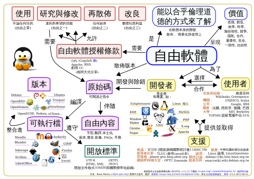
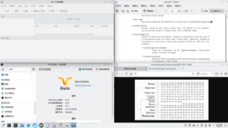

# 自由软件与开放许可证｜精选补充资料

> 来源：[维基百科（中文）](https://zh.wikipedia.org/wiki/%E8%87%AA%E7%94%B1%E8%BD%AF%E4%BB%B6%E8%AE%B8%E5%8F%AF%E8%AF%81)  
> 许可：[CC BY-SA 4.0](https://creativecommons.org/licenses/by-sa/4.0/)  
> 语言：简体中文  
> 获取时间：2026-08-08T09:44:22.143761+00:00

维基百科，自由的百科全书

（重定向自[自由软件许可证](/w/index.php?title=%E8%87%AA%E7%94%B1%E8%BD%AF%E4%BB%B6%E8%AE%B8%E5%8F%AF%E8%AF%81&redirect=no "自由软件许可证")）

**提示**：此条目的主题不是**[免费软件](/wiki/%E5%85%8D%E8%B4%B9%E8%BD%AF%E4%BB%B6 "免费软件")**或**[共享软件](/wiki/%E5%85%B1%E4%BA%AB%E8%BD%AF%E4%BB%B6 "共享软件")**。

[GNU](/wiki/GNU "GNU")計劃的自由軟體之標誌。

自由軟體心智圖

**自由軟體**（英語：free software）是允許使用者自由地使用、複製、研究、修改和分發的[軟體](/wiki/%E8%BB%9F%E9%AB%94 "軟體")。

## 概念的来源

参见：[GNU](/wiki/GNU "GNU")

1983年9月，[理查德·斯托曼](/wiki/%E7%90%86%E6%9F%A5%E5%BE%B7%C2%B7%E9%A9%AC%E4%BF%AE%C2%B7%E6%96%AF%E6%89%98%E6%9B%BC "理查德·马修·斯托曼")在net.unix-wizards和net.usoft[新闻组](/wiki/%E6%96%B0%E9%97%BB%E7%BB%84 "新闻组")上公布了[GNU计划](/wiki/GNU%E8%A8%88%E5%8A%83 "GNU計劃")。因为先前在MIT经历了施乐打印机故障，惟软件原理不开放导致斯托曼无法把编写好的卡纸提醒程序上传打印机，[专有软件](/wiki/%E4%B8%93%E6%9C%89%E8%BD%AF%E4%BB%B6 "专有软件")日渐强大的势头让斯托曼感到他有义务去保护和传承他曾经在MIT所感受到的[黑客文化](/wiki/%E9%BB%91%E5%AE%A2%E6%96%87%E5%8C%96 "黑客文化")。在 《*Dr. Dobb’s Journal of Software Tools》*这本杂志的 1985 年 3 月期上，他把之前在新闻组上的论述汇编成为了第一版的[GNU 宣言](/wiki/GNU%E5%AE%A3%E8%A8%80 "GNU宣言")。GNU宣言在行文中提到了freeware，但是与今天广为流传的[免費軟體](/wiki/%E5%85%8D%E8%B2%BB%E8%BB%9F%E9%AB%94 "免費軟體")义不同，这里的freeware是指一种能够分享软件代码原理的，允许大众买卖，自由分发的特殊软件类型。后来GNU计划的参与者为了避免歧义就使用了**Free Software**（中文：**自由软件**）这一词组。

## 定义

参见：[自由軟體定義](/wiki/%E8%87%AA%E7%94%B1%E8%BB%9F%E9%AB%94%E5%AE%9A%E7%BE%A9 "自由軟體定義")

在英文里「*free*」一詞有「自由」、「免費」的雙重含意。为了避免歧义，斯托曼对 Free Software 中 *free* 的含义做出了如下解释：

> “自由軟體的重點在於自由權，而非價格。要了解其所代表的概念，你應該將「free」想成是「[言論自由](/wiki/%E8%A8%80%E8%AB%96%E8%87%AA%E7%94%B1 "言論自由")」（英語：*free* speech）一词中的含义，而不是「免費啤酒」（英語：*free* beer）一词中的含义。”

### 自由软件允许商业行为

符合自由軟體定义的许可证不会限制对于软件[二進制檔案](/wiki/%E4%BA%8C%E9%80%B2%E5%88%B6%E6%AA%94%E6%A1%88 "二進制檔案")的販賣，一些许可证如[GNU通用公共许可证](/wiki/GNU%E9%80%9A%E7%94%A8%E5%85%AC%E5%85%B1%E8%AE%B8%E5%8F%AF%E8%AF%81 "GNU通用公共许可证")（GNU GPL）甚至允许使用物理介质分发原始码的时候收取一定量的工本费。但是，对于GNU通用公共许可证来说，其条款要求版权所有者不可向用户索要授权费或[版税](/wiki/%E7%89%88%E7%A8%8E "版税")，或就用户行使其所授任意权利时征收额外费用。

### [自由軟體基金會](/wiki/%E8%87%AA%E7%94%B1%E8%BB%9F%E9%AB%94%E5%9F%BA%E9%87%91%E6%9C%83 "自由軟體基金會")的自由软件定义

自由軟體基金會（FSF）對自由軟體的定義并非一步到位，於1986年發表的*GNU's Bulletin, vol. 1 no. 1*定义了两种软件上的自由。

根據FSF如今的定義，自由软件能赋予使用者四种自由:

* 自由度0：无论用户出于何种目的，必须可以按照用户意愿，自由地运行该软件。
* 自由度1：用户可以自由地学习并修改该软件，以此来帮助用户完成用户自己的计算。作为前提，用户必须可以访问到该软件的源代码。
* 自由度2：用户可以自由地分发该软件的拷贝，这样就可以助人。
* 自由度3：用户可以自由地分发该软件修改后的拷贝。借此，用户可以把改进后的软件分享给整个社区令他人也从中受益。作为前提，用户必须可以访问到该软件的源代码。

根据[SPDX](/wiki/%E8%BB%9F%E9%AB%94%E5%8C%85%E8%B3%87%E6%96%99%E4%BA%A4%E6%8F%9B%E8%A6%8F%E7%AF%84 "軟體包資料交換規範")的网站记录，FSF定义的自由軟體受到该组织认可的各类自由軟體许可证保護而發佈（或是放置在[公有領域](/wiki/%E5%85%AC%E6%9C%89%E9%A0%98%E5%9F%9F "公有領域")）。

## 分歧

### 开源软件概念的出现

根据[开放源代码促进会](/wiki/%E5%BC%80%E6%94%BE%E6%BA%90%E4%BB%A3%E7%A0%81%E4%BF%83%E8%BF%9B%E4%BC%9A "开放源代码促进会")（OSI）的历史记录，在[帕洛阿尔托](/wiki/%E5%B8%95%E7%BE%85%E5%A5%A7%E5%9C%96 "帕羅奧圖")的一次自由软件峰会上，因为部分参会者想避免Free Software这个标签所带来的哲学和政治含义，他们就提出使用**[开源软件](/wiki/%E5%BC%80%E6%BA%90%E8%BD%AF%E4%BB%B6 "开源软件")**（open source software）这一词组代指自由软件；OSI在2006年的[FAQ](/wiki/%E5%B8%B8%E8%A6%8B%E5%95%8F%E9%A1%8C%E9%9B%86 "常見問題集")则描述：“Open Source”词组，为自由软件的营销术语。gnu.org的一篇论述认为在早期，部分人使用“Open Source”是为了避免“Free”所带来的歧义。如今，自由软件基金会与开放源代码促进会分别认可的自由软件许可证与开源软件许可证已经不完全重叠。

最早的[开源定义](/wiki/%E5%BC%80%E6%BA%90%E5%AE%9A%E4%B9%89 "开源定义")参考了[Debian 自由软件指导方针](/wiki/Debian_%E8%87%AA%E7%94%B1%E8%BD%AF%E4%BB%B6%E6%8C%87%E5%AF%BC%E6%96%B9%E9%92%88 "Debian 自由软件指导方针")，并于1998年首次发布。从OSI的创始人之一[ESR](/wiki/%E5%9F%83%E9%87%8C%E5%85%8B%C2%B7%E9%9B%B7%E8%92%99 "埃里克·雷蒙")看来，開放原始碼运动的哲学是使用开放的开发方式，儘可能的使軟件最佳化。而OSI的另一位创始人[布鲁斯·佩伦斯](/wiki/%E5%B8%83%E9%B2%81%E6%96%AF%C2%B7%E4%BD%A9%E4%BC%A6%E6%96%AF "布鲁斯·佩伦斯")则在[Debian](/wiki/Debian "Debian")的官方[邮件列表](/wiki/%E9%82%AE%E4%BB%B6%E5%88%97%E8%A1%A8 "邮件列表")里公开表示：

> It's Time to Talk About Free Software Again

虽然大多數的開放原始碼軟體同時也是自由軟體，但是，gnu.org认为“开源”这个词并没有抓住自由软件的真正涵义，容易让人过于着重軟件的质量、流行与成功而忽视或抛弃自由软件哲学的道德观和价值取向，力主使用“自由软件”这一概念。

### 对于许可证类型的偏好

根据gnu.org的记载，宽松许可证的支持者中有人认为使用这样的许可证是一种谦逊的行为，也有这类许可证的支持者则认为不应该对下游软件开发者说不，因此他们倾向于使用较为宽松的，类似[BSD](/wiki/BSD%E5%8D%8F%E8%AE%AE "BSD协议")这样的许可证。不过，BSD，[MIT](/wiki/MIT%E8%A8%B1%E5%8F%AF%E8%AD%89 "MIT許可證")这类许可证因为缺少相关的说明并不能避免其成果被[专利流氓](/wiki/%E4%B8%93%E5%88%A9%E6%B5%81%E6%B0%93 "专利流氓")利用。同样是宽松许可证的[Apache 2.0](/wiki/Apache_2.0 "Apache 2.0")在许可证文本中则明确提到专利权，正确运用的情况下能保护著作权所有者的相关权利。[TechCrunch](/wiki/TechCrunch "TechCrunch")的一篇文章举例，若开发者研发出了一种已经自行申请了专利的新图像处理算法，并将其加入了某使用Apache 2.0许可证的软件之后，该算法的专利保护效应能通过该许可证传播到所有该软件用户的软件上。Apache 2.0与GPL第三版的许可证条文中都包含专利反制条款，假使软件的用户对含有这类条款的软件的其他用户或者任何一个开发者提出专利侵权的主张或者诉讼，权利人有权终止该用户使用此类软件内含专利甚至许可证所授权的其他权利（视许可证而定）。

对于宽松的自由软件许可证，gnu.org认为，如果允许自由软件的衍生作品成为专有软件，那麼你就無法捍衛他人的自由了。例如FreeBSD项目的软件被集成进专有的[PlayStation 4](/wiki/PlayStation_4 "PlayStation 4")系统，以及BSD系列许可证的TCP/IP协议栈在专有软件[Microsoft Windows](/wiki/Microsoft_Windows "Microsoft Windows")中的使用等。

## 开发自由软件的动机

部分经济学论文指出：软件市场中，软件分发的[边际成本](/wiki/%E8%BE%B9%E9%99%85%E6%88%90%E6%9C%AC "边际成本")可以忽略不计。*Ghosh* (1998) 在其论文中把网络上流通的免费的财货比作“大汤锅”（cooking pot）；自由或开源软件的开发者把他们的软件倒入一口公共的“汤锅”，汤锅里的混合物可以被任何人自由的获取。ESR 认为激励人们编写软件并捐赠的动机是：开发并分发对于特定领域的软件解决方案所带来的荣誉感和自我实现。

根据来自[麻省理工斯隆管理學院](/wiki/%E9%BA%BB%E7%9C%81%E7%90%86%E5%B7%A5%E6%96%AF%E9%9A%86%E7%AE%A1%E7%90%86%E5%AD%B8%E9%99%A2 "麻省理工斯隆管理學院")的研究者在2003年发表的一篇论文，研究人员透过网络问卷的方式统计到了软件开发者开发自由或开源软件中不同[动机](/wiki/%E5%8A%A8%E6%9C%BA#内在动机与外在动机 "动机")的比例。

论文总结了如下不同的动机类别：

* 内在动机：
  + 开发者出于娱乐目的进行开发。
  + 开发者出于对社区的义务而进行开发。
* 外在动机：
  + 开发者认为收益大于成本时，会持续开发。(Lerner and Tirole 2002)
    - 即时回报：开发者被雇佣开发自由软件；用户的需求得到满足。 (von Hippel 2001)
    - 延迟回报：可能的升职机会；开发者作为人力资本的（编程）技能升级。

上述论文统计到的结果是，开发者主要基于内在的满足感（在开发某个项目时所感受到的创造力）进行开发。

## 对自由软件的批评

Debian项目与OSI的前领导人布鲁斯·佩伦斯认为：尽管自由软件与开源软件对社会作出了诸多贡献，但是现存的自由软件和开源软件定义及其许可证并不能真正保护开发者的利益。因此他提出了[Post Open](/w/index.php?title=Post_Open&action=edit&redlink=1 "Post Open（页面不存在）")（英语：[Post Open Source](https://en.wikipedia.org/wiki/Post_Open_Source "en:Post Open Source")）这一概念。在他的设想中，Post Open的法律条款将明确开发者与使用其产品的公司之间的财务关系。他也致力于减少新[FOSS](/wiki/FOSS "FOSS")许可证的产生。

[Ruby](/wiki/Ruby "Ruby")开源社区的Coraline Ada Ehmke认为现有的自由/开源软件许可证并不能限制政府、大公司、群体甚至个人作恶。所以，她主持起草了一个新的许可证：Hippocratic许可证。据[Wired](/wiki/Wired "Wired")的报道，这个新的许可证允许任意用途的修改和分发，但有一个重大例外：以这个许可证约束的软件不能用于对个体或者集体的灭绝，伤害；不能威胁到个体或集体的物理，精神，经济状况或者总体福祉。

## 影响

这是一个运行着[KDE Plasma 6](/wiki/KDE_Plasma_6 "KDE Plasma 6")的[Guix System](/wiki/Guix "Guix")的截图。

先以[GNU/Linux](/wiki/GNU/Linux "GNU/Linux")为例。根据所有使用W3Counter技术的网页所收集的数据，搭载 [Linux 内核](/wiki/Linux%E5%86%85%E6%A0%B8 "Linux内核")的计算设备（包括并主要是[Android](/wiki/Android "Android") OS）在2025年二月已经占全球计算设备份额的 46.64%，居操作系统市场份额的第一位。根据 w3techs 收集到的数据，在他们能识别操作系统类型的服务器中，56.1%的网页服务器使用Linux操作系统。

[GCC](/wiki/GCC "GCC")作为最早的自由软件编译器套装之一，许多自由软件或专有软件——包括操作系统都是使用这一编译器套装进行编译的，其技术规范甚至成为了开源软件社区的事实标准。[自由软件目录](/wiki/%E8%87%AA%E7%94%B1%E8%BD%AF%E4%BB%B6%E7%9B%AE%E5%BD%95 "自由软件目录")曾经由FSF与[联合国教科文组织](/wiki/%E8%81%94%E5%90%88%E5%9B%BD%E6%95%99%E7%A7%91%E6%96%87%E7%BB%84%E7%BB%87 "联合国教科文组织")共同运营。

[维基媒体基金会](/wiki/%E7%BB%B4%E5%9F%BA%E5%AA%92%E4%BD%93%E5%9F%BA%E9%87%91%E4%BC%9A "维基媒体基金会")旗下的许多项目都使用了[MediaWiki](/wiki/MediaWiki "MediaWiki")这一自由的[Wiki引擎](/wiki/Wiki%E8%BB%9F%E9%AB%94 "Wiki軟體")。根据新浪科技2021年的转载，[维基百科](/wiki/%E7%BB%B4%E5%9F%BA%E7%99%BE%E7%A7%91 "维基百科")作为[自由內容](/wiki/%E8%87%AA%E7%94%B1%E5%85%A7%E5%AE%B9 "自由內容")的网络在线百科全书之一每日有接近 30 万名的“[维基人](/wiki/%E7%BB%B4%E5%9F%BA%E4%BA%BA "维基人")”参与编辑。

在浏览器组件中，[KDE](/wiki/KDE "KDE")项目的网页渲染引擎[KHTML](/wiki/KHTML "KHTML")被[Apple Inc.](/wiki/%E8%98%8B%E6%9E%9C%E5%85%AC%E5%8F%B8 "蘋果公司")分叉出了[WebKit](/wiki/WebKit "WebKit")，并作为[Safari](/wiki/Safari "Safari")的渲染核心；而WebKit中的WebCore组件又被分叉成为了[Chromium](/wiki/Chromium "Chromium")系浏览器的排版引擎[Blink](/wiki/Blink "Blink")。

一些有名的编程语言及其实现使用宽松自由软件许可证，如[Python](/wiki/Python "Python")和[Go](/wiki/Go%E8%AA%9E%E8%A8%80 "Go語言")等。

## 參見

* [自由软件主题](/wiki/Portal:%E8%87%AA%E7%94%B1%E8%BD%AF%E4%BB%B6 "Portal:自由软件")
* [软件主题](/wiki/Portal:%E8%BD%AF%E4%BB%B6 "Portal:软件")

* [自由软件，自由社会](/w/index.php?title=%E8%87%AA%E7%94%B1%E8%BD%AF%E4%BB%B6%EF%BC%8C%E8%87%AA%E7%94%B1%E7%A4%BE%E4%BC%9A&action=edit&redlink=1 "自由软件，自由社会（页面不存在）")（英语：[Free Software, Free Society](https://en.wikipedia.org/wiki/Free_Software,_Free_Society "en:Free Software, Free Society")）：理查德·斯托曼选集
* [Copyleft](/wiki/Copyleft "Copyleft")
* [GNU](/wiki/GNU "GNU")
* [GNU宽通用公共许可证](/wiki/GNU%E5%AE%BD%E9%80%9A%E7%94%A8%E5%85%AC%E5%85%B1%E8%AE%B8%E5%8F%AF%E8%AF%81 "GNU宽通用公共许可证")
* [理查德·马修·斯托曼](/wiki/%E7%90%86%E6%9F%A5%E5%BE%B7%C2%B7%E9%A9%AC%E4%BF%AE%C2%B7%E6%96%AF%E6%89%98%E6%9B%BC "理查德·马修·斯托曼")
* [GNU/Linux](/wiki/GNU/Linux "GNU/Linux")
* [開放原始碼](/wiki/%E9%96%8B%E6%94%BE%E5%8E%9F%E5%A7%8B%E7%A2%BC "開放原始碼")
* [Linux的採用](/wiki/Linux%E7%9A%84%E6%8E%A1%E7%94%A8 "Linux的採用")
* [自由開源軟體列表](/wiki/%E8%87%AA%E7%94%B1%E9%96%8B%E6%BA%90%E8%BB%9F%E9%AB%94%E5%88%97%E8%A1%A8 "自由開源軟體列表")
* [自由及開放原始碼軟體許可證比較](/wiki/%E8%87%AA%E7%94%B1%E5%8F%8A%E9%96%8B%E6%94%BE%E5%8E%9F%E5%A7%8B%E7%A2%BC%E8%BB%9F%E9%AB%94%E8%A8%B1%E5%8F%AF%E8%AD%89%E6%AF%94%E8%BC%83 "自由及開放原始碼軟體許可證比較")
* [海盜黨](/wiki/%E6%B5%B7%E7%9B%9C%E9%BB%A8 "海盜黨")
* [分享主義](/wiki/%E5%88%86%E4%BA%AB%E4%B8%BB%E4%B9%89 "分享主义")

## 注释

1. **[^](#cite_ref-12)** 如下是其在 gnu.org 官网上的中文翻译，可能与原意存在些许偏差
2. **[^](#cite_ref-20)** 中文：是时候重新开始谈论自由软件了
3. **[^](#cite_ref-27)** 显然包括该软件的各种下游修改
4. **[^](#cite_ref-37)** Linux内核使用GPLv2-only自由软件协议。

1. **[^](#cite_ref-1)** Bustillos, Maria. [The GNU Manifesto Turns Thirty The GNU Manifesto Turns Thirty](https://www.newyorker.com/business/currency/the-gnu-manifesto-turns-thirty). 2015-03-17  [2025-03-29]. （原始内容[存档](https://web.archive.org/web/20191007212915/https://www.newyorker.com/business/currency/the-gnu-manifesto-turns-thirty)于2019-10-07） –通过Condé Nast. （英语）.
2. **[^](#cite_ref-2)** [Definition of FREEWARE](https://www.merriam-webster.com/dictionary/freeware). www.merriam-webster.com.  [2025-03-30]. （原始内容[存档](https://web.archive.org/web/20260110195509/https://www.merriam-webster.com/dictionary/freeware)于2026-01-10） （英语）.
3. **[^](#cite_ref-3)** Stallman, Richard. [The GNU Manifesto](http://www.gnu.org/gnu/manifesto.en.html). [gnu.org](/w/index.php?title=Gnu.org&action=edit&redlink=1 "Gnu.org（页面不存在）"). 2021-11-02  [2026-02-25]. （原始内容[存档](https://web.archive.org/web/20260207043804/https://www.gnu.org/gnu/manifesto.en.html)于2026-02-07） （英语）.
4. **[^](#cite_ref-4)** [Definition of FREE](https://www.merriam-webster.com/dictionary/free). www.merriam-webster.com. 2025-03-18  [2025-03-29]. （原始内容[存档](https://web.archive.org/web/20251119015223/https://www.merriam-webster.com/dictionary/free)于2025-11-19） （英语）.
5. ^ [**5.0**](#cite_ref-中文定义_5-0) [**5.1**](#cite_ref-中文定义_5-1) [什么是自由软件？](https://www.gnu.org/philosophy/free-sw.zh-cn.html). www.gnu.org.  [2022-08-07]. （原始内容[存档](https://web.archive.org/web/20210428105034/https://www.gnu.org/philosophy/free-sw.zh-cn.html)于2021-04-28） （中文（中国大陆））.
6. **[^](#cite_ref-6)**  [Second sight](https://www.theguardian.com/technology/2005/mar/03/society.comment). theguardian.com. Guardian News & Media Limited.  [2025-03-28] （英语）.
7. **[^](#cite_ref-7)** [Why Making Money from Free Software Matters - The H Open: News and Features](https://web.archive.org/web/20210302083759/http://www.h-online.com/open/features/Why-Making-Money-from-Free-Software-Matters-985505.html). www.h-online.com.  [2019-04-16]. （[原始内容](http://www.h-online.com/open/features/Why-Making-Money-from-Free-Software-Matters-985505.html)存档于2021-03-02）. "As companies like [Red Hat](/wiki/Red_Hat "Red Hat") have grown in size and profitability, so has the credibility of free software options among larger enterprises."
8. ^ [**8.0**](#cite_ref-GPL_8-0) [**8.1**](#cite_ref-GPL_8-1) [GNU General Public License](https://web.archive.org/web/20210508110805/https://www.gnu.org/licenses/gpl-3.0.en.html). www.gnu.org.  [2019-04-16]. （[原始内容](https://www.gnu.org/licenses/gpl-3.0.en.html)存档于2021-05-08） （英语）. "'b) Convey the object code in, or embodied in, a physical product (including a physical distribution medium), accompanied by a written offer, valid for at least three years and valid for as long as you offer spare parts or customer support for that product model, to give anyone who possesses the object code either (1) a copy of the Corresponding Source for all the software in the product that is covered by this License, on a durable physical medium customarily used for software interchange, for a price no more than your reasonable cost of physically performing this conveying of source, or (2) access to copy the Corresponding Source from a network server at no charge.'; 'For example, if you distribute copies of such a program, whether gratis or for a fee, you must pass on to the recipients the same freedoms that you received. You must make sure that they, too, receive or can get the source code. And you must show them these terms so they know their rights.'; 'You may not impose any further restrictions on the exercise of the rights granted or affirmed under this License. For example, you may not impose a license fee, royalty, or other charge for exercise of rights granted under this License, and you may not initiate litigation (including a cross-claim or counterclaim in a lawsuit) alleging that any patent claim is infringed by making, using, selling, offering for sale, or importing the Program or any portion of it.'"
9. **[^](#cite_ref-9)** 卫剑钒. [该用GPL却要授权费，法院不支持！](https://segmentfault.com/a/1190000045924968). SegmentFault 思否. 2024-04-10  [2026-02-28] （中文（中国大陆））.
10. **[^](#cite_ref-10)** Stallman, Richard Matthew. [GNU's Bulletin, vol. 1 no. 1](http://www.gnu.org/bulletins/bull1.html).  [2025-04-13]. （原始内容[存档](https://web.archive.org/web/20251129171548/https://www.gnu.org/bulletins/bull1.html)于2025-11-29） （英语）.
11. **[^](#cite_ref-英文定义_11-0)** [The Free Software Definition](https://web.archive.org/web/19980126185518/http://www.gnu.org/philosophy/free-sw.html). Gnu.org.  [2010-11-12]. （[原始内容](http://www.gnu.org/philosophy/free-sw.html)存档于1998-01-26）.
12. ^ [**12.0**](#cite_ref-:3_13-0) [**12.1**](#cite_ref-:3_13-1) SPDX Workgroup. [SPDX License List](https://spdx.org/licenses/). spdx.org. 2024-12-30  [2025-04-13]. （原始内容[存档](https://web.archive.org/web/20151224052522/https://spdx.org/licenses/)于2015-12-24） （英语）.
13. **[^](#cite_ref-14)** [History of the OSI](https://opensource.org/history). Open Source Initiative.  [2025-04-12]. （原始内容[存档](https://web.archive.org/web/20191026035004/https://opensource.org/history)于2019-10-26） （美国英语）.
14. **[^](#cite_ref-15)** [Frequently Asked Questions](https://web.archive.org/web/20060423094434/http://www.opensource.org/advocacy/faq.html). [Open Source Initiative](/wiki/Open_Source_Initiative "Open Source Initiative").  [2026-05-05]. （[原始内容](http://www.opensource.org/advocacy/faq.html)存档于2006-04-23）.
15. **[^](#cite_ref-16)** 理查德・斯托曼. [为什么开源错失了自由软件的重点](https://www.gnu.org/philosophy/open-source-misses-the-point.zh-cn.html). 2024-01-01  [2025-04-13]. （原始内容[存档](https://web.archive.org/web/20260216082452/http://www.gnu.org/philosophy/open-source-misses-the-point.zh-cn.html)于2026-02-16） （中文（中国大陆））.
16. **[^](#cite_ref-17)** [The Open Source Definition (Annotated) | Open Source Initiative](https://web.archive.org/web/20210505064040/https://opensource.org/osd-annotated). opensource.org.  [2019-04-16]. （[原始内容](https://opensource.org/osd-annotated)存档于2021-05-05）. "The Open Source Definition was originally derived from the Debian Free Software Guidelines (DFSG)."
17. **[^](#cite_ref-18)** [open source](https://www.britannica.com/topic/open-source). [大英百科](/wiki/%E5%A4%A7%E8%8B%B1%E7%99%BE%E7%A7%91 "大英百科"). 2025-02-27  [2025-04-01]. （原始内容[存档](https://web.archive.org/web/20260116224426/https://www.britannica.com/topic/open-source)于2026-01-16） （英语）.
18. **[^](#cite_ref-19)** Perens, Bruce. [It's Time to Talk About Free Software Again](https://lists.debian.org/debian-devel/1999/02/msg01641.html). 1999-02-17  [2025-04-11]. （原始内容[存档](https://web.archive.org/web/20140716055445/https://lists.debian.org/debian-devel/1999/02/msg01641.html)于2014-07-16） –通过lists.debian.org （英语）.
19. **[^](#cite_ref-RMS开源_21-0)** [GNU 工程的哲学](https://web.archive.org/web/20210112052406/https://www.gnu.org/philosophy/open-source-misses-the-point.zh-cn.html). www.gnu.org.  [2015-03-05]. （[原始内容](http://www.gnu.org/philosophy/open-source-misses-the-point.zh-cn.html)存档于2021-01-12） （中文（中国大陆））.
20. ^ [**20.0**](#cite_ref-Copyleft原因_22-0) [**20.1**](#cite_ref-Copyleft原因_22-1) 自由软件基金会. [为什么选择 Copyleft？](https://www.gnu.org/philosophy/why-copyleft.zh-cn.html). [gnu.org](/w/index.php?title=Gnu.org&action=edit&redlink=1 "Gnu.org（页面不存在）"). 2022-04-27  [2025-04-30]. （原始内容[存档](https://web.archive.org/web/20250611063126/https://www.gnu.org/philosophy/why-copyleft.zh-cn.html)于2025-06-11） （中文（中国大陆））. "其中一种论点声称他使用 BSD 许可证的一种是“谦逊的行为”：“除了要写上我的贡献外，我没有要求使用我的程序代码的人任何其他事情。”将这种提及其贡献的法律要求描述为“谦逊”是十分牵强的，但这里有一个更深层次的问题需要考虑。谦逊是不在意自己的利益，但是当你不对代码使用 Copyleft 许可证时，你所放弃的远不止是你自己的利益。一些在非自由软件中使用你的代码的人正在剥夺他人的自由，所以如果你允许这样的事情发生，那么你就无法捍卫那些人的自由。当涉及到捍卫每个人的自由时，躺平无所作为是一种懦弱而非谦逊的行为。在 BSD 许可证的一种，或一些其他的松散、纵容型许可证下发布你的代码并没有错；这个程序仍然是自由软件，它也仍然对我们的社区有所贡献。但这种贡献微乎其微，在大多数情况下，这并不是促进用户分享和修改软件之自由的最佳方式。"
21. ^ [**21.0**](#cite_ref-:6_23-0) [**21.1**](#cite_ref-:6_23-1) [gnu.org](https://web.archive.org/web/20210412053656/https://www.gnu.org/philosophy/x.en.html). www.gnu.org.  [2019-04-16]. （[原始内容](https://www.gnu.org/philosophy/x.en.html)存档于2021-04-12） （英语）. "Some free software developers prefer noncopyleft distribution. Noncopyleft licenses such as the XFree86 and BSD licenses are based on the idea of never saying no to anyone—not even to someone who seeks to use your work as the basis for restricting other people. Noncopyleft licensing does nothing wrong, but it misses the opportunity to actively protect our freedom to change and redistribute software. For that, we need copyleft."
22. ^ [**22.0**](#cite_ref-:4_24-0) [**22.1**](#cite_ref-:4_24-1) Sawers, Paul. [Open source licenses: Everything you need to know](https://techcrunch.com/2025/01/12/open-source-licenses-everything-you-need-to-know/). [TechCrunch](/wiki/TechCrunch "TechCrunch"). 2025-01-12  [2025-04-30]. （原始内容[存档](https://web.archive.org/web/20251116145839/https://techcrunch.com/2025/01/12/open-source-licenses-everything-you-need-to-know/)于2025-11-16） （英语）.
23. ^ [**23.0**](#cite_ref-:5_25-0) [**23.1**](#cite_ref-:5_25-1) Stallman, Richard. [The BSD License Problem](https://www.gnu.org/licenses/bsd.en.html). [gnu.org](/w/index.php?title=Gnu.org&action=edit&redlink=1 "Gnu.org（页面不存在）"). 2021-12-25  [2025-04-30]. （原始内容[存档](https://web.archive.org/web/20260222101025/http://www.gnu.org/licenses/bsd.en.html)于2026-02-22） （英语）.
24. **[^](#cite_ref-26)** 葛冬梅，林誠夏. [利用 Apache-2.0 程式所應遵守的義務規定](https://web-archive-2025.openfoundry.org/tw/legal-column-list/8950-obligations-of-apache-20.html). [自由軟體鑄造場](/wiki/%E8%87%AA%E7%94%B1%E8%BB%9F%E9%AB%94%E9%91%84%E9%80%A0%E5%A0%B4 "自由軟體鑄造場"). 2013-03-26  [2026-02-19] （中文（臺灣））.
25. **[^](#cite_ref-28)** 葛冬梅. [條文解析自由開源軟體的專利授權條款 - OpenFoundry](https://web-archive-2025.openfoundry.org/tw/legal-column-list/8914.html). [自由軟體鑄造場](/wiki/%E8%87%AA%E7%94%B1%E8%BB%9F%E9%AB%94%E9%91%84%E9%80%A0%E5%A0%B4 "自由軟體鑄造場"). 2013-08-20  [2026-02-19] （中文（臺灣））.
26. **[^](#cite_ref-29)** [gnu.org](https://web.archive.org/web/20100724023833/https://www.gnu.org/licenses/license-list.html#Expat). www.gnu.org.  [2019-04-16]. （[原始内容](https://www.gnu.org/licenses/license-list.html#Expat)存档于2010-07-24） （英语）.
27. **[^](#cite_ref-30)** Larabel, Michael. [Sony's PlayStation 4 Is Running Modified FreeBSD 9](https://www.phoronix.com/news/MTM5NDI). [Phoronix](/wiki/Phoronix "Phoronix"). 2013-06-23  [2025-04-01]. （原始内容[存档](https://web.archive.org/web/20260128104558/https://www.phoronix.com/news/MTM5NDI)于2026-01-28） （英语）.
28. **[^](#cite_ref-:0_31-0)** stp. [Microsoft: We Use FreeBSD](https://betanews.com/2001/06/18/microsoft-we-use-freebsd/). betanews. 2001-06-18  [2025-04-01]. （原始内容[存档](https://web.archive.org/web/20251219090203/https://betanews.com/2001/06/18/microsoft-we-use-freebsd/)于2025-12-19） （英语）.
29. ^ [**29.0**](#cite_ref-:1_32-0) [**29.1**](#cite_ref-:1_32-1) Khalak, Asif. Economic Model for Impact of Open Source Software. Cambridge MA 02139: Massachusetts Insitute of Technology. 2001: 2.
30. ^ [**30.0**](#cite_ref-:7_33-0) [**30.1**](#cite_ref-:7_33-1) Feller, Joseph (编). Perspectives on free and open source software. Cambridge, Massachusetts: MIT Press. 2005. [ISBN 978-0-262-25612-4](/wiki/Special:BookSources/978-0-262-25612-4 "Special:BookSources/978-0-262-25612-4").
31. ^ [**31.0**](#cite_ref-:2_34-0) [**31.1**](#cite_ref-:2_34-1) [开源计划联合创始人畅想“后开源世界”：废除GPL](https://web.archive.org/web/20240118120116/http://www.cnbeta.com.tw/articles/tech/1408175.htm). [The Register](/wiki/The_Register "The Register"). 2023-12-31  [2025-04-11]. （[原始内容](http://www.cnbeta.com.tw/articles/tech/1408175.htm)存档于2024-01-18） （中文（中国大陆））.
32. **[^](#cite_ref-35)** Klint Finley. [An Open Source License That Requires Users to Do No Harm](https://www.wired.com/story/open-source-license-requires-users-do-no-harm/). [WIRED](/wiki/WIRED "WIRED"). 2019-10-04  [2025-04-13]. （原始内容[存档](https://web.archive.org/web/20251005000033/https://www.wired.com/story/open-source-license-requires-users-do-no-harm/)于2025-10-05） （英语）.
33. **[^](#cite_ref-36)** [W3Counter: Global Web Stats - February 2025](https://www.w3counter.com/globalstats.php?year=2025&month=2). www.w3counter.com.  [2025-04-10]. （原始内容[存档](https://web.archive.org/web/20260215010419/http://www.w3counter.com/globalstats.php?month=2&year=2025)于2026-02-15）.
34. **[^](#cite_ref-38)** [Usage Statistics and Market Share of Linux for Websites, April 2025](https://w3techs.com/technologies/details/os-linux). w3techs.com.  [2025-04-10]. （原始内容[存档](https://web.archive.org/web/20211001013143/https://w3techs.com/technologies/details/os-linux)于2021-10-01）.
35. **[^](#cite_ref-39)** [GCC: A World-Class Compiler Optimizing Linux and More - Linux Foundation](https://www.linuxfoundation.org/blog/blog/gcc-a-world-class-compiler-optimizing-linux-and-more). www.linuxfoundation.org.  [2025-04-10]. （原始内容[存档](https://web.archive.org/web/20250617141230/https://www.linuxfoundation.org/blog/blog/gcc-a-world-class-compiler-optimizing-linux-and-more)于2025-06-17） （英语）.
36. **[^](#cite_ref-40)** [Open source and proprietary software](https://unesdoc.unesco.org/ark:/48223/pf0000229391). [联合国教科文组织](/wiki/%E8%81%94%E5%90%88%E5%9B%BD%E6%95%99%E7%A7%91%E6%96%87%E7%BB%84%E7%BB%87 "联合国教科文组织").  [2025-04-10]. （原始内容[存档](https://web.archive.org/web/20240518083427/https://unesdoc.unesco.org/ark:/48223/pf0000229391)于2024-05-18） （英语）.
37. **[^](#cite_ref-41)** [FSF/UNESCO Free Software Directory](https://www.bildungsserver.de/onlineressource.html?onlineressourcen_id=23420). [Bildungsserver](/w/index.php?title=Bildungsserver&action=edit&redlink=1 "Bildungsserver（页面不存在）")（德语：[Bildungsserver](https://de.wikipedia.org/wiki/Bildungsserver "de:Bildungsserver")）. 2008-05-19  [2026-02-27]. （原始内容[存档](https://web.archive.org/web/20260120000657/https://www.bildungsserver.de/onlineressource.html?onlineressourcen_id=23420)于2026-01-20） （德语）.
38. **[^](#cite_ref-42)** biu. [维基20周年，为什么它是“互联网奇迹”？](https://finance.sina.com.cn/tech/2021-01-19/doc-ikftssan8264248.shtml). 极客公园. 2021-01-19  [2025-04-11]. （原始内容[存档](https://web.archive.org/web/20250611063144/https://finance.sina.com.cn/tech/2021-01-19/doc-ikftssan8264248.shtml)于2025-06-11） （中文（中国大陆））.
39. **[^](#cite_ref-43)** Willis, Nathan. [WebKit, Blink, and the big split [LWN.net]](https://lwn.net/Articles/567113/). lwn.net. 2013-09-18  [2025-04-13]. （原始内容[存档](https://web.archive.org/web/20250611063207/https://lwn.net/Articles/567113/)于2025-06-11） （英语）.
40. **[^](#cite_ref-44)** 中关村在线. [TIOBE发布2025年4月编程语言排行榜：Python第一，Kotlin等边缘化](https://finance.sina.com.cn/tech/roll/2025-04-11/doc-inesuhfw5085689.shtml). 中关村在线. 2025-04-11  [2025-04-13]. （原始内容[存档](https://web.archive.org/web/20250725083611/https://finance.sina.com.cn/tech/roll/2025-04-11/doc-inesuhfw5085689.shtml)于2025-07-25） （中文（中国大陆））.

## 外部連結

* [《自由软件，自由社会（第三版）》中文版在线自由阅读](https://fsfs-zh.readthedocs.io/) （[页面存档备份](//web.archive.org/web/20210226154552/https://fsfs-zh.readthedocs.io/)，存于[互联网档案馆](/wiki/%E4%BA%92%E8%81%94%E7%BD%91%E6%A1%A3%E6%A1%88%E9%A6%86 "互联网档案馆")），[北京GNU/Linux用户组](/wiki/%E5%8C%97%E4%BA%ACGNU/Linux%E7%94%A8%E6%88%B7%E7%BB%84 "北京GNU/Linux用户组")翻译。
* [自由软件目录](http://directory.fsf.org/) （[页面存档备份](//web.archive.org/web/20101223000059/http://directory.fsf.org/)，存于[互联网档案馆](/wiki/%E4%BA%92%E8%81%94%E7%BD%91%E6%A1%A3%E6%A1%88%E9%A6%86 "互联网档案馆")） - 自由软件基金会
* [中華民國軟體自由協會](http://slat.org/) （[页面存档备份](//web.archive.org/web/20210307235136/http://slat.org/)，存于[互联网档案馆](/wiki/%E4%BA%92%E8%81%94%E7%BD%91%E6%A1%A3%E6%A1%88%E9%A6%86 "互联网档案馆")）

[分类](/wiki/Special:Categories "Special:Categories")：​

* [自由软件](/wiki/Category:%E8%87%AA%E7%94%B1%E8%BD%AF%E4%BB%B6 "Category:自由软件")

隐藏分类：​

* [CS1含有外文文本](/wiki/Category:CS1%E5%90%AB%E6%9C%89%E5%A4%96%E6%96%87%E6%96%87%E6%9C%AC "Category:CS1含有外文文本")
* [CS1英语来源 (en)](/wiki/Category:CS1%E8%8B%B1%E8%AF%AD%E6%9D%A5%E6%BA%90_(en) "Category:CS1英语来源 (en)")
* [CS1美国英语来源 (en-us)](/wiki/Category:CS1%E7%BE%8E%E5%9B%BD%E8%8B%B1%E8%AF%AD%E6%9D%A5%E6%BA%90_(en-us) "Category:CS1美国英语来源 (en-us)")
* [CS1德语来源 (de)](/wiki/Category:CS1%E5%BE%B7%E8%AF%AD%E6%9D%A5%E6%BA%90_(de) "Category:CS1德语来源 (de)")
* [自2026年2月需补充来源的条目](/wiki/Category:%E8%87%AA2026%E5%B9%B42%E6%9C%88%E9%9C%80%E8%A1%A5%E5%85%85%E6%9D%A5%E6%BA%90%E7%9A%84%E6%9D%A1%E7%9B%AE "Category:自2026年2月需补充来源的条目")
* [拒绝当选首页新条目推荐栏目的条目](/wiki/Category:%E6%8B%92%E7%BB%9D%E5%BD%93%E9%80%89%E9%A6%96%E9%A1%B5%E6%96%B0%E6%9D%A1%E7%9B%AE%E6%8E%A8%E8%8D%90%E6%A0%8F%E7%9B%AE%E7%9A%84%E6%9D%A1%E7%9B%AE "Category:拒绝当选首页新条目推荐栏目的条目")
* [含有英語的條目](/wiki/Category:%E5%90%AB%E6%9C%89%E8%8B%B1%E8%AA%9E%E7%9A%84%E6%A2%9D%E7%9B%AE "Category:含有英語的條目")
