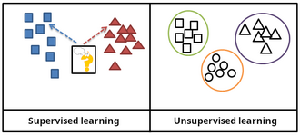
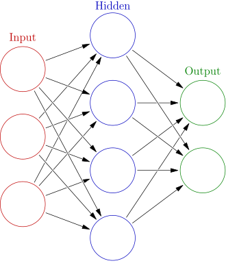
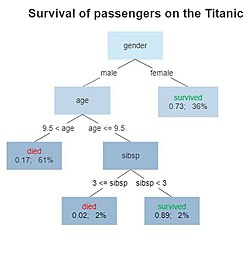
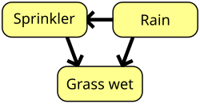

# 机器学习｜精选补充资料

> 来源：[维基百科（中文）](https://zh.wikipedia.org/wiki/%E6%9C%BA%E5%99%A8%E5%AD%A6%E4%B9%A0)  
> 许可：[CC BY-SA 4.0](https://creativecommons.org/licenses/by-sa/4.0/)  
> 语言：简体中文  
> 获取时间：2026-08-08T09:44:10.172796+00:00

维基百科，自由的百科全书

**提示**：此条目的主题不是**[机械学习](/wiki/%E6%9C%BA%E6%A2%B0%E5%AD%A6%E4%B9%A0 "机械学习")**或**[机器人学习](/wiki/%E6%9C%BA%E5%99%A8%E4%BA%BA%E5%AD%A6%E4%B9%A0 "机器人学习")**。

**机器学习**（英語：machine learning，简称ML）是[人工智能](/wiki/%E4%BA%BA%E5%B7%A5%E6%99%BA%E8%83%BD "人工智能")的一个分支。机器学习理论主要是设计和分析一些让[计算机](/wiki/%E7%94%B5%E5%AD%90%E8%AE%A1%E7%AE%97%E6%9C%BA "电子计算机")可以自动“[学习](/wiki/%E5%AD%A6%E4%B9%A0 "学习")”的[算法](/wiki/%E7%AE%97%E6%B3%95 "算法")。机器学习算法是一类从[数据](/wiki/%E6%95%B0%E6%8D%AE "数据")中自动分析获得[规律](/wiki/%E8%A7%84%E5%BE%8B "规律")，并利用规律对未知数据进行预测的算法。因为学习算法中涉及了大量的统计学理论，机器学习与[推断统计学](/wiki/%E6%8E%A8%E6%96%AD%E7%BB%9F%E8%AE%A1%E5%AD%A6 "推断统计学")联系尤为密切，也被称为**统计学习理论**。算法设计方面，机器学习理论关注可以实现的，行之有效的学习算法（要防止錯誤累積）。很多[推论](/wiki/%E6%8E%A8%E8%AE%BA "推论")问题属于[非程序化決策](/w/index.php?title=%E9%9D%9E%E7%A8%8B%E5%BA%8F%E5%8C%96%E6%B1%BA%E7%AD%96&action=edit&redlink=1 "非程序化決策（页面不存在）")，所以部分的机器学习研究是开发容易处理的近似算法。

机器学习已广泛应用于[数据挖掘](/wiki/%E6%95%B0%E6%8D%AE%E6%8C%96%E6%8E%98 "数据挖掘")、[计算机视觉](/wiki/%E8%AE%A1%E7%AE%97%E6%9C%BA%E8%A7%86%E8%A7%89 "计算机视觉")、[自然语言处理](/wiki/%E8%87%AA%E7%84%B6%E8%AF%AD%E8%A8%80%E5%A4%84%E7%90%86 "自然语言处理")、[生物特征识别](/wiki/%E7%94%9F%E7%89%A9%E7%89%B9%E5%BE%81%E8%AF%86%E5%88%AB "生物特征识别")、[搜索引擎](/wiki/%E6%90%9C%E7%B4%A2%E5%BC%95%E6%93%8E "搜索引擎")、[医学诊断](/wiki/%E8%AF%8A%E6%96%AD "诊断")、检测[信用卡詐騙](/wiki/%E4%BF%A1%E7%94%A8%E5%8D%A1%E8%A9%90%E9%A8%99 "信用卡詐騙")、[证券市场](/wiki/%E8%AD%89%E5%88%B8%E5%B8%82%E5%A0%B4 "證券市場")分析、[DNA序列](/wiki/DNA%E5%BA%8F%E5%88%97 "DNA序列")测序、[语音](/wiki/%E8%AF%AD%E9%9F%B3%E8%AF%86%E5%88%AB "语音识别")和[手写](/wiki/%E6%89%8B%E5%86%99%E8%AF%86%E5%88%AB "手写识别")识别、[游戏](/wiki/%E6%B8%B8%E6%88%8F "游戏")和[机器人](/wiki/%E6%9C%BA%E5%99%A8%E4%BA%BA "机器人")等领域。机器学习在近30多年已发展为一门多领域[科际整合](/wiki/%E7%A7%91%E9%99%85%E6%95%B4%E5%90%88 "科际整合")，涉及[概率论](/wiki/%E6%A6%82%E7%8E%87%E8%AE%BA "概率论")、[统计学](/wiki/%E7%BB%9F%E8%AE%A1%E5%AD%A6 "统计学")、[逼近论](/wiki/%E9%80%BC%E8%BF%91%E8%AE%BA "逼近论")、[凸分析](/wiki/%E5%87%B8%E5%88%86%E6%9E%90 "凸分析")、[计算复杂性理论](/wiki/%E8%AE%A1%E7%AE%97%E5%A4%8D%E6%9D%82%E6%80%A7%E7%90%86%E8%AE%BA "计算复杂性理论")、[資訊理論](/wiki/%E8%B3%87%E8%A8%8A%E7%90%86%E8%AB%96 "資訊理論")等多门学科。

参见：[机器学习概述](/wiki/%E6%9C%BA%E5%99%A8%E5%AD%A6%E4%B9%A0%E6%A6%82%E8%BF%B0 "机器学习概述")

## 定義

機器學習有下面幾種定義：

* 機器學習是一門人工智能的科學，該領域的主要研究對象是人工智能，特別是如何在經驗學習中改善具體算法的性能。
* 機器學習是對能通過經驗自動改進的計算機算法的研究。
* 機器學習是用數據或以往的經驗，以此優化計算機程序的性能標準。

另外，電腦科學家[湯姆·米切爾](/w/index.php?title=%E6%B9%AF%E5%A7%86%C2%B7%E9%BA%A5%E7%A7%8B%C2%B7%E7%B1%B3%E5%88%87%E7%88%BE&action=edit&redlink=1 "湯姆·麥秋·米切爾（页面不存在）")（英语：[Tom M. Mitchell](https://en.wikipedia.org/wiki/Tom_M._Mitchell "en:Tom M. Mitchell")）在其著作的Machine Learning一書中定義的機器學習為：

> A computer program is said to learn from experience E with respect to some class of tasks T and performance measure P, if its performance at tasks in T, as measured by P, improves with experience E.
>
> ——Tom Mitchell，Machine Learning

## 历史

参见：[人工智能史](/wiki/%E4%BA%BA%E5%B7%A5%E6%99%BA%E8%83%BD%E5%8F%B2 "人工智能史")

## 与其他领域的关系

作为一项科学事业，机器学习源自人类对[人工智能](/wiki/%E4%BA%BA%E5%B7%A5%E6%99%BA%E8%83%BD "人工智能")（Artificial Intelligence，简称AI）的探索。在人工智能成为学术领域的早期，一些研究者便尝试让机器从数据中学习。他们一方面采用多种符号方法（symbolic methods）处理这一问题，另一方面也使用当时称为“[神经网络](/wiki/%E4%BA%BA%E5%B7%A5%E7%A5%9E%E7%BB%8F%E7%BD%91%E7%BB%9C "人工神经网络")”（neural networks）的模型。这类神经网络主要包括[感知机](/wiki/%E6%84%9F%E7%9F%A5%E6%9C%BA "感知机")（perceptrons）及其他模型，后来被认为相当于对统计学中[广义线性模型](/wiki/%E5%BB%A3%E7%BE%A9%E7%B7%9A%E6%80%A7%E6%A8%A1%E5%9E%8B "廣義線性模型")（generalized linear models）的重新发明。此外，研究者还广泛使用[概率推理](/w/index.php?title=%E6%A6%82%E7%8E%87%E6%8E%A8%E7%90%86&action=edit&redlink=1 "概率推理（页面不存在）")（probabilistic reasoning）方法，尤其是在自动化医学诊断领域。

然而，随着学术界对逻辑和基于知识的（knowledge-based）方法日益强调，人工智能（AI）和机器学习之间逐渐产生了分歧。[概率系统](/w/index.php?title=%E6%A6%82%E7%8E%87%E7%B3%BB%E7%BB%9F&action=edit&redlink=1 "概率系统（页面不存在）")（probabilistic systems）也面临着数据获取和数据表示方面的理论与实际问题。到1980年左右，[专家系统](/wiki/%E4%B8%93%E5%AE%B6%E7%B3%BB%E7%BB%9F "专家系统")（expert systems）开始在人工智能领域占据主导地位，统计学方法逐渐被边缘化。在AI领域内部，[符号学习](/w/index.php?title=%E7%AC%A6%E5%8F%B7%E5%AD%A6%E4%B9%A0&action=edit&redlink=1 "符号学习（页面不存在）")（symbolic learning）或[知识学习](/w/index.php?title=%E7%9F%A5%E8%AF%86%E5%AD%A6%E4%B9%A0&action=edit&redlink=1 "知识学习（页面不存在）")（knowledge-based learning）的研究依然继续，并催生了归纳逻辑编程（inductive logic programming，简称ILP）。而更为侧重统计方法的研究，则逐渐被归类到[模式识别](/wiki/%E6%A8%A1%E5%BC%8F%E8%AF%86%E5%88%AB "模式识别")（pattern recognition）和[信息检索](/wiki/%E4%BF%A1%E6%81%AF%E6%A3%80%E7%B4%A2 "信息检索")（information retrieval）等领域，不再属于AI的核心研究方向。同时，神经网络（neural networks）的研究也在AI和计算机科学（computer science）领域被逐渐放弃。这条研究路径后来在AI和计算机科学之外继续发展，形成了以“[联结主义](/wiki/%E8%81%94%E7%BB%93%E4%B8%BB%E4%B9%89 "联结主义")”（connectionism）为代表的学派，由其他领域的研究者推动，如[约翰·霍普菲尔德](/wiki/%E7%BA%A6%E7%BF%B0%C2%B7%E9%9C%8D%E6%99%AE%E8%8F%B2%E5%B0%94%E5%BE%B7 "约翰·霍普菲尔德")（John Hopfield）、[大卫·鲁梅尔哈特](/w/index.php?title=%E5%A4%A7%E5%8D%AB%C2%B7%E9%B2%81%E6%A2%85%E5%B0%94%E5%93%88%E7%89%B9&action=edit&redlink=1 "大卫·鲁梅尔哈特（页面不存在）")（David Rumelhart）和[杰弗里·辛顿](/wiki/%E6%9D%B0%E5%BC%97%E9%87%8C%C2%B7%E8%BE%9B%E9%A1%BF "杰弗里·辛顿")（Geoffrey Hinton）等人。他们的研究在1980年代中期取得了重要突破，其中以反向传播算法（backpropagation）的重新发现最为显著。

机器学习（Machine Learning，简称ML）在1990年代被重新整合并确立为独立的研究领域，并开始蓬勃发展。这一领域的目标也从最初追求实现[人工智能](/wiki/%E4%BA%BA%E5%B7%A5%E6%99%BA%E8%83%BD "人工智能")（Artificial Intelligence，简称AI），转变为解决实际中能够被有效解决的问题。研究重心逐渐远离了继承自AI的[符号方法](/w/index.php?title=%E7%AC%A6%E5%8F%B7%E6%96%B9%E6%B3%95&action=edit&redlink=1 "符号方法（页面不存在）")（symbolic approaches），转向了从[统计学](/wiki/%E7%BB%9F%E8%AE%A1%E5%AD%A6 "统计学")（statistics）、[模糊逻辑](/wiki/%E6%A8%A1%E7%B3%8A%E9%80%BB%E8%BE%91 "模糊逻辑")（fuzzy logic）以及[概率理论](/w/index.php?title=%E6%A6%82%E7%8E%87%E7%90%86%E8%AE%BA&action=edit&redlink=1 "概率理论（页面不存在）")（probability theory）中借鉴的方法和模型。

## 理论

主条目：[计算学习理论](/w/index.php?title=%E8%AE%A1%E7%AE%97%E5%AD%A6%E4%B9%A0%E7%90%86%E8%AE%BA&action=edit&redlink=1 "计算学习理论（页面不存在）")和[统计学习理论](/wiki/%E7%BB%9F%E8%AE%A1%E5%AD%A6%E4%B9%A0%E7%90%86%E8%AE%BA "统计学习理论")

学习器（learner）的核心目标之一是从经验中进行泛化（generalize）。在这一背景下，泛化指的是学习机器在经历了训练数据集（learning data set）之后，能够在新出现的、未曾见过的样本或任务上准确表现的能力。这些训练样本通常来自某个未知的概率分布（probability distribution，这个概率分布被认为能代表真实场景中事件的分布空间），学习器需要基于这些数据构建出一个一般化的模型，从而能够对新的情景或样本做出足够准确的预测。

对机器学习算法及其性能进行的计算分析，是[理论计算机科学](/wiki/%E7%90%86%E8%AE%BA%E8%AE%A1%E7%AE%97%E6%9C%BA%E7%A7%91%E5%AD%A6 "理论计算机科学")（theoretical computer science）的一个分支，称为[计算学习理论](/w/index.php?title=%E8%AE%A1%E7%AE%97%E5%AD%A6%E4%B9%A0%E7%90%86%E8%AE%BA&action=edit&redlink=1 "计算学习理论（页面不存在）")（computational learning theory），通常通过[概率近似正确学习模型](/w/index.php?title=%E6%A6%82%E7%8E%87%E8%BF%91%E4%BC%BC%E6%AD%A3%E7%A1%AE%E5%AD%A6%E4%B9%A0%E6%A8%A1%E5%9E%8B&action=edit&redlink=1 "概率近似正确学习模型（页面不存在）")（probably approximately correct learning，简称PAC Learning）实现。由于[训练集](/wiki/%E8%AE%AD%E7%BB%83%E9%9B%86 "训练集")（training sets）是有限的，而未来又充满不确定性，因此学习理论通常并不能绝对保证算法的表现；取而代之的是，通常会给出算法性能的[概率性界限](/w/index.php?title=%E6%A6%82%E7%8E%87%E6%80%A7%E7%95%8C%E9%99%90&action=edit&redlink=1 "概率性界限（页面不存在）")（probabilistic bounds）。[偏差-方差分解](/w/index.php?title=%E5%81%8F%E5%B7%AE-%E6%96%B9%E5%B7%AE%E5%88%86%E8%A7%A3&action=edit&redlink=1 "偏差-方差分解（页面不存在）")（bias–variance decomposition）是一种用于量化[泛化误差](/wiki/%E6%B3%9B%E5%8C%96%E8%AF%AF%E5%B7%AE "泛化误差")（generalization error）的方法。

为了获得最佳的泛化（generalization）性能，假设（hypothesis，也即模型）的复杂度应与数据背后的真实函数（function）的复杂度相匹配。如果假设的复杂度低于真实函数的复杂度，那么模型就会出现欠拟合（underfitting）的现象；在这种情况下，适当增加模型的复杂度可以降低训练误差（training error）。然而，如果假设的复杂度过高，模型又会面临过拟合（overfitting）问题，从而导致泛化能力下降。

除了研究性能界限（performance bounds）之外，学习理论的研究人员也关注学习的时间复杂度（time complexity）和可行性（feasibility）。在计算学习理论（computational learning theory）中，如果某个计算可以在多项式时间（polynomial time）内完成，那么就被视为是可行的（feasible）。关于时间复杂度，有两种类型的结果：

* 正面结果（Positive results） 表明某一类函数可以在多项式时间内被学习；
* 负面结果（Negative results） 表明某些函数类别无法在多项式时间内被学习。

## 分类

在监督学习（supervised learning）中，训练数据带有预期的输出标签，模型的任务是学习输入与输出之间的映射关系；而在[无监督学习](/wiki/%E7%84%A1%E7%9B%A3%E7%9D%A3%E5%AD%B8%E7%BF%92 "無監督學習")（unsupervised learning）中，数据是未标注的，模型需要在没有明确答案的情况下，自主发现其中的模式或结构。

机器学习方法传统上被划分为以下几类，对应不同的学习范式（learning paradigms），具体取决于学习系统可获得的“信号”或“反馈”的类型：

* [监督学习](/wiki/%E7%9B%91%E7%9D%A3%E5%AD%A6%E4%B9%A0 "监督学习")：从给定的训练数据集中学习出一个函数，当新的数据到来时，可以根据这个函数预测结果。监督学习的训练集要求是包括输入和输出，也可以说是特征和目标。训练集中的目标是由人标注的。常见的监督学习算法包括[回归分析](/wiki/%E5%9B%9E%E5%BD%92%E5%88%86%E6%9E%90 "回归分析")和[统计分类](/wiki/%E7%BB%9F%E8%AE%A1%E5%88%86%E7%B1%BB "统计分类")。监督学习和非监督学习的差别就是训练集目标是否有人为标注。他们都有训练集 且都有输入和输出
* [无监督学习](/wiki/%E9%9D%9E%E7%9B%A3%E7%9D%A3%E5%BC%8F%E5%AD%B8%E7%BF%92 "非監督式學習")：与监督学习相比，训练集没有人为标注的结果。常见的无监督学习算法有[生成對抗網絡](/wiki/%E7%94%9F%E6%88%90%E5%AF%B9%E6%8A%97%E7%BD%91%E7%BB%9C "生成对抗网络")（GAN）、[聚类](/wiki/%E8%81%9A%E7%B1%BB "聚类")。
* [半监督学习](/wiki/%E5%8D%8A%E7%9B%91%E7%9D%A3%E5%AD%A6%E4%B9%A0 "半监督学习")：介于监督学习与无监督学习之间。
* [强化学习](/wiki/%E5%BC%BA%E5%8C%96%E5%AD%A6%E4%B9%A0 "强化学习")：机器为了达成目标，随着环境的变动，而逐步调整其行为，并评估每一个行动之后所到的回馈是正向的或负向的。

## 模型与方法

参见：[机器学习概述 § 机器学习方法](/wiki/%E6%9C%BA%E5%99%A8%E5%AD%A6%E4%B9%A0%E6%A6%82%E8%BF%B0#机器学习方法 "机器学习概述")

机器学习模型是一种[数学模型](/wiki/%E6%95%B0%E5%AD%A6%E6%A8%A1%E5%9E%8B "数学模型")，在经过某个数据集的“训练”之后，可以用于对新数据进行预测或分类。在训练过程中，学习算法会通过迭代不断调整模型的内部参数，以尽可能减少预测误差。广义上，“模型”一词可以指代不同层级的内容：既可以是某一类模型及其对应的学习算法，也可以是所有内部参数都已经调整完毕、训练完成的具体模型。

在机器学习系统中，已经研究和应用了多种类型的模型。为特定任务选择最合适的模型的过程被称为[模型选择](/wiki/%E6%A8%A1%E5%9E%8B%E9%80%89%E6%8B%A9 "模型选择")（model selection）\*\*。

具体的机器学习模型有：

* 构造[间隔理论](/w/index.php?title=%E9%97%B4%E9%9A%94%E7%90%86%E8%AE%BA&action=edit&redlink=1 "间隔理论（页面不存在）")分布：[聚类分析](/wiki/%E8%81%9A%E7%B1%BB%E5%88%86%E6%9E%90 "聚类分析")和[模式识别](/wiki/%E6%A8%A1%E5%BC%8F%E8%AF%86%E5%88%AB "模式识别")
  + [人工神经网络](/wiki/%E4%BA%BA%E5%B7%A5%E7%A5%9E%E7%BB%8F%E7%BD%91%E7%BB%9C "人工神经网络")
  + [决策树](/wiki/%E5%86%B3%E7%AD%96%E6%A0%91 "决策树")
  + [感知器](/wiki/%E6%84%9F%E7%9F%A5%E5%99%A8 "感知器")
  + [支援向量機](/wiki/%E6%94%AF%E6%8F%B4%E5%90%91%E9%87%8F%E6%A9%9F "支援向量機")
  + [集成学习](/wiki/%E9%9B%86%E6%88%90%E5%AD%A6%E4%B9%A0 "集成学习")[AdaBoost](/wiki/AdaBoost "AdaBoost")
  + [降维](/wiki/%E9%99%8D%E7%BB%B4 "降维")与[度量学习](/w/index.php?title=%E5%BA%A6%E9%87%8F%E5%AD%A6%E4%B9%A0&action=edit&redlink=1 "度量学习（页面不存在）")
  + [聚类](/wiki/%E8%81%9A%E7%B1%BB "聚类")
  + [贝叶斯分类器](/wiki/%E6%9C%B4%E7%B4%A0%E8%B4%9D%E5%8F%B6%E6%96%AF%E5%88%86%E7%B1%BB%E5%99%A8 "朴素贝叶斯分类器")
* 构造[条件概率](/wiki/%E6%9D%A1%E4%BB%B6%E6%A6%82%E7%8E%87 "条件概率")：[回归分析](/wiki/%E5%9B%9E%E5%BD%92%E5%88%86%E6%9E%90 "回归分析")和[统计分类](/wiki/%E7%BB%9F%E8%AE%A1%E5%88%86%E7%B1%BB "统计分类")
  + [高斯过程回归](/w/index.php?title=Kriging&action=edit&redlink=1 "Kriging（页面不存在）")
  + [线性判别分析](/wiki/%E7%BA%BF%E6%80%A7%E5%88%A4%E5%88%AB%E5%88%86%E6%9E%90 "线性判别分析")
  + [最近邻居法](/wiki/%E6%9C%80%E8%BF%91%E9%84%B0%E5%B1%85%E6%B3%95 "最近鄰居法")
  + [径向基函数核](/wiki/%E5%BE%84%E5%90%91%E5%9F%BA%E5%87%BD%E6%95%B0%E6%A0%B8 "径向基函数核")
* 通过[再生模型](/w/index.php?title=%E5%86%8D%E7%94%9F%E6%A8%A1%E5%9E%8B&action=edit&redlink=1 "再生模型（页面不存在）")构造[概率密度函数](/wiki/%E6%A6%82%E7%8E%87%E5%AF%86%E5%BA%A6%E5%87%BD%E6%95%B0 "概率密度函数")：
  + [最大期望算法](/wiki/%E6%9C%80%E5%A4%A7%E6%9C%9F%E6%9C%9B%E7%AE%97%E6%B3%95 "最大期望算法")
  + [概率图模型](/wiki/%E5%9C%96%E6%A8%A1%E5%BC%8F "圖模式")：包括[貝氏網路](/wiki/%E8%B2%9D%E6%B0%8F%E7%B6%B2%E8%B7%AF "貝氏網路")和[Markov随机场](/w/index.php?title=Markov%E9%9A%8F%E6%9C%BA%E5%9C%BA&action=edit&redlink=1 "Markov随机场（页面不存在）")
  + [Generative Topographic Mapping](/w/index.php?title=Generative_Topographic_Mapping&action=edit&redlink=1 "Generative Topographic Mapping（页面不存在）")
* 近似推断技术：
  + [马尔可夫链](/wiki/%E9%A9%AC%E5%B0%94%E5%8F%AF%E5%A4%AB%E9%93%BE "马尔可夫链")
  + [蒙特卡罗方法](/wiki/%E8%92%99%E7%89%B9%E5%8D%A1%E7%BD%97%E6%96%B9%E6%B3%95 "蒙特卡罗方法")
  + [变分法](/wiki/%E5%8F%98%E5%88%86%E6%B3%95 "变分法")
* [最优化](/wiki/%E6%9C%80%E4%BC%98%E5%8C%96 "最优化")：大多数以上方法，直接或者间接使用最优化算法。
* [量子機器學習](/wiki/%E9%87%8F%E5%AD%90%E6%A9%9F%E5%99%A8%E5%AD%B8%E7%BF%92 "量子機器學習")

### 人工神经网络

主条目：[人工神经网络](/wiki/%E4%BA%BA%E5%B7%A5%E7%A5%9E%E7%BB%8F%E7%BD%91%E7%BB%9C "人工神经网络")

参见：[深度学习](/wiki/%E6%B7%B1%E5%BA%A6%E5%AD%A6%E4%B9%A0 "深度学习")

人工神经网络（Artificial Neural Network，简称ANN）是由多个节点（node）相互连接构成的结构，类似于大脑中由[神经元](/wiki/%E7%A5%9E%E7%BB%8F%E5%85%83 "神经元")（neurons）组成的庞大网络。在这个网络中，每一个圆形节点代表一个[人工神经元](/w/index.php?title=%E4%BA%BA%E5%B7%A5%E7%A5%9E%E7%BB%8F%E5%85%83&action=edit&redlink=1 "人工神经元（页面不存在）")（artificial neuron），而箭头表示从一个神经元的输出传递到另一个神经元输入的连接。

人工神经网络（Artificial Neural Networks，简称ANNs），又称[联结主义系统](/w/index.php?title=%E8%81%94%E7%BB%93%E4%B8%BB%E4%B9%89%E7%B3%BB%E7%BB%9F&action=edit&redlink=1 "联结主义系统（页面不存在）")（connectionist systems），是一类受动物大脑中[生物神经网络](/wiki/%E7%94%9F%E7%89%A9%E7%A5%9E%E7%BB%8F%E7%BD%91%E7%BB%9C "生物神经网络")启发而构建的计算系统。这类系统通过学习样本来完成任务，而通常不依赖于任何针对特定任务的预设规则。换句话说，它们是通过观察大量示例，逐步“学会”如何解决问题的。

人工神经网络（ANN）是一种由多个相互连接的单元或节点构成的模型，这些节点被称为“[人工神经元](/w/index.php?title=%E4%BA%BA%E5%B7%A5%E7%A5%9E%E7%BB%8F%E5%85%83&action=edit&redlink=1 "人工神经元（页面不存在）")”，其灵感来源于生物大脑中的神经元。在人工神经网络中，每个连接类似于生物大脑中的突触，可以在人工神经元之间传递信息，也就是“信号”。

一个接收到信号的人工神经元可以对其进行处理，并将处理后的信号传递给与其连接的其他人工神经元。在常见的ANN实现中，神经元之间连接所传递的信号是一个[实数](/wiki/%E5%AE%9E%E6%95%B0 "实数")，而每个人工神经元的输出是其所有输入的加权和经过某种非线性函数变换后的结果。

神经元之间的连接称为“边”（edges）。人工神经元和连接边通常都带有一个[权重](/wiki/%E6%9D%83%E9%87%8D "权重")，这个权重会随着学习过程的进行而调整。权重决定了信号传递的强度，权重越大，信号越强。有些人工神经元还设有阈值：只有当接收到的总信号超过该阈值时，才会传递输出信号。

通常，人工神经元会被组织成不同的层（layers）。不同的层可能对输入执行不同类型的变换。信号从第一层（输入层）开始，一直传递到最后一层（输出层），过程中可能会多次经过中间的隐藏层。

人工神经网络（ANN）最初的目标是模拟人脑的工作方式来解决问题。然而，随着时间的推移，研究重点逐渐转向如何高效地完成特定任务，这也导致了神经网络的发展逐渐偏离了生物学上的真实神经结构。

尽管如此，人工神经网络已经在众多领域得到了广泛应用，包括：

* [计算机视觉](/wiki/%E8%AE%A1%E7%AE%97%E6%9C%BA%E8%A7%86%E8%A7%89 "计算机视觉")（computer vision）
* [语音识别](/wiki/%E8%AF%AD%E9%9F%B3%E8%AF%86%E5%88%AB "语音识别")（speech recognition）
* [机器翻译](/wiki/%E6%9C%BA%E5%99%A8%E7%BF%BB%E8%AF%91 "机器翻译")（machine translation）
* [社交网络内容过滤](/w/index.php?title=%E7%A4%BE%E4%BA%A4%E7%BD%91%E7%BB%9C%E5%86%85%E5%AE%B9%E8%BF%87%E6%BB%A4&action=edit&redlink=1 "社交网络内容过滤（页面不存在）")（social network filtering）
* [棋类与电子游戏](/w/index.php?title=%E6%A3%8B%E7%B1%BB%E4%B8%8E%E7%94%B5%E5%AD%90%E6%B8%B8%E6%88%8F&action=edit&redlink=1 "棋类与电子游戏（页面不存在）")（playing board and video games）
* [医学诊断](/wiki/%E9%86%AB%E5%AD%B8%E8%A8%BA%E6%96%B7 "醫學診斷")（medical diagnosis）

这些成功应用证明了神经网络在解决复杂、非线性问题方面的强大能力。

[深度学习](/wiki/%E6%B7%B1%E5%BA%A6%E5%AD%A6%E4%B9%A0 "深度学习")（Deep Learning）是指在人工神经网络中引入多个隐藏层（hidden layers）的一种方法。这种方法试图模拟人脑将光和声音转化为视觉和听觉的处理方式。深度学习在多个领域取得了显著成果，其中[计算机视觉](/wiki/%E8%AE%A1%E7%AE%97%E6%9C%BA%E8%A7%86%E8%A7%89 "计算机视觉")（computer vision）和[语音识别](/wiki/%E8%AF%AD%E9%9F%B3%E8%AF%86%E5%88%AB "语音识别")（speech recognition）是其最成功的应用之一。

### 决策树

主条目：[决策树学习](/wiki/%E5%86%B3%E7%AD%96%E6%A0%91%E5%AD%A6%E4%B9%A0 "决策树学习")

这是一棵用于展示[泰坦尼克号](/wiki/%E6%B3%B0%E5%9D%A6%E5%B0%BC%E5%85%8B%E5%8F%B7 "泰坦尼克号")（Titanic）乘客生存概率的决策树（Decision Tree）。它通过一系列的“如果...那么...”的决策规则，对数据进行分裂，最终预测结果。在泰坦尼克号的例子中，决策树可能会根据以下特征进行分裂，例如：乘客的性别（gender）、年龄（Age）、是否有家庭成员同行（SibSp）等。

决策树学习（Decision Tree Learning）是一种使用[决策树](/wiki/%E5%86%B3%E7%AD%96%E6%A0%91 "决策树")作为[预测模型](/w/index.php?title=%E9%A2%84%E6%B5%8B%E6%A8%A1%E5%9E%8B&action=edit&redlink=1 "预测模型（页面不存在）")的方法，通过对一个对象的观察（表示在树的分支上），推导出该对象的目标值（表示在叶子节点上）。它是统计学、数据挖掘和机器学习中常用的一种预测建模方法。

* 当目标变量是离散值（例如分类标签）时，所构建的树被称为[分类树](/w/index.php?title=%E5%88%86%E7%B1%BB%E6%A0%91&action=edit&redlink=1 "分类树（页面不存在）")（Classification Tree）。在这类树结构中，叶子节点代表类别标签，分支则代表导致这些标签的特征组合。

* 当目标变量是连续值（通常是实数）时，该树称为[回归树](/w/index.php?title=%E5%9B%9E%E5%BD%92%E6%A0%91&action=edit&redlink=1 "回归树（页面不存在）")（Regression Tree）。

在[决策分析](/wiki/%E5%86%B3%E7%AD%96%E5%88%86%E6%9E%90 "决策分析")（Decision Analysis）中，决策树可以被用来直观、明确地表示决策过程及其可能结果。而在数据挖掘（Data Mining）中，决策树不仅可以用来描述数据本身，其生成的分类树还可以作为后续决策的依据。

总结来说，决策树是一种结构清晰、解释性强的模型，适合处理既有分类又有回归问题。

### 随机森林回归

随机森林回归（Random forest regression, RFR）属于基于[决策树](/wiki/%E5%86%B3%E7%AD%96%E6%A0%91 "决策树")的模型范畴。RFR 是一种集成学习方法（ensemble learning method），它通过构建多个决策树并对其预测结果进行平均，从而提高预测的准确性并有效避免过拟合。

在构建决策树的过程中，RFR 采用[自助采样法](/w/index.php?title=%E8%87%AA%E5%8A%A9%E9%87%87%E6%A0%B7%E6%B3%95&action=edit&redlink=1 "自助采样法（页面不存在）")（bootstrapped sampling），也就是说，每棵决策树都是在训练集中随机抽取的一部分数据上进行训练的。这种训练方式的“随机性”有助于减少模型的偏差，使预测结果更加准确。

RFR 会生成相互独立的多个决策树，它既可以用于单一输出变量的回归问题，也可以用于[多回归任务](/w/index.php?title=%E5%A4%9A%E5%9B%9E%E5%BD%92%E4%BB%BB%E5%8A%A1&action=edit&redlink=1 "多回归任务（页面不存在）")（multiple regressor task）。这种灵活性使得 RFR 能够被广泛应用于各种实际场景中。

### 支持向量机

主条目：[支持向量机](/wiki/%E6%94%AF%E6%8C%81%E5%90%91%E9%87%8F%E6%9C%BA "支持向量机")

支持向量机（SVM），也称为支持向量网络（Support-Vector Networks），是一组用于分类（classification）和回归（regression）的监督学习方法。在给定一组训练样本的前提下，其中每个样本都被标注为属于两个类别之一，SVM 的训练算法会构建一个模型，用来预测新的样本属于哪个类别。SVM 是一种非概率性的二分类线性分类器，虽然也有像 [Platt scaling](/w/index.php?title=Platt_scaling&action=edit&redlink=1 "Platt scaling（页面不存在）") 这样的扩展方法，可以使其应用于概率分类任务。

除了进行线性分类，SVM 还可以借助所谓的核技巧（kernel trick），高效地实现非线性分类。这种方法通过隐式地将输入映射到高维特征空间，使得在原本线性不可分的问题中，也能找到一个可分的超平面，从而实现更复杂的分类效果。

### 回归分析

主条目：[回归分析](/wiki/%E5%9B%9E%E5%BD%92%E5%88%86%E6%9E%90 "回归分析")

回归分析（Regression analysis）是一个涵盖广泛的统计方法集合，主要用于估计输入变量与其相关特征之间的关系。其中最常见的形式是[线性回归](/wiki/%E7%B7%9A%E6%80%A7%E5%9B%9E%E6%AD%B8 "線性回歸")（Linear Regression），通过一条直线来最优地拟合给定数据，这条线通常依据某种数学准则（如[最小二乘法](/wiki/%E6%9C%80%E5%B0%8F%E4%BA%8C%E4%B9%98%E6%B3%95 "最小二乘法")，Ordinary Least Squares）确定。

为了减轻过拟合（overfitting）和偏差（bias）的问题，线性回归往往会结合[正则化方法](/w/index.php?title=%E6%AD%A3%E5%88%99%E5%8C%96%E6%96%B9%E6%B3%95&action=edit&redlink=1 "正则化方法（页面不存在）")（regularization methods）进行扩展，例如[岭回归](/wiki/%E5%B2%AD%E5%9B%9E%E5%BD%92 "岭回归")（Ridge Regression）。

在面对非线性问题时，常用的替代模型包括：

* [多项式回归](/wiki/%E5%A4%9A%E9%A1%B9%E5%BC%8F%E5%9B%9E%E5%BD%92 "多项式回归")（Polynomial Regression）：如 Microsoft Excel 中用于趋势线拟合的工具；
* [逻辑回归](/wiki/%E9%80%BB%E8%BE%91%E5%9B%9E%E5%BD%92 "逻辑回归")（Logistic Regression）：广泛用于统计分类任务；
* [核回归](/wiki/%E6%A0%B8%E5%9B%9E%E5%BD%92 "核回归")（Kernel Regression）：利用核技巧（kernel trick）将输入变量隐式映射到更高维空间，从而引入非线性。

这些模型能够更灵活地拟合和预测现实中复杂的数据关系。

[多元线性回归](/w/index.php?title=%E5%A4%9A%E5%85%83%E7%BA%BF%E6%80%A7%E5%9B%9E%E5%BD%92&action=edit&redlink=1 "多元线性回归（页面不存在）")（Multivariate Linear Regression）是在传统线性回归的基础上扩展而来的，用于同时处理多个因变量（输出变量）的情况。这种方法通过拟合一个多维线性模型，来估计一组输入变量与多个输出变量之间的关系。

多元线性回归特别适用于以下场景：

* 输出变量之间存在相互依赖关系；
* 多个输出共享某种潜在的模式或结构。

例如：

* 同时预测多个经济指标；
* 重建图像数据（图像本身是多维结构）。

这种方法在处理复杂、关联性强的多输出问题时，能提供更全面和准确的建模能力。

### 贝叶斯网络

主条目：[贝叶斯网络](/wiki/%E8%B4%9D%E5%8F%B6%E6%96%AF%E7%BD%91%E7%BB%9C "贝叶斯网络")

这是一个简单的贝叶斯网络示例：下雨（Rain）会影响洒水器（Sprinkler）是否启动；而下雨和洒水器的状态共同决定草地是否湿（Grass Wet）

贝叶斯网络（Bayesian Network），又称信念网络（Belief Network）或有向无环图模型（Directed Acyclic Graphical Model），是一种概率图模型（probabilistic graphical model），它通过一个[有向无环图](/wiki/%E6%9C%89%E5%90%91%E6%97%A0%E7%8E%AF%E5%9B%BE "有向无环图")（Directed Acyclic Graph,DAG）来表示一组随机变量之间的条件独立性关系。

例如，一张贝叶斯网络可以用于表示疾病与症状之间的概率关系。当给定一些症状时，可以利用该网络计算出不同疾病出现的概率，从而辅助判断可能的病因。

贝叶斯网络配有高效的推理与学习算法，能够处理复杂的概率推断任务。

进一步扩展：

* 如果贝叶斯网络用于表示变量序列（如语音信号、蛋白质序列等），这样的模型称为动态贝叶斯网络（Dynamic Bayesian Networks）。
* 能够在不确定性下表示并解决决策问题的贝叶斯网络模型，称为影响图（Influence Diagrams）。

这些图模型在医学诊断、语音识别、机器人决策等领域都有重要应用。

### 高斯过程

主条目：[高斯过程](/wiki/%E9%AB%98%E6%96%AF%E8%BF%87%E7%A8%8B "高斯过程")

高斯过程（Gaussian Processes）是一种[随机过程](/wiki/%E9%9A%8F%E6%9C%BA%E8%BF%87%E7%A8%8B "随机过程")（stochastic process），其特点是：在该过程中，任意有限数量的随机变量都服从一个[多元正态分布](/wiki/%E5%A4%9A%E5%85%83%E6%AD%A3%E6%80%81%E5%88%86%E5%B8%83 "多元正态分布")（multivariate normal distribution）。高斯过程依赖于一个预定义的[协方差函数](/wiki/%E5%8D%8F%E6%96%B9%E5%B7%AE%E5%87%BD%E6%95%B0 "协方差函数")（covariance function）或称核函数（kernel），用于建模不同点之间的关系，这种关系取决于它们在空间中的位置。

在给定一组已观测的数据点（即输入-输出样本）后，我们可以通过这些已知点之间的协方差，以及它们与某个新的、未观测点之间的协方差，直接计算该新点的输出值的概率分布，这是高斯过程的核心能力之一。

高斯过程在[贝叶斯优化](/wiki/%E8%B4%9D%E5%8F%B6%E6%96%AF%E4%BC%98%E5%8C%96 "贝叶斯优化")（Bayesian Optimization）中非常受欢迎，常被用作替代模型（surrogate model），特别适合用于[超参数优化](/wiki/%E8%B6%85%E5%8F%82%E6%95%B0%E4%BC%98%E5%8C%96 "超参数优化")（hyperparameter optimization）等任务。

## 软件

包含各種機器學習演算法的[軟體套裝](/wiki/%E8%BB%9F%E9%AB%94%E5%A5%97%E8%A3%9D "軟體套裝")包括：

### 自由开源软件

参见：[Machine\_learning#Software](/w/index.php?title=Machine_learning&action=edit&redlink=1 "Machine learning（页面不存在）")（英语：[Machine\_learning#Software](https://en.wikipedia.org/wiki/Machine_learning#Software "en:Machine learning")）

* [Caffe](/wiki/Caffe "Caffe")
* [Deeplearning4j](/wiki/Deeplearning4j "Deeplearning4j")
* [DeepSpeed](/w/index.php?title=DeepSpeed&action=edit&redlink=1 "DeepSpeed（页面不存在）")
* [ELKI](/w/index.php?title=ELKI&action=edit&redlink=1 "ELKI（页面不存在）")
* [JAX](/wiki/JAX "JAX")
* [Infer.NET](/w/index.php?title=Infer.NET&action=edit&redlink=1 "Infer.NET（页面不存在）")
* [Keras](/wiki/Keras "Keras")
* [Kubeflow](/w/index.php?title=Kubeflow&action=edit&redlink=1 "Kubeflow（页面不存在）")
* [LightGBM](/w/index.php?title=LightGBM&action=edit&redlink=1 "LightGBM（页面不存在）")
* [Mahout](/w/index.php?title=Apache_Mahout&action=edit&redlink=1 "Apache Mahout（页面不存在）")
* [Mallet](/w/index.php?title=Mallet_(software_project)&action=edit&redlink=1 "Mallet (software project)（页面不存在）")
* [Microsoft Cognitive Toolkit](/wiki/Microsoft_Cognitive_Toolkit "Microsoft Cognitive Toolkit")
* [ML.NET](/w/index.php?title=ML.NET&action=edit&redlink=1 "ML.NET（页面不存在）")
* [mlpack](/w/index.php?title=Mlpack&action=edit&redlink=1 "Mlpack（页面不存在）")
* [MXNet](/wiki/MXNet "MXNet")
* [OpenNN](/wiki/OpenNN "OpenNN")
* [Orange](/w/index.php?title=Orange_(software)&action=edit&redlink=1 "Orange (software)（页面不存在）")
* [pandas (software)](/w/index.php?title=Pandas_(software)&action=edit&redlink=1 "Pandas (software)（页面不存在）")
* [ROOT](/w/index.php?title=ROOT&action=edit&redlink=1 "ROOT（页面不存在）") (TMVA with ROOT)
* [scikit-learn](/wiki/Scikit-learn "Scikit-learn")
* [Shogun](/w/index.php?title=Shogun_(toolbox)&action=edit&redlink=1 "Shogun (toolbox)（页面不存在）")
* [Spark MLlib](/wiki/Apache_Spark#MLlib_Machine_Learning_Library "Apache Spark")
* [SystemML](/w/index.php?title=Apache_SystemML&action=edit&redlink=1 "Apache SystemML（页面不存在）")
* [TensorFlow](/wiki/TensorFlow "TensorFlow")
* [Torch](/w/index.php?title=Torch_(machine_learning)&action=edit&redlink=1 "Torch (machine learning)（页面不存在）") / [PyTorch](/wiki/PyTorch "PyTorch")
* [Weka](/w/index.php?title=Weka_(machine_learning)&action=edit&redlink=1 "Weka (machine learning)（页面不存在）") / [MOA](/w/index.php?title=MOA_(Massive_Online_Analysis)&action=edit&redlink=1 "MOA (Massive Online Analysis)（页面不存在）")
* [XGBoost](/wiki/XGBoost "XGBoost")
* [Yooreeka](/w/index.php?title=Yooreeka&action=edit&redlink=1 "Yooreeka（页面不存在）")

### Python软件库及框架

参见：[Python § 机器学习](/wiki/Python#机器学习 "Python")

### 引用

1. **[^](#cite_ref-1)**  Mitchell, Tom M. *Machine learning*. McGraw-Hill series in Computer Science Nachdr. New York: McGraw-Hill. 2013: 2. [ISBN 978-0-07-042807-2](/wiki/Special:BookSources/978-0-07-042807-2 "Special:BookSources/978-0-07-042807-2").
2. **[^](#cite_ref-2)**  林东清. 资讯管理：e化企业的核心竞争能力 七版. 台北市: 智胜文化. 2018年8月: 第118页. [ISBN 9789864570478](/wiki/Special:BookSources/9789864570478 "Special:BookSources/9789864570478") （中文）.

### 来源

书籍

* Bishop, Christopher M. [*Neural networks for pattern recognition*](https://archive.org/details/neuralnetworksfo0000bish). Oxford : New York: Clarendon Press ; Oxford University Press. 1995. [ISBN 978-0-19-853849-3](/wiki/Special:BookSources/978-0-19-853849-3 "Special:BookSources/978-0-19-853849-3").
* Bishop, Christopher M. [*Pattern recognition and machine learning*](https://archive.org/details/patternrecogniti0000bish). Information science and statistics. New York: Springer. 2006. [ISBN 978-0-387-31073-2](/wiki/Special:BookSources/978-0-387-31073-2 "Special:BookSources/978-0-387-31073-2").
* Duda, Richard O.; Hart, Peter E.; Stork, David G. [*Pattern classification*](https://archive.org/details/patternclassific0000duda_t3d7) 2nd ed. New York: Wiley. 2001. [ISBN 978-0-471-05669-0](/wiki/Special:BookSources/978-0-471-05669-0 "Special:BookSources/978-0-471-05669-0").  引文格式1维护：冗余文本 ([link](/wiki/Category:%E5%BC%95%E6%96%87%E6%A0%BC%E5%BC%8F1%E7%BB%B4%E6%8A%A4%EF%BC%9A%E5%86%97%E4%BD%99%E6%96%87%E6%9C%AC "Category:引文格式1维护：冗余文本"))
* MacKay, David J. C. [*Information theory, inference, and learning algorithms*](https://web.archive.org/web/20150206001819/http://www.inference.phy.cam.ac.uk/mackay/itila/). Cambridge, UK ; New York: Cambridge University Press. 2003. [ISBN 978-0-521-64298-9](/wiki/Special:BookSources/978-0-521-64298-9 "Special:BookSources/978-0-521-64298-9"). （[原始内容](http://www.inference.phy.cam.ac.uk/mackay/itila/)存档于2015-02-06）.
* Mitchell, Tom M. *Machine learning*. McGraw-Hill series in Computer Science Nachdr. New York: McGraw-Hill. 2013. [ISBN 978-0-07-042807-2](/wiki/Special:BookSources/978-0-07-042807-2 "Special:BookSources/978-0-07-042807-2").
* Weiss, Sholom M.; Kulikowski, Casimir A. [*Computer systems that learn: classification and prediction methods from statistics, neural nets, machine learning, and expert systems*](https://archive.org/details/computersystemst0000weis). San Mateo, Calif: M. Kaufmann Publishers. 1991. [ISBN 978-1-55860-065-2](/wiki/Special:BookSources/978-1-55860-065-2 "Special:BookSources/978-1-55860-065-2").

* [计算机科学主题](/wiki/Portal:%E8%AE%A1%E7%AE%97%E6%9C%BA%E7%A7%91%E5%AD%A6 "Portal:计算机科学")
* [信息技术主题](/wiki/Portal:%E4%BF%A1%E6%81%AF%E6%8A%80%E6%9C%AF "Portal:信息技术")
* [统计学主题](/wiki/Portal:%E7%BB%9F%E8%AE%A1%E5%AD%A6 "Portal:统计学")

* [人工智能](/wiki/%E4%BA%BA%E5%B7%A5%E6%99%BA%E8%83%BD "人工智能")
* [生成式人工智能](/wiki/%E7%94%9F%E6%88%90%E5%BC%8F%E4%BA%BA%E5%B7%A5%E6%99%BA%E8%83%BD "生成式人工智能")
* [深度学习](/wiki/%E6%B7%B1%E5%BA%A6%E5%AD%A6%E4%B9%A0 "深度学习")
* [迁移学习](/wiki/%E8%BF%81%E7%A7%BB%E5%AD%A6%E4%B9%A0 "迁移学习")
* [微调 (深度学习)](/wiki/%E5%BE%AE%E8%B0%83_(%E6%B7%B1%E5%BA%A6%E5%AD%A6%E4%B9%A0) "微调 (深度学习)")
* [强化学习](/wiki/%E5%BC%BA%E5%8C%96%E5%AD%A6%E4%B9%A0 "强化学习")
* [贝叶斯学习](/w/index.php?title=%E8%B4%9D%E5%8F%B6%E6%96%AF%E5%AD%A6%E4%B9%A0&action=edit&redlink=1 "贝叶斯学习（页面不存在）")
* [随机森林](/wiki/%E9%9A%8F%E6%9C%BA%E6%A3%AE%E6%9E%97 "随机森林")
* [决策树](/wiki/%E5%86%B3%E7%AD%96%E6%A0%91 "决策树")
* [计算学习理论](/w/index.php?title=%E8%AE%A1%E7%AE%97%E5%AD%A6%E4%B9%A0%E7%90%86%E8%AE%BA&action=edit&redlink=1 "计算学习理论（页面不存在）")
* [提示工程](/wiki/%E6%8F%90%E7%A4%BA%E5%B7%A5%E7%A8%8B "提示工程")
* [计算智能](/w/index.php?title=%E8%AE%A1%E7%AE%97%E6%99%BA%E8%83%BD&action=edit&redlink=1 "计算智能（页面不存在）")
* [数据挖掘](/wiki/%E6%95%B0%E6%8D%AE%E6%8C%96%E6%8E%98 "数据挖掘")
* [模式识别](/wiki/%E6%A8%A1%E5%BC%8F%E8%AF%86%E5%88%AB "模式识别")
* [自主控制机器人](/w/index.php?title=%E8%87%AA%E4%B8%BB%E6%8E%A7%E5%88%B6%E6%9C%BA%E5%99%A8%E4%BA%BA&action=edit&redlink=1 "自主控制机器人（页面不存在）")
* [归纳逻辑编程](/w/index.php?title=%E5%BD%92%E7%BA%B3%E9%80%BB%E8%BE%91%E7%BC%96%E7%A8%8B&action=edit&redlink=1 "归纳逻辑编程（页面不存在）")
* [神经网络](/wiki/%E4%BA%BA%E5%B7%A5%E7%A5%9E%E7%BB%8F%E7%BD%91%E7%BB%9C "人工神经网络")
* [最近邻居法](/wiki/%E6%9C%80%E8%BF%91%E9%84%B0%E5%B1%85%E6%B3%95 "最近鄰居法")
* [機器學習控制](/wiki/%E6%A9%9F%E5%99%A8%E5%AD%B8%E7%BF%92%E6%8E%A7%E5%88%B6 "機器學習控制")
* [量子机器学习](/wiki/%E9%87%8F%E5%AD%90%E6%A9%9F%E5%99%A8%E5%AD%B8%E7%BF%92 "量子機器學習")

[分类](/wiki/Special:Categories "Special:Categories")：​

* [机器学习](/wiki/Category:%E6%9C%BA%E5%99%A8%E5%AD%A6%E4%B9%A0 "Category:机器学习")
* [人工智能应用](/wiki/Category:%E4%BA%BA%E5%B7%A5%E6%99%BA%E8%83%BD%E5%BA%94%E7%94%A8 "Category:人工智能应用")
* [電腦](/wiki/Category:%E9%9B%BB%E8%85%A6 "Category:電腦")
* [大型语言模型](/wiki/Category:%E5%A4%A7%E5%9E%8B%E8%AF%AD%E8%A8%80%E6%A8%A1%E5%9E%8B "Category:大型语言模型")
* [深度学习](/wiki/Category:%E6%B7%B1%E5%BA%A6%E5%AD%A6%E4%B9%A0 "Category:深度学习")
* [自然語言處理](/wiki/Category:%E8%87%AA%E7%84%B6%E8%AA%9E%E8%A8%80%E8%99%95%E7%90%86 "Category:自然語言處理")

隐藏分类：​

* [需要從英語維基百科翻譯的條目](/wiki/Category:%E9%9C%80%E8%A6%81%E5%BE%9E%E8%8B%B1%E8%AA%9E%E7%B6%AD%E5%9F%BA%E7%99%BE%E7%A7%91%E7%BF%BB%E8%AD%AF%E7%9A%84%E6%A2%9D%E7%9B%AE "Category:需要從英語維基百科翻譯的條目")
* [自2025年4月需补充来源的条目](/wiki/Category:%E8%87%AA2025%E5%B9%B44%E6%9C%88%E9%9C%80%E8%A1%A5%E5%85%85%E6%9D%A5%E6%BA%90%E7%9A%84%E6%9D%A1%E7%9B%AE "Category:自2025年4月需补充来源的条目")
* [拒绝当选首页新条目推荐栏目的条目](/wiki/Category:%E6%8B%92%E7%BB%9D%E5%BD%93%E9%80%89%E9%A6%96%E9%A1%B5%E6%96%B0%E6%9D%A1%E7%9B%AE%E6%8E%A8%E8%8D%90%E6%A0%8F%E7%9B%AE%E7%9A%84%E6%9D%A1%E7%9B%AE "Category:拒绝当选首页新条目推荐栏目的条目")
* [自2025年6月缺少注脚的条目](/wiki/Category:%E8%87%AA2025%E5%B9%B46%E6%9C%88%E7%BC%BA%E5%B0%91%E6%B3%A8%E8%84%9A%E7%9A%84%E6%9D%A1%E7%9B%AE "Category:自2025年6月缺少注脚的条目")
* [含有多个问题的条目](/wiki/Category:%E5%90%AB%E6%9C%89%E5%A4%9A%E4%B8%AA%E9%97%AE%E9%A2%98%E7%9A%84%E6%9D%A1%E7%9B%AE "Category:含有多个问题的条目")
* [含有英語的條目](/wiki/Category:%E5%90%AB%E6%9C%89%E8%8B%B1%E8%AA%9E%E7%9A%84%E6%A2%9D%E7%9B%AE "Category:含有英語的條目")
* [有蓝链却未移除内部链接助手模板的页面](/wiki/Category:%E6%9C%89%E8%93%9D%E9%93%BE%E5%8D%B4%E6%9C%AA%E7%A7%BB%E9%99%A4%E5%86%85%E9%83%A8%E9%93%BE%E6%8E%A5%E5%8A%A9%E6%89%8B%E6%A8%A1%E6%9D%BF%E7%9A%84%E9%A1%B5%E9%9D%A2 "Category:有蓝链却未移除内部链接助手模板的页面")
* [引文格式1维护：冗余文本](/wiki/Category:%E5%BC%95%E6%96%87%E6%A0%BC%E5%BC%8F1%E7%BB%B4%E6%8A%A4%EF%BC%9A%E5%86%97%E4%BD%99%E6%96%87%E6%9C%AC "Category:引文格式1维护：冗余文本")
* [包含FAST标识符的维基百科条目](/wiki/Category:%E5%8C%85%E5%90%ABFAST%E6%A0%87%E8%AF%86%E7%AC%A6%E7%9A%84%E7%BB%B4%E5%9F%BA%E7%99%BE%E7%A7%91%E6%9D%A1%E7%9B%AE "Category:包含FAST标识符的维基百科条目")
* [包含BNE标识符的维基百科条目](/wiki/Category:%E5%8C%85%E5%90%ABBNE%E6%A0%87%E8%AF%86%E7%AC%A6%E7%9A%84%E7%BB%B4%E5%9F%BA%E7%99%BE%E7%A7%91%E6%9D%A1%E7%9B%AE "Category:包含BNE标识符的维基百科条目")
* [包含BNF标识符的维基百科条目](/wiki/Category:%E5%8C%85%E5%90%ABBNF%E6%A0%87%E8%AF%86%E7%AC%A6%E7%9A%84%E7%BB%B4%E5%9F%BA%E7%99%BE%E7%A7%91%E6%9D%A1%E7%9B%AE "Category:包含BNF标识符的维基百科条目")
* [包含BNFdata标识符的维基百科条目](/wiki/Category:%E5%8C%85%E5%90%ABBNFdata%E6%A0%87%E8%AF%86%E7%AC%A6%E7%9A%84%E7%BB%B4%E5%9F%BA%E7%99%BE%E7%A7%91%E6%9D%A1%E7%9B%AE "Category:包含BNFdata标识符的维基百科条目")
* [包含GND标识符的维基百科条目](/wiki/Category:%E5%8C%85%E5%90%ABGND%E6%A0%87%E8%AF%86%E7%AC%A6%E7%9A%84%E7%BB%B4%E5%9F%BA%E7%99%BE%E7%A7%91%E6%9D%A1%E7%9B%AE "Category:包含GND标识符的维基百科条目")
* [包含J9U标识符的维基百科条目](/wiki/Category:%E5%8C%85%E5%90%ABJ9U%E6%A0%87%E8%AF%86%E7%AC%A6%E7%9A%84%E7%BB%B4%E5%9F%BA%E7%99%BE%E7%A7%91%E6%9D%A1%E7%9B%AE "Category:包含J9U标识符的维基百科条目")
* [包含LCCN标识符的维基百科条目](/wiki/Category:%E5%8C%85%E5%90%ABLCCN%E6%A0%87%E8%AF%86%E7%AC%A6%E7%9A%84%E7%BB%B4%E5%9F%BA%E7%99%BE%E7%A7%91%E6%9D%A1%E7%9B%AE "Category:包含LCCN标识符的维基百科条目")
* [包含NDL标识符的维基百科条目](/wiki/Category:%E5%8C%85%E5%90%ABNDL%E6%A0%87%E8%AF%86%E7%AC%A6%E7%9A%84%E7%BB%B4%E5%9F%BA%E7%99%BE%E7%A7%91%E6%9D%A1%E7%9B%AE "Category:包含NDL标识符的维基百科条目")
* [包含NKC标识符的维基百科条目](/wiki/Category:%E5%8C%85%E5%90%ABNKC%E6%A0%87%E8%AF%86%E7%AC%A6%E7%9A%84%E7%BB%B4%E5%9F%BA%E7%99%BE%E7%A7%91%E6%9D%A1%E7%9B%AE "Category:包含NKC标识符的维基百科条目")
