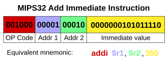

# 指令集架构｜精选补充资料

> 来源：[维基百科（中文）](https://zh.wikipedia.org/wiki/%E6%8C%87%E4%BB%A4%E9%9B%86%E6%9E%B6%E6%A7%8B)  
> 许可：[CC BY-SA 4.0](https://creativecommons.org/licenses/by-sa/4.0/)  
> 语言：简体中文  
> 获取时间：2026-08-08T09:43:40.527467+00:00

维基百科，自由的百科全书

**提示**：此条目的主题不是**[体系结构](/wiki/%E4%BD%93%E7%B3%BB%E7%BB%93%E6%9E%84 "体系结构")**。

**指令集架構**（英語：Instruction Set Architecture，縮寫為ISA），又稱**指令集**或**指令集体系**，是一种[概念模型](/wiki/%E6%A6%82%E5%BF%B5%E6%A8%A1%E5%9E%8B "概念模型")，它定义了[指令](/wiki/%E6%8C%87%E4%BB%A4 "指令")、[資料型別](/wiki/%E8%B3%87%E6%96%99%E5%9E%8B%E5%88%A5 "資料型別")、[寄存器](/wiki/%E5%AF%84%E5%AD%98%E5%99%A8 "寄存器")、[寻址模式](/wiki/%E5%AF%BB%E5%9D%80%E6%A8%A1%E5%BC%8F "寻址模式")、[記憶體階層](/wiki/%E8%A8%98%E6%86%B6%E9%AB%94%E9%9A%8E%E5%B1%A4 "記憶體階層")、[中斷](/wiki/%E4%B8%AD%E6%96%B7 "中斷")、[異常處理](/wiki/%E5%BC%82%E5%B8%B8%E5%A4%84%E7%90%86 "异常处理")以及外部[I/O](/wiki/I/O "I/O")。能够讓指令集架構所描述的指令落地運行的[CPU](/wiki/CPU "CPU")就是该ISA的[實現](/wiki/%E5%AF%A6%E7%8F%BE "實現")。指令集架構也被視為CPU的[接口](/wiki/%E4%BB%8B%E9%9D%A2_(%E8%B3%87%E8%A8%8A%E7%A7%91%E6%8A%80) "介面 (資訊科技)")。

不同的处理器“家族”——例如[Intel](/wiki/Intel "Intel") [IA-32](/wiki/IA-32 "IA-32")和[x86-64](/wiki/X86-64 "X86-64")、[IBM](/wiki/IBM "IBM")/[Freescale](/wiki/%E9%A3%9E%E6%80%9D%E5%8D%A1%E5%B0%94 "飞思卡尔") Power和[ARM](/wiki/ARM "ARM")处理器家族——有不同的指令集架构。

指令集体系与[微架构](/wiki/%E5%BE%AE%E6%9E%B6%E6%A7%8B "微架構")（一套用于执行指令集的微处理器的设计方法）不同。使用不同微架構的電腦可以共享一种指令集。例如，[Intel](/wiki/%E8%8B%B1%E7%89%B9%E7%88%BE "英特爾")的[Pentium](/wiki/%E5%A5%94%E9%A8%B0 "奔騰")和[AMD](/wiki/%E8%B6%85%E5%BE%AE%E5%8D%8A%E5%B0%8E%E9%AB%94 "超微半導體")的[AMD Athlon](/wiki/AMD_Athlon "AMD Athlon")，兩者几乎採用相同版本的[x86](/wiki/X86 "X86")指令集体系，但是兩者在内部设计上有本质的区别。

一些虛擬機器支持基于[Smalltalk](/wiki/Smalltalk "Smalltalk")，[Java虛擬機](/wiki/Java%E8%99%9B%E6%93%AC%E6%A9%9F "Java虛擬機")，微軟的[公共語言运行时](/wiki/%E5%85%AC%E5%85%B1%E8%AF%AD%E8%A8%80%E8%BF%90%E8%A1%8C%E6%97%B6 "公共语言运行时")虛擬機所生成的[字节码](/wiki/%E5%AD%97%E8%8A%82%E7%A0%81 "字节码")，他們的指令集体系將bytecode（字节码）从作为一般手段的代码路径翻譯成本地的機器語言，并通过解译执行并不常用的代码路径，[全美達](/wiki/%E5%85%A8%E7%BE%8E%E9%81%94 "全美達")以相同的方式开发了基于x86指令体系的[VLIW](/wiki/VLIW "VLIW")處理器。

## 指令集的分类

[复杂指令集计算机](/wiki/%E5%A4%8D%E6%9D%82%E6%8C%87%E4%BB%A4%E9%9B%86%E8%AE%A1%E7%AE%97%E6%9C%BA "复杂指令集计算机")包含许多应用程序中很少使用的特定指令，由此产生的缺陷是指令长度不固定。[精简指令集计算机](/wiki/%E7%B2%BE%E7%AE%80%E6%8C%87%E4%BB%A4%E9%9B%86%E8%AE%A1%E7%AE%97%E6%9C%BA "精简指令集计算机")通过只执行在程序中经常使用的指令来简化处理器的结构，而特殊操作则以子程序的方式实现，它们的特殊使用通过处理器额外的执行时间来弥补。理论上的重要类型还包括[最小指令集计算机](/w/index.php?title=%E6%9C%80%E5%B0%8F%E6%8C%87%E4%BB%A4%E9%9B%86%E8%AE%A1%E7%AE%97%E6%9C%BA&action=edit&redlink=1 "最小指令集计算机（页面不存在）")（英语：[Minimal instruction set computer](https://en.wikipedia.org/wiki/Minimal_instruction_set_computer "en:Minimal instruction set computer")）与[单指令集计算机](/wiki/%E5%96%AE%E4%B8%80%E6%8C%87%E4%BB%A4%E9%9B%86 "單一指令集")，但都未用作商业处理器。另外一种衍生类型是[超长指令字](/wiki/%E8%B6%85%E9%95%BF%E6%8C%87%E4%BB%A4%E5%AD%97 "超长指令字")，处理器接受许多经过编码的指令并通过检索提取出一个指令字并执行。

## 機器語言

機器語言是由*声明*和*指令*所組成的。在处理结构上，一個特定指令指明了以下几个部分：

* 用于算术运算，寻址或者控制功能的特定[寄存器](/wiki/%E5%AF%84%E5%AD%98%E5%99%A8 "寄存器")；
* 特定存储空间的地址或偏移量；
* 用于解译操作数的特定[寻址模式](/wiki/%E5%AF%BB%E5%9D%80%E6%A8%A1%E5%BC%8F "寻址模式")；

複雜的操作可以藉由將簡單的指令合併而達成，可以（在[冯·诺依曼体系](/wiki/%E5%86%AF%C2%B7%E8%AF%BA%E4%BE%9D%E6%9B%BC%E4%BD%93%E7%B3%BB "冯·诺依曼体系")中）連續的執行，也可以藉[控制流](/wiki/%E6%8E%A7%E5%88%B6%E6%B5%81 "控制流")來執行指令。

### 指令类型

有效的指令操作須包含：

* 数据處理與存储操作
  + 將[暫存器](/wiki/%E6%9A%AB%E5%AD%98%E5%99%A8 "暫存器")的值（在中央處理器作为高速缓存的存储空间）設為固定值；
  + 將数据从存储空间中传送至寄存器，反之亦然。用于将数据取出并执行计算，或者将计算结果予以保存；
  + 從硬體设备读取或寫入数据。
* [算术逻辑单元](/wiki/%E7%AE%97%E6%9C%AF%E9%80%BB%E8%BE%91%E5%8D%95%E5%85%83 "算术逻辑单元")
  + 對兩個儲存於暫存器的數字進行**add**，**subtract**，**multiply**，**divide**,將結果放到一個暫存器內，一個或是更多的[状态码](/wiki/%E6%97%97%E6%A8%99 "旗標")可能被設置在[狀態暫存器](/wiki/%E7%8B%80%E6%85%8B%E6%9A%AB%E5%AD%98%E5%99%A8 "狀態暫存器")中；
  + 执行[位操作](/wiki/%E4%BD%8D%E6%93%8D%E4%BD%9C "位操作")，藉對兩組數字（為兩串的數字，都由零與一構成，分別儲存於兩個暫存器內）執行**[邏輯與](/wiki/%E9%82%8F%E8%BC%AF%E8%88%87 "邏輯與")**和**[邏輯或](/wiki/%E9%80%BB%E8%BE%91%E6%88%96 "逻辑或")**，或者对寄存器的每一位執行**[邏輯非](/wiki/%E9%82%8F%E8%BC%AF%E9%9D%9E "邏輯非")**操作；
  + **比較**兩个寄存器中的数据（例如是大于或者相等）；
* [控制流](/wiki/%E6%8E%A7%E5%88%B6%E6%B5%81 "控制流")
  + **[分支](/wiki/%E5%88%86%E6%94%AF_(%E8%A8%88%E7%AE%97%E6%A9%9F%E7%A7%91%E5%AD%B8) "分支 (計算機科學)")**，跳跃至程序某地址并执行相应指令；
  + **[条件分支](/wiki/%E6%9D%A1%E4%BB%B6%E8%A1%A8%E8%BE%BE%E5%BC%8F "条件表达式")**，假設某一條件成立，就跳到程序的另一個位置；
  + **[間接分支](/wiki/%E9%96%93%E6%8E%A5%E5%88%86%E6%94%AF "間接分支")**，在跳到另一個位置之前，將現在所執行的指令的下一個指令的位置儲存起來，作為[子程式](/wiki/%E5%AD%90%E7%A8%8B%E5%BC%8F "子程式")執行完返回的地址；

### 複雜指令

一些電腦在他們的指令集架構內包含複雜指令。複雜指令包含：

* 將許多暫存器存成堆疊的形式。
* 移動記憶體內大筆的資料。
* 複雜或是浮點數運算（[正弦](/wiki/%E6%AD%A3%E5%BC%A6 "正弦")，[餘弦](/wiki/%E9%A4%98%E5%BC%A6 "餘弦")，[平方根](/wiki/%E5%B9%B3%E6%96%B9%E6%A0%B9 "平方根")等等）
* 執行[test-and-set](/wiki/Test-and-set "Test-and-set")指令。
* 執行數字存在記憶體而非暫存器的運算

有一種複雜指令[單指令流多資料流](/wiki/%E5%96%AE%E6%8C%87%E4%BB%A4%E6%B5%81%E5%A4%9A%E8%B3%87%E6%96%99%E6%B5%81 "單指令流多資料流")（SIMD），或[向量指令](/wiki/%E5%B9%B6%E8%A1%8C%E5%90%91%E9%87%8F%E5%A4%84%E7%90%86%E6%9C%BA "并行向量处理机")，這是一種可以在同一時間對多筆資料進行相同運算的操作。SIMD有能力在短時間內將大筆的向量和矩陣計算完成。SIMD指令使[平行計算](/wiki/%E4%B8%A6%E8%A1%8C%E8%A8%88%E7%AE%97 "並行計算")變得簡單，各種SIMD指令集被開發出來，例如[MMX](/wiki/MMX_(%E6%8C%87%E4%BB%A4%E9%9B%86) "MMX (指令集)")、[3DNow!](/wiki/3DNow! "3DNow!")以及[AltiVec](/wiki/AltiVec "AltiVec")。

### 指令的組成

一條指令往往有好幾個區塊，這些區塊包含要做的運算（加或減），可能還包含資料的原始或是目的地位置，以及常數。圖中的MIPS「Add Immediate」指令允許使用者選擇哪個暫存器是資料來源以及哪一個暫存器是要存運算後的結果，還有一個常數

在傳統的架構上，一條指令包含[opcode](/wiki/Opcode "Opcode")，表示運算的方式，以及零個或是更多的[運算元](/wiki/%E9%81%8B%E7%AE%97%E5%85%83 "運算元")，有些像是運算元的數字可能指的是[暫存器](/wiki/%E6%9A%AB%E5%AD%98%E5%99%A8 "暫存器")的編號，還有記憶體位置，或是文字資料。

在[超長指令字](/wiki/%E8%B6%85%E9%95%BF%E6%8C%87%E4%BB%A4%E5%AD%97 "超长指令字")（VLIW）的結構中，包含了許多[微指令](/wiki/%E5%BE%AE%E6%8C%87%E4%BB%A4 "微指令")，藉此將複雜的指令分解為簡單的指令。

### 指令的長度

指令長度的範圍可以說是相當廣泛，從[微控制器](/wiki/%E5%BE%AE%E6%8E%A7%E5%88%B6%E5%99%A8 "微控制器")的4 bit，到[VLIW](/wiki/%E8%B6%85%E9%95%BF%E6%8C%87%E4%BB%A4%E5%AD%97 "超长指令字")系統的數百bit。在[個人電腦](/wiki/%E5%80%8B%E4%BA%BA%E9%9B%BB%E8%85%A6 "個人電腦")，[大型電腦](/wiki/%E5%A4%A7%E5%9E%8B%E9%9B%BB%E8%85%A6 "大型電腦")，[超級電腦](/wiki/%E8%B6%85%E7%B4%9A%E9%9B%BB%E8%85%A6 "超級電腦")內的處理器，其內部的指令長度介於8到64 bits（在x86處理器結構內，最長的指令長達15 bytes，等於120 bits）。在一個指令集架構內，不同的指令可能會有不同長度。在一些結構，特別是大部分的[精簡指令集](/wiki/%E7%B2%BE%E7%AE%80%E6%8C%87%E4%BB%A4%E9%9B%86 "精简指令集")（RISC），指令是固定的長度，長度對應到結構內一個[字](/wiki/%E5%AD%97_(%E8%AE%A1%E7%AE%97%E6%9C%BA) "字 (计算机)")的大小。在其他結構，長度則是[byte](/wiki/Byte "Byte")的整數倍或是一個[halfword](/wiki/%E5%AD%97_(%E8%AE%A1%E7%AE%97%E6%9C%BA) "字 (计算机)")。

### 設計

對微處理器而言有兩種指令集。第一種是[複雜指令集](/wiki/%E8%A4%87%E9%9B%9C%E6%8C%87%E4%BB%A4%E9%9B%86 "複雜指令集")（Complex Instruction Set Computer），擁有許多不同的指令。在1970年代，許多機構，像是IBM，發現有許多指令是不需要的。結果就產生了[精簡指令集](/wiki/%E7%B2%BE%E7%AE%80%E6%8C%87%E4%BB%A4%E9%9B%86 "精简指令集")（Reduced Instruction Set Computer），它所包含的指令就比較少。精簡的指令集可以提供比較高的速度，使處理器的尺寸縮小，以及較少的電力損耗。然而，比較複雜的指令集較容易使工作更完善，記憶體及[缓存](/wiki/%E7%BC%93%E5%AD%98 "缓存")的效率較高，以及較為簡單的程式碼。

一些指令集保留了一個或多個的opcode，以執行[系統調用](/wiki/%E7%B3%BB%E7%BB%9F%E8%B0%83%E7%94%A8 "系统调用")或[軟體中斷](/wiki/%E4%B8%AD%E6%96%B7 "中斷")。

## 指令集的實作

在設計處理器內的[微架構](/wiki/%E5%BE%AE%E6%9E%B6%E6%A7%8B "微架構")時，工程師使用藉電路連接的區塊來架構，區塊用來表示加法器，乘法器，計數器，暫存器，算術邏輯單元等等，[暫存器傳遞語言](/wiki/%E6%9A%AB%E5%AD%98%E5%99%A8%E5%82%B3%E9%81%9E%E8%AA%9E%E8%A8%80 "暫存器傳遞語言")通常被用來描述被解碼的指令，指令是藉由微架構來執行指令。
有兩種基本的方法來建構[控制單元](/wiki/%E6%8E%A7%E5%88%B6%E5%8D%95%E5%85%83_(%E8%AE%A1%E7%AE%97%E6%9C%BA) "控制单元 (计算机)")，藉控制單元，以微架構作為通路來執行指令：

1. 早期的電腦和採用精簡指令集的電腦藉將電路接線（像是微架構剩下的部分）。
2. 其他的裝置使用[微程序](/wiki/%E5%BE%AE%E7%A8%8B%E5%BA%8F "微程序")來達成—像是電晶體ROM或PLA（即使RAM已使用很久）。

電腦[微处理器](/wiki/%E5%BE%AE%E5%A4%84%E7%90%86%E5%99%A8 "微处理器")的**指令集架構**（Instruction Set Architecture）常见的有三种：

* **[复杂指令集运算](/wiki/%E8%A4%87%E9%9B%9C%E6%8C%87%E4%BB%A4%E9%9B%86 "複雜指令集")**（Complex Instruction Set Computing，CISC）

:   目前[x86](/wiki/X86 "X86")架构微处理器如[Intel](/wiki/Intel "Intel")的[Pentium](/wiki/Pentium "Pentium")/[Celeron](/wiki/Celeron "Celeron")/[Xeon](/wiki/Xeon "Xeon")与[AMD](/wiki/AMD "AMD")的[Athlon](/wiki/Athlon "Athlon")/[Duron](/wiki/Duron "Duron")/[Sempron](/wiki/Sempron "Sempron")；以及其64位扩展系统的[x86-64](/wiki/X86-64 "X86-64")架构的Intel 64的[Intel Core](/wiki/Intel_Core "Intel Core")/[Core 2](/wiki/Core_2 "Core 2")/[Celeron](/wiki/Celeron "Celeron")/[Pentium](/wiki/Pentium "Pentium")/[Xeon](/wiki/Xeon "Xeon")与AMD64的[Phenom II](/wiki/Phenom_II "Phenom II")/[Phenom](/wiki/Phenom "Phenom")/[Athlon 64](/wiki/Athlon_64 "Athlon 64")/[Athlon II](/wiki/Athlon_II "Athlon II")/[Opteron](/wiki/Opteron "Opteron")/[AMD APU](/wiki/AMD_APU "AMD APU")/[Ryzen](/wiki/Ryzen "Ryzen")/[EPYC](/wiki/EPYC "EPYC")都属于复杂指令集。主要针对的操作系统是[微软](/wiki/%E5%BE%AE%E8%BD%AF "微软")的[Windows](/wiki/Windows "Windows")和[苹果公司](/wiki/%E8%8B%B9%E6%9E%9C%E5%85%AC%E5%8F%B8 "苹果公司")的[macOS](/wiki/MacOS "MacOS")。另外[Linux](/wiki/Linux "Linux")，一些UNIX等，都可以运行在x86（复杂指令集）架构的微处理器。

* **[精简指令集运算](/wiki/%E7%B2%BE%E7%AE%80%E6%8C%87%E4%BB%A4%E9%9B%86 "精简指令集")**（Reduced Instruction Set Computing，RISC）

:   这种指令集运算包括惠普的PA-RISC，[国际商业机器](/wiki/%E5%9B%BD%E9%99%85%E5%95%86%E4%B8%9A%E6%9C%BA%E5%99%A8 "国际商业机器")的[PowerPC](/wiki/PowerPC "PowerPC")，[康柏](/wiki/%E5%BA%B7%E6%9F%8F "康柏")（後被[惠普](/wiki/%E6%83%A0%E6%99%AE "惠普")收购）的Alpha，[美普思科技](/wiki/%E7%BE%8E%E6%99%AE%E6%80%9D%E7%A7%91%E6%8A%80 "美普思科技")公司的MIPS，SUN公司的SPARC，ARM公司的[ARM架構](/wiki/ARM%E6%9E%B6%E6%A7%8B "ARM架構")等。目前有UNIX、Linux以及包括iOS、Android、Windows Phone等在内的大多数移动操作系统运行在精简指令集的处理器上。

* **[顯式並行指令運算](/wiki/%E9%A1%AF%E5%BC%8F%E4%B8%A6%E8%A1%8C%E6%8C%87%E4%BB%A4%E9%81%8B%E7%AE%97 "顯式並行指令運算")**（Explicitly Parallel Instruction Computing，EPIC）

:   顯式並行指令運算乃先进的全新指令集运算，只有Intel的[IA-64](/wiki/IA-64 "IA-64")架构的纯64位微处理器的[Itanium](/wiki/Itanium "Itanium")/[Itanium 2](/wiki/Itanium_2 "Itanium 2")。EPIC指令集运算的IA-64架构主要针对的操作系统是微软64位安腾版的[Windows XP](/wiki/Windows_XP "Windows XP")以及64位安腾版的[Windows Server 2003](/wiki/Windows_Server_2003 "Windows Server 2003")。另外一些64位的Linux，一些64位的UNIX也可以运行IA-64（顯式並行指令運算）架构。

* **[超長指令字指令集运算](/wiki/VLIW "VLIW")**（VLIW）

:   通過將多條指令放入一個指令字，有效的提高了CPU各個計算功能部件的利用效率，提高了程序的性能

## 參考文獻

1. ^ [**1.0**](#cite_ref-概念_1-0) [**1.1**](#cite_ref-概念_1-1) [GLOSSARY: Instruction Set Architecture (ISA)](https://web.archive.org/web/20231111175250/https://www.arm.com/glossary/isa). arm.com.  [2024-02-03]. （[原始内容](https://www.arm.com/glossary/isa)存档于2023-11-11）.
2. **[^](#cite_ref-2)** Randal E. Bryant; David R. O'Hallaron. [Computer Systems A Programmer's Perspective](https://archive.org/details/computersystemsp0000brya_w3u0) Third. Pearson Education. 2016: [352](https://archive.org/details/computersystemsp0000brya_w3u0/page/352).

## 延伸閱讀

* Bowen, Jonathan P. Standard Microprocessor Programming Cards **9** (6): 274–290. July–August 1985. [doi:10.1016/0141-9331(85)90116-4](https://doi.org/10.1016%2F0141-9331%2885%2990116-4).

## 外部連結

* Programming Textfiles: Bowen's Instruction Summary Cards
* [Mark Smotherman's Historical Computer Designs Page](http://www.cs.clemson.edu/~mark/hist.html) （[页面存档备份](//web.archive.org/web/20120716192519/http://www.cs.clemson.edu/~mark/hist.html)，存于[互联网档案馆](/wiki/%E4%BA%92%E8%81%94%E7%BD%91%E6%A1%A3%E6%A1%88%E9%A6%86 "互联网档案馆")）

## 參見

* [微架構](/wiki/%E5%BE%AE%E6%9E%B6%E6%A7%8B "微架構")
* [计算机系统结构](/wiki/%E8%AE%A1%E7%AE%97%E6%9C%BA%E7%B3%BB%E7%BB%9F%E7%BB%93%E6%9E%84 "计算机系统结构")

[分类](/wiki/Special:Categories "Special:Categories")：​

* [微處理器](/wiki/Category:%E5%BE%AE%E8%99%95%E7%90%86%E5%99%A8 "Category:微處理器")
* [指令集架構](/wiki/Category:%E6%8C%87%E4%BB%A4%E9%9B%86%E6%9E%B6%E6%A7%8B "Category:指令集架構")

隐藏分类：​

* [自2022年5月需补充来源的条目](/wiki/Category:%E8%87%AA2022%E5%B9%B45%E6%9C%88%E9%9C%80%E8%A1%A5%E5%85%85%E6%9D%A5%E6%BA%90%E7%9A%84%E6%9D%A1%E7%9B%AE "Category:自2022年5月需补充来源的条目")
* [拒绝当选首页新条目推荐栏目的条目](/wiki/Category:%E6%8B%92%E7%BB%9D%E5%BD%93%E9%80%89%E9%A6%96%E9%A1%B5%E6%96%B0%E6%9D%A1%E7%9B%AE%E6%8E%A8%E8%8D%90%E6%A0%8F%E7%9B%AE%E7%9A%84%E6%9D%A1%E7%9B%AE "Category:拒绝当选首页新条目推荐栏目的条目")
* [自2024年2月需要计算机科学专家关注的页面](/wiki/Category:%E8%87%AA2024%E5%B9%B42%E6%9C%88%E9%9C%80%E8%A6%81%E8%AE%A1%E7%AE%97%E6%9C%BA%E7%A7%91%E5%AD%A6%E4%B8%93%E5%AE%B6%E5%85%B3%E6%B3%A8%E7%9A%84%E9%A1%B5%E9%9D%A2 "Category:自2024年2月需要计算机科学专家关注的页面")
* [所有需要專家關注的頁面](/wiki/Category:%E6%89%80%E6%9C%89%E9%9C%80%E8%A6%81%E5%B0%88%E5%AE%B6%E9%97%9C%E6%B3%A8%E7%9A%84%E9%A0%81%E9%9D%A2 "Category:所有需要專家關注的頁面")
* [需要计算机科学专家关注的页面](/wiki/Category:%E9%9C%80%E8%A6%81%E8%AE%A1%E7%AE%97%E6%9C%BA%E7%A7%91%E5%AD%A6%E4%B8%93%E5%AE%B6%E5%85%B3%E6%B3%A8%E7%9A%84%E9%A1%B5%E9%9D%A2 "Category:需要计算机科学专家关注的页面")
* [自2024年2月自相矛盾的條目](/wiki/Category:%E8%87%AA2024%E5%B9%B42%E6%9C%88%E8%87%AA%E7%9B%B8%E7%9F%9B%E7%9B%BE%E7%9A%84%E6%A2%9D%E7%9B%AE "Category:自2024年2月自相矛盾的條目")
* [自2024年2月缺少注脚的条目](/wiki/Category:%E8%87%AA2024%E5%B9%B42%E6%9C%88%E7%BC%BA%E5%B0%91%E6%B3%A8%E8%84%9A%E7%9A%84%E6%9D%A1%E7%9B%AE "Category:自2024年2月缺少注脚的条目")
* [含有多个问题的条目](/wiki/Category:%E5%90%AB%E6%9C%89%E5%A4%9A%E4%B8%AA%E9%97%AE%E9%A2%98%E7%9A%84%E6%9D%A1%E7%9B%AE "Category:含有多个问题的条目")
* [含有英語的條目](/wiki/Category:%E5%90%AB%E6%9C%89%E8%8B%B1%E8%AA%9E%E7%9A%84%E6%A2%9D%E7%9B%AE "Category:含有英語的條目")
* [包含GND标识符的维基百科条目](/wiki/Category:%E5%8C%85%E5%90%ABGND%E6%A0%87%E8%AF%86%E7%AC%A6%E7%9A%84%E7%BB%B4%E5%9F%BA%E7%99%BE%E7%A7%91%E6%9D%A1%E7%9B%AE "Category:包含GND标识符的维基百科条目")
