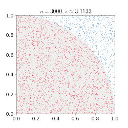

# 蒙特卡洛方法｜精选补充资料

> 来源：[维基百科（中文）](https://zh.wikipedia.org/wiki/%E8%92%99%E7%89%B9%E5%8D%A1%E6%B4%9B%E6%96%B9%E6%B3%95)  
> 许可：[CC BY-SA 4.0](https://creativecommons.org/licenses/by-sa/4.0/)  
> 语言：简体中文  
> 获取时间：2026-08-08T09:44:01.174934+00:00

维基百科，自由的百科全书

（重定向自[蒙特卡洛方法](/w/index.php?title=%E8%92%99%E7%89%B9%E5%8D%A1%E6%B4%9B%E6%96%B9%E6%B3%95&redirect=no "蒙特卡洛方法")）

**蒙特卡罗方法**（英語：Monte Carlo method），也称**统计模拟方法**，是1940年代中期由于科学技术的发展和[电子计算机](/wiki/%E7%94%B5%E5%AD%90%E8%AE%A1%E7%AE%97%E6%9C%BA "电子计算机")的发明，而提出的一种以概率统计理论为指导的数值计算方法。是指使用[随机数](/wiki/%E9%9A%8F%E6%9C%BA%E6%95%B0 "随机数")（或更常见的[伪随机数](/wiki/%E4%BC%AA%E9%9A%8F%E6%9C%BA%E6%95%B0 "伪随机数")）来解决很多计算问题的方法。

20世纪40年代，在科學家[冯·诺伊曼](/wiki/%E5%86%AF%C2%B7%E8%AF%BA%E4%BC%8A%E6%9B%BC "冯·诺伊曼")、[斯塔尼斯拉夫·烏拉姆](/wiki/%E6%96%AF%E5%A1%94%E5%B0%BC%E6%96%AF%E6%8B%89%E5%A4%AB%C2%B7%E4%B9%8C%E6%8B%89%E5%A7%86 "斯塔尼斯拉夫·乌拉姆")和[尼古拉斯·梅特罗波利斯](/wiki/%E5%B0%BC%E5%8F%A4%E6%8B%89%E6%96%AF%C2%B7%E6%A2%85%E7%89%B9%E7%BD%97%E6%B3%A2%E5%88%A9%E6%96%AF "尼古拉斯·梅特罗波利斯")於[洛斯阿拉莫斯国家实验室](/wiki/%E6%B4%9B%E6%96%AF%E9%98%BF%E6%8B%89%E8%8E%AB%E6%96%AF%E5%9B%BD%E5%AE%B6%E5%AE%9E%E9%AA%8C%E5%AE%A4 "洛斯阿拉莫斯国家实验室")为核武器计划工作时，发明了蒙特卡罗方法。因为烏拉姆的叔叔经常在[摩納哥](/wiki/%E6%91%A9%E7%B4%8D%E5%93%A5 "摩納哥")的[蒙特卡洛](/wiki/%E8%92%99%E7%89%B9%E5%8D%A1%E6%B4%9B "蒙特卡洛")赌场输钱得名，而蒙特卡罗方法正是以概率为基础的方法。

与它对应的是[确定性算法](/wiki/%E7%A1%AE%E5%AE%9A%E6%80%A7%E7%AE%97%E6%B3%95 "确定性算法")。

蒙特卡罗方法在[金融工程学](/wiki/%E9%87%91%E8%9E%8D%E5%B7%A5%E7%A8%8B%E5%AD%A6 "金融工程学")、[宏观经济学](/wiki/%E5%AE%8F%E8%A7%82%E7%BB%8F%E6%B5%8E%E5%AD%A6 "宏观经济学")、[生物](/wiki/%E7%94%9F%E7%89%A9%E5%AD%A6 "生物学")[医学](/wiki/%E5%8C%BB%E5%AD%A6 "医学")、[计算物理学](/wiki/%E8%AE%A1%E7%AE%97%E7%89%A9%E7%90%86%E5%AD%A6 "计算物理学")（如[粒子输运](/w/index.php?title=%E7%B2%92%E5%AD%90%E8%BE%93%E8%BF%90&action=edit&redlink=1 "粒子输运（页面不存在）")计算、[量子热力学](/wiki/%E9%87%8F%E5%AD%90%E7%83%AD%E5%8A%9B%E5%AD%A6 "量子热力学")计算、[空气动力学](/wiki/%E7%A9%BA%E6%B0%94%E5%8A%A8%E5%8A%9B%E5%AD%A6 "空气动力学")计算）、[机器学习](/wiki/%E6%9C%BA%E5%99%A8%E5%AD%A6%E4%B9%A0 "机器学习")等领域应用广泛。

## 基本概念

通常蒙特卡罗方法可以粗略地分成两类：一类是所求解的问题本身具有内在的随机性，借助计算机的运算能力可以直接模拟这种随机的过程。例如在核物理研究中，分析中子在反应堆中的传输过程。中子与原子核作用受到量子力学规律的制约，人们只能知道它们相互作用发生的概率，却无法准确获得中子与原子核作用时的位置以及裂变产生的新中子的行进速率和方向。科学家依据其概率进行随机抽样得到裂变位置、速度和方向，这样模拟大量中子的行为后，经过统计就能获得中子传输的范围，作为反应堆设计的依据。

另一种类型是所求解问题可以转化为某种随机分布的特征数，比如[随机事件](/wiki/%E9%9A%8F%E6%9C%BA%E4%BA%8B%E4%BB%B6 "随机事件")出现的[概率](/wiki/%E6%A6%82%E7%8E%87 "概率")，或者[随机变量](/wiki/%E9%9A%8F%E6%9C%BA%E5%8F%98%E9%87%8F "随机变量")的[期望值](/wiki/%E6%9C%9F%E6%9C%9B%E5%80%BC "期望值")。通过随机抽样的方法，以随机事件出现的[频率](/wiki/%E9%A2%91%E7%8E%87_(%E7%BB%9F%E8%AE%A1%E5%AD%A6) "频率 (统计学)")估计其[概率](/wiki/%E6%A6%82%E7%8E%87 "概率")，或者以[抽样](/wiki/%E6%8A%BD%E6%A0%B7 "抽样")的[数字特征](/w/index.php?title=%E6%95%B0%E5%AD%97%E7%89%B9%E5%BE%81&action=edit&redlink=1 "数字特征（页面不存在）")估算[随机变量](/wiki/%E9%9A%8F%E6%9C%BA%E5%8F%98%E9%87%8F "随机变量")的[数字特征](/w/index.php?title=%E6%95%B0%E5%AD%97%E7%89%B9%E5%BE%81&action=edit&redlink=1 "数字特征（页面不存在）")，并将其作为问题的解。这种方法多用于求解复杂的多维积分问题。

假设我们要计算一个不规则图形的面积，那么图形的不规则程度和分析性计算（比如，积分）的复杂程度是成正比的。蒙特卡罗方法基于这样的想法：假設你有一袋豆子，把豆子均匀地朝这个图形上撒，然后数这个图形之中有多少颗豆子，这个豆子的数目就是图形的面积。当你的豆子越小，撒的越多的时候，结果就越精确。借助计算机程序可以生成大量均匀分布坐标点，然后统计出图形内的点数，透過它們占總點數的比例和坐标点生成范围的面积就可以求出图形面积。

## 工作过程

[](/wiki/File:Pi_30K.gif)

使用蒙特卡罗方法估算π值. 放置30000个随机点后,π的估算值与真实值相差0.07%.

在解决实际问题的时候应用蒙特卡罗方法主要有两部分工作：

1. 用蒙特卡罗方法模拟某一过程时，需要产生各种[概率分布](/wiki/%E6%A6%82%E7%8E%87%E5%88%86%E5%B8%83 "概率分布")的[随机变量](/wiki/%E9%9A%8F%E6%9C%BA%E5%8F%98%E9%87%8F "随机变量")。
2. 用统计方法把模型的[数字特征](/w/index.php?title=%E6%95%B0%E5%AD%97%E7%89%B9%E5%BE%81&action=edit&redlink=1 "数字特征（页面不存在）")估计出来，从而得到实际问题的数值解。

## 分子模拟计算的步骤

使用蒙特卡罗方法进行分子模拟计算是按照以下步骤进行的：

1. 使用[随机数生成器](/wiki/%E9%9A%8F%E6%9C%BA%E6%95%B0%E7%94%9F%E6%88%90%E5%99%A8 "随机数生成器")产生一个随机的分子[构型](/w/index.php?title=%E6%9E%84%E5%9E%8B&action=edit&redlink=1 "构型（页面不存在）")。
2. 对此分子构型的其中粒子坐标做无规则的改变，产生一个新的分子构型。
3. 计算新的分子构型的能量。
4. 比较新的分子构型与改变前的分子构型的能量变化，判断是否接受该构型。
   * 若新的分子构型能量低于原分子构型的能量，则接受新的构型，使用这个构型重复再做下一次[迭代](/wiki/%E8%BF%AD%E4%BB%A3 "迭代")。
   * 若新的分子构型能量高于原分子构型的能量，则計算玻尔兹曼因子，并产生一个随机数。
     + 若这个随机数大于所计算出的[玻尔兹曼因子](/wiki/%E7%8E%BB%E5%B0%94%E5%85%B9%E6%9B%BC%E5%9B%A0%E5%AD%90 "玻尔兹曼因子")，则放弃这个构型，重新计算。
     + 若这个随机数小于所计算出的玻尔兹曼因子，则接受这个构型，使用这个构型重复再做下一次迭代。
5. 如此进行迭代计算，直至最后搜索出低于所给能量条件的分子构型结束。

## 在数学中的应用

通常蒙特卡罗方法透過构造符合一定规则的随机数来解决数学上的各种问题。对于那些由于计算过于复杂而难以得到解析解或者根本没有解析解的问题，蒙特卡罗方法是一种有效的求出数值解的方法。一般蒙特卡罗方法在数学中最常见的应用就是蒙特卡罗积分。下面是蒙特卡罗方法的两个简单应用：

### 积分

非权重蒙特卡罗积分，也称确定性抽样，是对被积函数变量区间进行随机均匀抽样，然后对抽样点的函数值求平均，从而可以得到函数积分的近似值。此种方法的正确性是基于[概率论](/wiki/%E6%A6%82%E7%8E%87%E8%AE%BA "概率论")的[中心极限定理](/wiki/%E4%B8%AD%E5%BF%83%E6%9E%81%E9%99%90%E5%AE%9A%E7%90%86 "中心极限定理")。当抽样点数为m时，使用此种方法所得近似解的统计误差只与m有关（与


1

m

{\displaystyle {\begin{smallmatrix}{\frac {1}{\sqrt[{}]{m}}}\end{smallmatrix}}}
${\displaystyle {\begin{smallmatrix}{\frac {1}{\sqrt[{}]{m}}}\end{smallmatrix}}}$正相关），不随积分维数的改变而改变。因此当积分维度较高时，蒙特卡罗方法相对于其他数值解法更优。

### 圆周率

蒙特卡罗方法可用于近似计算圆周率：让计算机每次随机生成两个0到1之间的数，看以这两个实数为横纵坐标的点是否在单位圆内。生成一系列随机点，统计单位圆内的点数与总点数，（圓面積和正方形面積之比為PI:4，PI為圓周率），当随机点取得越多时，其结果越接近于圆周率（然而準確度仍有爭議：即使取10的9次方个随机点时，其结果也仅在前4位与圆周率吻合[[來源請求]](/wiki/Wikipedia:%E5%88%97%E6%98%8E%E6%9D%A5%E6%BA%90 "Wikipedia:列明来源")，以下Python程式碼可提供測試）。用蒙特卡罗方法近似计算圆周率的先天不足是：计算机产生的随机数是受到存储格式的限制的，是离散的，并不能产生连续的任意实数；上述做法将平面分割成一个个网格，在空间也不是连续的，由此计算出来的面积当然与圆或多或少有差距。

```
import numpy as np

# 生成10的9次方個隨機點
num_points = 10**9
points = np.random.rand(num_points, 2)

# 計算點到原點的距離
distances = np.sqrt(points[:,0]**2 + points[:,1]**2)

# 計算落在單位圓內的點的數量
points_inside_circle = np.sum(distances <= 1)

# 蒙地卡羅方法計算圓周率
pi_estimate = 4 * points_inside_circle / num_points

print(pi_estimate)
```

## 在机器学习中的应用

蒙特卡洛方法也常用于机器学习，特别是[强化学习](/wiki/%E5%BC%BA%E5%8C%96%E5%AD%A6%E4%B9%A0 "强化学习")的算法中。一般情况下，针对得到的样本数据集建立相对模糊的模型，透過蒙特卡洛方法对于模型中的参数进行选取，使之于原始数据的残差尽可能的小。从而达到建立模型拟合样本的目的。

* [计算机科学主题](/wiki/Portal:%E8%AE%A1%E7%AE%97%E6%9C%BA%E7%A7%91%E5%AD%A6 "Portal:计算机科学")
* [计算机程序设计主题](/wiki/Portal:%E8%AE%A1%E7%AE%97%E6%9C%BA%E7%A8%8B%E5%BA%8F%E8%AE%BE%E8%AE%A1 "Portal:计算机程序设计")

* [遗传算法](/wiki/%E9%81%97%E4%BC%A0%E7%AE%97%E6%B3%95 "遗传算法")
* [粒子濾波器](/wiki/%E7%B2%92%E5%AD%90%E6%BF%BE%E6%B3%A2%E5%99%A8 "粒子濾波器")
* [拟蒙特卡罗方法](/wiki/%E6%8B%9F%E8%92%99%E7%89%B9%E5%8D%A1%E7%BD%97%E6%96%B9%E6%B3%95 "拟蒙特卡罗方法")
* [布豐投針問題](/wiki/%E5%B8%83%E8%B1%90%E6%8A%95%E9%87%9D%E5%95%8F%E9%A1%8C "布豐投針問題")

## 注释

1. **[^](#cite_ref-1)** Kroese, D. P.; Brereton, T.; Taimre, T.; Botev, Z. I. Why the Monte Carlo method is so important today. WIREs Comput Stat. 2014, **6**: 386–392. [doi:10.1002/wics.1314](https://doi.org/10.1002%2Fwics.1314).

## 参考

* [Anderson, Herbert L.](/w/index.php?title=Herbert_L._Anderson&action=edit&redlink=1 "Herbert L. Anderson（页面不存在）") [Metropolis, Monte Carlo and the MANIAC](https://web.archive.org/web/20170702204928/http://library.lanl.gov/cgi-bin/getfile?00326886.pdf) (PDF). Los Alamos Science. 1986, **14**: 96–108  [2018-04-29]. （[原始内容](http://library.lanl.gov/cgi-bin/getfile?00326886.pdf) (PDF)存档于2017-07-02）.
* Benov, Dobriyan M. [The Manhattan Project, the first electronic computer and the Monte Carlo method](https://web.archive.org/web/20190603224629/https://www.degruyter.com/view/j/mcma.2016.22.issue-1/mcma-2016-0102/mcma-2016-0102.xml). [Monte Carlo Methods and Applications](/w/index.php?title=Monte_Carlo_Methods_and_Applications&action=edit&redlink=1 "Monte Carlo Methods and Applications（页面不存在）"). 2016, **22** (1): 73–79  [2018-04-29]. [doi:10.1515/mcma-2016-0102](https://doi.org/10.1515%2Fmcma-2016-0102). （[原始内容](https://www.degruyter.com/view/j/mcma.2016.22.issue-1/mcma-2016-0102/mcma-2016-0102.xml)存档于2019-06-03）.
* Baeurle, Stephan A. Multiscale modeling of polymer materials using field-theoretic methodologies: A survey about recent developments. Journal of Mathematical Chemistry. 2009, **46** (2): 363–426. [doi:10.1007/s10910-008-9467-3](https://doi.org/10.1007%2Fs10910-008-9467-3).
* Berg, Bernd A. Markov Chain Monte Carlo Simulations and Their Statistical Analysis (With Web-Based Fortran Code). Hackensack, NJ: World Scientific. 2004. [ISBN 981-238-935-0](/wiki/Special:BookSources/981-238-935-0 "Special:BookSources/981-238-935-0").
* [Binder, Kurt](/w/index.php?title=Kurt_Binder&action=edit&redlink=1 "Kurt Binder（页面不存在）"). The Monte Carlo Method in Condensed Matter Physics. New York: Springer. 1995. [ISBN 0-387-54369-4](/wiki/Special:BookSources/0-387-54369-4 "Special:BookSources/0-387-54369-4").
* [Caflisch, R. E.](/w/index.php?title=Russel_E._Caflisch&action=edit&redlink=1 "Russel E. Caflisch（页面不存在）") Monte Carlo and quasi-Monte Carlo methods. Acta Numerica **7**. Cambridge University Press. 1998: 1–49.
* Davenport, J. H. Primality testing revisited. Proceeding ISSAC '92 Papers from the international symposium on Symbolic and algebraic computation. 1992: 123 129. [ISBN 0-89791-489-9](/wiki/Special:BookSources/0-89791-489-9 "Special:BookSources/0-89791-489-9"). [doi:10.1145/143242.143290](https://doi.org/10.1145%2F143242.143290).
* Doucet, Arnaud; Freitas, Nando de; Gordon, Neil. Sequential Monte Carlo methods in practice. New York: Springer. 2001. [ISBN 0-387-95146-6](/wiki/Special:BookSources/0-387-95146-6 "Special:BookSources/0-387-95146-6").
* Eckhardt, Roger. [Stan Ulam, John von Neumann, and the Monte Carlo method](https://web.archive.org/web/20140909230946/http://library.lanl.gov/cgi-bin/getfile?15-13.pdf) (PDF). Los Alamos Science, Special Issue. 1987, (15): 131–137  [2018-04-29]. （[原始内容](http://library.lanl.gov/cgi-bin/getfile?15-13.pdf) (PDF)存档于2014-09-09）.
* Fishman, G. S. Monte Carlo: Concepts, Algorithms, and Applications. New York: Springer. 1995. [ISBN 0-387-94527-X](/wiki/Special:BookSources/0-387-94527-X "Special:BookSources/0-387-94527-X").
* C. Forastero and L. Zamora and D. Guirado and A. Lallena. A Monte Carlo tool to simulate breast cancer screening programmes. Phys. In Med. And Biol. 2010, **55** (17): 5213–5229. [Bibcode:2010PMB....55.5213F](https://ui.adsabs.harvard.edu/abs/2010PMB....55.5213F). [doi:10.1088/0031-9155/55/17/021](https://doi.org/10.1088%2F0031-9155%2F55%2F17%2F021).
* Golden, Leslie M. [The Effect of Surface Roughness on the Transmission of Microwave Radiation Through a Planetary Surface](https://archive.org/details/icarus_1979-06_38_3/page/451). [伊卡洛斯 (期刊)](/wiki/%E4%BC%8A%E5%8D%A1%E6%B4%9B%E6%96%AF_(%E6%9C%9F%E5%88%8A) "伊卡洛斯 (期刊)"). 1979, **38** (3): 451–455. [Bibcode:1979Icar...38..451G](https://ui.adsabs.harvard.edu/abs/1979Icar...38..451G). [doi:10.1016/0019-1035(79)90199-4](https://doi.org/10.1016%2F0019-1035%2879%2990199-4).
* Gould, Harvey; Tobochnik, Jan. An Introduction to Computer Simulation Methods, Part 2, Applications to Physical Systems. Reading: Addison-Wesley. 1988. [ISBN 0-201-16504-X](/wiki/Special:BookSources/0-201-16504-X "Special:BookSources/0-201-16504-X").
* Grinstead, Charles; Snell, J. Laurie. Introduction to Probability. [美國數學學會](/wiki/%E7%BE%8E%E5%9C%8B%E6%95%B8%E5%AD%B8%E5%AD%B8%E6%9C%83 "美國數學學會"). 1997: 10–11.
* Hammersley, J. M.; Handscomb, D. C. Monte Carlo Methods. London: Methuen. 1975. [ISBN 0-416-52340-4](/wiki/Special:BookSources/0-416-52340-4 "Special:BookSources/0-416-52340-4").
* Hartmann, A.K. [Practical Guide to Computer Simulations](https://web.archive.org/web/20090211113048/http://worldscibooks.com/physics/6988.html). World Scientific. 2009  [2018-04-29]. [ISBN 978-981-283-415-7](/wiki/Special:BookSources/978-981-283-415-7 "Special:BookSources/978-981-283-415-7"). （[原始内容](http://www.worldscibooks.com/physics/6988.html)存档于2009-02-11）.
* Hubbard, Douglas. [How to Measure Anything: Finding the Value of Intangibles in Business](https://archive.org/details/howtomeasureanyt0000hubb). [John Wiley & Sons](/wiki/John_Wiley_%26_Sons "John Wiley & Sons"). 2007: [46](https://archive.org/details/howtomeasureanyt0000hubb/page/46).
* Hubbard, Douglas. [The Failure of Risk Management: Why It's Broken and How to Fix It](https://archive.org/details/failureofriskman0000hubb). [John Wiley & Sons](/wiki/John_Wiley_%26_Sons "John Wiley & Sons"). 2009.
* Kahneman, D.; Tversky, A. Judgement under Uncertainty: Heuristics and Biases. Cambridge University Press. 1982.
* Kalos, Malvin H.; Whitlock, Paula A. Monte Carlo Methods. [Wiley-VCH](/w/index.php?title=Wiley-VCH&action=edit&redlink=1 "Wiley-VCH（页面不存在）"). 2008. [ISBN 978-3-527-40760-6](/wiki/Special:BookSources/978-3-527-40760-6 "Special:BookSources/978-3-527-40760-6").
* Kroese, D. P.; Taimre, T.; Botev, Z.I. [Handbook of Monte Carlo Methods](http://www.montecarlohandbook.org/). New York: [John Wiley & Sons](/wiki/John_Wiley_%26_Sons "John Wiley & Sons"). 2011: 772  [2018-04-29]. [ISBN 0-470-17793-4](/wiki/Special:BookSources/0-470-17793-4 "Special:BookSources/0-470-17793-4"). （原始内容[存档](https://web.archive.org/web/20260220065726/https://www.montecarlohandbook.org/)于2026-02-20）.
* MacGillivray, H. T.; Dodd, R. J. [Monte-Carlo simulations of galaxy systems](http://www.springerlink.com/content/rp3g1q05j176r108/fulltext.pdf) (PDF). [Astrophysics and Space Science](/w/index.php?title=Astrophysics_and_Space_Science&action=edit&redlink=1 "Astrophysics and Space Science（页面不存在）") ([施普林格科学+商业媒体](/wiki/%E6%96%BD%E6%99%AE%E6%9E%97%E6%A0%BC%E7%A7%91%E5%AD%A6%2B%E5%95%86%E4%B8%9A%E5%AA%92%E4%BD%93 "施普林格科学+商业媒体")). 1982, **86** (2). [[永久失效連結](/wiki/Wikipedia:%E5%A4%B1%E6%95%88%E9%93%BE%E6%8E%A5 "Wikipedia:失效链接")]
* MacKeown, P. Kevin. Stochastic Simulation in Physics. New York: Springer. 1997. [ISBN 981-3083-26-3](/wiki/Special:BookSources/981-3083-26-3 "Special:BookSources/981-3083-26-3").
* [Metropolis, N.](/wiki/Nicholas_Metropolis "Nicholas Metropolis") [The beginning of the Monte Carlo method](http://library.lanl.gov/la-pubs/00326866.pdf) (PDF). Los Alamos Science. 1987, (1987 Special Issue dedicated to Stanislaw Ulam): 125–130.
* [Metropolis, Nicholas](/wiki/Nicholas_Metropolis "Nicholas Metropolis"); Rosenbluth, Arianna W.; Rosenbluth, Marshall N.; Teller, Augusta H.; Teller, Edward. [Equation of State Calculations by Fast Computing Machines](/w/index.php?title=Equation_of_State_Calculations_by_Fast_Computing_Machines&action=edit&redlink=1 "Equation of State Calculations by Fast Computing Machines（页面不存在）"). Journal of Chemical Physics. 1953, **21** (6): 1087. [Bibcode:1953JChPh..21.1087M](https://ui.adsabs.harvard.edu/abs/1953JChPh..21.1087M). [doi:10.1063/1.1699114](https://doi.org/10.1063%2F1.1699114).
* [Metropolis, N.](/wiki/Nicholas_Metropolis "Nicholas Metropolis"); [Ulam, S.](/wiki/%E6%96%AF%E5%A1%94%E5%B0%BC%E6%96%AF%E6%8B%89%E5%A4%AB%C2%B7%E4%B9%8C%E6%8B%89%E5%A7%86 "斯塔尼斯拉夫·乌拉姆") [The Monte Carlo Method](https://archive.org/details/sim_journal-of-the-american-statistical-association_1949-09_44_247/page/335). Journal of the American Statistical Association (American Statistical Association). 1949, **44** (247): 335–341. [JSTOR 2280232](//www.jstor.org/stable/2280232). [PMID 18139350](//www.ncbi.nlm.nih.gov/pubmed/18139350). [doi:10.2307/2280232](https://doi.org/10.2307%2F2280232).
* M. Milik and J. Skolnick. Insertion of peptide chains into lipid membranes: an off-lattice Monte Carlo dynamics model. Proteins. Jan 1993, **15** (1): 10–25. [PMID 8451235](//www.ncbi.nlm.nih.gov/pubmed/8451235). [doi:10.1002/prot.340150104](https://doi.org/10.1002%2Fprot.340150104).
* Mosegaard, Klaus; Tarantola, Albert. [Monte Carlo sampling of solutions to inverse problems](https://web.archive.org/web/20210310023658/http://www.math.pitt.edu/~cbsg/Materials/MonteCarlo_latex.pdf) (PDF). J. Geophys. Res. 1995, **100** (B7): 12431–12447  [2018-04-29]. [Bibcode:1995JGR...10012431M](https://ui.adsabs.harvard.edu/abs/1995JGR...10012431M). [doi:10.1029/94JB03097](https://doi.org/10.1029%2F94JB03097). （[原始内容](http://www.math.pitt.edu/~cbsg/Materials/MonteCarlo_latex.pdf) (PDF)存档于2021-03-10）.
* P. Ojeda and M. Garcia and A. Londono and N.Y. Chen. [Monte Carlo Simulations of Proteins in Cages: Influence of Confinement on the Stability of Intermediate States](https://archive.org/details/sim_biophysical-journal_2009-02-04_96_3/page/1076). Biophys. J. (Biophysical Society). Feb 2009, **96** (3): 1076–1082. [Bibcode:2009BpJ....96.1076O](https://ui.adsabs.harvard.edu/abs/2009BpJ....96.1076O). [doi:10.1529/biophysj.107.125369](https://doi.org/10.1529%2Fbiophysj.107.125369).
* Int Panis, L; De Nocker, L; De Vlieger, I; Torfs, R. Trends and uncertainty in air pollution impacts and external costs of Belgian passenger car traffic International. Journal of Vehicle Design. 2001, **27** (1–4): 183–194. [doi:10.1504/IJVD.2001.001963](https://doi.org/10.1504%2FIJVD.2001.001963).
* Int Panis, L; Rabl, A; De Nocker, L; Torfs, R. P. Sturm , 编. Diesel or Petrol ? An environmental comparison hampered by uncertainty. Mitteilungen Institut für Verbrennungskraftmaschinen und Thermodynamik (Technische Universität Graz Austria). 2002,. Heft 81 Vol 1: 48–54.
* Press, William H.; Teukolsky, Saul A.; Vetterling, William T.; Flannery, Brian P. Numerical Recipes in Fortran 77: The Art of Scientific Computing. Fortran Numerical Recipes **1** Second. [劍橋大學出版社](/wiki/%E5%8A%8D%E6%A9%8B%E5%A4%A7%E5%AD%B8%E5%87%BA%E7%89%88%E7%A4%BE "劍橋大學出版社"). 1996 [1986]. [ISBN 0-521-43064-X](/wiki/Special:BookSources/0-521-43064-X "Special:BookSources/0-521-43064-X").
* Ripley, B. D. Stochastic Simulation. [約翰威立](/wiki/%E7%B4%84%E7%BF%B0%E5%A8%81%E7%AB%8B "約翰威立"). 1987.
* Robert, C. P.; Casella, G. [Monte Carlo Statistical Methods](https://archive.org/details/montecarlostatis0000robe) 2nd. New York: Springer. 2004. [ISBN 0-387-21239-6](/wiki/Special:BookSources/0-387-21239-6 "Special:BookSources/0-387-21239-6").
* Rubinstein, R. Y.; Kroese, D. P. Simulation and the Monte Carlo Method 2nd. New York: John Wiley & Sons. 2007. [ISBN 978-0-470-17793-8](/wiki/Special:BookSources/978-0-470-17793-8 "Special:BookSources/978-0-470-17793-8").
* Savvides, Savvakis C. Risk Analysis in Investment Appraisal. Project Appraisal Journal. 1994, **9** (1). [doi:10.2139/ssrn.265905](https://doi.org/10.2139%2Fssrn.265905).
* Sawilowsky, Shlomo S.; Fahoome, Gail C. Statistics via Monte Carlo Simulation with Fortran. Rochester Hills, MI: JMASM. 2003. [ISBN 0-9740236-0-4](/wiki/Special:BookSources/0-9740236-0-4 "Special:BookSources/0-9740236-0-4").
* Sawilowsky, Shlomo S. [You think you've got trivials?](http://education.wayne.edu/jmasm/sawilowsky_effect_size_debate.pdf) (PDF). [Journal of Modern Applied Statistical Methods](/w/index.php?title=Journal_of_Modern_Applied_Statistical_Methods&action=edit&redlink=1 "Journal of Modern Applied Statistical Methods（页面不存在）"). 2003, **2** (1): 218–225. [[永久失效連結](/wiki/Wikipedia:%E5%A4%B1%E6%95%88%E9%93%BE%E6%8E%A5 "Wikipedia:失效链接")]
* Silver, David; Veness, Joel. [Monte-Carlo Planning in Large POMDPs](https://web.archive.org/web/20120525143936/http://books.nips.cc/papers/files/nips23/NIPS2010_0740.pdf) (PDF). Lafferty, J.; Williams, C. K. I.; Shawe-Taylor, J.; Zemel, R. S.; Culotta, A. (编). Advances in Neural Information Processing Systems 23. Neural Information Processing Systems Foundation. 2010  [2018-04-29]. （[原始内容](http://books.nips.cc/papers/files/nips23/NIPS2010_0740.pdf) (PDF)存档于2012-05-25）.
* Szirmay-Kalos, László. Monte Carlo Methods in Global Illumination - Photo-realistic Rendering with Randomization. VDM Verlag Dr. Mueller e.K. 2008. [ISBN 978-3-8364-7919-6](/wiki/Special:BookSources/978-3-8364-7919-6 "Special:BookSources/978-3-8364-7919-6").
* [Tarantola, Albert](/w/index.php?title=Albert_Tarantola&action=edit&redlink=1 "Albert Tarantola（页面不存在）"). [Inverse Problem Theory](https://web.archive.org/web/20210225021101/http://www.ipgp.jussieu.fr/~tarantola/Files/Professional/SIAM/index.html). Philadelphia: Society for Industrial and Applied Mathematics. 2005  [2018-04-29]. [ISBN 0-89871-572-5](/wiki/Special:BookSources/0-89871-572-5 "Special:BookSources/0-89871-572-5"). （[原始内容](http://www.ipgp.jussieu.fr/~tarantola/Files/Professional/SIAM/index.html)存档于2021-02-25）.
* Vose, David. Risk Analysis, A Quantitative Guide Third. [John Wiley & Sons](/wiki/John_Wiley_%26_Sons "John Wiley & Sons"). 2008.

[维基共享资源](/wiki/%E7%BB%B4%E5%9F%BA%E5%85%B1%E4%BA%AB%E8%B5%84%E6%BA%90 "维基共享资源")上的相关多媒体资源：[蒙地卡羅方法](https://commons.wikimedia.org/wiki/Category:Monte_Carlo_method "commons:Category:Monte Carlo method")

[分类](/wiki/Special:Categories "Special:Categories")：​

* [蒙地卡羅方法](/wiki/Category:%E8%92%99%E5%9C%B0%E5%8D%A1%E7%BE%85%E6%96%B9%E6%B3%95 "Category:蒙地卡羅方法")
* [数值分析](/wiki/Category:%E6%95%B0%E5%80%BC%E5%88%86%E6%9E%90 "Category:数值分析")
* [统计力学](/wiki/Category:%E7%BB%9F%E8%AE%A1%E5%8A%9B%E5%AD%A6 "Category:统计力学")
* [计算物理学](/wiki/Category:%E8%AE%A1%E7%AE%97%E7%89%A9%E7%90%86%E5%AD%A6 "Category:计算物理学")
* [抽样技术](/wiki/Category:%E6%8A%BD%E6%A0%B7%E6%8A%80%E6%9C%AF "Category:抽样技术")
* [统计近似](/wiki/Category:%E7%BB%9F%E8%AE%A1%E8%BF%91%E4%BC%BC "Category:统计近似")
* [随机化模拟](/w/index.php?title=Category:%E9%9A%8F%E6%9C%BA%E5%8C%96%E6%A8%A1%E6%8B%9F&action=edit&redlink=1 "Category:随机化模拟（页面不存在）")
* [随机化算法](/wiki/Category:%E9%9A%8F%E6%9C%BA%E5%8C%96%E7%AE%97%E6%B3%95 "Category:随机化算法")
* [风险分析方法](/w/index.php?title=Category:%E9%A3%8E%E9%99%A9%E5%88%86%E6%9E%90%E6%96%B9%E6%B3%95&action=edit&redlink=1 "Category:风险分析方法（页面不存在）")

隐藏分类：​

* [含有英語的條目](/wiki/Category:%E5%90%AB%E6%9C%89%E8%8B%B1%E8%AA%9E%E7%9A%84%E6%A2%9D%E7%9B%AE "Category:含有英語的條目")
* [有未列明来源语句的条目](/wiki/Category:%E6%9C%89%E6%9C%AA%E5%88%97%E6%98%8E%E6%9D%A5%E6%BA%90%E8%AF%AD%E5%8F%A5%E7%9A%84%E6%9D%A1%E7%9B%AE "Category:有未列明来源语句的条目")
* [自2020年3月带有失效链接的条目](/wiki/Category:%E8%87%AA2020%E5%B9%B43%E6%9C%88%E5%B8%A6%E6%9C%89%E5%A4%B1%E6%95%88%E9%93%BE%E6%8E%A5%E7%9A%84%E6%9D%A1%E7%9B%AE "Category:自2020年3月带有失效链接的条目")
* [条目有永久失效的外部链接](/wiki/Category:%E6%9D%A1%E7%9B%AE%E6%9C%89%E6%B0%B8%E4%B9%85%E5%A4%B1%E6%95%88%E7%9A%84%E5%A4%96%E9%83%A8%E9%93%BE%E6%8E%A5 "Category:条目有永久失效的外部链接")
* [自2018年1月带有失效链接的条目](/wiki/Category:%E8%87%AA2018%E5%B9%B41%E6%9C%88%E5%B8%A6%E6%9C%89%E5%A4%B1%E6%95%88%E9%93%BE%E6%8E%A5%E7%9A%84%E6%9D%A1%E7%9B%AE "Category:自2018年1月带有失效链接的条目")
* [维基共享资源分类链接使用了维基数据上的匹配项](/wiki/Category:%E7%BB%B4%E5%9F%BA%E5%85%B1%E4%BA%AB%E8%B5%84%E6%BA%90%E5%88%86%E7%B1%BB%E9%93%BE%E6%8E%A5%E4%BD%BF%E7%94%A8%E4%BA%86%E7%BB%B4%E5%9F%BA%E6%95%B0%E6%8D%AE%E4%B8%8A%E7%9A%84%E5%8C%B9%E9%85%8D%E9%A1%B9 "Category:维基共享资源分类链接使用了维基数据上的匹配项")
* [包含GND标识符的维基百科条目](/wiki/Category:%E5%8C%85%E5%90%ABGND%E6%A0%87%E8%AF%86%E7%AC%A6%E7%9A%84%E7%BB%B4%E5%9F%BA%E7%99%BE%E7%A7%91%E6%9D%A1%E7%9B%AE "Category:包含GND标识符的维基百科条目")
* [包含J9U标识符的维基百科条目](/wiki/Category:%E5%8C%85%E5%90%ABJ9U%E6%A0%87%E8%AF%86%E7%AC%A6%E7%9A%84%E7%BB%B4%E5%9F%BA%E7%99%BE%E7%A7%91%E6%9D%A1%E7%9B%AE "Category:包含J9U标识符的维基百科条目")
* [包含LCCN标识符的维基百科条目](/wiki/Category:%E5%8C%85%E5%90%ABLCCN%E6%A0%87%E8%AF%86%E7%AC%A6%E7%9A%84%E7%BB%B4%E5%9F%BA%E7%99%BE%E7%A7%91%E6%9D%A1%E7%9B%AE "Category:包含LCCN标识符的维基百科条目")
* [包含NDL标识符的维基百科条目](/wiki/Category:%E5%8C%85%E5%90%ABNDL%E6%A0%87%E8%AF%86%E7%AC%A6%E7%9A%84%E7%BB%B4%E5%9F%BA%E7%99%BE%E7%A7%91%E6%9D%A1%E7%9B%AE "Category:包含NDL标识符的维基百科条目")
* [包含NKC标识符的维基百科条目](/wiki/Category:%E5%8C%85%E5%90%ABNKC%E6%A0%87%E8%AF%86%E7%AC%A6%E7%9A%84%E7%BB%B4%E5%9F%BA%E7%99%BE%E7%A7%91%E6%9D%A1%E7%9B%AE "Category:包含NKC标识符的维基百科条目")
