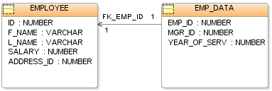

# 关系模型｜精选补充资料

> 来源：[维基百科（中文）](https://zh.wikipedia.org/wiki/%E5%85%B3%E7%B3%BB%E6%A8%A1%E5%9E%8B)  
> 许可：[CC BY-SA 4.0](https://creativecommons.org/licenses/by-sa/4.0/)  
> 语言：简体中文  
> 获取时间：2026-08-08T09:43:53.498055+00:00

维基百科，自由的百科全书

[](/wiki/File:Emp_Tables_(Database).PNG)

用于[数据库](/wiki/%E6%95%B0%E6%8D%AE%E5%BA%93 "数据库")管理的**关系模型**（英語：Relational model）是基于[谓词逻辑](/wiki/%E8%B0%93%E8%AF%8D%E9%80%BB%E8%BE%91 "谓词逻辑")和[集合论](/wiki/%E9%9B%86%E5%90%88%E8%AE%BA "集合论")的一种[数据模型](/wiki/%E6%95%B0%E6%8D%AE%E6%A8%A1%E5%9E%8B "数据模型")，廣泛被使用於[資料庫](/wiki/%E8%B3%87%E6%96%99%E5%BA%AB "資料庫")之中。最早於1969年由[埃德加·科德](/wiki/%E5%9F%83%E5%BE%B7%E5%8A%A0%C2%B7%E7%A7%91%E5%BE%B7 "埃德加·科德")提出。

## 模型

关系模型的基本假定是所有[数据](/wiki/%E6%95%B0%E6%8D%AE "数据")都表示为数学上的[关系](/wiki/%E5%85%B3%E7%B3%BB_(%E6%95%B0%E5%AD%A6) "关系 (数学)")，就是说*n*个[集合](/wiki/%E9%9B%86%E5%90%88_(%E6%95%B0%E5%AD%A6) "集合 (数学)")的[笛卡儿积](/wiki/%E7%AC%9B%E5%8D%A1%E5%84%BF%E7%A7%AF "笛卡儿积")的一个[子集](/wiki/%E5%AD%90%E9%9B%86 "子集")，有关这种数据的[推理](/wiki/%E6%8E%A8%E7%90%86 "推理")通过二值（就是说没有[NULL](/wiki/%E7%A9%BA%E5%80%BC_(SQL) "空值 (SQL)")）的[谓词逻辑](/wiki/%E8%B0%93%E8%AF%8D%E9%80%BB%E8%BE%91 "谓词逻辑")来进行，这意味着对每个[命题](/wiki/%E5%91%BD%E9%A2%98 "命题")都有两种可能的[賦值](/wiki/%E8%B3%A6%E5%80%BC_(%E9%82%8F%E8%BC%AF) "賦值 (邏輯)")：要么是真要么是假。数据通过[关系演算](/wiki/%E5%85%B3%E7%B3%BB%E6%BC%94%E7%AE%97 "关系演算")和[关系代数](/wiki/%E5%85%B3%E7%B3%BB%E4%BB%A3%E6%95%B0_(%E6%95%B0%E6%8D%AE%E5%BA%93) "关系代数 (数据库)")的一种方式来操作。关系模型是採用二維表格結構表達實體類型及實體間聯繫的數據模型.

关系模型允许[设计者](/wiki/%E8%AE%BE%E8%AE%A1%E8%80%85 "设计者")通过[数据库规范化](/wiki/%E6%95%B0%E6%8D%AE%E5%BA%93%E8%A7%84%E8%8C%83%E5%8C%96 "数据库规范化")的提炼，去建立一个[信息](/wiki/%E4%BF%A1%E6%81%AF "信息")的一致性的模型。[访问计划](/w/index.php?title=%E8%AE%BF%E9%97%AE%E8%AE%A1%E5%88%92&action=edit&redlink=1 "访问计划（页面不存在）")（英语：[Query plan](https://en.wikipedia.org/wiki/Query_plan "en:Query plan")）和其他实现与操作细节由[DBMS](/wiki/DBMS "DBMS")引擎来处理，而不应该反映在逻辑模型中。这与SQL DBMS普遍的实践是对立的，在SQL DBMS中，[性能调整](/w/index.php?title=%E6%80%A7%E8%83%BD%E8%B0%83%E6%95%B4&action=edit&redlink=1 "性能调整（页面不存在）")（英语：[Performance tuning](https://en.wikipedia.org/wiki/Performance_tuning "en:Performance tuning")）经常需要改变逻辑模型。

基本的关系建造块是[域](/wiki/%E5%AE%9A%E4%B9%89%E5%9F%9F "定义域")或者叫[数据类型](/wiki/%E6%95%B0%E6%8D%AE%E7%B1%BB%E5%9E%8B "数据类型")。[元组](/wiki/%E5%85%83%E7%BB%84 "元组")是[属性](/wiki/%E5%B1%9E%E6%80%A7 "属性")的有序[多重集](/wiki/%E5%A4%9A%E9%87%8D%E9%9B%86 "多重集")（multiset），属性是域和值的有序对。[关系变量](/w/index.php?title=%E5%85%B3%E7%B3%BB%E5%8F%98%E9%87%8F&action=edit&redlink=1 "关系变量（页面不存在）")（英语：[Relvar](https://en.wikipedia.org/wiki/Relvar "en:Relvar")）（relvar）是域和名字的[有序对](/wiki/%E6%9C%89%E5%BA%8F%E5%AF%B9 "有序对")（序偶）的集合，它充当关系的[標頭](/wiki/%E6%A8%99%E9%A0%AD "標頭")（header）。[关系](/wiki/%E5%85%B3%E7%B3%BB_(%E6%95%B0%E5%AD%A6) "关系 (数学)")是元组的集合。尽管这些关系概念是数学上的定义的，它们可以宽松的映射到传统数据库概念上。[表](/wiki/%E8%B3%87%E6%96%99%E8%A1%A8 "資料表")是关系的公认的可视表示；元组类似于[行](/wiki/%E5%88%97_(%E8%B3%87%E6%96%99%E5%BA%AB) "列 (資料庫)")的概念。

关系模型的基本原理是[資料庫](/wiki/%E8%B3%87%E6%96%99%E5%BA%AB "資料庫")：所有[信息](/wiki/%E4%BF%A1%E6%81%AF "信息")都表示为关系中的数据值。所以，关系变量在[程式设计时期](/w/index.php?title=%E7%A8%8B%E5%BC%8F%E8%AE%BE%E8%AE%A1%E6%97%B6%E6%9C%9F&action=edit&redlink=1 "程式设计时期（页面不存在）")（英语：[Program lifecycle phase](https://en.wikipedia.org/wiki/Program_lifecycle_phase "en:Program lifecycle phase")）是相互无关联的；反而，设计者在多个关系变量中使用相同的域，如果一个属性依赖于另一个属性，则通过[参照完整性](/wiki/%E5%8F%82%E7%85%A7%E5%AE%8C%E6%95%B4%E6%80%A7 "参照完整性")来强制这种[依赖性](/wiki/%E8%80%A6%E5%90%88%E6%80%A7_(%E8%A8%88%E7%AE%97%E6%A9%9F%E7%A7%91%E5%AD%B8) "耦合性 (計算機科學)")。

## 竞争者

其他[模型](/wiki/%E6%95%B0%E6%8D%AE%E6%A8%A1%E5%9E%8B "数据模型")还有[层次模型](/wiki/%E5%B1%82%E6%AC%A1%E6%A8%A1%E5%9E%8B "层次模型")和[网状模型](/wiki/%E7%BD%91%E7%8A%B6%E6%A8%A1%E5%9E%8B "网状模型")。使用这些旧[体系](/wiki/%E4%BD%93%E7%B3%BB "体系")的一些[系统](/wiki/%E7%B3%BB%E7%BB%9F "系统")现在仍在一些[数据中心](/wiki/%E6%95%B0%E6%8D%AE%E4%B8%AD%E5%BF%83 "数据中心")中使用，那里有高数据容量需求或者现存系统复杂得使迁移到采用关系模型的系统花费巨大；还要注意新的[对象数据库](/wiki/%E5%AF%B9%E8%B1%A1%E6%95%B0%E6%8D%AE%E5%BA%93 "对象数据库")，尽管它们中很多都是DBMS构造工具，而不是严格的[DBMS](/wiki/DBMS "DBMS")。

关系模型是第一个形式化的数据库模型。在它被定义之后，非形式化模型被用做描述层次数据库（层次模型）和网状数据库（网状模型）。层次和网状数据在关系数据库之前就存在了，但是只在关系模型被定义之后才作为模型来描述，用来建立比较的基础。

## 历史

关系模型是由[埃德加·科德](/wiki/%E5%9F%83%E5%BE%B7%E5%8A%A0%C2%B7%E7%A7%91%E5%BE%B7 "埃德加·科德")博士作为数据的一般模型而发明的，随后由[克里斯托佛·达特](/wiki/%E5%85%8B%E9%87%8C%E6%96%AF%E6%89%98%E4%BD%9B%C2%B7%E8%BE%BE%E7%89%B9 "克里斯托佛·达特")和[休·达温](/w/index.php?title=%E4%BC%91%C2%B7%E8%BE%BE%E6%B8%A9&action=edit&redlink=1 "休·达温（页面不存在）")（英语：[Hugh Darwen](https://en.wikipedia.org/wiki/Hugh_Darwen "en:Hugh Darwen")）（Hugh Darwen）等人维护和开发。在第三次宣言（1995年）中他们展示了如何向关系模型扩展上[面向对象](/wiki/%E9%9D%A2%E5%90%91%E5%AF%B9%E8%B1%A1%E7%9A%84%E7%A8%8B%E5%BA%8F%E8%AE%BE%E8%AE%A1 "面向对象的程序设计")特征而不用妥协它的基本原理。

## SQL标准与关系模型

[SQL](/wiki/SQL "SQL")最初作为[关系数据库](/wiki/%E5%85%B3%E7%B3%BB%E6%95%B0%E6%8D%AE%E5%BA%93 "关系数据库")的[标准](/wiki/%E6%A0%87%E5%87%86 "标准")语言而提出，而在实际上总是违背它。所以SQL DBMS实际上不是真正的[RDBMS](/wiki/RDBMS "RDBMS")，并且当前[ISO](/wiki/ISO "ISO") SQL标准不提及关系模型或者使用关系术语或概念。

## 实现

已经有很多尝试去生成埃德加·科德、克里斯多佛·戴特、休·达温等人开发的关系数据库模型的真正实现。但都没有获得流行性成功。[Rel](http://dbappbuilder.sourceforge.net/Rel.html) （[页面存档备份](//web.archive.org/web/20201109040542/http://dbappbuilder.sourceforge.net/Rel.html)，存于[互联网档案馆](/wiki/%E4%BA%92%E8%81%94%E7%BD%91%E6%A1%A3%E6%A1%88%E9%A6%86 "互联网档案馆")）是其中最新的尝试之一。SQL使用概念「表」、「[列](/wiki/%E8%A1%8C_(%E8%B3%87%E6%96%99%E5%BA%AB) "行 (資料庫)")」和「行」来替代「关系变量」、「属性」和「元组」。

## 争论

科德自己提议了关系模型的一个三值逻辑版本，而且四值逻辑版本也被提议了，用来处理缺失信息。但是这些都未被实现，大概是由于顾及到了复杂性。SQL NULL意图成为三值逻辑系统的一部分，但是由于在标准和它的实现中的逻辑上的错误而没有达到目标。

## 设计

[数据库规范化](/wiki/%E6%95%B0%E6%8D%AE%E5%BA%93%E8%A7%84%E8%8C%83%E5%8C%96 "数据库规范化")通常在设计[关系数据库](/wiki/%E5%85%B3%E7%B3%BB%E6%95%B0%E6%8D%AE%E5%BA%93 "关系数据库")时进行，用来增进[数据库设计](/w/index.php?title=%E6%95%B0%E6%8D%AE%E5%BA%93%E8%AE%BE%E8%AE%A1&action=edit&redlink=1 "数据库设计（页面不存在）")（英语：[Database design](https://en.wikipedia.org/wiki/Database_design "en:Database design")）的逻辑上的[一致性](/wiki/%E4%B8%80%E8%87%B4%E6%80%A7_(%E9%82%8F%E8%BC%AF) "一致性 (邏輯)")和事务处理性能。

有两种常用的[图解](/wiki/%E5%9B%BE%E8%A7%A3 "图解")[系统](/wiki/%E7%B3%BB%E7%BB%9F "系统")来辅助**关系模型**的[可视化](/wiki/%E5%8F%AF%E8%A7%86%E5%8C%96 "可视化")：实体-联系模式图（[实体关系图](/wiki/%E5%AE%9E%E4%BD%93%E5%85%B3%E7%B3%BB%E5%9B%BE "实体关系图")），和[美国空军](/wiki/%E7%BE%8E%E5%9B%BD%E7%A9%BA%E5%86%9B "美国空军")在ERD基础上建立的IDEF1X方法中所使用的关联[IDEF](/wiki/IDEF "IDEF")模式图。

## 样例数据库

一些关系变量和它们的属性的一个理想化和非常简单的例子：

Customer（**Customer ID**, Tax ID, Name, Address, City, State, Zip, Phone）

Order（**Order No**, Customer ID, Invoice No, Date Placed, Date Promised, Terms, Status）

Order Line（**Order No**, **Order Line No**, Product Code, Qty）

Invoice（**Invoice No**, Customer ID, Order No, Date, Status）

Invoice Line（**Invoice No**, **Line No**, Product Code, Qty Shipped）

Product（**Product Code**, Product Description）

在这个[设计](/wiki/%E8%AE%BE%E8%AE%A1 "设计")中我们有六个[关系变量](/w/index.php?title=%E5%85%B3%E7%B3%BB%E5%8F%98%E9%87%8F&action=edit&redlink=1 "关系变量（页面不存在）")（英语：[Relvar](https://en.wikipedia.org/wiki/Relvar "en:Relvar")）：Customer, Product, Order, Order Line, Invoice,和Invoice Line.粗体字有下划线的属性是*[候选键](/wiki/%E5%85%B3%E7%B3%BB%E9%94%AE#候选键 "关系键")*。非粗体字有下划线的属性是*[外键](/wiki/%E5%A4%96%E9%94%AE "外键")*。

通常任意选择一个[候选键](/wiki/%E5%85%B3%E7%B3%BB%E9%94%AE#候选键 "关系键")叫做[主键](/wiki/%E5%85%B3%E7%B3%BB%E9%94%AE#主键 "关系键")并且[优先于](/wiki/%E5%81%8F%E5%A5%BD "偏好")其他候选键，它们也就被叫做[可选键](/w/index.php?title=%E5%8F%AF%E9%80%89%E9%94%AE&action=edit&redlink=1 "可选键（页面不存在）")（英语：[Primary key#Alternate key](https://en.wikipedia.org/wiki/Primary_key#Alternate_key "en:Primary key")）。

*候选键*是强制[元组](/wiki/%E5%85%83%E7%BB%84 "元组")不重复的唯一性[标识符](/wiki/%E6%A0%87%E8%AF%86%E7%AC%A6 "标识符")；否则[关系](/wiki/%E5%85%B3%E7%B3%BB_(%E6%95%B0%E5%AD%A6) "关系 (数学)")就违背了[集合](/wiki/%E9%9B%86%E5%90%88_(%E6%95%B0%E5%AD%A6) "集合 (数学)")的基本定义，而成为[多重集](/wiki/%E5%A4%9A%E9%87%8D%E9%9B%86 "多重集")了。键 (码)可以是复合的，就是说可以由多个属性组合而成。下面是我们的例子顾客关系变量的一个表格化描述；关系可以被认为是归结到一个关系变量的值。

## 集合理论公式

关系模型中的基本概念是*关系名字*和*属性名字*。我们通常把他们表示为如“Person”和“name”这样的字符串，并且我们通常使用变量*r*、*s*、*t*、......和*a*、*b*、*c*来涉及它们。另一个基本概念*原子值*的集合包含着如数值和字符串这样的值。

我们的第一个定义关注*元组*的概念，它是表格中行或记录的概念的形式化。

:   **定义***[元组](/wiki/%E5%85%83%E7%BB%84 "元组")*是从一组属性名字到一组原子值的[偏函数](/wiki/%E5%81%8F%E5%87%BD%E6%95%B0 "偏函数")。

:   **定义***表头*是属性名字的有限集合。

:   **定义**元组*t*在属性的[有限](/wiki/%E6%9C%89%E9%99%90 "有限")集合*A*上的*投影*是*t*[*A*] = { (*a*, *v*) : (*a*, *v*) ∈ *t*, *a* ∈ *A* }。

下一个定义定义了*关系*，它是关系模型中对表格内容的形式化。

:   **定义***关系*是带有表头*H*和表体*B*的一个元组（*H*, *B*），表体是都有域*H*的元组的集合。

这种关系紧密的对应于在[一阶逻辑](/wiki/%E4%B8%80%E9%98%B6%E9%80%BB%E8%BE%91 "一阶逻辑")中通常叫做谓词外延的东西，除了我们这里用属性名字标识在谓词中的位置之外。在关系模型中[数据库模式](/wiki/%E7%B6%B1%E8%A6%81_(%E8%B3%87%E6%96%99%E5%BA%AB) "綱要 (資料庫)")是由一组关系名字，与这些名字相关联的表头，和在数据库模式的每个实例上保持的约束（英語：Constraints）构成的。

:   **定义**在表头*H*上的*关系全集'**U*****是有表头*H*的关系的非空集合。**

:   **定义***关系模式*（*H*, *C*）由表头*H*和对有表头*H*的所有关系*R*定义的谓词*C*(*R*)构成。

:   **定义** 如果关系有表头*H*并满足*C*则它满足关系模式（*H*, *C*）。

### 键（码）约束和函数依赖

最简单和最重要的一类关系约束是*键（码）约束*。它告诉我们在特定关系模式的所有实例中元组可以通过它特定属性的值来标识。

:   **定义** *超键（码）*被写为属性名字的有限集合。

:   **定义**超键（码）*K*在关系（*H*, *B*）中保持，条件是*K* ⊆ *H*并且在*B*中没有两个不同的元组*t1*和*t2*使*t1*[*K*] = *t2*[*K*]。

:   **定义**超键（码）在表头*H*之上的关系全集*U*中保持，条件是它在*U*中的所有关系中保持。

:   **定义**超键（码）*K*保持为在*H*之上的关系全集*U*的一个*[候选键](/wiki/%E5%85%B3%E7%B3%BB%E9%94%AE#候选键 "关系键")*，条件是它保持为*U*的超键（码）并且没有*K*的[真子集](/wiki/%E7%9C%9F%E5%AD%90%E9%9B%86 "真子集")也保持为*U*的超键（码）。

:   **定义** *函数依赖*（简写为FD）被写为*X*->*Y*，*X*和*Y*是属性名字的有限集合。

:   **定义**函数依赖 *X*->*Y*在关系（*H*, *B*）中保持，条件是*X*和*Y*是*H*的子集并且对于在*B*中所有的元组*t1*和*t2*使得如果*t1*[*X*] = *t2*[*X*]则't1*[*Y*] =* t2*[*Y*]。*

:   **定义**函数依赖*X*->*Y*在表头*H*之上的关系全集*U*中保持，条件是它在*U*中的所有关系中保持。

:   **定义**函数依赖在表头*H*下是*不证自明的*，条件是它在*H*下的所有关系全集中保持。

:   **定理**FD *X*->*Y*在表头*H*下是不证自明的，当且仅当*Y* ⊆ *X* ⊆ *H*。

:   **定理**超键（码）*K*在*H*之上的关系全集*U*中保持，当且仅当*K* ⊆ *H*并且*K*->*H*在*U*中保持。

:   **定义（Armstrong规则）**设*S*是FD的集合，则*S*在表头*H*下的*闭包*写为*S*+，它是*S*的符合如下规律的最小超集:

    :   (自反律)如果*Y* ⊆ *X* ⊆ *H*，则*X*->*Y*在*S*+中。
    :   (传递律)如果*X*->*Y*在*S*+中并且*Y*->*Z*在*S*+中，则*X*->*Z*在*S*+中。
    :   (增广律)如果*X*->*Y*在*S*+中并且*Z* ⊆ *H*，则*X*∪*Z* -> *Y*∪*Z*在*S*+中。

:   **定理**Armstrong规则是可靠的和完备的，就是说给定一个表头*H*和只包含*H*的子集的FD集合*S*，则FD *X*->*Y*在*S*+中，当且仅当在它在*H*之上的其中所有的*S*中的FD都保持的所有的关系全集中保持。

:   **定义**如果*X*是属性的有限集合并且*S*是FD的有限集合，则*X*在*S*下的*补集*写为*X*+，它是符合如下规律的*X*的最小超集：

    :   如果*Y*->*Z*在*S*中并且*Y* ⊆ *X*+则*Z* ⊆ *X*+。

属性集合的补集可以用来计算特定的依赖是否在FD集合的闭包中。

:   **定理**给定表头*H*和只包含*H*的子集的 FD的集合*S*，*X*->*Y*保持在*S*+中，当且仅当*Y* ⊆ *X*+。

:   **算法（从FD推导候选键（码）)**

```
      INPUT:只包含表头H的子集的FD的集合S
      OUTPUT:在H之上的其中所有的S中的FD都保持的所有的关系全集中
                保持为候选键（码）的超键（码）的集合C
      begin
        C := ∅;          // 找到的候选键（码）
        Q := { H };      // 包含候选键的超键（码）
        while Q <> ∅ do
          设K是来自Q的某个元素;
          Q := Q - { K };  
          minimal := true;
          for each X->Y in S do 
            K' := (K - Y) ∪ X;   // 推导新超键（码）
            if K' ⊂ K
            then
              minimal := false;
              Q := Q ∪ { K' };
            fi
          od
          if minimal and没有K的子集在C中
          then
            从C中去除K的所有超集;
            C := C ∪ { K };
          fi
        od
      end
```

:   **定义**给定表头*H*和只包含*H*的子集的FD的集合*S*，*S*的*不可简约覆盖*是符合如下规律的FD的集合*T*

    1. *S*+ = *T*+
    2. 没有*T*的真子集*U*使*S*+ = *U*+，
    3. 如果*X*->*Y*在*T*中则*Y*是单元素（singleton）集合并且
    4. 如果*X*->*Y*在*T*中并且*Z*是*X*的真子集则*Z*->*Y*不在*S*+中。

* [域關係演算](/wiki/%E5%9F%9F%E5%85%B3%E7%B3%BB%E6%BC%94%E7%AE%97 "域关系演算")
* [查詢語言](/wiki/%E6%9F%A5%E8%A9%A2%E8%AA%9E%E8%A8%80 "查詢語言")
* [關聯式資料庫](/wiki/%E9%97%9C%E8%81%AF%E5%BC%8F%E8%B3%87%E6%96%99%E5%BA%AB "關聯式資料庫")
* [关系的不同历史版本的元组式控制](/w/index.php?title=%E5%85%83%E7%BB%84%E5%BC%8F%E7%89%88%E6%9C%AC%E6%8E%A7%E5%88%B6&action=edit&redlink=1 "元组式版本控制（页面不存在）")（英语：[Tuple-versioning](https://en.wikipedia.org/wiki/Tuple-versioning "en:Tuple-versioning")）

## 引用

1. **[^](#cite_ref-1)** Codd, E.F, Derivability, Redundancy, and Consistency of Relations Stored in Large Data Banks, Research Report, IBM, 1969 .
2. **[^](#cite_ref-codd1970_2-0)** Codd, E.F. [A Relational Model of Data for Large Shared Data Banks](https://web.archive.org/web/20070612235326/http://www.acm.org/classics/nov95/toc.html). [Communications of the ACM](/wiki/Communications_of_the_ACM "Communications of the ACM"). Classics. 1970, **13** (6): 377–87. [S2CID 207549016](https://api.semanticscholar.org/CorpusID:207549016). [doi:10.1145/362384.362685](https://doi.org/10.1145%2F362384.362685) . （[原始内容](http://www.acm.org/classics/nov95/toc.html)存档于2007-06-12）.
3. **[^](#cite_ref-3)** [Did Date and Darwen's "Third Manifesto" have a lasting impact?](https://cs.stackexchange.com/questions/99350/did-date-and-darwens-third-manifesto-have-a-lasting-impact). Computer Science Stack Exchange.  [2024-08-03]. （原始内容[存档](https://web.archive.org/web/20250227090439/https://cs.stackexchange.com/questions/99350/did-date-and-darwens-third-manifesto-have-a-lasting-impact)于2025-02-27） （英语）.

## 延伸閱讀

* Date, C. J., Darwen, H. (2000). "Foundation for Future Database Systems: The Third Manifesto", 2nd Edn. Addison-Wesley.
* Date, Christopher J. (2003). "Introduction to Database Systems". 8th ed.

* [關聯式模型](https://web.archive.org/web/20100608024951/http://structedtext.appspot.com/db/rel_mod.html)
* [A Relational Model of Data for Large Shared Data Banks](https://web.archive.org/web/20070612235326/http://www.acm.org/classics/nov95/toc.html)
* [DMoz category](https://web.archive.org/web/20050907022628/http://dmoz.org/Computers/Software/Databases/Relational/)
* [Relational Model](http://c2.com/cgi/wiki?RelationalModel) （[页面存档备份](//web.archive.org/web/20160716195801/http://c2.com/cgi/wiki?RelationalModel)，存于[互联网档案馆](/wiki/%E4%BA%92%E8%81%94%E7%BD%91%E6%A1%A3%E6%A1%88%E9%A6%86 "互联网档案馆")）

[分类](/wiki/Special:Categories "Special:Categories")：​

* [關聯模型](/wiki/Category:%E9%97%9C%E8%81%AF%E6%A8%A1%E5%9E%8B "Category:關聯模型")
* [数据建模](/wiki/Category:%E6%95%B0%E6%8D%AE%E5%BB%BA%E6%A8%A1 "Category:数据建模")

隐藏分类：​

* [CS1英语来源 (en)](/wiki/Category:CS1%E8%8B%B1%E8%AF%AD%E6%9D%A5%E6%BA%90_(en) "Category:CS1英语来源 (en)")
* [自2025年2月粗劣翻译](/wiki/Category:%E8%87%AA2025%E5%B9%B42%E6%9C%88%E7%B2%97%E5%8A%A3%E7%BF%BB%E8%AF%91 "Category:自2025年2月粗劣翻译")
* [含有英語的條目](/wiki/Category:%E5%90%AB%E6%9C%89%E8%8B%B1%E8%AA%9E%E7%9A%84%E6%A2%9D%E7%9B%AE "Category:含有英語的條目")
* [带有伪代码示例的条目](/wiki/Category:%E5%B8%A6%E6%9C%89%E4%BC%AA%E4%BB%A3%E7%A0%81%E7%A4%BA%E4%BE%8B%E7%9A%84%E6%9D%A1%E7%9B%AE "Category:带有伪代码示例的条目")
