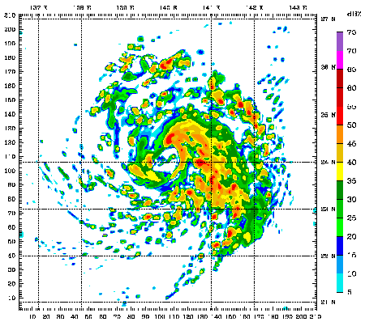

# 计算机模拟｜精选补充资料

> 来源：[维基百科（中文）](https://zh.wikipedia.org/wiki/%E8%AE%A1%E7%AE%97%E6%9C%BA%E6%A8%A1%E6%8B%9F)  
> 许可：[CC BY-SA 4.0](https://creativecommons.org/licenses/by-sa/4.0/)  
> 语言：简体中文  
> 获取时间：2026-08-08T09:43:58.609721+00:00

维基百科，自由的百科全书

使用使用天氣研究和預報模型做颱風Mawar的48小時電腦模擬。

**计算机模拟**，又称为**计算机仿真**，是[数学建模](/wiki/%E6%95%B0%E5%AD%A6%E6%A8%A1%E5%9E%8B "数学模型")的过程，运行在[计算机](/wiki/%E8%AE%A1%E7%AE%97%E6%9C%BA "计算机")之上，旨在预测某个真实世界或物理系统的行为或者结果。其中，部分数学模型的可靠性可通过对比仿真结果和真实世界结果的一致性得出。目前计算机仿真，对于很多[物理学](/wiki/%E7%89%A9%E7%90%86%E5%AD%A6 "物理学")（[计算物理学](/wiki/%E8%AE%A1%E7%AE%97%E7%89%A9%E7%90%86%E5%AD%A6 "计算物理学")）、[天体物理学](/wiki/%E5%A4%A9%E4%BD%93%E7%89%A9%E7%90%86%E5%AD%A6 "天体物理学")、[气候学](/wiki/%E6%B0%94%E5%80%99%E5%AD%A6 "气候学")、[化学](/wiki/%E5%8C%96%E5%AD%B8 "化學")、[生物学](/wiki/%E7%94%9F%E7%89%A9%E5%AD%A6 "生物学")、[制造业](/wiki/%E5%88%B6%E9%80%A0%E4%B8%9A "制造业")中的自然系统，以及[经济学](/wiki/%E7%BB%8F%E6%B5%8E%E5%AD%A6 "经济学")、[心理学](/wiki/%E5%BF%83%E7%90%86%E5%AD%A6 "心理学")、[社学科学](/wiki/%E7%A4%BE%E4%BC%9A%E7%A7%91%E5%AD%A6 "社会科学")、[医疗保健](/wiki/%E9%86%AB%E7%99%82%E4%BF%9D%E5%81%A5 "醫療保健")、[工程学](/wiki/%E5%B7%A5%E7%A8%8B%E5%AD%A6 "工程学")中的人类系统的数学建模，都是非常有帮助的工具。

一次系统仿真代表一次系统模型的运行。它可以用来探索新技术，获取新的洞见，也可用于评估复杂系统的表现性能。计算机仿真可以是运行在小型机上的即时的小型程序，也可以是运行在基于网络的计算机组里费时多天的大型程序。计算机仿真所能模拟的规模远超传统用纸笔进行的数学建模。

## 仿真 vs 模型

计算机模型，是用于捕捉系统行为的一组算法和等式。反之，计算机仿真是针对包含这些算法和等式的程序的实际运行。因此，仿真是模型运行的过程。比如，通常我们不会说“构建仿真”，而会说“构建模型/仿真器”，同时还可以说“运行模型”或者“运行仿真”，是一个意思。

## 历史

计算机模拟的发展与电脑本身的迅速发展是分不开的。它的首次大规模开发是著名的[曼哈顿计划](/wiki/%E6%9B%BC%E5%93%88%E9%A1%BF%E8%AE%A1%E5%88%92 "曼哈顿计划")中的一个重要部分。在[第二次世界大战](/wiki/%E7%AC%AC%E4%BA%8C%E6%AC%A1%E4%B8%96%E7%95%8C%E5%A4%A7%E6%88%98 "第二次世界大战")中，为了模拟核爆炸的过程，人们应用[蒙特·卡罗方法](/wiki/%E8%92%99%E7%89%B9%C2%B7%E5%8D%A1%E7%BD%97%E6%96%B9%E6%B3%95 "蒙特·卡罗方法")用12个坚球模型进行了模拟。计算机模拟最初被作为其他的方面研究的补充，但当人们发现它的重要性之后，它便作为一门单独的课题被使用得相当广泛。
計算機模擬從運行數分鐘到數小時到數天。通過計算機模擬被模擬事件的規模已遠遠超過使用傳統紙和鉛筆數學建模任何可能的（甚至想像）。

## 种类

通常分为如下几类：

* 离散模拟
* 类比模拟
* 基于[探元](/w/index.php?title=%E6%8E%A2%E5%85%83&action=edit&redlink=1 "探元（页面不存在）")的模拟
* [随机过程](/wiki/%E9%9A%8F%E6%9C%BA%E8%BF%87%E7%A8%8B "随机过程")或[决定论](/wiki/%E5%86%B3%E5%AE%9A%E8%AE%BA "决定论")模式的模拟

## 科学研究中的计算机模拟

例如：[蒙特·卡罗方法](/wiki/%E8%92%99%E7%89%B9%C2%B7%E5%8D%A1%E7%BD%97%E6%96%B9%E6%B3%95 "蒙特·卡罗方法")、[模拟煺火](/wiki/%E6%A8%A1%E6%8B%9F%E7%85%BA%E7%81%AB "模拟煺火")、[群体智能](/wiki/%E7%BE%A4%E4%BD%93%E6%99%BA%E8%83%BD "群体智能")

* [可视化](/wiki/%E5%8F%AF%E8%A7%86%E5%8C%96 "可视化")
  + [信息可视化](/wiki/%E4%BF%A1%E6%81%AF%E5%8F%AF%E8%A7%86%E5%8C%96 "信息可视化")
  + [科学可视化](/wiki/%E7%A7%91%E5%AD%A6%E5%8F%AF%E8%A7%86%E5%8C%96 "科学可视化")
* [数学模型](/wiki/%E6%95%B0%E5%AD%A6%E6%A8%A1%E5%9E%8B "数学模型")
* [活地球模拟器](/wiki/%E6%B4%BB%E5%9C%B0%E7%90%83%E6%A8%A1%E6%8B%9F%E5%99%A8 "活地球模拟器")

## 參考資料

[分类](/wiki/Special:Categories "Special:Categories")：​

* [科学建模](/wiki/Category:%E7%A7%91%E5%AD%A6%E5%BB%BA%E6%A8%A1 "Category:科学建模")
* [科學方法](/wiki/Category:%E7%A7%91%E5%AD%B8%E6%96%B9%E6%B3%95 "Category:科學方法")
* [虚拟现实](/wiki/Category:%E8%99%9A%E6%8B%9F%E7%8E%B0%E5%AE%9E "Category:虚拟现实")
* [计算机应用](/wiki/Category:%E8%AE%A1%E7%AE%97%E6%9C%BA%E5%BA%94%E7%94%A8 "Category:计算机应用")
* [计算科学](/wiki/Category:%E8%AE%A1%E7%AE%97%E7%A7%91%E5%AD%A6 "Category:计算科学")

隐藏分类：​

* [自2024年8月缺少来源的条目](/wiki/Category:%E8%87%AA2024%E5%B9%B48%E6%9C%88%E7%BC%BA%E5%B0%91%E6%9D%A5%E6%BA%90%E7%9A%84%E6%9D%A1%E7%9B%AE "Category:自2024年8月缺少来源的条目")
* [包含BNE标识符的维基百科条目](/wiki/Category:%E5%8C%85%E5%90%ABBNE%E6%A0%87%E8%AF%86%E7%AC%A6%E7%9A%84%E7%BB%B4%E5%9F%BA%E7%99%BE%E7%A7%91%E6%9D%A1%E7%9B%AE "Category:包含BNE标识符的维基百科条目")
* [包含BNF标识符的维基百科条目](/wiki/Category:%E5%8C%85%E5%90%ABBNF%E6%A0%87%E8%AF%86%E7%AC%A6%E7%9A%84%E7%BB%B4%E5%9F%BA%E7%99%BE%E7%A7%91%E6%9D%A1%E7%9B%AE "Category:包含BNF标识符的维基百科条目")
* [包含BNFdata标识符的维基百科条目](/wiki/Category:%E5%8C%85%E5%90%ABBNFdata%E6%A0%87%E8%AF%86%E7%AC%A6%E7%9A%84%E7%BB%B4%E5%9F%BA%E7%99%BE%E7%A7%91%E6%9D%A1%E7%9B%AE "Category:包含BNFdata标识符的维基百科条目")
* [包含GND标识符的维基百科条目](/wiki/Category:%E5%8C%85%E5%90%ABGND%E6%A0%87%E8%AF%86%E7%AC%A6%E7%9A%84%E7%BB%B4%E5%9F%BA%E7%99%BE%E7%A7%91%E6%9D%A1%E7%9B%AE "Category:包含GND标识符的维基百科条目")
* [包含J9U标识符的维基百科条目](/wiki/Category:%E5%8C%85%E5%90%ABJ9U%E6%A0%87%E8%AF%86%E7%AC%A6%E7%9A%84%E7%BB%B4%E5%9F%BA%E7%99%BE%E7%A7%91%E6%9D%A1%E7%9B%AE "Category:包含J9U标识符的维基百科条目")
* [包含LCCN标识符的维基百科条目](/wiki/Category:%E5%8C%85%E5%90%ABLCCN%E6%A0%87%E8%AF%86%E7%AC%A6%E7%9A%84%E7%BB%B4%E5%9F%BA%E7%99%BE%E7%A7%91%E6%9D%A1%E7%9B%AE "Category:包含LCCN标识符的维基百科条目")
* [包含LNB标识符的维基百科条目](/wiki/Category:%E5%8C%85%E5%90%ABLNB%E6%A0%87%E8%AF%86%E7%AC%A6%E7%9A%84%E7%BB%B4%E5%9F%BA%E7%99%BE%E7%A7%91%E6%9D%A1%E7%9B%AE "Category:包含LNB标识符的维基百科条目")
* [包含NKC标识符的维基百科条目](/wiki/Category:%E5%8C%85%E5%90%ABNKC%E6%A0%87%E8%AF%86%E7%AC%A6%E7%9A%84%E7%BB%B4%E5%9F%BA%E7%99%BE%E7%A7%91%E6%9D%A1%E7%9B%AE "Category:包含NKC标识符的维基百科条目")
