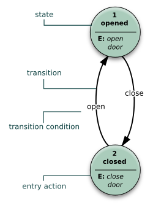
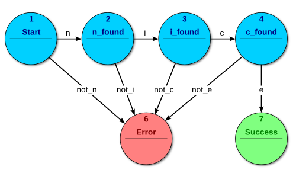
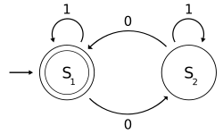
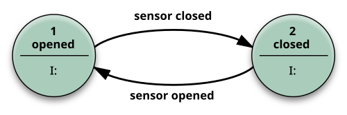
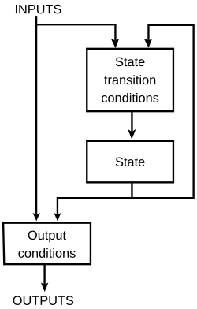

# 有限状态机｜精选补充资料

> 来源：[维基百科（中文）](https://zh.wikipedia.org/wiki/%E6%9C%89%E9%99%90%E7%8A%B6%E6%80%81%E6%9C%BA)  
> 许可：[CC BY-SA 4.0](https://creativecommons.org/licenses/by-sa/4.0/)  
> 语言：简体中文  
> 获取时间：2026-08-08T09:43:56.637818+00:00

维基百科，自由的百科全书

图1有限状态机

**有限状态机**（英語：finite-state machine，缩写：**FSM**）又称**有限状态自动机**（英語：finite-state automaton，[缩写](/wiki/%E7%B8%AE%E5%AF%AB "縮寫")：**FSA**），简称**状态机**，是表示有限个[状态](/w/index.php?title=%E7%8A%B6%E6%80%81_(%E8%AE%A1%E7%AE%97%E6%9C%BA%E7%A7%91%E5%AD%A6)&action=edit&redlink=1 "状态 (计算机科学)（页面不存在）")（英语：[State (computer science)](https://en.wikipedia.org/wiki/State_(computer_science) "en:State (computer science)")）以及在这些状态之间的转移和动作等行为的[数学计算模型](/wiki/%E8%AE%A1%E7%AE%97%E6%A8%A1%E5%9E%8B_(%E6%95%B0%E5%AD%A6) "计算模型 (数学)")。它是一台（真实或假设的）机器，其对于输入（input）的响应（或输出）形成于一组状态（state）和一组用于从某状态传递到另一状态的规则（rules）。

## 概念和术语

状态存储关于过去的信息，就是说：它反映从系统开始到现在时刻的输入变化。转移指示状态变更，并且用必须满足确使转移发生的条件来描述它。动作是在给定时刻要进行的活动的描述。有多种类型的动作：

进入动作（entry action）：在进入状态时进行

退出动作（exit action）：在退出状态时进行

输入动作：依赖于当前状态和输入条件进行

转移动作：在进行特定转移时进行

FSM（有限状态机）可以使用上面图1那样的[状态图](/wiki/%E7%8A%B6%E6%80%81%E5%9B%BE "状态图")（或状态转移图）来表示。此外可以使用多种类型的[状态转移表](/wiki/%E7%8A%B6%E6%80%81%E8%BD%AC%E7%A7%BB%E8%A1%A8 "状态转移表")。下面展示最常见的表示：当前状态（B）和条件（Y）的组合指示出下一个状态（C）。完整的动作信息可以只使用脚注来增加。包括完整动作信息的FSM定义可以使用[状态表](/wiki/%E7%8A%B6%E6%80%81%E8%BD%AC%E7%A7%BB%E8%A1%A8 "状态转移表")。

:   :   **状态转移表**

        | 当前状态→ 条件↓ | 状态A | 状态B | 状态C |
        | --- | --- | --- | --- |
        | 条件X | ... | ... | ... |
        | 条件Y | ... | 状态C | ... |
        | 条件Z | ... | ... | ... |

除了建模这里介绍的反应系统之外，有限状态自动机在很多不同领域中是重要的，包括[电子工程](/wiki/%E7%94%B5%E5%AD%90%E5%B7%A5%E7%A8%8B "电子工程")、[语言学](/wiki/%E8%AF%AD%E8%A8%80%E5%AD%A6 "语言学")、[计算机科学](/wiki/%E8%AE%A1%E7%AE%97%E6%9C%BA%E7%A7%91%E5%AD%A6 "计算机科学")、[哲学](/wiki/%E5%93%B2%E5%AD%A6 "哲学")、[生物学](/wiki/%E7%94%9F%E7%89%A9%E5%AD%A6 "生物学")、[数学](/wiki/%E6%95%B0%E5%AD%A6 "数学")和[逻辑学](/wiki/%E9%80%BB%E8%BE%91%E5%AD%A6 "逻辑学")。有限状态机是在[自动机理论](/wiki/%E8%87%AA%E5%8A%A8%E6%9C%BA%E7%90%86%E8%AE%BA "自动机理论")和[计算理论](/wiki/%E8%AE%A1%E7%AE%97%E7%90%86%E8%AE%BA "计算理论")中研究的一类自动机。在计算机科学中，有限状态机被广泛用于建模应用行为、硬件电路系统设计、软件工程，编译器、网络协议、和计算与语言的研究。

## 分类

有两个不同的群组：接受器／识别器和变换器。

### 接受器和识别器

图2接受器FSM：解析单词"nice"

**接受器**和**识别器**（也叫做**序列检测器**）产生一个二元输出，说要么“是”要么“否”来回答输入是否被机器接受。所有FSM的状态被称为要么接受要么不接受。在所有输入都被处理了的时候，如果当前状态是接受状态，输入被接受，否则被拒绝。作为规则，输入是符号（字符）；动作不使用。图2中的例子展示了接受单词"nice"的有限状态自动机，在这个FSM中唯一的接受状态是状态7。

机器还可以被描述为定义了一个语言，它包含了这个机器所接受而非拒绝的所有字词；我们称这个语言被这个机器接受。通过定义，FSM接受的语言是[正则语言](/wiki/%E6%AD%A3%E5%88%99%E8%AF%AD%E8%A8%80 "正则语言") - 就是说，如果一个语言被某个FSM接受，那么它是正则的（cf. Kleene的定理）。

#### 开始状态

开始状态通常用“没有起点的箭头”指向它来表示

:   

    图3：一個FSM的示意圖：检测二进制数是否含有偶数个0，其中

    S

    1
    {\displaystyle S\_{1}}
    ${\displaystyle S\_{1}}$ 是**接受狀態**

**接受状态**（或稱**最終狀態**）是一個机器回報到目前為止，輸入字串屬於它所接受的內容之狀態。狀態圖中通常將其標示为双圓圈。  
開始狀態也可以是接受狀態，此情況下自動機會接受空字串。如果開始狀態不是接受狀態，且沒有可以連到任何接受狀態的箭頭，那麼此自動機就不會「接受」任何輸入。  
一个接受状态的例子如图3：一台判断输入[二进位](/wiki/%E4%BA%8C%E8%BF%9B%E5%88%B6 "二进制")字串是否含有偶数个0的 [确定有限自动机](/wiki/%E7%A2%BA%E5%AE%9A%E6%9C%89%E9%99%90%E8%87%AA%E5%8B%95%E6%A9%9F "確定有限自動機")（DFA）。  
*S*1 代表着已经输入了偶数个0，因此*S*1 即為接受状态（同時亦為開始狀態）。若輸入含有偶數個0（包含沒有0的字串），則此機器會以接受狀態來結束。  
被這台DFA接受的字串，舉例來說是[ε](/wiki/%CE%95 "Ε")（[空字串](/wiki/%E7%A9%BA%E5%AD%97%E4%B8%B2 "空字串")）, 1, 11, 11..., 00, 010, 1010, 10110...等等。

### 变换器

[变换器](/w/index.php?title=%E6%9C%89%E9%99%90%E7%8A%B6%E6%80%81%E5%8F%98%E6%8D%A2%E5%99%A8&action=edit&redlink=1 "有限状态变换器（页面不存在）")使用动作基于给定输入和／或状态生成输出。它们用于控制应用。常分为两种类型：

#### Moore机

主条目：[摩尔型有限状态机](/wiki/%E6%91%A9%E5%B0%94%E5%9E%8B%E6%9C%89%E9%99%90%E7%8A%B6%E6%80%81%E6%9C%BA "摩尔型有限状态机")

只使用进入动作的FSM，就是说输出只依赖于状态。Moore模型的好处是行为的简单性。图1的例子展示了一个电梯门的Moore FSM。这个状态机识别两个命令：“command\_open”和“command\_close”触發状态变更。在状态“Opening”中的进入动作 (E:)开启电机开门，在状态“Closing”中的进入动作以反方向开启电机关门。状态“Opened”和“Closed”不进行任何动作。它们信号通知外部世界（比如其他状态机）情况：“门开着”或“门关着”。

#### Mealy机

图4变换器FSM: Mealy模型例子

主条目：[米利型有限状态机](/wiki/%E7%B1%B3%E5%88%A9%E5%9E%8B%E6%9C%89%E9%99%90%E7%8A%B6%E6%80%81%E6%9C%BA "米利型有限状态机")

只使用输入动作的FSM，就是说输出依赖于输入和状态。Mealy FSM的使用经常导致状态数目的简约。在图4中的例子展示了实现同上面Moore机同样行为的Mealy FSM（行为依赖于实现的FSM执行模型，比如对[虚拟FSM](/w/index.php?title=%E8%99%9A%E6%8B%9F%E6%9C%89%E9%99%90%E7%8A%B6%E6%80%81%E6%9C%BA&action=edit&redlink=1 "虚拟有限状态机（页面不存在）")可工作但对[事件驱动FSM](/wiki/%E4%BA%8B%E4%BB%B6%E9%A9%85%E5%8B%95%E6%9C%89%E9%99%90%E7%8B%80%E6%85%8B%E6%A9%9F "事件驅動有限狀態機")不行）。有两个输入动作（I:）：“开启电机关门如果command\_close下达”和“反向开启电机开门如果command\_open下达”。

在实践中经常使用混合模型。

进一步可区分为**确定型**（[DFA](/wiki/%E7%A1%AE%E5%AE%9A%E6%9C%89%E9%99%90%E7%8A%B6%E6%80%81%E8%87%AA%E5%8A%A8%E6%9C%BA "确定有限状态自动机")）和**非确定型**（[NDFA](/wiki/%E9%9D%9E%E7%A1%AE%E5%AE%9A%E6%9C%89%E9%99%90%E7%8A%B6%E6%80%81%E8%87%AA%E5%8A%A8%E6%9C%BA "非确定有限状态自动机")、[GNFA](/w/index.php?title=GNFA&action=edit&redlink=1 "GNFA（页面不存在）")）自动机。在确定型自动机中，每个状态对每个可能输入只有精确的一个转移。在非确定型自动机中，给定状态对给定可能输入可以没有或有多于一个转移。这个区分在实践而非理论中更有用，因为存在算法把任何NDFA转换成等价的DFA，尽管这种转换一般会增加自动机的复杂性。

只有一个状态的FSM叫做组合FSM并只使用输入动作。这个概念在多个FSM要一起工作的情况下是有用的，这时把纯组合部分看作一种形式的FSM来适合设计工具可能是方便的。

## FSM逻辑

图5 FSM逻辑

FSM的下一个状态和输出是由输入和当前状态决定的。FSM逻辑在图5中展示。

## 数学模型

依据类型不同有多种定义。**接受器**有限状态机是[五元组](/wiki/%E5%A4%9A%E5%85%83%E7%BB%84 "多元组")

(
Σ
,
S
,

s

0
,
δ
,
F
)
{\displaystyle (\Sigma ,S,s\_{0},\delta ,F)}
${\displaystyle (\Sigma ,S,s\_{0},\delta ,F)}$，这里的：

* Σ
  {\displaystyle \Sigma }
  ${\displaystyle \Sigma }$是输入[字母表](/wiki/%E5%AD%97%E6%AF%8D%E8%A1%A8_(%E8%AE%A1%E7%AE%97%E6%9C%BA%E7%A7%91%E5%AD%A6) "字母表 (计算机科学)")（符号的非空有限集合）。
* S
  {\displaystyle S}
  ${\displaystyle S}$是状态的非空有限集合。
* s

  0
  {\displaystyle s\_{0}}
  ${\displaystyle s\_{0}}$是初始状态，它是

  S
  {\displaystyle S}
  ${\displaystyle S}$的元素。在[非确定有限状态自动机](/wiki/%E9%9D%9E%E7%A1%AE%E5%AE%9A%E6%9C%89%E9%99%90%E7%8A%B6%E6%80%81%E8%87%AA%E5%8A%A8%E6%9C%BA "非确定有限状态自动机")中，

  s

  0
  {\displaystyle s\_{0}}
  ${\displaystyle s\_{0}}$是初始状态的集合。
* δ
  {\displaystyle \delta }
  ${\displaystyle \delta }$是状态转移函数：

  δ
  :
  S
  ×
  Σ
  →
  S
  {\displaystyle \delta :S\times \Sigma \rightarrow S}
  ${\displaystyle \delta :S\times \Sigma \rightarrow S}$。
* F
  {\displaystyle F}
  ${\displaystyle F}$是最终状态的集合，

  S
  {\displaystyle S}
  ${\displaystyle S}$的（可能为空）子集。

**变换器**有限状态自动机是[六元组](/wiki/%E5%A4%9A%E5%85%83%E7%BB%84 "多元组")

(
Σ
,
Γ
,
S
,

s

0
,
δ
,
ω
)
{\displaystyle (\Sigma ,\Gamma ,S,s\_{0},\delta ,\omega )}
${\displaystyle (\Sigma ,\Gamma ,S,s\_{0},\delta ,\omega )}$，这里的：

* Σ
  {\displaystyle \Sigma }
  ${\displaystyle \Sigma }$是输入字母表（符号的非空有限集合）。
* Γ
  {\displaystyle \Gamma }
  ${\displaystyle \Gamma }$是输出字母表（符号的非空有限集合）。
* S
  {\displaystyle S}
  ${\displaystyle S}$是状态的非空有限集合。
* s

  0
  {\displaystyle s\_{0}}
  ${\displaystyle s\_{0}}$是初始状态，它是

  S
  {\displaystyle S}
  ${\displaystyle S}$的元素。在[非确定有限状态自动机](/wiki/%E9%9D%9E%E7%A1%AE%E5%AE%9A%E6%9C%89%E9%99%90%E7%8A%B6%E6%80%81%E8%87%AA%E5%8A%A8%E6%9C%BA "非确定有限状态自动机")中，

  s

  0
  {\displaystyle s\_{0}}
  ${\displaystyle s\_{0}}$是初始状态的集合。
* δ
  {\displaystyle \delta }
  ${\displaystyle \delta }$是状态转移函数：

  δ
  :
  S
  ×
  Σ
  →
  S
  {\displaystyle \delta :S\times \Sigma \rightarrow S}
  ${\displaystyle \delta :S\times \Sigma \rightarrow S}$。
* ω
  {\displaystyle \omega }
  ${\displaystyle \omega }$是输出函数。

如果输出函数是状态和输入字母表的函数（

ω
:
S
×
Σ
→
Γ
{\displaystyle \omega :S\times \Sigma \rightarrow \Gamma }
${\displaystyle \omega :S\times \Sigma \rightarrow \Gamma }$），则定义对应于**Mealy模型**，它可以建模为[Mealy机](/wiki/Mealy%E6%9C%BA "Mealy机")。如果输出函数只依赖于状态 (

ω
:
S
→
Γ
{\displaystyle \omega :S\rightarrow \Gamma }
${\displaystyle \omega :S\rightarrow \Gamma }$），则定义对应于**Moore模型**，它可建模为[Moore机](/wiki/Moore%E6%9C%BA "Moore机")。根本没有输出函数的有限状态机叫做[半自动机](/wiki/%E5%8D%8A%E8%87%AA%E5%8A%A8%E6%9C%BA "半自动机")或[转移系统](/wiki/%E8%BD%AC%E7%A7%BB%E7%B3%BB%E7%BB%9F "转移系统")。

## 优化

优化一个FSM意味着缩减状态机的状态数目，同时保证状态机能实现同样功能。一种可能是使用[真值表](/wiki/%E7%9C%9F%E5%80%BC%E8%A1%A8 "真值表")或[Moore简约过程](/w/index.php?title=Moore%E7%AE%80%E7%BA%A6%E8%BF%87%E7%A8%8B&action=edit&redlink=1 "Moore简约过程（页面不存在）")。另一种可能是[无环FSA的自底向上算法](http://www.cs.jhu.edu/~hajic/courses/cs226/alg.html) （[页面存档备份](//web.archive.org/web/20200217023735/http://www.cs.jhu.edu/~hajic/courses/cs226/alg.html)，存于[互联网档案馆](/wiki/%E4%BA%92%E8%81%94%E7%BD%91%E6%A1%A3%E6%A1%88%E9%A6%86 "互联网档案馆")）。

## 实现

### 硬件应用

图6 4位[TTL](/wiki/%E9%9B%BB%E6%99%B6%E9%AB%94-%E9%9B%BB%E6%99%B6%E9%AB%94%E9%82%8F%E8%BC%AF%E9%9B%BB%E8%B7%AF "電晶體-電晶體邏輯電路")计数器的[电路图](/wiki/%E9%9B%BB%E8%B7%AF%E5%9C%96 "電路圖")

在[数字电路](/wiki/%E6%95%B0%E5%AD%97%E7%94%B5%E8%B7%AF "数字电路")中，FSM可以用[可编程逻辑设备](/wiki/%E5%8F%AF%E7%BC%96%E7%A8%8B%E9%80%BB%E8%BE%91%E8%AE%BE%E5%A4%87 "可编程逻辑设备")、[可编程逻辑控制器](/wiki/%E5%8F%AF%E7%BC%96%E7%A8%8B%E9%80%BB%E8%BE%91%E6%8E%A7%E5%88%B6%E5%99%A8 "可编程逻辑控制器")、[逻辑门](/wiki/%E9%80%BB%E8%BE%91%E9%97%A8 "逻辑门")和[触发器](/wiki/%E8%A7%A6%E5%8F%91%E5%99%A8 "触发器")或[继电器](/wiki/%E7%BB%A7%E7%94%B5%E5%99%A8 "继电器")来建造。更明确的说，硬件实现要求[寄存器](/wiki/%E5%AF%84%E5%AD%98%E5%99%A8 "寄存器")来存储状态变量，确定状态转移的一块组合逻辑，和确定FSM输出的另一块组合逻辑。一类经典硬件实现是[Richards 控制器](/wiki/Richards_%E6%8E%A7%E5%88%B6%E5%99%A8 "Richards 控制器")。

### 软件应用

下列概念经常用来建造有有限状态机的软件应用：

* [事件驱动FSM](/wiki/%E4%BA%8B%E4%BB%B6%E9%A9%85%E5%8B%95%E6%9C%89%E9%99%90%E7%8B%80%E6%85%8B%E6%A9%9F "事件驅動有限狀態機")
* [虚拟FSM (VFSM)](/w/index.php?title=%E8%99%9A%E6%8B%9F%E6%9C%89%E9%99%90%E7%8A%B6%E6%80%81%E6%9C%BA&action=edit&redlink=1 "虚拟有限状态机（页面不存在）")
* [基于自动机编程](/wiki/%E5%9F%BA%E4%BA%8E%E8%87%AA%E5%8A%A8%E6%9C%BA%E7%BC%96%E7%A8%8B "基于自动机编程")

## 參考文獻

1. **[^](#cite_ref-1)** Oxford English Dictionary, “automaton (n.), sense 4,” December 2025, [doi:10.1093/OED/1101111551](https://doi.org/10.1093%2FOED%2F1101111551)  使用`|accessdate=`需要含有`|url=` ([帮助](/wiki/Help:%E5%BC%95%E6%96%87%E6%A0%BC%E5%BC%8F1%E9%94%99%E8%AF%AF#accessdate_missing_url "Help:引文格式1错误"))
2. **[^](#cite_ref-2)** Sipser, Introduction to the Theory of Computation (2006), p. 34

## 參考書目

* Wagner, F., "Modeling Software with Finite State Machines: A Practical Approach", Auerbach Publications, 2006, [ISBN 0-8493-8086-3](/wiki/Special:BookSources/0849380863).
* Samek, M., [*Practical Statecharts in C/C++*](http://www.state-machine.com/psicc1/)[[永久失效連結](/wiki/Wikipedia:%E5%A4%B1%E6%95%88%E9%93%BE%E6%8E%A5 "Wikipedia:失效链接")], CMP Books, 2002, [ISBN 1-57820-110-1](/wiki/Special:BookSources/1578201101).
* Samek, M., [*Practical UML Statecharts in C/C++, 2nd Edition*](http://www.state-machine.com/psicc2/) （[页面存档备份](//web.archive.org/web/20210115131036/http://www.state-machine.com/psicc2/)，存于[互联网档案馆](/wiki/%E4%BA%92%E8%81%94%E7%BD%91%E6%A1%A3%E6%A1%88%E9%A6%86 "互联网档案馆")）, Newnes, 2008, [ISBN 0-7506-8706-1](/wiki/Special:BookSources/0750687061).
* Cassandras, C., Lafortune, S., "Introduction to Discrete Event Systems". Kluwer, 1999, [ISBN 0-7923-8609-4](/wiki/Special:BookSources/0792386094).
* Timothy Kam, *Synthesis of Finite State Machines: Functional Optimization*. Kluwer Academic Publishers, Boston 1997, [ISBN 0-7923-9842-4](/wiki/Special:BookSources/0792398424)
* Tiziano Villa, *Synthesis of Finite State Machines: Logic Optimization*. Kluwer Academic Publishers, Boston 1997, [ISBN 0-7923-9892-0](/wiki/Special:BookSources/0792398920)
* Carroll, J., Long, D. , *Theory of Finite Automata with an Introduction to Formal Languages*. Prentice Hall, Englewood Cliffs, 1989.
* Kohavi, Z., *Switching and Finite Automata Theory*. McGraw-Hill, 1978.
* Gill, A., *Introduction to the Theory of Finite-state Machines*. McGraw-Hill, 1962.
* Ginsburg, S., *An Introduction to Mathematical Machine Theory*. Addison-Wesley, 1962.

* [Description from the Free On-Line Dictionary of Computing](http://foldoc.doc.ic.ac.uk/foldoc/foldoc.cgi?query=finite+state+machine)[[永久失效連結](/wiki/Wikipedia:%E5%A4%B1%E6%95%88%E9%93%BE%E6%8E%A5 "Wikipedia:失效链接")]
* NIST Dictionary of Algorithms and Data Structures [entry](http://www.nist.gov/dads/HTML/finiteStateMachine.html) （[页面存档备份](//web.archive.org/web/20071007111907/http://www.nist.gov/dads/HTML/finiteStateMachine.html)，存于[互联网档案馆](/wiki/%E4%BA%92%E8%81%94%E7%BD%91%E6%A1%A3%E6%A1%88%E9%A6%86 "互联网档案馆")）
* [Hierarchical State Machines](http://www.eventhelix.com/RealtimeMantra/HierarchicalStateMachine.htm) （[页面存档备份](//web.archive.org/web/20070927213215/http://www.eventhelix.com/RealtimeMantra/HierarchicalStateMachine.htm)，存于[互联网档案馆](/wiki/%E4%BA%92%E8%81%94%E7%BD%91%E6%A1%A3%E6%A1%88%E9%A6%86 "互联网档案馆")）
* [Round-trip Engineering State Machines](https://web.archive.org/web/20070630125241/http://www.intelliwizard.com/)
* [Using state machines in practical applications](https://web.archive.org/web/20071011031135/http://www.sccs.swarthmore.edu/users/06/adem/engin/e15/lab4/)
* [Flash based demonstration of Finite State Machines being used in regular expressions](https://web.archive.org/web/20071013171320/http://osteele.com/tools/reanimator/?detectflash=false)
* ["Moore or Mealy model?"](http://www.stateworks.com/active/content/en/technology/technical_notes.php#tn10) （[页面存档备份](//web.archive.org/web/20080202014719/http://www.stateworks.com/active/content/en/technology/technical_notes.php#tn10)，存于[互联网档案馆](/wiki/%E4%BA%92%E8%81%94%E7%BD%91%E6%A1%A3%E6%A1%88%E9%A6%86 "互联网档案馆")）关于使用Moore和Mealy模型的区别的细节，包括执行例子

* [自动机](/wiki/%E8%87%AA%E5%8A%A8%E6%9C%BA "自动机")
* [确定有限状态自动机](/wiki/%E7%A1%AE%E5%AE%9A%E6%9C%89%E9%99%90%E7%8A%B6%E6%80%81%E8%87%AA%E5%8A%A8%E6%9C%BA "确定有限状态自动机")
* [非确定有限状态自动机](/wiki/%E9%9D%9E%E7%A1%AE%E5%AE%9A%E6%9C%89%E9%99%90%E7%8A%B6%E6%80%81%E8%87%AA%E5%8A%A8%E6%9C%BA "非确定有限状态自动机")
* [Mealy机](/wiki/Mealy%E6%9C%BA "Mealy机")
* [Moore机](/wiki/Moore%E6%9C%BA "Moore机")
* [算法状态机](/wiki/%E7%AE%97%E6%B3%95%E7%8A%B6%E6%80%81%E6%9C%BA "算法状态机")

[分类](/wiki/Special:Categories "Special:Categories")：​

* [自动机](/wiki/Category:%E8%87%AA%E5%8A%A8%E6%9C%BA "Category:自动机")
* [编译原理](/wiki/Category:%E7%BC%96%E8%AF%91%E5%8E%9F%E7%90%86 "Category:编译原理")
* [数字电子](/wiki/Category:%E6%95%B0%E5%AD%97%E7%94%B5%E5%AD%90 "Category:数字电子")

隐藏分类：​

* [含有访问日期但无网址的引用的页面](/wiki/Category:%E5%90%AB%E6%9C%89%E8%AE%BF%E9%97%AE%E6%97%A5%E6%9C%9F%E4%BD%86%E6%97%A0%E7%BD%91%E5%9D%80%E7%9A%84%E5%BC%95%E7%94%A8%E7%9A%84%E9%A1%B5%E9%9D%A2 "Category:含有访问日期但无网址的引用的页面")
* [含有英語的條目](/wiki/Category:%E5%90%AB%E6%9C%89%E8%8B%B1%E8%AA%9E%E7%9A%84%E6%A2%9D%E7%9B%AE "Category:含有英語的條目")
* [自2018年3月带有失效链接的条目](/wiki/Category:%E8%87%AA2018%E5%B9%B43%E6%9C%88%E5%B8%A6%E6%9C%89%E5%A4%B1%E6%95%88%E9%93%BE%E6%8E%A5%E7%9A%84%E6%9D%A1%E7%9B%AE "Category:自2018年3月带有失效链接的条目")
* [条目有永久失效的外部链接](/wiki/Category:%E6%9D%A1%E7%9B%AE%E6%9C%89%E6%B0%B8%E4%B9%85%E5%A4%B1%E6%95%88%E7%9A%84%E5%A4%96%E9%83%A8%E9%93%BE%E6%8E%A5 "Category:条目有永久失效的外部链接")
* [自2018年1月带有失效链接的条目](/wiki/Category:%E8%87%AA2018%E5%B9%B41%E6%9C%88%E5%B8%A6%E6%9C%89%E5%A4%B1%E6%95%88%E9%93%BE%E6%8E%A5%E7%9A%84%E6%9D%A1%E7%9B%AE "Category:自2018年1月带有失效链接的条目")
* [使用ISBN魔术链接的页面](/wiki/Category:%E4%BD%BF%E7%94%A8ISBN%E9%AD%94%E6%9C%AF%E9%93%BE%E6%8E%A5%E7%9A%84%E9%A1%B5%E9%9D%A2 "Category:使用ISBN魔术链接的页面")
