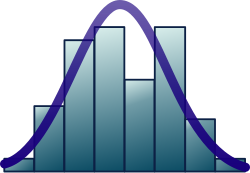
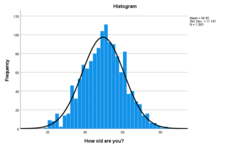

# 统计推断｜精选补充资料

> 来源：[维基百科（中文）](https://zh.wikipedia.org/wiki/%E7%BB%9F%E8%AE%A1%E6%8E%A8%E6%96%AD)  
> 许可：[CC BY-SA 4.0](https://creativecommons.org/licenses/by-sa/4.0/)  
> 语言：简体中文  
> 获取时间：2026-08-08T09:44:07.259874+00:00

维基百科，自由的百科全书

（重定向自[统计推断](/w/index.php?title=%E7%BB%9F%E8%AE%A1%E6%8E%A8%E6%96%AD&redirect=no "统计推断")）

[安德森鸢尾花卉数据集](/wiki/%E5%AE%89%E5%BE%B7%E6%A3%AE%E9%B8%A2%E5%B0%BE%E8%8A%B1%E5%8D%89%E6%95%B0%E6%8D%AE%E9%9B%86 "安德森鸢尾花卉数据集")中[变色鸢尾](/wiki/%E5%8F%98%E8%89%B2%E9%B8%A2%E5%B0%BE "变色鸢尾")花萼片宽度数据的[分布直方图](/wiki/%E7%9B%B4%E6%96%B9%E5%9B%BE "直方图")

**推論統計學**，或稱**統計推斷**（英語：Statistical inference），是利用[資料分析](/wiki/%E8%B3%87%E6%96%99%E5%88%86%E6%9E%90 "資料分析")推斷[機率分布](/wiki/%E6%A9%9F%E7%8E%87%E5%88%86%E5%B8%83 "機率分布")特性的過程。**推論統計分析**對[母體](/wiki/%E6%AF%8D%E9%AB%94_(%E7%B5%B1%E8%A8%88%E5%AD%B8) "母體 (統計學)")的特性進行推斷，例如通過**檢定假設**和導出估計量。通常假定觀測到的數據集是從較大母體中[抽樣](/w/index.php?title=%E6%8A%BD%E6%A8%A3_(%E7%B5%B1%E8%A8%88%E5%AD%B8)&action=edit&redlink=1 "抽樣 (統計學)（页面不存在）")所得。

**推論統計**可與[描述統計](/wiki/%E6%8F%8F%E8%BF%B0%E7%BB%9F%E8%AE%A1 "描述统计")相對照。描述統計僅關注觀測數據本身的特性，並不以數據來自更大母體為前提。在[機器學習](/wiki/%E6%9C%BA%E5%99%A8%E5%AD%A6%E4%B9%A0 "机器学习")中，「推斷」一詞有時被用來指「通過評估已訓練的模型進行預測」；在此語境下，對模型特性的推斷稱為「訓練」或「學習」（而非「推斷」），而利用模型進行預測則稱為「推斷」（而非「預測」）；另見[預測推斷](/w/index.php?title=%E9%A0%90%E6%B8%AC%E6%8E%A8%E6%96%B7&action=edit&redlink=1 "預測推斷（页面不存在）")。

統計推斷的結果常用來決定下一步的做法，可能是進行更深入的試驗或問卷，或決定是否實施某項方案。

## 引言

統計推斷依據從母體中以某種[抽樣](/w/index.php?title=%E6%8A%BD%E6%A8%A3_(%E7%B5%B1%E8%A8%88%E5%AD%B8)&action=edit&redlink=1 "抽樣 (統計學)（页面不存在）")方式抽取的數據，對母體做出命題。對於希望進行推斷的某個母體假設，統計推斷包含（一）[選取](/wiki/%E6%A8%A1%E5%9E%8B%E9%80%89%E6%8B%A9 "模型选择")描述數據生成過程的[統計模型](/wiki/%E7%BB%9F%E8%AE%A1%E6%A8%A1%E5%9E%8B "统计模型")，以及（二）從模型推導出命題。

Konishi 與 Kitagawa 指出：「統計推斷中的大多數問題，都可視為與統計建模相關的問題。」與此相關，[大衛·考克斯爵士](/w/index.php?title=David_Cox_(%E7%B5%B1%E8%A8%88%E5%AD%B8%E5%AE%B6)&action=edit&redlink=1 "David Cox (統計學家)（页面不存在）")曾說：「如何將實質問題轉化為統計模型，往往是分析中最關鍵的環節。」

統計推斷的[結論](/w/index.php?title=%E9%82%8F%E8%BC%AF%E7%B5%90%E8%AB%96&action=edit&redlink=1 "邏輯結論（页面不存在）")是一個統計[命題](/wiki/%E5%91%BD%E9%A2%98 "命题")。常見的統計命題形式包括：

* [點估計](/wiki/%E7%82%B9%E4%BC%B0%E8%AE%A1 "点估计")，即最佳近似某參數的特定值；
* [區間估計](/wiki/%E5%8D%80%E9%96%93%E4%BC%B0%E8%A8%88 "區間估計")，例如[信賴區間](/wiki/%E4%BF%A1%E8%B3%B4%E5%8D%80%E9%96%93 "信賴區間")（或集合估計）。信賴區間是利用樣本數據構建的區間，使得若重複進行許多次獨立抽樣（在數學上取極限），則固定比例（例如95%信賴區間對應95%）的結果區間會包含參數的真實值；
* [可信區間](/w/index.php?title=%E5%8F%AF%E4%BF%A1%E5%8D%80%E9%96%93&action=edit&redlink=1 "可信區間（页面不存在）")，即包含例如95%後驗信念的值的集合；
* 拒絕[假設](/wiki/%E5%81%87%E8%A8%AD%E6%AA%A2%E5%AE%9A "假設檢定")；
* 將數據點[聚類](/wiki/%E8%81%9A%E9%A1%9E%E5%88%86%E6%9E%90 "聚類分析")或[分類](/wiki/%E7%BB%9F%E8%AE%A1%E5%88%86%E7%B1%BB "统计分类")成若干組別。

## 模型與假設

主条目：[統計模型](/wiki/%E7%BB%9F%E8%AE%A1%E6%A8%A1%E5%9E%8B "统计模型")和[統計假設](/w/index.php?title=%E7%B5%B1%E8%A8%88%E5%81%87%E8%A8%AD&action=edit&redlink=1 "統計假設（页面不存在）")

任何統計推斷都需要若干假設。**統計模型**是一組關於觀測數據及類似數據生成方式的假設集合。統計模型的描述通常強調感興趣的母體量，即我們希望進行推斷的對象。[描述統計](/wiki/%E6%8F%8F%E8%BF%B0%E7%BB%9F%E8%AE%A1 "描述统计")通常作為更正式推斷之前的初步步驟。

### 模型／假設的層次

統計學家將建模假設區分為三個層次：

* **[完全參數型](/w/index.php?title=%E5%8F%83%E6%95%B8%E6%A8%A1%E5%9E%8B&action=edit&redlink=1 "參數模型（页面不存在）")**：描述數據生成過程的機率分布，假設可由只含有限個未知[參數](/w/index.php?title=%E7%B5%B1%E8%A8%88%E5%8F%83%E6%95%B8&action=edit&redlink=1 "統計參數（页面不存在）")的機率分布族完全描述。例如，可以假設母體值的分布確為常態分布，均值與變異數未知，且數據集由[「簡單」隨機抽樣](/w/index.php?title=%E7%B0%A1%E5%96%AE%E9%9A%A8%E6%A9%9F%E6%8A%BD%E6%A8%A3&action=edit&redlink=1 "簡單隨機抽樣（页面不存在）")生成。[廣義線性模型](/wiki/%E5%BB%A3%E7%BE%A9%E7%B7%9A%E6%80%A7%E6%A8%A1%E5%9E%8B "廣義線性模型")族是廣泛使用的靈活參數模型。
* **[非參數型](/wiki/%E9%9D%9E%E5%8F%83%E6%95%B8%E7%B5%B1%E8%A8%88 "非參數統計")**：對數據生成過程所作的假設遠少於參數統計，可以達到最低限度。例如，每個連續機率分布都有中位數，可用樣本中位數或[Hodges–Lehmann–Sen 估計量](/w/index.php?title=Hodges%E2%80%93Lehmann%E2%80%93Sen_%E4%BC%B0%E8%A8%88%E9%87%8F&action=edit&redlink=1 "Hodges–Lehmann–Sen 估計量（页面不存在）")（英语：[Hodges–Lehmann estimator](https://en.wikipedia.org/wiki/Hodges%E2%80%93Lehmann_estimator "en:Hodges–Lehmann estimator")）來估計，後者在數據來自簡單隨機抽樣時具有良好性質。
* **[半參數型](/w/index.php?title=%E5%8D%8A%E5%8F%83%E6%95%B8%E6%A8%A1%E5%9E%8B&action=edit&redlink=1 "半參數模型（页面不存在）")**：這一術語通常意指介於完全參數型與非參數型之間的假設。例如，可以假設母體分布具有有限均值，並進一步假設母體中均值響應水準與某共變量呈真正線性關係（參數假設），但不對均值周圍的變異數作任何參數假設（即不對任何[異方差性](/w/index.php?title=%E7%95%B0%E6%96%B9%E5%B7%AE%E6%80%A7&action=edit&redlink=1 "異方差性（页面不存在）")的存在或可能形式作假設）。更一般地，半參數模型通常可分為「結構」與「隨機變異」兩個分量，一個以參數方式處理，另一個以非參數方式處理。著名的 [Cox 模型](/w/index.php?title=Cox_%E6%A8%A1%E5%9E%8B&action=edit&redlink=1 "Cox 模型（页面不存在）")即為一套半參數假設。

### 有效模型／假設的重要性

参见：[統計模型驗證](/w/index.php?title=%E7%B5%B1%E8%A8%88%E6%A8%A1%E5%9E%8B%E9%A9%97%E8%AD%89&action=edit&redlink=1 "統計模型驗證（页面不存在）")

上圖顯示一張評估常態性假設的直方圖，可從鐘形曲線下方的均勻分布看出。

無論採用何種層次的假設，正確校準的推斷通常要求這些假設是正確的，即數據生成機制確實已被正確指定。

[「簡單」隨機抽樣](/w/index.php?title=%E7%B0%A1%E5%96%AE%E9%9A%A8%E6%A9%9F%E6%8A%BD%E6%A8%A3&action=edit&redlink=1 "簡單隨機抽樣（页面不存在）")的錯誤假設可能使統計推斷失效。更複雜的半參數和完全參數假設同樣值得警惕。例如，錯誤地假設 Cox 模型在某些情況下可能導致錯誤結論。對母體常態性的錯誤假設也會使某些基於迴歸的推斷失效。大多數人口抽樣專家對使用**任何**參數模型都持懷疑態度：「大多數抽樣統計學家在涉及信賴區間時，僅對基於非常大樣本的估計量作出陳述，因為中央極限定理保證這些估計量的分布近似常態。」尤其是，常態分布「若用於任何類型的經濟學母體，將是一個完全不切實際且極為危險的假設」。此處，中央極限定理指出：「對於非常大的樣本」，若分布無重尾，樣本均值的分布近似常態。

#### 近似分布

主条目：[統計距離](/wiki/%E7%BB%9F%E8%AE%A1%E8%B7%9D%E7%A6%BB "统计距离")、[漸近理論 (統計學)](/w/index.php?title=%E6%BC%B8%E8%BF%91%E7%90%86%E8%AB%96_(%E7%B5%B1%E8%A8%88%E5%AD%B8)&action=edit&redlink=1 "漸近理論 (統計學)（页面不存在）")和[逼近理論](/wiki/%E9%80%BC%E8%BF%91%E7%90%86%E8%AE%BA "逼近理论")

由於難以精確指定樣本統計量的分布，人們已發展出許多近似這些分布的方法。

對於有限樣本，[近似結果](/wiki/%E9%80%BC%E8%BF%91%E7%90%86%E8%AE%BA "逼近理论")衡量極限分布與統計量[樣本分布](/w/index.php?title=%E6%A8%A3%E6%9C%AC%E5%88%86%E5%B8%83&action=edit&redlink=1 "樣本分布（页面不存在）")之間的接近程度：例如，根據[貝里-埃森定理](/w/index.php?title=%E8%B2%9D%E9%87%8C-%E5%9F%83%E6%A3%AE%E5%AE%9A%E7%90%86&action=edit&redlink=1 "貝里-埃森定理（页面不存在）")，在有 10,000 個獨立樣本的情況下，[常態分布](/wiki/%E5%B8%B8%E6%85%8B%E5%88%86%E5%B8%83 "常態分布")能近似（精確到兩位有效數字）許多母體分布下[樣本均值](/wiki/%E6%A0%B7%E6%9C%AC%E5%9D%87%E5%80%BC "样本均值")的分布。然而在許多實際應用中，根據模擬研究和統計學家的經驗，當有 10 個或更多獨立樣本時，常態近似已能很好地逼近樣本均值的分布。繼柯爾莫哥洛夫在 1950 年代的工作之後，現代統計學使用[逼近理論](/wiki/%E9%80%BC%E8%BF%91%E7%90%86%E8%AE%BA "逼近理论")和[泛函分析](/wiki/%E6%B3%9B%E5%87%BD%E5%88%86%E6%9E%90 "泛函分析")來量化近似誤差。這一方法研究[機率分布](/wiki/%E6%A9%9F%E7%8E%87%E5%88%86%E5%B8%83 "機率分布")的[度量幾何](/w/index.php?title=%E5%BA%A6%E9%87%8F%E5%B9%BE%E4%BD%95&action=edit&redlink=1 "度量幾何（页面不存在）")，以[庫爾巴克-萊布勒散度](/w/index.php?title=%E5%BA%AB%E7%88%BE%E5%B7%B4%E5%85%8B-%E8%90%8A%E5%B8%83%E5%8B%92%E6%95%A3%E5%BA%A6&action=edit&redlink=1 "庫爾巴克-萊布勒散度（页面不存在）")、[布雷格曼散度](/w/index.php?title=%E5%B8%83%E9%9B%B7%E6%A0%BC%E6%9B%BC%E6%95%A3%E5%BA%A6&action=edit&redlink=1 "布雷格曼散度（页面不存在）")和[海靈格距離](/w/index.php?title=%E6%B5%B7%E9%9D%88%E6%A0%BC%E8%B7%9D%E9%9B%A2&action=edit&redlink=1 "海靈格距離（页面不存在）")等指標量化近似誤差。

對於無限大的樣本，[極限結果](/w/index.php?title=%E6%BC%B8%E8%BF%91%E7%90%86%E8%AB%96_(%E7%B5%B1%E8%A8%88%E5%AD%B8)&action=edit&redlink=1 "漸近理論 (統計學)（页面不存在）")（如[中央極限定理](/wiki/%E4%B8%AD%E5%A4%AE%E6%A5%B5%E9%99%90%E5%AE%9A%E7%90%86 "中央極限定理")）描述樣本統計量在極限存在時的極限分布。極限結果並非關於有限樣本的陳述，對有限樣本確實毫無意義。然而，對極限分布的漸近理論常被援引於有限樣本的研究。例如，極限結果常被援引以為[廣義矩估計法](/w/index.php?title=%E5%BB%A3%E7%BE%A9%E7%9F%A9%E4%BC%B0%E8%A8%88%E6%B3%95&action=edit&redlink=1 "廣義矩估計法（页面不存在）")和[廣義估計方程](/w/index.php?title=%E5%BB%A3%E7%BE%A9%E4%BC%B0%E8%A8%88%E6%96%B9%E7%A8%8B&action=edit&redlink=1 "廣義估計方程（页面不存在）")提供正當性，後兩者在[計量經濟學](/wiki/%E8%A8%88%E9%87%8F%E7%B6%93%E6%BF%9F%E5%AD%B8 "計量經濟學")和[生物統計學](/wiki/%E7%94%9F%E7%89%A9%E7%B5%B1%E8%A8%88%E5%AD%B8 "生物統計學")中廣受使用。極限分布與真實分布之差異（即近似的「誤差」）的量級可通過模擬進行評估。將極限結果以啟發式方式應用於有限樣本，在許多應用中是常見做法，尤其是對具有[對數凹](/w/index.php?title=%E5%B0%8D%E6%95%B8%E5%87%B9%E5%87%BD%E6%95%B8&action=edit&redlink=1 "對數凹函數（页面不存在）")[概似函數](/wiki/%E6%A6%82%E4%BC%BC%E5%87%BD%E6%95%B8 "概似函數")的低維[統計模型](/wiki/%E7%BB%9F%E8%AE%A1%E6%A8%A1%E5%9E%8B "统计模型")（如單參數[指數族](/w/index.php?title=%E6%8C%87%E6%95%B8%E6%97%8F&action=edit&redlink=1 "指數族（页面不存在）")）。

### 基於隨機化的模型

主条目：[隨機化](/w/index.php?title=%E9%9A%A8%E6%A9%9F%E5%8C%96&action=edit&redlink=1 "隨機化（页面不存在）")

参见：[隨機樣本](/w/index.php?title=%E9%9A%A8%E6%A9%9F%E6%A8%A3%E6%9C%AC&action=edit&redlink=1 "隨機樣本（页面不存在）")和[隨機分配](/w/index.php?title=%E9%9A%A8%E6%A9%9F%E5%88%86%E9%85%8D&action=edit&redlink=1 "隨機分配（页面不存在）")

對於由隨機化設計產生的給定數據集，統計量的隨機化分布（在虛無假設下）定義為：對隨機化設計可能生成的所有方案評估[檢定統計量](/w/index.php?title=%E6%AA%A2%E5%AE%9A%E7%B5%B1%E8%A8%88%E9%87%8F&action=edit&redlink=1 "檢定統計量（页面不存在）")。在頻率論推斷中，隨機化使推斷能夠基於隨機化分布而非主觀模型，這在[調查抽樣](/w/index.php?title=%E8%AA%BF%E6%9F%A5%E6%8A%BD%E6%A8%A3&action=edit&redlink=1 "調查抽樣（页面不存在）")和[實驗設計](/wiki/%E5%AF%A6%E9%A9%97%E8%A8%AD%E8%A8%88 "實驗設計")中尤為重要。來自隨機化研究的統計推斷也比許多其他情境更為直接。在[貝氏推斷](/w/index.php?title=%E8%B2%9D%E6%B0%8F%E6%8E%A8%E6%96%B7&action=edit&redlink=1 "貝氏推斷（页面不存在）")中，隨機化同樣重要：在[調查抽樣](/w/index.php?title=%E8%AA%BF%E6%9F%A5%E6%8A%BD%E6%A8%A3&action=edit&redlink=1 "調查抽樣（页面不存在）")中，使用[無放回抽樣](/w/index.php?title=%E7%84%A1%E6%94%BE%E5%9B%9E%E6%8A%BD%E6%A8%A3&action=edit&redlink=1 "無放回抽樣（页面不存在）")確保樣本與母體的[可交換性](/w/index.php?title=%E5%8F%AF%E4%BA%A4%E6%8F%9B%E6%80%A7&action=edit&redlink=1 "可交換性（页面不存在）")；在隨機化實驗中，隨機化為[共變量](/w/index.php?title=%E5%85%B1%E8%AE%8A%E9%87%8F&action=edit&redlink=1 "共變量（页面不存在）")資訊提供[隨機缺失](/w/index.php?title=%E9%9A%A8%E6%A9%9F%E7%BC%BA%E5%A4%B1&action=edit&redlink=1 "隨機缺失（页面不存在）")假設。

客觀隨機化允許適當的歸納程序。許多統計學家偏好對由明確隨機化程序生成的數據進行基於隨機化的分析。（然而，在具有成熟理論知識和實驗控制的科學領域中，隨機化實驗確實可能在不提升推斷質量的情況下增加實驗成本。）類似地，主要統計權威機構推薦[隨機化實驗](/w/index.php?title=%E9%9A%A8%E6%A9%9F%E5%8C%96%E5%AF%A6%E9%A9%97&action=edit&redlink=1 "隨機化實驗（页面不存在）")的結果，認為其比觀察性研究更具可靠性。然而，一個良好的觀察性研究可能優於一個糟糕的隨機化實驗。

隨機化實驗的統計分析可以基於實驗方案中規定的隨機化方案，而不需要主觀模型。

然而，某些假設在任何時候都無法使用能準確描述隨機化實驗或隨機樣本的客觀統計模型來檢驗。在某些情況下，此類隨機化研究不經濟或不符合倫理。

#### 隨機實驗的模型分析

在分析隨機化實驗的數據時，標準做法是援引統計模型，例如線性模型或邏輯斯迴歸模型。然而，隨機化方案指導統計模型的選擇，若不了解隨機化方案，便無法選擇適當的模型。在分析隨機化實驗數據時忽略實驗方案，可能導致嚴重誤導性的結果；常見錯誤包括忘記實驗中使用的區組設計，以及將同一實驗單元上的重複測量誤認為對不同實驗單元施加處理的獨立重複。

#### 無模型隨機化推斷

無模型技術為基於模型的方法提供補充，後者採用簡化現實的還原論策略。前者結合、演化、整合並動態訓練演算法，以適應過程的情境相似性，並學習觀測值的內在特徵。

例如，無模型簡單線性迴歸基於以下兩種設計之一：

* **隨機設計**：觀測值對 

  (

  X

  1
  ,

  Y

  1
  )
  ,
  (

  X

  2
  ,

  Y

  2
  )
  ,
  ⋯
  ,
  (

  X

  n
  ,

  Y

  n
  )
  {\displaystyle (X\_{1},Y\_{1}),(X\_{2},Y\_{2}),\cdots ,(X\_{n},Y\_{n})}
  ${\displaystyle (X\_{1},Y\_{1}),(X\_{2},Y\_{2}),\cdots ,(X\_{n},Y\_{n})}$ 獨立同分布（iid）；
* **確定性設計**：變數 

  X

  1
  ,

  X

  2
  ,
  ⋯
  ,

  X

  n
  {\displaystyle X\_{1},X\_{2},\cdots ,X\_{n}}
  ${\displaystyle X\_{1},X\_{2},\cdots ,X\_{n}}$ 為確定性的，但對應的響應變量 

  Y

  1
  ,

  Y

  2
  ,
  ⋯
  ,

  Y

  n
  {\displaystyle Y\_{1},Y\_{2},\cdots ,Y\_{n}}
  ${\displaystyle Y\_{1},Y\_{2},\cdots ,Y\_{n}}$ 是隨機且獨立的，具有共同的條件分布，即 

  P

  (

  Y

  j
  ≤
  y

  |

  X

  j
  =
  x
  )
  =

  D

  x
  (
  y
  )
  {\displaystyle P\left(Y\_{j}\leq y|X\_{j}=x\right)=D\_{x}(y)}
  ${\displaystyle P\left(Y\_{j}\leq y|X\_{j}=x\right)=D\_{x}(y)}$，與指標 

  j
  {\displaystyle j}
  ${\displaystyle j}$ 無關。

在任一情況下，對共同條件分布 

D

x
(
.
)
{\displaystyle D\_{x}(.)}
${\displaystyle D\_{x}(.)}$ 特徵的無模型隨機化推斷依賴某些正則條件，例如函數光滑性。例如，對母體特徵「條件均值」 

μ
(
x
)
=
E
(
Y

|
X
=
x
)
{\displaystyle \mu (x)=E(Y|X=x)}
${\displaystyle \mu (x)=E(Y|X=x)}$ 的無模型隨機化推斷，在 

μ
(
x
)
{\displaystyle \mu (x)}
${\displaystyle \mu (x)}$ 光滑的假設下，可通過局部平均或局部多項式擬合進行一致估計。此外，依靠漸近常態性或重抽樣，可以構建母體特徵——即條件均值 

μ
(
x
)
{\displaystyle \mu (x)}
${\displaystyle \mu (x)}$——的信賴區間。

## 推斷範式

不同的統計推斷流派已各自確立。這些流派——或稱「範式」——並非互斥的，在一種範式下運作良好的方法，在其他範式下往往也有吸引人的詮釋。

Bandyopadhyay 與 Forster 描述了四種範式：古典（即[頻率論](/w/index.php?title=%E9%A0%BB%E7%8E%87%E8%AB%96%E6%8E%A8%E6%96%B7&action=edit&redlink=1 "頻率論推斷（页面不存在）")）範式、[貝氏](/w/index.php?title=%E8%B2%9D%E6%B0%8F%E6%8E%A8%E6%96%B7&action=edit&redlink=1 "貝氏推斷（页面不存在）")範式、[概似論者](/w/index.php?title=%E6%A6%82%E4%BC%BC%E8%AB%96&action=edit&redlink=1 "概似論（页面不存在）")範式，以及基於[赤池資訊量準則](/w/index.php?title=%E8%B5%A4%E6%B1%A0%E8%B3%87%E8%A8%8A%E9%87%8F%E6%BA%96%E5%89%87&action=edit&redlink=1 "赤池資訊量準則（页面不存在）")的範式。

### 頻率論推斷

此範式通過考慮對母體分布的（假想）重複抽樣（以生成類似於當前數據集的數據集）來校準命題的可信度。通過考察重複抽樣下數據集的特徵，可以量化統計命題的頻率論性質——儘管在實踐中，這種量化可能具有挑戰性。

#### 頻率論推斷的例子

* [*p*值](/wiki/P%E5%80%BC "P值")
* [信賴區間](/wiki/%E4%BF%A1%E8%B3%B4%E5%8D%80%E9%96%93 "信賴區間")
* [虛無假設](/wiki/%E8%99%9B%E7%84%A1%E5%81%87%E8%A8%AD "虛無假設")顯著性檢定

#### 頻率論推斷、客觀性與決策理論

[頻率論推斷](/w/index.php?title=%E9%A0%BB%E7%8E%87%E8%AB%96%E6%8E%A8%E6%96%B7&action=edit&redlink=1 "頻率論推斷（页面不存在）")（或古典推斷）的一種詮釋是：它僅適用於[頻率機率](/w/index.php?title=%E9%A0%BB%E7%8E%87%E6%A9%9F%E7%8E%87&action=edit&redlink=1 "頻率機率（页面不存在）")的情境，即對母體進行重複抽樣的情境。然而，Neyman 的方法是在實驗前機率的框架下發展這些程序的。也就是說，在進行實驗之前，先確定一個得出結論的規則，使得正確的機率受到適當控制：此類機率無需具有頻率論或重複抽樣的詮釋。相比之下，貝氏推斷使用條件機率（即以觀測數據為條件的機率），而頻率論方法使用邊際（但以未知參數為條件的）機率。

顯著性檢定和信賴區間的頻率論程序可以在不考慮[效用函數](/wiki/%E6%95%88%E7%94%A8%E5%87%BD%E6%95%B0 "效用函数")的情況下構建。然而，頻率論統計的某些部分（如[統計決策理論](/w/index.php?title=%E7%B5%B1%E8%A8%88%E6%B1%BA%E7%AD%96%E7%90%86%E8%AB%96&action=edit&redlink=1 "統計決策理論（页面不存在）")）確實涵蓋[效用函數](/wiki/%E6%95%88%E7%94%A8%E5%87%BD%E6%95%B0 "效用函数")。[[來源請求]](/wiki/Wikipedia:%E5%88%97%E6%98%8E%E6%9D%A5%E6%BA%90 "Wikipedia:列明来源")特別是，最優推斷的頻率論發展（如[最小方差無偏估計量](/w/index.php?title=%E6%9C%80%E5%B0%8F%E6%96%B9%E5%B7%AE%E7%84%A1%E5%81%8F%E4%BC%B0%E8%A8%88%E9%87%8F&action=edit&redlink=1 "最小方差無偏估計量（页面不存在）")或[一致最強力檢定](/w/index.php?title=%E4%B8%80%E8%87%B4%E6%9C%80%E5%BC%B7%E5%8A%9B%E6%AA%A2%E5%AE%9A&action=edit&redlink=1 "一致最強力檢定（页面不存在）")）使用[損失函數](/wiki/%E6%8D%9F%E5%A4%B1%E5%87%BD%E6%95%B0 "损失函数")，損失函數起到（負）效用函數的作用。統計學家無需明確陳述損失函數即可證明統計程序具有最優性。然而，損失函數在陳述最優性時往往很有用：例如，中位數無偏估計量在[絕對值](/wiki/%E7%B5%95%E5%B0%8D%E5%80%BC "絕對值")損失函數下是最優的（它使期望損失最小），而[最小平方](/w/index.php?title=%E6%9C%80%E5%B0%8F%E5%B9%B3%E6%96%B9&action=edit&redlink=1 "最小平方（页面不存在）")估計量在平方誤差損失函數下是最優的。

使用頻率論推斷的統計學家必須自行選擇感興趣的參數及所用的[估計量](/wiki/%E4%BC%B0%E8%AE%A1%E9%87%8F "估计量")/[檢定統計量](/w/index.php?title=%E6%AA%A2%E5%AE%9A%E7%B5%B1%E8%A8%88%E9%87%8F&action=edit&redlink=1 "檢定統計量（页面不存在）")，而缺乏明顯的顯式效用和先驗分布，使頻率論程序被廣泛視為「客觀的」。

### 貝氏推斷

参见：[贝叶斯推断](/wiki/%E8%B4%9D%E5%8F%B6%E6%96%AF%E6%8E%A8%E6%96%AD "贝叶斯推断")

貝氏演算使用機率的「語言」描述信念的程度；信念為正值，積分為一，並遵循機率公理。貝氏推斷使用可得的後驗信念作為提出統計命題的基礎。使用貝氏方法有[幾種不同的正當性理由](/wiki/%E8%B2%9D%E6%B0%8F%E6%A9%9F%E7%8E%87#貝氏機率的正當性 "貝氏機率")。

#### 貝氏推斷的例子

* 用於區間估計的[可信區間](/w/index.php?title=%E5%8F%AF%E4%BF%A1%E5%8D%80%E9%96%93&action=edit&redlink=1 "可信區間（页面不存在）")
* 用於模型比較的[貝氏因子](/w/index.php?title=%E8%B2%9D%E6%B0%8F%E5%9B%A0%E5%AD%90&action=edit&redlink=1 "貝氏因子（页面不存在）")

#### 貝氏推斷、主觀性與決策理論

許多非正式貝氏推斷基於後驗的「直觀合理」摘要。例如，後驗均值、中位數和眾數、最高後驗密度區間以及貝氏因子都可以這種方式引入。雖然用戶無需陳述[效用函數](/wiki/%E6%95%88%E7%94%A8%E5%87%BD%E6%95%B0 "效用函数")即可進行此類推斷，但這些摘要都在某種程度上依賴所陳述的先驗信念，通常被視為主觀結論。（無需外部輸入的先驗構建方法已被[提出](/wiki/%E8%B2%9D%E6%B0%8F%E6%A9%9F%E7%8E%87#個人機率與構建先驗的客觀方法 "貝氏機率")，但尚未完全發展。）

正式的貝氏推斷以明確陳述的效用函數或損失函數為校準標準；「貝氏規則」是使後驗不確定性下期望效用最大化的規則。因此，正式貝氏推斷在[決策理論](/wiki/%E6%B1%BA%E7%AD%96%E7%90%86%E8%AB%96 "決策理論")意義上自動提供[最優決策](/w/index.php?title=%E6%9C%80%E5%84%AA%E6%B1%BA%E7%AD%96&action=edit&redlink=1 "最優決策（页面不存在）")。給定假設、數據和效用，幾乎任何問題都可以進行貝氏推斷，儘管並非每個統計推斷都需要具有貝氏詮釋。非正式貝氏分析在邏輯上可能是[不一致的](/w/index.php?title=%E7%B5%B1%E8%A8%88%E4%B8%80%E8%87%B4%E6%80%A7&action=edit&redlink=1 "統計一致性（页面不存在）")；使用適當先驗（即可積分為一的先驗）的貝氏程序的一個特徵是，它們保證是[一致的](/w/index.php?title=%E7%B5%B1%E8%A8%88%E4%B8%80%E8%87%B4%E6%80%A7&action=edit&redlink=1 "統計一致性（页面不存在）")。[貝氏推斷](/w/index.php?title=%E8%B2%9D%E6%B0%8F%E6%8E%A8%E6%96%B7&action=edit&redlink=1 "貝氏推斷（页面不存在）")的一些倡導者主張，推斷**必須**在此決策論框架內進行，且貝氏推斷不應以後驗信念的評估和總結作為結論。

### 基於概似函數的推斷

主条目：[概似論](/w/index.php?title=%E6%A6%82%E4%BC%BC%E8%AB%96&action=edit&redlink=1 "概似論（页面不存在）")

基於概似函數的推斷是一種用於根據觀測數據估計統計模型參數的範式。[概似論](/w/index.php?title=%E6%A6%82%E4%BC%BC%E8%AB%96&action=edit&redlink=1 "概似論（页面不存在）")通過使用[概似函數](/wiki/%E6%A6%82%E4%BC%BC%E5%87%BD%E6%95%B8 "概似函數")來處理統計問題，概似函數記為 

L
(
x

|
θ
)
{\displaystyle L(x|\theta )}
${\displaystyle L(x|\theta )}$，量化在特定參數值集 

θ
{\displaystyle \theta }
${\displaystyle \theta }$ 下觀測到給定數據 

x
{\displaystyle x}
${\displaystyle x}$ 的機率。在基於概似函數的推斷中，目標是找到使概似函數最大化的參數值集，等效地，最大化觀測到給定數據的機率。

基於概似函數的推斷過程通常涉及以下步驟：

1. 建立統計模型：根據所面對的問題定義統計模型，指定分布假設以及觀測數據與未知參數之間的關係。模型可以是簡單的（如已知變異數的常態分布），也可以是複雜的（如具有多層隨機效應的層次模型）。
2. 構建概似函數：給定統計模型，通過將觀測數據的聯合機率密度函數或質量函數作為未知參數的函數來構建概似函數。此函數表示在不同參數值下觀測到數據的機率。
3. 最大化概似函數：下一步是找到使概似函數最大化的參數值集，可使用數值最優化演算法等技術實現。估計的參數值（通常記為 

   y
   ¯
   {\displaystyle {\bar {y}}}
   ${\displaystyle {\bar {y}}}$）即為[最大概似估計量](/wiki/%E6%9C%80%E5%A4%A7%E6%A6%82%E4%BC%BC%E4%BC%B0%E8%A8%88 "最大概似估計")（MLE）。
4. 評估不確定性：獲得最大概似估計量後，必須量化與參數估計相關的不確定性，可通過計算[標準誤](/wiki/%E6%A0%87%E5%87%86%E8%AF%AF "标准误")、信賴區間，或基於漸近理論或[拔靴法](/w/index.php?title=%E8%87%AA%E5%8A%A9%E6%B3%95_(%E7%B5%B1%E8%A8%88%E5%AD%B8)&action=edit&redlink=1 "自助法 (統計學)（页面不存在）")等模擬技術進行假設檢定來實現。
5. 模型檢驗：在獲得參數估計量並評估其不確定性之後，需要評估統計模型的適切性，包括檢查模型中的假設，以及使用擬合優度檢定、殘差分析或圖形診斷來評估模型對數據的擬合程度。
6. 推斷與詮釋：最後，根據估計的參數和模型評估進行統計推斷，包括對母體參數得出結論、進行預測，或根據估計的模型檢定假設。

### 基於 AIC 的推斷

**[赤池資訊量準則](/w/index.php?title=%E8%B5%A4%E6%B1%A0%E8%B3%87%E8%A8%8A%E9%87%8F%E6%BA%96%E5%89%87&action=edit&redlink=1 "赤池資訊量準則（页面不存在）")**（AIC）是對給定數據集的[統計模型](/wiki/%E7%BB%9F%E8%AE%A1%E6%A8%A1%E5%9E%8B "统计模型")相對質量的[估計量](/wiki/%E4%BC%B0%E8%AE%A1%E9%87%8F "估计量")。給定一組數據的模型集合，AIC 估計每個模型相對於其他各模型的質量，從而提供[模型選擇](/wiki/%E6%A8%A1%E5%9E%8B%E9%80%89%E6%8B%A9 "模型选择")的手段。

AIC 建立在[資訊理論](/wiki/%E8%B3%87%E8%A8%8A%E7%90%86%E8%AB%96 "資訊理論")的基礎上：它提供一個估計量，衡量在使用給定模型表示生成數據的過程時，相對損失的資訊量。（在此過程中，它處理模型[擬合優度](/wiki/%E6%8B%9F%E5%90%88%E4%BC%98%E5%BA%A6 "拟合优度")與模型簡潔性之間的權衡。）

### 其他推斷範式

#### 最短描述長度

主条目：[最短描述長度](/w/index.php?title=%E6%9C%80%E7%9F%AD%E6%8F%8F%E8%BF%B0%E9%95%B7%E5%BA%A6&action=edit&redlink=1 "最短描述長度（页面不存在）")

最短描述長度（MDL）原則的發展源於[資訊理論](/wiki/%E8%B3%87%E8%A8%8A%E7%90%86%E8%AB%96 "資訊理論")和[科爾莫哥洛夫複雜度](/w/index.php?title=%E7%A7%91%E7%88%BE%E8%8E%AB%E5%93%A5%E6%B4%9B%E5%A4%AB%E8%A4%87%E9%9B%9C%E5%BA%A6&action=edit&redlink=1 "科爾莫哥洛夫複雜度（页面不存在）")理論的思想。MDL 原則選取能最大程度壓縮數據的統計模型；推斷過程無需假設反事實或不可證偽的「數據生成機制」或數據的[機率模型](/wiki/%E6%A6%82%E7%8E%87%E6%A8%A1%E5%9E%8B "概率模型")，而這在頻率論或貝氏方法中可能會發生。

然而，若現實中確實存在某「數據生成機制」，則根據[夏農](/wiki/%E5%85%8B%E5%8B%9E%E5%BE%B7%C2%B7%E5%A4%8F%E8%BE%B2 "克勞德·夏農")的[信源編碼定理](/wiki/%E4%BF%A1%E6%BA%90%E7%BC%96%E7%A0%81%E5%AE%9A%E7%90%86 "信源编码定理")，它平均且漸近地提供了數據的 MDL 描述。在最小化描述長度（或描述複雜性）方面，MDL 估計類似於[最大概似估計](/wiki/%E6%9C%80%E5%A4%A7%E6%A6%82%E4%BC%BC%E4%BC%B0%E8%A8%88 "最大概似估計")和[最大後驗概率估計](/w/index.php?title=%E6%9C%80%E5%A4%A7%E5%BE%8C%E9%A9%97%E6%A6%82%E7%8E%87%E4%BC%B0%E8%A8%88&action=edit&redlink=1 "最大後驗概率估計（页面不存在）")（使用[最大熵](/w/index.php?title=%E6%9C%80%E5%A4%A7%E7%86%B5%E6%A9%9F%E7%8E%87%E5%88%86%E5%B8%83&action=edit&redlink=1 "最大熵機率分布（页面不存在）")[貝氏](/wiki/%E8%B2%9D%E6%B0%8F%E6%A9%9F%E7%8E%87 "貝氏機率")先驗）。然而，MDL 避免假設已知底層機率模型；MDL 原則也可以在不假設（例如）數據源自獨立抽樣的情況下應用。

MDL 原則已被應用於[資訊理論](/wiki/%E8%B3%87%E8%A8%8A%E7%90%86%E8%AB%96 "資訊理論")中的通信[編碼理論](/wiki/%E7%B7%A8%E7%A2%BC%E7%90%86%E8%AB%96 "編碼理論")、[線性迴歸](/wiki/%E7%B7%9A%E6%80%A7%E8%BF%B4%E6%AD%B8 "線性迴歸")和[資料探勘](/wiki/%E8%B3%87%E6%96%99%E6%8E%A2%E5%8B%98 "資料探勘")。

MDL 推斷程序的評估常使用[計算複雜性理論](/wiki/%E8%A8%88%E7%AE%97%E8%A4%87%E9%9B%9C%E6%80%A7%E7%90%86%E8%AB%96 "計算複雜性理論")中的技術或標準。

#### 信念推斷

主条目：[信念推斷](/w/index.php?title=%E4%BF%A1%E5%BF%B5%E6%8E%A8%E6%96%B7&action=edit&redlink=1 "信念推斷（页面不存在）")

[信念推斷](/w/index.php?title=%E4%BF%A1%E5%BF%B5%E6%8E%A8%E6%96%B7&action=edit&redlink=1 "信念推斷（页面不存在）")是一種基於[信念機率](/w/index.php?title=%E4%BF%A1%E5%BF%B5%E6%A9%9F%E7%8E%87&action=edit&redlink=1 "信念機率（页面不存在）")（又稱「信念分布」）的統計推斷方法。在後續研究中，這一方法被批評為定義不清、適用範圍極為有限，甚至是謬誤的。然而，這一論點與以下論證相同：所謂的[信賴分布](/w/index.php?title=%E4%BF%A1%E8%B3%B4%E5%88%86%E5%B8%83&action=edit&redlink=1 "信賴分布（页面不存在）")並非有效的[機率分布](/wiki/%E6%A9%9F%E7%8E%87%E5%88%86%E5%B8%83 "機率分布")，但這並未使[信賴區間](/wiki/%E4%BF%A1%E8%B3%B4%E5%8D%80%E9%96%93 "信賴區間")的應用失效，因此也不必然使從信念論據得出的結論失效。有人曾嘗試將費雪早期[信念論據](/w/index.php?title=%E4%BF%A1%E5%BF%B5%E6%A9%9F%E7%8E%87&action=edit&redlink=1 "信念機率（页面不存在）")的工作重新詮釋為使用[上下機率](/w/index.php?title=%E4%B8%8A%E4%B8%8B%E6%A9%9F%E7%8E%87&action=edit&redlink=1 "上下機率（页面不存在）")的推斷理論的特例。

#### 結構推斷

[喬治·巴納德](/w/index.php?title=%E5%96%AC%E6%B2%BB%C2%B7%E5%B7%B4%E7%B4%8D%E5%BE%B7&action=edit&redlink=1 "喬治·巴納德（页面不存在）")在 1938 年至 1939 年間基於費雪和皮特曼的思想，發展了「結構推斷」或「樞軸推斷」，這是一種在[群族](/w/index.php?title=%E7%BE%A4%E6%97%8F&action=edit&redlink=1 "群族（页面不存在）")上使用[不變機率](/wiki/%E5%93%88%E5%B0%94%E6%B5%8B%E5%BA%A6 "哈尔测度")的方法。巴納德在信念推斷程序「定義明確且有用」的受限模型類上重新整理了信念推斷的論據。[唐納德·弗雷澤](/w/index.php?title=%E5%94%90%E7%B4%8D%E5%BE%B7%C2%B7%E5%BC%97%E9%9B%B7%E6%BE%A4&action=edit&redlink=1 "唐納德·弗雷澤（页面不存在）")（英语：[Donald A. S. Fraser](https://en.wikipedia.org/wiki/Donald_A._S._Fraser "en:Donald A. S. Fraser")）基於[群論](/wiki/%E7%BE%A4%E8%AB%96 "群論")為結構推斷建立了一套一般理論，並將其應用於線性模型。弗雷澤所建立的理論與決策理論和貝氏統計有密切聯繫，若最優頻率論決策規則存在，則能提供該規則。

## 推斷主題

以下主題通常被涵蓋在**統計推斷**的範疇之中。

1. [統計假設](/w/index.php?title=%E7%B5%B1%E8%A8%88%E5%81%87%E8%A8%AD&action=edit&redlink=1 "統計假設（页面不存在）")
2. [統計決策理論](/w/index.php?title=%E7%B5%B1%E8%A8%88%E6%B1%BA%E7%AD%96%E7%90%86%E8%AB%96&action=edit&redlink=1 "統計決策理論（页面不存在）")
3. [估計理論](/wiki/%E4%BC%B0%E8%AE%A1%E7%90%86%E8%AE%BA "估计理论")
4. [統計假設檢定](/w/index.php?title=%E7%B5%B1%E8%A8%88%E5%81%87%E8%A8%AD%E6%AA%A2%E5%AE%9A&action=edit&redlink=1 "統計假設檢定（页面不存在）")
5. [統計學中的意見修正](/w/index.php?title=%E7%B5%B1%E8%A8%88%E5%AD%B8%E4%B8%AD%E7%9A%84%E6%84%8F%E8%A6%8B%E4%BF%AE%E6%AD%A3&action=edit&redlink=1 "統計學中的意見修正（页面不存在）")
6. [實驗設計](/wiki/%E5%AF%A6%E9%A9%97%E8%A8%AD%E8%A8%88 "實驗設計")、[變異數分析](/wiki/%E8%AE%8A%E7%95%B0%E6%95%B8%E5%88%86%E6%9E%90 "變異數分析")與[迴歸分析](/wiki/%E8%BF%B4%E6%AD%B8%E5%88%86%E6%9E%90 "迴歸分析")
7. [調查抽樣](/w/index.php?title=%E8%AA%BF%E6%9F%A5%E6%8A%BD%E6%A8%A3&action=edit&redlink=1 "調查抽樣（页面不存在）")
8. [統計數據摘要](/w/index.php?title=%E7%B5%B1%E8%A8%88%E6%95%B8%E6%93%9A%E6%91%98%E8%A6%81&action=edit&redlink=1 "統計數據摘要（页面不存在）")

## 預測推斷

預測推斷是一種統計推斷方法，強調根據過去觀測值對未來觀測值的[預測](/wiki/%E9%A0%90%E6%B8%AC "預測")。

最初，預測推斷基於**可觀測的**參數，是研究[機率](/wiki/%E6%A9%9F%E7%8E%87 "機率")的主要目的，[[來源請求]](/wiki/Wikipedia:%E5%88%97%E6%98%8E%E6%9D%A5%E6%BA%90 "Wikipedia:列明来源")但在二十世紀由於[布魯諾·德菲內蒂](/w/index.php?title=%E5%B8%83%E9%AD%AF%E8%AB%BE%C2%B7%E5%BE%B7%E8%8F%B2%E5%85%A7%E8%92%82&action=edit&redlink=1 "布魯諾·德菲內蒂（页面不存在）")所開創的新參數方法而失去青睞。這一方法將現象建模為帶有誤差的物理系統（例如[天體力學](/wiki/%E5%A4%A9%E9%AB%94%E5%8A%9B%E5%AD%B8 "天體力學")）。德菲內蒂關於[可交換性](/w/index.php?title=%E5%8F%AF%E4%BA%A4%E6%8F%9B%E6%80%A7&action=edit&redlink=1 "可交換性（页面不存在）")的思想——未來觀測應與過去觀測表現相似——隨著其 1937 年法文論文於 1974 年被譯成英文而引起英語世界的關注，此後，這一思想由[西摩·蓋賽爾](/w/index.php?title=%E8%A5%BF%E6%91%A9%C2%B7%E8%93%8B%E8%B3%BD%E7%88%BE&action=edit&redlink=1 "西摩·蓋賽爾（页面不存在）")（英语：[Seymour Geisser](https://en.wikipedia.org/wiki/Seymour_Geisser "en:Seymour Geisser")）等統計學家加以倡導。

## 注释

1. **[^](#cite_ref-7)** 根據皮爾斯的觀點，接受意味著對此問題的探究暫時告一段落。在科學中，所有科學理論均可被修訂。

1. **[^](#cite_ref-Oxford_1-0)** Upton, G., Cook, I. (2008) *Oxford Dictionary of Statistics*, OUP. [ISBN](/wiki/%E5%9B%BD%E9%99%85%E6%A0%87%E5%87%86%E4%B9%A6%E5%8F%B7 "国际标准书号") [978-0-19-954145-4](/wiki/Special:BookSources/978-0-19-954145-4 "Special:BookSources/978-0-19-954145-4").
2. **[^](#cite_ref-2)** [TensorFlow Lite inference](https://www.tensorflow.org/lite/guide/inference). "The term *inference* refers to the process of executing a TensorFlow Lite model on-device in order to make predictions based on input data."
3. **[^](#cite_ref-3)** Johnson, Richard. [Statistical Inference](https://encyclopediaofmath.org/wiki/Statistical_inference). Encyclopedia of Mathematics. Springer: The European Mathematical Society. 12 March 2016  [26 October 2022].
4. **[^](#cite_ref-4)** Konishi & Kitagawa (2008), p. 75.
5. **[^](#cite_ref-5)** Cox (2006), p. 197.
6. **[^](#cite_ref-6)** [Statistical inference - Encyclopedia of Mathematics](https://www.encyclopediaofmath.org/index.php/Statistical_inference). www.encyclopediaofmath.org.  [2019-01-23].
7. ^ [**7.0**](#cite_ref-Cox20062_8-0) [**7.1**](#cite_ref-Cox20062_8-1) Cox (2006) page 2
8. **[^](#cite_ref-9)** Evans, Michael; et al. [Probability and Statistics: The Science of Uncertainty](https://books.google.com/books?id=hkWK8kFzXWIC). Freeman and Company. 2004: 267. [ISBN 9780716747420](/wiki/Special:BookSources/9780716747420 "Special:BookSources/9780716747420").
9. **[^](#cite_ref-10)** van der Vaart, A.W. (1998) *Asymptotic Statistics* Cambridge University Press. [ISBN](/wiki/%E5%9B%BD%E9%99%85%E6%A0%87%E5%87%86%E4%B9%A6%E5%8F%B7 "国际标准书号") [0-521-78450-6](/wiki/Special:BookSources/0-521-78450-6 "Special:BookSources/0-521-78450-6") (page 341)
10. **[^](#cite_ref-11)** Sestelo, Marta. [A short course on Survival Analysis applied to the Financial Industry](https://web.archive.org/web/20260116232434/https://bookdown.org/sestelo/sa_financial/the-semiparametric-model.html). （[原始内容](https://bookdown.org/sestelo/sa_financial/the-semiparametric-model.html)存档于Jan 16, 2026）.
11. **[^](#cite_ref-12)** Kruskal 1988
12. **[^](#cite_ref-13)** [Freedman, D.A.](/w/index.php?title=David_A._Freedman&action=edit&redlink=1 "David A. Freedman（页面不存在）") (2008) "Survival analysis: An Epidemiological hazard?". *The American Statistician* (2008) 62: 110-119. (Reprinted as Chapter 11 (pages 169–192) of Freedman (2010)).
13. **[^](#cite_ref-14)** Berk, R. (2003) *Regression Analysis: A Constructive Critique (Advanced Quantitative Techniques in the Social Sciences) (v. 11)* Sage Publications. [ISBN](/wiki/%E5%9B%BD%E9%99%85%E6%A0%87%E5%87%86%E4%B9%A6%E5%8F%B7 "国际标准书号") [0-7619-2904-5](/wiki/Special:BookSources/0-7619-2904-5 "Special:BookSources/0-7619-2904-5")
14. ^ [**14.0**](#cite_ref-Brewer2_15-0) [**14.1**](#cite_ref-Brewer2_15-1) Brewer, Ken. Combined Survey Sampling Inference: Weighing of Basu's Elephants. Hodder Arnold. 2002: 6. [ISBN 978-0340692295](/wiki/Special:BookSources/978-0340692295 "Special:BookSources/978-0340692295").
15. ^ [**15.0**](#cite_ref-JHJ2_16-0) [**15.1**](#cite_ref-JHJ2_16-1) Jörgen Hoffman-Jörgensen's *Probability With a View Towards Statistics*, Volume I. Page 399 [[需要完整来源]](/wiki/Wikipedia:%E5%88%97%E6%98%8E%E6%9D%A5%E6%BA%90 "Wikipedia:列明来源")
16. **[^](#cite_ref-17)** Le Cam (1986) [[页码请求](/wiki/Wikipedia:%E5%88%97%E6%98%8E%E6%9D%A5%E6%BA%90 "Wikipedia:列明来源")]
17. **[^](#cite_ref-18)** Erik Torgerson (1991) *Comparison of Statistical Experiments*, volume 36 of Encyclopedia of Mathematics. Cambridge University Press. [[需要完整来源]](/wiki/Wikipedia:%E5%88%97%E6%98%8E%E6%9D%A5%E6%BA%90 "Wikipedia:列明来源")
18. **[^](#cite_ref-19)** Liese, Friedrich & Miescke, Klaus-J. Statistical Decision Theory: Estimation, Testing, and Selection. Springer. 2008. [ISBN 978-0-387-73193-3](/wiki/Special:BookSources/978-0-387-73193-3 "Special:BookSources/978-0-387-73193-3").
19. **[^](#cite_ref-20)** Kolmogorov (1963, p.369): "The frequency concept, based on the notion of limiting frequency as the number of trials increases to infinity, does not contribute anything to substantiate the applicability of the results of probability theory to real practical problems where we have always to deal with a finite number of trials".
20. **[^](#cite_ref-21)** "Indeed, limit theorems 'as 

    n
    {\displaystyle n}
    ${\displaystyle n}$ tends to infinity' are logically devoid of content about what happens at any particular 

    n
    {\displaystyle n}
    ${\displaystyle n}$. All they can do is suggest certain approaches whose performance must then be checked on the case at hand." — Le Cam (1986) (page xiv)
21. **[^](#cite_ref-22)** Pfanzagl (1994): "The crucial drawback of asymptotic theory: What we expect from asymptotic theory are results which hold approximately . . . . What asymptotic theory has to offer are limit theorems."(page ix) "What counts for applications are approximations, not limits." (page 188)
22. **[^](#cite_ref-23)** Pfanzagl (1994) : "By taking a limit theorem as being approximately true for large sample sizes, we commit an error the size of which is unknown. [. . .] Realistic information about the remaining errors may be obtained by simulations." (page ix)
23. **[^](#cite_ref-24)** [Neyman, J.](/wiki/Jerzy_Neyman "Jerzy Neyman")(1934) "On the two different aspects of the representative method: The method of stratified sampling and the method of purposive selection", *[Journal of the Royal Statistical Society](/w/index.php?title=Journal_of_the_Royal_Statistical_Society&action=edit&redlink=1 "Journal of the Royal Statistical Society（页面不存在）")*, 97 (4), 557–625

    [JSTOR](/wiki/JSTOR "JSTOR") [2342192](http://www.jstor.org/stable/2342192)
24. ^ [**24.0**](#cite_ref-Hinkelmann_and_Kempthorne2_25-0) [**24.1**](#cite_ref-Hinkelmann_and_Kempthorne2_25-1) Hinkelmann and Kempthorne(2008) [[页码请求](/wiki/Wikipedia:%E5%88%97%E6%98%8E%E6%9D%A5%E6%BA%90 "Wikipedia:列明来源")]
25. **[^](#cite_ref-26)** ASA Guidelines for the first course in statistics for non-statisticians. (available at the ASA website)
26. **[^](#cite_ref-27)** [David A. Freedman](/w/index.php?title=David_A._Freedman&action=edit&redlink=1 "David A. Freedman（页面不存在）") et alia's *Statistics*.
27. **[^](#cite_ref-28)** Moore et al. (2015).
28. **[^](#cite_ref-29)** [Gelman A.](/w/index.php?title=Andrew_Gelman&action=edit&redlink=1 "Andrew Gelman（页面不存在）") et al. (2013). *Bayesian Data Analysis* ([Chapman & Hall](/w/index.php?title=Chapman_%26_Hall&action=edit&redlink=1 "Chapman & Hall（页面不存在）")).
29. **[^](#cite_ref-30)** Peirce (1877-1878)
30. **[^](#cite_ref-31)** Peirce (1883)
31. **[^](#cite_ref-FOOTNOTEFreedmanPisaniPurves1978_32-0)** [Freedman, Pisani & Purves 1978](#CITEREFFreedmanPisaniPurves1978). sfn模板錯誤: 無指向目標: CITEREFFreedmanPisaniPurves1978 ([幫助](/wiki/Category:%E5%90%AB%E6%9C%89%E5%93%88%E4%BD%9B%E5%8F%82%E8%80%83%E6%96%87%E7%8C%AE%E6%A0%BC%E5%BC%8F%E7%B3%BB%E5%88%97%E6%A8%A1%E6%9D%BF%E9%93%BE%E6%8E%A5%E6%8C%87%E5%90%91%E9%94%99%E8%AF%AF%E7%9A%84%E9%A1%B5%E9%9D%A2 "Category:含有哈佛参考文献格式系列模板链接指向错误的页面"))
32. **[^](#cite_ref-33)** [David A. Freedman](/w/index.php?title=David_A._Freedman&action=edit&redlink=1 "David A. Freedman（页面不存在）") *Statistical Models*.
33. **[^](#cite_ref-34)** [Rao, C.R.](/w/index.php?title=C._R._Rao&action=edit&redlink=1 "C. R. Rao（页面不存在）") (1997) *Statistics and Truth: Putting Chance to Work*, World Scientific. [ISBN](/wiki/%E5%9B%BD%E9%99%85%E6%A0%87%E5%87%86%E4%B9%A6%E5%8F%B7 "国际标准书号") [981-02-3111-3](/wiki/Special:BookSources/981-02-3111-3 "Special:BookSources/981-02-3111-3")
34. **[^](#cite_ref-35)** Peirce; Freedman; Moore et al. (2015).[[來源請求]](/wiki/Wikipedia:%E5%88%97%E6%98%8E%E6%9D%A5%E6%BA%90 "Wikipedia:列明来源")
35. **[^](#cite_ref-36)** Box, G.E.P. and Friends (2006) *Improving Almost Anything: Ideas and Essays, Revised Edition*, Wiley. [ISBN](/wiki/%E5%9B%BD%E9%99%85%E6%A0%87%E5%87%86%E4%B9%A6%E5%8F%B7 "国际标准书号") [978-0-471-72755-2](/wiki/Special:BookSources/978-0-471-72755-2 "Special:BookSources/978-0-471-72755-2")
36. **[^](#cite_ref-37)** Cox (2006), p. 196.
37. **[^](#cite_ref-38)** ASA Guidelines for the first course in statistics for non-statisticians. (available at the ASA website)
    * David A. Freedman et alias *Statistics*.
    * Moore et al. (2015).
38. **[^](#cite_ref-39)** Neyman, Jerzy. 1923 [1990]. "On the Application of Probability Theory to AgriculturalExperiments. Essay on Principles. Section 9." *Statistical Science* 5 (4): 465–472. Trans. [Dorota M. Dabrowska](/w/index.php?title=Dorota_Dabrowska&action=edit&redlink=1 "Dorota Dabrowska（页面不存在）") and Terence P. Speed.
39. **[^](#cite_ref-40)** Hinkelmann & Kempthorne (2008) [[页码请求](/wiki/Wikipedia:%E5%88%97%E6%98%8E%E6%9D%A5%E6%BA%90 "Wikipedia:列明来源")]
40. **[^](#cite_ref-Dinov_Palanimalai_Khare_Christou_20182_41-0)** Dinov, Ivo; Palanimalai, Selvam; Khare, Ashwini; Christou, Nicolas. [Randomization-based statistical inference: A resampling and simulation infrastructure](//www.ncbi.nlm.nih.gov/pmc/articles/PMC6155997). Teaching Statistics. 2018, **40** (2): 64–73. [PMC 6155997](//www.ncbi.nlm.nih.gov/pmc/articles/PMC6155997) . [PMID 30270947](//www.ncbi.nlm.nih.gov/pubmed/30270947). [doi:10.1111/test.12156](https://doi.org/10.1111%2Ftest.12156).
41. **[^](#cite_ref-42)** Hinkelmann and Kempthorne (2008) Chapter 6.
42. **[^](#cite_ref-Dinov_Palanimalai_Khare_Christou_2018_43-0)** 
    Dinov, Ivo; Palanimalai, Selvam; Khare, Ashwini; Christou, Nicolas. [Randomization-based statistical inference: A resampling and simulation infrastructure](//www.ncbi.nlm.nih.gov/pmc/articles/PMC6155997). Teaching Statistics. 2018, **40** (2): 64–73. [PMC 6155997](//www.ncbi.nlm.nih.gov/pmc/articles/PMC6155997) . [PMID 30270947](//www.ncbi.nlm.nih.gov/pubmed/30270947). [doi:10.1111/test.12156](https://doi.org/10.1111%2Ftest.12156).
43. **[^](#cite_ref-Tang_model-based_Model-Free_2019_44-0)** 
    Tang, Ming; Gao, Chao; Goutman, Stephen; Kalinin, Alexandr; Mukherjee, Bhramar; Guan, Yuanfang; Dinov, Ivo. [Model-Based and Model-Free Techniques for Amyotrophic Lateral Sclerosis Diagnostic Prediction and Patient Clustering](//www.ncbi.nlm.nih.gov/pmc/articles/PMC6527505). Neuroinformatics. 2019, **17** (3): 407–421. [PMC 6527505](//www.ncbi.nlm.nih.gov/pmc/articles/PMC6527505) . [PMID 30460455](//www.ncbi.nlm.nih.gov/pubmed/30460455). [doi:10.1007/s12021-018-9406-9](https://doi.org/10.1007%2Fs12021-018-9406-9).
44. **[^](#cite_ref-Politis_Model-Free_Inference_2019_45-0)** 
    Politis, D.N. [Model-free inference in statistics: how and why](http://bulletin.imstat.org/2015/11/model-free-inference-in-statistics-how-and-why/). IMS Bulletin. 2019, **48**.
45. **[^](#cite_ref-46)** Bandyopadhyay & Forster (2011). See the book's Introduction (p.3) and "Section III: Four Paradigms of Statistics".
46. **[^](#cite_ref-47)** [Neyman, J.](/wiki/Jerzy_Neyman "Jerzy Neyman") Outline of a Theory of Statistical Estimation Based on the Classical Theory of Probability. Philosophical Transactions of the Royal Society of London A. 1937, **236** (767): 333–380. [Bibcode:1937RSPTA.236..333N](https://ui.adsabs.harvard.edu/abs/1937RSPTA.236..333N). [JSTOR 91337](//www.jstor.org/stable/91337). [doi:10.1098/rsta.1937.0005](https://doi.org/10.1098%2Frsta.1937.0005) .
47. **[^](#cite_ref-48)** Preface to Pfanzagl.
48. **[^](#cite_ref-49)** Little, Roderick J. Calibrated Bayes: A Bayes/Frequentist Roadmap. The American Statistician. 2006, **60** (3): 213–223. [ISSN 0003-1305](//www.worldcat.org/issn/0003-1305). [JSTOR 27643780](//www.jstor.org/stable/27643780). [S2CID 53505632](https://api.semanticscholar.org/CorpusID:53505632). [doi:10.1198/000313006X117837](https://doi.org/10.1198%2F000313006X117837).
49. **[^](#cite_ref-50)** Lee, Se Yoon. Gibbs sampler and coordinate ascent variational inference: A set-theoretical review. Communications in Statistics - Theory and Methods. 2021, **51** (6): 1549–1568. [S2CID 220935477](https://api.semanticscholar.org/CorpusID:220935477). [arXiv:2008.01006](//arxiv.org/abs/2008.01006) . [doi:10.1080/03610926.2021.1921214](https://doi.org/10.1080%2F03610926.2021.1921214).
50. **[^](#cite_ref-Soofi_2000_1349–1353_51-0)** Soofi (2000)
51. ^ [**51.0**](#cite_ref-HY_52-0) [**51.1**](#cite_ref-HY_52-1) Hansen & Yu (2001)
52. ^ [**52.0**](#cite_ref-HY747_53-0) [**52.1**](#cite_ref-HY747_53-1) Hansen and Yu (2001), page 747.
53. ^ [**53.0**](#cite_ref-JR_54-0) [**53.1**](#cite_ref-JR_54-1) Rissanen (1989), page 84
54. **[^](#cite_ref-55)** Joseph F. Traub, G. W. Wasilkowski, and H. Wozniakowski. (1988) [[页码请求](/wiki/Wikipedia:%E5%88%97%E6%98%8E%E6%9D%A5%E6%BA%90 "Wikipedia:列明来源")]
55. **[^](#cite_ref-56)** Neyman (1956)
56. **[^](#cite_ref-57)** Zabell (1992)
57. **[^](#cite_ref-58)** Cox (2006) page 66
58. **[^](#cite_ref-FOOTNOTEHampel2003_59-0)** [Hampel 2003](#CITEREFHampel2003).
59. **[^](#cite_ref-60)** Davison, page 12. [[需要完整来源]](/wiki/Wikipedia:%E5%88%97%E6%98%8E%E6%9D%A5%E6%BA%90 "Wikipedia:列明来源")
60. **[^](#cite_ref-61)** Barnard, G.A. (1995) "Pivotal Models and the Fiducial Argument", International Statistical Review, 63 (3), 309–323.

    [JSTOR](/wiki/JSTOR "JSTOR") [1403482](http://www.jstor.org/stable/1403482)
61. **[^](#cite_ref-62)** Fraser, D. A. S. The structure of inference. New York: Wiley. 1968. [ISBN 0-471-27548-4](/wiki/Special:BookSources/0-471-27548-4 "Special:BookSources/0-471-27548-4"). [OCLC 440926](//www.worldcat.org/oclc/440926).
62. **[^](#cite_ref-63)** Fraser, D. A. S. Inference and linear models. London: McGraw-Hill. 1979. [ISBN 0-07-021910-9](/wiki/Special:BookSources/0-07-021910-9 "Special:BookSources/0-07-021910-9"). [OCLC 3559629](//www.worldcat.org/oclc/3559629).
63. **[^](#cite_ref-64)** Taraldsen, Gunnar; Lindqvist, Bo Henry. [Fiducial theory and optimal inference](https://projecteuclid.org/journals/annals-of-statistics/volume-41/issue-1/Fiducial-theory-and-optimal-inference/10.1214/13-AOS1083.full). The Annals of Statistics. 2013-02-01, **41** (1). [ISSN 0090-5364](//www.worldcat.org/issn/0090-5364). [S2CID 88520957](https://api.semanticscholar.org/CorpusID:88520957). [arXiv:1301.1717](//arxiv.org/abs/1301.1717) . [doi:10.1214/13-AOS1083](https://doi.org/10.1214%2F13-AOS1083).
64. **[^](#cite_ref-65)** De Finetti, Bruno. La Prévision: ses lois logiques, ses sources subjectives. Annales de l'Institut Henri Poincaré. 1937, **7** (1): 1–68. [ISSN 0365-320X](//www.worldcat.org/issn/0365-320X).  Translated in De Finetti, Bruno. Foresight: Its Logical Laws, Its Subjective Sources. Breakthroughs in Statistics. Springer Series in Statistics. 1992: 134–174. [ISBN 978-0-387-94037-3](/wiki/Special:BookSources/978-0-387-94037-3 "Special:BookSources/978-0-387-94037-3"). [doi:10.1007/978-1-4612-0919-5\_10](https://doi.org/10.1007%2F978-1-4612-0919-5_10).
65. **[^](#cite_ref-geisser_66-0)** [Geisser, Seymour](/w/index.php?title=Seymour_Geisser&action=edit&redlink=1 "Seymour Geisser（页面不存在）") (1993) *[Predictive Inference: An Introduction](https://books.google.com/books?id=wfdlBZ_iwZoC)*, CRC Press. [ISBN](/wiki/%E5%9B%BD%E9%99%85%E6%A0%87%E5%87%86%E4%B9%A6%E5%8F%B7 "国际标准书号") [0-412-03471-9](/wiki/Special:BookSources/0-412-03471-9 "Special:BookSources/0-412-03471-9")

* Bandyopadhyay, P. S.; Forster, M. R. (编), Philosophy of Statistics, [Elsevier](/wiki/Elsevier "Elsevier"), 2011 .
* Bickel, Peter J.; Doksum, Kjell A. Mathematical statistics: Basic and selected topics **1** Second (updated printing 2007). [Prentice Hall](/wiki/Prentice_Hall "Prentice Hall"). 2001. [ISBN 0-13-850363-X](/wiki/Special:BookSources/0-13-850363-X "Special:BookSources/0-13-850363-X"). [MR 0443141](//www.ams.org/mathscinet-getitem?mr=0443141).
* [Cox, D. R.](/w/index.php?title=David_R._Cox&action=edit&redlink=1 "David R. Cox（页面不存在）") (2006). *Principles of Statistical Inference*, [Cambridge University Press](/wiki/Cambridge_University_Press "Cambridge University Press"). [ISBN](/wiki/%E5%9B%BD%E9%99%85%E6%A0%87%E5%87%86%E4%B9%A6%E5%8F%B7 "国际标准书号") [0-521-68567-2](/wiki/Special:BookSources/0-521-68567-2 "Special:BookSources/0-521-68567-2").
* [Fisher, R. A.](/w/index.php?title=Ronald_A._Fisher&action=edit&redlink=1 "Ronald A. Fisher（页面不存在）") (1955), “Statistical methods and scientific induction”, *[Journal of the Royal Statistical Society](/w/index.php?title=Journal_of_the_Royal_Statistical_Society&action=edit&redlink=1 "Journal of the Royal Statistical Society（页面不存在）"), Series B*, 17, 69—78. (criticism of statistical theories of [Jerzy Neyman](/wiki/Jerzy_Neyman "Jerzy Neyman") and [沃德·亚伯拉罕](/wiki/%E6%B2%83%E5%BE%B7%C2%B7%E4%BA%9A%E4%BC%AF%E6%8B%89%E7%BD%95 "沃德·亚伯拉罕"))
* [Freedman, D. A.](/w/index.php?title=David_A._Freedman&action=edit&redlink=1 "David A. Freedman（页面不存在）") Statistical Models: Theory and practice revised. [Cambridge University Press](/wiki/Cambridge_University_Press "Cambridge University Press"). 2009: xiv+442 pp. [ISBN 978-0-521-74385-3](/wiki/Special:BookSources/978-0-521-74385-3 "Special:BookSources/978-0-521-74385-3"). [MR 2489600](//www.ams.org/mathscinet-getitem?mr=2489600).
* [Freedman, D. A.](/w/index.php?title=David_A._Freedman&action=edit&redlink=1 "David A. Freedman（页面不存在）") (2010). *Statistical Models and Causal Inferences: A Dialogue with the Social Sciences* (Edited by David Collier, Jasjeet S. Sekhon, and Philip B. Stark), [Cambridge University Press](/wiki/Cambridge_University_Press "Cambridge University Press").
* Hampel, Frank. [The proper fiducial argument](http://e-collection.library.ethz.ch/eserv/eth:26403/eth-26403-01.pdf) (PDF) (Research Report No. 114). Feb 2003  [2016-03-29]. （原始内容[存档](https://web.archive.org/web/20170510100351/http://e-collection.library.ethz.ch/eserv/eth:26403/eth-26403-01.pdf) (PDF)于2017-05-10）.
* Hansen, Mark H.; [Yu, Bin](/w/index.php?title=Bin_Yu&action=edit&redlink=1 "Bin Yu（页面不存在）"). [Model Selection and the Principle of Minimum Description Length: Review paper](https://web.archive.org/web/20041116080440/http://www.stat.berkeley.edu/webmastr/users/binyu/ps/mdl.ps). [Journal of the American Statistical Association](/w/index.php?title=Journal_of_the_American_Statistical_Association&action=edit&redlink=1 "Journal of the American Statistical Association（页面不存在）"). June 2001, **96** (454): 746–774. [JSTOR 2670311](//www.jstor.org/stable/2670311). [MR 1939352](//www.ams.org/mathscinet-getitem?mr=1939352). [doi:10.1198/016214501753168398](https://doi.org/10.1198%2F016214501753168398). （[原始内容](http://www.stat.berkeley.edu/webmastr/users/binyu/ps/mdl.ps)存档于2004-11-16）.
* Hinkelmann, Klaus; [Kempthorne, Oscar](/w/index.php?title=Oscar_Kempthorne&action=edit&redlink=1 "Oscar Kempthorne（页面不存在）"). [Introduction to Experimental Design](https://books.google.com/?id=T3wWj2kVYZgC&printsec=frontcover) Second. Wiley. 2008. [ISBN 978-0-471-72756-9](/wiki/Special:BookSources/978-0-471-72756-9 "Special:BookSources/978-0-471-72756-9").
* [Kolmogorov, Andrei N.](/w/index.php?title=Andrei_N._Kolmogorov&action=edit&redlink=1 "Andrei N. Kolmogorov（页面不存在）") On tables of random numbers. [Sankhyā](/w/index.php?title=Sankhya_(journal)&action=edit&redlink=1 "Sankhya (journal)（页面不存在）") Ser. A. 1963, **25**: 369–375. [MR 0178484](//www.ams.org/mathscinet-getitem?mr=0178484).  Reprinted as Kolmogorov, Andrei N. [On tables of random numbers](https://archive.org/details/sim_theoretical-computer-science_1998-11-06_207_2/page/386). [Theoretical Computer Science](/w/index.php?title=Theoretical_Computer_Science_(journal)&action=edit&redlink=1 "Theoretical Computer Science (journal)（页面不存在）"). 1998, **207** (2): 387–395. [MR 1643414](//www.ams.org/mathscinet-getitem?mr=1643414). [doi:10.1016/S0304-3975(98)00075-9](https://doi.org/10.1016%2FS0304-3975%2898%2900075-9).
* Konishi S., Kitagawa G. (2008), *Information Criteria and Statistical Modeling*, Springer.
* [Kruskal, William](/w/index.php?title=William_Kruskal&action=edit&redlink=1 "William Kruskal（页面不存在）"). [Miracles and statistics: the casual assumption of independence (ASA Presidential Address)](https://archive.org/details/sim_journal-of-the-american-statistical-association_1988-12_83_404/page/929). [Journal of the American Statistical Association](/w/index.php?title=Journal_of_the_American_Statistical_Association&action=edit&redlink=1 "Journal of the American Statistical Association（页面不存在）"). December 1988, **83** (404): 929–940. [JSTOR 2290117](//www.jstor.org/stable/2290117). [doi:10.2307/2290117](https://doi.org/10.2307%2F2290117).
* [Le Cam, Lucian](/w/index.php?title=Lucien_Le_Cam&action=edit&redlink=1 "Lucien Le Cam（页面不存在）"). (1986) *Asymptotic Methods of Statistical Decision Theory*, Springer. [ISBN](/wiki/%E5%9B%BD%E9%99%85%E6%A0%87%E5%87%86%E4%B9%A6%E5%8F%B7 "国际标准书号") [0-387-96307-3](/wiki/Special:BookSources/0-387-96307-3 "Special:BookSources/0-387-96307-3")
* [Moore, D. S.](/w/index.php?title=David_S._Moore&action=edit&redlink=1 "David S. Moore（页面不存在）"); McCabe, G. P.; Craig, B. A. (2015), *Introduction to the Practice of Statistics*, Eighth Edition, Macmillan.
* [Neyman, Jerzy](/wiki/Jerzy_Neyman "Jerzy Neyman"). Note on an article by Sir Ronald Fisher. [Journal of the Royal Statistical Society, Series B](/w/index.php?title=Journal_of_the_Royal_Statistical_Society,_Series_B&action=edit&redlink=1 "Journal of the Royal Statistical Society, Series B（页面不存在）"). 1956, **18** (2): 288–294. [JSTOR 2983716](//www.jstor.org/stable/2983716).  (reply to Fisher 1955)
* [Peirce, C. S.](/w/index.php?title=Charles_Sanders_Peirce&action=edit&redlink=1 "Charles Sanders Peirce（页面不存在）") (1877–1878), “Illustrations of the logic of science” (series), *[Popular Science Monthly](/w/index.php?title=Popular_Science_Monthly&action=edit&redlink=1 "Popular Science Monthly（页面不存在）")*, vols. 12-13. Relevant individual papers:
  + (1878 March), “The Doctrine of Chances”, *Popular Science Monthly*, v. 12, March issue, pp. [604](https://books.google.com/books?id=ZKMVAAAAYAAJ&jtp=604) （[页面存档备份](//web.archive.org/web/20200820040933/https://books.google.com/books?id=ZKMVAAAAYAAJ&jtp=604)，存于[互联网档案馆](/wiki/%E4%BA%92%E8%81%94%E7%BD%91%E6%A1%A3%E6%A1%88%E9%A6%86 "互联网档案馆")）–615. *Internet Archive* [Eprint](https://archive.org/stream/popscimonthly12yoummiss#page/612/mode/1up).
  + (1878 June), “The Order of Nature”, *Popular Science Monthly*, v. 13, pp. [203](https://books.google.com/books?id=u8sWAQAAIAAJ&jtp=203) （[页面存档备份](//web.archive.org/web/20200819235024/https://books.google.com/books?id=u8sWAQAAIAAJ&jtp=203)，存于[互联网档案馆](/wiki/%E4%BA%92%E8%81%94%E7%BD%91%E6%A1%A3%E6%A1%88%E9%A6%86 "互联网档案馆")）–217. *Internet Archive* [Eprint](https://archive.org/stream/popularsciencemo13newy#page/203/mode/1up).
  + (1878 August), “Deduction, Induction, and Hypothesis”, *Popular Science Monthly*, v. 13, pp. [470](https://books.google.com/books?id=u8sWAQAAIAAJ&jtp=470) （[页面存档备份](//web.archive.org/web/20200819235026/https://books.google.com/books?id=u8sWAQAAIAAJ&jtp=470)，存于[互联网档案馆](/wiki/%E4%BA%92%E8%81%94%E7%BD%91%E6%A1%A3%E6%A1%88%E9%A6%86 "互联网档案馆")）–482. *Internet Archive* [Eprint](https://archive.org/stream/popularsciencemo13newy#page/470/mode/1up).
* [Peirce, C. S.](/w/index.php?title=Charles_Sanders_Peirce&action=edit&redlink=1 "Charles Sanders Peirce（页面不存在）") (1883), “A Theory of probable inference”, *Studies in Logic*, pp. [126-181](https://books.google.com/books?id=V7oIAAAAQAAJ&pg=PA126) （[页面存档备份](//web.archive.org/web/20190608194831/https://books.google.com/books?id=V7oIAAAAQAAJ&pg=PA126)，存于[互联网档案馆](/wiki/%E4%BA%92%E8%81%94%E7%BD%91%E6%A1%A3%E6%A1%88%E9%A6%86 "互联网档案馆")）, Little, Brown, and Company. (Reprinted 1983, [John Benjamins Publishing Company](/w/index.php?title=John_Benjamins_Publishing_Company&action=edit&redlink=1 "John Benjamins Publishing Company（页面不存在）"), [ISBN](/wiki/%E5%9B%BD%E9%99%85%E6%A0%87%E5%87%86%E4%B9%A6%E5%8F%B7 "国际标准书号") [90-272-3271-7](/wiki/Special:BookSources/90-272-3271-7 "Special:BookSources/90-272-3271-7"))
* Pfanzagl, Johann; with the assistance of R. Hamböker. [Parametric Statistical Theory](https://archive.org/details/parametricstatis0000pfan). Berlin: [Walter de Gruyter](/wiki/Walter_de_Gruyter "Walter de Gruyter"). 1994. [ISBN 3-11-013863-8](/wiki/Special:BookSources/3-11-013863-8 "Special:BookSources/3-11-013863-8"). [MR 1291393](//www.ams.org/mathscinet-getitem?mr=1291393).
* [Rissanen, Jorma](/w/index.php?title=Jorma_Rissanen&action=edit&redlink=1 "Jorma Rissanen（页面不存在）"). Stochastic Complexity in Statistical Inquiry. Series in Computer Science **15**. Singapore: [World Scientific](/w/index.php?title=World_Scientific&action=edit&redlink=1 "World Scientific（页面不存在）"). 1989. [ISBN 9971-5-0859-1](/wiki/Special:BookSources/9971-5-0859-1 "Special:BookSources/9971-5-0859-1"). [MR 1082556](//www.ams.org/mathscinet-getitem?mr=1082556).
* Soofi, Ehsan S. [Principal information-theoretic approaches (Vignettes for the Year 2000: Theory and Methods, ed. by George Casella)](https://archive.org/details/sim_journal-of-the-american-statistical-association_2000-12_95_452/page/1349). [Journal of the American Statistical Association](/w/index.php?title=Journal_of_the_American_Statistical_Association&action=edit&redlink=1 "Journal of the American Statistical Association（页面不存在）"). December 2000, **95** (452): 1349–1353. [JSTOR 2669786](//www.jstor.org/stable/2669786). [MR 1825292](//www.ams.org/mathscinet-getitem?mr=1825292). [doi:10.1080/01621459.2000.10474346](https://doi.org/10.1080%2F01621459.2000.10474346).
* [Traub, Joseph F.](/w/index.php?title=Joseph_F._Traub&action=edit&redlink=1 "Joseph F. Traub（页面不存在）"); Wasilkowski, G. W.; Wozniakowski, H. [Information-Based Complexity](https://archive.org/details/informationbased0000trau). Academic Press. 1988. [ISBN 0-12-697545-0](/wiki/Special:BookSources/0-12-697545-0 "Special:BookSources/0-12-697545-0").
* Zabell, S. L. [R. A. Fisher and Fiducial Argument](https://archive.org/details/sim_statistical-science_1992-08_7_3/page/369). Statistical Science. Aug 1992, **7** (3): 369–387. [JSTOR 2246073](//www.jstor.org/stable/2246073). [doi:10.1214/ss/1177011233](https://doi.org/10.1214%2Fss%2F1177011233).

* [Casella, G.](/w/index.php?title=George_Casella&action=edit&redlink=1 "George Casella（页面不存在）"), [Berger, R.L.](/w/index.php?title=Roger_Berger&action=edit&redlink=1 "Roger Berger（页面不存在）") (2001). *Statistical Inference*. Duxbury Press. [ISBN](/wiki/%E5%9B%BD%E9%99%85%E6%A0%87%E5%87%86%E4%B9%A6%E5%8F%B7 "国际标准书号") [0-534-24312-6](/wiki/Special:BookSources/0-534-24312-6 "Special:BookSources/0-534-24312-6")
* [Freedman, D.A.](/w/index.php?title=David_A._Freedman&action=edit&redlink=1 "David A. Freedman（页面不存在）") [Statistical models and shoe leather](https://archive.org/details/sim_sociological-methodology_1991_21/page/291). Sociological Methodology. 1991, **21**: 291–313. [JSTOR 270939](//www.jstor.org/stable/270939). [doi:10.2307/270939](https://doi.org/10.2307%2F270939).
* Held L., Bové D.S. (2014). *Applied Statistical Inference—Likelihood and Bayes* (Springer).
* Lenhard, Johannes. [Models and Statistical Inference: the controversy between Fisher and Neyman–Pearson](http://www.stats.org.uk/statistical-inference/Lenhard2006.pdf) (PDF). [British Journal for the Philosophy of Science](/w/index.php?title=British_Journal_for_the_Philosophy_of_Science&action=edit&redlink=1 "British Journal for the Philosophy of Science（页面不存在）"). 2006, **57**: 69–91  [2018-12-29]. [doi:10.1093/bjps/axi152](https://doi.org/10.1093%2Fbjps%2Faxi152). （原始内容[存档](https://web.archive.org/web/20210303231245/http://www.stats.org.uk/statistical-inference/Lenhard2006.pdf) (PDF)于2021-03-03）.
* Lindley, D. Fiducial distribution and Bayes' theorem. [Journal of the Royal Statistical Society](/w/index.php?title=Journal_of_the_Royal_Statistical_Society&action=edit&redlink=1 "Journal of the Royal Statistical Society（页面不存在）"), Series B. 1958, **20**: 102–7.
* Rahlf, Thomas (2014). “Statistical Inference”, in Claude Diebolt, and Michael Haupert (eds.), “Handbook of Cliometrics (Springer Reference Series)”, Berlin/Heidelberg: Springer. <http://www.springerreference.com/docs/html/chapterdbid/372458.html> （[页面存档备份](//web.archive.org/web/20140714181530/http://www.springerreference.com/docs/html/chapterdbid/372458.html)，存于[互联网档案馆](/wiki/%E4%BA%92%E8%81%94%E7%BD%91%E6%A1%A3%E6%A1%88%E9%A6%86 "互联网档案馆")）
* Reid, N.; Cox, D. R. On Some Principles of Statistical Inference. International Statistical Review. 2014, **83** (2): n/a. [doi:10.1111/insr.12067](https://doi.org/10.1111%2Finsr.12067).
* Young, G.A., Smith, R.L. (2005). *Essentials of Statistical Inference*, CUP. [ISBN](/wiki/%E5%9B%BD%E9%99%85%E6%A0%87%E5%87%86%E4%B9%A6%E5%8F%B7 "国际标准书号") [0-521-83971-8](/wiki/Special:BookSources/0-521-83971-8 "Special:BookSources/0-521-83971-8")

## 相关条目

* [統計學](/wiki/%E7%B5%B1%E8%A8%88%E5%AD%B8 "統計學")
* [獨立性檢定](/wiki/%E7%8D%A8%E7%AB%8B%E6%80%A7%E6%AA%A2%E5%AE%9A "獨立性檢定")
* [描述統計](/wiki/%E6%8F%8F%E8%BF%B0%E7%BB%9F%E8%AE%A1 "描述统计")
* [機率](/wiki/%E6%A9%9F%E7%8E%87 "機率")
* [假說檢定](/wiki/%E5%81%87%E8%AA%AA%E6%AA%A2%E5%AE%9A "假說檢定")
* [贝叶斯推断](/wiki/%E8%B4%9D%E5%8F%B6%E6%96%AF%E6%8E%A8%E6%96%AD "贝叶斯推断")
* [估計理論](/wiki/%E4%BC%B0%E8%AE%A1%E7%90%86%E8%AE%BA "估计理论")
* [實驗設計](/wiki/%E5%AF%A6%E9%A9%97%E8%A8%AD%E8%A8%88 "實驗設計")

## 外部連結

[维基共享资源](/wiki/%E7%BB%B4%E5%9F%BA%E5%85%B1%E4%BA%AB%E8%B5%84%E6%BA%90 "维基共享资源")上的相关多媒体资源：[推論統計學](https://commons.wikimedia.org/wiki/Category:Statistical_inference "commons:Category:Statistical inference")

[維基學院](/wiki/%E7%B6%AD%E5%9F%BA%E5%AD%B8%E9%99%A2 "維基學院")中的相關研究或學習資源：**[推論統計學](https://zh.wikiversity.org/wiki/%E6%8E%A8%E8%AB%96%E7%B5%B1%E8%A8%88%E5%AD%B8 "v:推論統計學")**

* MIT [OpenCourseWare](http://dspace.mit.edu/handle/1721.1/45587) （[页面存档备份](//web.archive.org/web/20210224213339/http://dspace.mit.edu/handle/1721.1/45587)，存于[互联网档案馆](/wiki/%E4%BA%92%E8%81%94%E7%BD%91%E6%A1%A3%E6%A1%88%E9%A6%86 "互联网档案馆")）: Statistical Inference
* [NPTEL Statistical Inference](http://www.nptel.ac.in/courses/111105043/) （[页面存档备份](//web.archive.org/web/20190611165744/http://www.nptel.ac.in/courses/111105043/)，存于[互联网档案馆](/wiki/%E4%BA%92%E8%81%94%E7%BD%91%E6%A1%A3%E6%A1%88%E9%A6%86 "互联网档案馆")）, [youtube link](https://www.youtube.com/playlist?list=PLbMVogVj5nJRkNUH5v9qNEJvW7r2A7rEY) （[页面存档备份](//web.archive.org/web/20210308204437/https://www.youtube.com/playlist?list=PLbMVogVj5nJRkNUH5v9qNEJvW7r2A7rEY)，存于[互联网档案馆](/wiki/%E4%BA%92%E8%81%94%E7%BD%91%E6%A1%A3%E6%A1%88%E9%A6%86 "互联网档案馆")）
* [Statistical induction and prediction](https://www.academia.edu/3247833/)

[分类](/wiki/Special:Categories "Special:Categories")：​

* [统计学](/wiki/Category:%E7%BB%9F%E8%AE%A1%E5%AD%A6 "Category:统计学")
* [科學哲學](/wiki/Category:%E7%A7%91%E5%AD%B8%E5%93%B2%E5%AD%B8 "Category:科學哲學")

隐藏分类：​

* [有未列明来源语句的条目](/wiki/Category:%E6%9C%89%E6%9C%AA%E5%88%97%E6%98%8E%E6%9D%A5%E6%BA%90%E8%AF%AD%E5%8F%A5%E7%9A%84%E6%9D%A1%E7%9B%AE "Category:有未列明来源语句的条目")
* [未列明參考文獻頁碼的條目](/wiki/Category:%E6%9C%AA%E5%88%97%E6%98%8E%E5%8F%83%E8%80%83%E6%96%87%E7%8D%BB%E9%A0%81%E7%A2%BC%E7%9A%84%E6%A2%9D%E7%9B%AE "Category:未列明參考文獻頁碼的條目")
* [含有哈佛参考文献格式系列模板链接指向错误的页面](/wiki/Category:%E5%90%AB%E6%9C%89%E5%93%88%E4%BD%9B%E5%8F%82%E8%80%83%E6%96%87%E7%8C%AE%E6%A0%BC%E5%BC%8F%E7%B3%BB%E5%88%97%E6%A8%A1%E6%9D%BF%E9%93%BE%E6%8E%A5%E6%8C%87%E5%90%91%E9%94%99%E8%AF%AF%E7%9A%84%E9%A1%B5%E9%9D%A2 "Category:含有哈佛参考文献格式系列模板链接指向错误的页面")
* [含有英語的條目](/wiki/Category:%E5%90%AB%E6%9C%89%E8%8B%B1%E8%AA%9E%E7%9A%84%E6%A2%9D%E7%9B%AE "Category:含有英語的條目")
* [维基共享资源分类链接使用了维基数据上的匹配项](/wiki/Category:%E7%BB%B4%E5%9F%BA%E5%85%B1%E4%BA%AB%E8%B5%84%E6%BA%90%E5%88%86%E7%B1%BB%E9%93%BE%E6%8E%A5%E4%BD%BF%E7%94%A8%E4%BA%86%E7%BB%B4%E5%9F%BA%E6%95%B0%E6%8D%AE%E4%B8%8A%E7%9A%84%E5%8C%B9%E9%85%8D%E9%A1%B9 "Category:维基共享资源分类链接使用了维基数据上的匹配项")
* [包含GND标识符的维基百科条目](/wiki/Category:%E5%8C%85%E5%90%ABGND%E6%A0%87%E8%AF%86%E7%AC%A6%E7%9A%84%E7%BB%B4%E5%9F%BA%E7%99%BE%E7%A7%91%E6%9D%A1%E7%9B%AE "Category:包含GND标识符的维基百科条目")
* [包含NKC标识符的维基百科条目](/wiki/Category:%E5%8C%85%E5%90%ABNKC%E6%A0%87%E8%AF%86%E7%AC%A6%E7%9A%84%E7%BB%B4%E5%9F%BA%E7%99%BE%E7%A7%91%E6%9D%A1%E7%9B%AE "Category:包含NKC标识符的维基百科条目")
