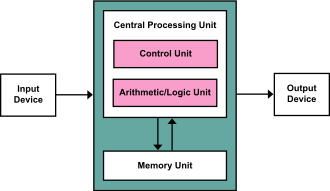

# 冯·诺伊曼结构｜精选补充资料

> 来源：[维基百科（中文）](https://zh.wikipedia.org/wiki/%E5%86%AF%C2%B7%E8%AF%BA%E4%BC%8A%E6%9B%BC%E7%BB%93%E6%9E%84)  
> 许可：[CC BY-SA 4.0](https://creativecommons.org/licenses/by-sa/4.0/)  
> 语言：简体中文  
> 获取时间：2026-08-08T09:43:38.881927+00:00

维基百科，自由的百科全书

冯·诺伊曼结构的設計概念。

**冯·诺伊曼结构**（英語：Von Neumann architecture），全称**冯·诺依曼体系结构**，也称**馮·紐曼模型**（Von Neumann model）或**普林斯顿结构**（Princeton architecture），是一种将程序指令存储器和数据存储器合并在一起的電腦設計概念结构，由[约翰·冯·诺伊曼](/wiki/%E7%BA%A6%E7%BF%B0%C2%B7%E5%86%AF%C2%B7%E8%AF%BA%E4%BC%8A%E6%9B%BC "约翰·冯·诺伊曼")等人提出。本詞描述的是一種實作[通用圖靈機](/wiki/%E9%80%9A%E7%94%A8%E5%9C%96%E9%9D%88%E6%A9%9F "通用圖靈機")的計算裝置，以及一種相對於[平行計算](/wiki/%E5%B9%B3%E8%A1%8C%E8%A8%88%E7%AE%97 "平行計算")的序列式架構參考模型（referential model）。

本架構隱約指導了將儲存裝置與中央處理器分開的概念，因此依本架構設計出的計算機又稱**存储程序计算机**。

## 理論

存储程序计算机在体系结构上主要特点有：

1. 以运算单元为中心
2. 采用存储程序原理
3. 存储器是按地址访问、线性编址的空间
4. 控制流由指令流产生
5. 指令由操作码和地址码组成
6. 数据以二进制编码

## 歷史

最早的計算機器僅內含固定用途的程式。現代的某些計算機依然維持這樣的設計方式，通常是為了簡化或教育目的。例如一個[計算器](/wiki/%E8%A8%88%E7%AE%97%E5%99%A8 "計算器")僅有固定的[數學計算](/wiki/%E6%95%B8%E5%AD%B8 "數學")程式，它不能拿來當作[文書處理](/wiki/%E6%96%87%E6%9B%B8%E8%99%95%E7%90%86 "文書處理")軟體，更不能拿來玩[遊戲](/wiki/%E9%9B%BB%E5%AD%90%E9%81%8A%E6%88%B2 "電子遊戲")。若想要改變此機器的程式，你必須更改線路、更改結構甚至重新設計此機器。當然最早的計算機並沒有設計的那麼可程式化。當時所謂的「重寫程式」很可能指的是紙筆設計程式步驟，接著制訂工程細節，再施工將機器的電路配線或結構改變。

而儲存程式型電腦的概念改變了這一切。藉由創造一組[指令集架構](/wiki/%E6%8C%87%E4%BB%A4%E9%9B%86%E6%9E%B6%E6%A7%8B "指令集架構")，並將所謂的[運算](/wiki/%E8%A8%88%E7%AE%97%E7%90%86%E8%AB%96 "計算理論")轉化成一串[程式](/wiki/%E7%A8%8B%E5%BA%8F "程序")指令的執行細節，讓此機器更有彈性。藉著將指令當成一種特別型態的靜態資料，一台儲存程式型電腦可輕易改變其程式，並在程式控制下改變其運算內容。
**冯·诺伊曼结构**與**儲存程式型電腦**是互相通用的名詞，其用法將於下述。而[哈佛結構](/wiki/%E5%93%88%E4%BD%9B%E7%BB%93%E6%9E%84 "哈佛结构")則是一種將程式資料與普通資料分開儲存的設計概念，但是它并未完全突破冯.诺伊曼架构。

儲存程式型概念也可讓程式執行時自我修改程式的運算內容。本概念的設計動機之一就是可讓程式自行增加內容或改變程式指令的記憶體位置，因為早期的設計都要使用者手動修改。但隨著索引暫存器與間接位置存取變成硬體架構的必備機制後，本功能就不如以往重要了。而程式自我修改這項特色也被現代程式設計所揚棄，因為它會造成理解與除錯的難度，且現代中央處理器的管線與快取機制會讓此功能效率降低。

從整體而言，將指令當成資料的概念使得[組合語言](/wiki/%E7%B5%84%E5%90%88%E8%AA%9E%E8%A8%80 "組合語言")、[編譯器](/wiki/%E7%B7%A8%E8%AD%AF%E5%99%A8 "編譯器")與其他自動編程工具得以實現；可以用這些「自動編程的程式」，以人類較易理解的方式編寫程式；從局部來看，強調I/O的機器，例如[Bitblt](/w/index.php?title=Bitblt&action=edit&redlink=1 "Bitblt（页面不存在）")，想要修改畫面上的圖樣，以往是認為若沒有客制化硬體就辦不到。但之後顯示這些功能可以藉由「執行中編譯」技術而有效達到。

此架構當然有所缺陷，除了下列將述的[冯·诺伊曼瓶頸](#冯·诺伊曼瓶頸)之外，修改程式很可能是非常具傷害性的，無論無意或設計錯誤。在一個簡單的儲存程式型電腦上，一個設計不良的程式可能會傷害自己、其他程式甚或是作業系統，導致[當機](/wiki/%E7%95%B6%E6%A9%9F "當機")。[緩衝區溢位](/wiki/%E7%B7%A9%E8%A1%9D%E5%8D%80%E6%BA%A2%E4%BD%8D "緩衝區溢位")就是一個典型例子。而創造或更改其他程式的能力也導致了[惡意軟體](/wiki/%E6%83%A1%E6%84%8F%E8%BB%9F%E9%AB%94 "惡意軟體")的出現。利用緩衝區溢位，一個惡意程式可以覆蓋[呼叫堆疊](/wiki/%E5%91%BC%E5%8F%AB%E5%A0%86%E7%96%8A "呼叫堆疊")（Call stack）並覆寫程式碼，並且修改其他程式[檔案](/wiki/%E6%AA%94%E6%A1%88 "檔案")以造成連鎖破壞。[記憶體保護](/wiki/%E8%A8%98%E6%86%B6%E9%AB%94%E4%BF%9D%E8%AD%B7 "記憶體保護")機制及其他形式的[存取控制](/wiki/%E5%AD%98%E5%8F%96%E6%8E%A7%E5%88%B6 "存取控制")可以保護意外或惡意的程式碼更動。

## 第一次提出及實作

「冯·诺伊曼结构」這個詞出自美籍猶太數學家[约翰·冯·诺伊曼](/wiki/%E7%BA%A6%E7%BF%B0%C2%B7%E5%86%AF%C2%B7%E8%AF%BA%E4%BC%8A%E6%9B%BC "约翰·冯·诺伊曼")（John von Neumann）的論文：《[EDVAC報告書的第一份草案](/wiki/EDVAC%E5%A0%B1%E5%91%8A%E6%9B%B8%E7%9A%84%E7%AC%AC%E4%B8%80%E4%BB%BD%E8%8D%89%E6%A1%88 "EDVAC報告書的第一份草案")》（*First Draft of a Report on the EDVAC*），
於1945年6月30日。冯·诺依曼由于在[曼哈顿工程](/wiki/%E6%9B%BC%E5%93%88%E9%A1%BF%E5%B7%A5%E7%A8%8B "曼哈顿工程")中需要大量的运算，从而使用了当时最先进的两台计算机Mark I和[ENIAC](/wiki/ENIAC "ENIAC")，在使用Mark I和ENIAC的过程中，他意识到了存储程序的重要性，从而提出了存储程序逻辑架构。雖然冯·诺伊曼的概念非常新穎，但冯·诺伊曼結構這個詞，對冯·诺伊曼的合作伙伴、時人甚至先輩都不公平。

一份由德國工程師[康拉德·楚泽](/wiki/%E5%BA%B7%E6%8B%89%E5%BE%B7%C2%B7%E6%A5%9A%E6%BE%A4 "康拉德·楚澤")（Konrad Zuse）提出的專利應用就已在1936年點出這類概念。而儲存程式型電腦的概念早在冯·诺伊曼知曉ENIAC的存在前就已在[賓州大學](/wiki/%E8%B3%93%E5%B7%9E%E5%A4%A7%E5%AD%B8 "賓州大學")的摩爾電機學院流傳了。此構想的確實創立者永遠是個謎。

[赫曼·魯寇夫](/w/index.php?title=%E8%B5%AB%E6%9B%BC%C2%B7%E9%AD%AF%E5%AF%87%E5%A4%AB&action=edit&redlink=1 "赫曼·魯寇夫（页面不存在）")（英语：[Herman Lukoff](https://en.wikipedia.org/wiki/Herman_Lukoff "en:Herman Lukoff")）相信是艾克特創建此概念（見[參考資料](#References)）。

[莫奇利](/wiki/%E7%BA%A6%E7%BF%B0%C2%B7%E8%8E%AB%E5%A5%87%E5%88%A9 "约翰·莫奇利")與[艾克特](/wiki/%E7%B4%84%E7%BF%B0%C2%B7%E7%9A%AE%E6%96%AF%E6%99%AE%C2%B7%E5%9F%83%E5%85%8B%E7%89%B9 "約翰·皮斯普·埃克特")在1943年於他們建造[ENIAC](/wiki/ENIAC "ENIAC")時寫下關於儲存程式的概念，另外，ENIAC計畫管理員布萊德（Grist Brainerd）在1943年12月為ENIAC做的進度回報，就已隱約提及儲存程式的概念（雖然也同時否決了在ENIAC實作的計畫），他說「為了擁有最簡單的實作計畫以及不複雜的事務，ENIAC建造時後將不需要任何自動整備」。

當設計ENIAC時，它很清楚說明從讀卡機或紙帶讀取指令是不夠快的，因為ENIAC設計用於高速執行運算。因此ENIAC直接以電路管線設計程式，並在需要新程式時重新配接線路。設計師也很清楚他們需要更好的系統架構，因此在ENIAC建造期間第一份[EDVAC](/wiki/EDVAC "EDVAC")的報告就已撰寫完畢，並包含了儲存程式的概念，此概念敘述程式指令儲存在高速記憶體（水銀延遲記憶體）中，因此可以在執行時快速存取。

[艾倫·圖靈](/wiki/%E8%89%BE%E5%80%AB%C2%B7%E5%9C%96%E9%9D%88 "艾倫·圖靈")在1946年2月19日講演了一份包含程式儲存型電腦（[Pilot ACE](/wiki/Pilot_ACE "Pilot ACE")）完整設計的論文。

## 冯·诺伊曼瓶頸

將CPU與記憶體分開並非十全十美，反而會導致所謂的冯·诺伊曼瓶頸（Von Neumann bottleneck）：在CPU與記憶體之間的[流量](/wiki/%E6%B5%81%E9%87%8F "流量")（資料傳輸率）與記憶體的容量相比起來相當小，在現代電腦中，流量與CPU的工作效率相比之下非常小，在某些情況下（當CPU需要在巨大的資料上執行一些簡單指令時），資料流量就成了整體效率非常嚴重的限制。CPU將會在資料輸入或輸出記憶體時閒置。由於CPU速度遠大於記憶體讀寫速率，因此瓶頸問題越來越嚴重。

而冯·诺伊曼瓶頸是[約翰·巴科斯](/wiki/%E7%B4%84%E7%BF%B0%C2%B7%E5%B7%B4%E7%A7%91%E6%96%AF "約翰·巴科斯")在1977年ACM[圖靈獎](/wiki/%E5%9B%BE%E7%81%B5%E5%A5%96 "图灵奖")得獎致詞時第一次出現，根據巴科斯所言：

> ……確實有一個變更儲存裝置的方法，比藉由馮·諾伊曼瓶頸流通大量資料更為先進。瓶頸這詞不僅是對於問題本身資料流量的敘述，更重要地，也是個使我們的思考方法侷限在『一次一字元』模式的智能瓶頸。它使我們怯於思考更廣泛的概念。因此編程成為一種計畫與詳述通過馮諾伊曼瓶頸的字元資料流，且大部分的問題不在於資料的特徵，而是如何找出資料。

原文如下：

> Surely there must be a less primitive way of making big changes in the store than by pushing vast numbers of [words](/w/index.php?title=Word_(data_type)&action=edit&redlink=1 "Word (data type)（页面不存在）") back and forth through the von Neumann bottleneck. Not only is this tube a literal bottleneck for the data traffic of a problem, but, more importantly, it is an intellectual bottleneck that has kept us tied to word-at-a-time thinking instead of encouraging us to think in terms of the larger conceptual units of the task at hand. Thus programming is basically planning and detailing the enormous traffic of words through the von Neumann bottleneck, and much of that traffic concerns not significant data itself, but where to find it.

在CPU與記憶體間的[快取](/wiki/%E5%BF%AB%E5%8F%96 "快取")記憶體抒解了冯·诺伊曼瓶頸的效能問題。另外，[分支預測](/wiki/%E5%88%86%E6%94%AF%E9%A0%90%E6%B8%AC "分支預測")（[branch prediction](/wiki/%E5%88%86%E6%94%AF%E9%A0%90%E6%B8%AC%E5%99%A8 "分支預測器")）演算法的建立也幫助緩和了此問題。巴科斯在1977年論述的「智能瓶頸」已改變甚多。且巴科斯對於此問題的解決方案並沒有造成明顯影響。現代的[函數式編程](/wiki/%E5%87%BD%E6%95%B8%E5%BC%8F%E7%B7%A8%E7%A8%8B "函數式編程")以及[物件導向](/wiki/%E7%89%A9%E4%BB%B6%E5%B0%8E%E5%90%91 "物件導向")編程已較少執行如早期[Fortran](/wiki/Fortran "Fortran")一般會「將大量數值從記憶體搬入搬出的操作」，但平心而論，這些操作的確佔用電腦大部分的執行時間。

## 早期的儲存程式型電腦

下列的日期資料很難給予一個適當的日期順序。一些是第一次執行測試程式的日期；一些是電腦第一次公開展示或完成建造的日期；還有一些是第一次散佈及安裝日期。

| 製造者 | 型號 | 測試日期 | 完成日期 | 展示日期 | 備註 |
| --- | --- | --- | --- | --- | --- |
| [IBM](/wiki/IBM "IBM") | [SSEC](/w/index.php?title=SSEC&action=edit&redlink=1 "SSEC（页面不存在）") |  |  | 1948年1月27日 | 由於他的某些零件是機械式的，因此不算完全的電子電腦。 |
| [曼彻斯特大学](/wiki/Victoria_University_of_Manchester "Victoria University of Manchester") | [SSEM](/w/index.php?title=Small-Scale_Experimental_Machine&action=edit&redlink=1 "Small-Scale Experimental Machine（页面不存在）") | 1948年6月21日 |  |  | 第一個完全電子式且執行儲存程式概念的電腦。 它在1948年6月21日以52分鐘執行了一個[因式分解](/wiki/%E5%9B%A0%E5%BC%8F%E5%88%86%E8%A7%A3 "因式分解")程式， 之後執行了一個簡單除法演算，以及一個判定兩整數是否互質的程式。 |
| [宾夕法尼亚大学](/wiki/%E5%AE%BE%E5%A4%95%E6%B3%95%E5%B0%BC%E4%BA%9A%E5%A4%A7%E5%AD%A6 "宾夕法尼亚大学") | [ENIAC](/wiki/ENIAC "ENIAC") | 1948年9月16日 |  |  | 藉由執行一個[Adele Goldstine](/w/index.php?title=Adele_Goldstine&action=edit&redlink=1 "Adele Goldstine（页面不存在）")為馮諾伊曼所寫的程式， 展示它已被修改為儲存程式型電腦。 |
| [Eckert-Mauchly Computer Corporation](/w/index.php?title=Eckert-Mauchly_Computer_Corporation&action=edit&redlink=1 "Eckert-Mauchly Computer Corporation（页面不存在）")（英语：[Eckert-Mauchly Computer Corporation](https://en.wikipedia.org/wiki/Eckert-Mauchly_Computer_Corporation "en:Eckert-Mauchly Computer Corporation")） | 1949年2、3、4月 | 1949年9月 |  |  |  |
| [曼彻斯特大学](/wiki/%E6%9B%BC%E5%BD%BB%E6%96%AF%E7%89%B9%E5%A4%A7%E5%AD%A6 "曼彻斯特大学") | [Mark I](/wiki/%E9%A9%AC%E5%85%8B%E4%B8%80%E5%8F%B7 "马克一号") |  | 1949年4月建造中版本 1949年10月正式版本 |  |  |
| [Cambridge](/wiki/Cambridge "Cambridge") | [EDSAC](/wiki/EDSAC "EDSAC") | 1949年5月6日 |  |  |  |
| [宾夕法尼亚大学](/wiki/%E5%AE%BE%E5%A4%95%E6%B3%95%E5%B0%BC%E4%BA%9A%E5%A4%A7%E5%AD%A6 "宾夕法尼亚大学") | [EDVAC](/wiki/EDVAC "EDVAC") |  | 1949年 | 1951年 |  |  |
| 歐澳兩洲合作 | [CSIR Mk I](/w/index.php?title=CSIRAC&action=edit&redlink=1 "CSIRAC（页面不存在）") | 1949年11月 |  |  |  |  |
| [NIST](/wiki/%E5%9C%8B%E5%AE%B6%E6%A8%99%E6%BA%96%E6%8A%80%E8%A1%93%E7%A0%94%E7%A9%B6%E6%89%80 "國家標準技術研究所") | [SEAC](/w/index.php?title=SEAC&action=edit&redlink=1 "SEAC（页面不存在）") |  |  | 1950年4月 |  |
| [NPL](/wiki/%E8%8B%B1%E5%9B%BD%E5%9B%BD%E5%AE%B6%E7%89%A9%E7%90%86%E5%AE%9E%E9%AA%8C%E5%AE%A4 "英国国家物理实验室") | [Pilot ACE](/wiki/Pilot_ACE "Pilot ACE") | 1950年5月10日 |  | 1950年12月 |  |
| [NIST](/wiki/%E5%9C%8B%E5%AE%B6%E6%A8%99%E6%BA%96%E6%8A%80%E8%A1%93%E7%A0%94%E7%A9%B6%E6%89%80 "國家標準技術研究所") | [SWAC](/w/index.php?title=SWAC&action=edit&redlink=1 "SWAC（页面不存在）") |  | 1950年7月 |  |  |
| [MIT](/wiki/%E9%BA%BB%E7%9C%81%E7%90%86%E5%B7%A5%E5%AD%B8%E9%99%A2 "麻省理工學院") | [Whirlwind](/w/index.php?title=Whirlwind&action=edit&redlink=1 "Whirlwind（页面不存在）") |  | 1950年12月 | 1951年4月 |  |
| [雷明頓蘭德公司](/wiki/%E9%9B%B7%E6%98%8E%E9%A0%93%E8%98%AD%E5%BE%B7%E5%85%AC%E5%8F%B8 "雷明頓蘭德公司") | 第一代 [ERA Atlas](/w/index.php?title=UNIVAC_1101&action=edit&redlink=1 "UNIVAC 1101（页面不存在）") |  | 1950年12月 |  | 之後的商業版本是ERA 1101/UNIVAC 1101 |

### 引用

1. **[^](#cite_ref-1)** [冯·诺依曼体系结构 - 术语在线](https://www.termonline.cn/wordDetail?termName=%E5%86%AF%C2%B7%E8%AF%BA%E4%BE%9D%E6%9B%BC%E4%BD%93%E7%B3%BB%E7%BB%93%E6%9E%84&subject=b598ca6c26b011ee8153b068e6519520&base=1)
2. **[^](#cite_ref-2)** ["MFTL" entry, Jargon File 4.4.7](http://catb.org/~esr/jargon/html/M/MFTL.html).  [2006-12-28]. （原始内容[存档](https://web.archive.org/web/20110805115622/http://www.catb.org/~esr/jargon/html/M/MFTL.html)于2011-08-05）.
3. **[^](#cite_ref-3)** [First Draft of a Report on the EDVAC](http://www.virtualtravelog.net/entries/2003-08-TheFirstDraft.pdf) （[页面存档备份](//web.archive.org/web/20040423232125/http://www.virtualtravelog.net/entries/2003-08-TheFirstDraft.pdf)，存于[互联网档案馆](/wiki/%E4%BA%92%E8%81%94%E7%BD%91%E6%A1%A3%E6%A1%88%E9%A6%86 "互联网档案馆")） (PDF, 420 KB)
4. **[^](#cite_ref-backus_4-0)** [Backus, John W.](/wiki/John_Backus "John Backus") Can Programming Be Liberated from the von Neumann Style? A Functional Style and Its Algebra of Programs. [doi:10.1145/359576.359579](https://doi.org/10.1145%2F359576.359579).
5. **[^](#cite_ref-5)** [Dijkstra, Edsger W.](/wiki/Edsger_W._Dijkstra "Edsger W. Dijkstra") [E. W. Dijkstra Archive: A review of the 1977 Turing Award Lecture](http://www.cs.utexas.edu/~EWD/transcriptions/EWD06xx/EWD692.html).  [2008-07-11]. （原始内容[存档](https://web.archive.org/web/20200226000801/http://www.cs.utexas.edu/~EWD/transcriptions/EWD06xx/EWD692.html)于2020-02-26）.

### 书籍

* *The First Computers: History and Architectures*：由Raúl Rojas與Ulf Hashagen編輯，MIT Press，2000. [ISBN 0-262-18197-5](/wiki/Special:BookSources/0262181975)。
* *From Dits to Bits... : A Personal History of the Electronic Computer*，Herman Lukoff，1979. Robotics Press, [ISBN 0-89661-002-0](/wiki/Special:BookSources/0896610020)
* Martin Davis（2000），第八章，"Making the first Universal computers"，*Engines of Logic: Mathematicians and the origin of the Computer*，W. W. Norton & Company，Inc. New York. [ISBN 0-393-32229-7](/wiki/Special:BookSources/0393322297) pbk。
* *Can Programming be Liberated from the von Neumann Style?*，John Backus，1977 ACM Turing Award Lecture. Communications of the ACM，August 1978，Volume 21，Number 8. [線上PDF](https://web.archive.org/web/20070621162552/http://www.stanford.edu/class/cs242/readings/backus.pdf)
* C. Gordon Bell與Allen Newell（1971），*Computer Structures: Readings and Examples*，McGraw-Hill Book Company，New York. Massive（668頁）。

* [哈佛架構](/wiki/%E5%93%88%E4%BD%9B%E6%9E%B6%E6%A7%8B "哈佛架構")
* [圖靈機](/wiki/%E5%9C%96%E9%9D%88%E6%A9%9F "圖靈機")
* [隨機存取機 (random access machine)](/wiki/%E9%9A%A8%E6%A9%9F%E5%AD%98%E5%8F%96%E6%A9%9F "隨機存取機")

[分类](/wiki/Special:Categories "Special:Categories")：​

* [電腦架構](/wiki/Category:%E9%9B%BB%E8%85%A6%E6%9E%B6%E6%A7%8B "Category:電腦架構")
* [費林分類法](/wiki/Category:%E8%B2%BB%E6%9E%97%E5%88%86%E9%A1%9E%E6%B3%95 "Category:費林分類法")
* [電腦的類別](/wiki/Category:%E9%9B%BB%E8%85%A6%E7%9A%84%E9%A1%9E%E5%88%A5 "Category:電腦的類別")
* [1945年面世](/wiki/Category:1945%E5%B9%B4%E9%9D%A2%E4%B8%96 "Category:1945年面世")

隐藏分类：​

* [自2025年3月缺少注脚的条目](/wiki/Category:%E8%87%AA2025%E5%B9%B43%E6%9C%88%E7%BC%BA%E5%B0%91%E6%B3%A8%E8%84%9A%E7%9A%84%E6%9D%A1%E7%9B%AE "Category:自2025年3月缺少注脚的条目")
* [含有英語的條目](/wiki/Category:%E5%90%AB%E6%9C%89%E8%8B%B1%E8%AA%9E%E7%9A%84%E6%A2%9D%E7%9B%AE "Category:含有英語的條目")
* [含有德語的條目](/wiki/Category:%E5%90%AB%E6%9C%89%E5%BE%B7%E8%AA%9E%E7%9A%84%E6%A2%9D%E7%9B%AE "Category:含有德語的條目")
* [使用ISBN魔术链接的页面](/wiki/Category:%E4%BD%BF%E7%94%A8ISBN%E9%AD%94%E6%9C%AF%E9%93%BE%E6%8E%A5%E7%9A%84%E9%A1%B5%E9%9D%A2 "Category:使用ISBN魔术链接的页面")
