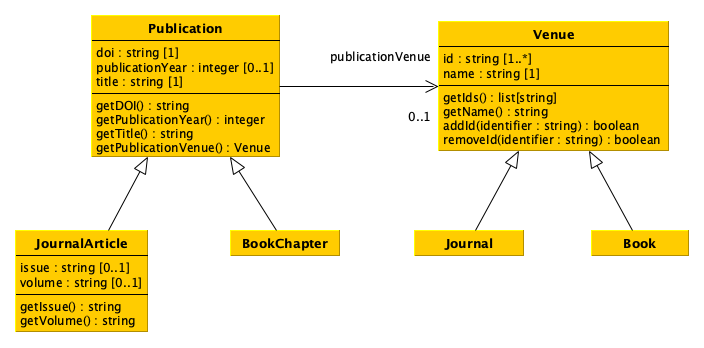

# Implementation of data models via Python classes

> 来源：[博洛尼亚大学 Digital Humanities and Digital Knowledge 课程团队](https://thinkcompute.github.io/16-data-models.html)  
> 许可：[CC BY 4.0](https://creativecommons.org/licenses/by/4.0/)  
> 语言：英文补充资料  
> 版本：0c6a477bcdb50fd73b3b06d08a8f56324c86454f  
> 署名：改编自 Silvio Peroni、Ivan Heibi、Arcangelo Massari（2025）《Think and Compute: a Primer for Digital Humanists》，原作采用 CC BY 4.0。

# Implementation of data models via Python classes

In this chapter, we see how to create Python classes to implement a model for the representation of data.

## What is a class in Python

In Python, as in other [object-oriented programming languages](https://en.wikipedia.org/wiki/Object-oriented_programming), a class is an extensible template for creating objects having a specific type. All the basic types of values (e.g. strings, integers, booleans) and the other data structures (e.g. lists, sets, dictionaries) are defined by means of particular classes. 

In addition, each class makes available a set of [methods](https://en.wikipedia.org/wiki/Method_(computer_programming)) that allow one to interact with the objects (i.e. the instances) of such a class. A method is a particular function that can be run only if directly called via an object. For instance, the instruction `"this is a string".split(" ")` executes the method `split` passing `" "` as the input parameter on the particular string object on which the method is called, i.e. the string `"this is a string"` (defined by the [class `str`](https://docs.python.org/3/library/stdtypes.html#str) in Python).

## Defining a data model using Python classes

[Python classes](https://docs.python.org/3/tutorial/classes.html), as the name may recall, can be used to implement a particular data model such as that introduced in the following diagram using the [Unified Modelling Language (UML)](https://en.wikipedia.org/wiki/Unified_Modeling_Language). We will use this example to understand how to implement classes in Python, and to show how they works.


As you can see from the diagram above, we defined six distinct classes which are, somehow, related to each other. Let us see how to define this structure in Python.

### Defining our first class

For defining classes in Python, one has to use the following signature:

```
class <class name>(<superclass 1>, <superclass 2>, ...):
    def __init__(self, <param 1>, <param 2>, ...):
        ...
```

In the excerpt above, `<class name>` is the name one wants to assign to a class, while `<superclass 1>`, `<superclass 2>`, etc., indicate the superclasses from which this class is derived from. In Python, all new classes must be subclass of the generic class `object`. Instead, the indented `def __init__` is a special method defining the constructor of an object of that class, and it will called every time one wants to create a new object (instance) of this type. For instance, when we create a new set in Python using `set()`, we are calling the constructur of the [class `set`](https://docs.python.org/3/library/stdtypes.html#set), defined as shown above.

It is worth mentioning that all the methods of a class, including its constructor, must specify `self` as the first parameter. This special parameter represents the instance of the class in consideration. In practice, every time we instantiate a new object of that class, `self` will be assigned to that object and provides access to its attributes (i.e. variables assigned with particular values for that object) and methods as defined in the related class. In particular, it is used to access to all object related information within the class itself.

For instance, by using such a `self` parameter, it is possible to create variables and associated values that are local to a particular object of that class. In the following excerpt, we use it to define the constructor of the the class `Venue` in the data model shown above as a UML diagram:

```python
class Venue:
    def __init__(self, identifiers, name):
        self.id = set()
        for identifier in identifiers:
            self.id.add(identifier)

        self.name = name
```

As shown in the code above, the class `Venue` is defined as subclass of the top class `object`, and its constructor takes in input three parameters: `self` (as explained above), `identifiers` and `name`. 

The parameter `identifiers` is used to take in input a collection of strings that contains all the identifiers of such an object. In the above code, I decided to handle all the items included in the collection using a set to comply with the declaration in the data model class which wants to have a collection of at least one or more string identifiers (`id : string [1..*]`). Indeed, I have created a new variable `id` related to the particular object of the class `self` (i.e. `self.id`) and I have assigned a new set to it. Then, I added all the identifiers in the input collection to the set using the [set method `add`](https://docs.python.org/3/library/stdtypes.html#frozenset.add) (i.e. via the instruction `self.id.add(identifier)`.

Instead, the parameter `name` is used to specify the name of a particular venue. Thus, I have just assigned it to the variable `name` of the object `self` (i.e. `self.name`) to mimic the data model attribute `name : str [1]`. Of course, I could also use a different structure to store this information - for instance, I could use again a set which contained only one value in it. The important thing here, while trying to map the data model into a Python class, is to be compliant with the data model declaration. I chose to assigned it straight with a variable supposing that the input will be a simple string.

In practice, thanks to the `self` keyword, I can create new independent variables for each new object created using this class.

### Representing relations in Python

The Python class defined above represents (by means of its constructor) all the attributes associated to the related data model class. However, in data models, there are also relations that may exist between different kinds of objects, as the relation `publicationVenue` between the data model classes `Publication` and `Venue`. In Python, such relations can be represented as the other attributes, i.e. by assigning some specific values to `self`-declared variables, as shown in the following excerpt:

```python
class Publication:
    def __init__(self, doi, publicationYear, title, publicationVenue):
        self.doi = doi
        self.publicationYear = publicationYear
        self.title = title
        self.publicationVenue = publicationVenue
```

As shown in the except above, the constructor of the class `Publication` takes in input not only the attributes of the related data model class but also its relations (i.e. the relation from which the class is the starting point), and considers it as additional parameters of the constructor. Then, they will be handled as the others. Of course, the type of object that should be specified in the parameter `publicationVenue` should have class `Venue`, defined above.

### Instantiating a class

Once classes are defined, we can use them to instantiate objects of that kind. For doing it, we should call their constructor (using the name of the class) passing the parameters it requires **except** `self`, that will be implicitly considered. In practice, for creating a new object of class `Venue`, we need to specify only two parameters, i.e. those for `identifiers` (i.e. a collection of strings) and `name` (i.e. a string). As an example, let us consider again the first two items of the [venues CSV file](01-venues.csv) we have introduced in the previous tutorial, i.e.:

| id | name | type |
|---|---|---|
| 1531-6912 | Comparative and Functional Genomics | journal |
| 1367-5931 | Current Opinion in Chemical Biology | journal |

These two entities (i.e. venues) can be defined using the Python class `Venue` as follows:

```python
venue_1 = Venue(["1531-6912"], "Comparative and Functional Genomics")
venue_2 = Venue(["1367-5931"], "Current Opinion in Chemica Biology")
```

As shown in the above excerpt, I have created two new objects, assigned to two distinct variables, one for each venue. All the values specified as input of the constructur have been assigned to the `self` variables of each object, that are distinct, while share the same structure. Indeed, using the Python built-in [function `id`](https://docs.python.org/3/library/functions.html#id) (that takes in input an object and returns the unique integer identifying it) and [function `type`](https://docs.python.org/3/library/functions.html#type) (that takes in input an object and returns its related type), it is possible to see that `venue_1` and `venue_2` are different objects of the same class:

```python
print("The objects in 'value_1' and 'value_2' share the same class -->", type(venue_1) == type(venue_2))
print("Indeed, the types of the two objects are both", type(venue_1))

print("\nThe objects in 'value_1' and 'value_2' are the same object -->", id(venue_1) == id(venue_2))
print("Indeed, the integers identifying the two objects are", id(venue_1), "and", id(venue_2), "respectively")
```

Similarly, we can create new objects also of other classes, such as `Publication`. In this case, the last parameter of the constructor of `Publication` (i.e. `publicationVenue`) should take in input an object having class `Venue` as defined above. As another example, let us consider again the first two items of the [publications CSV file](01-publications.csv) we have introduced in the previous tutorial, i.e.:

| doi | title | publication year | publication venue | type | issue | volume |
|---|---|---|---|---|---|---|
| 10.1002/cfg.304 | Development of Computational Tools for the Inference of Protein Interaction Specificity Rules and Functional Annotation Using Structural Information | 2003 | 1531-6912 | journal article | 4 | 4 |
10.1016/s1367-5931(02)00332-0 | In vitro selection as a powerful tool for the applied evolution of proteins and peptides | 2002 | 1367-5931 | journal article | 3 | 6 |

These two publications can be defined using the Python class `Publication` as follows:

```python
publication_1 = Publication("10.1002/cfg.304", 
                            2003, 
                            "Development of Computational Tools for the Inference of Protein Interaction Specificity Rules and Functional Annotation Using Structural Information", 
                            venue_1)

publication_2 = Publication("10.1016/s1367-5931(02)00332-0", 
                            2002, 
                            "In vitro selection as a powerful tool for the applied evolution of proteins and peptides", 
                            venue_2)
```

It is worth mentioning that, as shown in the excerpt above, we have not specified the identifier of a particular venue as input, bur rather we have provided the `Venue` object representing such a venue, as also defined by the relation `publicationVenue` specified in the data model.

### Creating subclasses of a given class

As you may have noticed, we did not map all the columns of the CSV documents introduced above in the classes we have defined. Indeed, the data model above actually specifies some of this information (for instance the concept of publication type and the fields `issue` and `volume`) into subclasses of `Publication` and `Venue`. Python makes available a mechanism to create new classes as subclasses of existing ones, thus inheriting all the attributes and methods that the superclasses already implement, similar to what a data model enables. 

We can use the same signature adopted for classes for creating subclasses by specifying the classes to extend in the definition of the class, as we already did specifying the class `object` as top class of `Publication` and `Venue`, as shown as follows:

```python
class BookChapter(Publication):
    pass

class Journal(Venue):
    pass

class Book(Venue):
    pass
```

In the code above, the body of each class extending the classes `Publication` and `Venue` is left unspecified. This means that the new subclasses inherit (and can access via `self`) all the attributes and methods (including the constructor) from the superclass. Thus, the only thing they really add in this case is the specification of a new characterising type, which mimic the `type` field of the CSV file presented above.

However, adding such new information is enough for classifying them as distinct classes, even if one (e.g. `Journal`) is subclass of another (e.g. `Venue`). Indeed, in the following code, I create a new instance of the class `Journal` using the same input values of `value_1`, specified above. As you can see, the classes returned by these two objects are indeed different:

```python
# An object of class 'Journal' is instantiated using the same parameters
# of the constructor of its parent class 'Venue' since 'Journal' does not
# define any explicit constructor
journal_1 = Journal(["1531-6912"], "Comparative and Functional Genomics")

print("The objects in 'journal_1' and 'venue_1' share the same class -->", type(journal_1) == type(venue_1))
print("Indeed, the types of the two objects are", type(journal_1), "and", type(venue_1), "respectively")
```

Of course, in some cases, the new subclass may take in input additional information compared to its superclass. In these cases, e.g. for mapping in Python the data model class `JournalArticle` that introduces also the attributes `issue` and `volume`, it would be necessary to define an appropriate constructor extending that of the parent superclass. An implementation of the Python class `JournalArticle` is shown as follows:

```python
class JournalArticle(Publication):
    def __init__(self, doi, publicationYear, title, publicationVenue, issue, volume):
        self.issue = issue
        self.volume = volume
        
        # Here is where the constructor of the superclass is explicitly recalled, so as
        # to handle the input parameters as done in the superclass
        super().__init__(doi, publicationYear, title, publicationVenue)
```

In the code above, the additional parameters `issue` and `venue` are handled as before, while all the other are tranferred to the constructor of the superclass accessed by using the [function `super`](https://docs.python.org/3.5/library/functions.html#super) (which returns a proxy object that delegates method calls to the parent class) and then calling the `__init__` constructor with all the expected parameters **except** `self`. In this case, to instantiate an object of class `JournalArticle`, all the input parameters must be specified:

```python
journal_article_1 = JournalArticle("10.1002/cfg.304", 
                                   2003, 
                                   "Development of Computational Tools for the Inference of Protein Interaction Specificity Rules and Functional Annotation Using Structural Information", 
                                   journal_1, 
                                   "4", 
                                   "4")
```

## Extending classes with methods

Once an object of a certain class is created, one can access all its attributes (i.e. those assigned to `self` variables) directly by their name using the following syntax: `<object>.<attribute name>`. For instance, if we want to print on screen the title of the journal article we have just created, we can run the following code:

```python
print(journal_article_1.title)
```

In principle, such a way to referring to specific attributes of an object allows one to also modify the value of their attributes directly, by assigning them to a new value as we do for any variable, for instance:

```python
journal_article_1.title = "My new title!"
print(journal_article_1.title)
```

However, this way of modifying object attributes is not safe and may have undesired outcomes if someone does not know how to deal with it properly. Thus, in order to facilitate the interaction with object's attribute and to provide operation to work with and manipolate them, Python (and all the other object-oriented programming languages) allows one to create [methods](https://en.wikipedia.org/wiki/Method_(computer_programming)). 

A method of a class encapsulate an operation that can be run on an object of that class and that can, in principle, be responsible to act upon the attributes related to that object. In practice, methods are just functions tied to specific classes, and can provide also a mechanism to read (safely) values assigned to object attributes without accessing directly to them.

We can define method visually by using UML, the same language we have initially adopted for defining our exemplar data model. Indeed, UML has been originally developed as a general-purpose modeling language in the field of software engineering, and provides widgets that permit the description of a software system including classes and their methods – even if it can be useful also in the task of defining a generic data model. The following diagram shows an extension of the data model presented above with the inclusion of new methods for accessing and, in some cases, modifying the status of particular object attributes.



In UML, the methods are listed just after the attributes of a given class, following the signature:

```
<method name>(<param 1> : <class of param 1>, <param 2> : <class of param 2>, ...) : <type of value returned>
``` 

For instance, the method `getDOI()` (no input needed here) of the class `Publication` returns a string, i.e. the DOI assigned to the particular publication; instead, the method `addId(identifier : string)` returns a boolean value that states if the operation of adding the string `identifer` to the set of identifiers of the class `Venue` went well (i.e. returned `True`) or not (i.e. returned `False`). Of course, this precise specification of the meaning of the return value of each method is not defined in the diagram itself, but it accompanies somehow the descriptive diagram as a natural language description of what the method should do. However, the diagram already provides the means of the kinds of input and the related output each method must to take and provide, respectively.

### Defining a method in Python

Python uses the same structure seen for the constructor for defining all the other methods:

```
def <name of the method>(self, <param 1>, <param 2>, ...):
    ...
```

The only thing that changes here is that one can specify the name of the method. For instance, let us define all the method of the class `Publication` as defined in the diagram - the rationale behind each method should be self-explanatory:

```python
class Publication:
    def __init__(self, doi, publicationYear, title, publicationVenue):
        self.doi = doi
        self.publicationYear = publicationYear
        self.title = title
        self.publicationVenue = publicationVenue
    
    def getDOI(self):
        return self.doi
    
    def getPublicationYear(self):
        return self.publicationYear
    
    def getTitle(self):
        return self.title
    
    def getPublicationVenue(self):
        return self.publicationVenue
```

As shown in the code above, the methods defined add a few hooks to access the value of all the attributes of the class. Then, one can use call methods as done for the other built-in classes, i.e. using the signature `<object>.<method to call>(<value 1>, <value 2>, ...)` (as for the constructor, the `self` parameter must not be specified when calling a method), as shown as follows:

```python
# It uses the most recent definition of the class 'Publication', i.e. that with
# the new methods implemented
publication_2 = Publication("10.1016/s1367-5931(02)00332-0", 
                            2002, 
                            "In vitro selection as a powerful tool for the applied evolution of proteins and peptides", 
                            venue_2)

print("-- The title of this publication is:")
print(publication_2.getTitle())
```

Using methods permits one to detach the ratrionale used to store information about the attributes from the particular contract-like committment defined by the UML diagram, that is what the user expects from running a method. For instance, let us see the methods of the class `venue`:

```python
class Venue:
    def __init__(self, identifiers, name):
        self.id = set()
        for identifier in identifiers:
            self.id.add(identifier)
            
        self.name = name
    
    def getIds(self):
        result = []
        for identifier in self.id:
            result.append(identifier)
        result.sort()
        return result
    
    def getName(self):
        return self.name
    
    def addId(self, identifier):
        result = True
        if identifier not in self.id:
            self.id.add(identifier)
        else:
            result = False
        return result
    
    def removeId(self, identifier):
        result = True
        if identifier in self.id:
            self.id.remove(identifier)
        else:
            result = False
        return result
```

As you can see from the new UML diagram with methods, the method `getIds` must return a list of strings, even we have originally defined the attribute `self.id` as a set. Thus, it is up to the method to implement the request as defined in the diagram. In particular, in the implementation above, a new list has been created which contains the same identifiers in the attrubute set `self.id`, but ordered alphabetically. The list returned by the method and the set in `self.id` are two different objects (containing the same items), as shown in the following excerpt:

```python
venue_1 = Venue(["1531-6912"], "Comparative and Functional Genomics")

print("The value in 'self.id' and that returned by the method 'getIds' are two different objects -->")
print(id(venue_1.id) != id(venue_1.getIds())) 

print("\nHowever, they both contains the same collection of element -->")
print(len(venue_1.id.difference(venue_1.getIds())) == 0)
```

This way of handling the interation with class attributes may prevent, also, some undesired effect on mutable values – as a reminder, please see the Section [Clarification: immutable and mutable values](./09-divide-and-conquer.md#clarification-immutable-and-mutable-values) in Chapter {ref}`ch-divide-and-conquer`. For instance:

1. What does it happen if the method `getIds` would return directly the set in `self.id`? 
2. What does it happen if such a set, retriveved by using the method mentioned in the previous question, is then directly modified by a user using the `add` method of the `set` class?
3. How can the structure of the implementation of `getIds` in the code above prevent these issues?

### What about methods and inheritance

Superclass inheritance applies also to the methods, not only to attributes. For instance, let us introduce the extended implementation of the class `JournalArticle` shown above, where we add also the implementation of the additional two methods `getIssue` and `getVolume` as defined in the last UML diagram:

```python
class JournalArticle(Publication):
    def __init__(self, doi, publicationYear, title, publicationVenue, issue, volume):
        self.issue = issue
        self.volume = volume
        
        # Here is where the constructor of the superclass is explicitly recalled, so as
        # to handle the input parameters as done in the superclass
        super().__init__(doi, publicationYear, title, publicationVenue)
    
    def getIssue(self):
        return self.issue
    
    def getVolume(self):
        return self.volume
```

In practice, when we create an new `JournalArticle` object, it will have available the methods the class `JournalArticle` defines plus all those defined by all the ancestor superclasses, at any level of the hierarchy (since I can create a non-circular tree of superclass-subclass relations among a chain of different classes). The following code shows how all both the methods of the two subclass and superclass work as expected in objects having class `JournalArticle`:

```python
# It uses the most recent definition of the class 'JournalArticle', i.e. that with
# the new methods implemented
journal_article_1 = JournalArticle("10.1002/cfg.304", 
                                   2003, 
                                   "Development of Computational Tools for the Inference of Protein Interaction Specificity Rules and Functional Annotation Using Structural Information", 
                                   journal_1, 
                                   "4", 
                                   "4")

print("-- The title of the journal article (method defined in the superclass 'Publication')")
print(journal_article_1.getTitle())

print("\n-- The title of the journal article (method defined in the class 'JournalArticle')")
print(journal_article_1.getIssue())
```

More information about the dynamics of the class inheritance are introduced and detailed in the [chapter "Understanding Inheritance" of *How To Code in Python*](https://www.digitalocean.com/community/books/digitalocean-ebook-how-to-code-in-python).

### Full UML diagram implementation

I have implemented in a <a href="02-myclasses.py">single Python file</a> all the classes introduced in the last UML diagram. They can be imported and reused in other files as shown in the <a href="02-classuse.py">classuse.py</a> file using the following import notation:

```
from <Python file name> import <class 1>, <class 2>, ...
```

You can simply run all the instructions in the latter file running the following command:

```
python classuse.py
```
