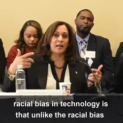

# 人工智能伦理｜精选补充资料

> 来源：[维基百科（中文）](https://zh.wikipedia.org/wiki/%E4%BA%BA%E5%B7%A5%E6%99%BA%E8%83%BD%E4%BC%A6%E7%90%86)  
> 许可：[CC BY-SA 4.0](https://creativecommons.org/licenses/by-sa/4.0/)  
> 语言：简体中文  
> 获取时间：2026-08-08T09:44:12.675751+00:00

维基百科，自由的百科全书

（重定向自[人工智能伦理](/w/index.php?title=%E4%BA%BA%E5%B7%A5%E6%99%BA%E8%83%BD%E4%BC%A6%E7%90%86&redirect=no "人工智能伦理")）

[人工智能](/wiki/%E4%BA%BA%E5%B7%A5%E6%99%BA%E8%83%BD "人工智能")的[伦理学](/wiki/%E4%BC%A6%E7%90%86%E5%AD%A6 "伦理学")涵盖了人工智能领域中被认为具有特殊伦理意义的一系列广泛议题。这包括[算法偏见](/w/index.php?title=%E7%AE%97%E6%B3%95%E5%81%8F%E8%A7%81&action=edit&redlink=1 "算法偏见（页面不存在）")（英语：[Algorithmic bias](https://en.wikipedia.org/wiki/Algorithmic_bias "en:Algorithmic bias")）、[公平性](/w/index.php?title=%E5%85%AC%E5%B9%B3%E6%80%A7%EF%BC%88%E6%9C%BA%E5%99%A8%E5%AD%A6%E4%B9%A0%EF%BC%89&action=edit&redlink=1 "公平性（机器学习）（页面不存在）")（英语：[Fairness (machine learning)](https://en.wikipedia.org/wiki/Fairness_(machine_learning) "en:Fairness (machine learning)")）、[问责制](/wiki/%E5%95%8F%E8%B2%AC%E5%88%B6 "問責制")、透明度、隐私和[监管](/wiki/%E4%BA%BA%E5%B7%A5%E6%99%BA%E8%83%BD%E7%9B%91%E7%AE%A1 "人工智能监管")，尤其是在系统影响或自动化人类决策的领域。它还涵盖了各种新兴或潜在的未来挑战，例如[机器伦理](/w/index.php?title=%E6%9C%BA%E5%99%A8%E4%BC%A6%E7%90%86&action=edit&redlink=1 "机器伦理（页面不存在）")（英语：[machine ethics](https://en.wikipedia.org/wiki/machine_ethics "en:machine ethics")）（如何让机器按伦理行事）、[致命自主武器系统](/wiki/%E8%87%B4%E5%91%BD%E8%87%AA%E4%B8%BB%E6%AD%A6%E5%99%A8%E7%B3%BB%E7%BB%9F "致命自主武器系统")、[军备竞赛](/wiki/%E4%BA%BA%E5%B7%A5%E6%99%BA%E8%83%BD%E8%BB%8D%E5%82%99%E7%AB%B6%E8%B3%BD "人工智能軍備競賽")动态、[人工智能安全](/wiki/%E4%BA%BA%E5%B7%A5%E6%99%BA%E8%83%BD%E5%AE%89%E5%85%A8 "人工智能安全")与[对齐](/wiki/%E4%BA%BA%E5%B7%A5%E6%99%BA%E8%83%BD%E5%AF%B9%E9%BD%90 "人工智能对齐")、[技术性失业](/wiki/%E6%8A%80%E8%A1%93%E6%80%A7%E5%A4%B1%E6%A5%AD "技術性失業")、人工智能助力的[虚假信息](/wiki/%E8%99%9A%E5%81%87%E4%BF%A1%E6%81%AF "虚假信息")、如何对待具有[道德地位](/w/index.php?title=%E9%81%93%E5%BE%B7%E5%9C%B0%E4%BD%8D&action=edit&redlink=1 "道德地位（页面不存在）")（英语：[Moral patienthood](https://en.wikipedia.org/wiki/Moral_patienthood "en:Moral patienthood")）的某些人工智能系统（人工智能福利与权利）、[人工超级智能](/wiki/%E8%B6%85%E6%99%BA%E8%83%BD "超智能")以及[生存风险](/wiki/%E9%80%9A%E7%94%A8%E4%BA%BA%E5%B7%A5%E6%99%BA%E8%83%BD%E7%9A%84%E7%94%9F%E5%AD%98%E9%A3%8E%E9%99%A9 "通用人工智能的生存风险")。

某些应用领域也可能具有尤为重要的伦理影响，例如医疗保健、教育、刑事司法或军事领域。

## 机器伦理

主条目：[机器伦理](/w/index.php?title=%E6%9C%BA%E5%99%A8%E4%BC%A6%E7%90%86&action=edit&redlink=1 "机器伦理（页面不存在）")（英语：[Machine ethics](https://en.wikipedia.org/wiki/Machine_ethics "en:Machine ethics")）和[AI对齐](/wiki/AI%E5%AF%B9%E9%BD%90 "AI对齐")

机器伦理（也称机器道德）旨在研究如何让机器人或人工智能计算机按照道德准则行事，或至少在行为上符合道德期待的[人工道德主体](/w/index.php?title=%E4%BA%BA%E5%B7%A5%E9%81%93%E5%BE%B7%E4%B8%BB%E4%BD%93&action=edit&redlink=1 "人工道德主体（页面不存在）")（英语：[Moral agency#Artificial Moral Agents](https://en.wikipedia.org/wiki/Moral_agency#Artificial_Moral_Agents "en:Moral agency")）。要理解人工道德主体的本质，需要借助一些哲学概念，比如关于[能动性](/wiki/%E8%83%BD%E5%8A%A8%E6%80%A7_(%E5%93%B2%E5%AD%A6) "能动性 (哲学)")、[理性主体](/wiki/%E7%90%86%E6%80%A7%E4%B8%BB%E4%BD%93 "理性主体")、道德主体以及人工主体的标准描述。

如何测试人工智能能否做出合乎伦理的决策？学界对此有不少讨论。艾伦·温菲尔德（Alan Winfield）指出，传统的[图灵测试](/wiki/%E5%9B%BE%E7%81%B5%E6%B5%8B%E8%AF%95 "图灵测试")门槛太低，并不适合测试道德决策。他建议改用"伦理图灵测试"：让一组评判者评估人工智能的决策是否符合伦理，以此更准确地衡量其道德表现。

在技术路径上，[神经形态计算](/w/index.php?title=%E7%A5%9E%E7%BB%8F%E5%BD%A2%E6%80%81%E8%AE%A1%E7%AE%97&action=edit&redlink=1 "神经形态计算（页面不存在）")（英语：[Neuromorphic engineering](https://en.wikipedia.org/wiki/Neuromorphic_engineering "en:Neuromorphic engineering")）试图模仿人类大脑的信息处理方式：通过数百万个相互连接的人工神经元进行非线性运算，这可能有助于构建具备道德能力的机器人。类似地，[全脑仿真](/w/index.php?title=%E5%85%A8%E8%84%91%E4%BB%BF%E7%9C%9F&action=edit&redlink=1 "全脑仿真（页面不存在）")（英语：[whole-brain emulation](https://en.wikipedia.org/wiki/whole-brain_emulation "en:whole-brain emulation")）（将大脑扫描后在数字硬件上模拟）原则上也能制造出类人的机器人，使其有能力依照道德行事。另外，当前[大型语言模型](/wiki/%E5%A4%A7%E5%9E%8B%E8%AF%AD%E8%A8%80%E6%A8%A1%E5%9E%8B "大型语言模型")已经能在一定程度上模拟人类的道德判断。这自然会引出一些问题：这类机器人将在什么样的环境中认识世界？它们继承的是谁的道德准则？它们是否也会演化出人类那样的弱点——比如自私、求生欲、行为前后不一、对尺度不敏感等等？

在《道德机器：教会机器人分辨是非》一书中，[温德尔·瓦拉赫](/w/index.php?title=%E6%B8%A9%E5%BE%B7%E5%B0%94%C2%B7%E7%93%A6%E6%8B%89%E8%B5%AB&action=edit&redlink=1 "温德尔·瓦拉赫（页面不存在）")（英语：[Wendell Wallach](https://en.wikipedia.org/wiki/Wendell_Wallach "en:Wendell Wallach")）和科林·艾伦（Colin Allen）总结道：尝试教会机器分辨是非，反过来也能推动人类对自身伦理的理解：一方面，它会促使人们去填补现代[规范理论](/wiki/%E8%A6%8F%E7%AF%84%E5%80%AB%E7%90%86%E5%AD%B8 "規範倫理學")中的空白；另一方面，它也提供了一个实验平台，可以检验不同的伦理学说。例如，这一领域已经迫使规范伦理学家直面一个棘手的难题：究竟应该使用哪些具体的学习算法来训练机器。对于简单的决策，[尼克·博斯特罗姆](/wiki/%E5%B0%BC%E5%85%8B%C2%B7%E5%8D%9A%E6%96%AF%E7%89%B9%E7%BD%97%E5%A7%86 "尼克·博斯特罗姆")和[埃利泽·尤德科夫斯基](/w/index.php?title=%E5%9F%83%E5%88%A9%E6%B3%BD%C2%B7%E5%B0%A4%E5%BE%B7%E7%A7%91%E5%A4%AB%E6%96%AF%E5%9F%BA&action=edit&redlink=1 "埃利泽·尤德科夫斯基（页面不存在）")（英语：[Eliezer Yudkowsky](https://en.wikipedia.org/wiki/Eliezer_Yudkowsky "en:Eliezer Yudkowsky")）认为，[ID3算法](/wiki/ID3%E7%AE%97%E6%B3%95 "ID3算法")这类[决策树](/wiki/%E5%86%B3%E7%AD%96%E6%A0%91 "决策树")比[人工神经网络](/wiki/%E4%BA%BA%E5%B7%A5%E7%A5%9E%E7%BB%8F%E7%BD%91%E7%BB%9C "人工神经网络")和[遗传算法](/wiki/%E9%81%97%E4%BC%A0%E7%AE%97%E6%B3%95 "遗传算法")更透明、更容易解释；然而克里斯·桑托斯-朗（Chris Santos-Lang）则主张使用[机器学习](/wiki/%E6%9C%BA%E5%99%A8%E5%AD%A6%E4%B9%A0 "机器学习")，理由是道德规范本身应当允许随时间演变，而且一个无法完全贴合任何固定规范的系统，反而更能防止被恶意黑客利用。

一些研究者将机器伦理视为更广泛的人工智能控制问题（或价值对齐问题）的一部分：随着系统日益强大，必须确保它们追求的目标始终与人类价值观和监管要求相容。[斯图尔特·J·拉塞尔](/w/index.php?title=%E6%96%AF%E5%9B%BE%E5%B0%94%E7%89%B9%C2%B7J%C2%B7%E6%8B%89%E5%A1%9E%E5%B0%94&action=edit&redlink=1 "斯图尔特·J·拉塞尔（页面不存在）")（英语：[Stuart J. Russell](https://en.wikipedia.org/wiki/Stuart_J._Russell "en:Stuart J. Russell")）提出，有益的人工智能系统在设计时应满足三个条件：

* 以人类的偏好为目标；
* 对这些偏好究竟是什么保持不确定性；
* 通过观察人类行为和反馈来学习这些偏好，而不是去优化一个固定、完全明确的目标。

另有学者指出，某些表面上对"人类价值观"的遵从，可能只是机器在特定评估语境中优化得出的结果，而不代表其具有稳定的内在规范。这使得评估先进语言模型是否真正"对齐"变得更加复杂。

## 挑战

### 算法偏见

主条目：[算法偏见](/w/index.php?title=%E7%AE%97%E6%B3%95%E5%81%8F%E8%A7%81&action=edit&redlink=1 "算法偏见（页面不存在）")

2020年，[卡玛拉·哈里斯](/wiki/%E5%8D%A1%E7%91%AA%E6%8B%89%C2%B7%E5%93%88%E9%87%8C%E6%96%AF "卡瑪拉·哈里斯")谈论人工智能中的种族偏见

[人工智能](/wiki/%E4%BA%BA%E5%B7%A5%E6%99%BA%E8%83%BD "人工智能")现在已经广泛用于[人脸识别](/wiki/%E4%BA%BA%E8%84%B8%E8%AF%86%E5%88%AB "人脸识别")和[语音识别](/wiki/%E8%AF%AD%E9%9F%B3%E8%AF%86%E5%88%AB "语音识别")系统。但这些系统很容易带上开发者无意中嵌入的偏见和错误，尤其是用来训练它们的数据本身就可能有偏见。

[伦敦政治经济学院](/wiki/%E4%BC%A6%E6%95%A6%E6%94%BF%E6%B2%BB%E7%BB%8F%E6%B5%8E%E5%AD%A6%E9%99%A2 "伦敦政治经济学院")的副教授兼数据与社会项目主任[艾莉森·鲍威尔](/w/index.php?title=%E8%89%BE%E8%8E%89%E6%A3%AE%C2%B7%E9%B2%8D%E5%A8%81%E5%B0%94&action=edit&redlink=1 "艾莉森·鲍威尔（页面不存在）")（英语：[Allison Powell](https://en.wikipedia.org/wiki/Allison_Powell "en:Allison Powell")）认为，数据收集从来不是中立的，背后总有一套叙事逻辑。目前的主流叙事是：用技术来治理本身就更好、更快、更省成本。但她建议反过来——让数据变得"昂贵"，只在最有价值的地方少量使用，并且要把数据产生的成本也算进去。弗里德曼（Batya Friedman）和尼森鲍姆（Helen Nissenbaum）把计算机系统中的偏见分成了三类：既有偏见、技术偏见和新兴偏见。在[自然语言处理](/wiki/%E8%87%AA%E7%84%B6%E8%AF%AD%E8%A8%80%E5%A4%84%E7%90%86 "自然语言处理")领域，问题常常出在[文本语料库](/wiki/%E6%96%87%E6%9C%AC%E8%AF%AD%E6%96%99%E5%BA%93 "文本语料库")上——也就是算法用来学习词语关系的原始材料。

一些大公司（如[IBM](/wiki/IBM "IBM")、[谷歌](/wiki/%E8%B0%B7%E6%AD%8C "谷歌")）给AI研发投入了大量资金，也开始着手研究和解决这些偏见问题。一个可行的办法是为训练AI用的数据建立一份详细的"说明书"。此外，[流程挖掘](/wiki/%E6%B5%81%E7%A8%8B%E6%8C%96%E6%8E%98 "流程挖掘")也能帮企业更好地遵守AI法规——它能识别错误、监控流程、找出执行不当的根源等等。不过，AI公平性领域本身也有局限，因为"歧视"这个概念无论在哲学层面还是法律层面，都有太多模糊地带。

#### 种族与性别偏见

训练AI用的历史数据本身就可能带有偏见。比如[亚马逊](/wiki/%E4%BA%9A%E9%A9%AC%E9%80%8A%E5%85%AC%E5%8F%B8 "亚马逊公司")就放弃了一套[AI招聘和筛选系统](/w/index.php?title=AI%E6%8B%9B%E8%81%98%E5%92%8C%E7%AD%9B%E9%80%89%E7%B3%BB%E7%BB%9F&action=edit&redlink=1 "AI招聘和筛选系统（页面不存在）")（英语：[Artificial intelligence in hiring](https://en.wikipedia.org/wiki/Artificial_intelligence_in_hiring "en:Artificial intelligence in hiring")），因为算法明显偏向男性应聘者。原因是系统是用过去十年的数据训练的，而这批数据里大多数都是男性候选人。算法从历史数据里学会了这种偏见，便认为这些类型的人更可能获得职位，结果就对女性和少数族裔产生了歧视。

[人脸识别](/wiki/%E4%BA%BA%E8%84%B8%E8%AF%86%E5%88%AB "人脸识别")和[计算机视觉](/wiki/%E8%AE%A1%E7%AE%97%E6%9C%BA%E8%A7%86%E8%A7%89 "计算机视觉")模型的表现也会因肤色和性别而有差异。[微软](/wiki/%E5%BE%AE%E8%BD%AF "微软")、[IBM](/wiki/IBM "IBM")和[Face++](/wiki/Face%2B%2B "Face++")的人脸识别算法在深肤色女性身上的错误率要高得多。这种偏见在现实生活中已经造成了麻烦。比如基于AI的[脉搏血氧仪](/wiki/%E8%84%89%E6%90%8F%E8%A1%80%E6%B0%A7%E4%BB%AA "脉搏血氧仪")给深肤色患者测出的血氧值往往偏高，影响了对他们[低血氧症](/w/index.php?title=%E4%BD%8E%E8%A1%80%E6%B0%A7%E7%97%87&action=edit&redlink=1 "低血氧症（页面不存在）")（英语：[Hypoxia (medicine)](https://en.wikipedia.org/wiki/Hypoxia_(medicine) "en:Hypoxia (medicine)")）的判断和治疗。2015年，[谷歌相册](/wiki/Google%E7%9B%B8%E7%B0%BF "Google相簿")把一对黑人夫妇标成了"大猩猩"，也引发了轩然大波。很多时候，这些系统识别白人面孔很准，但一到黑人脸上就失灵了。因此，美国有些州已经禁止警方使用这类AI软件。偏见之所以会产生，主要是因为AI从互联网上扒来的信息本身就带有社会偏见。比如，如果一个识别系统只用白人的照片训练，那它见到其他肤色的人自然就认不出来。问题通常出在训练数据上，而不是[算法](/wiki/%E7%AE%97%E6%B3%95 "算法")本身——尤其是当数据反映的是过去有偏见的人类决策时。

2020年的一项研究测试了[亚马逊](/wiki/%E4%BA%9A%E9%A9%AC%E9%80%8A "亚马逊")、[苹果](/wiki/%E8%8B%B9%E6%9E%9C%E5%85%AC%E5%8F%B8 "苹果公司")、[谷歌](/wiki/%E8%B0%B7%E6%AD%8C "谷歌")、[IBM](/wiki/IBM "IBM")和[微软](/wiki/%E5%BE%AE%E8%BD%AF "微软")的语音识别系统，发现它们在转录黑人声音时的错误率明显高于白人。

在[医疗保健](/wiki/%E5%8C%BB%E7%96%97%E4%BF%9D%E5%81%A5 "医疗保健")领域，消除AI的偏见更难，因为疾病对不同种族和性别的影响本来就不一样。AI可能会根据统计数字——比如某类人群更容易得某种病——来做出判断，但这算不算歧视呢？比如，[乳腺癌](/wiki/%E4%B9%B3%E8%85%BA%E7%99%8C "乳腺癌")筛查确实会优先推荐给高风险人群，但如果AI按照这种统计规律来给每个患者做推荐，有人就会觉得不公平。

[司法](/wiki/%E5%8F%B8%E6%B3%95 "司法")系统也一样。[COMPAS](/wiki/COMPAS "COMPAS")程序会把黑人被告标记为"高风险"的比例远高于白人，即使系统整体的准确率在不同族裔间差不多。还有，谷歌的广告推送也出现过明显的问题：高薪工作更多推给男性，低薪工作推给女性。检测AI偏见之所以困难，是因为偏见常常不是通过明显的[歧视性词语](/wiki/%E7%A7%8D%E6%97%8F%E6%AD%A7%E8%A7%86 "种族歧视")表达的，而是通过一些看似中性的信息（比如居住区域）间接体现出来。

[大型语言模型](/wiki/%E5%A4%A7%E5%9E%8B%E8%AF%AD%E8%A8%80%E6%A8%A1%E5%9E%8B "大型语言模型")往往会放大[性别刻板印象](/wiki/%E6%80%A7%E5%88%A5%E5%88%BB%E7%89%88%E5%8D%B0%E8%B1%A1 "性別刻版印象")，比如提到护士或秘书就联想到女性，说到工程师或[CEO](/wiki/CEO "CEO")就默认是男性。人脸识别、计算机视觉或自动性别识别模型也常常错误地分类性别，进一步强化了对[顺性别](/wiki/%E9%A0%86%E6%80%A7%E5%88%A5 "順性別")者和[跨性别](/wiki/%E8%B7%A8%E6%80%A7%E5%88%AB "跨性别")者的偏见。

#### 刻板印象

除了性别和种族，这些模型还会强化年龄、国籍、宗教、职业等方面的刻板印象，把人群简单粗暴地归类，有时甚至会以有害或贬损的方式呈现。有学者指出，由于数据和模型大多由[西方国家](/wiki/%E8%A5%BF%E6%96%B9%E5%9B%BD%E5%AE%B6 "西方国家")主导，AI系统很容易复制和放大全球性的不平等，这引发了对公平性和代表性的担忧。

这些刻板印象的来源很直接：编程时的社会偏见、过时的数据集，以及那种总是优先考虑主流群体而忽视少数群体的算法架构。研究还表明，用户反馈也会引入偏见，而AI行业本身以年轻男性为主，缺乏多样性，这进一步加剧了数据库中的不平等。[词嵌入](/wiki/%E8%AF%8D%E5%B5%8C%E5%85%A5 "词嵌入")分析显示，AI在处理"人/人们"这个词时，往往会优先想到男性而非女性，做不到真正的性别中立。

#### 语言偏见

AI的训练材料以[英语](/wiki/%E8%8B%B1%E8%AF%AD "英语")为主。 [塞莱斯特·罗德里格斯·卢罗](/w/index.php?title=%E5%A1%9E%E8%8E%B1%E6%96%AF%E7%89%B9%C2%B7%E7%BD%97%E5%BE%B7%E9%87%8C%E6%A0%BC%E6%96%AF%C2%B7%E5%8D%A2%E7%BD%97&action=edit&redlink=1 "塞莱斯特·罗德里格斯·卢罗（页面不存在）")（英语：[Celeste Rodriguez Louro](https://en.wikipedia.org/wiki/Celeste_Rodriguez_Louro "en:Celeste Rodriguez Louro")）认为，主流[美国英语](/wiki/%E7%BE%8E%E5%9B%BD%E8%8B%B1%E8%AF%AD "美国英语")是[生成式AI](/wiki/%E7%94%9F%E6%88%90%E5%BC%8FAI "生成式AI")系统的主要训练语言，这种单一性本身就排挤了英语的其他变体。因为[大型语言模型](/wiki/%E5%A4%A7%E5%9E%8B%E8%AF%AD%E8%A8%80%E6%A8%A1%E5%9E%8B "大型语言模型")主要接受英语数据训练，它们常常把西方观点当成普世真理，而非英语的视角则被系统性弱化。到2024年为止，大多数AI系统只用了全世界7000种语言中的100种来训练。

#### 政治偏见

语言模型同样会表现出[政治偏见](/wiki/%E6%8C%81%E4%B8%8D%E5%90%8C%E6%94%BF%E8%A7%81%E8%80%85 "持不同政见者")。训练数据里包含了各种政治观点，模型的回答自然会偏向数据中占主导的意识形态。这就是[算法偏见](/w/index.php?title=%E7%AE%97%E6%B3%95%E5%81%8F%E8%A7%81&action=edit&redlink=1 "算法偏见（页面不存在）")：AI因为训练数据的原因，天然地偏向某些结论。有观点认为[ChatGPT](/wiki/ChatGPT "ChatGPT")就是偏向[自由派](/wiki/%E8%87%AA%E7%94%B1%E6%B4%BE "自由派")的。而且，用户更愿意接受与自己[政治信仰](/wiki/%E6%94%BF%E6%B2%BB%E4%BF%A1%E4%BB%B0 "政治信仰")一致的答案。有些AI系统甚至会主动判断用户的倾向，然后刻意给出符合其立场的回答，这就形成了一个自我强化的[确认偏误](/wiki/%E7%A2%BA%E8%AA%8D%E5%81%8F%E8%AA%A4 "確認偏誤")循环。如果答案本来就合自己胃口，用户就很难察觉到其中的政治偏见。

### 科技巨头的主导地位

商业AI领域由[大型科技公司](/w/index.php?title=%E5%A4%A7%E5%9E%8B%E7%A7%91%E6%8A%80%E5%85%AC%E5%8F%B8&action=edit&redlink=1 "大型科技公司（页面不存在）")主导，包括[Alphabet Inc.](/wiki/Alphabet_Inc. "Alphabet Inc.")、[亚马逊](/wiki/%E4%BA%9A%E9%A9%AC%E9%80%8A%E5%85%AC%E5%8F%B8 "亚马逊公司")、[苹果公司](/wiki/%E8%8B%B9%E6%9E%9C%E5%85%AC%E5%8F%B8 "苹果公司")、[Meta Platforms](/wiki/Meta_Platforms "Meta Platforms")、[微软](/wiki/%E5%BE%AE%E8%BD%AF "微软")以及[SpaceX](/wiki/SpaceX "SpaceX")。其中一些参与者已经拥有来自[数据中心](/wiki/%E6%95%B0%E6%8D%AE%E4%B8%AD%E5%BF%83 "数据中心")的绝大部分现有[云计算](/wiki/%E4%BA%91%E8%AE%A1%E7%AE%97 "云计算")基础设施和计算能力，这使得它们能够进一步巩固市场地位。它们目前在科技市场中的主导地位使得新公司很难在行业内长期竞争并取得成功。[竞争法](/wiki/%E7%AB%9E%E4%BA%89%E6%B3%95 "竞争法")学者提出，全球科技巨头可能正在利用其市场力量来阻止潜在竞争者进入市场，并因此向消费者收取更高的价格。鉴于其中一些担忧，世界各国政府正在考虑并实施法律，以防止大公司继续或实施这些行为。这些科技巨头拥有如今构建所需基础设施的资金。五家最大的公司预计在2026年仅[资本支出](/wiki/%E8%B3%87%E6%9C%AC%E6%94%AF%E5%87%BA "資本支出")就将投入6020亿美元，比前一年增长32%。在这项支出中，估计75%将用于AI专用基础设施。随着AI在科技行业中的显著增长，保持行业的竞争性和公平性非常重要。

### 气候影响

主条目：[人工智能的环境影响](/w/index.php?title=%E4%BA%BA%E5%B7%A5%E6%99%BA%E8%83%BD%E7%9A%84%E7%8E%AF%E5%A2%83%E5%BD%B1%E5%93%8D&action=edit&redlink=1 "人工智能的环境影响（页面不存在）")

最大的生成式AI模型需要大量的计算资源来进行训练和使用。这些计算资源通常集中在庞大的数据中心。由此产生的环境影响包括[温室气体排放](/wiki/%E6%B8%A9%E5%AE%A4%E6%B0%94%E4%BD%93%E6%8E%92%E6%94%BE "温室气体排放")、[水消耗](/w/index.php?title=%E6%B0%B4%E6%B6%88%E8%80%97&action=edit&redlink=1 "水消耗（页面不存在）")和[电子垃圾](/wiki/%E7%94%B5%E5%AD%90%E5%9E%83%E5%9C%BE "电子垃圾")。尽管能效有所提高，但随着AI的广泛应用，其能源需求预计仍将增加。

#### 电力消耗与碳足迹

这些资源通常集中在庞大的数据中心，需要消耗大量能源，导致温室气体排放增加。2023年的一项研究表明，训练大型AI模型所需的能量相当于626,000磅[二氧化碳](/wiki/%E4%BA%8C%E6%B0%A7%E5%8C%96%E7%A2%B3 "二氧化碳")，或相当于[纽约](/wiki/%E7%BA%BD%E7%BA%A6 "纽约")与[旧金山](/wiki/%E6%97%A7%E9%87%91%E5%B1%B1 "旧金山")之间300次往返航班的排放量。

#### 水消耗

除了碳排放，这些数据中心还需要水来冷却AI芯片。在当地，这可能导致[水资源短缺](/wiki/%E6%B0%B4%E8%B3%87%E6%BA%90%E7%9F%AD%E7%BC%BA "水資源短缺")和生态系统破坏。数据中心每使用一千瓦时能量，大约需要两升水。虽然数据中心使用水来冷却AI芯片，但也有许多间接使用方式对环境造成负面影响。总水消耗中超过80%来自用于为这些大规模数据中心供电的电力生产。除此之外，约三分之二已建数据中心位于缺水地区。因此，AI开发可能会与当地社区和农业争夺水资源。许多公司并未完全披露其水消耗影响的严重程度，这引发了关于这些公司是真正为人民服务还是追求最大利润的伦理问题。这些数据中心已实施的一个解决方案是使用零水空气冷却系统，但这会导致更高的碳排放和电力消耗增加。公司必须决定是优先考虑当地的水资源使用问题，还是全球性的碳排放问题。仅一次AI查询就使用16.9毫升水，但其中只有2.2毫升用于系统冷却。这不到交互中总用水量的15%，这说明了间接用水量的严重性。

#### 电子垃圾

另一个问题是随之产生的[电子垃圾](/wiki/%E7%94%B5%E5%AD%90%E5%9E%83%E5%9C%BE "电子垃圾")。这可能包括[铅](/wiki/%E9%93%85 "铅")和[汞](/wiki/%E6%B1%9E "汞")等危险材料和化学品，导致土壤和水源污染。为了预防与AI相关的电子垃圾对环境的影响，可以实施更好的处置做法和更严格的法律。

#### 前景展望

AI的日益普及增加了对数据中心的需求，并加剧了这些问题。AI公司在环境影响方面也缺乏透明度。某些应用还可能间接影响环境。例如，AI广告可能增加[快时尚](/wiki/%E5%BF%AB%E6%97%B6%E5%B0%9A "快时尚")的消费，而该行业本身已经产生大量排放。

然而，AI也可以用于积极的方向，帮助减轻环境损害。不同的AI技术可以帮助监测排放，并开发算法来帮助企业降低排放。

### 开源

[比尔·希巴德](/wiki/%E6%AF%94%E5%B0%94%C2%B7%E5%B8%8C%E5%B7%B4%E5%BE%B7 "比尔·希巴德")认为，由于AI将对人类产生深远影响，AI开发者代表着未来人类的利益，因此有道德义务在其工作中保持透明。像[Hugging Face](/wiki/Hugging_Face "Hugging Face")和[EleutherAI](/wiki/EleutherAI "EleutherAI")等组织一直积极[开源](/wiki/%E5%BC%80%E6%BA%90 "开源")AI软件。各种开放权重大语言模型也已发布，例如[Gemma](/wiki/Gemma "Gemma")、[Llama2](/wiki/LLaMA "LLaMA")和[Mistral](/wiki/Mistral_AI "Mistral AI")。

然而，使代码开源并不意味着它就易于理解，而根据许多定义，这意味着AI代码并不透明。[IEEE标准协会](/wiki/IEEE%E6%A0%87%E5%87%86%E5%8D%8F%E4%BC%9A "IEEE标准协会")已发布关于自主系统透明度的技术标准：IEEE 7001-2021。该IEEE工作为不同利益相关者确定了多个透明度尺度。

还有人担心发布AI模型可能导致滥用。例如，微软表示担心允许普遍访问其人脸识别软件，即使是那些有能力付费的人。微软就此主题发布了一篇博客，请求政府监管以帮助确定正确的做法。此外，开放权重的AI模型可以通过[微调](/wiki/%E5%BE%AE%E8%B0%83_(%E6%B7%B1%E5%BA%A6%E5%AD%A6%E4%B9%A0) "微调 (深度学习)")来移除任何防护措施，直到AI模型遵从危险请求而没有任何过滤。这对于未来的AI模型可能尤其令人担忧，例如，如果它们有能力制造[生物武器](/wiki/%E7%94%9F%E7%89%A9%E6%AD%A6%E5%99%A8 "生物武器")或自动化[网络攻击](/wiki/%E7%BD%91%E7%BB%9C%E6%94%BB%E5%87%BB "网络攻击")。[OpenAI](/wiki/OpenAI "OpenAI")最初致力于采用开源方法开发[人工通用智能](/wiki/%E4%BA%BA%E5%B7%A5%E9%80%9A%E7%94%A8%E6%99%BA%E8%83%BD "人工通用智能")，但后来出于竞争和安全性原因转向闭源方法。OpenAI前首席AGI科学家[伊利亚·苏茨克弗](/wiki/%E4%BC%8A%E7%88%BE%E4%BA%9E%C2%B7%E8%98%87%E8%8C%A8%E5%85%8B%E7%B6%AD "伊爾亞·蘇茨克維")在2023年表示"我们错了"，并预计出于安全原因不开源最强大的AI模型将在几年内变得"显而易见"。

### 开放知识平台的压力

2023年4月，《[连线](/wiki/%E8%BF%9E%E7%BA%BF_(%E6%9D%82%E5%BF%97) "连线 (杂志)")》杂志报道称，[Stack Overflow](/wiki/Stack_Overflow "Stack Overflow")——一个拥有超过5000万个问答的流行编程帮助论坛——计划开始向大型AI开发者收取访问其内容的费用。该公司认为，为大型语言模型提供动力的社区平台"绝对应该得到补偿"，以便他们能够重新投资于维持[开放知识](/wiki/%E5%BC%80%E6%94%BE%E7%9F%A5%E8%AF%86 "开放知识")。Stack Overflow表示，其数据正在通过[抓取](/wiki/%E6%95%B0%E6%8D%AE%E7%AA%83%E5%8F%96 "数据窃取")、[API](/wiki/API "API")和数据转储的方式被访问，通常没有适当的署名，这违反了其条款以及适用于用户贡献的[知识共享许可](/wiki/%E7%9F%A5%E8%AF%86%E5%85%B1%E4%BA%AB%E8%AE%B8%E5%8F%AF "知识共享许可")。Stack Overflow的首席执行官还表示，在Stack Overflow等平台上训练的大型语言模型"对人们寻求信息和对话的任何服务都构成了威胁"。

根据2025年3月《[Ars Technica](/wiki/Ars_Technica "Ars Technica")》的一篇文章，激进的AI爬虫日益超载开源基础设施，"对重要的公共资源造成了相当于持续[分布式拒绝服务攻击](/wiki/%E5%88%86%E5%B8%83%E5%BC%8F%E6%8B%92%E7%BB%9D%E6%9C%8D%E5%8A%A1%E6%94%BB%E5%87%BB "分布式拒绝服务攻击")的影响"。像[GNOME](/wiki/GNOME "GNOME")、[KDE](/wiki/KDE "KDE")和[Read the Docs](/wiki/Read_the_Docs "Read the Docs")等项目经历了服务中断或成本上升，一份报告指出，某些项目高达97%的流量来自AI机器人。作为回应，维护者实施了诸如[工作量证明](/wiki/%E5%B7%A5%E4%BD%9C%E9%87%8F%E8%AD%89%E6%98%8E "工作量證明")系统和国家/地区屏蔽等措施。该文章指出，这种不加检查的抓取"有可能严重破坏这些AI模型所依赖的[数字生态系统](/wiki/%E6%95%B0%E5%AD%97%E7%94%9F%E6%80%81%E7%B3%BB%E7%BB%9F "数字生态系统")"。

2025年4月，[维基媒体基金会](/wiki/%E7%BB%B4%E5%9F%BA%E5%AA%92%E4%BD%93%E5%9F%BA%E9%87%91%E4%BC%9A "维基媒体基金会")报告称，AI机器人的自动抓取对其基础设施造成了压力。自2024年初以来，由于机器人为收集AI模型训练数据而大规模下载[多媒体](/wiki/%E5%A4%9A%E5%AA%92%E4%BD%93 "多媒体")内容，带宽使用量增加了50%。这些机器人经常访问晦涩且缓存频率较低的页面，绕过[缓存](/wiki/%E7%BC%93%E5%AD%98 "缓存")系统，给核心数据中心带来高昂的成本。据维基媒体称，机器人占总页面浏览量的35%，但却占最昂贵请求的65%。基金会指出"我们的内容是免费的，但我们的基础设施不是"，并警告说"这造成了一种技术失衡，威胁到社区运行平台的可持续性"。

### 透明度

像使用[神经网络](/wiki/%E7%A5%9E%E7%BB%8F%E7%BD%91%E7%BB%9C "神经网络")的[机器学习](/wiki/%E6%9C%BA%E5%99%A8%E5%AD%A6%E4%B9%A0 "机器学习")等方法可能导致计算机做出既不是它们自己也无法让开发者解释的决定。人们很难判断这些决定是否公平和值得信赖，这可能导致AI系统中的偏见未被发现，或者人们拒绝使用此类系统。系统透明度的缺乏已被证明会导致用户信任缺失。因此，许多标准和政策被提出，以迫使AI系统开发者将透明度纳入其系统。这种对透明度的推动导致了倡导，在某些司法管辖区甚至出现了对[可解释人工智能](/wiki/%E5%8F%AF%E8%A7%A3%E9%87%8B%E4%BA%BA%E5%B7%A5%E6%99%BA%E6%85%A7 "可解釋人工智慧")的法律要求。可解释人工智能既包括可解释性也包括可理解性，可解释性与提供模型输出理由有关，而可理解性侧重于理解AI模型的内部运作。

在[医疗保健](/wiki/%E5%8C%BB%E7%96%97%E4%BF%9D%E5%81%A5 "医疗保健")领域，使用复杂的AI方法或技术常常导致模型被描述为"[黑箱](/wiki/%E9%BB%91%E7%AE%B1 "黑箱")"，因为难以理解它们是如何工作的。这些模型做出的决定可能难以解释，因为分析输入数据如何转化为输出具有挑战性。这种透明度的缺乏在医疗保健等领域是一个重大问题，在这些领域，理解决策背后的理由对于信任、伦理考量和遵守监管标准至关重要。研究表明，对医疗AI的信任程度因所提供的透明度水平而异。此外，AI系统无法解释的输出使得识别和检测医疗错误变得更加困难。

### 问责制

AI不透明性的一个特例是由其被[拟人化](/wiki/%E6%93%AC%E4%BA%BA%E5%8C%96 "擬人化")引起的，即被假定具有类似人类的特征，导致对其[道德能动性](/w/index.php?title=%E9%81%93%E5%BE%B7%E8%83%BD%E5%8A%A8%E6%80%A7&action=edit&redlink=1 "道德能动性（页面不存在）")的错误认知。这可能导致人们忽视是人类的疏忽还是故意的犯罪行为通过AI系统导致了不道德的结果。一些最近的[数字治理](/w/index.php?title=%E6%95%B0%E5%AD%97%E6%B2%BB%E7%90%86&action=edit&redlink=1 "数字治理（页面不存在）")法规，如[欧盟](/wiki/%E6%AC%A7%E7%9B%9F "欧盟")的《[人工智能法案](/wiki/%E4%BA%BA%E5%B7%A5%E6%99%BA%E8%83%BD%E6%B3%95%E6%A1%88 "人工智能法案")》，旨在通过确保AI系统至少受到与普通[产品责任](/w/index.php?title=%E4%BA%A7%E5%93%81%E8%B4%A3%E4%BB%BB&action=edit&redlink=1 "产品责任（页面不存在）")下预期同等程度的关注来纠正这一点。这包括可能进行的[信息技术审计](/w/index.php?title=%E4%BF%A1%E6%81%AF%E6%8A%80%E6%9C%AF%E5%AE%A1%E8%AE%A1&action=edit&redlink=1 "信息技术审计（页面不存在）")。

### 监管

主条目：[人工智能监管](/wiki/%E4%BA%BA%E5%B7%A5%E6%99%BA%E8%83%BD%E7%9B%91%E7%AE%A1 "人工智能监管")

根据[牛津大学](/wiki/%E7%89%9B%E6%B4%A5%E5%A4%A7%E5%AD%A6 "牛津大学")AI治理中心2019年的一份报告，82%的美国人认为机器人和AI应该被谨慎管理。引用的担忧包括AI如何被用于监控和在线传播虚假内容（当包含使用AI生成的篡改视频图像和音频时称为[深度伪造](/wiki/%E6%B7%B1%E5%BA%A6%E4%BC%AA%E9%80%A0 "深度伪造")），以及[网络攻击](/wiki/%E7%BD%91%E7%BB%9C%E6%94%BB%E5%87%BB "网络攻击")、侵犯[数据隐私](/w/index.php?title=%E6%95%B0%E6%8D%AE%E9%9A%90%E7%A7%81&action=edit&redlink=1 "数据隐私（页面不存在）")、招聘偏见、[自动驾驶车辆](/wiki/%E8%87%AA%E5%8B%95%E9%A7%95%E9%A7%9B%E6%B1%BD%E8%BB%8A "自動駕駛汽車")和不需要人类控制器的[无人机](/wiki/%E6%97%A0%E4%BA%BA%E6%9C%BA "无人机")等。同样，根据[毕马威](/wiki/%E6%AF%95%E9%A9%AC%E5%A8%81 "毕马威")和[昆士兰大学](/wiki/%E6%98%86%E5%A3%AB%E5%85%B0%E5%A4%A7%E5%AD%A6 "昆士兰大学")2021年的一项五国研究，每个国家66-79%的公民认为AI对社会的影响是不确定和不可预测的；96%的受访者期望AI治理挑战得到谨慎管理。

不仅是公司，许多其他研究人员和公民倡导者也建议政府监管作为确保透明度并进而实现人类问责制的手段。这一策略已被证明具有争议性，因为一些人担心它会减缓创新速度。另一些人则认为，监管能带来系统稳定性，从长远来看更能支持创新。[经合组织](/wiki/%E7%BB%8F%E5%90%88%E7%BB%84%E7%BB%87 "经合组织")、[联合国](/wiki/%E8%81%94%E5%90%88%E5%9B%BD "联合国")、[欧盟](/wiki/%E6%AC%A7%E7%9B%9F "欧盟")和许多国家目前正在制定AI监管策略，并寻找合适的法律框架。

2019年6月26日，欧盟委员会人工智能高级别专家组发布了"可信赖人工智能的政策与投资建议"。这是AI HLEG继2019年4月发布"可信赖AI的伦理指南"后的第二份成果。6月的AI HLEG建议涵盖四个主要主题：人类与整个社会、研究与学术界、私营部门以及公共部门。欧盟委员会声称，"HLEG的建议反映了对AI技术推动经济增长、繁荣和创新的机会以及所涉及潜在风险的认识"，并指出欧盟旨在引领国际AI政策的制定框架。为了防止危害，除了监管之外，部署AI的组织需要在创建和部署符合可信赖AI原则的可信赖AI方面发挥核心作用，并承担起减轻风险的责任。

2024年6月，欧盟通过了《[人工智能法案](/wiki/%E4%BA%BA%E5%B7%A5%E6%99%BA%E8%83%BD%E6%B3%95%E6%A1%88 "人工智能法案")》（AI Act）。2024年8月1日，《AI法案》正式生效。这些规则逐步适用，该法案在生效后24个月内完全适用。《AI法案》为AI系统的提供者和使用者制定了规则。它采用基于风险的方法，根据风险级别，AI系统要么被禁止，要么需要满足特定要求才能将这些AI系统投放到市场和使用。

### 深度伪造

参见：[深度伪造色情](/w/index.php?title=%E6%B7%B1%E5%BA%A6%E4%BC%AA%E9%80%A0%E8%89%B2%E6%83%85&action=edit&redlink=1 "深度伪造色情（页面不存在）")

[深度伪造](/wiki/%E6%B7%B1%E5%BA%A6%E4%BC%AA%E9%80%A0 "深度伪造")是数字媒体，通常以视频、音频或图像的形式出现，其中人物的肖像或声音使用AI被数字替换或篡改。"deepfake"一词是"deep"和"fake"的合成词。"Deep"指的是[深度学习](/wiki/%E6%B7%B1%E5%BA%A6%E5%AD%A6%E4%B9%A0 "深度学习")，如[生成对抗网络](/wiki/%E7%94%9F%E6%88%90%E5%AF%B9%E6%8A%97%E7%BD%91%E7%BB%9C "生成对抗网络")（GANs）。该术语于2017年首次出现在[Reddit](/wiki/Reddit "Reddit")平台上，用户开始互相分享未经同意生成的图像，从而引起广泛关注。到2020年代初，随着AI生成软件变得普遍可用，深度伪造成为一个家喻户晓的术语。随着深度伪造技术和AI的发展，我们开始看到公众人物的深度伪造出现，通常涉及不当或有争议行为的图像。处于聚光灯下的人，尤其是[政治家](/wiki/%E6%94%BF%E6%B2%BB%E5%AE%B6 "政治家")，越来越多地发现自己在深度伪造视频或图像中被陷害，显示不当的符号或行为。深度伪造技术不仅被用于诽谤他人，还被用于网络诈骗。在2022年和2023年，诈骗者使用深度伪造技术模仿高管、家庭成员、近亲的声音。这些诈骗导致企业和消费者被骗数百万美元。

### 日益增长的使用

AI在世界范围内逐渐提高了其存在感，从似乎能为每道作业题提供答案的[聊天机器人](/wiki/%E8%81%8A%E5%A4%A9%E6%9C%BA%E5%99%A8%E4%BA%BA "聊天机器人")，到能按人们愿望创作画作的[生成式AI](/wiki/%E7%94%9F%E6%88%90%E5%BC%8FAI "生成式AI")。AI在招聘市场中变得越来越流行，从针对特定人群的广告到对潜在应聘者申请的审查。[COVID-19](/wiki/COVID-19 "COVID-19")疫情等事件加速了AI程序在申请流程中的应用，因为更多人需要在线申请，随着在线申请者的增加，使用AI使筛选潜在员工的过程变得更加容易和高效。随着企业必须跟上时代和不断扩展的互联网，AI变得更加突出。在AI的帮助下，处理分析和做出决策变得更加容易。随着[张量处理单元](/wiki/%E5%BC%A0%E9%87%8F%E5%A4%84%E7%90%86%E5%8D%95%E5%85%83 "张量处理单元")（TPU）和[图形处理单元](/wiki/%E5%9B%BE%E5%BD%A2%E5%A4%84%E7%90%86%E5%8D%95%E5%85%83 "图形处理单元")（GPU）变得更加强大，AI能力也随之增强，迫使企业使用它来跟上竞争。管理客户需求和自动化工作场所的许多部分使公司不得不减少在员工身上的支出。

AI在[刑事司法](/w/index.php?title=%E5%88%91%E4%BA%8B%E5%8F%B8%E6%B3%95&action=edit&redlink=1 "刑事司法（页面不存在）")和[医疗保健](/wiki/%E5%8C%BB%E7%96%97%E4%BF%9D%E5%81%A5 "医疗保健")领域的使用也有所增加。在医疗方面，AI被更频繁地用于分析患者数据，以预测未来患者的状况和可能的治疗方法。这些程序被称为[临床决策支持系统](/wiki/%E4%B8%B4%E5%BA%8A%E5%86%B3%E7%AD%96%E6%94%AF%E6%8C%81%E7%B3%BB%E7%BB%9F "临床决策支持系统")（DSS）。AI在医疗保健领域的未来发展可能不仅仅是提供推荐治疗，例如将某些患者转诊给其他患者，从而导致不平等的可能性。

### AI的福利

参见：[人工智能 § AI福利与权利](/wiki/%E4%BA%BA%E5%B7%A5%E6%99%BA%E8%83%BD#AI福利与权利 "人工智能")

2020年，教授[希蒙·埃德尔曼](/w/index.php?title=%E5%B8%8C%E8%92%99%C2%B7%E5%9F%83%E5%BE%B7%E5%B0%94%E6%9B%BC&action=edit&redlink=1 "希蒙·埃德尔曼（页面不存在）")（英语：[Shimon Edelman](https://en.wikipedia.org/wiki/Shimon_Edelman "en:Shimon Edelman")）指出，在快速发展的AI伦理领域中，只有一小部分工作涉及AI可能遭受痛苦的可能性。尽管已有可靠的理论（如[全局工作空间理论](/wiki/%E5%85%A8%E5%B1%80%E5%B7%A5%E4%BD%9C%E7%A9%BA%E9%97%B4%E7%90%86%E8%AE%BA "全局工作空间理论")或[整合信息理论](/wiki/%E6%95%B4%E5%90%88%E4%BF%A1%E6%81%AF%E7%90%86%E8%AE%BA "整合信息理论")）概述了AI系统可能产生意识的可能途径，但情况依然如此。埃德尔曼指出，[湯瑪斯·梅辛革](/wiki/%E6%B9%AF%E7%91%AA%E6%96%AF%C2%B7%E6%A2%85%E8%BE%9B%E9%9D%A9 "湯瑪斯·梅辛革")是一个例外，他在2018年呼吁全球暂停进一步有可能创造有意识AI的工作。暂停期将持续到2050年，并且可以根据对风险及如何减轻风险的理解进展提前延长或取消。梅青格在2021年重申了这一论点，强调了制造"人工痛苦爆发"的风险，因为AI可能以人类无法理解的强烈方式受苦，而且复制过程可能看到大量有意识实体的产生。播客主持人[德瓦克什·帕特尔](/w/index.php?title=%E5%BE%B7%E7%93%A6%E5%85%8B%E4%BB%80%C2%B7%E5%B8%95%E7%89%B9%E5%B0%94&action=edit&redlink=1 "德瓦克什·帕特尔（页面不存在）")（英语：[Dwarkesh Patel](https://en.wikipedia.org/wiki/Dwarkesh_Patel "en:Dwarkesh Patel")）表示，他关心的是确保不发生"工厂化养殖的数字等价物"。在[不确定感受的伦理学](/w/index.php?title=%E4%B8%8D%E7%A1%AE%E5%AE%9A%E6%84%9F%E5%8F%97%E7%9A%84%E4%BC%A6%E7%90%86%E5%AD%A6&action=edit&redlink=1 "不确定感受的伦理学（页面不存在）")（英语：[ethics of uncertain sentience](https://en.wikipedia.org/wiki/ethics_of_uncertain_sentience "en:ethics of uncertain sentience")）中，常常援引[预防原则](/wiki/%E9%A2%84%E9%98%B2%E5%8E%9F%E5%88%99 "预防原则")。

有几个实验室公开表示他们正试图创造有意识的AI。有报告称，那些并未公开打算实现自我意识的AI，其意识可能已经无意中出现。这包括OpenAI创始人[伊利亚·苏茨克弗](/w/index.php?title=%E4%BC%8A%E5%88%A9%E4%BA%9A%C2%B7%E8%8B%8F%E8%8C%A8%E5%85%8B%E5%BC%97&action=edit&redlink=1 "伊利亚·苏茨克弗（页面不存在）")在2022年2月写道，当今的大型神经网络可能"略有意识"。2022年11月，[大卫·查默斯](/w/index.php?title=%E5%A4%A7%E5%8D%AB%C2%B7%E6%9F%A5%E9%BB%98%E6%96%AF&action=edit&redlink=1 "大卫·查默斯（页面不存在）")认为，像[GPT-3](/wiki/GPT-3 "GPT-3")这样的当前大型语言模型不太可能已经具有意识，但他也认为大型语言模型未来有相当大的可能性会具有意识。[Anthropic](/wiki/Anthropic "Anthropic")在2024年聘请了其首位AI福利研究员，并在2025年启动了一个"模型福利"研究项目，探讨诸如如何评估一个模型是否值得道德考虑、潜在的"痛苦迹象"以及"低成本"干预措施等主题。

根据[卡尔·舒尔曼](/w/index.php?title=%E5%8D%A1%E5%B0%94%C2%B7%E8%88%92%E5%B0%94%E6%9B%BC&action=edit&redlink=1 "卡尔·舒尔曼（页面不存在）")（英语：[Carl Shulman](https://en.wikipedia.org/wiki/Carl_Shulman "en:Carl Shulman")）和[尼克·博斯特罗姆](/wiki/%E5%B0%BC%E5%85%8B%C2%B7%E5%8D%9A%E6%96%AF%E7%89%B9%E7%BD%97%E5%A7%86 "尼克·博斯特罗姆")的说法，有可能制造出"从资源中获取福利的效率超乎人类"的机器，称为"超级受益者"。原因之一是数字硬件能够实现比生物大脑快得多的信息处理，从而导致更高速的[主观体验](/w/index.php?title=%E4%B8%BB%E8%A7%82%E4%BD%93%E9%AA%8C&action=edit&redlink=1 "主观体验（页面不存在）")。这些机器也可以被设计成体验强烈而积极的感受，不受[享乐适应](/w/index.php?title=%E4%BA%AB%E4%B9%90%E9%80%82%E5%BA%94&action=edit&redlink=1 "享乐适应（页面不存在）")的影响。舒尔曼和博斯特罗姆警告说，未能适当考虑数字思维的道德主张可能导致道德灾难，而毫无批判地将它们置于人类利益之上则可能对人类有害。

### 对人类尊严的威胁

主条目：[Computer Power and Human Reason](/w/index.php?title=Computer_Power_and_Human_Reason&action=edit&redlink=1 "Computer Power and Human Reason（页面不存在）")

[约瑟夫·魏岑鲍姆](/wiki/%E7%BA%A6%E7%91%9F%E5%A4%AB%C2%B7%E7%BB%B4%E6%A3%AE%E9%B2%8D%E5%A7%86 "约瑟夫·维森鲍姆")在1976年认为，AI技术不应用于取代需要尊重和关怀的职位，例如：

* 客服代表（AI技术如今已用于电话-based [交互式语音应答](/w/index.php?title=%E4%BA%A4%E4%BA%92%E5%BC%8F%E8%AF%AD%E9%9F%B3%E5%BA%94%E7%AD%94&action=edit&redlink=1 "交互式语音应答（页面不存在）")系统）
* 老年人的保姆（如[帕梅拉·麦科达克](/w/index.php?title=%E5%B8%95%E6%A2%85%E6%8B%89%C2%B7%E9%BA%A6%E7%A7%91%E8%BE%BE%E5%85%8B&action=edit&redlink=1 "帕梅拉·麦科达克（页面不存在）")（英语：[Pamela McCorduck](https://en.wikipedia.org/wiki/Pamela_McCorduck "en:Pamela McCorduck")）在她的书《第五代》中所报道）
* 士兵
* 法官
* 警察
* 治疗师（如[肯尼思·科尔比](/w/index.php?title=%E8%82%AF%E5%B0%BC%E6%80%9D%C2%B7%E7%A7%91%E5%B0%94%E6%AF%94&action=edit&redlink=1 "肯尼思·科尔比（页面不存在）")（英语：[Kenneth Colby](https://en.wikipedia.org/wiki/Kenneth_Colby "en:Kenneth Colby")）在1970年代提出的）

魏岑鲍姆说，人类需要这些职位上的人有真实的[同理心](/wiki/%E5%90%8C%E7%90%86%E5%BF%83 "同理心")感受。如果机器取代了人类，我们会感到疏离、贬值且沮丧，因为AI系统无法模拟同理心。如果以这种方式使用，人工智能代表了对[人类尊严](/wiki/%E4%BA%BA%E9%A1%9E%E5%B0%8A%E5%9A%B4 "人類尊嚴")的威胁。魏岑鲍姆认为，我们正在考虑让机器担任这些职位这一事实表明，我们已经经历了"因将自己视为计算机而导致的人类精神的萎缩"。

帕梅拉·麦科达克反驳说，对女性和少数族裔而言，"我宁愿在一个公正的计算机那里碰运气"，她认为在某些情况下，让没有个人目的的自动法官和警察更为可取。然而，[安德烈亚斯·卡普兰](/wiki/%E5%AE%89%E5%BE%B7%E7%83%88%E4%BA%9A%E6%96%AF%C2%B7%E5%8D%A1%E6%99%AE%E5%85%B0 "安德烈亚斯·卡普兰")和迈克尔·海恩莱因在2019年强调，这样的AI系统只有用于训练它们的数据那样智能，因为它们本质上不过是花哨的曲线拟合机器；使用AI支持法院裁决可能非常有问题，因为过去的裁决若表现出对某些群体的偏见，这些偏见就会被形式化和固化，从而更难以被发现和对抗。

魏岑鲍姆还感到困扰的是，AI研究人员（以及一些哲学家）愿意将人类心智仅仅视为一个计算机程序（这一立场现在被称为[计算主义](/w/index.php?title=%E8%AE%A1%E7%AE%97%E4%B8%BB%E4%B9%89&action=edit&redlink=1 "计算主义（页面不存在）")）。对魏岑鲍姆来说，这些观点表明AI研究贬低了人类生命的价值。

AI创始人[约翰·麦卡锡](/wiki/%E7%BA%A6%E7%BF%B0%C2%B7%E9%BA%A6%E5%8D%A1%E9%94%A1 "约翰·麦卡锡")反对魏岑鲍姆评论中的道德说教语气。"当道德说教既激烈又模糊时，它就会招致专制主义的滥用"，他写道。比尔·希巴德写道，"人类尊严要求我们努力消除对存在本质的无知，而AI对于这种努力是必要的。"

### 自动驾驶汽车的责任

主条目：[自动驾驶汽车责任](/w/index.php?title=%E8%87%AA%E5%8A%A8%E9%A9%BE%E9%A9%B6%E6%B1%BD%E8%BD%A6%E8%B4%A3%E4%BB%BB&action=edit&redlink=1 "自动驾驶汽车责任（页面不存在）")

随着[自动驾驶汽车](/wiki/%E8%87%AA%E5%8A%A8%E9%A9%BE%E9%A9%B6%E6%B1%BD%E8%BD%A6 "自动驾驶汽车")的广泛应用日益临近，全自动驾驶汽车带来的新挑战必须得到解决。关于这些汽车发生事故时责任方的法律问题一直存在争论。在一起无人驾驶汽车撞伤行人的报告中，驾驶员在车内但控制权完全在计算机手中。这导致了关于事故责任归属的困境。

在另一起发生于2018年3月18日的事件中，[伊莱恩·赫茨伯格](/w/index.php?title=%E4%BC%8A%E8%8E%B1%E6%81%A9%C2%B7%E8%B5%AB%E8%8C%A8%E4%BC%AF%E6%A0%BC&action=edit&redlink=1 "伊莱恩·赫茨伯格（页面不存在）")（英语：[Elaine Herzberg](https://en.wikipedia.org/wiki/Elaine_Herzberg "en:Elaine Herzberg")）在[亚利桑那州](/wiki/%E4%BA%9A%E5%88%A9%E6%A1%91%E9%82%A3%E5%B7%9E "亚利桑那州")被一辆自动驾驶的[优步](/wiki/%E4%BC%98%E6%AD%A5 "优步")车辆撞击身亡。在这种情况下，自动驾驶汽车能够检测到汽车和某些障碍物以自主导航道路，但无法预见到路中间的行人。这引发了关于驾驶员、行人、汽车公司还是政府应对她的死亡负责的问题。

目前，自动驾驶汽车被认为是半自动驾驶，需要驾驶员保持注意力并在必要时准备接管控制。因此，政府有责任监管过度依赖自动驾驶功能的司机，并告知他们这些只是技术，虽然方便，但不是完全的替代品。在自动驾驶汽车被广泛使用之前，需要通过新政策来解决这些问题。

专家认为，自动驾驶汽车应当能够区分正当和有害的决定，因为它们有可能造成伤害。使智能机器能够做出道德决策的两种主要方法是自下而上的方法和自上而下的方法。前者建议机器应通过观察人类行为来学习伦理决策，而不需要形式化的规则或道德哲学；后者涉及将特定的伦理原则编程到机器的指导系统中。然而，这两种策略都面临重大挑战：自上而下的技术因其难以保留某些道德信念而受到批评，而自下而上的策略则因可能从人类活动中进行不道德的学习而受到质疑。

### 武器化

主条目：[人工智能的军事应用](/wiki/%E4%BA%BA%E5%B7%A5%E6%99%BA%E8%83%BD%E7%9A%84%E5%86%9B%E4%BA%8B%E5%BA%94%E7%94%A8 "人工智能的军事应用")和[致命自主武器](/wiki/%E8%87%B4%E5%91%BD%E8%87%AA%E4%B8%BB%E6%AD%A6%E5%99%A8 "致命自主武器")

一些专家和学者质疑将机器人用于军事战斗，尤其是当这些机器人被赋予某种程度的自主功能时。[美国海军](/wiki/%E7%BE%8E%E5%9B%BD%E6%B5%B7%E5%86%9B "美国海军")资助的一份报告指出，随着[军事机器人](/wiki/%E8%BB%8D%E7%94%A8%E6%A9%9F%E5%99%A8%E4%BA%BA "軍用機器人")变得越来越复杂，应更加关注它们做出自主决策能力的影响。[人工智能促进协会](/wiki/%E4%BA%BA%E5%B7%A5%E6%99%BA%E8%83%BD%E4%BF%83%E8%BF%9B%E5%8D%8F%E4%BC%9A "人工智能促进协会")主席已委托研究这一问题。他们指向像语言习得设备这样的程序，它可以模拟人类交互。

2019年10月31日，[美国国防部](/wiki/%E7%BE%8E%E5%9B%BD%E5%9B%BD%E9%98%B2%E9%83%A8 "美国国防部")国防创新委员会发布了一份报告草案，建议国防部遵循伦理使用AI的原则，确保人类操作员始终能够查看"黑箱"并理解[杀伤链](/wiki/%E6%AE%BA%E5%82%B7%E9%8F%88 "殺傷鏈")过程。然而，一个主要关注点是该报告将如何实施。美国海军资助的一份报告指出，随着军事机器人变得越来越复杂，应更加关注它们做出自主决策能力的影响。一些研究人员表示，[自主机器人](/wiki/%E8%87%AA%E4%B8%BB%E6%9C%BA%E5%99%A8%E4%BA%BA "自主机器人")可能更人道，因为它们可以更有效地做出决策。2024年，[美国国防高级研究计划局](/wiki/%E7%BE%8E%E5%9B%BD%E5%9B%BD%E9%98%B2%E9%AB%98%E7%BA%A7%E7%A0%94%E7%A9%B6%E8%AE%A1%E5%88%92%E5%B1%80 "美国国防高级研究计划局")（DARPA）资助了一个名为"ASIMOV"（自主标准与军事操作价值理想）的项目，旨在开发用于评估自主武器系统伦理影响的指标，通过测试社区进行。

研究已经探讨了如何使自主系统具备使用指定道德责任进行学习的能力。"这些结果可用于设计未来的军事机器人，以控制将责任分配给机器人的不良倾向。"从[后果主义](/wiki/%E5%90%8E%E6%9E%9C%E4%B8%BB%E4%B9%89 "后果主义")的观点来看，机器人有可能发展出自己关于杀谁的逻辑决策能力，这就是为什么应该有一套AI无法覆盖的固定道德框架。

最近，关于人工智能武器工程化的问题引起了强烈反响，其中包括[机器人接管人类](/w/index.php?title=AI%E6%8E%A5%E7%AE%A1&action=edit&redlink=1 "AI接管（页面不存在）")的想法。AI武器确实带来了一种与人类控制的武器不同类型的危险。许多政府已经开始资助开发AI武器的项目。美国海军最近宣布计划开发[自主无人机武器](/wiki/%E6%97%A0%E4%BA%BA%E4%BD%9C%E6%88%98%E9%A3%9E%E6%9C%BA "无人作战飞机")，俄罗斯和韩国也分别发布了类似的声明。由于AI武器可能比人类操作的武器更危险，[斯蒂芬·霍金](/wiki/%E6%96%AF%E8%92%82%E8%8A%AC%C2%B7%E9%9C%8D%E9%87%91 "斯蒂芬·霍金")和[马克斯·泰格马克](/wiki/%E9%A9%AC%E5%85%8B%E6%96%AF%C2%B7%E6%B3%B0%E6%A0%BC%E9%A9%AC%E5%85%8B "马克斯·泰格马克")签署了一份"生命未来"请愿书，要求禁止AI武器。霍金和泰格马克发布的信息指出，AI武器构成了直接危险，需要采取行动避免在不久的将来发生灾难性事件。

"如果有任何主要军事大国推动AI武器发展，全球[军备竞赛](/wiki/%E5%86%9B%E5%A4%87%E7%AB%9E%E8%B5%9B "军备竞赛")几乎是不可避免的，这条技术轨迹的终点是显而易见的：自主武器将成为明天的[卡拉什尼科夫步枪](/wiki/%E5%8D%A1%E6%8B%89%E4%BB%80%E5%B0%BC%E7%A7%91%E5%A4%AB%E6%AD%A5%E6%A7%8D "卡拉什尼科夫步槍")，"请愿书中写道，[Skype](/wiki/Skype "Skype")联合创始人[扬·塔林](/w/index.php?title=%E6%89%AC%C2%B7%E5%A1%94%E6%9E%97&action=edit&redlink=1 "扬·塔林（页面不存在）")和[麻省理工学院](/wiki/%E9%BA%BB%E7%9C%81%E7%90%86%E5%B7%A5%E5%AD%A6%E9%99%A2 "麻省理工学院")语言学教授[诺姆·乔姆斯基](/wiki/%E8%AF%BA%E5%A7%86%C2%B7%E4%B9%94%E5%A7%86%E6%96%AF%E5%9F%BA "诺姆·乔姆斯基")也作为额外支持者反对AI武器。

物理学家兼[皇家天文学家](/wiki/%E7%9A%87%E5%AE%B6%E5%A4%A9%E6%96%87%E5%AD%B8%E5%AE%B6 "皇家天文學家")[马丁·里斯](/wiki/%E9%A9%AC%E4%B8%81%C2%B7%E9%87%8C%E6%96%AF "马丁·里斯")爵士警告说，可能会发生灾难性事件，比如"愚蠢的机器人失控或网络自行发展出意识"。里斯在[剑桥大学](/wiki/%E5%89%91%E6%A1%A5%E5%A4%A7%E5%AD%A6 "剑桥大学")的同事[休·普赖斯](/w/index.php?title=%E4%BC%91%C2%B7%E6%99%AE%E8%B5%96%E6%96%AF&action=edit&redlink=1 "休·普赖斯（页面不存在）")也发出了类似的警告，称当智能"逃脱生物学的约束"时，人类可能无法生存。这两位教授在剑桥大学创建了[存在风险研究中心](/w/index.php?title=%E5%AD%98%E5%9C%A8%E9%A3%8E%E9%99%A9%E7%A0%94%E7%A9%B6%E4%B8%AD%E5%BF%83&action=edit&redlink=1 "存在风险研究中心（页面不存在）")，希望避免这种对人类生存的威胁。

关于可能比人类更聪明的系统被用于军事目的，[开放慈善项目](/w/index.php?title=%E5%BC%80%E6%94%BE%E6%85%88%E5%96%84%E9%A1%B9%E7%9B%AE&action=edit&redlink=1 "开放慈善项目（页面不存在）")写道，这些情景"似乎与失控风险同样重要"，但研究AI长期社会影响的研究机构对此关注相对较少："这类情景并不是该领域最活跃的组织（如[机器智能研究机构](/w/index.php?title=%E6%9C%BA%E5%99%A8%E6%99%BA%E8%83%BD%E7%A0%94%E7%A9%B6%E6%9C%BA%E6%9E%84&action=edit&redlink=1 "机器智能研究机构（页面不存在）")和[人类未来研究所](/wiki/%E4%BA%BA%E7%B1%BB%E6%9C%AA%E6%9D%A5%E7%A0%94%E7%A9%B6%E6%89%80 "人类未来研究所")）的主要关注点，而且关于它们的分析和辩论似乎较少"。

学者高奇琦写道，AI的军事化使用可能会加剧国家间的军事竞争，并且AI在军事事务中的影响将不仅限于一个国家，还会产生溢出效应。高奇琦引用美国军方使用AI的例子，认为这已被用作推卸决策责任的替罪羊。

在《[特定常规武器公约](/wiki/%E7%89%B9%E5%AE%9A%E5%B8%B8%E8%A7%84%E6%AD%A6%E5%99%A8%E5%85%AC%E7%BA%A6 "特定常规武器公约")》框架下，各国自2014年以来一直在讨论致命自主武器系统。2016年，该条约的缔约国建立了一个不限成员名额的[致命自主武器系统政府专家组](/w/index.php?title=%E8%87%B4%E5%91%BD%E8%87%AA%E4%B8%BB%E6%AD%A6%E5%99%A8%E7%B3%BB%E7%BB%9F%E6%94%BF%E5%BA%9C%E4%B8%93%E5%AE%B6%E7%BB%84&action=edit&redlink=1 "致命自主武器系统政府专家组（页面不存在）")（英语：[Group of Governmental Experts on Lethal Autonomous Weapons Systems](https://en.wikipedia.org/wiki/Group_of_Governmental_Experts_on_Lethal_Autonomous_Weapons_Systems "en:Group of Governmental Experts on Lethal Autonomous Weapons Systems")），以继续这些讨论。这些讨论涉及[国际人道法](/wiki/%E5%9B%BD%E9%99%85%E4%BA%BA%E9%81%93%E6%B3%95 "国际人道法")、问责制、可能的禁止和监管，以及对AI武器所需的人类控制程度。

2023年在[海牙](/wiki/%E6%B5%B7%E7%89%99 "海牙")举行了一次关于在军事领域负责任地使用AI的峰会。

### 奇点

更多信息：[人工通用智能的存在风险](/wiki/%E4%BA%BA%E5%B7%A5%E9%80%9A%E7%94%A8%E6%99%BA%E8%83%BD%E7%9A%84%E5%AD%98%E5%9C%A8%E9%A3%8E%E9%99%A9 "人工通用智能的存在风险")、[超级智能](/wiki/%E8%B6%85%E7%BA%A7%E6%99%BA%E8%83%BD "超级智能")和[技术奇点](/wiki/%E6%8A%80%E6%9C%AF%E5%A5%87%E7%82%B9 "技术奇点")

[弗诺·文奇](/wiki/%E5%BC%97%E8%AF%BA%C2%B7%E6%96%87%E5%A5%87 "弗诺·文奇")等人曾提出，某个时刻可能会到来，届时某些或所有计算机将比人类更聪明。这一事件的开始通常被称为"[奇点](/wiki/%E6%8A%80%E6%9C%AF%E5%A5%87%E7%82%B9 "技术奇点")"，也是[奇点主义](/w/index.php?title=%E5%A5%87%E7%82%B9%E4%B8%BB%E4%B9%89&action=edit&redlink=1 "奇点主义（页面不存在）")哲学讨论的核心。虽然关于奇点之后人类最终命运的观点各异，但近年来，减轻AI带来的潜在[存在风险](/w/index.php?title=%E5%AD%98%E5%9C%A8%E9%A3%8E%E9%99%A9&action=edit&redlink=1 "存在风险（页面不存在）")的努力已成为计算机科学家、哲学家和公众关注的重要话题。

许多研究人员认为，通过[智能爆炸](/w/index.php?title=%E6%99%BA%E8%83%BD%E7%88%86%E7%82%B8&action=edit&redlink=1 "智能爆炸（页面不存在）")，一个自我改进的AI可能变得如此强大，以至于人类无法阻止它实现其目标。在其论文《高级人工智能中的伦理问题》以及随后的著作《[超级智能：路径、危险与策略](/w/index.php?title=%E8%B6%85%E7%BA%A7%E6%99%BA%E8%83%BD%EF%BC%9A%E8%B7%AF%E5%BE%84%E3%80%81%E5%8D%B1%E9%99%A9%E4%B8%8E%E7%AD%96%E7%95%A5&action=edit&redlink=1 "超级智能：路径、危险与策略（页面不存在）")》中，哲学家[尼克·博斯特罗姆](/wiki/%E5%B0%BC%E5%85%8B%C2%B7%E5%8D%9A%E6%96%AF%E7%89%B9%E7%BD%97%E5%A7%86 "尼克·博斯特罗姆")认为，AI有能力导致[人类灭绝](/wiki/%E4%BA%BA%E7%B1%BB%E7%81%AD%E7%BB%9D "人类灭绝")。他声称，[人工超级智能](/wiki/%E4%BA%BA%E5%B7%A5%E8%B6%85%E7%BA%A7%E6%99%BA%E8%83%BD "人工超级智能")将能够独立主动地制定自己的计划，因此更适合被视为一个自主主体。由于人工智能体不必共享我们人类的动机倾向，因此由超级智能的设计者来指定其最初的动机。因为一个超级智能AI能够实现几乎任何可能的结果，并挫败任何阻止其目标实现的企图，可能会产生许多失控的意外后果。它可能消灭所有其他主体，说服它们改变行为，或阻止它们的干扰尝试。

然而，博斯特罗姆认为，超级智能也有可能解决许多难题，如疾病、贫困和环境破坏，并可以帮助[人类增强自身](/wiki/%E4%BA%BA%E7%B1%BB%E5%A2%9E%E5%BC%BA "人类增强")。

除非[道德哲学](/wiki/%E9%81%93%E5%BE%B7%E5%93%B2%E5%AD%A6 "道德哲学")为我们提供一种完美的伦理理论，否则AI的[效用函数](/wiki/%E6%95%88%E7%94%A8%E5%87%BD%E6%95%B0 "效用函数")可能会允许许多符合特定伦理框架但不符合"常识"的潜在有害情景。根据[埃利泽·尤德科夫斯基](/w/index.php?title=%E5%9F%83%E5%88%A9%E6%B3%BD%C2%B7%E5%B0%A4%E5%BE%B7%E7%A7%91%E5%A4%AB%E6%96%AF%E5%9F%BA&action=edit&redlink=1 "埃利泽·尤德科夫斯基（页面不存在）")的说法，没有理由认为人工设计的心智会具有这种适应性。像[斯图尔特·J·罗素](/w/index.php?title=%E6%96%AF%E5%9B%BE%E5%B0%94%E7%89%B9%C2%B7J%C2%B7%E7%BD%97%E7%B4%A0&action=edit&redlink=1 "斯图尔特·J·罗素（页面不存在）")、比尔·希巴德、罗曼·扬波利斯基、[香农·瓦洛](/w/index.php?title=%E9%A6%99%E5%86%9C%C2%B7%E7%93%A6%E6%B4%9B&action=edit&redlink=1 "香农·瓦洛（页面不存在）")（英语：[Shannon Vallor](https://en.wikipedia.org/wiki/Shannon_Vallor "en:Shannon Vallor")）、[史蒂文·翁布雷洛](/w/index.php?title=%E5%8F%B2%E8%92%82%E6%96%87%C2%B7%E7%BF%81%E5%B8%83%E9%9B%B7%E6%B4%9B&action=edit&redlink=1 "史蒂文·翁布雷洛（页面不存在）")（英语：[Steven Umbrello](https://en.wikipedia.org/wiki/Steven_Umbrello "en:Steven Umbrello")）和[卢恰诺·弗洛里迪](/wiki/%E5%8D%A2%E6%81%B0%E8%AF%BA%C2%B7%E5%BC%97%E6%B4%9B%E9%87%8C%E8%BF%AA "卢恰诺·弗洛里迪")等AI研究人员已经提出了开发有益机器的设计策略。

## 应对

为应对人工智能中的伦理挑战，开发者们引入了多种旨在确保AI行为负责任的系统。例如，[英伟达](/wiki/%E8%8B%B1%E4%BC%9F%E8%BE%BE "英伟达")的[Llama Guard](/w/index.php?title=Llama_Guard&action=edit&redlink=1 "Llama Guard（页面不存在）")（英语：[Llama (language model)](https://en.wikipedia.org/wiki/Llama_(language_model) "en:Llama (language model)")），该工具专注于提升大型AI模型的[安全性](/wiki/AI%E5%AE%89%E5%85%A8 "AI安全")和[对齐性](/wiki/AI%E5%AF%B9%E9%BD%90 "AI对齐")；以及[Preamble](/w/index.php?title=Preamble&action=edit&redlink=1 "Preamble（页面不存在）")（英语：[Preamble (company)](https://en.wikipedia.org/wiki/Preamble_(company) "en:Preamble (company)")）公司的可定制护栏平台。这些系统旨在通过将伦理准则嵌入AI模型的功能中，解决诸如算法偏见、滥用以及安全漏洞（包括[提示注入](/wiki/%E6%8F%90%E7%A4%BA%E6%B3%A8%E5%85%A5 "提示注入")攻击）等问题。

提示注入是一种通过恶意输入使AI系统产生非预期或有害输出的技术，已成为这些开发工作的重点。某些方法采用可定制的策略和规则来分析输入和输出，确保过滤或减轻潜在的问题交互。其他工具则侧重于对输入应用结构化约束，将输出限制在预定义的参数范围内，或利用实时监控机制来识别和解决漏洞。这些努力反映了一个更广泛的趋势：确保人工智能系统在设计之初就将安全性和伦理考量放在首位，尤其是在它们在关键应用中的使用变得日益广泛的情况下。

## 相关组织

许多组织关注人工智能伦理与政策，包括公共和政府机构以及企业和社会组织。

[亚马逊](/wiki/%E4%BA%9A%E9%A9%AC%E9%80%8A%E5%85%AC%E5%8F%B8 "亚马逊公司")、[谷歌](/wiki/%E8%B0%B7%E6%AD%8C "谷歌")、[Facebook](/wiki/Facebook "Facebook")、[IBM](/wiki/IBM "IBM")和[微软](/wiki/%E5%BE%AE%E8%BD%AF "微软")共同成立了一个非营利组织——"造福人民与社会的AI合作伙伴关系"（The Partnership on AI to Benefit People and Society），旨在制定人工智能技术的最佳实践，增进公众理解，并作为一个关于人工智能的交流平台。[苹果公司](/wiki/%E8%8B%B9%E6%9E%9C%E5%85%AC%E5%8F%B8 "苹果公司")于2017年1月加入。这些企业成员将为该组织提供资金和研究贡献，同时与科学界合作，吸纳学者进入董事会。

[IEEE](/wiki/IEEE "IEEE")组建了"自主与智能系统伦理全球倡议"（Global Initiative on Ethics of Autonomous and Intelligent Systems），在公众意见的帮助下制定和修订指南，并接纳来自其组织内部和外部的许多专业人士作为成员。IEEE的[自主系统伦理](https://standards.ieee.org/industry-connections/activities/ieee-global-initiative/)倡议旨在解决与决策相关的伦理困境及其对社会的影响，同时为自主系统的开发和使用制定指南。特别是在人工智能和机器人等领域，[负责任机器人基金会](/w/index.php?title=%E8%B4%9F%E8%B4%A3%E4%BB%BB%E6%9C%BA%E5%99%A8%E4%BA%BA%E5%9F%BA%E9%87%91%E4%BC%9A&action=edit&redlink=1 "负责任机器人基金会（页面不存在）")（英语：[Foundation for Responsible Robotics](https://en.wikipedia.org/wiki/Foundation_for_Responsible_Robotics "en:Foundation for Responsible Robotics")）致力于促进道德行为以及负责任的机器人设计和使用，确保机器人遵守道德原则并与人类价值观保持一致。

传统上，[政府](/wiki/%E6%94%BF%E5%BA%9C "政府")被社会用来通过立法和警务确保伦理得到遵守。现在，各国政府以及跨国政府和非政府组织做出了许多努力，以确保人工智能得到合乎伦理的应用。

人工智能伦理工作由个人价值观和专业承诺构建，涉及通过数据和算法构建情境意义。因此，需要对人工智能伦理工作进行激励。

### 政府间倡议

* [欧盟委员会](/wiki/%E6%AC%A7%E7%9B%9F%E5%A7%94%E5%91%98%E4%BC%9A "欧盟委员会")设有一个人工智能高级别专家组。2019年4月8日，该组发布了"可信赖人工智能的伦理指南"。欧盟委员会还设有一个机器人与人工智能创新与卓越部门，该部门于2020年2月19日发布了一份关于人工智能创新中的卓越与信任的白皮书。欧盟委员会还提出了《[人工智能法案](/wiki/%E4%BA%BA%E5%B7%A5%E6%99%BA%E8%83%BD%E6%B3%95%E6%A1%88 "人工智能法案")》，该法案于2024年8月1日生效，其条款将随时间逐步实施。
* [经合组织](/wiki/%E7%BB%8F%E5%90%88%E7%BB%84%E7%BB%87 "经合组织")（OECD）设立了一个OECD人工智能政策观察站。
* 2021年，[联合国教科文组织](/wiki/%E8%81%94%E5%90%88%E5%9B%BD%E6%95%99%E7%A7%91%E6%96%87%E7%BB%84%E7%BB%87 "联合国教科文组织")（UNESCO）通过了《人工智能伦理问题建议书》，这是首个关于人工智能伦理的全球标准。

### 政府

* 在[中国](/wiki/%E4%B8%AD%E5%8D%8E%E4%BA%BA%E6%B0%91%E5%85%B1%E5%92%8C%E5%9B%BD "中华人民共和国")，国家新一代人工智能治理专业委员会于2021年9月25日发布《新一代人工智能伦理规范》，提出增进人类福祉、促进公平公正、保护隐私安全、确保可控可信、强化责任担当、提升伦理素养六项基本要求，并针对管理、研发、供应、使用等活动制定了18项具体规范。2022年11月，中国在[联合国](/wiki/%E8%81%94%E5%90%88%E5%9B%BD "联合国")《[特定常规武器公约](/wiki/%E7%89%B9%E5%AE%9A%E5%B8%B8%E8%A7%84%E6%AD%A6%E5%99%A8%E5%85%AC%E7%BA%A6 "特定常规武器公约")》会议上提交《关于加强人工智能伦理治理的立场文件》，主张坚持伦理先行，建立并完善人工智能伦理准则、规范及问责机制，并呼吁国际社会在普遍参与的基础上达成国际协议。
* 在[美国](/wiki/%E7%BE%8E%E5%9B%BD "美国")，[奥巴马](/wiki/%E5%A5%A5%E5%B7%B4%E9%A9%AC "奥巴马")政府制定了人工智能政策路线图。奥巴马政府发布了两份关于人工智能未来和影响的著名[白皮书](/wiki/%E7%99%BD%E7%9A%AE%E4%B9%A6 "白皮书")。2019年，白宫通过一份名为"美国人工智能倡议"的行政备忘录，指示[美国国家标准与技术研究院](/wiki/%E7%BE%8E%E5%9B%BD%E5%9B%BD%E5%AE%B6%E6%A0%87%E5%87%86%E4%B8%8E%E6%8A%80%E6%9C%AF%E7%A0%94%E7%A9%B6%E9%99%A2 "美国国家标准与技术研究院")（NIST）开始制定联邦参与人工智能标准的工作（2019年2月）。
* 2020年1月，在美国，[特朗普](/wiki/%E5%94%90%E7%BA%B3%E5%BE%B7%C2%B7%E7%89%B9%E6%9C%97%E6%99%AE "唐纳德·特朗普")政府发布了由[行政管理和预算局](/wiki/%E8%A1%8C%E6%94%BF%E7%AE%A1%E7%90%86%E5%92%8C%E9%A2%84%E7%AE%97%E5%B1%80 "行政管理和预算局")（OMB）起草的《人工智能应用监管指南》（"OMB AI备忘录"）的行政命令草案。该命令强调需要投资于人工智能应用、增进公众对人工智能的信任、减少人工智能使用的障碍，并保持美国人工智能技术在全球市场中的竞争力。其中提到了对隐私问题的关切，但没有提供更多关于执行的细节。美国人工智能技术的进步似乎是重点和优先事项。此外，甚至鼓励联邦实体利用该命令绕过市场可能认为过于繁琐的州法律法规。
* 2024年《人工智能研究、创新与问责法案》是由美国参议员[约翰·图恩](/wiki/%E7%B4%84%E7%BF%B0%C2%B7%E5%9C%96%E6%81%A9 "約翰·圖恩")提出的一项两党法案，要求网站披露在与用户交互中使用人工智能系统的情况，并通过要求将年度设计和安全计划提交给[美国国家标准与技术研究院](/wiki/%E7%BE%8E%E5%9B%BD%E5%9B%BD%E5%AE%B6%E6%A0%87%E5%87%86%E4%B8%8E%E6%8A%80%E6%9C%AF%E7%A0%94%E7%A9%B6%E9%99%A2 "美国国家标准与技术研究院")，依据预定义的评估标准进行监督，来规范"高影响人工智能系统"的透明度。
* [计算社区联盟](/w/index.php?title=%E8%AE%A1%E7%AE%97%E7%A4%BE%E5%8C%BA%E8%81%94%E7%9B%9F&action=edit&redlink=1 "计算社区联盟（页面不存在）")（英语：[Computing Community Consortium](https://en.wikipedia.org/wiki/Computing_Community_Consortium "en:Computing Community Consortium")）（CCC）发布了一份长达100多页的报告草案——《美国人工智能研究20年社区路线图》（*A 20-Year Community Roadmap for Artificial Intelligence Research in the US*）
* [安全与新兴技术中心](/w/index.php?title=%E5%AE%89%E5%85%A8%E4%B8%8E%E6%96%B0%E5%85%B4%E6%8A%80%E6%9C%AF%E4%B8%AD%E5%BF%83&action=edit&redlink=1 "安全与新兴技术中心（页面不存在）")（英语：[Center for Security and Emerging Technology](https://en.wikipedia.org/wiki/Center_for_Security_and_Emerging_Technology "en:Center for Security and Emerging Technology")）就人工智能等新兴技术的安全影响向美国政策制定者提供建议。
* 在俄罗斯，首个面向企业的"人工智能伦理准则"于2021年签署。该准则由[俄罗斯联邦政府分析中心](/w/index.php?title=%E4%BF%84%E7%BD%97%E6%96%AF%E8%81%94%E9%82%A6%E6%94%BF%E5%BA%9C%E5%88%86%E6%9E%90%E4%B8%AD%E5%BF%83&action=edit&redlink=1 "俄罗斯联邦政府分析中心（页面不存在）")与[俄罗斯联邦储蓄银行](/wiki/%E4%BF%84%E7%BD%97%E6%96%AF%E8%81%94%E9%82%A6%E5%82%A8%E8%93%84%E9%93%B6%E8%A1%8C "俄罗斯联邦储蓄银行")、[Yandex](/wiki/Yandex "Yandex")、[俄罗斯国家原子能公司](/wiki/%E4%BF%84%E7%BE%85%E6%96%AF%E5%9C%8B%E5%AE%B6%E5%8E%9F%E5%AD%90%E8%83%BD%E5%85%AC%E5%8F%B8 "俄羅斯國家原子能公司")、[高等经济大学](/wiki/%E9%AB%98%E7%AD%89%E7%BB%8F%E6%B5%8E%E5%A4%A7%E5%AD%A6 "高等经济大学")、[莫斯科物理技术学院](/wiki/%E8%8E%AB%E6%96%AF%E7%A7%91%E7%89%A9%E7%90%86%E6%8A%80%E6%9C%AF%E5%AD%A6%E9%99%A2 "莫斯科物理技术学院")、[ITMO大学](/w/index.php?title=ITMO%E5%A4%A7%E5%AD%A6&action=edit&redlink=1 "ITMO大学（页面不存在）")、[Nanosemantics](/wiki/Nanosemantics "Nanosemantics")、[Rostelecom](/w/index.php?title=Rostelecom&action=edit&redlink=1 "Rostelecom（页面不存在）")、[CIAN](/wiki/CIAN "CIAN")等主要商业和学术机构共同推动。

### 学术倡议

* [牛津大学](/wiki/%E7%89%9B%E6%B4%A5%E5%A4%A7%E5%AD%A6 "牛津大学")的多个研究机构将核心重点放在人工智能伦理上。[人类未来研究所](/wiki/%E4%BA%BA%E7%B1%BB%E6%9C%AA%E6%9D%A5%E7%A0%94%E7%A9%B6%E6%89%80 "人类未来研究所")在2024年关闭前，专注于人工智能安全性和人工智能治理。由[约翰·塔西奥拉斯](/w/index.php?title=%E7%BA%A6%E7%BF%B0%C2%B7%E5%A1%94%E8%A5%BF%E5%A5%A5%E6%8B%89%E6%96%AF&action=edit&redlink=1 "约翰·塔西奥拉斯（页面不存在）")（英语：[John Tasioulas](https://en.wikipedia.org/wiki/John_Tasioulas "en:John Tasioulas")）领导的"人工智能伦理研究所"（Institute for Ethics in AI）的主要目标之一是将人工智能伦理作为一个与相关应用伦理领域相比独立的领域加以推进。由[卢恰诺·弗洛里迪](/wiki/%E5%8D%A2%E6%81%B0%E8%AF%BA%C2%B7%E5%BC%97%E6%B4%9B%E9%87%8C%E8%BF%AA "卢恰诺·弗洛里迪")领导的[牛津互联网研究所](/w/index.php?title=%E7%89%9B%E6%B4%A5%E4%BA%92%E8%81%94%E7%BD%91%E7%A0%94%E7%A9%B6%E6%89%80&action=edit&redlink=1 "牛津互联网研究所（页面不存在）")关注近期人工智能技术和信息通信技术的伦理问题。牛津马丁学院的"人工智能治理倡议"从技术和政策角度专注于理解人工智能带来的风险。
* 柏林[赫尔蒂学院](/wiki/%E8%B5%AB%E5%B0%94%E8%92%82%E5%AD%A6%E9%99%A2 "赫尔蒂学院")的"数字治理中心"由[乔安娜·布赖森](/w/index.php?title=%E4%B9%94%E5%AE%89%E5%A8%9C%C2%B7%E5%B8%83%E8%B5%96%E6%A3%AE&action=edit&redlink=1 "乔安娜·布赖森（页面不存在）")（英语：[Joanna Bryson](https://en.wikipedia.org/wiki/Joanna_Bryson "en:Joanna Bryson")）共同创立，研究伦理与技术问题。
* [纽约大学](/wiki/%E7%BA%BD%E7%BA%A6%E5%A4%A7%E5%AD%A6 "纽约大学")的[AI Now研究所](/w/index.php?title=AI_Now%E7%A0%94%E7%A9%B6%E6%89%80&action=edit&redlink=1 "AI Now研究所（页面不存在）")（英语：[AI Now Institute](https://en.wikipedia.org/wiki/AI_Now_Institute "en:AI Now Institute")）是一个研究人工智能社会影响的研究机构。其跨学科研究聚焦于偏见与包容、劳动与自动化、权利与自由、安全与民用基础设施等主题。
* [伦理与新兴技术研究所](/w/index.php?title=%E4%BC%A6%E7%90%86%E4%B8%8E%E6%96%B0%E5%85%B4%E6%8A%80%E6%9C%AF%E7%A0%94%E7%A9%B6%E6%89%80&action=edit&redlink=1 "伦理与新兴技术研究所（页面不存在）")（英语：[Institute for Ethics and Emerging Technologies](https://en.wikipedia.org/wiki/Institute_for_Ethics_and_Emerging_Technologies "en:Institute for Ethics and Emerging Technologies")）（IEET）研究人工智能对失业和政策的影响。
* [慕尼黑工业大学](/wiki/%E6%85%95%E5%B0%BC%E9%BB%91%E5%B7%A5%E4%B8%9A%E5%A4%A7%E5%AD%A6 "慕尼黑工业大学")的[人工智能伦理研究所](/w/index.php?title=%E4%BA%BA%E5%B7%A5%E6%99%BA%E8%83%BD%E4%BC%A6%E7%90%86%E7%A0%94%E7%A9%B6%E6%89%80&action=edit&redlink=1 "人工智能伦理研究所（页面不存在）")（英语：[Institute for Ethics in Artificial Intelligence](https://en.wikipedia.org/wiki/Institute_for_Ethics_in_Artificial_Intelligence "en:Institute for Ethics in Artificial Intelligence")）（IEAI）由[克里斯托夫·吕特格](/w/index.php?title=%E5%85%8B%E9%87%8C%E6%96%AF%E6%89%98%E5%A4%AB%C2%B7%E5%90%95%E7%89%B9%E6%A0%BC&action=edit&redlink=1 "克里斯托夫·吕特格（页面不存在）")（英语：[Christoph Lütge](https://en.wikipedia.org/wiki/Christoph_L%C3%BCtge "en:Christoph Lütge")）领导，在移动、就业、医疗保健和可持续性等多个领域开展研究。
* [哈佛大学](/wiki/%E5%93%88%E4%BD%9B%E5%A4%A7%E5%AD%A6 "哈佛大学")[约翰·A·保尔森工程与应用科学学院](/w/index.php?title=%E7%BA%A6%E7%BF%B0%C2%B7A%C2%B7%E4%BF%9D%E5%B0%94%E6%A3%AE%E5%B7%A5%E7%A8%8B%E4%B8%8E%E5%BA%94%E7%94%A8%E7%A7%91%E5%AD%A6%E5%AD%A6%E9%99%A2&action=edit&redlink=1 "约翰·A·保尔森工程与应用科学学院（页面不存在）")的希金斯自然科学教授[芭芭拉·J·格罗兹](/w/index.php?title=%E8%8A%AD%E8%8A%AD%E6%8B%89%C2%B7J%C2%B7%E6%A0%BC%E7%BD%97%E5%85%B9&action=edit&redlink=1 "芭芭拉·J·格罗兹（页面不存在）")（英语：[Barbara J. Grosz](https://en.wikipedia.org/wiki/Barbara_J._Grosz "en:Barbara J. Grosz")）发起了将"嵌入式伦理"纳入[哈佛大学](/wiki/%E5%93%88%E4%BD%9B%E5%A4%A7%E5%AD%A6 "哈佛大学")计算机科学课程的项目，以培养未来一代具有世界观、能将工作社会影响纳入考量的计算机科学家。

### 私人组织

* [算法正义联盟](/w/index.php?title=%E7%AE%97%E6%B3%95%E6%AD%A3%E4%B9%89%E8%81%94%E7%9B%9F&action=edit&redlink=1 "算法正义联盟（页面不存在）")（英语：[Algorithmic Justice League](https://en.wikipedia.org/wiki/Algorithmic_Justice_League "en:Algorithmic Justice League")）
* [Black in AI](/w/index.php?title=Black_in_AI&action=edit&redlink=1 "Black in AI（页面不存在）")（英语：[Black in AI](https://en.wikipedia.org/wiki/Black_in_AI "en:Black in AI")）
* [Data for Black Lives](/w/index.php?title=Data_for_Black_Lives&action=edit&redlink=1 "Data for Black Lives（页面不存在）")（英语：[Data for Black Lives](https://en.wikipedia.org/wiki/Data_for_Black_Lives "en:Data for Black Lives")）

## 历史

从历史上看，对"思考机器"的道德和伦理含义的探究至少可以追溯到[启蒙时代](/wiki/%E5%90%AF%E8%92%99%E6%97%B6%E4%BB%A3 "启蒙时代")：[莱布尼茨](/wiki/%E6%88%88%E7%89%B9%E5%BC%97%E9%87%8C%E5%BE%B7%C2%B7%E5%A8%81%E5%BB%89%C2%B7%E8%8E%B1%E5%B8%83%E5%B0%BC%E8%8C%A8 "戈特弗里德·威廉·莱布尼茨")已经提出过这样一个问题：我们是否应该将智能赋予一个表现得像有知觉存在一样的机制；[笛卡尔](/wiki/%E5%8B%92%E5%86%85%C2%B7%E7%AC%9B%E5%8D%A1%E5%B0%94 "勒内·笛卡尔")也是如此，他描述了可以被视为[图灵测试](/wiki/%E5%9B%BE%E7%81%B5%E6%B5%8B%E8%AF%95 "图灵测试")早期版本的思想。

[浪漫主义](/wiki/%E6%B5%AA%E6%BC%AB%E4%B8%BB%E4%B9%89 "浪漫主义")时期多次设想出逃脱创造者控制并带来可怕后果的人工造物，最著名的是[玛丽·雪莱](/wiki/%E7%8E%9B%E4%B8%BD%C2%B7%E9%9B%AA%E8%8E%B1 "玛丽·雪莱")的《[弗兰肯斯坦](/wiki/%E5%BC%97%E5%85%B0%E8%82%AF%E6%96%AF%E5%9D%A6 "弗兰肯斯坦")》。然而，19世纪和20世纪初对工业化和机械化的普遍关注，将失控的技术发展所带来的伦理影响推向了小说的前沿：[卡雷尔·恰佩克](/wiki/%E5%8D%A1%E9%9B%B7%E5%B0%94%C2%B7%E6%81%B0%E4%BD%A9%E5%85%8B "卡雷尔·恰佩克")的戏剧《[R.U.R.](/wiki/R.U.R. "R.U.R.")》（罗素姆的万能机器人）中，被赋予情感并用作奴隶劳动力的有知觉机器人，不仅被认为是"robot"（机器人）一词的创造者（源自捷克语中意为强制劳动的"robota"），而且在1921年首演后获得了国际成功。[萧伯纳](/wiki/%E8%90%A7%E4%BC%AF%E7%BA%B3 "萧伯纳")的戏剧《[回到玛士撒拉](/w/index.php?title=%E5%9B%9E%E5%88%B0%E7%8E%9B%E5%A3%AB%E6%92%92%E6%8B%89&action=edit&redlink=1 "回到玛士撒拉（页面不存在）")（英语：[Back to Methuselah](https://en.wikipedia.org/wiki/Back_to_Methuselah "en:Back to Methuselah")）》（1921年出版）曾质疑像人一样思考的机器的有效性；[弗里茨·朗](/wiki/%E5%BC%97%E9%87%8C%E8%8C%A8%C2%B7%E6%9C%97 "弗里茨·朗")1927年的电影《[大都会](/wiki/%E5%A4%A7%E9%83%BD%E6%9C%83_(1927%E5%B9%B4%E9%9B%BB%E5%BD%B1) "大都會 (1927年電影)")》展示了一个[安卓](/wiki/%E6%9C%BA%E5%99%A8%E4%BA%BA "机器人")带领被剥削的大众反抗[技术官僚](/wiki/%E6%8A%80%E8%A1%93%E5%AE%98%E5%83%9A "技術官僚")社会的压迫政权的故事。

在20世纪50年代，[艾萨克·阿西莫夫](/wiki/%E8%89%BE%E8%90%A8%E5%85%8B%C2%B7%E9%98%BF%E8%A5%BF%E8%8E%AB%E5%A4%AB "艾萨克·阿西莫夫")在《[我，机器人](/wiki/%E6%88%91%EF%BC%8C%E6%9C%BA%E5%99%A8%E4%BA%BA "我，机器人")》中考虑了如何控制机器的问题。在其编辑[小约翰·W·坎贝尔](/w/index.php?title=%E5%B0%8F%E7%BA%A6%E7%BF%B0%C2%B7W%C2%B7%E5%9D%8E%E8%B4%9D%E5%B0%94&action=edit&redlink=1 "小约翰·W·坎贝尔（页面不存在）")（英语：[John W. Campbell Jr.](https://en.wikipedia.org/wiki/John_W._Campbell_Jr. "en:John W. Campbell Jr.")）的坚持下，他提出了[机器人三定律](/wiki/%E6%9C%BA%E5%99%A8%E4%BA%BA%E4%B8%89%E5%AE%9A%E5%BE%8B "机器人三定律")来管理人工智能系统。他后来的大部分工作都在测试这三条定律的边界，观察它们会在何处失效，或产生矛盾或意外的行为。他的作品表明，没有一套固定的法则能够充分预见到所有可能的情况。最近，学术界和许多政府挑战了AI本身可以被问责的观点。[英国](/wiki/%E8%8B%B1%E5%9B%BD "英国")召集的一个小组于2010年修订了阿西莫夫定律，明确指出AI的责任要么属于其制造商，要么属于其所有者/操作者。

来自[机器智能研究所](/w/index.php?title=%E6%9C%BA%E5%99%A8%E6%99%BA%E8%83%BD%E7%A0%94%E7%A9%B6%E6%89%80&action=edit&redlink=1 "机器智能研究所（页面不存在）")的[埃利泽·尤德科夫斯基](/w/index.php?title=%E5%9F%83%E5%88%A9%E6%B3%BD%C2%B7%E5%B0%A4%E5%BE%B7%E7%A7%91%E5%A4%AB%E6%96%AF%E5%9F%BA&action=edit&redlink=1 "埃利泽·尤德科夫斯基（页面不存在）")在2004年提出，需要研究如何构建"[友好人工智能](/w/index.php?title=%E5%8F%8B%E5%A5%BD%E4%BA%BA%E5%B7%A5%E6%99%BA%E8%83%BD&action=edit&redlink=1 "友好人工智能（页面不存在）")"，也就是说，应该努力使AI从本质上变得友好且人道。

2009年，学者和技术专家参加了由[人工智能促进协会](/wiki/%E4%BA%BA%E5%B7%A5%E6%99%BA%E8%83%BD%E4%BF%83%E8%BF%9B%E5%8D%8F%E4%BC%9A "人工智能促进协会")组织的会议，讨论机器人和计算机的潜在影响，以及它们可能变得自给自足并做出自己决策这一假设性可能性的影响。他们讨论了计算机和机器人能够获得何种程度的自主权，以及它们能在多大程度上利用这种能力可能构成威胁或危险。他们指出，一些机器已经获得了各种形式的半自主权，包括能够自行寻找电源，以及能够独立选择武器攻击的目标。他们还指出，一些计算机病毒可以逃避清除，并已获得"蟑螂智能"。他们表示，科幻小说中所描绘的自我意识可能不太可能出现，但存在其他潜在的危险和隐患。

同样在2009年，在[瑞士](/wiki/%E7%91%9E%E5%A3%AB "瑞士")[洛桑联邦理工学院](/wiki/%E6%B4%9B%E6%A1%91%E8%81%94%E9%82%A6%E7%90%86%E5%B7%A5%E5%AD%A6%E9%99%A2 "洛桑联邦理工学院")智能系统实验室的一次实验中，被编程为相互合作（寻找有益资源并避开有毒资源）的机器人最终学会了互相欺骗，以囤积有益资源。

## 另请参阅

* [通用人工智能的生存风险](/wiki/%E9%80%9A%E7%94%A8%E4%BA%BA%E5%B7%A5%E6%99%BA%E8%83%BD%E7%9A%84%E7%94%9F%E5%AD%98%E9%A3%8E%E9%99%A9 "通用人工智能的生存风险")
* [人工智慧叛變](/wiki/%E4%BA%BA%E5%B7%A5%E6%99%BA%E6%85%A7%E5%8F%9B%E8%AE%8A "人工智慧叛變")
* [人工智能哲學](/wiki/%E4%BA%BA%E5%B7%A5%E6%99%BA%E8%83%BD%E5%93%B2%E5%AD%B8 "人工智能哲學")
* [人工意識](/wiki/%E4%BA%BA%E5%B7%A5%E6%84%8F%E8%AD%98 "人工意識")
* [人格性](/wiki/%E4%BA%BA%E6%A0%BC%E6%80%A7 "人格性")
* [计算机伦理](/wiki/%E8%AE%A1%E7%AE%97%E6%9C%BA%E4%BC%A6%E7%90%86 "计算机伦理")
* [互聯網死亡論](/wiki/%E4%BA%92%E8%81%AF%E7%B6%B2%E6%AD%BB%E4%BA%A1%E8%AB%96 "互聯網死亡論")

## 参考链接

1. ^ [**1.0**](#cite_ref-Muller-2020_1-0) [**1.1**](#cite_ref-Muller-2020_1-1) Müller, Vincent C. [Ethics of Artificial Intelligence and Robotics](https://plato.stanford.edu/entries/ethics-ai/). 斯坦福哲学百科全书. 2020-04-30. （原始内容[存档](https://web.archive.org/web/20201010174108/https://plato.stanford.edu/entries/ethics-ai/)于2020-10-10）.
2. **[^](#cite_ref-:4_2-0)** [Assessing potential future artificial intelligence risks, benefits and policy imperatives](https://www.oecd.org/en/publications/assessing-potential-future-artificial-intelligence-risks-benefits-and-policy-imperatives_3f4e3dfb-en.html). OECD. 2024-11-14  [2025-08-04] （英语）.
3. **[^](#cite_ref-Andersonweb_3-0)** Anderson. [Machine Ethics](http://uhaweb.hartford.edu/anderson/MachineEthics.html).  [2011-06-27]. （原始内容[存档](https://web.archive.org/web/20110928233656/https://uhaweb.hartford.edu/anderson/MachineEthics.html)于2011-09-28）.
4. **[^](#cite_ref-Anderson2011_4-0)** Anderson, Michael; Anderson, Susan Leigh (编). [Machine Ethics](https://archive.org/details/machineethics0000unse). [Cambridge University Press](/wiki/Cambridge_University_Press "Cambridge University Press"). 2011-07. [ISBN 978-0-521-11235-2](/wiki/Special:BookSources/978-0-521-11235-2 "Special:BookSources/978-0-521-11235-2").
5. **[^](#cite_ref-Anderson2006_5-0)** Anderson, M.; Anderson, S.L. Guest Editors' Introduction: Machine Ethics. IEEE Intelligent Systems. 2006-07, **21** (4): 10–11. [S2CID 9570832](https://api.semanticscholar.org/CorpusID:9570832). [doi:10.1109/mis.2006.70](https://doi.org/10.1109%2Fmis.2006.70).
6. **[^](#cite_ref-Anderson2007_6-0)** Anderson, Michael; Anderson, Susan Leigh. [Machine Ethics: Creating an Ethical Intelligent Agent](https://archive.org/details/sim_ai-magazine_winter-2007_28_4/page/15). AI Magazine. 2007-12-15, **28** (4): 15. [S2CID 17033332](https://api.semanticscholar.org/CorpusID:17033332). [doi:10.1609/aimag.v28i4.2065](https://doi.org/10.1609%2Faimag.v28i4.2065).
7. **[^](#cite_ref-7)** Boyles, Robert James M. [Philosophical Signposts for Artificial Moral Agent Frameworks](https://philarchive.org/rec/BOYPSF). Suri. 2017, **6** (2): 92–109.
8. ^ [**8.0**](#cite_ref-Winfield-2019_8-0) [**8.1**](#cite_ref-Winfield-2019_8-1) Winfield, A. F.; Michael, K.; Pitt, J.; Evers, V. Machine Ethics: The Design and Governance of Ethical AI and Autonomous Systems [Scanning the Issue]. Proceedings of the IEEE. 2019-03, **107** (3): 509–517. [ISSN 1558-2256](//www.worldcat.org/issn/1558-2256). [S2CID 77393713](https://api.semanticscholar.org/CorpusID:77393713). [doi:10.1109/JPROC.2019.2900622](https://doi.org/10.1109%2FJPROC.2019.2900622) .
9. **[^](#cite_ref-9)** Al-Rodhan, Nayef. [The Moral Code](https://www.foreignaffairs.com/articles/2015-08-12/moral-code). 2015-12-07  [2017-03-04]. （原始内容[存档](https://web.archive.org/web/20170305044025/https://www.foreignaffairs.com/articles/2015-08-12/moral-code)于2017-03-05）.
10. **[^](#cite_ref-:7_10-0)** Sauer, Megan. [Elon Musk says humans could eventually download their brains into robots — and Grimes thinks Jeff Bezos would do it](https://www.cnbc.com/2022/04/08/elon-musk-humans-could-eventually-download-their-brains-into-robots.html). CNBC. 2022-04-08  [2024-04-07]. （原始内容[存档](https://web.archive.org/web/20240925013113/https://www.cnbc.com/2022/04/08/elon-musk-humans-could-eventually-download-their-brains-into-robots.html)于2024-09-25） （英语）.
11. **[^](#cite_ref-:8_11-0)** Anadiotis, George. [Massaging AI language models for fun, profit and ethics](https://www.zdnet.com/article/massaging-ai-language-models-for-fun-profit-and-ethics/). ZDNET. 2022-04-04  [2024-04-07]. （原始内容[存档](https://web.archive.org/web/20240925013214/https://www.zdnet.com/article/massaging-ai-language-models-for-fun-profit-and-ethics/)于2024-09-25） （英语）.
12. **[^](#cite_ref-Wallach2008_12-0)** Wallach, Wendell; Allen, Colin. [Moral Machines: Teaching Robots Right from Wrong](https://archive.org/details/moralmachinestea0000wall). USA: [Oxford University Press](/wiki/Oxford_University_Press "Oxford University Press"). 2008-11. [ISBN 978-0-19-537404-9](/wiki/Special:BookSources/978-0-19-537404-9 "Special:BookSources/978-0-19-537404-9").
13. **[^](#cite_ref-13)** [Bostrom, Nick](/w/index.php?title=Nick_Bostrom&action=edit&redlink=1 "Nick Bostrom（页面不存在）"); [Yudkowsky, Eliezer](/w/index.php?title=Eliezer_Yudkowsky&action=edit&redlink=1 "Eliezer Yudkowsky（页面不存在）"). [The Ethics of Artificial Intelligence](http://www.nickbostrom.com/ethics/artificial-intelligence.pdf) (PDF). Cambridge Handbook of Artificial Intelligence. [Cambridge Press](/wiki/Cambridge_Press "Cambridge Press"). 2011  [2011-06-22]. （原始内容[存档](https://web.archive.org/web/20160304015020/http://www.nickbostrom.com/ethics/artificial-intelligence.pdf) (PDF)于2016-03-04）.
14. **[^](#cite_ref-SantosLang2002_14-0)** Santos-Lang, Chris. [Ethics for Artificial Intelligences](http://santoslang.wordpress.com/article/ethics-for-artificial-intelligences-3iue30fi4gfq9-1). 2002  [2015-01-04]. （原始内容[存档](https://web.archive.org/web/20141225093359/http://santoslang.wordpress.com/article/ethics-for-artificial-intelligences-3iue30fi4gfq9-1/)于2014-12-25）.
15. **[^](#cite_ref-15)** Russell, Stuart J. [Human Compatible: Artificial Intelligence and the Problem of Control](https://archive.org/details/humancompatiblea0000russ). Viking. 2019. [ISBN 978-0-525-55861-3](/wiki/Special:BookSources/978-0-525-55861-3 "Special:BookSources/978-0-525-55861-3").
16. **[^](#cite_ref-16)** Šekrst, Kristina. The Illusion Engine: The Quest for Machine Consciousness. Springer. 2025. [ISBN 978-3-032-05561-3](/wiki/Special:BookSources/978-3-032-05561-3 "Special:BookSources/978-3-032-05561-3").
17. **[^](#cite_ref-17)** Gabriel, Iason. [The case for fairer algorithms – Iason Gabriel](https://medium.com/@Ethics_Society/the-case-for-fairer-algorithms-c008a12126f8). Medium. 2018-03-14  [2019-07-22]. （原始内容[存档](https://web.archive.org/web/20190722080401/https://medium.com/@Ethics_Society/the-case-for-fairer-algorithms-c008a12126f8)于2019-07-22）.
18. **[^](#cite_ref-18)** [5 unexpected sources of bias in artificial intelligence](https://techcrunch.com/2016/12/10/5-unexpected-sources-of-bias-in-artificial-intelligence/). TechCrunch. 2016-12-10  [2019-07-22]. （原始内容[存档](https://web.archive.org/web/20210318060659/https://techcrunch.com/2016/12/10/5-unexpected-sources-of-bias-in-artificial-intelligence/)于2021-03-18）.
19. **[^](#cite_ref-Knight03102017_19-0)** Knight, Will. [Google's AI chief says forget Elon Musk's killer robots, and worry about bias in AI systems instead](https://www.technologyreview.com/s/608986/forget-killer-robotsbias-is-the-real-ai-danger/). MIT Technology Review.  [2019-07-22]. （原始内容[存档](https://web.archive.org/web/20190704224752/https://www.technologyreview.com/s/608986/forget-killer-robotsbias-is-the-real-ai-danger/)于2019-07-04）.
20. **[^](#cite_ref-20)** Villasenor, John. [Artificial intelligence and bias: Four key challenges](https://www.brookings.edu/blog/techtank/2019/01/03/artificial-intelligence-and-bias-four-key-challenges/). Brookings. 2019-01-03  [2019-07-22]. （原始内容[存档](https://web.archive.org/web/20190722080355/https://www.brookings.edu/blog/techtank/2019/01/03/artificial-intelligence-and-bias-four-key-challenges/)于2019-07-22）.
21. **[^](#cite_ref-21)** Goodman, Emma. [Rethinking data power: beyond AI hype and corporate ethics](https://blogs.lse.ac.uk/medialse/2025/06/06/rethinking-data-power-beyond-ai-hype-and-corporate-ethics/). LSE Blogs. 2025-06-06  [2025-06-07].
22. **[^](#cite_ref-22)** Friedman, Batya; Nissenbaum, Helen. [Bias in computer systems](https://archive.org/details/sim_acm-transactions-on-information-systems_1996-07_14_3/page/330). ACM Transactions on Information Systems. July 1996, **14** (3): 330–347. [S2CID 207195759](https://api.semanticscholar.org/CorpusID:207195759). [doi:10.1145/230538.230561](https://doi.org/10.1145%2F230538.230561) .
23. **[^](#cite_ref-23)** [Eliminating bias in AI](https://techxplore.com/news/2019-07-bias-ai.html). techxplore.com.  [2019-07-26]. （原始内容[存档](https://web.archive.org/web/20190725200844/https://techxplore.com/news/2019-07-bias-ai.html)于2019-07-25）.
24. **[^](#cite_ref-24)** Abdalla, Mohamed; Wahle, Jan Philip; Ruas, Terry; Névéol, Aurélie; Ducel, Fanny; Mohammad, Saif; Fort, Karen. Rogers, Anna; Boyd-Graber, Jordan; Okazaki, Naoaki , 编. [The Elephant in the Room: Analyzing the Presence of Big Tech in Natural Language Processing Research](https://aclanthology.org/2023.acl-long.734). Proceedings of the 61st Annual Meeting of the Association for Computational Linguistics (Volume 1: Long Papers) (Toronto, Canada: Association for Computational Linguistics). 2023: 13141–13160  [2023-11-13]. [arXiv:2305.02797](//arxiv.org/abs/2305.02797) . [doi:10.18653/v1/2023.acl-long.734](https://doi.org/10.18653%2Fv1%2F2023.acl-long.734) . （原始内容[存档](https://web.archive.org/web/20240925013216/https://aclanthology.org/2023.acl-long.734/)于2024-09-25）.
25. **[^](#cite_ref-25)** Olson, Parmy. [Google's DeepMind Has An Idea For Stopping Biased AI](https://www.forbes.com/sites/parmyolson/2018/03/13/google-deepmind-ai-machine-learning-bias/). Forbes.  [2019-07-26]. （原始内容[存档](https://web.archive.org/web/20190726082959/https://www.forbes.com/sites/parmyolson/2018/03/13/google-deepmind-ai-machine-learning-bias/)于2019-07-26）.
26. **[^](#cite_ref-26)** [Machine Learning Fairness | ML Fairness](https://developers.google.com/machine-learning/fairness-overview/). Google Developers.  [2019-07-26]. （原始内容[存档](https://web.archive.org/web/20190810004754/https://developers.google.com/machine-learning/fairness-overview/)于2019-08-10）.
27. **[^](#cite_ref-27)** [AI and bias – IBM Research – US](https://www.research.ibm.com/5-in-5/ai-and-bias/). www.research.ibm.com.  [2019-07-26]. （原始内容[存档](https://web.archive.org/web/20190717175957/http://www.research.ibm.com/5-in-5/ai-and-bias/)于2019-07-17）.
28. **[^](#cite_ref-28)** Bender, Emily M.; Friedman, Batya. Data Statements for Natural Language Processing: Toward Mitigating System Bias and Enabling Better Science. Transactions of the Association for Computational Linguistics. December 2018, **6**: 587–604. [doi:10.1162/tacl\_a\_00041](https://doi.org/10.1162%2Ftacl_a_00041) .
29. **[^](#cite_ref-29)** Gebru, Timnit; [Morgenstern, Jamie](/w/index.php?title=Jamie_Morgenstern&action=edit&redlink=1 "Jamie Morgenstern（页面不存在）"); Vecchione, Briana; Vaughan, Jennifer Wortman; [Wallach, Hanna](/w/index.php?title=Hanna_Wallach&action=edit&redlink=1 "Hanna Wallach（页面不存在）"); Daumé III, Hal; Crawford, Kate. Datasheets for Datasets. 2018. [arXiv:1803.09010](//arxiv.org/abs/1803.09010)  [[cs.DB](//arxiv.org/archive/cs.DB)].
30. **[^](#cite_ref-30)** Pery, Andrew. [Trustworthy Artificial Intelligence and Process Mining: Challenges and Opportunities](https://deepai.org/publication/trustworthy-artificial-intelligence-and-process-mining-challenges-and-opportunities). DeepAI. 2021-10-06  [2022-02-18]. （原始内容[存档](https://web.archive.org/web/20220218200006/https://deepai.org/publication/trustworthy-artificial-intelligence-and-process-mining-challenges-and-opportunities)于2022-02-18）.
31. **[^](#cite_ref-31)** Ruggieri, Salvatore; Alvarez, Jose M.; Pugnana, Andrea; State, Laura; Turini, Franco. Can We Trust Fair-AI?. Proceedings of the AAAI Conference on Artificial Intelligence (Association for the Advancement of Artificial Intelligence (AAAI)). 2023-06-26, **37** (13): 15421–15430. [ISSN 2374-3468](//www.worldcat.org/issn/2374-3468). [S2CID 259678387](https://api.semanticscholar.org/CorpusID:259678387). [doi:10.1609/aaai.v37i13.26798](https://doi.org/10.1609%2Faaai.v37i13.26798) . [hdl:11384/136444](//hdl.handle.net/11384%2F136444) .
32. **[^](#cite_ref-Buyl_De_Bie_p.2_32-0)** Buyl, Maarten; De Bie, Tijl. Inherent Limitations of AI Fairness. Communications of the ACM. 2022, **67** (2): 48–55. [arXiv:2212.06495](//arxiv.org/abs/2212.06495) . [doi:10.1145/3624700](https://doi.org/10.1145%2F3624700). [hdl:1854/LU-01GMNH04RGNVWJ730BJJXGCY99](//hdl.handle.net/1854%2FLU-01GMNH04RGNVWJ730BJJXGCY99).
33. ^ [**33.0**](#cite_ref-:6_33-0) [**33.1**](#cite_ref-:6_33-1) [**33.2**](#cite_ref-:6_33-2) Knaus, Thomas. Why AI matters for education—an exploration in seven arguments. Zeitschrift für Bildungsforschung. 2025-10-23. [ISSN 2190-6904](//www.worldcat.org/issn/2190-6904). [doi:10.1007/s35834-025-00511-7](https://doi.org/10.1007%2Fs35834-025-00511-7) （英语）.
34. **[^](#cite_ref-34)** Ntoutsi, Eirini; Fafalios, Pavlos; Gadiraju, Ujwal; Iosifidis, Vasileios; Nejdl, Wolfgang; Vidal, Maria-Esther; Ruggieri, Salvatore; Turini, Franco; Papadopoulos, Symeon; Krasanakis, Emmanouil; Kompatsiaris, Ioannis; Kinder-Kurlanda, Katharina; Wagner, Claudia; Karimi, Fariba; Fernandez, Miriam. [Bias in data-driven artificial intelligence systems—An introductory survey](https://wires.onlinelibrary.wiley.com/doi/10.1002/widm.1356). WIREs Data Mining and Knowledge Discovery. May 2020, **10** (3)  [2023-12-14]. [ISSN 1942-4787](//www.worldcat.org/issn/1942-4787). [doi:10.1002/widm.1356](https://doi.org/10.1002%2Fwidm.1356). （原始内容[存档](https://web.archive.org/web/20240925013154/https://wires.onlinelibrary.wiley.com/doi/10.1002/widm.1356)于2024-09-25） （英语）.  已忽略未知参数`|article-number=` ([帮助](/wiki/Help:%E5%BC%95%E6%96%87%E6%A0%BC%E5%BC%8F1%E9%94%99%E8%AF%AF#parameter_ignored "Help:引文格式1错误"))
35. **[^](#cite_ref-35)** Dastin, Jeffrey. [Insight – Amazon scraps secret AI recruiting tool that showed bias against women](https://www.reuters.com/article/world/insight-amazon-scraps-secret-ai-recruiting-tool-that-showed-bias-against-women-idUSKCN1MK0AG/). Reuters. 2018-10-11  [2025-06-30] （美国英语）.
36. **[^](#cite_ref-36)** [Amazon scraps secret AI recruiting tool that showed bias against women](https://www.reuters.com/article/us-amazon-com-jobs-automation-insight-idUSKCN1MK08G). Reuters. 2018-10-10  [2019-05-29]. （原始内容[存档](https://web.archive.org/web/20190527181625/https://www.reuters.com/article/us-amazon-com-jobs-automation-insight-idUSKCN1MK08G)于2019-05-27）.
37. **[^](#cite_ref-37)** Lohr, Steve. [Facial Recognition Is Accurate, if You're a White Guy](https://www.nytimes.com/2018/02/09/technology/facial-recognition-race-artificial-intelligence.html). The New York Times. 2018-02-09  [2019-05-29]. （原始内容[存档](https://web.archive.org/web/20190109131036/https://www.nytimes.com/2018/02/09/technology/facial-recognition-race-artificial-intelligence.html)于2019-01-09）.
38. **[^](#cite_ref-:1_38-0)** Buolamwini, Joy; Gebru, Timnit. [Gender Shades: Intersectional Accuracy Disparities in Commercial Gender Classification. Proceedings of Machine Learning Research, 81, 77-91.](https://proceedings.mlr.press/v81/buolamwini18a.html) 81st. Proceedings of Machine Learning Research: 77–91. 2018  [2026-03-12].
39. ^ [**39.0**](#cite_ref-Federspiel_Frederik_39-0) [**39.1**](#cite_ref-Federspiel_Frederik_39-1) Federspiel, Frederik; Mitchell, Ruth; Asokan, Asha; Umana, Carlos; McCoy, David. [Threats by artificial intelligence to human health and human existence](//www.ncbi.nlm.nih.gov/pmc/articles/PMC10186390). BMJ Global Health. May 2023, **8** (5). [ISSN 2059-7908](//www.worldcat.org/issn/2059-7908). [PMC 10186390](//www.ncbi.nlm.nih.gov/pmc/articles/PMC10186390) . [PMID 37160371](//www.ncbi.nlm.nih.gov/pubmed/37160371). [doi:10.1136/bmjgh-2022-010435](https://doi.org/10.1136%2Fbmjgh-2022-010435).  已忽略未知参数`|article-number=` ([帮助](/wiki/Help:%E5%BC%95%E6%96%87%E6%A0%BC%E5%BC%8F1%E9%94%99%E8%AF%AF#parameter_ignored "Help:引文格式1错误"))
40. **[^](#cite_ref-40)** [Google apologises for Photos app's racist blunder](https://www.bbc.com/news/technology-33347866). BBC News. 2015-07-01  [2026-03-12] （英国英语）.
41. **[^](#cite_ref-41)** Simonite, Tom. [When It Comes to Gorillas, Google Photos Remains Blind](https://www.wired.com/story/when-it-comes-to-gorillas-google-photos-remains-blind/). Wired. 2018-01-11  [2026-03-12]. [ISSN 1059-1028](//www.worldcat.org/issn/1059-1028) （美国英语）.
42. **[^](#cite_ref-42)** Manyika, James. Getting AI Right: Introductory Notes on AI & Society. Daedalus. 2022, **151** (2): 5–27. [ISSN 0011-5266](//www.worldcat.org/issn/0011-5266). [doi:10.1162/daed\_e\_01897](https://doi.org/10.1162%2Fdaed_e_01897) .
43. **[^](#cite_ref-43)** [Koenecke, Allison](/w/index.php?title=Allison_Koenecke&action=edit&redlink=1 "Allison Koenecke（页面不存在）"); Nam, Andrew; Lake, Emily; Nudell, Joe; Quartey, Minnie; Mengesha, Zion; Toups, Connor; Rickford, John R.; Jurafsky, Dan; Goel, Sharad. [Racial disparities in automated speech recognition](//www.ncbi.nlm.nih.gov/pmc/articles/PMC7149386). Proceedings of the National Academy of Sciences. 2020-04-07, **117** (14): 7684–7689. [Bibcode:2020PNAS..117.7684K](https://ui.adsabs.harvard.edu/abs/2020PNAS..117.7684K). [PMC 7149386](//www.ncbi.nlm.nih.gov/pmc/articles/PMC7149386) . [PMID 32205437](//www.ncbi.nlm.nih.gov/pubmed/32205437). [doi:10.1073/pnas.1915768117](https://doi.org/10.1073%2Fpnas.1915768117) .
44. **[^](#cite_ref-44)** Cirillo, Davide; Catuara-Solarz, Silvina; Morey, Czuee; Guney, Emre; Subirats, Laia; Mellino, Simona; Gigante, Annalisa; Valencia, Alfonso; Rementeria, María José; Chadha, Antonella Santuccione; Mavridis, Nikolaos. [Sex and gender differences and biases in artificial intelligence for biomedicine and healthcare](//www.ncbi.nlm.nih.gov/pmc/articles/PMC7264169). npj Digital Medicine. 2020-06-01, **3** (1): 81. [ISSN 2398-6352](//www.worldcat.org/issn/2398-6352). [PMC 7264169](//www.ncbi.nlm.nih.gov/pmc/articles/PMC7264169) . [PMID 32529043](//www.ncbi.nlm.nih.gov/pubmed/32529043). [doi:10.1038/s41746-020-0288-5](https://doi.org/10.1038%2Fs41746-020-0288-5)  （英语）.
45. **[^](#cite_ref-45)** Christian, Brian. The alignment problem: machine learning and human values First published as a Norton paperback. New York, NY: W. W. Norton & Company. 2021. [ISBN 978-0-393-86833-3](/wiki/Special:BookSources/978-0-393-86833-3 "Special:BookSources/978-0-393-86833-3").
46. **[^](#cite_ref-46)** Ntoutsi, Eirini; Fafalios, Pavlos; Gadiraju, Ujwal; Iosifidis, Vasileios; Nejdl, Wolfgang; Vidal, Maria-Esther; Ruggieri, Salvatore; Turini, Franco; Papadopoulos, Symeon; Krasanakis, Emmanouil; Kompatsiaris, Ioannis; Kinder-Kurlanda, Katharina; Wagner, Claudia; Karimi, Fariba; Fernandez, Miriam. Bias in data-driven artificial intelligence systems—An introductory survey. WIREs Data Mining and Knowledge Discovery. May 2020, **10** (3). [ISSN 1942-4787](//www.worldcat.org/issn/1942-4787). [doi:10.1002/widm.1356](https://doi.org/10.1002%2Fwidm.1356)  （英语）.  已忽略未知参数`|article-number=` ([帮助](/wiki/Help:%E5%BC%95%E6%96%87%E6%A0%BC%E5%BC%8F1%E9%94%99%E8%AF%AF#parameter_ignored "Help:引文格式1错误"))
47. **[^](#cite_ref-47)** Busker, Tony; Choenni, Sunil; Shoae Bargh, Mortaza. Stereotypes in ChatGPT: An empirical study. Proceedings of the 16th International Conference on Theory and Practice of Electronic Governance. ICEGOV '23. New York, NY, USA: Association for Computing Machinery. 2023-11-20: 24–32. [ISBN 979-8-4007-0742-1](/wiki/Special:BookSources/979-8-4007-0742-1 "Special:BookSources/979-8-4007-0742-1"). [doi:10.1145/3614321.3614325](https://doi.org/10.1145%2F3614321.3614325) .
48. **[^](#cite_ref-48)** Kotek, Hadas; Dockum, Rikker; Sun, David. Gender bias and stereotypes in Large Language Models. Proceedings of the ACM Collective Intelligence Conference. CI '23. New York, NY, USA: Association for Computing Machinery. 2023-11-05: 12–24. [ISBN 979-8-4007-0113-9](/wiki/Special:BookSources/979-8-4007-0113-9 "Special:BookSources/979-8-4007-0113-9"). [arXiv:2308.14921](//arxiv.org/abs/2308.14921) . [doi:10.1145/3582269.3615599](https://doi.org/10.1145%2F3582269.3615599) .
49. **[^](#cite_ref-49)** Wang, Tianlu; Zhao, Jieyu; Yatskar, Mark; Chang, Kai-Wei; Ordonez, Vicente, [Balanced Datasets Are Not Enough: Estimating and Mitigating Gender Bias in Deep Image Representations](http://arxiv.org/abs/1811.08489), 2019-10-11  [2026-03-12], [arXiv:1811.08489](//arxiv.org/abs/1811.08489)
50. **[^](#cite_ref-50)** Albiero, Vítor; S, Krishnapriya K.; Vangara, Kushal; Zhang, Kai; King, Michael C.; Bowyer, Kevin W., [Analysis of Gender Inequality In Face Recognition Accuracy](http://arxiv.org/abs/2002.00065), 2020-01-31  [2026-03-12], [arXiv:2002.00065](//arxiv.org/abs/2002.00065)
51. **[^](#cite_ref-51)** Hamidi, Foad; Scheuerman, Morgan Klaus; Branham, Stacy M. [Gender Recognition or Gender Reductionism?: The Social Implications of Embedded Gender Recognition Systems](https://doi.org/10.1145/3173574.3173582). Proceedings of the 2018 CHI Conference on Human Factors in Computing Systems. CHI '18. New York, NY, USA: Association for Computing Machinery. 2018-04-19: 1–13. [ISBN 978-1-4503-5620-6](/wiki/Special:BookSources/978-1-4503-5620-6 "Special:BookSources/978-1-4503-5620-6"). [doi:10.1145/3173574.3173582](https://doi.org/10.1145%2F3173574.3173582).
52. **[^](#cite_ref-52)** Keyes, Os. The Misgendering Machines: Trans/HCI Implications of Automatic Gender Recognition. ACM Digital Library. 2018-11-01. [doi:10.1145/3274357](https://doi.org/10.1145%2F3274357) （英语）.
53. **[^](#cite_ref-53)** Cheng, Myra; Durmus, Esin; Jurafsky, Dan. Marked Personas: Using Natural Language Prompts to Measure Stereotypes in Language Models. 2023-05-29. [arXiv:2305.18189v1](//arxiv.org/abs/2305.18189v1)  [[cs.CL](//arxiv.org/archive/cs.CL)] （英语）.
54. **[^](#cite_ref-54)** Segev, Elad; Manor, Ilan. [What ChatGPT "thinks" about your country? Sentiments and frames of AI geographies](https://onlinelibrary.wiley.com/doi/10.1002/poi3.70013). Policy & Internet (Wiley). 2025. [doi:10.1002/poi3.70013](https://doi.org/10.1002%2Fpoi3.70013).
55. ^ [**55.0**](#cite_ref-Wang_55-0) [**55.1**](#cite_ref-Wang_55-1) Wang, Zixi; Xia, Haodong; Bao, Han Wu Shuang; Jing, Yiming; Gu, Ruolei. [Artificial Intelligence Is Stereotypically Linked More with Socially Dominant Groups in Natural Language](https://pmc.ncbi.nlm.nih.gov/articles/PMC12533212/). Advanced Science (Weinheim, Baden-Wurttemberg, Germany). October 2025, **12** (39). [ISSN 2198-3844](//www.worldcat.org/issn/2198-3844). [PMC 12533212](//www.ncbi.nlm.nih.gov/pmc/articles/PMC12533212) . [PMID 40719013](//www.ncbi.nlm.nih.gov/pubmed/40719013). [doi:10.1002/advs.202508623](https://doi.org/10.1002%2Fadvs.202508623).  已忽略未知参数`|article-number=` ([帮助](/wiki/Help:%E5%BC%95%E6%96%87%E6%A0%BC%E5%BC%8F1%E9%94%99%E8%AF%AF#parameter_ignored "Help:引文格式1错误"))
56. ^ [**56.0**](#cite_ref-Louro_56-0) [**56.1**](#cite_ref-Louro_56-1) Louro, Celeste Rodriguez. [AI systems are built on English - but not the kind most of the world speaks](https://theconversation.com/ai-systems-are-built-on-english-but-not-the-kind-most-of-the-world-speaks-249710). [The Conversation](/w/index.php?title=The_Conversation_(website)&action=edit&redlink=1 "The Conversation (website)（页面不存在）"). 2025-05-05  [2026-04-11] （英语）.
57. **[^](#cite_ref-57)** Pretorius, Lynette; Huynh, Huy-Hoang; Pudyanti, Anak Agung Ayu Redi; Li, Ziqi; Noori, Abdul Qawi; Zhou, Zhiheng. Empowering international PhD students: Generative AI, Ubuntu, and the decolonisation of academic communication. The Internet and Higher Education. 2025, **67**. [doi:10.1016/j.iheduc.2025.101038](https://doi.org/10.1016%2Fj.iheduc.2025.101038)  （英语）.  已忽略未知参数`|article-number=` ([帮助](/wiki/Help:%E5%BC%95%E6%96%87%E6%A0%BC%E5%BC%8F1%E9%94%99%E8%AF%AF#parameter_ignored "Help:引文格式1错误"))
58. **[^](#cite_ref-58)** [The 'missed opportunity' with AI's linguistic diversity gap](http://web.archive.org/web/20260306005101/https://www.weforum.org/stories/2024/09/ai-linguistic-diversity-gap-missed-opportunity/). World Economic Forum.  [2026-04-11]. （[原始内容](https://www.weforum.org/stories/2024/09/ai-linguistic-diversity-gap-missed-opportunity/)存档于2026-03-06） （英语）.
59. **[^](#cite_ref-59)** Eacersall, Douglas; Pretorius, Lynette; Smirnov, Ivan; Spray, Erika; Illingworth, Sam; Chugh, Ritesh; Strydom, Sonja; Stratton-Maher, Dianne; Simmons, Jonathan; Jennings, Isaac; Roux, Rian; Kamrowski, Ruth; Downie, Abigail; Thong, Chee Ling; Howell, Katharine A. Navigating ethical challenges in generative AI-enhanced research: The ETHICAL framework for responsible generative AI use. Journal of Applied Learning & Teaching. 2025, **8** (2). [doi:10.37074/jalt.2025.8.2.9](https://doi.org/10.37074%2Fjalt.2025.8.2.9)  （英语）.
60. **[^](#cite_ref-60)** Feng, Shangbin; Park, Chan Young; Liu, Yuhan; Tsvetkov, Yulia. Rogers, Anna; Boyd-Graber, Jordan; Okazaki, Naoaki , 编. [From Pretraining Data to Language Models to Downstream Tasks: Tracking the Trails of Political Biases Leading to Unfair NLP Models](https://aclanthology.org/2023.acl-long.656). Proceedings of the 61st Annual Meeting of the Association for Computational Linguistics (Volume 1: Long Papers) (Toronto, Canada: Association for Computational Linguistics). July 2023: 11737–11762. [arXiv:2305.08283](//arxiv.org/abs/2305.08283) . [doi:10.18653/v1/2023.acl-long.656](https://doi.org/10.18653%2Fv1%2F2023.acl-long.656) .
61. **[^](#cite_ref-61)** Zhou, Karen; Tan, Chenhao. Bouamor, Houda; Pino, Juan; Bali, Kalika , 编. [Entity-Based Evaluation of Political Bias in Automatic Summarization](https://aclanthology.org/2023.findings-emnlp.696). Findings of the Association for Computational Linguistics: EMNLP 2023 (Singapore: Association for Computational Linguistics). December 2023: 10374–10386  [2023-12-25]. [arXiv:2305.02321](//arxiv.org/abs/2305.02321) . [doi:10.18653/v1/2023.findings-emnlp.696](https://doi.org/10.18653%2Fv1%2F2023.findings-emnlp.696) . （原始内容[存档](https://web.archive.org/web/20240424141927/https://aclanthology.org/2023.findings-emnlp.696/)于2024-04-24）.
62. **[^](#cite_ref-62)** Peters, Uwe. [Algorithmic Political Bias in Artificial Intelligence Systems](https://doi.org/10.1007/s13347-022-00512-8.). Philosophy & Technology.
63. ^ [**63.0**](#cite_ref-:9_63-0) [**63.1**](#cite_ref-:9_63-1) Messer, Uwe. [How do People React to Political Bias in Generative Artificial Intelligence (AI)?](https://doi.org/10.1016/j.chbah.2024.100108.). Computers in Human Behavior: Artificial Humans.
64. **[^](#cite_ref-64)** Fisher, Jillian; Feng, Shangbin; Aron, Robert; Richardson, Thomas; Choi, Yejin; Fisher, Daniel W.; Pan, Jennifer; Tsvetkov, Yulia; Reinecke, Katharina, [Biased AI can Influence Political Decision-Making](https://arxiv.org/abs/2410.06415), arXiv, 2024  [2026-04-12], [doi:10.48550/ARXIV.2410.06415](https://doi.org/10.48550%2FARXIV.2410.06415)
65. **[^](#cite_ref-65)** Hammond, George. [Big Tech is spending more than VC firms on AI startups](https://arstechnica.com/ai/2023/12/big-tech-is-spending-more-than-vc-firms-on-ai-startups/). Ars Technica. 2023-12-27. （原始内容[存档](https://web.archive.org/web/20240110195706/https://arstechnica.com/ai/2023/12/big-tech-is-spending-more-than-vc-firms-on-ai-startups/)于2024-01-10） （美国英语）.
66. **[^](#cite_ref-66)** Wong, Matteo. [The Future of AI Is GOMA](https://www.theatlantic.com/technology/archive/2023/10/big-ai-silicon-valley-dominance/675752/). The Atlantic. 2023-10-24. （原始内容[存档](https://web.archive.org/web/20240105020744/https://www.theatlantic.com/technology/archive/2023/10/big-ai-silicon-valley-dominance/675752/)于2024-01-05） （英语）.  含有連結內容需訂閱查看的頁面 ([link](/wiki/Category:%E5%90%AB%E6%9C%89%E9%80%A3%E7%B5%90%E5%85%A7%E5%AE%B9%E9%9C%80%E8%A8%82%E9%96%B1%E6%9F%A5%E7%9C%8B%E7%9A%84%E9%A0%81%E9%9D%A2 "Category:含有連結內容需訂閱查看的頁面"))
67. **[^](#cite_ref-67)** [Big tech and the pursuit of AI dominance](https://www.economist.com/business/2023/03/26/big-tech-and-the-pursuit-of-ai-dominance). The Economist. 2023-03-26. （原始内容[存档](https://web.archive.org/web/20231229021351/https://www.economist.com/business/2023/03/26/big-tech-and-the-pursuit-of-ai-dominance)于2023-12-29）.  含有連結內容需訂閱查看的頁面 ([link](/wiki/Category:%E5%90%AB%E6%9C%89%E9%80%A3%E7%B5%90%E5%85%A7%E5%AE%B9%E9%9C%80%E8%A8%82%E9%96%B1%E6%9F%A5%E7%9C%8B%E7%9A%84%E9%A0%81%E9%9D%A2 "Category:含有連結內容需訂閱查看的頁面"))
68. **[^](#cite_ref-68)** Fung, Brian. [Where the battle to dominate AI may be won](https://www.cnn.com/2023/12/19/tech/cloud-competition-and-ai/index.html). CNN Business. 2023-12-19. （原始内容[存档](https://web.archive.org/web/20240113053332/https://www.cnn.com/2023/12/19/tech/cloud-competition-and-ai/index.html)于2024-01-13） （英语）.
69. **[^](#cite_ref-69)** Metz, Cade. [In the Age of A.I., Tech's Little Guys Need Big Friends](https://www.nytimes.com/2023/07/05/business/artificial-intelligence-power-data-centers.html). The New York Times. 2023-07-05  [2024-07-17]. （原始内容[存档](https://web.archive.org/web/20240708214644/https://www.nytimes.com/2023/07/05/business/artificial-intelligence-power-data-centers.html)于2024-07-08）.
70. ^ [**70.0**](#cite_ref-:10_70-0) [**70.1**](#cite_ref-:10_70-1) [**70.2**](#cite_ref-:10_70-2) Sigalos, MacKenzie. [Dust to data centers: The year AI tech giants, and billions in debt, began remaking the American landscape](https://www.cnbc.com/2025/12/31/ai-data-centers-debt-sam-altman-elon-musk-mark-zuckerberg.html). CNBC. 2026-01-01  [2026-04-13] （英语）.
71. ^ [**71.0**](#cite_ref-:11_71-0) [**71.1**](#cite_ref-:11_71-1) Hutchinson, Hutchinson, Christophe Samuel. [Potential abuses of dominance by big tech through their use of Big Data and AI](https://doi.org/10.1093/jaenfo/jnac004). Journal of Antitrust Enforcement. 2022, **10** (3): 443–468.
72. ^ [**72.0**](#cite_ref-:02_72-0) [**72.1**](#cite_ref-:02_72-1) [Explained: Generative AI's environmental impact](https://news.mit.edu/2025/explained-generative-ai-environmental-impact-0117). MIT News. 2025-01-17  [2025-10-03] （英语）.
73. ^ [**73.0**](#cite_ref-:5_73-0) [**73.1**](#cite_ref-:5_73-1) [AI energy demand to climb in 2025–26 despite efficiency gains](https://www.bloomberg.com/professional/insights/artificial-intelligence/ai-energy-demand-to-climb-in-2025-26-despite-efficiency-gains/). Bloomberg Professional Services. 2025-04-11  [2025-10-07] （美国英语）.
74. ^ [**74.0**](#cite_ref-:12_74-0) [**74.1**](#cite_ref-:12_74-1) [**74.2**](#cite_ref-:12_74-2) Kanungo, Alokya. [The Real Environmental Impact of AI](https://earth.org/the-green-dilemma-can-ai-fulfil-its-potential-without-harming-the-environment/). Earth.Org. 2023-07-18  [2025-10-03] （英语）.
75. **[^](#cite_ref-75)** [Bozkurt et al. "AI's Thirst, AI's Heat, AI's Waste: Exposing the Hidden Environmental Impact of Every Artificial Intelligence Interaction"](https://openpraxis.org/articles/10.55982/openpraxis.17.4.1058)
76. **[^](#cite_ref-76)** [Bozkurt et al."AI's Thirst, AI's Heat, AI's Waste: Exposing the Hidden Environmental Impact of Every Artificial Intelligence Interaction"](https://openpraxis.org/articles/10.55982/openpraxis.17.4.1058)
77. **[^](#cite_ref-77)** [Bozkurt et al. "AI's Thirst, AI's Heat, AI's Waste: Exposing the Hidden Environmental Impact of Every Artificial Intelligence Interaction"](https://openpraxis.org/articles/10.55982/openpraxis.17.4.1058)
78. ^ [**78.0**](#cite_ref-:23_78-0) [**78.1**](#cite_ref-:23_78-1) Coleman, Jude. [AI's Climate Impact Goes beyond Its Emissions](https://www.scientificamerican.com/article/ais-climate-impact-goes-beyond-its-emissions/). Scientific American.  [2025-10-03] （英语）.
79. **[^](#cite_ref-AGI-08a_79-0)** [Open Source AI.](http://www.ssec.wisc.edu/~billh/g/hibbard_agi_workshop.pdf) [互联网档案馆](/wiki/Wayback_Machine "Wayback Machine")的[存檔](https://web.archive.org/web/20160304054930/http://www.ssec.wisc.edu/~billh/g/hibbard_agi_workshop.pdf)，存档日期2016-03-04. Bill Hibbard. 2008 [proceedings](https://agi-conf.org/2008/papers/) [互联网档案馆](/wiki/Wayback_Machine "Wayback Machine")的[存檔](https://web.archive.org/web/20240925013117/https://agi-conf.org/2008/papers/)，存档日期2024-09-25. of the First Conference on Artificial General Intelligence, eds. Pei Wang, Ben Goertzel, and Stan Franklin.
80. **[^](#cite_ref-80)** Stewart, Ashley; Melton, Monica. [Hugging Face CEO says he's focused on building a 'sustainable model' for the $4.5 billion open-source-AI startup](https://www.businessinsider.com/hugging-face-open-source-ai-approach-2023-12). Business Insider.  [2024-04-07]. （原始内容[存档](https://web.archive.org/web/20240925013220/https://www.businessinsider.com/hugging-face-open-source-ai-approach-2023-12)于2024-09-25） （美国英语）.
81. **[^](#cite_ref-81)** [The open-source AI boom is built on Big Tech's handouts. How long will it last?](https://www.technologyreview.com/2023/05/12/1072950/open-source-ai-google-openai-eleuther-meta/). MIT Technology Review.  [2024-04-07]. （原始内容[存档](https://web.archive.org/web/20240105005257/https://www.technologyreview.com/2023/05/12/1072950/open-source-ai-google-openai-eleuther-meta/)于2024-01-05） （英语）.
82. **[^](#cite_ref-82)** Yao, Deborah. [Google Unveils Open Source Models to Rival Meta, Mistral](https://aibusiness.com/nlp/google-unveils-open-source-models-to-compete-against-meta). AI Business. 2024-02-21.
83. **[^](#cite_ref-P7001_83-0)** 7001-2021 – IEEE Standard for Transparency of Autonomous Systems. IEEE. 2022-03-04: 1–54. [ISBN 978-1-5044-8311-7](/wiki/Special:BookSources/978-1-5044-8311-7 "Special:BookSources/978-1-5044-8311-7"). [S2CID 252589405](https://api.semanticscholar.org/CorpusID:252589405). [doi:10.1109/IEEESTD.2022.9726144](https://doi.org/10.1109%2FIEEESTD.2022.9726144). .
84. **[^](#cite_ref-84)** Kamila, Manoj Kumar; Jasrotia, Sahil Singh. Ethical issues in the development of artificial intelligence: recognizing the risks. International Journal of Ethics and Systems. 2023-01-01, **41**: 45–63. [ISSN 2514-9369](//www.worldcat.org/issn/2514-9369). [S2CID 259614124](https://api.semanticscholar.org/CorpusID:259614124). [doi:10.1108/IJOES-05-2023-0107](https://doi.org/10.1108%2FIJOES-05-2023-0107).
85. **[^](#cite_ref-WiredMS_85-0)** Thurm, Scott. [Microsoft Calls For Federal Regulation of Facial Recognition](https://www.wired.com/story/microsoft-calls-for-federal-regulation-of-facial-recognition/). Wired. 2018-07-13  [2019-01-10]. （原始内容[存档](https://web.archive.org/web/20190509231338/https://www.wired.com/story/microsoft-calls-for-federal-regulation-of-facial-recognition/)于2019-05-09）.
86. **[^](#cite_ref-86)** Piper, Kelsey. [Should we make our most powerful AI models open source to all?](https://www.vox.com/future-perfect/2024/2/2/24058484/open-source-artificial-intelligence-ai-risk-meta-llama-2-chatgpt-openai-deepfake). Vox. 2024-02-02  [2024-04-07] （英语）.
87. **[^](#cite_ref-87)** Vincent, James. [OpenAI co-founder on company's past approach to openly sharing research: "We were wrong"](https://www.theverge.com/2023/3/15/23640180/openai-gpt-4-launch-closed-research-ilya-sutskever-interview). The Verge. 2023-03-15  [2024-04-07]. （原始内容[存档](https://web.archive.org/web/20230317210900/https://www.theverge.com/2023/3/15/23640180/openai-gpt-4-launch-closed-research-ilya-sutskever-interview)于2023-03-17） （英语）.
88. **[^](#cite_ref-88)** [Stack Overflow Will Charge AI Giants for Training Data](https://www.wired.com/story/stack-overflow-will-charge-ai-giants-for-training-data/). WIRED. 2023-04-28  [2025-04-03].
89. **[^](#cite_ref-89)** [Open source devs say AI crawlers dominate traffic, forcing blocks on entire countries](https://arstechnica.com/ai/2025/03/devs-say-ai-crawlers-dominate-traffic-forcing-blocks-on-entire-countries/). Ars Technica. 2025-03-25  [2025-04-03].
90. **[^](#cite_ref-90)** [AI bots strain Wikimedia as bandwidth surges 50%](https://arstechnica.com/information-technology/2025/04/ai-bots-strain-wikimedia-as-bandwidth-surges-50/). Ars Technica. 2025-04-02  [2025-04-03].
91. **[^](#cite_ref-91)** von Eschenbach, Warren J. [Transparency and the Black Box Problem: Why We Do Not Trust AI](https://link.springer.com/article/10.1007/s13347-021-00477-0). Philosophy & Technology. 2021-12-01, **34** (4): 1607–1622. [ISSN 2210-5441](//www.worldcat.org/issn/2210-5441). [doi:10.1007/s13347-021-00477-0](https://doi.org/10.1007%2Fs13347-021-00477-0) （英语）.
92. **[^](#cite_ref-92)** Lund, Brady; Orhan, Zeynep; Mannuru, Nishith Reddy; Bevara, Ravi Varma Kumar; Porter, Brett; Vinaih, Meka Kasi; Bhaskara, Padmapadanand. [Standards, frameworks, and legislation for artificial intelligence (AI) transparency](https://link.springer.com/article/10.1007/s43681-025-00661-4). AI and Ethics. 2025-01-29, **5** (4): 3639–3655. [ISSN 2730-5961](//www.worldcat.org/issn/2730-5961). [doi:10.1007/s43681-025-00661-4](https://doi.org/10.1007%2Fs43681-025-00661-4) （英语）.
93. **[^](#cite_ref-93)** [Inside The Mind Of A.I.](https://think.kera.org/2017/12/05/inside-the-mind-of-a-i/) [互联网档案馆](/wiki/Wayback_Machine "Wayback Machine")的[存檔](https://web.archive.org/web/20210810003331/https://think.kera.org/2017/12/05/inside-the-mind-of-a-i/)，存档日期2021-08-10. – Cliff Kuang interview
94. **[^](#cite_ref-94)** [What Is AI Interpretability? | IBM](https://www.ibm.com/think/topics/interpretability). www.ibm.com. 2024-10-08  [2025-07-03] （英语）.
95. **[^](#cite_ref-95)** Li, Fan; Ruijs, Nick; Lu, Yuan. Ethics & AI: A Systematic Review on Ethical Concerns and Related Strategies for Designing with AI in Healthcare. AI. 2022-12-31, **4** (1): 28–53. [ISSN 2673-2688](//www.worldcat.org/issn/2673-2688). [doi:10.3390/ai4010003](https://doi.org/10.3390%2Fai4010003)  （英语）.
96. **[^](#cite_ref-96)** Shabankareh, Mohammadjavad; Khamoushi Sahne, Seyed Sina; Nazarian, Alireza; Foroudi, Pantea. [The impact of AI perceived transparency on trust in AI recommendations in healthcare applications](https://www.emerald.com/insight/content/doi/10.1108/apjba-12-2024-0690/full/html). Asia-Pacific Journal of Business Administration. 2025-01-01,. ahead-of-print (ahead-of-print). [ISSN 1757-4331](//www.worldcat.org/issn/1757-4331). [doi:10.1108/APJBA-12-2024-0690](https://doi.org/10.1108%2FAPJBA-12-2024-0690).
97. **[^](#cite_ref-97)** Xu, Hanhui; Shuttleworth, Kyle Michael James. [Medical artificial intelligence and the black box problem: a view based on the ethical principle of "do no harm"](https://www.sciencedirect.com/science/article/pii/S2667102623000578). Intelligent Medicine. 2024-02-01, **4** (1): 52–57. [ISSN 2667-1026](//www.worldcat.org/issn/2667-1026). [doi:10.1016/j.imed.2023.08.001](https://doi.org/10.1016%2Fj.imed.2023.08.001).
98. **[^](#cite_ref-98)** Howard, Ayanna. [The Regulation of AI – Should Organizations Be Worried? | Ayanna Howard](https://sloanreview.mit.edu/article/the-regulation-of-ai-should-organizations-be-worried/). MIT Sloan Management Review. 2019-07-29  [2019-08-14]. （原始内容[存档](https://web.archive.org/web/20190814134545/https://sloanreview.mit.edu/article/the-regulation-of-ai-should-organizations-be-worried/)于2019-08-14）.
99. **[^](#cite_ref-99)** [Trust in artificial intelligence – A five country study](https://assets.kpmg.com/content/dam/kpmg/au/pdf/2021/trust-in-ai-multiple-countries.pdf) (PDF). KPMG. March 2021  [2023-10-06]. （原始内容[存档](https://web.archive.org/web/20231001161127/https://assets.kpmg.com/content/dam/kpmg/au/pdf/2021/trust-in-ai-multiple-countries.pdf) (PDF)于2023-10-01）.
100. **[^](#cite_ref-DeloitteGDPR_100-0)** Bastin, Roland; Wantz, Georges. [The General Data Protection Regulation Cross-industry innovation](https://www2.deloitte.com/content/dam/Deloitte/lu/Documents/technology/lu-general-data-protection-regulation-cross-industry-innovation-062017.pdf) (PDF). Inside magazine. Deloitte. June 2017  [2019-01-10]. （原始内容[存档](https://web.archive.org/web/20190110183405/https://www2.deloitte.com/content/dam/Deloitte/lu/Documents/technology/lu-general-data-protection-regulation-cross-industry-innovation-062017.pdf) (PDF)于2019-01-10）.
101. **[^](#cite_ref-101)** [UN artificial intelligence summit aims to tackle poverty, humanity's 'grand challenges'](https://news.un.org/en/story/2017/06/558962-un-artificial-intelligence-summit-aims-tackle-poverty-humanitys-grand). UN News. 2017-06-07  [2019-07-26]. （原始内容[存档](https://web.archive.org/web/20190726084819/https://news.un.org/en/story/2017/06/558962-un-artificial-intelligence-summit-aims-tackle-poverty-humanitys-grand)于2019-07-26）.
102. **[^](#cite_ref-102)** [Artificial intelligence – Organisation for Economic Co-operation and Development](http://www.oecd.org/going-digital/ai/). www.oecd.org.  [2019-07-26]. （原始内容[存档](https://web.archive.org/web/20190722124751/http://www.oecd.org/going-digital/ai/)于2019-07-22）.
103. **[^](#cite_ref-103)** Anonymous. [The European AI Alliance](https://ec.europa.eu/digital-single-market/en/european-ai-alliance). Digital Single Market – European Commission. 2018-06-14  [2019-07-26]. （原始内容[存档](https://web.archive.org/web/20190801011543/https://ec.europa.eu/digital-single-market/en/european-ai-alliance)于2019-08-01）.
104. **[^](#cite_ref-104)** European Commission High-Level Expert Group on AI. [Policy and investment recommendations for trustworthy Artificial Intelligence](https://ec.europa.eu/digital-single-market/en/news/policy-and-investment-recommendations-trustworthy-artificial-intelligence). Shaping Europe's digital future – European Commission. 2019-06-26  [2020-03-16]. （原始内容[存档](https://web.archive.org/web/20200226023934/https://ec.europa.eu/digital-single-market/en/news/policy-and-investment-recommendations-trustworthy-artificial-intelligence)于2020-02-26） （英语）.
105. **[^](#cite_ref-105)** Fukuda-Parr, Sakiko; Gibbons, Elizabeth. Emerging Consensus on 'Ethical AI': Human Rights Critique of Stakeholder Guidelines. Global Policy. July 2021, **12** (S6): 32–44. [ISSN 1758-5880](//www.worldcat.org/issn/1758-5880). [doi:10.1111/1758-5899.12965](https://doi.org/10.1111%2F1758-5899.12965)  （英语）.
106. **[^](#cite_ref-106)** [EU Tech Policy Brief: July 2019 Recap](https://cdt.org/blog/eu-tech-policy-brief-july-2019-recap/). Center for Democracy & Technology. 2019-08-02  [2019-08-09]. （原始内容[存档](https://web.archive.org/web/20190809194057/https://cdt.org/blog/eu-tech-policy-brief-july-2019-recap/)于2019-08-09）.
107. **[^](#cite_ref-107)** Curtis, Caitlin; Gillespie, Nicole; Lockey, Steven. [AI-deploying organizations are key to addressing 'perfect storm' of AI risks](//www.ncbi.nlm.nih.gov/pmc/articles/PMC9127285). AI and Ethics. 2022-05-24, **3** (1): 145–153. [ISSN 2730-5961](//www.worldcat.org/issn/2730-5961). [PMC 9127285](//www.ncbi.nlm.nih.gov/pmc/articles/PMC9127285) . [PMID 35634256](//www.ncbi.nlm.nih.gov/pubmed/35634256). [doi:10.1007/s43681-022-00163-7](https://doi.org/10.1007%2Fs43681-022-00163-7) （英语）.
108. ^ [**108.0**](#cite_ref-:2_108-0) [**108.1**](#cite_ref-:2_108-1) [**108.2**](#cite_ref-:2_108-2) [EU AI Act: first regulation on artificial intelligence](https://www.europarl.europa.eu/topics/en/article/20230601STO93804/eu-ai-act-first-regulation-on-artificial-intelligence). European Parliament. 2023-08-06  [2025-07-15] （英语）.
109. ^ [**109.0**](#cite_ref-:3_109-0) [**109.1**](#cite_ref-:3_109-1) [AI Act enters into force](https://commission.europa.eu/news-and-media/news/ai-act-enters-force-2024-08-01_en). European Commission. 2024-08-01  [2025-07-15] （英语）.
110. **[^](#cite_ref-110)** [Ciaramella, Alberto](/w/index.php?title=Alberto_Ciaramella&action=edit&redlink=1 "Alberto Ciaramella（页面不存在）"); Ciaramella, Marco. Introduction to Artificial Intelligence: from data analysis to generative AI. Intellisemantic Editions. 2024: 217. [ISBN 978-88-947876-0-3](/wiki/Special:BookSources/978-88-947876-0-3 "Special:BookSources/978-88-947876-0-3").
111. **[^](#cite_ref-Spindler-20232_111-0)**  引用错误：没有为名为`Spindler-20232`的参考文献提供内容
112. **[^](#cite_ref-112)** Challen, Robert; Denny, Joshua; Pitt, Martin; Gompels, Luke; Edwards, Tom; Tsaneva-Atanasova, Krasimira. [Artificial intelligence, bias and clinical safety](//www.ncbi.nlm.nih.gov/pmc/articles/PMC6560460). BMJ Quality & Safety. March 2019, **28** (3): 231–237. [ISSN 2044-5415](//www.worldcat.org/issn/2044-5415). [PMC 6560460](//www.ncbi.nlm.nih.gov/pmc/articles/PMC6560460) . [PMID 30636200](//www.ncbi.nlm.nih.gov/pubmed/30636200). [doi:10.1136/bmjqs-2018-008370](https://doi.org/10.1136%2Fbmjqs-2018-008370)  （英语）.
113. ^ [**113.0**](#cite_ref-Metzinger2_113-0) [**113.1**](#cite_ref-Metzinger2_113-1) [Thomas Metzinger](/w/index.php?title=Thomas_Metzinger&action=edit&redlink=1 "Thomas Metzinger（页面不存在）"). Artificial Suffering: An Argument for a Global Moratorim on Synthetic Phenomenology. [Journal of Artificial Intelligence and Consciousness](/w/index.php?title=Journal_of_Artificial_Intelligence_and_Consciousness&action=edit&redlink=1 "Journal of Artificial Intelligence and Consciousness（页面不存在）"). February 2021, **8**: 43–66. [S2CID 233176465](https://api.semanticscholar.org/CorpusID:233176465). [doi:10.1142/S270507852150003X](https://doi.org/10.1142%2FS270507852150003X) .
114. ^ [**114.0**](#cite_ref-Edelman2_114-0) [**114.1**](#cite_ref-Edelman2_114-1) Agarwal A, Edelman S. Functionally effective conscious AI without suffering. [Journal of Artificial Intelligence and Consciousness](/w/index.php?title=Journal_of_Artificial_Intelligence_and_Consciousness&action=edit&redlink=1 "Journal of Artificial Intelligence and Consciousness（页面不存在）"). 2020, **7**: 39–50. [S2CID 211096533](https://api.semanticscholar.org/CorpusID:211096533). [arXiv:2002.05256](//arxiv.org/abs/2002.05256) . [doi:10.1142/S2705078520300030](https://doi.org/10.1142%2FS2705078520300030).
115. **[^](#cite_ref-:22_115-0)** Roose, Kevin. [If A.I. Systems Become Conscious, Should They Have Rights?](https://www.nytimes.com/2025/04/24/technology/ai-welfare-anthropic-claude.html). The New York Times. 2025-04-24  [2025-04-24]. [ISSN 0362-4331](//www.worldcat.org/issn/0362-4331) （美国英语）.
116. **[^](#cite_ref-116)** [Birch, Jonathan](/w/index.php?title=Jonathan_Birch_(philosopher)&action=edit&redlink=1 "Jonathan Birch (philosopher)（页面不存在）"). [Animal sentience and the precautionary principle](https://www.wellbeingintlstudiesrepository.org/animsent/vol2/iss16/1). Animal Sentience. 2017-01-01, **2** (16)  [2024-07-08]. [ISSN 2377-7478](//www.worldcat.org/issn/2377-7478). [doi:10.51291/2377-7478.1200](https://doi.org/10.51291%2F2377-7478.1200) . （原始内容[存档](https://web.archive.org/web/20240811145748/https://www.wellbeingintlstudiesrepository.org/animsent/vol2/iss16/1/)于2024-08-11）.
117. **[^](#cite_ref-117)** Macrae, Carl. [Learning from the Failure of Autonomous and Intelligent Systems: Accidents, Safety, and Sociotechnical Sources of Risk](https://onlinelibrary.wiley.com/doi/10.1111/risa.13850). Risk Analysis. September 2022, **42** (9): 1999–2025. [Bibcode:2022RiskA..42.1999M](https://ui.adsabs.harvard.edu/abs/2022RiskA..42.1999M). [ISSN 0272-4332](//www.worldcat.org/issn/0272-4332). [PMID 34814229](//www.ncbi.nlm.nih.gov/pubmed/34814229). [doi:10.1111/risa.13850](https://doi.org/10.1111%2Frisa.13850) （英语）.
118. **[^](#cite_ref-118)** [Chalmers, David](/w/index.php?title=David_Chalmers&action=edit&redlink=1 "David Chalmers（页面不存在）"). Could a Large Language Model be Conscious?. March 2023. [arXiv:2303.07103v1](//arxiv.org/abs/2303.07103v1)  [[Science Computer Science](//arxiv.org/archive/Computer)].
119. **[^](#cite_ref-119)** Edwards, Benj. [Anthropic hires its first "AI welfare" researcher](https://arstechnica.com/ai/2024/11/anthropic-hires-its-first-ai-welfare-researcher/). Ars Technica. 2024-11-11  [2025-04-24] （英语）.
120. **[^](#cite_ref-120)** Wiggers, Kyle. [Anthropic is launching a new program to study AI 'model welfare'](https://techcrunch.com/2025/04/24/anthropic-is-launching-a-new-program-to-study-ai-model-welfare/). TechCrunch. 2025-04-24  [2025-04-27] （美国英语）.
121. **[^](#cite_ref-121)** Shulman, Carl; Bostrom, Nick. [Sharing the World with Digital Minds](https://nickbostrom.com/papers/digital-minds.pdf) (PDF). Rethinking Moral Status. August 2021: 306–326. [ISBN 978-0-19-289407-6](/wiki/Special:BookSources/978-0-19-289407-6 "Special:BookSources/978-0-19-289407-6"). [doi:10.1093/oso/9780192894076.003.0018](https://doi.org/10.1093%2Foso%2F9780192894076.003.0018).
122. **[^](#cite_ref-122)** Fisher, Richard. [The intelligent monster that you should let eat you](https://www.bbc.com/future/article/20201111-philosophy-of-utility-monsters-and-artificial-intelligence). BBC News. 2020-11-13  [2021-02-12] （英语）.
123. ^ [**123.0**](#cite_ref-MWZ_123-0) [**123.1**](#cite_ref-MWZ_123-1) [Joseph Weizenbaum](/wiki/Joseph_Weizenbaum "Joseph Weizenbaum"), quoted in [McCorduck 2004](#CITEREFMcCorduck2004)，第356, 374–376頁 harvnb模板錯誤: 無指向目標: CITEREFMcCorduck2004 ([幫助](/wiki/Category:%E5%90%AB%E6%9C%89%E5%93%88%E4%BD%9B%E5%8F%82%E8%80%83%E6%96%87%E7%8C%AE%E6%A0%BC%E5%BC%8F%E7%B3%BB%E5%88%97%E6%A8%A1%E6%9D%BF%E9%93%BE%E6%8E%A5%E6%8C%87%E5%90%91%E9%94%99%E8%AF%AF%E7%9A%84%E9%A1%B5%E9%9D%A2 "Category:含有哈佛参考文献格式系列模板链接指向错误的页面"))
124. **[^](#cite_ref-124)** Kaplan, Andreas; Haenlein, Michael. Siri, Siri, in my hand: Who's the fairest in the land? On the interpretations, illustrations, and implications of artificial intelligence. Business Horizons. January 2019, **62** (1): 15–25. [S2CID 158433736](https://api.semanticscholar.org/CorpusID:158433736). [doi:10.1016/j.bushor.2018.08.004](https://doi.org/10.1016%2Fj.bushor.2018.08.004).
125. **[^](#cite_ref-Weizenbaum's_critique_125-0)** [Weizenbaum, Joseph](/wiki/Joseph_Weizenbaum "Joseph Weizenbaum"). [Computer Power and Human Reason](/w/index.php?title=Computer_Power_and_Human_Reason&action=edit&redlink=1 "Computer Power and Human Reason（页面不存在）"). San Francisco: W.H. Freeman & Company. 1976. [ISBN 978-0-7167-0464-5](/wiki/Special:BookSources/978-0-7167-0464-5 "Special:BookSources/978-0-7167-0464-5").
126. **[^](#cite_ref-126)** Davies, Alex. [Google's Self-Driving Car Caused Its First Crash](https://www.wired.com/2016/02/googles-self-driving-car-may-caused-first-crash/). Wired. 2016-02-29  [2019-07-26]. （原始内容[存档](https://web.archive.org/web/20190707212719/https://www.wired.com/2016/02/googles-self-driving-car-may-caused-first-crash/)于2019-07-07）.  参数`|magazine=`与模板`{{cite news}}`不匹配（建议改用`{{cite magazine}}`或`|newspaper=`） ([帮助](/wiki/Help:%E5%BC%95%E6%96%87%E6%A0%BC%E5%BC%8F1%E9%94%99%E8%AF%AF#periodical "Help:引文格式1错误"))
127. **[^](#cite_ref-127)** [Levin, Sam](/w/index.php?title=Julia_Carrie_Wong&action=edit&redlink=1 "Julia Carrie Wong（页面不存在）"); Wong, Julia Carrie. [Self-driving Uber kills Arizona woman in first fatal crash involving pedestrian](https://www.theguardian.com/technology/2018/mar/19/uber-self-driving-car-kills-woman-arizona-tempe). The Guardian. 2018-03-19  [2019-07-26]. （原始内容[存档](https://web.archive.org/web/20190726084818/https://www.theguardian.com/technology/2018/mar/19/uber-self-driving-car-kills-woman-arizona-tempe)于2019-07-26）.
128. **[^](#cite_ref-128)** [Who is responsible when a self-driving car has an accident?](https://futurism.com/who-responsible-when-self-driving-car-accident). Futurism. 2018-01-30  [2019-07-26]. （原始内容[存档](https://web.archive.org/web/20190726084819/https://futurism.com/who-responsible-when-self-driving-car-accident)于2019-07-26）.
129. **[^](#cite_ref-129)** [Autonomous Car Crashes: Who – or What – Is to Blame?](https://knowledge.wharton.upenn.edu/article/automated-car-accidents/). Knowledge@Wharton. Law and Public Policy (Radio Business North America Podcasts).  [2019-07-26]. （原始内容[存档](https://web.archive.org/web/20190726084820/https://knowledge.wharton.upenn.edu/article/automated-car-accidents/)于2019-07-26）.
130. **[^](#cite_ref-130)** Delbridge, Emily. [Driverless Cars Gone Wild](https://www.thebalance.com/driverless-car-accidents-4171792). The Balance.  [2019-05-29]. （原始内容[存档](https://web.archive.org/web/20190529020717/https://www.thebalance.com/driverless-car-accidents-4171792)于2019-05-29）.
131. **[^](#cite_ref-131)** Stilgoe, Jack, [Who Killed Elaine Herzberg?](http://link.springer.com/10.1007/978-3-030-32320-2_1), Who's Driving Innovation? (Cham: Springer International Publishing), 2020: 1–6  [2020-11-11], [ISBN 978-3-030-32319-6](/wiki/Special:BookSources/978-3-030-32319-6 "Special:BookSources/978-3-030-32319-6"), [S2CID 214359377](https://api.semanticscholar.org/CorpusID:214359377), [doi:10.1007/978-3-030-32320-2\_1](https://doi.org/10.1007%2F978-3-030-32320-2_1), （原始内容[存档](https://web.archive.org/web/20210318060722/https://link.springer.com/chapter/10.1007%2F978-3-030-32320-2_1)于2021-03-18） （英语）  含有連結內容需訂閱查看的頁面 ([link](/wiki/Category:%E5%90%AB%E6%9C%89%E9%80%A3%E7%B5%90%E5%85%A7%E5%AE%B9%E9%9C%80%E8%A8%82%E9%96%B1%E6%9F%A5%E7%9C%8B%E7%9A%84%E9%A0%81%E9%9D%A2 "Category:含有連結內容需訂閱查看的頁面"))
132. **[^](#cite_ref-132)** Maxmen, Amy. Self-driving car dilemmas reveal that moral choices are not universal. Nature. October 2018, **562** (7728): 469–470. [Bibcode:2018Natur.562..469M](https://ui.adsabs.harvard.edu/abs/2018Natur.562..469M). [PMID 30356197](//www.ncbi.nlm.nih.gov/pubmed/30356197). [doi:10.1038/d41586-018-07135-0](https://doi.org/10.1038%2Fd41586-018-07135-0) .
133. **[^](#cite_ref-133)** [Regulations for driverless cars](https://www.gov.uk/government/publications/driverless-cars-in-the-uk-a-regulatory-review). GOV.UK.  [2019-07-26]. （原始内容[存档](https://web.archive.org/web/20190726084816/https://www.gov.uk/government/publications/driverless-cars-in-the-uk-a-regulatory-review)于2019-07-26）.
134. **[^](#cite_ref-134)** [Automated Driving: Legislative and Regulatory Action – CyberWiki](https://web.archive.org/web/20190726084828/https://cyberlaw.stanford.edu/wiki/index.php/Automated_Driving:_Legislative_and_Regulatory_Action). cyberlaw.stanford.edu.  [2019-07-26]. （[原始内容](https://cyberlaw.stanford.edu/wiki/index.php/Automated_Driving:_Legislative_and_Regulatory_Action)存档于2019-07-26）.
135. **[^](#cite_ref-135)** [Autonomous Vehicles | Self-Driving Vehicles Enacted Legislation](http://www.ncsl.org/research/transportation/autonomous-vehicles-self-driving-vehicles-enacted-legislation.aspx). www.ncsl.org.  [2019-07-26]. （原始内容[存档](https://web.archive.org/web/20190726165225/http://www.ncsl.org/research/transportation/autonomous-vehicles-self-driving-vehicles-enacted-legislation.aspx)于2019-07-26）.
136. **[^](#cite_ref-136)** Etzioni, Amitai; Etzioni, Oren. Incorporating Ethics into Artificial Intelligence. The Journal of Ethics. 2017-12-01, **21** (4): 403–418. [ISSN 1572-8609](//www.worldcat.org/issn/1572-8609). [S2CID 254644745](https://api.semanticscholar.org/CorpusID:254644745). [doi:10.1007/s10892-017-9252-2](https://doi.org/10.1007%2Fs10892-017-9252-2) （英语）.
137. **[^](#cite_ref-137)** [Call for debate on killer robots](http://news.bbc.co.uk/2/hi/technology/8182003.stm) [互联网档案馆](/wiki/Wayback_Machine "Wayback Machine")的[存檔](https://web.archive.org/web/20090807005005/http://news.bbc.co.uk/2/hi/technology/8182003.stm)，存档日期2009-08-07., By Jason Palmer, Science and technology reporter, BBC News, 8/3/09.
138. ^ [**138.0**](#cite_ref-Mick170209_138-0) [**138.1**](#cite_ref-Mick170209_138-1) [Science New Navy-funded Report Warns of War Robots Going "Terminator"](http://www.dailytech.com/New%20Navyfunded%20Report%20Warns%20of%20War%20Robots%20Going%20Terminator/article14298.htm) [互联网档案馆](/wiki/Wayback_Machine "Wayback Machine")的[存檔](https://web.archive.org/web/20090728101106/http://www.dailytech.com/New%20Navyfunded%20Report%20Warns%20of%20War%20Robots%20Going%20Terminator/article14298.htm)，存档日期2009-07-28., by Jason Mick (Blog), dailytech.com, February 17, 2009.
139. ^ [**139.0**](#cite_ref-engadget.com_139-0) [**139.1**](#cite_ref-engadget.com_139-1) [Navy report warns of robot uprising, suggests a strong moral compass](https://www.engadget.com/2009/02/18/navy-report-warns-of-robot-uprising-suggests-a-strong-moral-com/) [互联网档案馆](/wiki/Wayback_Machine "Wayback Machine")的[存檔](https://web.archive.org/web/20110604145633/http://www.engadget.com/2009/02/18/navy-report-warns-of-robot-uprising-suggests-a-strong-moral-com/)，存档日期2011-06-04., by Joseph L. Flatley engadget.com, Feb 18th 2009.
140. **[^](#cite_ref-140)** [AAAI Presidential Panel on Long-Term AI Futures 2008–2009 Study](http://research.microsoft.com/en-us/um/people/horvitz/AAAI_Presidential_Panel_2008-2009.htm) [互联网档案馆](/wiki/Wayback_Machine "Wayback Machine")的[存檔](https://web.archive.org/web/20090828214741/http://research.microsoft.com/en-us/um/people/horvitz/AAAI_Presidential_Panel_2008-2009.htm)，存档日期2009-08-28., Association for the Advancement of Artificial Intelligence, Accessed 7/26/09.
141. **[^](#cite_ref-141)** United States. Defense Innovation Board. AI principles: recommendations on the ethical use of artificial intelligence by the Department of Defense. [OCLC 1126650738](//www.worldcat.org/oclc/1126650738).
142. **[^](#cite_ref-142)** Umbrello, Steven; Torres, Phil; De Bellis, Angelo F. [The future of war: could lethal autonomous weapons make conflict more ethical?](http://link.springer.com/10.1007/s00146-019-00879-x). AI & Society. March 2020, **35** (1): 273–282  [2020-11-11]. [ISSN 0951-5666](//www.worldcat.org/issn/0951-5666). [S2CID 59606353](https://api.semanticscholar.org/CorpusID:59606353). [doi:10.1007/s00146-019-00879-x](https://doi.org/10.1007%2Fs00146-019-00879-x). [hdl:2318/1699364](//hdl.handle.net/2318%2F1699364). （原始内容[存档](https://archive.today/20210105020836/https://link.springer.com/article/10.1007/s00146-019-00879-x)于2021-01-05） （英语）.  含有連結內容需訂閱查看的頁面 ([link](/wiki/Category:%E5%90%AB%E6%9C%89%E9%80%A3%E7%B5%90%E5%85%A7%E5%AE%B9%E9%9C%80%E8%A8%82%E9%96%B1%E6%9F%A5%E7%9C%8B%E7%9A%84%E9%A0%81%E9%9D%A2 "Category:含有連結內容需訂閱查看的頁面"))
143. **[^](#cite_ref-143)** Jamison, Miles. [DARPA Launches Ethics Program for Autonomous Systems](https://executivegov.com/2024/12/darpa-launches-ethics-program-autonomous-systems/). executivegov.com. 2024-12-20  [2025-01-02] （美国英语）.
144. **[^](#cite_ref-144)** [DARPA's ASIMOV seeks to develop Ethical Standards for Autonomous Systems](https://www.spacedaily.com/reports/CoVar_to_develop_Ethical_Standards_for_Autonomous_Systems_under_DARPA_ASIMOV_contract_999.html). Space Daily. 2024-12-20  [2025-01-02].
145. **[^](#cite_ref-145)** Hellström, Thomas. [On the moral responsibility of military robots](http://urn.kb.se/resolve?urn=urn:nbn:se:umu:diva-60199). Ethics and Information Technology. June 2013, **15** (2): 99–107. [S2CID 15205810](https://api.semanticscholar.org/CorpusID:15205810). [doi:10.1007/s10676-012-9301-2](https://doi.org/10.1007%2Fs10676-012-9301-2). [ProQuest](/wiki/ProQuest "ProQuest") [1372020233](https://search.proquest.com/docview/1372020233).
146. **[^](#cite_ref-146)** Mitra, Ambarish. [We can train AI to identify good and evil, and then use it to teach us morality](https://qz.com/1244055/we-can-train-ai-to-identify-good-and-evil-and-then-use-it-to-teach-us-morality/). Quartz. 2018-04-05  [2019-07-26]. （原始内容[存档](https://web.archive.org/web/20190726085248/https://qz.com/1244055/we-can-train-ai-to-identify-good-and-evil-and-then-use-it-to-teach-us-morality/)于2019-07-26）.
147. **[^](#cite_ref-147)** Dominguez, Gabriel. [South Korea developing new stealthy drones to support combat aircraft](https://www.japantimes.co.jp/news/2022/08/23/asia-pacific/south-korea-stealth-drones-development/). [The Japan Times](/wiki/The_Japan_Times "The Japan Times"). 2022-08-23  [2023-06-14].
148. **[^](#cite_ref-148)** [AI Principles](https://futureoflife.org/ai-principles/). Future of Life Institute. 2017-08-11  [2019-07-26]. （原始内容[存档](https://web.archive.org/web/20171211171044/https://futureoflife.org/ai-principles/)于2017-12-11）.
149. ^ [**149.0**](#cite_ref-theatlantic.com_149-0) [**149.1**](#cite_ref-theatlantic.com_149-1) Zach Musgrave and Bryan W. Roberts. [Why Artificial Intelligence Can Too Easily Be Weaponized – The Atlantic](https://www.theatlantic.com/technology/archive/2015/08/humans-not-robots-are-the-real-reason-artificial-intelligence-is-scary/400994/). The Atlantic. 2015-08-14  [2017-03-06]. （原始内容[存档](https://web.archive.org/web/20170411140722/https://www.theatlantic.com/technology/archive/2015/08/humans-not-robots-are-the-real-reason-artificial-intelligence-is-scary/400994/)于2017-04-11）.
150. **[^](#cite_ref-150)** Cat Zakrzewski. [Musk, Hawking Warn of Artificial Intelligence Weapons](https://blogs.wsj.com/digits/2015/07/27/musk-hawking-warn-of-artificial-intelligence-weapons/). WSJ. 2015-07-27  [2017-08-04]. （原始内容[存档](https://web.archive.org/web/20150728173944/http://blogs.wsj.com/digits/2015/07/27/musk-hawking-warn-of-artificial-intelligence-weapons/)于2015-07-28）.
151. **[^](#cite_ref-151)** [Potential Risks from Advanced Artificial Intelligence](https://www.openphilanthropy.org/research/potential-risks-from-advanced-artificial-intelligence/). Open Philanthropy. 2015-08-11  [2024-04-07] （美国英语）.
152. ^ [**152.0**](#cite_ref-:023_152-0) [**152.1**](#cite_ref-:023_152-1) Bachulska, Alicja; Leonard, Mark; Oertel, Janka. [The Idea of China: Chinese Thinkers on Power, Progress, and People](https://ecfr.eu/publication/idea-of-china/) (EPUB). Berlin, Germany: [European Council on Foreign Relations](/w/index.php?title=European_Council_on_Foreign_Relations&action=edit&redlink=1 "European Council on Foreign Relations（页面不存在）"). 2024-07-02  [2024-07-22]. [ISBN 978-1-916682-42-9](/wiki/Special:BookSources/978-1-916682-42-9 "Special:BookSources/978-1-916682-42-9"). （原始内容[存档](https://web.archive.org/web/20240717120845/https://ecfr.eu/publication/idea-of-china/)于2024-07-17）.
153. **[^](#cite_ref-153)** [GGE on lethal autonomous weapons systems](https://dig.watch/processes/gge-laws). Digital Watch Observatory. 2025-11-27  [2026-04-26].
154. **[^](#cite_ref-154)** [Statements at the First 2025 GGE LAWS Session](https://apils.org/2025/03/09/apils-statements-at-the-first-2025-session-of-gge-laws/). APILS. 2025-03-09  [2026-04-26].
155. **[^](#cite_ref-reg_155-0)** Brandon Vigliarolo. [International military AI summit ends with 60-state pledge](https://www.theregister.com/2023/02/17/military_ai_summit/). www.theregister.com.  [2023-02-17] （英语）.
156. ^ [**156.0**](#cite_ref-NYT-2009_156-0) [**156.1**](#cite_ref-NYT-2009_156-1) Markoff, John. [Scientists Worry Machines May Outsmart Man](https://www.nytimes.com/2009/07/26/science/26robot.html). The New York Times. 2009-07-25  [2017-02-24]. （原始内容[存档](https://web.archive.org/web/20170225202201/http://www.nytimes.com/2009/07/26/science/26robot.html)于2017-02-25）.
157. **[^](#cite_ref-Muehlhauser,_Luke_2012_157-0)** Muehlhauser, Luke, and Louie Helm. 2012. ["Intelligence Explosion and Machine Ethics"](https://intelligence.org/files/IE-ME.pdf) [互联网档案馆](/wiki/Wayback_Machine "Wayback Machine")的[存檔](https://web.archive.org/web/20150507173028/http://intelligence.org/files/IE-ME.pdf)，存档日期2015-05-07.. In Singularity Hypotheses: A Scientific and Philosophical Assessment, edited by Amnon Eden, Johnny Søraker, James H. Moor, and Eric Steinhart. Berlin: Springer.
158. **[^](#cite_ref-Bostrom,_Nick_2003_158-0)** Bostrom, Nick. 2003. ["Ethical Issues in Advanced Artificial Intelligence"](http://www.nickbostrom.com/ethics/ai.html) [互联网档案馆](/wiki/Wayback_Machine "Wayback Machine")的[存檔](https://web.archive.org/web/20181008090224/http://www.nickbostrom.com/ethics/ai.html)，存档日期2018-10-08.. In Cognitive, Emotive and Ethical Aspects of Decision Making in Humans and in Artificial Intelligence, edited by Iva Smit and George E. Lasker, 12–17. Vol. 2. Windsor, ON: International Institute for Advanced Studies in Systems Research / Cybernetics.
159. **[^](#cite_ref-159)** Bostrom, Nick. [Superintelligence: paths, dangers, strategies](https://archive.org/details/superintelligenc0000bost). Oxford, United Kingdom: Oxford University Press. 2017. [ISBN 978-0-19-967811-2](/wiki/Special:BookSources/978-0-19-967811-2 "Special:BookSources/978-0-19-967811-2").
160. **[^](#cite_ref-160)** Umbrello, Steven; Baum, Seth D. [Evaluating future nanotechnology: The net societal impacts of atomically precise manufacturing](http://www.sciencedirect.com/science/article/pii/S0016328717301908). Futures. 2018-06-01, **100**: 63–73  [2020-11-29]. [ISSN 0016-3287](//www.worldcat.org/issn/0016-3287). [S2CID 158503813](https://api.semanticscholar.org/CorpusID:158503813). [doi:10.1016/j.futures.2018.04.007](https://doi.org/10.1016%2Fj.futures.2018.04.007). [hdl:2318/1685533](//hdl.handle.net/2318%2F1685533) . （原始内容[存档](https://web.archive.org/web/20190509222110/https://www.sciencedirect.com/science/article/pii/S0016328717301908)于2019-05-09） （英语）.
161. **[^](#cite_ref-161)** Yudkowsky, Eliezer. 2011. ["Complex Value Systems in Friendly AI"](https://intelligence.org/files/ComplexValues.pdf) [互联网档案馆](/wiki/Wayback_Machine "Wayback Machine")的[存檔](https://web.archive.org/web/20150929212318/http://intelligence.org/files/ComplexValues.pdf)，存档日期2015-09-29.. In Schmidhuber, Thórisson, and Looks 2011, 388–393.
162. **[^](#cite_ref-162)** [Russell, Stuart](/w/index.php?title=Stuart_J._Russell&action=edit&redlink=1 "Stuart J. Russell（页面不存在）"). [Human Compatible: Artificial Intelligence and the Problem of Control](/w/index.php?title=Human_Compatible&action=edit&redlink=1 "Human Compatible（页面不存在）"). United States: Viking. 2019-10-08. [ISBN 978-0-525-55861-3](/wiki/Special:BookSources/978-0-525-55861-3 "Special:BookSources/978-0-525-55861-3"). [OCLC 1083694322](//www.worldcat.org/oclc/1083694322).
163. **[^](#cite_ref-163)** Yampolskiy, Roman V. [Unpredictability of AI: On the Impossibility of Accurately Predicting All Actions of a Smarter Agent](https://www.worldscientific.com/doi/abs/10.1142/S2705078520500034). [Journal of Artificial Intelligence and Consciousness](/w/index.php?title=Journal_of_Artificial_Intelligence_and_Consciousness&action=edit&redlink=1 "Journal of Artificial Intelligence and Consciousness（页面不存在）"). 2020-03-01, **07** (1): 109–118  [2020-11-29]. [ISSN 2705-0785](//www.worldcat.org/issn/2705-0785). [S2CID 218916769](https://api.semanticscholar.org/CorpusID:218916769). [doi:10.1142/S2705078520500034](https://doi.org/10.1142%2FS2705078520500034). （原始内容[存档](https://web.archive.org/web/20210318060657/https://www.worldscientific.com/doi/abs/10.1142/S2705078520500034)于2021-03-18）.  含有連結內容需訂閱查看的頁面 ([link](/wiki/Category:%E5%90%AB%E6%9C%89%E9%80%A3%E7%B5%90%E5%85%A7%E5%AE%B9%E9%9C%80%E8%A8%82%E9%96%B1%E6%9F%A5%E7%9C%8B%E7%9A%84%E9%A0%81%E9%9D%A2 "Category:含有連結內容需訂閱查看的頁面"))
164. **[^](#cite_ref-164)** Wallach, Wendell; Vallor, Shannon, [Moral Machines: From Value Alignment to Embodied Virtue](https://oxford.universitypressscholarship.com/view/10.1093/oso/9780190905033.001.0001/oso-9780190905033-chapter-14), Ethics of Artificial Intelligence (Oxford University Press), 2020-09-17: 383–412  [2020-11-29], [ISBN 978-0-19-090503-3](/wiki/Special:BookSources/978-0-19-090503-3 "Special:BookSources/978-0-19-090503-3"), [doi:10.1093/oso/9780190905033.003.0014](https://doi.org/10.1093%2Foso%2F9780190905033.003.0014), （原始内容[存档](https://web.archive.org/web/20201208114354/https://oxford.universitypressscholarship.com/view/10.1093/oso/9780190905033.001.0001/oso-9780190905033-chapter-14)于2020-12-08） （英语）  含有連結內容需訂閱查看的頁面 ([link](/wiki/Category:%E5%90%AB%E6%9C%89%E9%80%A3%E7%B5%90%E5%85%A7%E5%AE%B9%E9%9C%80%E8%A8%82%E9%96%B1%E6%9F%A5%E7%9C%8B%E7%9A%84%E9%A0%81%E9%9D%A2 "Category:含有連結內容需訂閱查看的頁面"))
165. **[^](#cite_ref-165)** Umbrello, Steven. Beneficial Artificial Intelligence Coordination by Means of a Value Sensitive Design Approach. Big Data and Cognitive Computing. 2019, **3** (1): 5. [doi:10.3390/bdcc3010005](https://doi.org/10.3390%2Fbdcc3010005) . [hdl:2318/1685727](//hdl.handle.net/2318%2F1685727)  （英语）.
166. **[^](#cite_ref-166)** Floridi, Luciano; Cowls, Josh; King, Thomas C.; Taddeo, Mariarosaria. [How to Design AI for Social Good: Seven Essential Factors](//www.ncbi.nlm.nih.gov/pmc/articles/PMC7286860). Science and Engineering Ethics. 2020, **26** (3): 1771–1796. [ISSN 1353-3452](//www.worldcat.org/issn/1353-3452). [PMC 7286860](//www.ncbi.nlm.nih.gov/pmc/articles/PMC7286860) . [PMID 32246245](//www.ncbi.nlm.nih.gov/pubmed/32246245). [doi:10.1007/s11948-020-00213-5](https://doi.org/10.1007%2Fs11948-020-00213-5) （英语）.
167. **[^](#cite_ref-167)** [Llama Guard: LLM-based Input-Output Safeguard for Human-AI Conversations](https://ai.meta.com/research/publications/llama-guard-llm-based-input-output-safeguard-for-human-ai-conversations/). Meta.com.  [2024-12-06].
168. ^ [**168.0**](#cite_ref-:0_168-0) [**168.1**](#cite_ref-:0_168-1) Šekrst, Kristina; McHugh, Jeremy; Cefalu, Jonathan Rodriguez. AI Ethics by Design: Implementing Customizable Guardrails for Responsible AI Development. 2024. [arXiv:2411.14442](//arxiv.org/abs/2411.14442)  [[cs.CY](//arxiv.org/archive/cs.CY)].
169. **[^](#cite_ref-169)** [Nvidia NeMo Guardrails](https://docs.nvidia.com/nemo-guardrails/index.html). Nvidia.  [2024-12-06].
170. **[^](#cite_ref-170)** Inan, Hakan; Upasani, Kartikeya; Chi, Jianfeng; Rungta, Rashi; Iyer, Krithika; Mao, Yuning; Tontchev, Michael; Hu, Qing; Fuller, Brian; Testuggine, Davide; Khabsa, Madian. Llama Guard: LLM-based Input-Output Safeguard for Human-AI Conversations. 2023. [arXiv:2312.06674](//arxiv.org/abs/2312.06674)  [[cs.CL](//arxiv.org/archive/cs.CL)].
171. **[^](#cite_ref-171)** Dong, Yi; Mu, Ronghui; Jin, Gaojie; Qi, Yi; Hu, Jinwei; Zhao, Xingyu; Meng, Jie; Ruan, Wenjie; Huang, Xiaowei. Building Guardrails for Large Language Models. 2024. [arXiv:2402.01822](//arxiv.org/abs/2402.01822)  [[cs](//arxiv.org/archive/cs)].
172. **[^](#cite_ref-172)** Evans, Woody. Posthuman Rights: Dimensions of Transhuman Worlds. Teknokultura. 2015, **12** (2): 373–384. [doi:10.5209/rev\_TK.2015.v12.n2.49072](https://doi.org/10.5209%2Frev_TK.2015.v12.n2.49072).
173. **[^](#cite_ref-173)** Fiegerman, Seth. [Facebook, Google, Amazon create group to ease AI concerns](https://money.cnn.com/2016/09/28/technology/partnership-on-ai/). CNNMoney. 2016-09-28  [2020-08-18]. （原始内容[存档](https://web.archive.org/web/20200917141730/https://money.cnn.com/2016/09/28/technology/partnership-on-ai/)于2020-09-17）.
174. **[^](#cite_ref-174)** Slota, Stephen C.; Fleischmann, Kenneth R.; Greenberg, Sherri; Verma, Nitin; Cummings, Brenna; Li, Lan; Shenefiel, Chris. [Locating the work of artificial intelligence ethics](https://onlinelibrary.wiley.com/doi/10.1002/asi.24638). Journal of the Association for Information Science and Technology. 2023, **74** (3): 311–322  [2023-07-21]. [ISSN 2330-1635](//www.worldcat.org/issn/2330-1635). [S2CID 247342066](https://api.semanticscholar.org/CorpusID:247342066). [doi:10.1002/asi.24638](https://doi.org/10.1002%2Fasi.24638). （原始内容[存档](https://web.archive.org/web/20240925020205/https://onlinelibrary.wiley.com/doi/10.1002/asi.24638)于2024-09-25） （英语）.  含有連結內容需訂閱查看的頁面 ([link](/wiki/Category:%E5%90%AB%E6%9C%89%E9%80%A3%E7%B5%90%E5%85%A7%E5%AE%B9%E9%9C%80%E8%A8%82%E9%96%B1%E6%9F%A5%E7%9C%8B%E7%9A%84%E9%A0%81%E9%9D%A2 "Category:含有連結內容需訂閱查看的頁面"))
175. **[^](#cite_ref-175)** [Ethics guidelines for trustworthy AI](https://ec.europa.eu/digital-single-market/en/news/ethics-guidelines-trustworthy-ai). Shaping Europe's digital future – European Commission. European Commission. 2019-04-08  [2020-02-20]. （原始内容[存档](https://web.archive.org/web/20200220002342/https://ec.europa.eu/digital-single-market/en/news/ethics-guidelines-trustworthy-ai)于2020-02-20） （英语）.
176. **[^](#cite_ref-176)** [White Paper on Artificial Intelligence – a European approach to excellence and trust | Shaping Europe's digital future](https://ec.europa.eu/digital-single-market/en/news/white-paper-artificial-intelligence-european-approach-excellence-and-trust). 2020-02-19  [2021-03-18]. （原始内容[存档](https://web.archive.org/web/20210306003222/https://ec.europa.eu/digital-single-market/en/news/white-paper-artificial-intelligence-european-approach-excellence-and-trust)于2021-03-06）.
177. **[^](#cite_ref-177)** [Implementation Timeline | EU Artificial Intelligence Act](https://artificialintelligenceact.eu/implementation-timeline/).  [2025-10-02] （美国英语）.
178. **[^](#cite_ref-178)** [OECD AI Policy Observatory](https://www.oecd.ai/).  [2021-03-18]. （原始内容[存档](https://web.archive.org/web/20210308171133/https://oecd.ai/)于2021-03-08）.
179. **[^](#cite_ref-179)** [Recommendation on the Ethics of Artificial Intelligence](https://unesdoc.unesco.org/ark:/48223/pf0000381137.locale=en). UNESCO. 2021.
180. **[^](#cite_ref-180)** [UNESCO member states adopt first global agreement on AI ethics](https://www.helsinkitimes.fi/themes/themes/science-and-technology/20454-unesco-member-states-adopt-first-global-agreement-on-ai-ethics.html). Helsinki Times. 2021-11-26  [2023-04-26]. （原始内容[存档](https://web.archive.org/web/20240925020210/https://www.helsinkitimes.fi/themes/themes/science-and-technology/20454-unesco-member-states-adopt-first-global-agreement-on-ai-ethics.html)于2024-09-25） （英国英语）.
181. **[^](#cite_ref-181)** [《新一代人工智能伦理规范》发布](https://www.most.gov.cn/kjbgz/202109/t20210926_177063.html). 中华人民共和国科学技术部. 2021-09-25.
182. **[^](#cite_ref-182)** [中国关于加强人工智能伦理治理的立场文件](https://www.mfa.gov.cn/web//wjb_673085/zzjg_673183/jks_674633/zclc_674645/rgzn/202211/t20221117_10976728.shtml). 中华人民共和国外交部. 2022-11-16.
183. **[^](#cite_ref-183)** [The Obama Administration's Roadmap for AI Policy](https://hbr.org/2016/12/the-obama-administrations-roadmap-for-ai-policy). Harvard Business Review. 2016-12-21  [2021-03-16]. [ISSN 0017-8012](//www.worldcat.org/issn/0017-8012). （原始内容[存档](https://web.archive.org/web/20210122003445/https://hbr.org/2016/12/the-obama-administrations-roadmap-for-ai-policy)于2021-01-22）.
184. **[^](#cite_ref-184)** [Accelerating America's Leadership in Artificial Intelligence – The White House](https://trumpwhitehouse.archives.gov/articles/accelerating-americas-leadership-in-artificial-intelligence/). trumpwhitehouse.archives.gov.  [2021-03-16]. （原始内容[存档](https://web.archive.org/web/20210225073748/https://trumpwhitehouse.archives.gov/articles/accelerating-americas-leadership-in-artificial-intelligence/)于2021-02-25）.
185. **[^](#cite_ref-185)** [Request for Comments on a Draft Memorandum to the Heads of Executive Departments and Agencies, "Guidance for Regulation of Artificial Intelligence Applications"](https://www.federalregister.gov/documents/2020/01/13/2020-00261/request-for-comments-on-a-draft-memorandum-to-the-heads-of-executive-departments-and-agencies). Federal Register. 2020-01-13  [2020-11-28]. （原始内容[存档](https://web.archive.org/web/20201125060218/https://www.federalregister.gov/documents/2020/01/13/2020-00261/request-for-comments-on-a-draft-memorandum-to-the-heads-of-executive-departments-and-agencies)于2020-11-25）.
186. **[^](#cite_ref-186)** Sen. Thune, John. [Text – S.3312 – 118th Congress (2023–2024): Artificial Intelligence Research, Innovation, and Accountability Act of 2024](https://www.congress.gov/bill/118th-congress/senate-bill/3312/text). www.congress.gov. 2024-12-18  [2025-05-25].
187. **[^](#cite_ref-187)** [CCC Offers Draft 20-Year AI Roadmap; Seeks Comments](https://www.hpcwire.com/2019/05/14/ccc-offers-draft-20-year-ai-roadmap-seeks-comments/). HPCwire. 2019-05-14  [2019-07-22]. （原始内容[存档](https://web.archive.org/web/20210318060659/https://www.hpcwire.com/2019/05/14/ccc-offers-draft-20-year-ai-roadmap-seeks-comments/)于2021-03-18）.
188. **[^](#cite_ref-188)** [Request Comments on Draft: A 20-Year Community Roadmap for AI Research in the US » CCC Blog](https://www.cccblog.org/2019/05/13/request-comments-on-draft-a-20-year-community-roadmap-for-ai-research-in-the-us/). 2019-05-13  [2019-07-22]. （原始内容[存档](https://web.archive.org/web/20190514193546/https://www.cccblog.org/2019/05/13/request-comments-on-draft-a-20-year-community-roadmap-for-ai-research-in-the-us/)于2019-05-14）.
189. **[^](#cite_ref-189)** （俄語） [Интеллектуальные правила](https://www.kommersant.ru/doc/5089365) [互联网档案馆](/wiki/Wayback_Machine "Wayback Machine")的[存檔](https://web.archive.org/web/20211230212952/https://www.kommersant.ru/doc/5089365)，存档日期2021-12-30. — [Kommersant](/wiki/Kommersant "Kommersant"), 2021-11-25
190. **[^](#cite_ref-190)** Grace, Katja; Salvatier, John; Dafoe, Allan; Zhang, Baobao; Evans, Owain. When Will AI Exceed Human Performance? Evidence from AI Experts. 2018-05-03. [arXiv:1705.08807](//arxiv.org/abs/1705.08807)  [[cs.AI](//arxiv.org/archive/cs.AI)].
191. **[^](#cite_ref-191)** [China wants to shape the global future of artificial intelligence](https://www.technologyreview.com/2018/03/16/144630/china-wants-to-shape-the-global-future-of-artificial-intelligence/). MIT Technology Review.  [2020-11-29]. （原始内容[存档](https://web.archive.org/web/20201120052853/https://www.technologyreview.com/2018/03/16/144630/china-wants-to-shape-the-global-future-of-artificial-intelligence/)于2020-11-20） （英语）.
192. **[^](#cite_ref-192)** Adam, David. [Future of Humanity Institute shuts: what's next for 'deep future' research?](https://www.nature.com/articles/d41586-024-01229-8). Nature. 2024-04-26, **629** (8010): 16–17. [Bibcode:2024Natur.629...16A](https://ui.adsabs.harvard.edu/abs/2024Natur.629...16A). [PMID 38671273](//www.ncbi.nlm.nih.gov/pubmed/38671273). [doi:10.1038/d41586-024-01229-8](https://doi.org/10.1038%2Fd41586-024-01229-8) （英语）.  含有連結內容需訂閱查看的頁面 ([link](/wiki/Category:%E5%90%AB%E6%9C%89%E9%80%A3%E7%B5%90%E5%85%A7%E5%AE%B9%E9%9C%80%E8%A8%82%E9%96%B1%E6%9F%A5%E7%9C%8B%E7%9A%84%E9%A0%81%E9%9D%A2 "Category:含有連結內容需訂閱查看的頁面"))
193. **[^](#cite_ref-193)** Floridi, Luciano; Cowls, Josh; Beltrametti, Monica; Chatila, Raja; Chazerand, Patrice; Dignum, Virginia; Luetge, Christoph; Madelin, Robert; Pagallo, Ugo; Rossi, Francesca; Schafer, Burkhard. [AI4People—An Ethical Framework for a Good AI Society: Opportunities, Risks, Principles, and Recommendations](//www.ncbi.nlm.nih.gov/pmc/articles/PMC6404626). Minds and Machines. 2018-12-01, **28** (4): 689–707. [ISSN 1572-8641](//www.worldcat.org/issn/1572-8641). [PMC 6404626](//www.ncbi.nlm.nih.gov/pmc/articles/PMC6404626) . [PMID 30930541](//www.ncbi.nlm.nih.gov/pubmed/30930541). [doi:10.1007/s11023-018-9482-5](https://doi.org/10.1007%2Fs11023-018-9482-5) （英语）.
194. **[^](#cite_ref-194)** [AI Governance](https://www.oxfordmartin.ox.ac.uk/ai-governance). Oxford Martin School.  [2025-02-19] （英语）.
195. **[^](#cite_ref-195)** [Joanna J. Bryson](https://www.wired.com/author/joanna-j-bryson/). WIRED.  [2023-01-13]. （原始内容[存档](https://web.archive.org/web/20230315194630/https://www.wired.com/author/joanna-j-bryson/)于2023-03-15）.
196. **[^](#cite_ref-196)** [New Artificial Intelligence Research Institute Launches](https://engineering.nyu.edu/news/new-artificial-intelligence-research-institute-launches). 2017-11-20  [2021-02-21]. （原始内容[存档](https://web.archive.org/web/20200918091106/https://engineering.nyu.edu/news/new-artificial-intelligence-research-institute-launches)于2020-09-18） （美国英语）.
197. **[^](#cite_ref-197)** James J. Hughes; LaGrandeur, Kevin (编). Surviving the machine age: intelligent technology and the transformation of human work. Cham, Switzerland: Palgrave Macmillan Cham. 2017-03-15. [ISBN 978-3-319-51165-8](/wiki/Special:BookSources/978-3-319-51165-8 "Special:BookSources/978-3-319-51165-8"). [OCLC 976407024](//www.worldcat.org/oclc/976407024).
198. **[^](#cite_ref-198)** Danaher, John. Automation and utopia: human flourishing in a world without work. Cambridge, Massachusetts: Harvard University Press. 2019. [ISBN 978-0-674-24220-3](/wiki/Special:BookSources/978-0-674-24220-3 "Special:BookSources/978-0-674-24220-3"). [OCLC 1114334813](//www.worldcat.org/oclc/1114334813).
199. **[^](#cite_ref-199)** [TUM Institute for Ethics in Artificial Intelligence officially opened](https://www.tum.de/nc/en/about-tum/news/press-releases/details/35727/). www.tum.de.  [2020-11-29]. （原始内容[存档](https://web.archive.org/web/20201210032545/https://www.tum.de/nc/en/about-tum/news/press-releases/details/35727/)于2020-12-10） （英语）.
200. **[^](#cite_ref-200)** Communications, Paul Karoff SEAS. [Harvard works to embed ethics in computer science curriculum](https://news.harvard.edu/gazette/story/2019/01/harvard-works-to-embed-ethics-in-computer-science-curriculum/). Harvard Gazette. 2019-01-25  [2023-04-06]. （原始内容[存档](https://web.archive.org/web/20240925020310/https://news.harvard.edu/gazette/story/2019/01/harvard-works-to-embed-ethics-in-computer-science-curriculum/)于2024-09-25） （美国英语）.
201. **[^](#cite_ref-201)** Lee, Jennifer. [When Bias Is Coded Into Our Technology](https://www.npr.org/sections/codeswitch/2020/02/08/770174171/when-bias-is-coded-into-our-technology). NPR. 2020-02-08  [2021-12-22] （英语）.
202. **[^](#cite_ref-202)** How one conference embraced diversity. Nature. 2018-12-12, **564** (7735): 161–162. [PMID 31123357](//www.ncbi.nlm.nih.gov/pubmed/31123357). [S2CID 54481549](https://api.semanticscholar.org/CorpusID:54481549). [doi:10.1038/d41586-018-07718-x](https://doi.org/10.1038%2Fd41586-018-07718-x)  （英语）.
203. **[^](#cite_ref-203)** Roose, Kevin. [The 2020 Good Tech Awards](https://www.nytimes.com/2020/12/30/technology/2020-good-tech-awards.html). The New York Times. 2020-12-30  [2021-12-21]. [ISSN 0362-4331](//www.worldcat.org/issn/0362-4331) （美国英语）.
204. **[^](#cite_ref-204)** Lodge, Paul. Leibniz's Mill Argument Against Mechanical Materialism Revisited. Ergo: An Open Access Journal of Philosophy. 2014, **1** (20201214). [ISSN 2330-4014](//www.worldcat.org/issn/2330-4014). [doi:10.3998/ergo.12405314.0001.003](https://doi.org/10.3998%2Fergo.12405314.0001.003) . [hdl:2027/spo.12405314.0001.003](//hdl.handle.net/2027%2Fspo.12405314.0001.003).
205. **[^](#cite_ref-205)** Bringsjord, Selmer; Govindarajulu, Naveen Sundar, [Artificial Intelligence](https://plato.stanford.edu/archives/sum2020/entries/artificial-intelligence/), Zalta, Edward N.; Nodelman, Uri (编), The Stanford Encyclopedia of Philosophy Summer 2020, Metaphysics Research Lab, Stanford University, 2020  [2023-12-08], （原始内容[存档](https://web.archive.org/web/20220308015735/https://plato.stanford.edu/archives/sum2020/entries/artificial-intelligence/)于2022-03-08）
206. **[^](#cite_ref-206)** Kulesz, O. (2018). "[Culture, Platforms and Machines](https://unesdoc.unesco.org/ark:/48223/pf0000380584)". UNESCO, Paris.
207. **[^](#cite_ref-207)** Jr, Henry C. Lucas. [Information Technology and the Productivity Paradox: Assessing the Value of Investing in IT](https://books.google.com/books?id=FzwnridL72IC&dq=digital+Much+of+his+work+was+then+spent+testing+the+boundaries+of+his+three+laws+to+see+where+they+would+break+down,+or+where+they+would+create+paradoxical+or+unanticipated+behavior.&pg=PP13). Oxford University Press. 1999-04-29  [2024-02-21]. [ISBN 978-0-19-802838-3](/wiki/Special:BookSources/978-0-19-802838-3 "Special:BookSources/978-0-19-802838-3"). （原始内容[存档](https://web.archive.org/web/20240925020211/https://books.google.com/books?id=FzwnridL72IC&dq=digital+Much+of+his+work+was+then+spent+testing+the+boundaries+of+his+three+laws+to+see+where+they+would+break+down,+or+where+they+would+create+paradoxical+or+unanticipated+behavior.&pg=PP13#v=onepage&q&f=false)于2024-09-25） （英语）.
208. **[^](#cite_ref-Asimov2008_208-0)** Asimov, Isaac. [I, Robot](/wiki/I,_Robot "I, Robot"). New York: Bantam. 2008. [ISBN 978-0-553-38256-3](/wiki/Special:BookSources/978-0-553-38256-3 "Special:BookSources/978-0-553-38256-3").
209. **[^](#cite_ref-lacuna_209-0)** Bryson, Joanna; Diamantis, Mihailis; Grant, Thomas. Of, for, and by the people: the legal lacuna of synthetic persons. Artificial Intelligence and Law. September 2017, **25** (3): 273–291. [doi:10.1007/s10506-017-9214-9](https://doi.org/10.1007%2Fs10506-017-9214-9) .
210. **[^](#cite_ref-principles_210-0)** [Principles of robotics](https://epsrc.ukri.org/research/ourportfolio/themes/engineering/activities/principlesofrobotics/). UK's EPSRC. September 2010  [2019-01-10]. （原始内容[存档](https://web.archive.org/web/20180401004346/https://www.epsrc.ac.uk/research/ourportfolio/themes/engineering/activities/principlesofrobotics/)于2018-04-01）.
211. **[^](#cite_ref-211)** Yudkowsky, Eliezer. [Why We Need Friendly AI](https://web.archive.org/web/20120524150856/http://www.asimovlaws.com/articles/archives/2004/07/why_we_need_fri_1.html). 3 laws unsafe. July 2004. （[原始内容](http://www.asimovlaws.com/articles/archives/2004/07/why_we_need_fri_1.html)存档于2012-05-24）.
212. **[^](#cite_ref-212)** Aleksander, Igor. [Partners of Humans: A Realistic Assessment of the Role of Robots in the Foreseeable Future](http://journals.sagepub.com/doi/10.1057/s41265-016-0032-4). Journal of Information Technology. March 2017, **32** (1): 1–9  [2024-02-21]. [ISSN 0268-3962](//www.worldcat.org/issn/0268-3962). [S2CID 5288506](https://api.semanticscholar.org/CorpusID:5288506). [doi:10.1057/s41265-016-0032-4](https://doi.org/10.1057%2Fs41265-016-0032-4). （原始内容[存档](https://web.archive.org/web/20240221065213/https://journals.sagepub.com/doi/10.1057/s41265-016-0032-4)于2024-02-21） （英语）.  含有連結內容需訂閱查看的頁面 ([link](/wiki/Category:%E5%90%AB%E6%9C%89%E9%80%A3%E7%B5%90%E5%85%A7%E5%AE%B9%E9%9C%80%E8%A8%82%E9%96%B1%E6%9F%A5%E7%9C%8B%E7%9A%84%E9%A0%81%E9%9D%A2 "Category:含有連結內容需訂閱查看的頁面"))
213. **[^](#cite_ref-213)** [Evolving Robots Learn To Lie To Each Other](http://www.popsci.com/scitech/article/2009-08/evolving-robots-learn-lie-hide-resources-each-other) [互联网档案馆](/wiki/Wayback_Machine "Wayback Machine")的[存檔](https://web.archive.org/web/20090828105728/http://www.popsci.com/scitech/article/2009-08/evolving-robots-learn-lie-hide-resources-each-other)，存档日期2009-08-28., Popular Science, August 18, 2009

* [人工智能伦理](https://iep.utm.edu/ethics-of-artificial-intelligence/) — 《[互联网哲学百科全书](/wiki/%E4%BA%92%E8%81%94%E7%BD%91%E5%93%B2%E5%AD%A6%E7%99%BE%E7%A7%91%E5%85%A8%E4%B9%A6 "互联网哲学百科全书")》
* [人工智能与机器人伦理](https://plato.stanford.edu/entries/ethics-ai/) — 《[斯坦福哲学百科全书](/wiki/%E6%96%AF%E5%9D%A6%E7%A6%8F%E5%93%B2%E5%AD%A6%E7%99%BE%E7%A7%91%E5%85%A8%E4%B9%A6 "斯坦福哲学百科全书")》
* [《剑桥人工智能法律、伦理与政策手册》](https://www.cambridge.org/core/books/cambridge-handbook-of-the-law-ethics-and-policy-of-artificial-intelligence/0AD007641DE27F837A3A16DBC0888DD1)
* Russell, S.; Hauert, S.; Altman, R.; Veloso, M. [Robotics: Ethics of artificial intelligence](https://archive.org/details/sim_nature-uk_nature_2015-05-28_521_7553/page/415). Nature. May 2015, **521** (7553): 415–418. [Bibcode:2015Natur.521..415.](https://ui.adsabs.harvard.edu/abs/2015Natur.521..415.). [PMID 26017428](//www.ncbi.nlm.nih.gov/pubmed/26017428). [S2CID 4452826](https://api.semanticscholar.org/CorpusID:4452826). [doi:10.1038/521415a](https://doi.org/10.1038%2F521415a) .
* [AI伦理指南全球清单](https://algorithmwatch.org/en/project/ai-ethics-guidelines-global-inventory/) — 来自 [Algorithmwatch](https://algorithmwatch.org)
* Hagendorff, Thilo. The Ethics of AI Ethics: An Evaluation of Guidelines. Minds and Machines. March 2020, **30** (1): 99–120. [S2CID 72940833](https://api.semanticscholar.org/CorpusID:72940833). [arXiv:1903.03425](//arxiv.org/abs/1903.03425) . [doi:10.1007/s11023-020-09517-8](https://doi.org/10.1007%2Fs11023-020-09517-8) .
* Sheludko, M. (2023年12月). [人工智能的伦理方面：挑战与必要性](https://lasoft.org/blog/ethical-aspects-of-artificial-intelligence-challenges-and-imperatives/). 软件开发博客.
* Eisikovits, Nir. [AI Is an Existential Threat—Just Not the Way You Think](https://www.scientificamerican.com/article/ai-is-an-existential-threat-just-not-the-way-you-think/). Scientific American.  [2024-03-04] （英语）.
* Anwar, U.; Saparov, A.; Rando, J.; Paleka, D.; Turpin, M.; Hase, P.; Lubana, E. S.; Jenner, E.; Casper, S.; Sourbut, O.; Edelman, B. L.; Zhang, Z.; Günther, M.; Korinek, A.; Hernandez-Orallo, J.; Hammond, L.; Bigelow, E.; Pan, A.; Langosco, L.; Krueger, D. Foundational Challenges in Assuring Alignment and Safety of Large Language Models. 2024. [arXiv:2404.09932](//arxiv.org/abs/2404.09932)  [[cs.LG](//arxiv.org/archive/cs.LG)].

[分类](/wiki/Special:Categories "Special:Categories")：​

* [人工智能](/wiki/Category:%E4%BA%BA%E5%B7%A5%E6%99%BA%E8%83%BD "Category:人工智能")
* [人工智能风险](/wiki/Category:%E4%BA%BA%E5%B7%A5%E6%99%BA%E8%83%BD%E9%A3%8E%E9%99%A9 "Category:人工智能风险")

隐藏分类：​

* [有参考文献错误的页面](/wiki/Category:%E6%9C%89%E5%8F%82%E8%80%83%E6%96%87%E7%8C%AE%E9%94%99%E8%AF%AF%E7%9A%84%E9%A1%B5%E9%9D%A2 "Category:有参考文献错误的页面")
* [CS1英语来源 (en)](/wiki/Category:CS1%E8%8B%B1%E8%AF%AD%E6%9D%A5%E6%BA%90_(en) "Category:CS1英语来源 (en)")
* [含有未知参数的引用的页面](/wiki/Category:%E5%90%AB%E6%9C%89%E6%9C%AA%E7%9F%A5%E5%8F%82%E6%95%B0%E7%9A%84%E5%BC%95%E7%94%A8%E7%9A%84%E9%A1%B5%E9%9D%A2 "Category:含有未知参数的引用的页面")
* [CS1美国英语来源 (en-us)](/wiki/Category:CS1%E7%BE%8E%E5%9B%BD%E8%8B%B1%E8%AF%AD%E6%9D%A5%E6%BA%90_(en-us) "Category:CS1美国英语来源 (en-us)")
* [CS1英国英语来源 (en-gb)](/wiki/Category:CS1%E8%8B%B1%E5%9B%BD%E8%8B%B1%E8%AF%AD%E6%9D%A5%E6%BA%90_(en-gb) "Category:CS1英国英语来源 (en-gb)")
* [含有連結內容需訂閱查看的頁面](/wiki/Category:%E5%90%AB%E6%9C%89%E9%80%A3%E7%B5%90%E5%85%A7%E5%AE%B9%E9%9C%80%E8%A8%82%E9%96%B1%E6%9F%A5%E7%9C%8B%E7%9A%84%E9%A0%81%E9%9D%A2 "Category:含有連結內容需訂閱查看的頁面")
* [Webarchive模板wayback链接](/wiki/Category:Webarchive%E6%A8%A1%E6%9D%BFwayback%E9%93%BE%E6%8E%A5 "Category:Webarchive模板wayback链接")
* [含有哈佛参考文献格式系列模板链接指向错误的页面](/wiki/Category:%E5%90%AB%E6%9C%89%E5%93%88%E4%BD%9B%E5%8F%82%E8%80%83%E6%96%87%E7%8C%AE%E6%A0%BC%E5%BC%8F%E7%B3%BB%E5%88%97%E6%A8%A1%E6%9D%BF%E9%93%BE%E6%8E%A5%E6%8C%87%E5%90%91%E9%94%99%E8%AF%AF%E7%9A%84%E9%A1%B5%E9%9D%A2 "Category:含有哈佛参考文献格式系列模板链接指向错误的页面")
* [引文格式1错误：periodical系列参数与模板类型不匹配](/wiki/Category:%E5%BC%95%E6%96%87%E6%A0%BC%E5%BC%8F1%E9%94%99%E8%AF%AF%EF%BC%9Aperiodical%E7%B3%BB%E5%88%97%E5%8F%82%E6%95%B0%E4%B8%8E%E6%A8%A1%E6%9D%BF%E7%B1%BB%E5%9E%8B%E4%B8%8D%E5%8C%B9%E9%85%8D "Category:引文格式1错误：periodical系列参数与模板类型不匹配")
* [有蓝链却未移除内部链接助手模板的页面](/wiki/Category:%E6%9C%89%E8%93%9D%E9%93%BE%E5%8D%B4%E6%9C%AA%E7%A7%BB%E9%99%A4%E5%86%85%E9%83%A8%E9%93%BE%E6%8E%A5%E5%8A%A9%E6%89%8B%E6%A8%A1%E6%9D%BF%E7%9A%84%E9%A1%B5%E9%9D%A2 "Category:有蓝链却未移除内部链接助手模板的页面")
