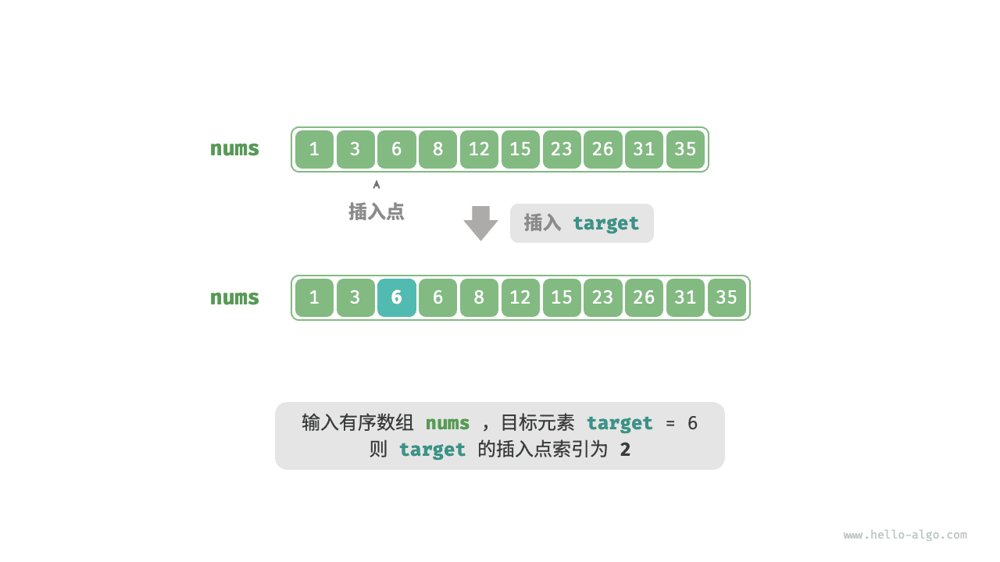

# 二分查找插入点｜无重复元素的情况

> 来源：[krahets 与《Hello 算法》开源贡献者](https://www.hello-algo.com/chapter_searching/binary_search_insertion/)  
> 许可：[CC BY-NC-SA 4.0](https://creativecommons.org/licenses/by-nc-sa/4.0/)  
> 语言：原生简体中文  
> 版本：69932aed1891a7b7f6a0de88cd116d3fe13e7032  
> 署名：原作《Hello 算法》，作者 krahets 及开源贡献者。  
> 使用限制：仅限实验室内部、个人学习与其他非商业用途；改编内容须保持相同许可。

## 无重复元素的情况

!!! question

    给定一个长度为 $n$ 的有序数组 `nums` 和一个元素 `target` ，数组不存在重复元素。现将 `target` 插入数组 `nums` 中，并保持其有序性。若数组中已存在元素 `target` ，则插入到其左方。请返回插入后 `target` 在数组中的索引。示例如下图所示。



如果想复用上一节的二分查找代码，则需要回答以下两个问题。

**问题一**：当数组中包含 `target` 时，插入点的索引是否是该元素的索引？

题目要求将 `target` 插入到相等元素的左边，这意味着新插入的 `target` 替换了原来 `target` 的位置。也就是说，**当数组包含 `target` 时，插入点的索引就是该 `target` 的索引**。

**问题二**：当数组中不存在 `target` 时，插入点是哪个元素的索引？

进一步思考二分查找过程：当 `nums[m] < target` 时 $i$ 移动，这意味着指针 $i$ 在向大于等于 `target` 的元素靠近。同理，指针 $j$ 始终在向小于等于 `target` 的元素靠近。

因此二分结束时一定有：$i$ 指向首个大于 `target` 的元素，$j$ 指向首个小于 `target` 的元素。**易得当数组不包含 `target` 时，插入索引为 $i$** 。代码如下所示：

```src
[file]{binary_search_insertion}-[class]{}-[func]{binary_search_insertion_simple}
```
