# 二叉树遍历｜前序、中序、后序遍历

> 来源：[krahets 与《Hello 算法》开源贡献者](https://www.hello-algo.com/chapter_tree/binary_tree_traversal/)  
> 许可：[CC BY-NC-SA 4.0](https://creativecommons.org/licenses/by-nc-sa/4.0/)  
> 语言：原生简体中文  
> 版本：69932aed1891a7b7f6a0de88cd116d3fe13e7032  
> 署名：原作《Hello 算法》，作者 krahets 及开源贡献者。  
> 使用限制：仅限实验室内部、个人学习与其他非商业用途；改编内容须保持相同许可。

## 前序、中序、后序遍历

相应地，前序、中序和后序遍历都属于<u>深度优先遍历（depth-first traversal）</u>，也称<u>深度优先搜索（depth-first search, DFS）</u>，它体现了一种“先走到尽头，再回溯继续”的遍历方式。

下图展示了对二叉树进行深度优先遍历的工作原理。**深度优先遍历就像是绕着整棵二叉树的外围“走”一圈**，在每个节点都会遇到三个位置，分别对应前序遍历、中序遍历和后序遍历。


### 代码实现

深度优先搜索通常基于递归实现：

```src
[file]{binary_tree_dfs}-[class]{}-[func]{post_order}
```

!!! tip

    深度优先搜索也可以基于迭代实现，有兴趣的读者可以自行研究。

下图展示了前序遍历二叉树的递归过程，其可分为“递”和“归”两个逆向的部分。

1. “递”表示开启新方法，程序在此过程中访问下一个节点。
2. “归”表示函数返回，代表当前节点已经访问完毕。

=== "<1>"
    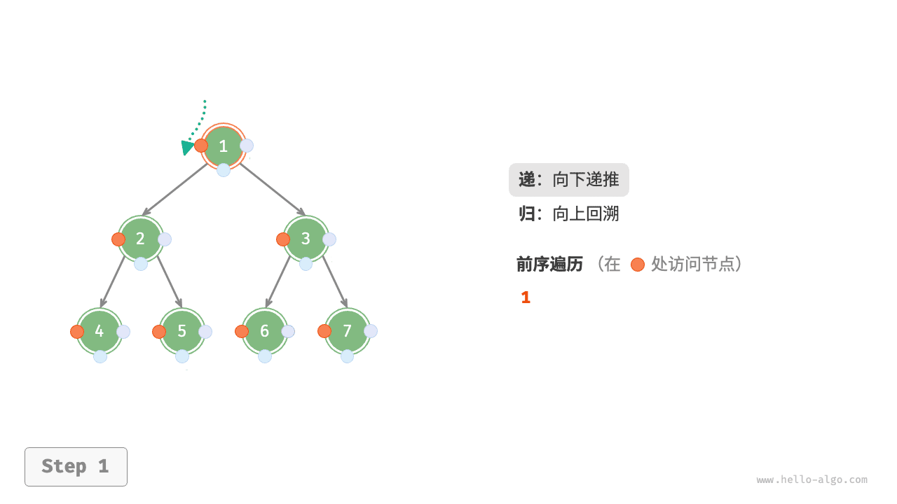

=== "<2>"
    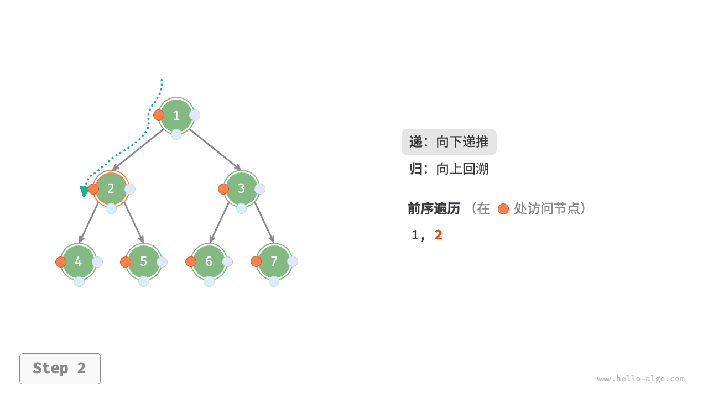

=== "<3>"
    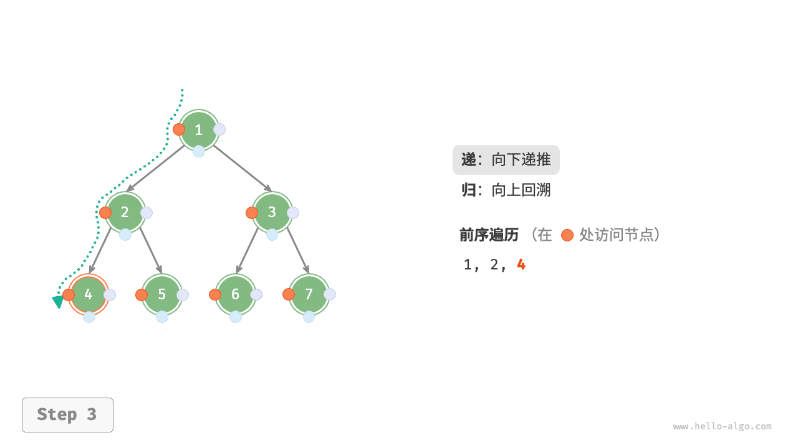

=== "<4>"
    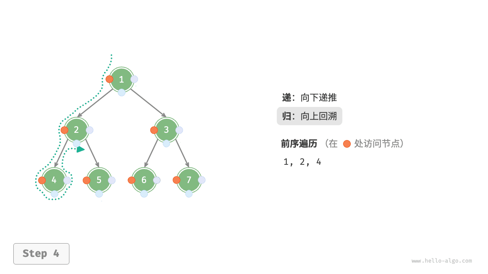

=== "<5>"
    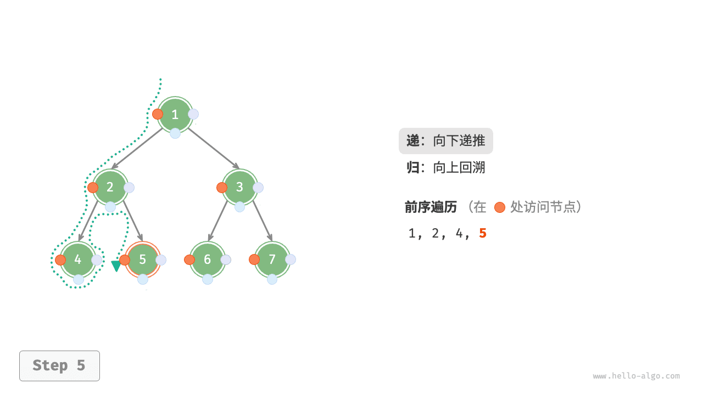

=== "<6>"
    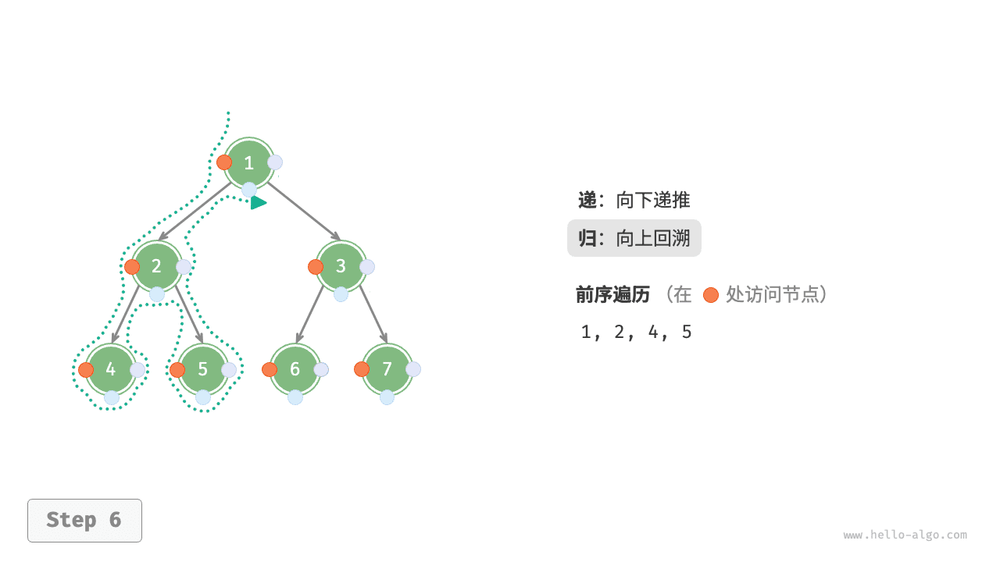

=== "<7>"
    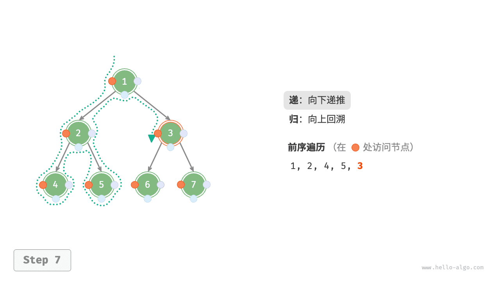

=== "<8>"
    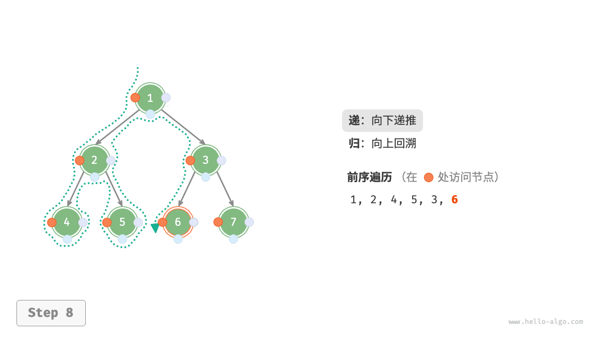

=== "<9>"
    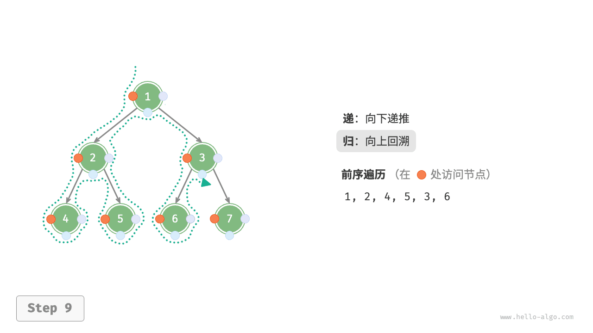

=== "<10>"
    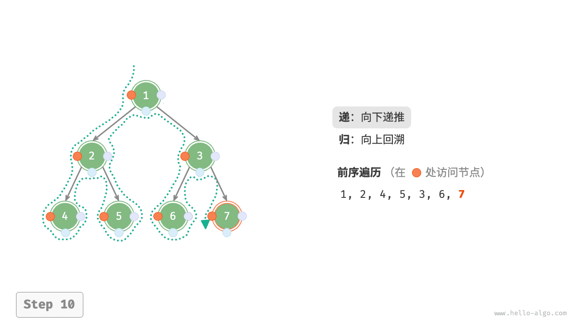

=== "<11>"
    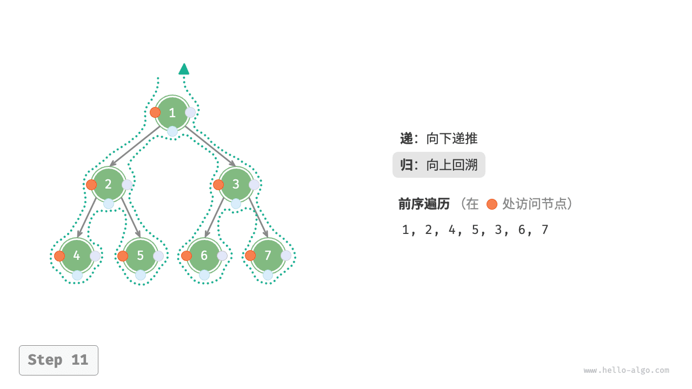

### 复杂度分析

- **时间复杂度为 $O(n)$** ：所有节点被访问一次，使用 $O(n)$ 时间。
- **空间复杂度为 $O(n)$** ：在最差情况下，即树退化为链表时，递归深度达到 $n$ ，系统占用 $O(n)$ 栈帧空间。
