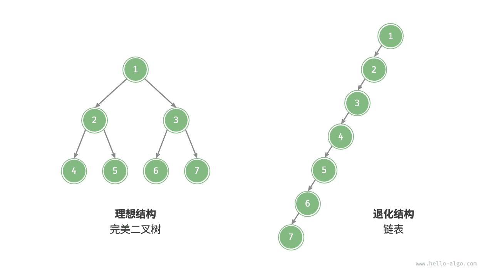

# 二叉树｜二叉树的退化

> 来源：[krahets 与《Hello 算法》开源贡献者](https://www.hello-algo.com/chapter_tree/binary_tree/)  
> 许可：[CC BY-NC-SA 4.0](https://creativecommons.org/licenses/by-nc-sa/4.0/)  
> 语言：原生简体中文  
> 版本：69932aed1891a7b7f6a0de88cd116d3fe13e7032  
> 署名：原作《Hello 算法》，作者 krahets 及开源贡献者。  
> 使用限制：仅限实验室内部、个人学习与其他非商业用途；改编内容须保持相同许可。

## 二叉树的退化

下图展示了二叉树的理想结构与退化结构。当二叉树的每层节点都被填满时，达到“完美二叉树”；而当所有节点都偏向一侧时，二叉树退化为“链表”。

- 完美二叉树是理想情况，可以充分发挥二叉树“分治”的优势。
- 链表则是另一个极端，各项操作都变为线性操作，时间复杂度退化至 $O(n)$ 。

如下表所示，在最佳结构和最差结构下，二叉树的叶节点数量、节点总数、高度等达到极大值或极小值。

 表 <id> &nbsp; 二叉树的最佳结构与最差结构 

|                             | 完美二叉树         | 链表    |
| --------------------------- | ------------------ | ------- |
| 第 $i$ 层的节点数量         | $2^{i-1}$          | $1$     |
| 高度为 $h$ 的树的叶节点数量 | $2^h$              | $1$     |
| 高度为 $h$ 的树的节点总数   | $2^{h+1} - 1$      | $h + 1$ |
| 节点总数为 $n$ 的树的高度   | $\log_2 (n+1) - 1$ | $n - 1$ |
