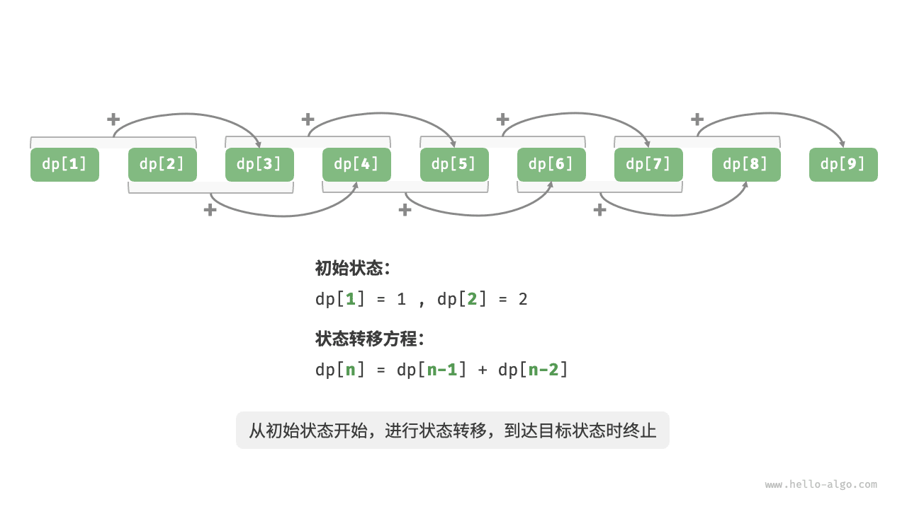

# 初探动态规划｜方法三：动态规划

> 来源：[krahets 与《Hello 算法》开源贡献者](https://www.hello-algo.com/chapter_dynamic_programming/intro_to_dynamic_programming/)  
> 许可：[CC BY-NC-SA 4.0](https://creativecommons.org/licenses/by-nc-sa/4.0/)  
> 语言：原生简体中文  
> 版本：69932aed1891a7b7f6a0de88cd116d3fe13e7032  
> 署名：原作《Hello 算法》，作者 krahets 及开源贡献者。  
> 使用限制：仅限实验室内部、个人学习与其他非商业用途；改编内容须保持相同许可。

## 方法三：动态规划

**记忆化搜索是一种“从顶至底”的方法**：我们从原问题（根节点）开始，递归地将较大子问题分解为较小子问题，直至解已知的最小子问题（叶节点）。之后，通过回溯逐层收集子问题的解，构建出原问题的解。

与之相反，**动态规划是一种“从底至顶”的方法**：从最小子问题的解开始，迭代地构建更大子问题的解，直至得到原问题的解。

由于动态规划不包含回溯过程，因此只需使用循环迭代实现，无须使用递归。在以下代码中，我们初始化一个数组 `dp` 来存储子问题的解，它起到了与记忆化搜索中数组 `mem` 相同的记录作用：

```src
[file]{climbing_stairs_dp}-[class]{}-[func]{climbing_stairs_dp}
```

下图模拟了以上代码的执行过程。



与回溯算法一样，动态规划也使用“状态”概念来表示问题求解的特定阶段，每个状态都对应一个子问题以及相应的局部最优解。例如，爬楼梯问题的状态定义为当前所在楼梯阶数 $i$ 。

根据以上内容，我们可以总结出动态规划的常用术语。

- 将数组 `dp` 称为 <u>dp 表</u>，$dp[i]$ 表示状态 $i$ 对应子问题的解。
- 将最小子问题对应的状态（第 $1$ 阶和第 $2$ 阶楼梯）称为<u>初始状态</u>。
- 将递推公式 $dp[i] = dp[i-1] + dp[i-2]$ 称为<u>状态转移方程</u>。
