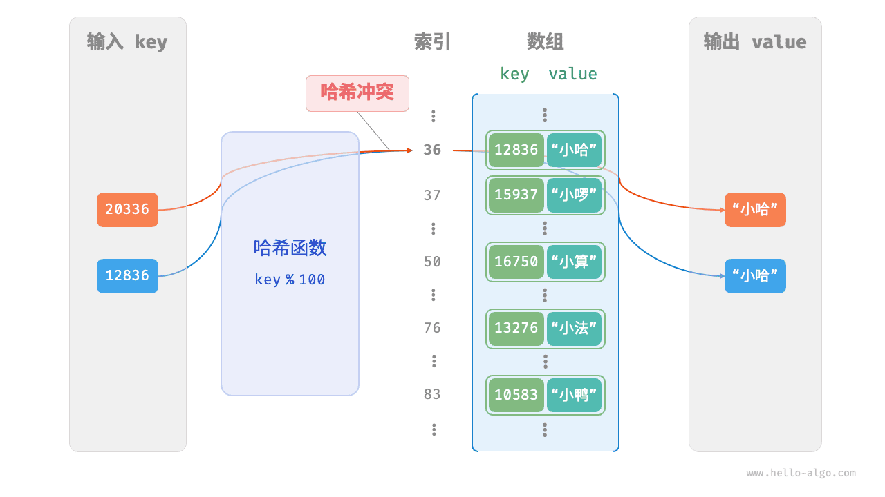
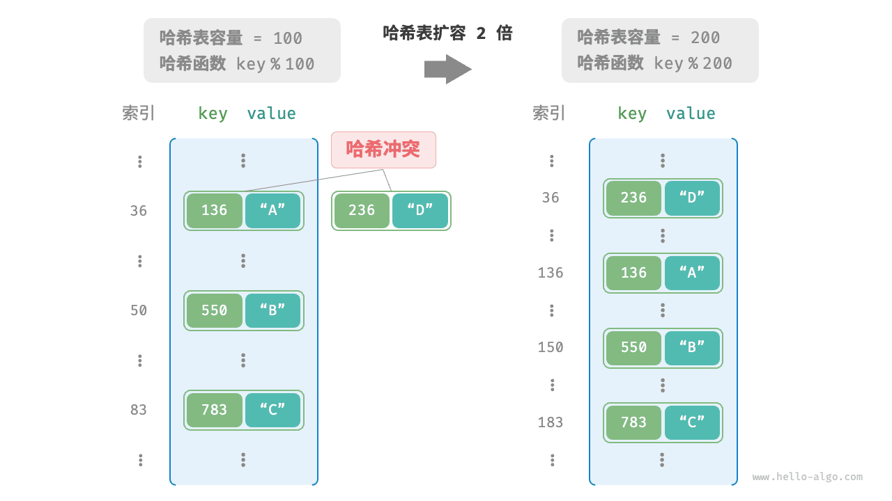

# 哈希表｜哈希冲突与扩容

> 来源：[krahets 与《Hello 算法》开源贡献者](https://www.hello-algo.com/chapter_hashing/hash_map/)  
> 许可：[CC BY-NC-SA 4.0](https://creativecommons.org/licenses/by-nc-sa/4.0/)  
> 语言：原生简体中文  
> 版本：69932aed1891a7b7f6a0de88cd116d3fe13e7032  
> 署名：原作《Hello 算法》，作者 krahets 及开源贡献者。  
> 使用限制：仅限实验室内部、个人学习与其他非商业用途；改编内容须保持相同许可。

## 哈希冲突与扩容

从本质上看，哈希函数的作用是将所有 `key` 构成的输入空间映射到数组所有索引构成的输出空间，而输入空间往往远大于输出空间。因此，**理论上一定存在“多个输入对应相同输出”的情况**。

对于上述示例中的哈希函数，当输入的 `key` 后两位相同时，哈希函数的输出结果也相同。例如，查询学号为 12836 和 20336 的两个学生时，我们得到：

```shell
12836 % 100 = 36
20336 % 100 = 36
```

如下图所示，两个学号指向了同一个姓名，这显然是不对的。我们将这种多个输入对应同一输出的情况称为<u>哈希冲突（hash collision）</u>。



容易想到，哈希表容量 $n$ 越大，多个 `key` 被分配到同一个桶中的概率就越低，冲突就越少。因此，**我们可以通过扩容哈希表来减少哈希冲突**。

如下图所示，扩容前键值对 `(136, A)` 和 `(236, D)` 发生冲突，扩容后冲突消失。



类似于数组扩容，哈希表扩容需将所有键值对从原哈希表迁移至新哈希表，非常耗时；并且由于哈希表容量 `capacity` 改变，我们需要通过哈希函数来重新计算所有键值对的存储位置，这进一步增加了扩容过程的计算开销。为此，编程语言通常会预留足够大的哈希表容量，防止频繁扩容。

<u>负载因子（load factor）</u>是哈希表的一个重要概念，其定义为哈希表的元素数量除以桶数量，用于衡量哈希冲突的严重程度，**也常作为哈希表扩容的触发条件**。例如在 Java 中，当负载因子超过 $0.75$ 时，系统会将哈希表扩容至原先的 $2$ 倍。
