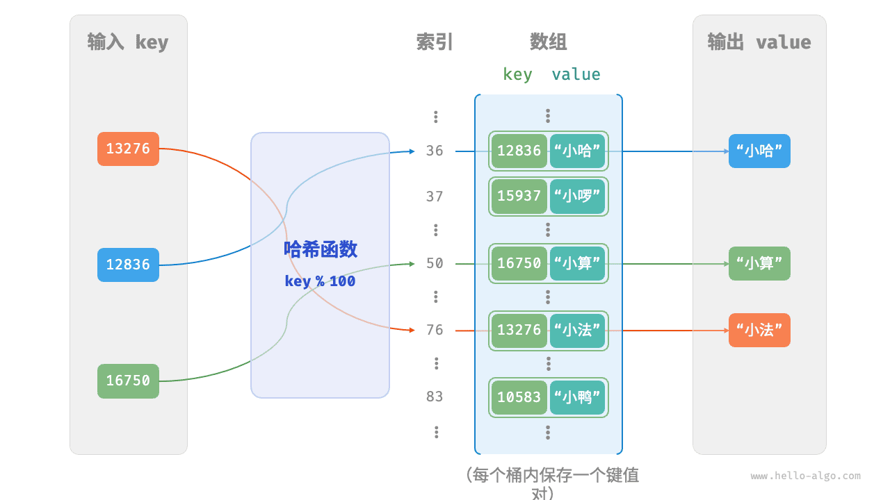

# 哈希表｜哈希表简单实现

> 来源：[krahets 与《Hello 算法》开源贡献者](https://www.hello-algo.com/chapter_hashing/hash_map/)  
> 许可：[CC BY-NC-SA 4.0](https://creativecommons.org/licenses/by-nc-sa/4.0/)  
> 语言：原生简体中文  
> 版本：69932aed1891a7b7f6a0de88cd116d3fe13e7032  
> 署名：原作《Hello 算法》，作者 krahets 及开源贡献者。  
> 使用限制：仅限实验室内部、个人学习与其他非商业用途；改编内容须保持相同许可。

## 哈希表简单实现

我们先考虑最简单的情况，**仅用一个数组来实现哈希表**。在哈希表中，我们将数组中的每个空位称为<u>桶（bucket）</u>，每个桶可存储一个键值对。因此，查询操作就是找到 `key` 对应的桶，并在桶中获取 `value` 。

那么，如何基于 `key` 定位对应的桶呢？这是通过<u>哈希函数（hash function）</u>实现的。哈希函数的作用是将一个较大的输入空间映射到一个较小的输出空间。在哈希表中，输入空间是所有 `key` ，输出空间是所有桶（数组索引）。换句话说，输入一个 `key` ，**我们可以通过哈希函数得到该 `key` 对应的键值对在数组中的存储位置**。

输入一个 `key` ，哈希函数的计算过程分为以下两步。

1. 通过某种哈希算法 `hash()` 计算得到哈希值。
2. 将哈希值对桶数量（数组长度）`capacity` 取模，从而获取该 `key` 对应的桶（数组索引）`index` 。

```shell
index = hash(key) % capacity
```

随后，我们就可以利用 `index` 在哈希表中访问对应的桶，从而获取 `value` 。

设数组长度 `capacity = 100`、哈希算法 `hash(key) = key` ，易得哈希函数为 `key % 100` 。下图以 `key` 学号和 `value` 姓名为例，展示了哈希函数的工作原理。



以下代码实现了一个简单哈希表。其中，我们将 `key` 和 `value` 封装成一个类 `Pair` ，以表示键值对。

```src
[file]{array_hash_map}-[class]{array_hash_map}-[func]{}
```
