# 回溯算法｜尝试与回退

> 来源：[krahets 与《Hello 算法》开源贡献者](https://www.hello-algo.com/chapter_backtracking/backtracking_algorithm/)  
> 许可：[CC BY-NC-SA 4.0](https://creativecommons.org/licenses/by-nc-sa/4.0/)  
> 语言：原生简体中文  
> 版本：69932aed1891a7b7f6a0de88cd116d3fe13e7032  
> 署名：原作《Hello 算法》，作者 krahets 及开源贡献者。  
> 使用限制：仅限实验室内部、个人学习与其他非商业用途；改编内容须保持相同许可。

## 尝试与回退

**之所以称之为回溯算法，是因为该算法在搜索解空间时会采用“尝试”与“回退”的策略**。当算法在搜索过程中遇到某个状态无法继续前进或无法得到满足条件的解时，它会撤销上一步的选择，退回到之前的状态，并尝试其他可能的选择。

对于例题一，访问每个节点都代表一次“尝试”，而越过叶节点或返回父节点的 `return` 则表示“回退”。

值得说明的是，**回退并不仅仅包括函数返回**。为解释这一点，我们对例题一稍作拓展。

!!! question "例题二"

    在二叉树中搜索所有值为 $7$ 的节点，**请返回根节点到这些节点的路径**。

在例题一代码的基础上，我们需要借助一个列表 `path` 记录访问过的节点路径。当访问到值为 $7$ 的节点时，则复制 `path` 并添加进结果列表 `res` 。遍历完成后，`res` 中保存的就是所有的解。代码如下所示：

```src
[file]{preorder_traversal_ii_compact}-[class]{}-[func]{pre_order}
```

在每次“尝试”中，我们通过将当前节点添加进 `path` 来记录路径；而在“回退”前，我们需要将该节点从 `path` 中弹出，**以恢复本次尝试之前的状态**。

观察下图所示的过程，**我们可以将尝试和回退理解为“前进”与“撤销”**，两个操作互为逆向。

=== "<1>"
    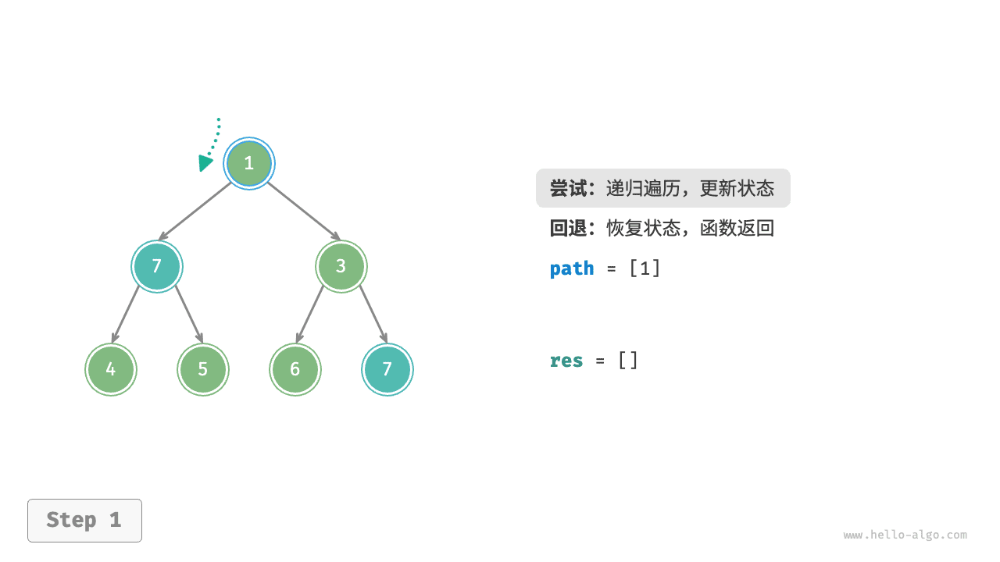

=== "<2>"
    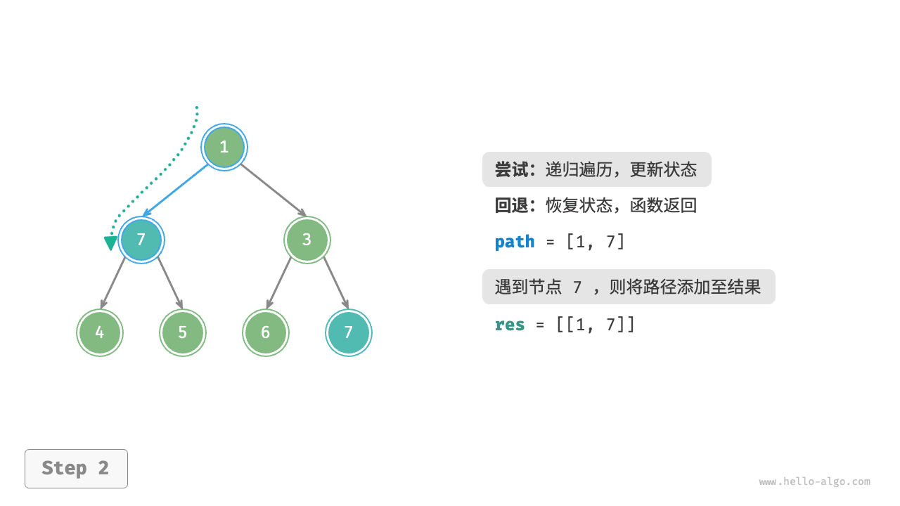

=== "<3>"
    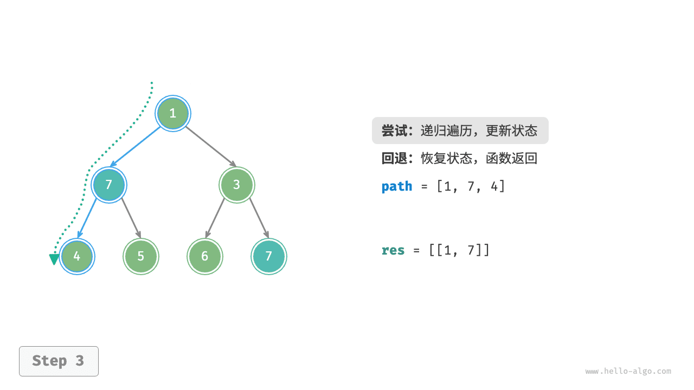

=== "<4>"
    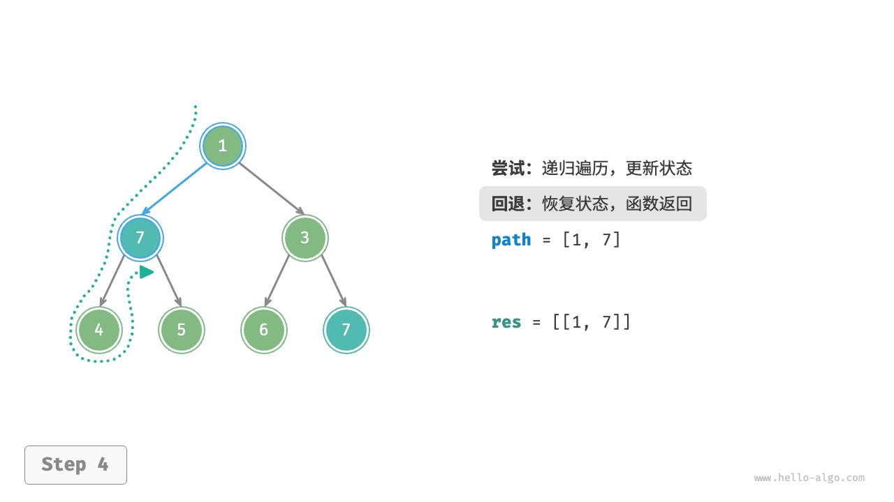

=== "<5>"
    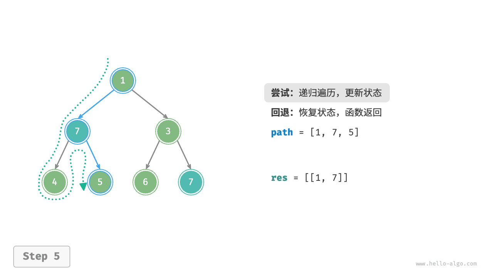

=== "<6>"
    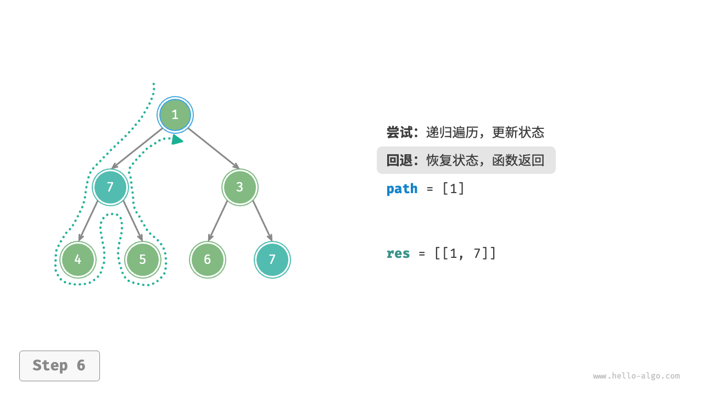

=== "<7>"
    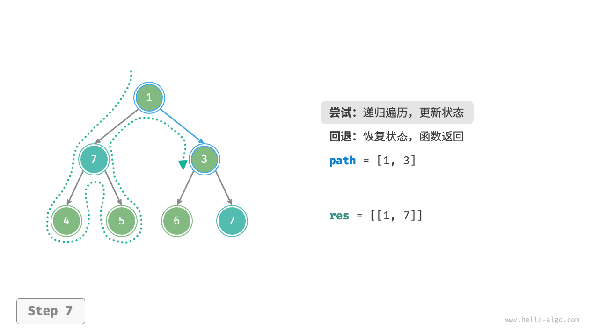

=== "<8>"
    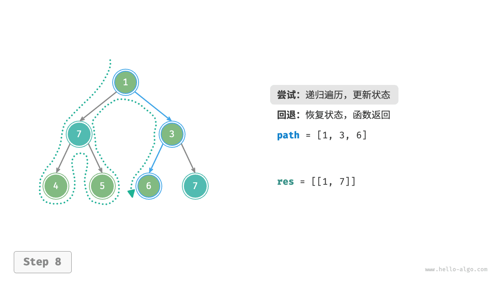

=== "<9>"
    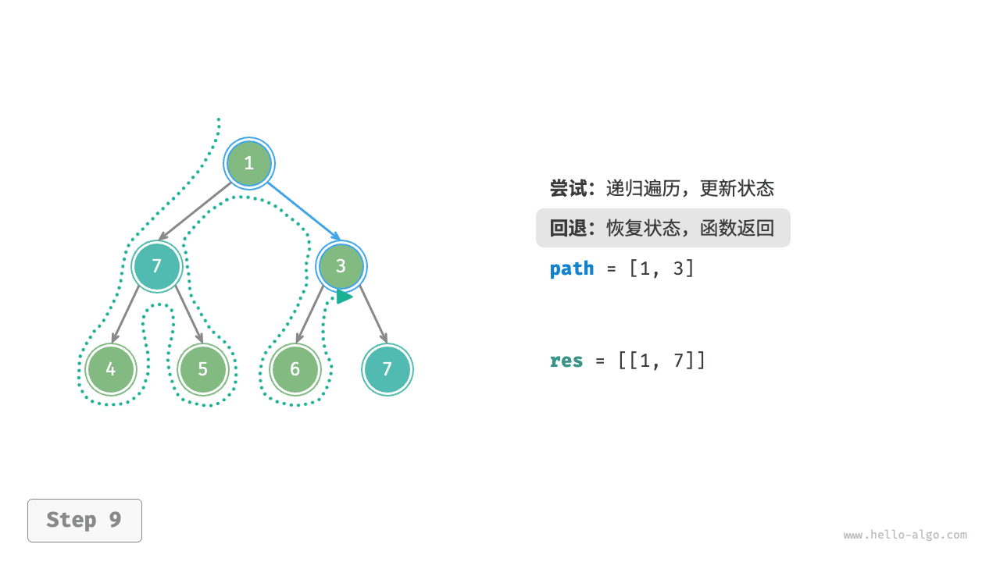

=== "<10>"
    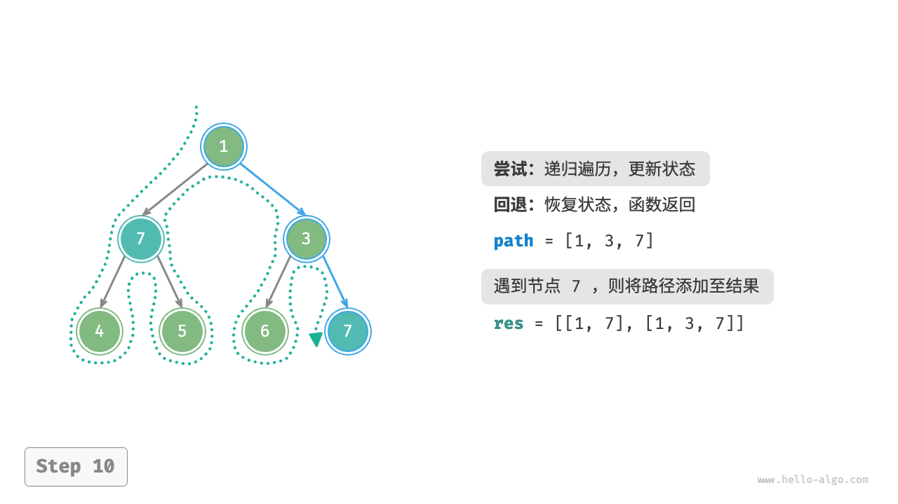

=== "<11>"
    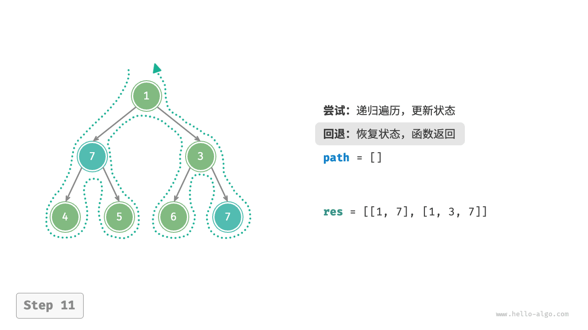
