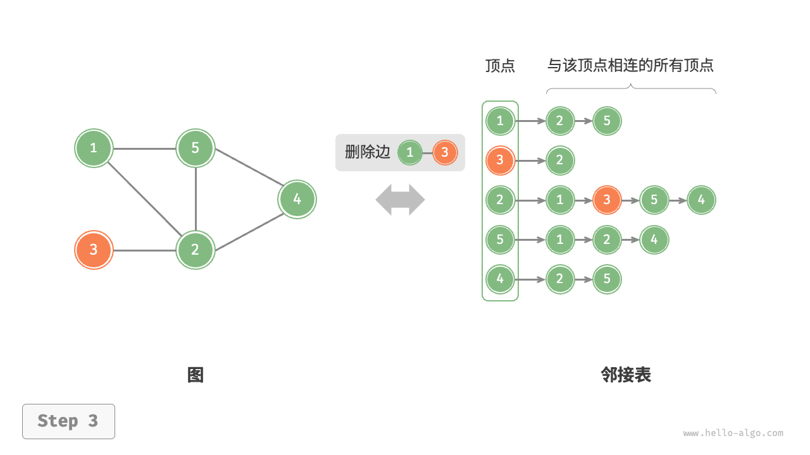
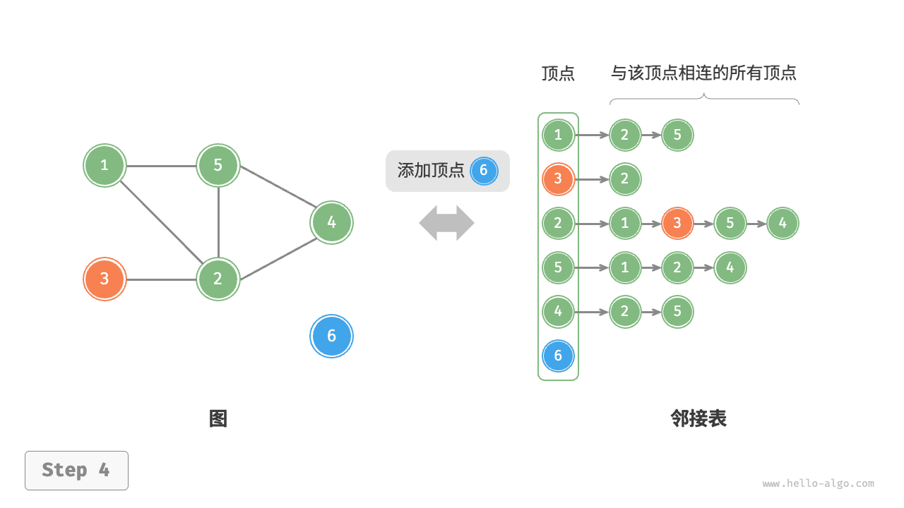

# 图的基础操作｜基于邻接表的实现

> 来源：[krahets 与《Hello 算法》开源贡献者](https://www.hello-algo.com/chapter_graph/graph_operations/)  
> 许可：[CC BY-NC-SA 4.0](https://creativecommons.org/licenses/by-nc-sa/4.0/)  
> 语言：原生简体中文  
> 版本：69932aed1891a7b7f6a0de88cd116d3fe13e7032  
> 署名：原作《Hello 算法》，作者 krahets 及开源贡献者。  
> 使用限制：仅限实验室内部、个人学习与其他非商业用途；改编内容须保持相同许可。

## 基于邻接表的实现

设无向图的顶点总数为 $n$、边总数为 $m$ ，则可根据下图所示的方法实现各种操作。

- **添加边**：在顶点对应链表的末尾添加边即可，使用 $O(1)$ 时间。因为是无向图，所以需要同时添加两个方向的边。
- **删除边**：在顶点对应链表中查找并删除指定边，使用 $O(m)$ 时间。在无向图中，需要同时删除两个方向的边。
- **添加顶点**：在邻接表中添加一个链表，并将新增顶点作为链表头节点，使用 $O(1)$ 时间。
- **删除顶点**：需遍历整个邻接表，删除包含指定顶点的所有边，使用 $O(n + m)$ 时间。
- **初始化**：在邻接表中创建 $n$ 个顶点和 $2m$ 条边，使用 $O(n + m)$ 时间。

=== "<1>"
    

=== "<2>"
    

=== "<3>"
    

=== "<4>"
    

=== "<5>"
    

以下是邻接表的代码实现。对比上图，实际代码有以下不同。

- 为了方便添加与删除顶点，以及简化代码，我们使用列表（动态数组）来代替链表。
- 使用哈希表来存储邻接表，`key` 为顶点实例，`value` 为该顶点的邻接顶点列表（链表）。

另外，我们在邻接表中使用 `Vertex` 类来表示顶点，这样做的原因是：如果与邻接矩阵一样，用列表索引来区分不同顶点，那么假设要删除索引为 $i$ 的顶点，则需遍历整个邻接表，将所有大于 $i$ 的索引全部减 $1$ ，效率很低。而如果每个顶点都是唯一的 `Vertex` 实例，删除某一顶点之后就无须改动其他顶点了。

```src
[file]{graph_adjacency_list}-[class]{graph_adj_list}-[func]{}
```
