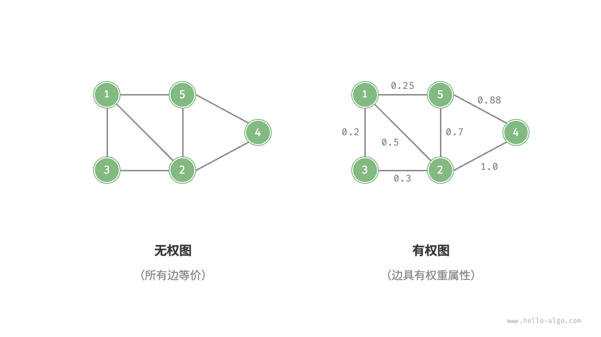

# 图｜图的常见类型与术语

> 来源：[krahets 与《Hello 算法》开源贡献者](https://www.hello-algo.com/chapter_graph/graph/)  
> 许可：[CC BY-NC-SA 4.0](https://creativecommons.org/licenses/by-nc-sa/4.0/)  
> 语言：原生简体中文  
> 版本：69932aed1891a7b7f6a0de88cd116d3fe13e7032  
> 署名：原作《Hello 算法》，作者 krahets 及开源贡献者。  
> 使用限制：仅限实验室内部、个人学习与其他非商业用途；改编内容须保持相同许可。

## 图的常见类型与术语

根据边是否具有方向，可分为<u>无向图（undirected graph）</u>和<u>有向图（directed graph）</u>，如下图所示。

- 在无向图中，边表示两顶点之间的“双向”连接关系，例如微信或 QQ 中的“好友关系”。
- 在有向图中，边具有方向性，即 $A \rightarrow B$ 和 $A \leftarrow B$ 两个方向的边是相互独立的，例如微博或抖音上的“关注”与“被关注”关系。

根据所有顶点是否连通，可分为<u>连通图（connected graph）</u>和<u>非连通图（disconnected graph）</u>，如下图所示。

- 对于连通图，从某个顶点出发，可以到达其余任意顶点。
- 对于非连通图，从某个顶点出发，至少有一个顶点无法到达。

我们还可以为边添加“权重”变量，从而得到如下图所示的<u>有权图（weighted graph）</u>。例如在《王者荣耀》等手游中，系统会根据共同游戏时间来计算玩家之间的“亲密度”，这种亲密度网络就可以用有权图来表示。

图数据结构包含以下常用术语。

- <u>邻接（adjacency）</u>：当两顶点之间存在边相连时，称这两顶点“邻接”。在上图中，顶点 1 的邻接顶点为顶点 2、3、5。
- <u>路径（path）</u>：从顶点 A 到顶点 B 经过的边构成的序列被称为从 A 到 B 的“路径”。在上图中，边序列 1-5-2-4 是顶点 1 到顶点 4 的一条路径。
- <u>度（degree）</u>：一个顶点拥有的边数。对于有向图，<u>入度（in-degree）</u>表示有多少条边指向该顶点，<u>出度（out-degree）</u>表示有多少条边从该顶点指出。
