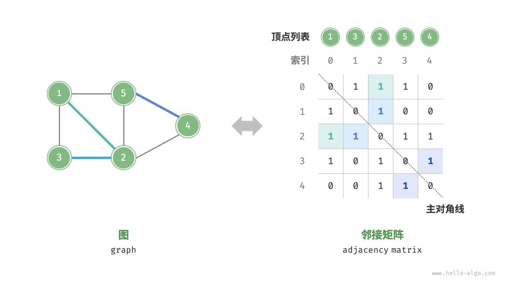
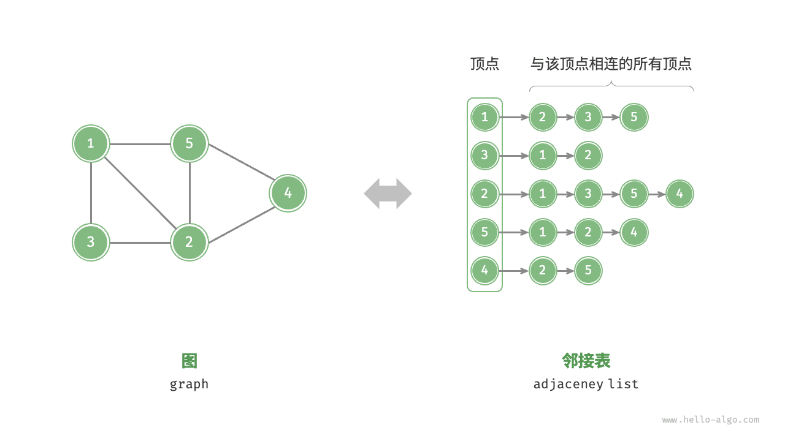

# 图｜图的表示

> 来源：[krahets 与《Hello 算法》开源贡献者](https://www.hello-algo.com/chapter_graph/graph/)  
> 许可：[CC BY-NC-SA 4.0](https://creativecommons.org/licenses/by-nc-sa/4.0/)  
> 语言：原生简体中文  
> 版本：69932aed1891a7b7f6a0de88cd116d3fe13e7032  
> 署名：原作《Hello 算法》，作者 krahets 及开源贡献者。  
> 使用限制：仅限实验室内部、个人学习与其他非商业用途；改编内容须保持相同许可。

## 图的表示

图的常用表示方式包括“邻接矩阵”和“邻接表”。以下使用无向图进行举例。

### 邻接矩阵

设图的顶点数量为 $n$ ，<u>邻接矩阵（adjacency matrix）</u>使用一个 $n \times n$ 大小的矩阵来表示图，每一行（列）代表一个顶点，矩阵元素代表边，用 $1$ 或 $0$ 表示两个顶点之间是否存在边。

如下图所示，设邻接矩阵为 $M$、顶点列表为 $V$ ，那么矩阵元素 $M[i, j] = 1$ 表示顶点 $V[i]$ 到顶点 $V[j]$ 之间存在边，反之 $M[i, j] = 0$ 表示两顶点之间无边。

邻接矩阵具有以下特性。

- 在简单图中，顶点不能与自身相连，此时邻接矩阵主对角线元素没有意义。
- 对于无向图，两个方向的边等价，此时邻接矩阵关于主对角线对称。
- 将邻接矩阵的元素从 $1$ 和 $0$ 替换为权重，则可表示有权图。

使用邻接矩阵表示图时，我们可以直接访问矩阵元素以获取边，因此增删查改操作的效率很高，时间复杂度均为 $O(1)$ 。然而，矩阵的空间复杂度为 $O(n^2)$ ，内存占用较多。

### 邻接表

<u>邻接表（adjacency list）</u>使用 $n$ 个链表来表示图，链表节点表示顶点。第 $i$ 个链表对应顶点 $i$ ，其中存储了该顶点的所有邻接顶点（与该顶点相连的顶点）。下图展示了一个使用邻接表存储的图的示例。

邻接表仅存储实际存在的边，而边的总数通常远小于 $n^2$ ，因此它更加节省空间。然而，在邻接表中需要通过遍历链表来查找边，因此其时间效率不如邻接矩阵。

观察上图，**邻接表结构与哈希表中的“链式地址”非常相似，因此我们也可以采用类似的方法来优化效率**。比如当链表较长时，可以将链表转化为 AVL 树或红黑树，从而将时间效率从 $O(n)$ 优化至 $O(\log n)$ ；还可以把链表转换为哈希表，从而将时间复杂度降至 $O(1)$ 。
