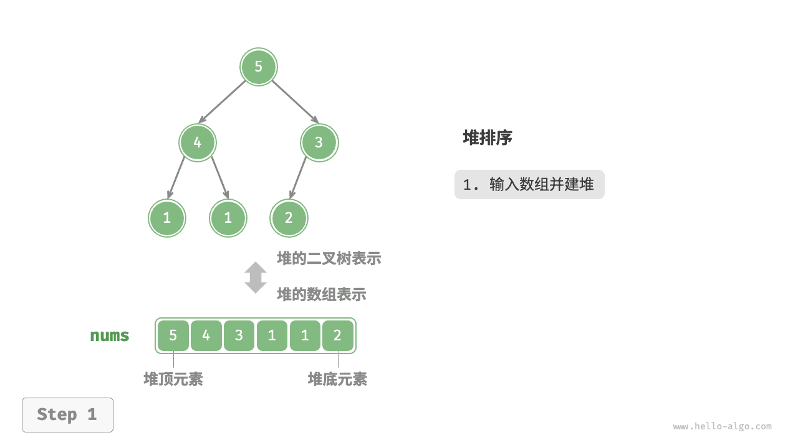
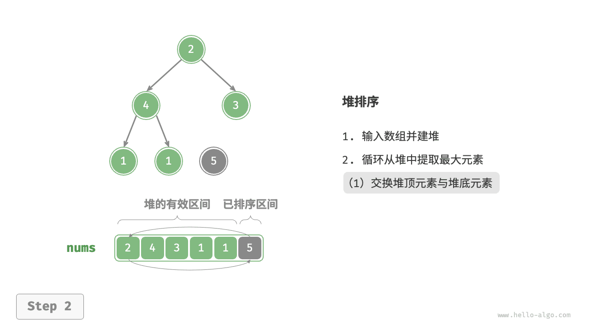
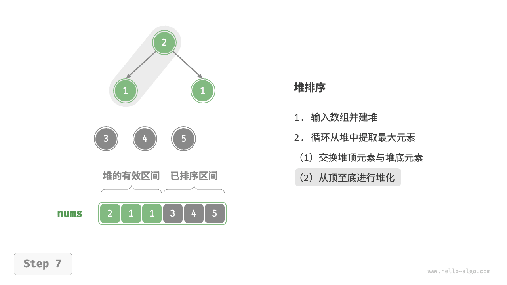

# 堆排序｜算法流程

> 来源：[krahets 与《Hello 算法》开源贡献者](https://www.hello-algo.com/chapter_sorting/heap_sort/)  
> 许可：[CC BY-NC-SA 4.0](https://creativecommons.org/licenses/by-nc-sa/4.0/)  
> 语言：原生简体中文  
> 版本：69932aed1891a7b7f6a0de88cd116d3fe13e7032  
> 署名：原作《Hello 算法》，作者 krahets 及开源贡献者。  
> 使用限制：仅限实验室内部、个人学习与其他非商业用途；改编内容须保持相同许可。

## 算法流程

设数组的长度为 $n$ ，堆排序的流程如下图所示。

1. 输入数组并建立大顶堆。完成后，最大元素位于堆顶。
2. 将堆顶元素（第一个元素）与堆底元素（最后一个元素）交换。完成交换后，堆的长度减 $1$ ，已排序元素数量加 $1$ 。
3. 从堆顶元素开始，从顶到底执行堆化操作（sift down）。完成堆化后，堆的性质得到修复。
4. 循环执行第 `2.` 步和第 `3.` 步。循环 $n - 1$ 轮后，即可完成数组排序。

!!! tip

    实际上，元素出堆操作中也包含第 `2.` 步和第 `3.` 步，只是多了一个弹出元素的步骤。

=== "<1>"
    

=== "<2>"
    

=== "<3>"
    

=== "<4>"
    

=== "<5>"
    

=== "<6>"
    

=== "<7>"
    

=== "<8>"
    

=== "<9>"
    

=== "<10>"
    

=== "<11>"
    

=== "<12>"
    

在代码实现中，我们使用了与“堆”章节相同的从顶至底堆化 `sift_down()` 函数。值得注意的是，由于堆的长度会随着提取最大元素而减小，因此我们需要给 `sift_down()` 函数添加一个长度参数 $n$ ，用于指定堆的当前有效长度。代码如下所示：

```src
[file]{heap_sort}-[class]{}-[func]{heap_sort}
```
