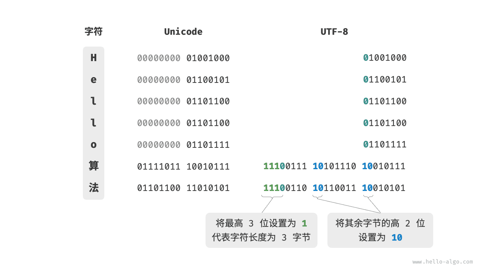

# 字符编码｜UTF-8 编码

> 来源：[krahets 与《Hello 算法》开源贡献者](https://www.hello-algo.com/chapter_data_structure/character_encoding/)  
> 许可：[CC BY-NC-SA 4.0](https://creativecommons.org/licenses/by-nc-sa/4.0/)  
> 语言：原生简体中文  
> 版本：69932aed1891a7b7f6a0de88cd116d3fe13e7032  
> 署名：原作《Hello 算法》，作者 krahets 及开源贡献者。  
> 使用限制：仅限实验室内部、个人学习与其他非商业用途；改编内容须保持相同许可。

## UTF-8 编码

目前，UTF-8 已成为国际上使用最广泛的 Unicode 编码方法。**它是一种可变长度的编码**，使用 1 到 4 字节来表示一个字符，根据字符的复杂性而变。ASCII 字符只需 1 字节，拉丁字母和希腊字母需要 2 字节，常用的中文字符需要 3 字节，其他的一些生僻字符需要 4 字节。

UTF-8 的编码规则并不复杂，分为以下两种情况。

- 对于长度为 1 字节的字符，将最高位设置为 $0$ ，其余 7 位设置为 Unicode 码点。值得注意的是，ASCII 字符在 Unicode 字符集中占据了前 128 个码点。也就是说，**UTF-8 编码可以向下兼容 ASCII 码**。这意味着我们可以使用 UTF-8 来解析年代久远的 ASCII 码文本。
- 对于长度为 $n$ 字节的字符（其中 $n > 1$），将首个字节的高 $n$ 位都设置为 $1$ ，第 $n + 1$ 位设置为 $0$ ；从第二个字节开始，将每个字节的高 2 位都设置为 $10$ ；其余所有位用于填充字符的 Unicode 码点。

下图展示了“Hello算法”对应的 UTF-8 编码。观察发现，由于最高 $n$ 位都设置为 $1$ ，因此系统可以通过读取最高位 $1$ 的个数来解析出字符的长度为 $n$ 。

但为什么要将其余所有字节的高 2 位都设置为 $10$ 呢？实际上，这个 $10$ 能够起到校验符的作用。假设系统从一个错误的字节开始解析文本，字节头部的 $10$ 能够帮助系统快速判断出异常。

之所以将 $10$ 当作校验符，是因为在 UTF-8 编码规则下，不可能有字符的最高两位是 $10$ 。这个结论可以用反证法来证明：假设一个字符的最高两位是 $10$ ，说明该字符的长度为 $1$ ，对应 ASCII 码。而 ASCII 码的最高位应该是 $0$ ，与假设矛盾。

除了 UTF-8 之外，常见的编码方式还包括以下两种。

- **UTF-16 编码**：使用 2 或 4 字节来表示一个字符。所有的 ASCII 字符和常用的非英文字符，都用 2 字节表示；少数字符需要用到 4 字节表示。对于 2 字节的字符，UTF-16 编码与 Unicode 码点相等。
- **UTF-32 编码**：每个字符都使用 4 字节。这意味着 UTF-32 比 UTF-8 和 UTF-16 更占用空间，特别是对于 ASCII 字符占比较高的文本。

从存储空间占用的角度看，使用 UTF-8 表示英文字符非常高效，因为它仅需 1 字节；使用 UTF-16 编码某些非英文字符（例如中文）会更加高效，因为它仅需 2 字节，而 UTF-8 可能需要 3 字节。

从兼容性的角度看，UTF-8 的通用性最佳，许多工具和库优先支持 UTF-8 。
