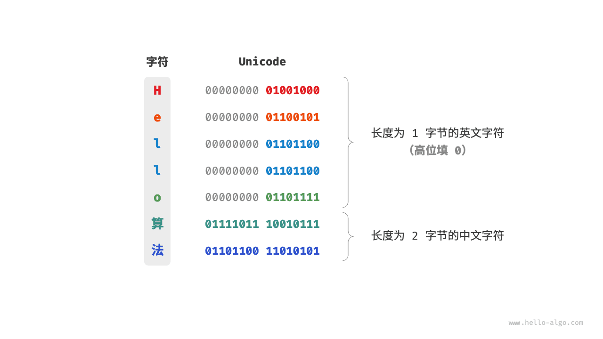

# 字符编码｜Unicode 字符集

> 来源：[krahets 与《Hello 算法》开源贡献者](https://www.hello-algo.com/chapter_data_structure/character_encoding/)  
> 许可：[CC BY-NC-SA 4.0](https://creativecommons.org/licenses/by-nc-sa/4.0/)  
> 语言：原生简体中文  
> 版本：69932aed1891a7b7f6a0de88cd116d3fe13e7032  
> 署名：原作《Hello 算法》，作者 krahets 及开源贡献者。  
> 使用限制：仅限实验室内部、个人学习与其他非商业用途；改编内容须保持相同许可。

## Unicode 字符集

随着计算机技术的蓬勃发展，字符集与编码标准百花齐放，而这带来了许多问题。一方面，这些字符集一般只定义了特定语言的字符，无法在多语言环境下正常工作。另一方面，同一种语言存在多种字符集标准，如果两台计算机使用的是不同的编码标准，则在信息传递时就会出现乱码。

那个时代的研究人员就在想：**如果推出一个足够完整的字符集，将世界范围内的所有语言和符号都收录其中，不就可以解决跨语言环境和乱码问题了吗**？在这种想法的驱动下，一个大而全的字符集 Unicode 应运而生。

<u>Unicode</u> 的中文名称为“统一码”，理论上能容纳 100 多万个字符。它致力于将全球范围内的字符纳入统一的字符集之中，提供一种通用的字符集来处理和显示各种语言文字，减少因为编码标准不同而产生的乱码问题。自 1991 年发布以来，Unicode 不断扩充新的语言与字符。截至 2022 年 9 月，Unicode 已经包含 149186 个字符，包括各种语言的字符、符号甚至表情符号等。

Unicode 作为一种通用字符集，本质上是给每个字符分配唯一的“码点”（字符编号），其取值范围为 U+0000 至 U+10FFFF，构成了统一的字符编号空间。然而，**Unicode 并没有规定在计算机中如何存储这些字符码点**。我们不禁会问：当多种长度的 Unicode 码点同时出现在一个文本中时，系统如何解析字符？例如给定一个长度为 2 字节的编码，系统如何确认它是一个 2 字节的字符还是两个 1 字节的字符？

对于以上问题，**一种直接的解决方案是将所有字符存储为等长的编码**。如下图所示，“Hello”中的每个字符占用 1 字节，“算法”中的每个字符占用 2 字节。我们可以通过高位填 0 将“Hello 算法”中的所有字符都编码为 2 字节长度。这样系统就可以每隔 2 字节解析一个字符，恢复这个短语的内容了。

然而 ASCII 码已经向我们证明，编码英文只需 1 字节。若采用上述方案，英文文本占用空间的大小将会是 ASCII 编码下的两倍，非常浪费内存空间。因此，我们需要一种更加高效的 Unicode 编码方法。
