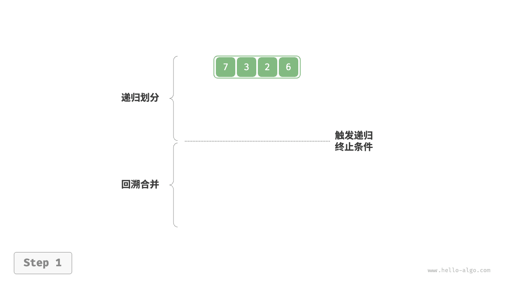
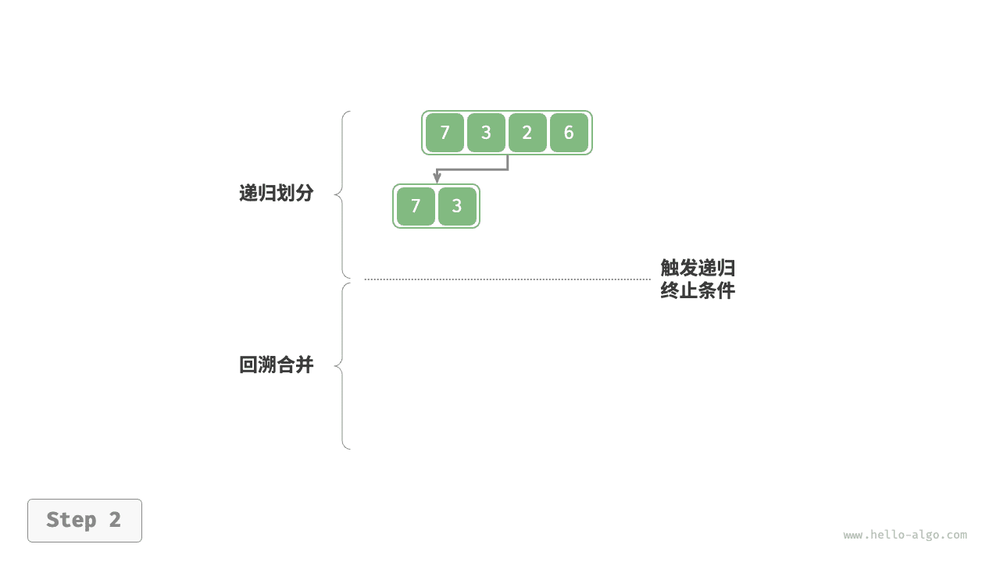
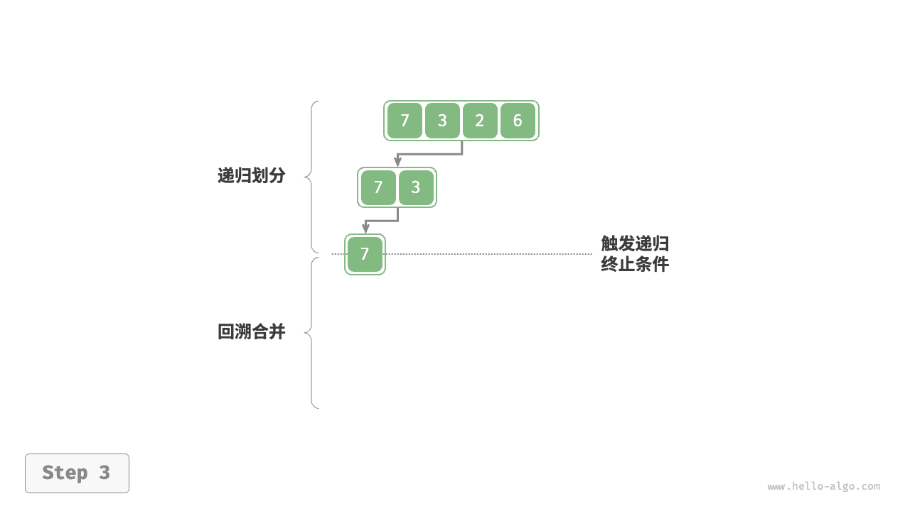
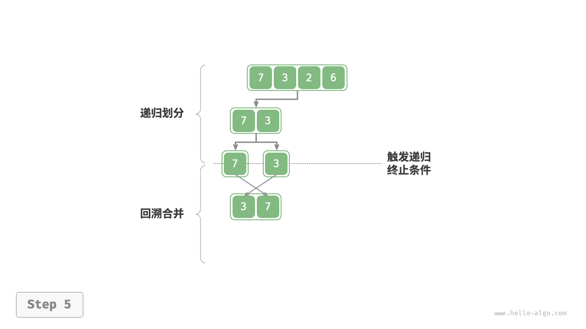
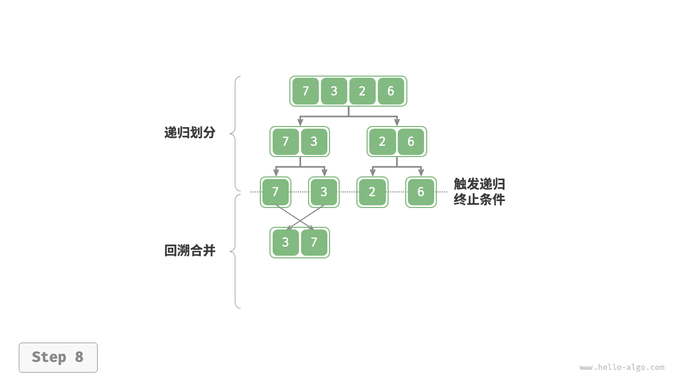
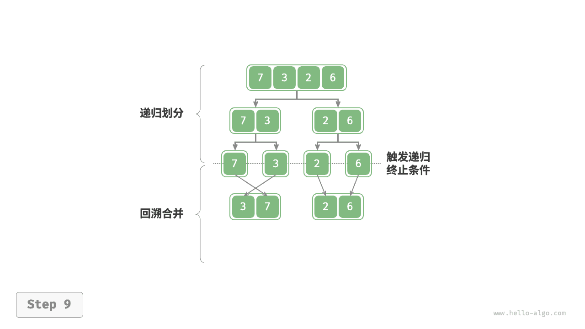

# 归并排序｜算法流程

> 来源：[krahets 与《Hello 算法》开源贡献者](https://www.hello-algo.com/chapter_sorting/merge_sort/)  
> 许可：[CC BY-NC-SA 4.0](https://creativecommons.org/licenses/by-nc-sa/4.0/)  
> 语言：原生简体中文  
> 版本：69932aed1891a7b7f6a0de88cd116d3fe13e7032  
> 署名：原作《Hello 算法》，作者 krahets 及开源贡献者。  
> 使用限制：仅限实验室内部、个人学习与其他非商业用途；改编内容须保持相同许可。

## 算法流程

如下图所示，“划分阶段”从顶至底递归地将数组从中点切分为两个子数组。

1. 计算数组中点 `mid` ，递归划分左子数组（区间 `[left, mid]` ）和右子数组（区间 `[mid + 1, right]` ）。
2. 递归执行步骤 `1.` ，直至子数组区间长度为 1 时终止。

“合并阶段”从底至顶地将左子数组和右子数组合并为一个有序数组。需要注意的是，从长度为 1 的子数组开始合并，合并阶段中的每个子数组都是有序的。

=== "<1>"
    

=== "<2>"
    

=== "<3>"
    

=== "<4>"
    

=== "<5>"
    

=== "<6>"
    

=== "<7>"
    

=== "<8>"
    

=== "<9>"
    

=== "<10>"
    

观察发现，归并排序与二叉树后序遍历的递归顺序是一致的。

- **后序遍历**：先递归左子树，再递归右子树，最后处理根节点。
- **归并排序**：先递归左子数组，再递归右子数组，最后处理合并。

归并排序的实现如以下代码所示。请注意，`nums` 的待合并区间为 `[left, right]` ，而 `tmp` 的对应区间为 `[0, right - left]` 。

```src
[file]{merge_sort}-[class]{}-[func]{merge_sort}
```
