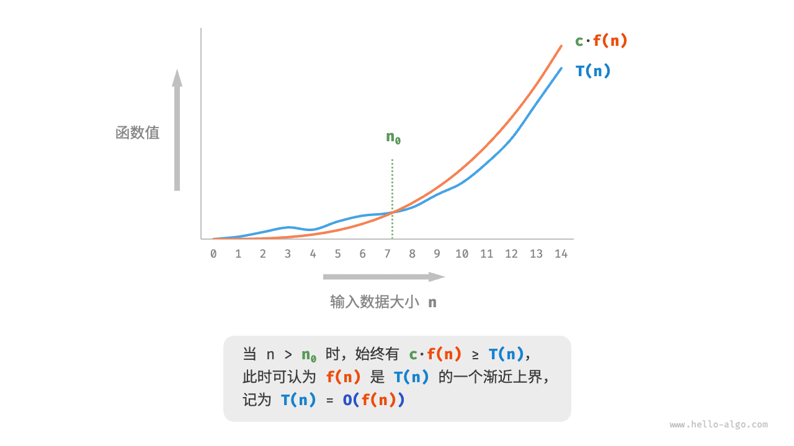

# 时间复杂度｜函数渐近上界

> 来源：[krahets 与《Hello 算法》开源贡献者](https://www.hello-algo.com/chapter_computational_complexity/time_complexity/)  
> 许可：[CC BY-NC-SA 4.0](https://creativecommons.org/licenses/by-nc-sa/4.0/)  
> 语言：原生简体中文  
> 版本：69932aed1891a7b7f6a0de88cd116d3fe13e7032  
> 署名：原作《Hello 算法》，作者 krahets 及开源贡献者。  
> 使用限制：仅限实验室内部、个人学习与其他非商业用途；改编内容须保持相同许可。

## 函数渐近上界

给定一个输入大小为 $n$ 的函数：

=== "Python"

    ```python title=""
    def algorithm(n: int):
        a = 1      # +1
        a = a + 1  # +1
        a = a * 2  # +1
        # 循环 n 次
        for i in range(n):  # +1
            print(0)        # +1
    ```

=== "C++"

    ```cpp title=""
    void algorithm(int n) {
        int a = 1;  // +1
        a = a + 1;  // +1
        a = a * 2;  // +1
        // 循环 n 次
        for (int i = 0; i < n; i++) { // +1（每轮都执行 i ++）
            cout << 0 << endl;    // +1
        }
    }
    ```

=== "Java"

    ```java title=""
    void algorithm(int n) {
        int a = 1;  // +1
        a = a + 1;  // +1
        a = a * 2;  // +1
        // 循环 n 次
        for (int i = 0; i < n; i++) { // +1（每轮都执行 i ++）
            System.out.println(0);    // +1
        }
    }
    ```

=== "C#"

    ```csharp title=""
    void Algorithm(int n) {
        int a = 1;  // +1
        a = a + 1;  // +1
        a = a * 2;  // +1
        // 循环 n 次
        for (int i = 0; i < n; i++) {   // +1（每轮都执行 i ++）
            Console.WriteLine(0);   // +1
        }
    }
    ```

=== "Go"

    ```go title=""
    func algorithm(n int) {
        a := 1      // +1
        a = a + 1   // +1
        a = a * 2   // +1
        // 循环 n 次
        for i := 0; i < n; i++ {   // +1
            fmt.Println(a)         // +1
        }
    }
    ```

=== "Swift"

    ```swift title=""
    func algorithm(n: Int) {
        var a = 1 // +1
        a = a + 1 // +1
        a = a * 2 // +1
        // 循环 n 次
        for _ in 0 ..< n { // +1
            print(0) // +1
        }
    }
    ```

=== "JS"

    ```javascript title=""
    function algorithm(n) {
        var a = 1; // +1
        a += 1; // +1
        a *= 2; // +1
        // 循环 n 次
        for(let i = 0; i < n; i++){ // +1（每轮都执行 i ++）
            console.log(0); // +1
        }
    }
    ```

=== "TS"

    ```typescript title=""
    function algorithm(n: number): void{
        var a: number = 1; // +1
        a += 1; // +1
        a *= 2; // +1
        // 循环 n 次
        for(let i = 0; i < n; i++){ // +1（每轮都执行 i ++）
            console.log(0); // +1
        }
    }
    ```

=== "Dart"

    ```dart title=""
    void algorithm(int n) {
      int a = 1; // +1
      a = a + 1; // +1
      a = a * 2; // +1
      // 循环 n 次
      for (int i = 0; i < n; i++) { // +1（每轮都执行 i ++）
        print(0); // +1
      }
    }
    ```

=== "Rust"

    ```rust title=""
    fn algorithm(n: i32) {
        let mut a = 1;   // +1
        a = a + 1;      // +1
        a = a * 2;      // +1

        // 循环 n 次
        for _ in 0..n { // +1（每轮都执行 i ++）
            println!("{}", 0); // +1
        }
    }
    ```

=== "C"

    ```c title=""
    void algorithm(int n) {
        int a = 1;  // +1
        a = a + 1;  // +1
        a = a * 2;  // +1
        // 循环 n 次
        for (int i = 0; i < n; i++) {   // +1（每轮都执行 i ++）
            printf("%d", 0);            // +1
        }
    }
    ```

=== "Kotlin"

    ```kotlin title=""
    fun algorithm(n: Int) {
        var a = 1 // +1
        a = a + 1 // +1
        a = a * 2 // +1
        // 循环 n 次
        for (i in 0..<n) { // +1（每轮都执行 i ++）
            println(0) // +1
        }
    }
    ```

=== "Ruby"

    ```ruby title=""
    def algorithm(n)
        a = 1       # +1
        a = a + 1   # +1
        a = a * 2   # +1
        # 循环 n 次
        (0...n).each do # +1
            puts 0      # +1
        end
    end
    ```

设算法的操作数量是一个关于输入数据大小 $n$ 的函数，记为 $T(n)$ ，则以上函数的操作数量为：

$$
T(n) = 3 + 2n
$$

$T(n)$ 是一次函数，说明其运行时间的增长趋势是线性的，因此它的时间复杂度是线性阶。

我们将线性阶的时间复杂度记为 $O(n)$ ，这个数学符号称为<u>大 $O$ 记号（big-$O$ notation）</u>，表示函数 $T(n)$ 的<u>渐近上界（asymptotic upper bound）</u>。

时间复杂度分析本质上是计算“操作数量 $T(n)$”的渐近上界，它具有明确的数学定义。

!!! note "函数渐近上界"

    若存在正实数 $c$ 和实数 $n_0$ ，使得对于所有的 $n > n_0$ ，均有 $T(n) \leq c \cdot f(n)$ ，则可认为 $f(n)$ 给出了 $T(n)$ 的一个渐近上界，记为 $T(n) = O(f(n))$ 。

如下图所示，计算渐近上界就是寻找一个函数 $f(n)$ ，使得当 $n$ 趋向于无穷大时，$T(n)$ 和 $f(n)$ 处于相同的增长级别，仅相差一个常数系数 $c$。


