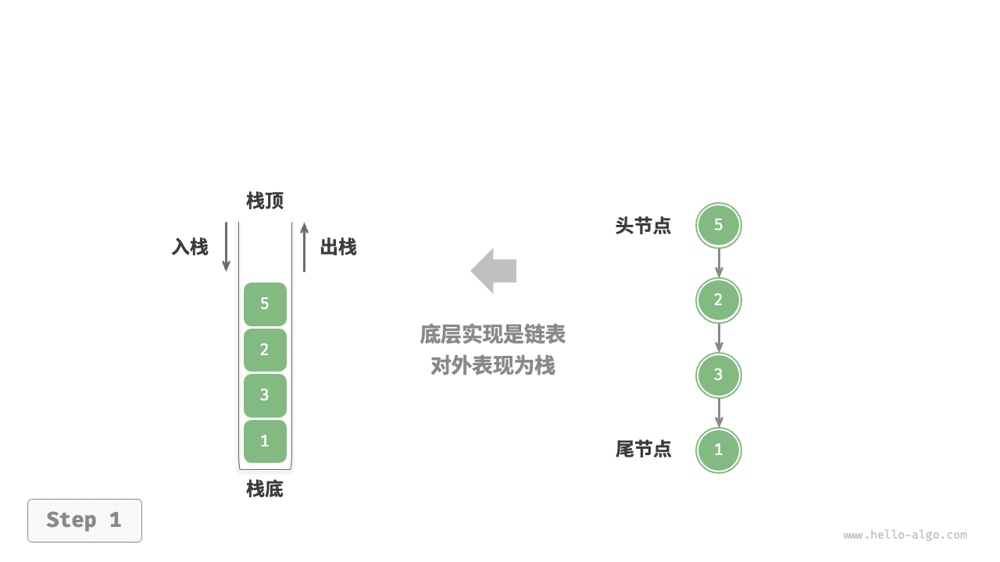
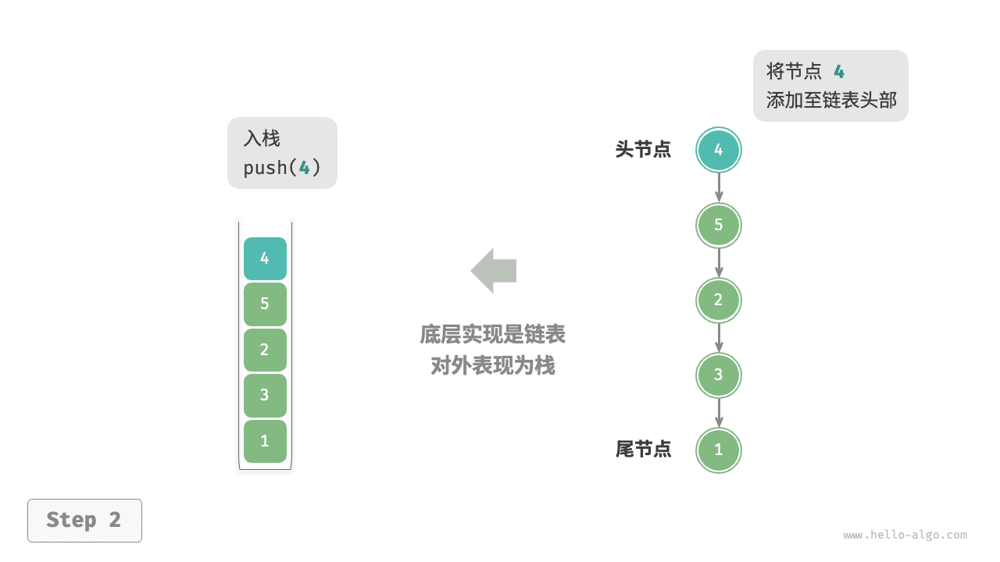
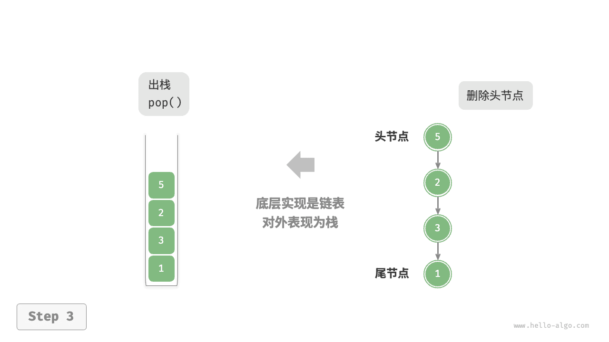
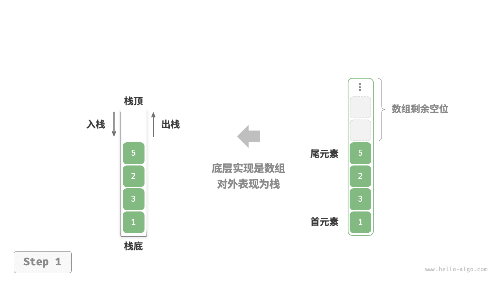
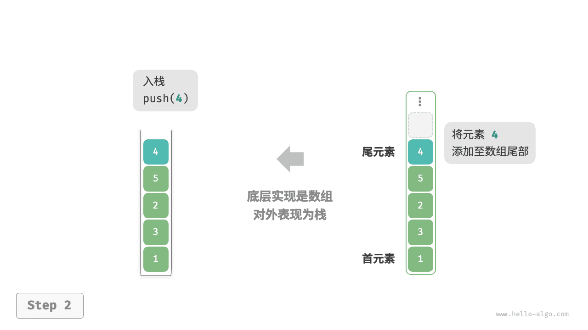
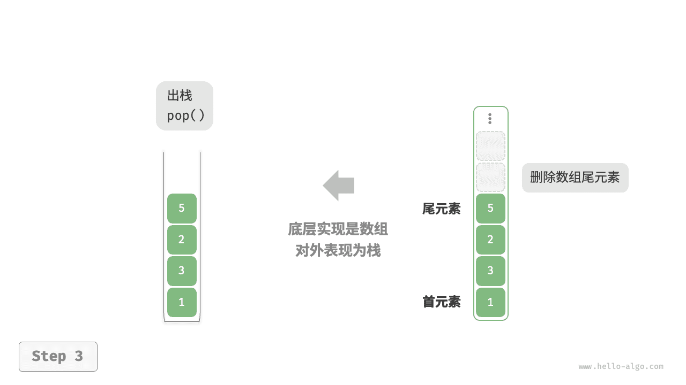

# 栈｜栈的实现

> 来源：[krahets 与《Hello 算法》开源贡献者](https://www.hello-algo.com/chapter_stack_and_queue/stack/)  
> 许可：[CC BY-NC-SA 4.0](https://creativecommons.org/licenses/by-nc-sa/4.0/)  
> 语言：原生简体中文  
> 版本：69932aed1891a7b7f6a0de88cd116d3fe13e7032  
> 署名：原作《Hello 算法》，作者 krahets 及开源贡献者。  
> 使用限制：仅限实验室内部、个人学习与其他非商业用途；改编内容须保持相同许可。

## 栈的实现

为了深入了解栈的运行机制，我们来尝试自己实现一个栈类。

栈遵循先入后出的原则，因此我们只能在栈顶添加或删除元素。然而，数组和链表都可以在任意位置添加和删除元素，**因此栈可以视为一种受限制的数组或链表**。换句话说，我们可以“屏蔽”数组或链表的部分无关操作，使其对外表现的逻辑符合栈的特性。

### 基于链表的实现

使用链表实现栈时，我们可以将链表的头节点视为栈顶，尾节点视为栈底。

如下图所示，对于入栈操作，我们只需将元素插入链表头部，这种节点插入方法被称为“头插法”。而对于出栈操作，只需将头节点从链表中删除即可。

=== "<1>"
    

=== "<2>"
    

=== "<3>"
    

以下是基于链表实现栈的示例代码：

```src
[file]{linkedlist_stack}-[class]{linked_list_stack}-[func]{}
```

### 基于数组的实现

使用数组实现栈时，我们可以将数组的尾部作为栈顶。如下图所示，入栈与出栈操作分别对应在数组尾部添加元素与删除元素，时间复杂度都为 $O(1)$ 。

=== "<1>"
    

=== "<2>"
    

=== "<3>"
    

由于入栈的元素可能会源源不断地增加，因此我们可以使用动态数组，这样就无须自行处理数组扩容问题。以下为示例代码：

```src
[file]{array_stack}-[class]{array_stack}-[func]{}
```
