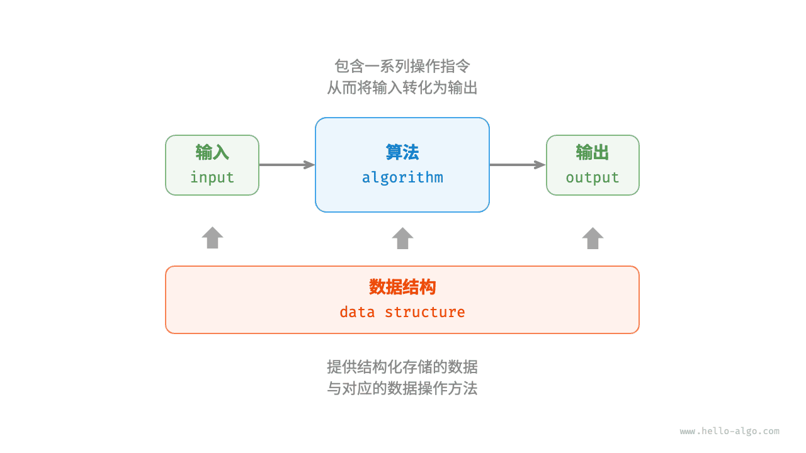

# 算法是什么｜数据结构与算法的关系

> 来源：[krahets 与《Hello 算法》开源贡献者](https://www.hello-algo.com/chapter_introduction/what_is_dsa/)  
> 许可：[CC BY-NC-SA 4.0](https://creativecommons.org/licenses/by-nc-sa/4.0/)  
> 语言：原生简体中文  
> 版本：69932aed1891a7b7f6a0de88cd116d3fe13e7032  
> 署名：原作《Hello 算法》，作者 krahets 及开源贡献者。  
> 使用限制：仅限实验室内部、个人学习与其他非商业用途；改编内容须保持相同许可。

## 数据结构与算法的关系

如下图所示，数据结构与算法高度相关、紧密结合，具体表现在以下三个方面。

- 数据结构是算法的基石。数据结构为算法提供了结构化存储的数据，以及操作数据的方法。
- 算法为数据结构注入生命力。数据结构本身仅存储数据信息，结合算法才能解决特定问题。
- 算法通常可以基于不同的数据结构实现，但执行效率可能相差很大，选择合适的数据结构是关键。

数据结构与算法犹如下图所示的拼装积木。一套积木，除了包含许多零件之外，还附有详细的组装说明书。我们按照说明书一步步操作，就能组装出精美的积木模型。

两者的详细对应关系如下表所示。

 表 <id> &nbsp; 将数据结构与算法类比为拼装积木 

| 数据结构与算法 | 拼装积木                                 |
| -------------- | ---------------------------------------- |
| 输入数据       | 未拼装的积木                             |
| 数据结构       | 积木组织形式，包括形状、大小、连接方式等 |
| 算法           | 把积木拼成目标形态的一系列操作步骤       |
| 输出数据       | 积木模型                                 |

值得说明的是，数据结构与算法是独立于编程语言的。正因如此，本书得以提供基于多种编程语言的实现。

!!! tip "约定俗成的简称"

    在实际讨论时，我们通常会将“数据结构与算法”简称为“算法”。比如众所周知的 LeetCode 算法题目，实际上同时考查数据结构和算法两方面的知识。
